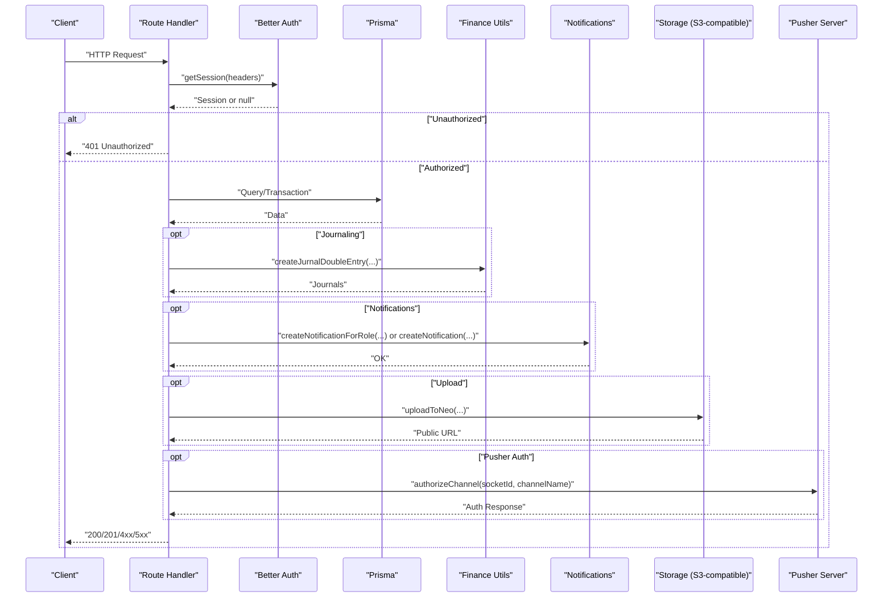
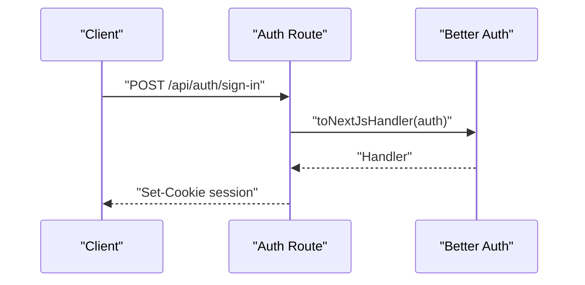
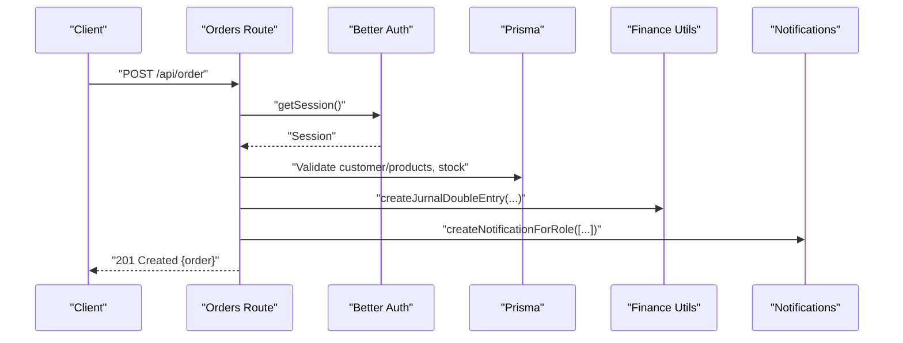
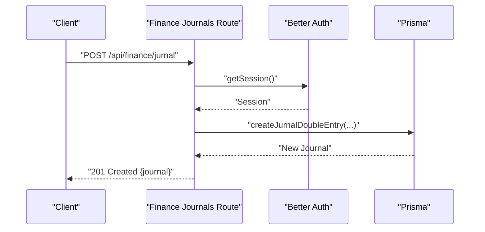
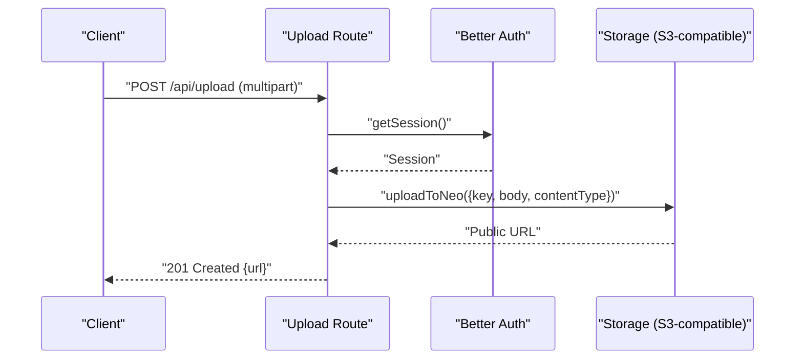
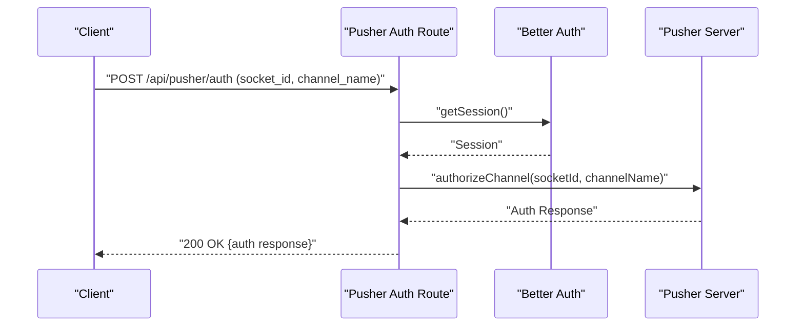
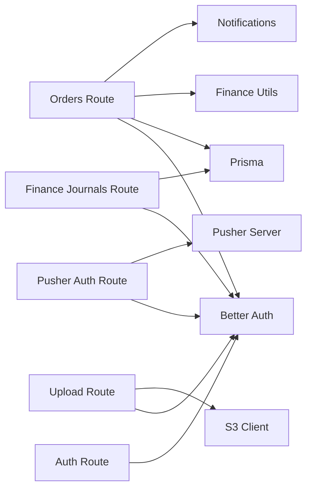

# API Reference

<cite>
**Referenced Files in This Document**
- [route.ts](file://src/app/api/auth/[...all]/route.ts)
- [auth.ts](file://src/lib/auth.ts)
- [route.ts](file://src/app/api/order/route.ts)
- [route.ts](file://src/app/api/order/[id]/route.ts)
- [route.ts](file://src/app/api/production/design-queue/route.ts)
- [route.ts](file://src/app/api/finance/jurnal/route.ts)
- [route.ts](file://src/app/api/finance/kas-bank/route.ts)
- [route.ts](file://src/app/api/admin/bahan-baku/route.ts)
- [route.ts](file://src/app/api/upload/route.ts)
- [route.ts](file://src/app/api/pusher/auth/route.ts)
- [pusher.ts](file://src/lib/pusher.ts)
- [storage.ts](file://src/lib/storage.ts)
- [route.ts](file://src/app/api/notifications/route.ts)
</cite>

## Table of Contents
1. [Introduction](#introduction)
2. [Project Structure](#project-structure)
3. [Core Components](#core-components)
4. [Architecture Overview](#architecture-overview)
5. [Detailed Component Analysis](#detailed-component-analysis)
6. [Dependency Analysis](#dependency-analysis)
7. [Performance Considerations](#performance-considerations)
8. [Troubleshooting Guide](#troubleshooting-guide)
9. [Conclusion](#conclusion)
10. [Appendices](#appendices)

## Introduction
This document provides comprehensive API documentation for the RESTful endpoints and real-time communication protocols of the Point-of-Sale (POS) system. It covers authentication, business logic APIs for orders, finance, production, and inventory, as well as real-time features powered by Pusher/Soketi and file uploads to cloud storage. The guide includes HTTP method, URL pattern, request/response schemas, authentication requirements, error codes, success indicators, versioning strategy, rate limiting, security considerations, practical usage examples, client implementation guidelines, integration patterns, testing strategies, debugging tools, and performance optimization tips.

## Project Structure
The API surface is organized under Next.js App Router conventions with route handlers grouped by functional domains:
- Authentication: centralized via Better Auth integration
- Business logic:
  - Orders: creation, listing, updates, cancellation
  - Finance: journals, cash/bank accounts
  - Production: design queue
  - Inventory/Admin: raw materials management
- Real-time:
  - Pusher/Soketi channel authorization for private channels
- File upload:
  - Image upload to S3-compatible object storage
- Notifications:
  - User-specific notifications retrieval and management

```mermaid
graph TB
subgraph "Authentication"
AUTH["Better Auth<br/>auth.ts"]
AUTH_ROUTE["Auth Route Handler<br/>api/auth/[...all]/route.ts"]
end
subgraph "Business Logic"
ORD_LIST["Orders List/Create<br/>api/order/route.ts"]
ORD_DETAIL["Order Detail/Update/Delete<br/>api/order/[id]/route.ts"]
FIN_JRN["Finance Journals<br/>api/finance/jurnal/route.ts"]
FIN_KAS["Cash/Bank Accounts<br/>api/finance/kas-bank/route.ts"]
PROD_DQ["Production Design Queue<br/>api/production/design-queue/route.ts"]
INV_ADMIN["Admin Inventory (Raw Materials)<br/>api/admin/bahan-baku/route.ts"]
end
subgraph "Real-time"
PUSHER_AUTH["Pusher Auth<br/>api/pusher/auth/route.ts"]
PUSHER_LIB["Pusher Client Config<br/>lib/pusher.ts"]
end
subgraph "Upload"
UPLOAD["Image Upload<br/>api/upload/route.ts"]
STORAGE["S3-Compatible Storage<br/>lib/storage.ts"]
end
subgraph "Notifications"
NOTIF["User Notifications<br/>api/notifications/route.ts"]
end
AUTH_ROUTE --> AUTH
ORD_LIST --> AUTH
ORD_DETAIL --> AUTH
FIN_JRN --> AUTH
FIN_KAS --> AUTH
PROD_DQ --> AUTH
INV_ADMIN --> AUTH
PUSHER_AUTH --> AUTH
UPLOAD --> AUTH
NOTIF --> AUTH
PUSHER_AUTH --> PUSHER_LIB
UPLOAD --> STORAGE
```



**Diagram sources**
- [route.ts:1-4](file://src/app/api/auth/[...all]/route.ts#L1-L4)
- [auth.ts:1-95](file://src/lib/auth.ts#L1-L95)
- [route.ts:1-443](file://src/app/api/order/route.ts#L1-L443)
- [route.ts:1-615](file://src/app/api/order/[id]/route.ts#L1-L615)
- [route.ts:1-169](file://src/app/api/finance/jurnal/route.ts#L1-L169)
- [route.ts:1-112](file://src/app/api/finance/kas-bank/route.ts#L1-L112)
- [route.ts:1-152](file://src/app/api/production/design-queue/route.ts#L1-L152)
- [route.ts:1-195](file://src/app/api/admin/bahan-baku/route.ts#L1-L195)
- [route.ts:1-41](file://src/app/api/pusher/auth/route.ts#L1-L41)
- [pusher.ts:1-11](file://src/lib/pusher.ts#L1-L11)
- [route.ts:1-76](file://src/app/api/upload/route.ts#L1-L76)
- [storage.ts:1-91](file://src/lib/storage.ts#L1-L91)
- [route.ts:1-77](file://src/app/api/notifications/route.ts#L1-L77)

**Section sources**
- [route.ts:1-4](file://src/app/api/auth/[...all]/route.ts#L1-L4)
- [auth.ts:1-95](file://src/lib/auth.ts#L1-L95)

## Core Components
- Authentication API
  - Path: /api/auth/[...all]
  - Methods: GET, POST
  - Description: Better Auth integration for email/password and session management. Hooks enforce domain validation and normalize user names during sign-up. Password hashing and verification are handled by Argon2. Session expiry is configured to 30 days. Admin plugin defines roles and permissions.
  - Authentication requirement: None for sign-up/sign-in endpoints; session required for protected routes.
  - Error codes: BAD_REQUEST for invalid domain; standard HTTP 401/403 for unauthorized/forbidden.
  - Example usage: Client calls POST /api/auth/sign-in to authenticate and receives session cookies; subsequent requests include cookies for protected endpoints.

- Orders API
  - Base path: /api/order
  - Methods: GET, POST
  - Description: Lists orders with pagination, filters, and sorting; creates orders with validations for customer/product existence, stock availability, discount, shipping, and payment conditions. Generates order numbers based on settings and applies journal entries for receivables and payments.
  - Authentication requirement: admin, kasir, designer, produksi, gudang.
  - Success indicators: 200 OK for listing; 201 Created for successful creation; 400/404/500 for errors.
  - Example usage: GET /api/order?page=1&limit=20&search=ABC&statusProduksi=PENDING; POST /api/order with order payload.

- Order Detail API
  - Path: /api/order/[id]
  - Methods: GET, PATCH, DELETE
  - Description: Retrieves order detail with items, design files, SPK, and payments; updates order fields with role-based restrictions; deletes order with cascading soft deletes and inventory adjustments.
  - Authentication requirement: admin, kasir, designer, produksi, gudang.
  - Success indicators: 200 OK; 201 Created on replacement items; 400/403/404/500 for errors.
  - Example usage: PATCH /api/order/{id} to update status or finalize design; DELETE /api/order/{id} for cancellation.

- Finance Journals API
  - Path: /api/finance/jurnal
  - Methods: GET, POST, DELETE
  - Description: Lists journals with date range and search; creates manual or reversal journal entries; deletes journal with cascading soft delete to related records.
  - Authentication requirement: admin, kasir.
  - Success indicators: 200 OK; 201 Created for new entries; 400/403/404/500 for errors.
  - Example usage: GET /api/finance/jurnal?bulan=3&tahun=2026&search=gaji; POST /api/finance/jurnal to record double-entry; DELETE /api/finance/jurnal?id=xxx.

- Cash/Bank Accounts API
  - Path: /api/finance/kas-bank
  - Methods: GET, PATCH
  - Description: Lists cash/bank accounts optionally filtered by type; updates account metadata.
  - Authentication requirement: admin, kasir.
  - Success indicators: 200 OK; 400/403/500 for errors.
  - Example usage: GET /api/finance/kas-bank?jenisRekening=BCA; PATCH /api/finance/kas-bank to update account info.

- Production Design Queue API
  - Path: /api/production/design-queue
  - Methods: GET
  - Description: Lists design queue orders with filters for search, file presence, designer, and review status; supports sorting by creation date or deadline.
  - Authentication requirement: admin, designer, produksi, kasir.
  - Success indicators: 200 OK; 500 for errors.
  - Example usage: GET /api/production/design-queue?page=1&limit=18&search=ABC&hasFile=true.

- Admin Inventory (Raw Materials) API
  - Path: /api/admin/bahan-baku
  - Methods: GET, POST, DELETE
  - Description: Lists raw materials with filters and optional stock status filtering; creates new raw materials; bulk deletes.
  - Authentication requirement: admin, gudang.
  - Success indicators: 200 OK; 201 Created; 400/403/500 for errors.
  - Example usage: GET /api/admin/bahan-baku?page=1&limit=10&search=ABC&stokFilter=menipis; POST /api/admin/bahan-baku to add raw material.

- File Upload API
  - Path: /api/upload
  - Methods: POST
  - Description: Uploads images to S3-compatible object storage (Neo Object Storage); validates content type and size; generates a public URL.
  - Authentication requirement: authenticated user.
  - Success indicators: 201 Created with public URL; 400/401/500 for errors.
  - Example usage: POST /api/upload with multipart/form-data containing file and optional folder.

- Pusher/Soketi Real-time Auth API
  - Path: /api/pusher/auth
  - Methods: POST
  - Description: Authorizes subscription to private channels for the authenticated user; enforces channel ownership.
  - Authentication requirement: authenticated user.
  - Success indicators: 200 OK with auth response; 400/401/403/500 for errors.
  - Example usage: Client sends socket_id and channel_name to /api/pusher/auth; server responds with Pusher auth signature.

- Notifications API
  - Path: /api/notifications
  - Methods: GET, PATCH, DELETE
  - Description: Retrieves user notifications with optional unread-only filter; marks all as read; deletes all notifications.
  - Authentication requirement: authenticated user.
  - Success indicators: 200 OK; 401/500 for errors.
  - Example usage: GET /api/notifications?unreadOnly=true&limit=50; PATCH /api/notifications/read-all; DELETE /api/notifications.

**Section sources**
- [route.ts:1-4](file://src/app/api/auth/[...all]/route.ts#L1-L4)
- [auth.ts:1-95](file://src/lib/auth.ts#L1-L95)
- [route.ts:1-443](file://src/app/api/order/route.ts#L1-L443)
- [route.ts:1-615](file://src/app/api/order/[id]/route.ts#L1-L615)
- [route.ts:1-169](file://src/app/api/finance/jurnal/route.ts#L1-L169)
- [route.ts:1-112](file://src/app/api/finance/kas-bank/route.ts#L1-L112)
- [route.ts:1-152](file://src/app/api/production/design-queue/route.ts#L1-L152)
- [route.ts:1-195](file://src/app/api/admin/bahan-baku/route.ts#L1-L195)
- [route.ts:1-76](file://src/app/api/upload/route.ts#L1-L76)
- [route.ts:1-41](file://src/app/api/pusher/auth/route.ts#L1-L41)
- [pusher.ts:1-11](file://src/lib/pusher.ts#L1-L11)
- [storage.ts:1-91](file://src/lib/storage.ts#L1-L91)
- [route.ts:1-77](file://src/app/api/notifications/route.ts#L1-L77)

## Architecture Overview
The system integrates authentication, business logic, storage, and real-time messaging as follows:
- Authentication: Better Auth manages sessions and roles; route handlers delegate session checks to auth.api.getSession.
- Business logic: Route handlers orchestrate Prisma queries, financial journaling, notifications, and inventory adjustments.
- Storage: S3-compatible client uploads images to object storage and returns public URLs.
- Real-time: Pusher/Soketi server authorizes subscriptions to private channels scoped to the authenticated user.



**Diagram sources**
- [auth.ts:1-95](file://src/lib/auth.ts#L1-L95)
- [route.ts:1-443](file://src/app/api/order/route.ts#L1-L443)
- [route.ts:1-169](file://src/app/api/finance/jurnal/route.ts#L1-L169)
- [route.ts:1-76](file://src/app/api/upload/route.ts#L1-L76)
- [route.ts:1-41](file://src/app/api/pusher/auth/route.ts#L1-L41)
- [pusher.ts:1-11](file://src/lib/pusher.ts#L1-L11)
- [storage.ts:1-91](file://src/lib/storage.ts#L1-L91)

## Detailed Component Analysis

### Authentication API
- Endpoint: /api/auth/[...all]
- Methods: GET, POST
- Authentication: None for sign-up/sign-in; session required for protected routes.
- Behavior:
  - Sign-up hook validates email domain and normalizes name.
  - Password hashing/verification via Argon2.
  - Session expiry: 30 days.
  - Roles: admin, kasir, designer, produksi, gudang.
- Responses:
  - 200 OK on success; 400 BAD_REQUEST for invalid domain; 401/403 for unauthorized/forbidden.
- Implementation note: Route handler delegates to Better Auth’s Next.js adapter.



**Diagram sources**
- [route.ts:1-4](file://src/app/api/auth/[...all]/route.ts#L1-L4)
- [auth.ts:1-95](file://src/lib/auth.ts#L1-L95)

**Section sources**
- [route.ts:1-4](file://src/app/api/auth/[...all]/route.ts#L1-L4)
- [auth.ts:1-95](file://src/lib/auth.ts#L1-L95)

### Orders API
- Endpoint: /api/order
- Methods: GET, POST
- Authentication: admin, kasir, designer, produksi, gudang.
- GET parameters:
  - page, limit, search, statusProduksi, statusPembayaran, customerId, sortBy.
- Validation and behavior:
  - Stock checks for non-service products.
  - Automatic deadline calculation based on settings.
  - Journal entries for receivables and payments.
  - Notification broadcast to relevant roles.
- Responses:
  - 200 OK with paginated results; 201 Created on success; 400/404/500 for errors.



**Diagram sources**
- [route.ts:1-443](file://src/app/api/order/route.ts#L1-L443)

**Section sources**
- [route.ts:1-443](file://src/app/api/order/route.ts#L1-L443)

### Order Detail API
- Endpoint: /api/order/[id]
- Methods: GET, PATCH, DELETE
- Authentication: admin, kasir, designer, produksi, gudang.
- PATCH behavior:
  - Role-based field updates (admin can modify more fields).
  - Designer claims and finalization logic with notifications.
  - Review status transitions with targeted notifications.
  - Inventory adjustments when order reaches “SELESAI”.
- DELETE behavior:
  - Admin-only deletion with cascading soft deletes.
  - Inventory restoration if previously adjusted.

```mermaid
flowchart TD
Start([PATCH /api/order/[id]]) --> CheckRole["Check Role-Based Permissions"]
CheckRole --> Allowed{"Allowed?"}
Allowed --> |No| Return403["Return 403 Forbidden"]
Allowed --> |Yes| ValidateFields["Validate Fields"]
ValidateFields --> UpdateOrder["Update Order"]
UpdateOrder --> StatusChange{"Status Produksi Updated?"}
StatusChange --> |Yes| Notify["Notify Roles"]
StatusChange --> |No| Continue["Continue"]
Notify --> Continue
Continue --> Finalize["Finalize/Replace Items if Admin"]
Finalize --> Return200["Return 200 OK"]
```

**Diagram sources**
- [route.ts:1-615](file://src/app/api/order/[id]/route.ts#L1-L615)

**Section sources**
- [route.ts:1-615](file://src/app/api/order/[id]/route.ts#L1-L615)

### Finance Journals API
- Endpoint: /api/finance/jurnal
- Methods: GET, POST, DELETE
- Authentication: admin, kasir.
- GET parameters:
  - bulan, tahun, search, limit.
- POST fields:
  - tanggal, keterangan, namaBiaya, buktiNota, akunDebetId, akunKreditId, nominal, isReversal, reversalOfRef.
- DELETE requires id.



**Diagram sources**
- [route.ts:1-169](file://src/app/api/finance/jurnal/route.ts#L1-L169)

**Section sources**
- [route.ts:1-169](file://src/app/api/finance/jurnal/route.ts#L1-L169)

### Cash/Bank Accounts API
- Endpoint: /api/finance/kas-bank
- Methods: GET, PATCH
- Authentication: admin, kasir.
- GET parameters:
  - jenisRekening.
- PATCH fields:
  - id, namaRekening, jenisRekening, nomorRekening, isActive.

**Section sources**
- [route.ts:1-112](file://src/app/api/finance/kas-bank/route.ts#L1-L112)

### Production Design Queue API
- Endpoint: /api/production/design-queue
- Methods: GET
- Authentication: admin, designer, produksi, kasir.
- GET parameters:
  - page, limit, search, hasFile, sortBy, designerId, reviewStatus.

**Section sources**
- [route.ts:1-152](file://src/app/api/production/design-queue/route.ts#L1-L152)

### Admin Inventory (Raw Materials) API
- Endpoint: /api/admin/bahan-baku
- Methods: GET, POST, DELETE
- Authentication: admin, gudang.
- GET parameters:
  - page, limit, all, search, isActive, stokFilter.
- POST fields:
  - nama, unitId, stok, minStok, keterangan.
- DELETE requires ids array.

**Section sources**
- [route.ts:1-195](file://src/app/api/admin/bahan-baku/route.ts#L1-L195)

### File Upload API
- Endpoint: /api/upload
- Methods: POST
- Authentication: authenticated user.
- Form fields:
  - file (required, image/*), folder (optional).
- Constraints:
  - Content-Type must start with image/.
  - Size ≤ 5MB.
- Returns:
  - 201 Created with public URL; 400/401/500 for errors.



**Diagram sources**
- [route.ts:1-76](file://src/app/api/upload/route.ts#L1-L76)
- [storage.ts:1-91](file://src/lib/storage.ts#L1-L91)

**Section sources**
- [route.ts:1-76](file://src/app/api/upload/route.ts#L1-L76)
- [storage.ts:1-91](file://src/lib/storage.ts#L1-L91)

### Pusher/Soketi Real-time Auth API
- Endpoint: /api/pusher/auth
- Methods: POST
- Authentication: authenticated user.
- Body parameters:
  - socket_id, channel_name.
- Security:
  - Validates channel ownership (private-user-{userId}).
- Returns:
  - 200 OK with auth response; 400/401/403/500 for errors.



**Diagram sources**
- [route.ts:1-41](file://src/app/api/pusher/auth/route.ts#L1-L41)
- [pusher.ts:1-11](file://src/lib/pusher.ts#L1-L11)

**Section sources**
- [route.ts:1-41](file://src/app/api/pusher/auth/route.ts#L1-L41)
- [pusher.ts:1-11](file://src/lib/pusher.ts#L1-L11)

### Notifications API
- Endpoint: /api/notifications
- Methods: GET, PATCH, DELETE
- Authentication: authenticated user.
- GET parameters:
  - unreadOnly, limit.
- PATCH: mark all as read.
- DELETE: delete all.

**Section sources**
- [route.ts:1-77](file://src/app/api/notifications/route.ts#L1-L77)

## Dependency Analysis
- Authentication dependency chain:
  - Route handlers depend on auth.api.getSession for session validation.
  - Better Auth manages cookies, roles, and hooks.
- Business logic dependencies:
  - Prisma for data persistence.
  - Finance utilities for double-entry journaling.
  - Notifications service for broadcasting.
- Real-time dependency:
  - Pusher server instance configured with environment variables.
- Storage dependency:
  - AWS SDK S3 client configured for S3-compatible endpoint.
- Coupling and cohesion:
  - Route handlers encapsulate business logic and error handling.
  - Utilities isolate concerns (auth, storage, finance, notifications).



**Diagram sources**
- [auth.ts:1-95](file://src/lib/auth.ts#L1-L95)
- [route.ts:1-443](file://src/app/api/order/route.ts#L1-L443)
- [route.ts:1-169](file://src/app/api/finance/jurnal/route.ts#L1-L169)
- [route.ts:1-76](file://src/app/api/upload/route.ts#L1-L76)
- [route.ts:1-41](file://src/app/api/pusher/auth/route.ts#L1-L41)
- [pusher.ts:1-11](file://src/lib/pusher.ts#L1-L11)
- [storage.ts:1-91](file://src/lib/storage.ts#L1-L91)

**Section sources**
- [auth.ts:1-95](file://src/lib/auth.ts#L1-L95)
- [route.ts:1-443](file://src/app/api/order/route.ts#L1-L443)
- [route.ts:1-169](file://src/app/api/finance/jurnal/route.ts#L1-L169)
- [route.ts:1-76](file://src/app/api/upload/route.ts#L1-L76)
- [route.ts:1-41](file://src/app/api/pusher/auth/route.ts#L1-L41)
- [pusher.ts:1-11](file://src/lib/pusher.ts#L1-L11)
- [storage.ts:1-91](file://src/lib/storage.ts#L1-L91)

## Performance Considerations
- Pagination and limits:
  - Use page and limit query parameters to avoid large payloads.
  - Prefer limit caps (e.g., 50 for journals, 18 for design queue) to prevent overfetching.
- Efficient queries:
  - Use selective field projections (select) to minimize data transfer.
  - Combine counts and lists with Promise.all for reduced round-trips.
- Transactions:
  - Group related writes (e.g., order creation, journal entries, notifications) in a single transaction to maintain consistency and reduce overhead.
- Caching:
  - Cache frequently accessed static data (e.g., chart periods) at the client level.
- Real-time:
  - Subscribe only to necessary channels and unsubscribe when leaving pages.
- Uploads:
  - Enforce client-side size/type checks before upload to reduce server load.

## Troubleshooting Guide
- Authentication failures:
  - 401 Unauthorized: Missing or invalid session cookie; re-authenticate.
  - 403 Forbidden: Insufficient role or permissions; verify user role.
- Business logic errors:
  - 400 Bad Request: Validation failures (missing fields, invalid stock, invalid statuses).
  - 404 Not Found: Resource not found (e.g., customer, order).
  - 500 Internal Server Error: Unexpected server errors; check logs.
- Finance operations:
  - Ensure debet and kredit accounts differ; verify account existence.
  - Journal deletions cascade to related records; confirm impact before deleting.
- Upload issues:
  - Ensure file is image/* and ≤ 5MB; verify folder parameter is safe.
- Real-time:
  - Verify socket_id and channel_name are present; ensure channel matches private-user-{userId}.
- Debugging tools:
  - Enable logging around route handlers and utilities.
  - Use browser dev tools network tab to inspect requests/responses.
  - Validate environment variables for Pusher and S3-compatible storage.

**Section sources**
- [route.ts:1-443](file://src/app/api/order/route.ts#L1-L443)
- [route.ts:1-615](file://src/app/api/order/[id]/route.ts#L1-L615)
- [route.ts:1-169](file://src/app/api/finance/jurnal/route.ts#L1-L169)
- [route.ts:1-76](file://src/app/api/upload/route.ts#L1-L76)
- [route.ts:1-41](file://src/app/api/pusher/auth/route.ts#L1-L41)

## Conclusion
The API suite provides a robust foundation for managing orders, finances, production, inventory, real-time communications, and file uploads. Authentication is centralized via Better Auth with role-based access control. Business logic is encapsulated in route handlers with clear validation, transactions, and notifications. Real-time features leverage Pusher/Soketi with secure channel authorization, while file uploads integrate with S3-compatible storage. Adhering to the documented patterns ensures reliable integrations and scalable operations.

## Appendices
- API versioning strategy:
  - No explicit versioning scheme observed; consider adding a version prefix (e.g., /api/v1/...) to manage breaking changes.
- Rate limiting:
  - No built-in rate limiting detected; implement at the edge (e.g., CDN, reverse proxy) or middleware if needed.
- Security considerations:
  - Always validate and sanitize inputs; enforce role-based access control; use HTTPS; rotate secrets regularly.
- Practical examples:
  - Authentication: POST /api/auth/sign-in with email/password; use returned session cookies for subsequent requests.
  - Orders: POST /api/order with items and payment details; handle returned order ID for updates.
  - Uploads: POST /api/upload with multipart form; use returned public URL to reference the file.
  - Real-time: Call /api/pusher/auth with socket_id and channel_name; subscribe to private-user-{userId}.