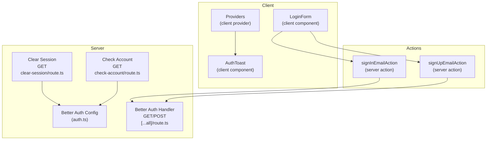
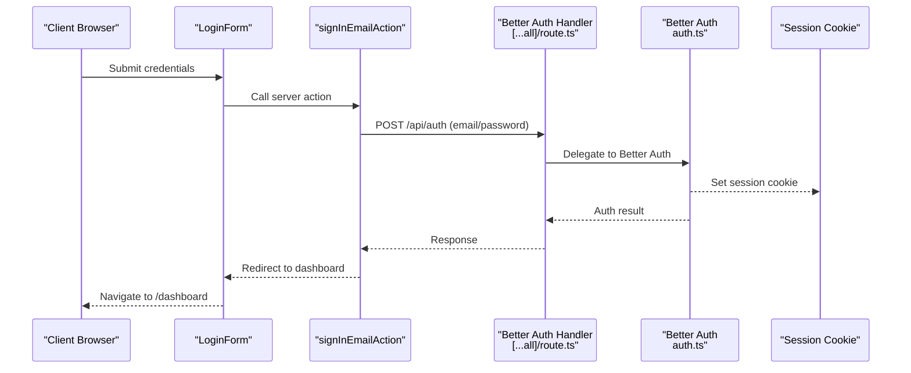
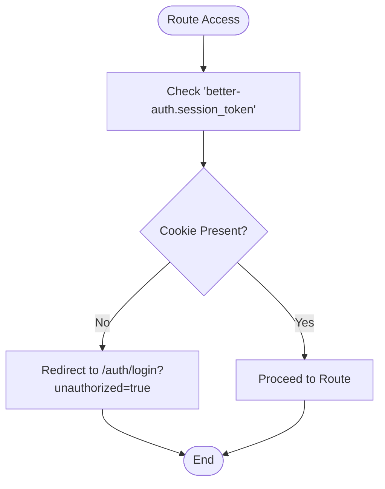
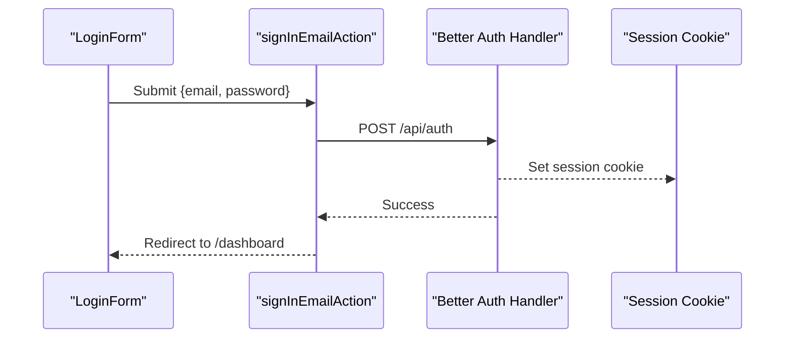
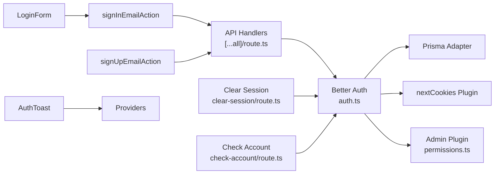

# Authentication API

<cite>
**Referenced Files in This Document**
- [auth.ts](file://src/lib/auth.ts)
- [auth-client.ts](file://src/lib/auth-client.ts)
- [[...all]/route.ts](file://src/app/api/auth/[...all]/route.ts)
- [clear-session/route.ts](file://src/app/api/auth/clear-session/route.ts)
- [check-account/route.ts](file://src/app/api/check-account/route.ts)
- [sign-in-email.action.ts](file://src/actions/sign-in-email.action.ts)
- [sign-up-email.action.ts](file://src/actions/sign-up-email.action.ts)
- [login-form.tsx](file://src/components/login-form.tsx)
- [page.tsx](file://src/app/page.tsx)
- [security-section.tsx](file://src/app/(LoggedIn)/settings/security/security-section.tsx)
- [proxy.ts](file://src/proxy.ts)
- [auth-toast.tsx](file://src/components/auth-toast.tsx)
- [providers.tsx](file://src/app/providers.tsx)
- [permissions.ts](file://src/lib/permissions.ts)
</cite>

## Table of Contents
1. [Introduction](#introduction)
2. [Project Structure](#project-structure)
3. [Core Components](#core-components)
4. [Architecture Overview](#architecture-overview)
5. [Detailed Component Analysis](#detailed-component-analysis)
6. [Dependency Analysis](#dependency-analysis)
7. [Performance Considerations](#performance-considerations)
8. [Troubleshooting Guide](#troubleshooting-guide)
9. [Conclusion](#conclusion)
10. [Appendices](#appendices)

## Introduction
This document provides comprehensive API documentation for the authentication system powered by Better Auth. It covers HTTP endpoints, request/response schemas, authentication requirements, session management, account verification linkage, and integration patterns for email/password and OAuth flows. It also explains middleware, session validation, token management, security considerations, rate limiting, and session timeout handling.

## Project Structure
The authentication system is implemented using Better Auth with Next.js handlers and React client utilities. Key areas:
- Backend API routes under src/app/api/auth handle Better Auth endpoints.
- Session clearing endpoint clears the session cookie and redirects to login.
- Account verification endpoint checks linked providers for the current session.
- Client-side actions encapsulate sign-in and sign-up flows.
- Frontend components integrate with Better Auth client and show feedback.

**Diagram sources**
- [auth.ts:20-92](file://src/lib/auth.ts#L20-L92)
- [[...all]/route.ts:1-4](file://src/app/api/auth/[...all]/route.ts#L1-L4)
- [clear-session/route.ts:1-12](file://src/app/api/auth/clear-session/route.ts#L1-L12)
- [check-account/route.ts:1-41](file://src/app/api/check-account/route.ts#L1-L41)
- [sign-in-email.action.ts:13-41](file://src/actions/sign-in-email.action.ts#L13-L41)
- [sign-up-email.action.ts:12-30](file://src/actions/sign-up-email.action.ts#L12-L30)
- [login-form.tsx:28-41](file://src/components/login-form.tsx#L28-L41)
- [auth-toast.tsx:7-47](file://src/components/auth-toast.tsx#L7-L47)
- [providers.tsx:6-13](file://src/app/providers.tsx#L6-L13)

**Section sources**
- [auth.ts:20-92](file://src/lib/auth.ts#L20-L92)
- [[...all]/route.ts:1-4](file://src/app/api/auth/[...all]/route.ts#L1-L4)
- [clear-session/route.ts:1-12](file://src/app/api/auth/clear-session/route.ts#L1-L12)
- [check-account/route.ts:1-41](file://src/app/api/check-account/route.ts#L1-L41)
- [sign-in-email.action.ts:13-41](file://src/actions/sign-in-email.action.ts#L13-L41)
- [sign-up-email.action.ts:12-30](file://src/actions/sign-up-email.action.ts#L12-L30)
- [login-form.tsx:28-41](file://src/components/login-form.tsx#L28-L41)
- [auth-toast.tsx:7-47](file://src/components/auth-toast.tsx#L7-L47)
- [providers.tsx:6-13](file://src/app/providers.tsx#L6-L13)

## Core Components
- Better Auth configuration defines database adapter, hooks, plugins, session expiry, and email/password policy.
- Next.js handler bridges Better Auth to Next.js routes.
- Clear session endpoint deletes the session cookie and redirects to login with an unauthorized flag.
- Check account endpoint validates the session and returns linked provider IDs for the current user.
- Client actions encapsulate sign-in and sign-up flows, handling Better Auth API errors and returning user-friendly messages.
- Frontend components integrate with the Better Auth client and display feedback.

**Section sources**
- [auth.ts:20-92](file://src/lib/auth.ts#L20-L92)
- [[...all]/route.ts:1-4](file://src/app/api/auth/[...all]/route.ts#L1-L4)
- [clear-session/route.ts:4-11](file://src/app/api/auth/clear-session/route.ts#L4-L11)
- [check-account/route.ts:6-40](file://src/app/api/check-account/route.ts#L6-L40)
- [sign-in-email.action.ts:13-84](file://src/actions/sign-in-email.action.ts#L13-L84)
- [sign-up-email.action.ts:12-84](file://src/actions/sign-up-email.action.ts#L12-L84)
- [login-form.tsx:28-41](file://src/components/login-form.tsx#L28-L41)

## Architecture Overview
The authentication architecture integrates Better Auth on the backend with Next.js API routes and React client utilities. The client sends requests to Better Auth endpoints, receives session cookies, and the server validates sessions for protected resources.

**Diagram sources**
- [login-form.tsx:28-41](file://src/components/login-form.tsx#L28-L41)
- [sign-in-email.action.ts:35-41](file://src/actions/sign-in-email.action.ts#L35-L41)
- [[...all]/route.ts:1-4](file://src/app/api/auth/[...all]/route.ts#L1-L4)
- [auth.ts:20-92](file://src/lib/auth.ts#L20-L92)

## Detailed Component Analysis

### Better Auth Configuration
- Database adapter configured with Prisma and MySQL.
- Hooks and database hooks for pre-sign-up normalization and avatar assignment.
- Session expiration configured to 30 days.
- Email/password policy: minimum length, hashing/verification via Argon2, auto sign-in disabled.
- Plugins include nextCookies for cookie handling and admin role-based access control.

**Section sources**
- [auth.ts:20-92](file://src/lib/auth.ts#L20-L92)

### Authentication Middleware and Session Validation
- Protected routes rely on session presence. The proxy enforces redirection to login if no session cookie is present.
- The homepage checks for an existing session and redirects accordingly.
- The check-account endpoint validates the session and returns linked provider IDs for the current user.

**Diagram sources**
- [proxy.ts:45-56](file://src/proxy.ts#L45-L56)
- [page.tsx:5-14](file://src/app/page.tsx#L5-L14)

**Section sources**
- [proxy.ts:45-56](file://src/proxy.ts#L45-L56)
- [page.tsx:5-14](file://src/app/page.tsx#L5-L14)
- [check-account/route.ts:6-18](file://src/app/api/check-account/route.ts#L6-L18)

### Login Endpoint (Email/Password)
- Endpoint: POST /api/auth
- Purpose: Authenticate users with email and password.
- Request body:
  - email: string (required)
  - password: string (required)
- Response:
  - Success: 200 OK with session established via cookie.
  - Error: 400/401/429/500 with error code/message.
- Authentication requirement: None for this endpoint; session cookie is set upon success.
- Client integration: LoginForm triggers signInEmailAction which calls Better Auth API.

**Diagram sources**
- [login-form.tsx:28-41](file://src/components/login-form.tsx#L28-L41)
- [sign-in-email.action.ts:35-41](file://src/actions/sign-in-email.action.ts#L35-L41)
- [[...all]/route.ts:1-4](file://src/app/api/auth/[...all]/route.ts#L1-L4)

**Section sources**
- [[...all]/route.ts:1-4](file://src/app/api/auth/[...all]/route.ts#L1-L4)
- [sign-in-email.action.ts:13-84](file://src/actions/sign-in-email.action.ts#L13-L84)
- [login-form.tsx:28-41](file://src/components/login-form.tsx#L28-L41)

### Logout and Session Clearing
- Endpoint: GET /api/auth/clear-session
- Purpose: Delete the session cookie and redirect to login with an unauthorized flag.
- Behavior: Deletes "better-auth.session_token" and redirects to /auth/login?unauthorized=true.
- Authentication requirement: Not required; intended to clear local session state.

**Section sources**
- [clear-session/route.ts:4-11](file://src/app/api/auth/clear-session/route.ts#L4-L11)

### Session Management and Verification
- Endpoint: GET /api/check-account
- Purpose: Verify session validity and return linked provider IDs for the current user.
- Request: Authorization via session cookie.
- Response:
  - Success: 200 OK with JSON { providerId: string[] }.
  - Unauthorized: 401 with error message.
  - Error: 500 with error message.
- Typical provider IDs: "credential" (email/password), "google" (OAuth).

**Section sources**
- [check-account/route.ts:6-40](file://src/app/api/check-account/route.ts#L6-L40)
- [security-section.tsx:141-156](file://src/app/(LoggedIn)/settings/security/security-section.tsx#L141-L156)

### Account Registration (Email/Password)
- Endpoint: POST /api/auth (via Better Auth handler)
- Purpose: Create a new user account with email and password.
- Request body:
  - name: string (required)
  - email: string (required)
  - password: string (required)
- Response:
  - Success: 200 OK with session established.
  - Error: 400/422/500 with error code/message.
- Pre-sign-up hook:
  - Validates allowed domains.
  - Normalizes user name before creation.

**Section sources**
- [auth.ts:24-48](file://src/lib/auth.ts#L24-L48)
- [sign-up-email.action.ts:12-84](file://src/actions/sign-up-email.action.ts#L12-L84)
- [auth.ts:66-77](file://src/lib/auth.ts#L66-L77)

### OAuth Flows (Google)
- Provider: Google
- Integration:
  - Client configuration includes admin client plugin with roles and access control.
  - UI displays linked accounts; if "google" is present, the account is linked via Google.
- Typical flow:
  - Client initiates OAuth via Better Auth client.
  - Backend Better Auth handler manages OAuth callbacks.
  - Session cookie is set upon successful OAuth login.
- Linked accounts detection:
  - Check-account endpoint returns providerId array including "google" when linked.

**Section sources**
- [auth-client.ts:12-26](file://src/lib/auth-client.ts#L12-L26)
- [security-section.tsx:141-156](file://src/app/(LoggedIn)/settings/security/security-section.tsx#L141-L156)
- [check-account/route.ts:20-31](file://src/app/api/check-account/route.ts#L20-L31)

### Token Management and Session Expiry
- Session expiry: 30 days.
- Cookies: Managed via nextCookies plugin; session cookie name is "better-auth.session_token".
- Timeout handling: After expiry, session becomes invalid; clients should re-authenticate.

**Section sources**
- [auth.ts:66-68](file://src/lib/auth.ts#L66-L68)
- [clear-session/route.ts:6](file://src/app/api/auth/clear-session/route.ts#L6)

### Role-Based Access Control (RBAC)
- Access control statements define permissions per resource.
- Roles:
  - admin: full access.
  - kasir: POS, customer, payment, finance, report, limited production.
  - designer: design queue, bank desain, view orders.
  - produksi: SPK and view orders.
  - gudang: inventory and view suppliers/orders.
- Client plugin initializes RBAC with Better Auth client.

**Section sources**
- [permissions.ts:8-67](file://src/lib/permissions.ts#L8-L67)
- [auth-client.ts:14-25](file://src/lib/auth-client.ts#L14-L25)

## Dependency Analysis
The authentication system depends on:
- Better Auth core and plugins for session, cookies, admin RBAC, and OAuth.
- Prisma adapter for database persistence.
- Next.js handlers to expose Better Auth endpoints.
- Client-side actions and components to trigger authentication flows.

**Diagram sources**
- [auth.ts:20-92](file://src/lib/auth.ts#L20-L92)
- [permissions.ts:8-67](file://src/lib/permissions.ts#L8-L67)
- [[...all]/route.ts:1-4](file://src/app/api/auth/[...all]/route.ts#L1-L4)
- [clear-session/route.ts:1-12](file://src/app/api/auth/clear-session/route.ts#L1-L12)
- [check-account/route.ts:1-41](file://src/app/api/check-account/route.ts#L1-L41)
- [sign-in-email.action.ts:13-41](file://src/actions/sign-in-email.action.ts#L13-L41)
- [sign-up-email.action.ts:12-30](file://src/actions/sign-up-email.action.ts#L12-L30)
- [login-form.tsx:28-41](file://src/components/login-form.tsx#L28-L41)
- [auth-toast.tsx:7-47](file://src/components/auth-toast.tsx#L7-L47)
- [providers.tsx:6-13](file://src/app/providers.tsx#L6-L13)

**Section sources**
- [auth.ts:20-92](file://src/lib/auth.ts#L20-L92)
- [permissions.ts:8-67](file://src/lib/permissions.ts#L8-L67)
- [[...all]/route.ts:1-4](file://src/app/api/auth/[...all]/route.ts#L1-L4)
- [clear-session/route.ts:1-12](file://src/app/api/auth/clear-session/route.ts#L1-L12)
- [check-account/route.ts:1-41](file://src/app/api/check-account/route.ts#L1-L41)
- [sign-in-email.action.ts:13-41](file://src/actions/sign-in-email.action.ts#L13-L41)
- [sign-up-email.action.ts:12-30](file://src/actions/sign-up-email.action.ts#L12-L30)
- [login-form.tsx:28-41](file://src/components/login-form.tsx#L28-L41)
- [auth-toast.tsx:7-47](file://src/components/auth-toast.tsx#L7-L47)
- [providers.tsx:6-13](file://src/app/providers.tsx#L6-L13)

## Performance Considerations
- Session caching: Reuse validated session data server-side to avoid repeated database queries.
- Cookie size: Keep cookie payload minimal; Better Auth manages session tokens efficiently.
- Rate limiting: Better Auth provides built-in rate limiting; tune thresholds according to deployment needs.
- Redirects: Minimize unnecessary redirects after authentication to reduce round trips.

[No sources needed since this section provides general guidance]

## Troubleshooting Guide
Common issues and resolutions:
- Unauthorized access:
  - Symptom: Redirect to login with unauthorized flag.
  - Cause: Missing or expired session cookie.
  - Resolution: Trigger login flow; ensure cookies are accepted and not blocked.
- Login failures:
  - Symptom: Error messages indicating invalid credentials or too many attempts.
  - Cause: Wrong password, invalid email, or rate limit hit.
  - Resolution: Provide user-friendly messages; enforce cooldown periods.
- Account linking:
  - Symptom: Google account not reflected as linked.
  - Cause: OAuth not completed or provider mismatch.
  - Resolution: Verify OAuth callback handled by Better Auth; check providerId via check-account endpoint.
- Session clearing:
  - Symptom: Stale session persists after logout.
  - Cause: Client not invoking clear-session endpoint.
  - Resolution: Call GET /api/auth/clear-session to remove cookie and redirect to login.

**Section sources**
- [proxy.ts:45-56](file://src/proxy.ts#L45-L56)
- [auth-toast.tsx:16-29](file://src/components/auth-toast.tsx#L16-L29)
- [sign-in-email.action.ts:48-80](file://src/actions/sign-in-email.action.ts#L48-L80)
- [clear-session/route.ts:4-11](file://src/app/api/auth/clear-session/route.ts#L4-L11)
- [check-account/route.ts:6-18](file://src/app/api/check-account/route.ts#L6-L18)

## Conclusion
The authentication system leverages Better Auth for robust session management, email/password and OAuth support, and integrated RBAC. The API exposes standard endpoints for login, registration, session verification, and logout. Clients should use server actions and the Better Auth client to integrate seamlessly, while the backend enforces session validation and security policies.

[No sources needed since this section summarizes without analyzing specific files]

## Appendices

### API Reference Summary

- POST /api/auth
  - Description: Authenticate with email/password.
  - Auth Required: No.
  - Success: 200 OK, sets session cookie.
  - Errors: 400/401/429/500 with error code/message.

- GET /api/auth/clear-session
  - Description: Clear session cookie and redirect to login.
  - Auth Required: No.
  - Success: 302 Found to /auth/login?unauthorized=true.

- GET /api/check-account
  - Description: Verify session and return linked provider IDs.
  - Auth Required: Yes (session cookie).
  - Success: 200 OK with { providerId: string[] }.
  - Errors: 401 Unauthorized, 500 Internal Server Error.

**Section sources**
- [[...all]/route.ts:1-4](file://src/app/api/auth/[...all]/route.ts#L1-L4)
- [clear-session/route.ts:4-11](file://src/app/api/auth/clear-session/route.ts#L4-L11)
- [check-account/route.ts:6-40](file://src/app/api/check-account/route.ts#L6-L40)

### Client Implementation Guidelines
- Use server actions for sign-in and sign-up to leverage Better Auth API and handle errors gracefully.
- Integrate Better Auth client for frontend interactions and RBAC-aware UI.
- Display user-friendly messages for authentication errors and redirect appropriately.
- Ensure cookies are enabled and not blocked by browser policies.

**Section sources**
- [sign-in-email.action.ts:13-84](file://src/actions/sign-in-email.action.ts#L13-L84)
- [sign-up-email.action.ts:12-84](file://src/actions/sign-up-email.action.ts#L12-L84)
- [auth-client.ts:12-26](file://src/lib/auth-client.ts#L12-L26)
- [auth-toast.tsx:7-47](file://src/components/auth-toast.tsx#L7-L47)
- [providers.tsx:6-13](file://src/app/providers.tsx#L6-L13)