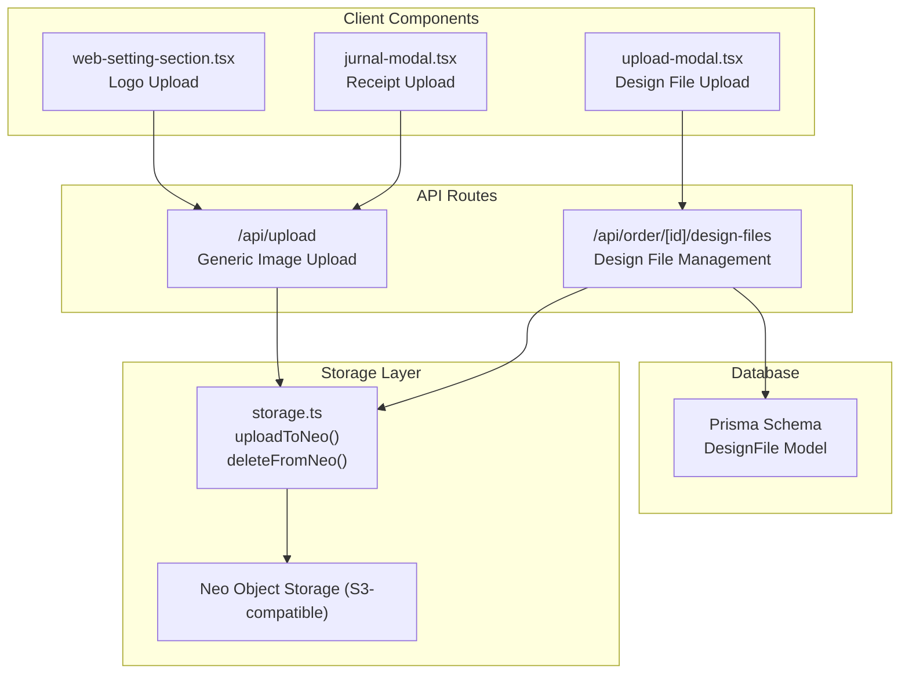
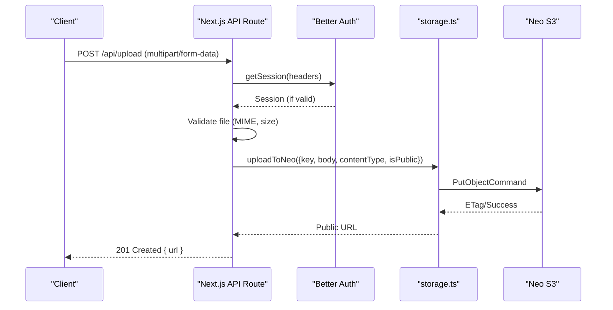
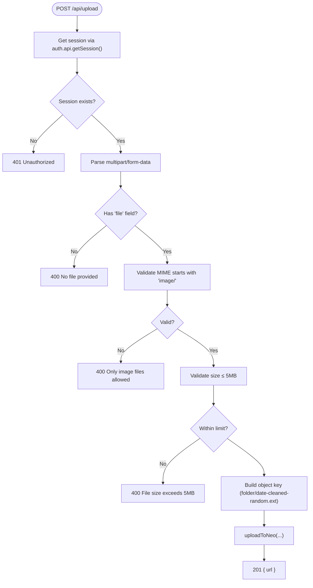
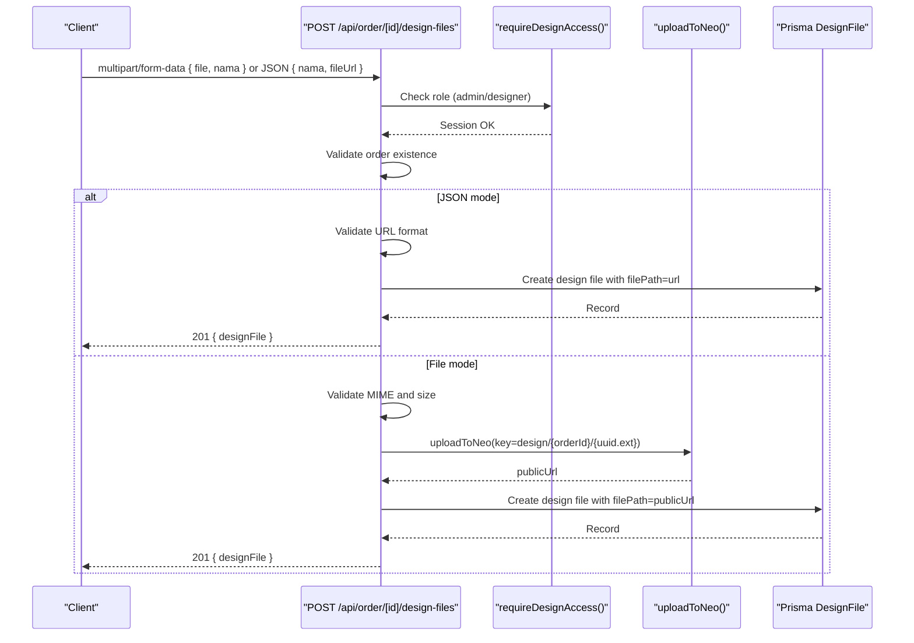
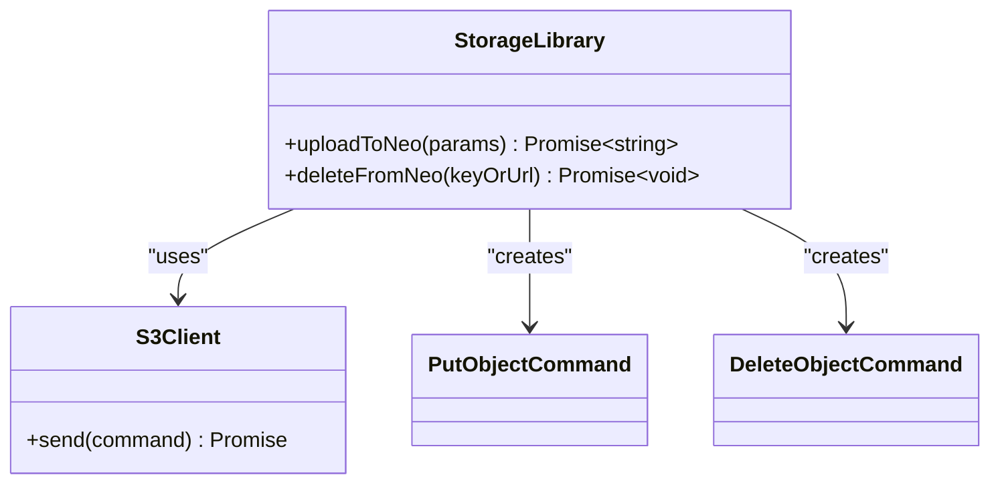
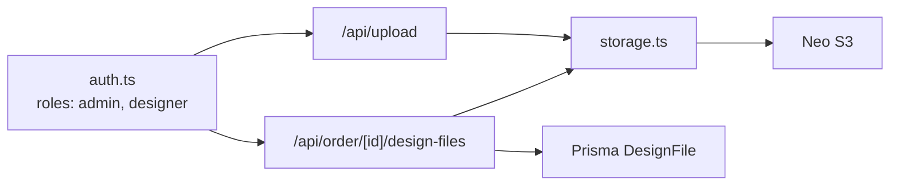

# File Upload & Cloud Storage API

<cite>
**Referenced Files in This Document**
- [route.ts](file://src/app/api/upload/route.ts)
- [storage.ts](file://src/lib/storage.ts)
- [route.ts](file://src/app/api/order/[id]/design-files/route.ts)
- [web-setting-section.tsx](file://src/app/(LoggedIn)/settings/web-setting/web-setting-section.tsx)
- [jurnal-modal.tsx](file://src/app/(LoggedIn)/finance/jurnal/components/jurnal-modal.tsx)
- [upload-modal.tsx](file://src/app/(LoggedIn)/production/design-queue/components/upload-modal.tsx)
- [schema.prisma](file://prisma/schema.prisma)
- [auth.ts](file://src/lib/auth.ts)
</cite>

## Table of Contents
1. [Introduction](#introduction)
2. [Project Structure](#project-structure)
3. [Core Components](#core-components)
4. [Architecture Overview](#architecture-overview)
5. [Detailed Component Analysis](#detailed-component-analysis)
6. [Dependency Analysis](#dependency-analysis)
7. [Performance Considerations](#performance-considerations)
8. [Troubleshooting Guide](#troubleshooting-guide)
9. [Conclusion](#conclusion)

## Introduction
This document provides comprehensive API documentation for file upload and cloud storage endpoints. It covers:
- HTTP methods, URL patterns, and request/response schemas for file uploads
- Multipart file uploads and S3-compatible storage via Biznet Neo
- File metadata handling, validation rules, and storage policies
- Response formats, error handling, and success indicators
- Cloud storage integration, access controls, and media delivery optimization
- Practical examples for client implementation and integration patterns for design files and invoices

## Project Structure
The file upload and cloud storage functionality spans several modules:
- API routes for generic uploads and order-specific design file management
- A reusable storage library integrating with S3-compatible Neo Object Storage
- Client-side components that demonstrate upload flows for logos, receipts, and design files
- Prisma schema defining the design file entity and relationships

**Diagram sources**
- [route.ts:1-76](file://src/app/api/upload/route.ts#L1-L76)
- [storage.ts:1-91](file://src/lib/storage.ts#L1-L91)
- [route.ts:1-232](file://src/app/api/order/[id]/design-files/route.ts#L1-L232)
- [web-setting-section.tsx](file://src/app/(LoggedIn)/settings/web-setting/web-setting-section.tsx#L72-L123)
- [jurnal-modal.tsx](file://src/app/(LoggedIn)/finance/jurnal/components/jurnal-modal.tsx#L110-L143)
- [upload-modal.tsx](file://src/app/(LoggedIn)/production/design-queue/components/upload-modal.tsx#L55-L112)
- [schema.prisma:317-330](file://prisma/schema.prisma#L317-L330)

**Section sources**
- [route.ts:1-76](file://src/app/api/upload/route.ts#L1-L76)
- [storage.ts:1-91](file://src/lib/storage.ts#L1-L91)
- [route.ts:1-232](file://src/app/api/order/[id]/design-files/route.ts#L1-L232)
- [web-setting-section.tsx](file://src/app/(LoggedIn)/settings/web-setting/web-setting-section.tsx#L72-L123)
- [jurnal-modal.tsx](file://src/app/(LoggedIn)/finance/jurnal/components/jurnal-modal.tsx#L110-L143)
- [upload-modal.tsx](file://src/app/(LoggedIn)/production/design-queue/components/upload-modal.tsx#L55-L112)
- [schema.prisma:317-330](file://prisma/schema.prisma#L317-L330)

## Core Components
- Generic Image Upload Endpoint
  - Purpose: Accepts multipart form data and uploads images to Neo S3 under a folder path
  - Authentication: Requires a valid session
  - Validation: Only image/* MIME types; max 5 MB
  - Output: Public URL of uploaded file
- Order Design File Management
  - Purpose: Upload design assets or save external URLs for design files associated with orders
  - Authentication: Requires designer or admin role
  - Validation: Supports multiple formats (images, PDF, AI/PSD/ZIP); max 10 MB
  - Persistence: Stores metadata in the database and optionally deletes from S3 on removal
- Storage Library
  - Purpose: Provides S3-compatible upload and delete operations using AWS SDK v3
  - Configuration: Reads endpoint, bucket, and credentials from environment variables
  - Access Control: Public-read by default for uploaded files

**Section sources**
- [route.ts:6-75](file://src/app/api/upload/route.ts#L6-L75)
- [route.ts:36-173](file://src/app/api/order/[id]/design-files/route.ts#L36-L173)
- [storage.ts:48-90](file://src/lib/storage.ts#L48-L90)
- [auth.ts:78-91](file://src/lib/auth.ts#L78-L91)

## Architecture Overview
The upload architecture integrates client requests, API routes, authentication, storage, and persistence:

**Diagram sources**
- [route.ts:6-75](file://src/app/api/upload/route.ts#L6-L75)
- [storage.ts:48-69](file://src/lib/storage.ts#L48-L69)
- [auth.ts:20-92](file://src/lib/auth.ts#L20-L92)

## Detailed Component Analysis

### Generic Image Upload API
- Endpoint: POST /api/upload
- Request
  - Content-Type: multipart/form-data
  - Fields:
    - file (required): Binary image file
    - folder (optional): Directory prefix for object key (defaults to others)
- Validation
  - MIME type must start with image/
  - Size ≤ 5 MB
- Response
  - 201 Created: { url: "<public_url>" }
  - 400 Bad Request: { error: "<message>" }
  - 401 Unauthorized: { error: "Unauthorized." }
  - 500 Internal Server Error: { error: "Internal server error message" }
- Storage Policy
  - Generates a readable object key combining folder, date, cleaned filename, and random suffix
  - Uploaded with public-read ACL

**Diagram sources**
- [route.ts:6-75](file://src/app/api/upload/route.ts#L6-L75)

**Section sources**
- [route.ts:6-75](file://src/app/api/upload/route.ts#L6-L75)

### Order Design File Management API
- Endpoint: POST /api/order/[id]/design-files
- Modes
  - File Upload Mode (multipart/form-data):
    - Fields:
      - file (required): Asset file
      - nama (required): Display name
    - Validation:
      - Allowed MIME types: JPEG, PNG, WebP, GIF, PDF, AI/PSD, ZIP
      - Max size: 10 MB
    - Behavior:
      - Uploads to Neo S3 under design/{orderId}/{uuid.ext}
      - Persists record with public URL
  - External URL Mode (application/json):
    - Body:
      - nama (required): Display name
      - fileUrl (required): Valid URL
    - Behavior:
      - Saves record with provided URL (no S3 deletion on remove)
- Additional Endpoints
  - DELETE /api/order/[id]/design-files
    - Requires designer/admin role
    - Deletes from S3 (if stored) and removes DB record

**Diagram sources**
- [route.ts:36-173](file://src/app/api/order/[id]/design-files/route.ts#L36-L173)

**Section sources**
- [route.ts:1-232](file://src/app/api/order/[id]/design-files/route.ts#L1-L232)

### Storage Library (Neo S3-Compatible)
- Configuration
  - Environment variables:
    - NEO_S3_ACCESS_KEY, NEO_S3_SECRET_KEY, NEO_S3_BUCKET, NEO_S3_ENDPOINT, NEO_S3_PUBLIC_URL
  - Region extracted from endpoint subdomain
- Functions
  - uploadToNeo({ key, body, contentType, isPublic? }): Returns public URL
  - deleteFromNeo(keyOrUrl): Removes object by key or URL

**Diagram sources**
- [storage.ts:48-90](file://src/lib/storage.ts#L48-L90)

**Section sources**
- [storage.ts:1-91](file://src/lib/storage.ts#L1-L91)

### Client Integration Examples

#### Logo Upload (Settings)
- Flow:
  - Client selects a file and sends multipart/form-data to POST /api/upload with folder=settings
  - On success, updates AppSetting logoUrl and persists via PATCH /api/admin/settings
- Implementation Notes:
  - Uses FormData with fields file and folder
  - Handles 4xx/5xx responses and displays toast feedback

**Section sources**
- [web-setting-section.tsx](file://src/app/(LoggedIn)/settings/web-setting/web-setting-section.tsx#L72-L123)
- [route.ts:6-75](file://src/app/api/upload/route.ts#L6-L75)

#### Receipt Upload (Finance)
- Flow:
  - Client selects an image file and posts to POST /api/upload with folder=nota
  - On success, stores returned URL in buktiNota field
- Implementation Notes:
  - Validates MIME type client-side before upload
  - Handles upload lifecycle with loading states and error toast

**Section sources**
- [jurnal-modal.tsx](file://src/app/(LoggedIn)/finance/jurnal/components/jurnal-modal.tsx#L110-L143)
- [route.ts:6-75](file://src/app/api/upload/route.ts#L6-L75)

#### Design File Upload (Production)
- Flow:
  - Client opens UploadModal and chooses either file or URL mode
  - Posts to POST /api/order/[id]/design-files with appropriate content-type
  - On success, refreshes order design files list
- Implementation Notes:
  - URL mode validates URL format before submission
  - File mode enforces stricter MIME and size limits

**Section sources**
- [upload-modal.tsx](file://src/app/(LoggedIn)/production/design-queue/components/upload-modal.tsx#L55-L112)
- [route.ts:36-173](file://src/app/api/order/[id]/design-files/route.ts#L36-L173)

## Dependency Analysis
- Authentication and Authorization
  - Generic upload requires a valid session
  - Design file management requires designer or admin role
- Storage Dependencies
  - AWS SDK v3 S3 client configured for Biznet Neo endpoint
- Database Dependencies
  - DesignFile model stores metadata and file paths
  - Order model has a relation to DesignFile

**Diagram sources**
- [auth.ts:78-91](file://src/lib/auth.ts#L78-L91)
- [route.ts:6-12](file://src/app/api/upload/route.ts#L6-L12)
- [route.ts:24-34](file://src/app/api/order/[id]/design-files/route.ts#L24-L34)
- [storage.ts:32-40](file://src/lib/storage.ts#L32-L40)
- [schema.prisma:317-330](file://prisma/schema.prisma#L317-L330)

**Section sources**
- [auth.ts:78-91](file://src/lib/auth.ts#L78-L91)
- [route.ts:6-12](file://src/app/api/upload/route.ts#L6-L12)
- [route.ts:24-34](file://src/app/api/order/[id]/design-files/route.ts#L24-L34)
- [storage.ts:32-40](file://src/lib/storage.ts#L32-L40)
- [schema.prisma:317-330](file://prisma/schema.prisma#L317-L330)

## Performance Considerations
- Upload Limits
  - Generic image upload: 5 MB
  - Design files: 10 MB
- MIME Filtering
  - Generic upload restricts to images
  - Design files support broader formats (images, PDF, AI/PSD, ZIP)
- Storage Access
  - Public-read ACL enables CDN-friendly delivery via public base URL
- Client-Side Validation
  - Receipt upload validates MIME before upload to reduce wasted bandwidth
- Database Efficiency
  - Minimal round-trips: upload then persist; deletion checks external URL vs S3 key

## Troubleshooting Guide
Common Issues and Resolutions
- Authentication Failure
  - Symptom: 401 Unauthorized on /api/upload
  - Cause: Missing or invalid session
  - Resolution: Ensure proper login and session headers
- Role-Based Access Denied
  - Symptom: 403 Forbidden on /api/order/[id]/design-files
  - Cause: Non-designer/admin role
  - Resolution: Verify user role in Better Auth configuration
- Unsupported MIME Type
  - Symptom: 400 on /api/upload or /api/order/[id]/design-files
  - Cause: Non-image or unsupported format
  - Resolution: Use allowed MIME types and verify file extension
- File Too Large
  - Symptom: 400 on size validation
  - Cause: Exceeds 5 MB (generic) or 10 MB (design files)
  - Resolution: Compress or split files
- Invalid URL (External URL Mode)
  - Symptom: 400 on /api/order/[id]/design-files
  - Cause: Malformed URL
  - Resolution: Provide a valid absolute URL
- S3 Upload Failures
  - Symptom: 500 during upload
  - Cause: Endpoint, credentials, or bucket misconfiguration
  - Resolution: Verify environment variables and endpoint region extraction

Operational Logging
- Server logs capture structured error messages for upload failures
- Client should surface user-friendly messages and retry logic

**Section sources**
- [route.ts:68-74](file://src/app/api/upload/route.ts#L68-L74)
- [route.ts:166-172](file://src/app/api/order/[id]/design-files/route.ts#L166-L172)
- [storage.ts:76-90](file://src/lib/storage.ts#L76-L90)

## Conclusion
The file upload and cloud storage APIs provide robust, secure, and scalable capabilities:
- Generic image uploads for logos and receipts with strict validation
- Comprehensive design file management supporting both direct uploads and external URLs
- S3-compatible storage with public delivery and optional private storage
- Strong authentication and role-based access control
- Clear client integration patterns demonstrated by settings, finance, and production modules

These APIs enable efficient media management workflows for design files and invoices while maintaining performance and reliability.