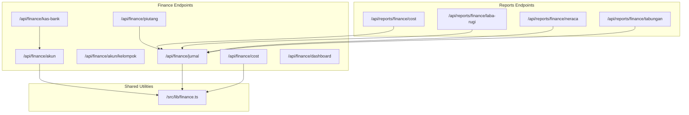
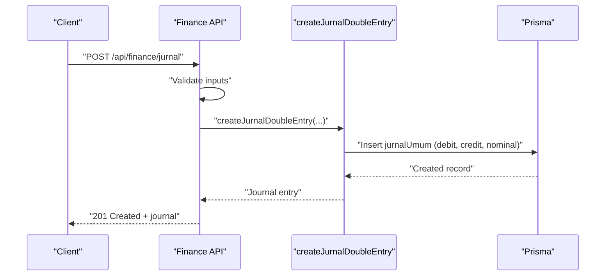
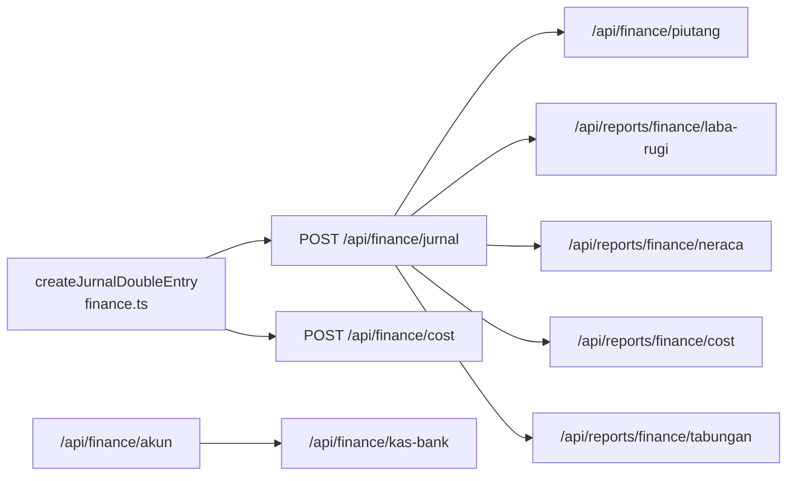

# Financial Accounting API

<cite>
**Referenced Files in This Document**
- [route.ts](file://src/app/api/finance/akun/route.ts)
- [route.ts](file://src/app/api/finance/akun/kelompok/route.ts)
- [route.ts](file://src/app/api/finance/jurnal/route.ts)
- [route.ts](file://src/app/api/finance/kas-bank/route.ts)
- [route.ts](file://src/app/api/finance/piutang/route.ts)
- [route.ts](file://src/app/api/finance/cost/route.ts)
- [route.ts](file://src/app/api/finance/dashboard/route.ts)
- [route.ts](file://src/app/api/reports/finance/cost/route.ts)
- [route.ts](file://src/app/api/reports/finance/laba-rugi/route.ts)
- [route.ts](file://src/app/api/reports/finance/neraca/route.ts)
- [route.ts](file://src/app/api/reports/finance/tabungan/route.ts)
- [finance.ts](file://src/lib/finance.ts)
</cite>

## Table of Contents
1. [Introduction](#introduction)
2. [Project Structure](#project-structure)
3. [Core Components](#core-components)
4. [Architecture Overview](#architecture-overview)
5. [Detailed Component Analysis](#detailed-component-analysis)
6. [Dependency Analysis](#dependency-analysis)
7. [Performance Considerations](#performance-considerations)
8. [Troubleshooting Guide](#troubleshooting-guide)
9. [Conclusion](#conclusion)
10. [Appendices](#appendices)

## Introduction
This document provides comprehensive API documentation for the financial accounting module of the POS system. It covers chart of accounts, journal entries, cash/bank management, cost tracking, receivables (accounts receivable), and financial reporting endpoints. It also documents account grouping, multi-rekening (multi-account) support, automated journal creation utilities, and integration patterns with order and inventory workflows.

## Project Structure
The financial APIs are organized under:
- Finance endpoints: `/api/finance/*`
- Reports endpoints: `/api/reports/finance/*`
- Shared accounting utilities: `/src/lib/finance.ts`

**Diagram sources**
- [route.ts:1-180](file://src/app/api/finance/akun/route.ts#L1-L180)
- [route.ts:1-34](file://src/app/api/finance/akun/kelompok/route.ts#L1-L34)
- [route.ts:1-169](file://src/app/api/finance/jurnal/route.ts#L1-L169)
- [route.ts:1-112](file://src/app/api/finance/kas-bank/route.ts#L1-L112)
- [route.ts:1-96](file://src/app/api/finance/piutang/route.ts#L1-L96)
- [route.ts:1-282](file://src/app/api/finance/cost/route.ts#L1-L282)
- [route.ts:1-259](file://src/app/api/finance/dashboard/route.ts#L1-L259)
- [route.ts:1-68](file://src/app/api/reports/finance/cost/route.ts#L1-L68)
- [route.ts:1-122](file://src/app/api/reports/finance/laba-rugi/route.ts#L1-L122)
- [route.ts:1-133](file://src/app/api/reports/finance/neraca/route.ts#L1-L133)
- [route.ts:1-78](file://src/app/api/reports/finance/tabungan/route.ts#L1-L78)
- [finance.ts:1-55](file://src/lib/finance.ts#L1-L55)

**Section sources**
- [route.ts:1-180](file://src/app/api/finance/akun/route.ts#L1-L180)
- [route.ts:1-34](file://src/app/api/finance/akun/kelompok/route.ts#L1-L34)
- [route.ts:1-169](file://src/app/api/finance/jurnal/route.ts#L1-L169)
- [route.ts:1-112](file://src/app/api/finance/kas-bank/route.ts#L1-L112)
- [route.ts:1-96](file://src/app/api/finance/piutang/route.ts#L1-L96)
- [route.ts:1-282](file://src/app/api/finance/cost/route.ts#L1-L282)
- [route.ts:1-259](file://src/app/api/finance/dashboard/route.ts#L1-L259)
- [route.ts:1-68](file://src/app/api/reports/finance/cost/route.ts#L1-L68)
- [route.ts:1-122](file://src/app/api/reports/finance/laba-rugi/route.ts#L1-L122)
- [route.ts:1-133](file://src/app/api/reports/finance/neraca/route.ts#L1-L133)
- [route.ts:1-78](file://src/app/api/reports/finance/tabungan/route.ts#L1-L78)
- [finance.ts:1-55](file://src/lib/finance.ts#L1-L55)

## Core Components
- Chart of Accounts: CRUD for accounts, grouping retrieval, and optional automatic bank account creation.
- Journal Entries: Manual entry, reversal, listing, and deletion with cascading soft delete.
- Cash/Bank Management: Multi-rekening support with balances computed from journals.
- Cost Tracking: Direct expense recording with notifications and correction/deletion.
- Receivables: Order-based receivables listing with payment aggregation.
- Financial Reporting: Income Statement, Balance Sheet, Cost by Account, and Savings (Tabungan) reports.
- Dashboard: Combined KPIs, trends, alerts, and summaries.

**Section sources**
- [route.ts:27-180](file://src/app/api/finance/akun/route.ts#L27-L180)
- [route.ts:16-169](file://src/app/api/finance/jurnal/route.ts#L16-L169)
- [route.ts:16-112](file://src/app/api/finance/kas-bank/route.ts#L16-L112)
- [route.ts:19-282](file://src/app/api/finance/cost/route.ts#L19-L282)
- [route.ts:15-96](file://src/app/api/finance/piutang/route.ts#L15-L96)
- [route.ts:13-68](file://src/app/api/reports/finance/cost/route.ts#L13-L68)
- [route.ts:13-122](file://src/app/api/reports/finance/laba-rugi/route.ts#L13-L122)
- [route.ts:13-133](file://src/app/api/reports/finance/neraca/route.ts#L13-L133)
- [route.ts:13-78](file://src/app/api/reports/finance/tabungan/route.ts#L13-L78)
- [route.ts:12-259](file://src/app/api/finance/dashboard/route.ts#L12-L259)
- [finance.ts:4-55](file://src/lib/finance.ts#L4-L55)

## Architecture Overview
The financial APIs rely on a shared double-entry journal utility to ensure balanced debits and credits. Receivables integrate with orders and payments. Reports aggregate journals by account groups and time periods. Access control restricts sensitive operations to authorized roles.

**Diagram sources**
- [route.ts:84-125](file://src/app/api/finance/jurnal/route.ts#L84-L125)
- [finance.ts:21-55](file://src/lib/finance.ts#L21-L55)

**Section sources**
- [route.ts:84-125](file://src/app/api/finance/jurnal/route.ts#L84-L125)
- [finance.ts:21-55](file://src/lib/finance.ts#L21-L55)

## Detailed Component Analysis

### Chart of Accounts
- Purpose: Manage ledger accounts, auto-generate codes by group, and optionally create linked bank accounts.
- Roles: Read/Write restricted to admin and cashier.
- Endpoints:
  - GET /api/finance/akun
    - Query params: search, kelompok, isActive
    - Response: list of accounts ordered by code
  - POST /api/finance/akun
    - Request body: id, kodeAkun (optional), namaAkun, kelompok, posisiNormal, createKasBank (boolean)
    - Behavior: auto-code generation by group prefix; uniqueness check; optional bank account creation
    - Response: created account
  - PATCH /api/finance/akun
    - Request body: id (required), updates to kodeAkun, namaAkun, kelompok, posisiNormal, isActive
    - Behavior: updates account and synchronizes linked bank account names
    - Response: updated account
- Account grouping:
  - GET /api/finance/akun/kelompok returns distinct account groups (e.g., AKTIVA_LANCAR, KEWAJIBAN, MODAL, PENDAPATAN, BEBAN_USAHA)

Success indicators:
- 200 OK for successful reads/updates
- 201 Created for successful creation
- 400 Bad Request for missing/invalid fields
- 401 Unauthorized or 403 Forbidden for insufficient privileges

Error handling:
- Validation errors return structured messages
- Internal server errors return generic 500 JSON

**Section sources**
- [route.ts:27-180](file://src/app/api/finance/akun/route.ts#L27-L180)
- [route.ts:17-34](file://src/app/api/finance/akun/kelompok/route.ts#L17-L34)

### Journal Entries
- Purpose: Record daily financial transactions with debits and credits.
- Roles: Read/Write access for admin and cashier.
- Endpoints:
  - GET /api/finance/jurnal
    - Query params: bulan, tahun, search, limit
    - Response: list of journals with selected fields and totals
  - POST /api/finance/jurnal
    - Request body: tanggal, keterangan, namaBiaya, buktiNota, akunDebetId, akunKreditId, nominal, isReversal, reversalOfRef
    - Behavior: validates inputs, prevents equal debet and kredit, generates refs (manual/manual reversal)
    - Response: created journal
  - DELETE /api/finance/jurnal?id=...
    - Behavior: soft deletes journal and cascades to related records (payment, penerimaan barang)
    - Response: success message
- Automated creation:
  - Uses shared utility to insert balanced entries

Success indicators:
- 200 OK for listing and updates
- 201 Created for new entries
- 400 Bad Request for invalid data
- 404 Not Found for missing entries
- 401/403 for access control

**Section sources**
- [route.ts:16-169](file://src/app/api/finance/jurnal/route.ts#L16-L169)
- [finance.ts:21-55](file://src/lib/finance.ts#L21-L55)

### Cash/Bank Management
- Purpose: Maintain multiple bank accounts and compute current balances from journal activity.
- Roles: Read/Write access for admin and cashier.
- Endpoints:
  - GET /api/finance/kas-bank
    - Query params: jenisRekening (filter)
    - Response: list of bank accounts with computed saldoSaatIni
  - PATCH /api/finance/kas-bank
    - Request body: id (required), updates to namaRekening, jenisRekening, nomorRekening, isActive
    - Response: updated bank account
- Balances:
  - Computed as sum of debet minus sum of kredit for each account

Success indicators:
- 200 OK for listing and updates
- 400 Bad Request for missing id
- 401/403 for access control

**Section sources**
- [route.ts:16-112](file://src/app/api/finance/kas-bank/route.ts#L16-L112)

### Cost Tracking (Expenses)
- Purpose: Record direct expenses against cost accounts and notify admins.
- Roles: Access for admin and cashier.
- Endpoints:
  - GET /api/finance/cost
    - Query params: search, akunId, page, limit, bulan, tahun
    - Response: paginated cost entries grouped for frontend compatibility
  - POST /api/finance/cost
    - Request body: akunId (cost account), nama, nominal, keterangan, buktiNota, tanggal, kasBankId
    - Behavior: validates inputs, creates double-entry journal, sends notifications
    - Response: created journal
  - PATCH /api/finance/cost?id=...
    - Request body: akunId, nama, nominal, keterangan, buktiNota, tanggal, kasBankId
    - Behavior: soft deletes old entry and posts corrected entry
    - Response: corrected journal
  - DELETE /api/finance/cost?id=...
    - Behavior: soft deletes the expense entry
    - Response: success message

Success indicators:
- 200 OK for listing and corrections
- 201 Created for new entries
- 400 Bad Request for validation failures
- 404 Not Found for missing entries
- 401/403 for access control

**Section sources**
- [route.ts:19-282](file://src/app/api/finance/cost/route.ts#L19-L282)

### Receivables (Accounts Receivable)
- Purpose: List outstanding orders (not yet paid in full) with customer info and payment history.
- Roles: Read access for admin and cashier.
- Endpoint:
  - GET /api/finance/piutang
    - Query params: page, limit, search, status ("BELUM_BAYAR" | "DP")
    - Response: paginated results with computed sisaTagihan
- Receivable computation:
  - Sisa tagihan = grandTotal - sum of payments

Success indicators:
- 200 OK with pagination metadata
- 401/403 for access control

**Section sources**
- [route.ts:15-96](file://src/app/api/finance/piutang/route.ts#L15-L96)

### Financial Reporting
- Income Statement (Profit & Loss):
  - GET /api/reports/finance/laba-rugi?bulan&tahun
  - Aggregates journals by account groups PENDAPATAN and BEBAN_USAHA for the given period
  - Returns grouped totals and derived metrics (laba bersih, margin)
- Balance Sheet:
  - GET /api/reports/finance/neraca?tahun&bulan
  - Accumulates journals up to the given period and groups by account groups (AKTIVA_LANCAR, KEWAJIBAN, MODAL)
  - Computes totals and verifies balance within rounding tolerance
- Cost by Account:
  - GET /api/reports/finance/cost?bulan&tahun
  - Groups BEBAN_USAHA journal entries by account name for the given period
- Savings (Tabungan):
  - GET /api/reports/finance/tabungan?tahun
  - Aggregates savings-related journal activity by account name and month

Access control:
- All report endpoints require admin role

Success indicators:
- 200 OK with report data
- 401/403 for unauthorized access

**Section sources**
- [route.ts:103-122](file://src/app/api/reports/finance/laba-rugi/route.ts#L103-L122)
- [route.ts:13-133](file://src/app/api/reports/finance/neraca/route.ts#L13-L133)
- [route.ts:13-68](file://src/app/api/reports/finance/cost/route.ts#L13-L68)
- [route.ts:13-78](file://src/app/api/reports/finance/tabungan/route.ts#L13-L78)

### Dashboard
- Purpose: Provide KPIs, weekly/monthly trends, low stock alerts, and recent orders.
- Endpoint:
  - GET /api/finance/dashboard?month&year
- Data sources:
  - Payments, orders, receivables, journals, and inventory thresholds
- Outputs include:
  - Totals and percentage changes vs previous period
  - Low stock alerts for raw materials and products
  - Monthly and weekly chart series

Success indicators:
- 200 OK with aggregated dashboard data
- 401 for unauthorized access

**Section sources**
- [route.ts:12-259](file://src/app/api/finance/dashboard/route.ts#L12-L259)

## Dependency Analysis
- Shared utility:
  - createJurnalDoubleEntry ensures balanced debits and credits and supports transactional inserts
- Cross-module dependencies:
  - Journal entries reference accounts and optionally relate to payments and receipts
  - Receivables depend on orders and payments
  - Reports depend on journals and account groups
  - Bank accounts depend on chart of accounts

**Diagram sources**
- [finance.ts:21-55](file://src/lib/finance.ts#L21-L55)
- [route.ts:84-125](file://src/app/api/finance/jurnal/route.ts#L84-L125)
- [route.ts:109-179](file://src/app/api/finance/cost/route.ts#L109-L179)
- [route.ts:117-128](file://src/app/api/finance/akun/route.ts#L117-L128)
- [route.ts:38-71](file://src/app/api/finance/kas-bank/route.ts#L38-L71)
- [route.ts:15-96](file://src/app/api/finance/piutang/route.ts#L15-L96)
- [route.ts:103-122](file://src/app/api/reports/finance/laba-rugi/route.ts#L103-L122)
- [route.ts:13-133](file://src/app/api/reports/finance/neraca/route.ts#L13-L133)
- [route.ts:13-68](file://src/app/api/reports/finance/cost/route.ts#L13-L68)
- [route.ts:13-78](file://src/app/api/reports/finance/tabungan/route.ts#L13-L78)

**Section sources**
- [finance.ts:21-55](file://src/lib/finance.ts#L21-L55)
- [route.ts:84-125](file://src/app/api/finance/jurnal/route.ts#L84-L125)
- [route.ts:109-179](file://src/app/api/finance/cost/route.ts#L109-L179)
- [route.ts:117-128](file://src/app/api/finance/akun/route.ts#L117-L128)
- [route.ts:38-71](file://src/app/api/finance/kas-bank/route.ts#L38-L71)
- [route.ts:15-96](file://src/app/api/finance/piutang/route.ts#L15-L96)
- [route.ts:103-122](file://src/app/api/reports/finance/laba-rugi/route.ts#L103-L122)
- [route.ts:13-133](file://src/app/api/reports/finance/neraca/route.ts#L13-L133)
- [route.ts:13-68](file://src/app/api/reports/finance/cost/route.ts#L13-L68)
- [route.ts:13-78](file://src/app/api/reports/finance/tabungan/route.ts#L13-L78)

## Performance Considerations
- Pagination and limits:
  - Use limit query param for journal listing to avoid large payloads
- Efficient filtering:
  - Apply search and date filters early in queries
- Aggregation:
  - Reports compute aggregates per period; cache or precompute for frequent requests
- Transactions:
  - Batch operations (e.g., cost corrections) use database transactions to maintain consistency

## Troubleshooting Guide
Common issues and resolutions:
- Unauthorized/Forbidden:
  - Ensure session is present and user role is admin or kasir
- Validation errors:
  - Missing required fields or invalid nominal values cause 400 responses
- Duplicate account code:
  - Creation fails if kodeAkun already exists
- Journal reversal:
  - Ensure reversalOfRef is set when creating reversal entries
- Soft delete cascade:
  - Deleting journals also soft deletes related payment/penerimaan records

**Section sources**
- [route.ts:62-104](file://src/app/api/finance/akun/route.ts#L62-L104)
- [route.ts:84-125](file://src/app/api/finance/jurnal/route.ts#L84-L125)
- [route.ts:109-179](file://src/app/api/finance/cost/route.ts#L109-L179)
- [route.ts:127-168](file://src/app/api/finance/jurnal/route.ts#L127-L168)

## Conclusion
The financial accounting APIs provide a robust foundation for ledger maintenance, transaction recording, multi-rekening support, cost tracking, receivables monitoring, and financial reporting. The shared double-entry utility ensures data integrity, while role-based access controls protect sensitive operations. Integration with orders and inventory enables end-to-end financial visibility.

## Appendices

### API Reference Summary

- Chart of Accounts
  - GET /api/finance/akun?search=&kelompok=&isActive=
  - POST /api/finance/akun
  - PATCH /api/finance/akun
  - GET /api/finance/akun/kelompok

- Journal Entries
  - GET /api/finance/jurnal?bulan=&tahun=&search=&limit=
  - POST /api/finance/jurnal
  - DELETE /api/finance/jurnal?id=

- Cash/Bank
  - GET /api/finance/kas-bank?jenisRekening=
  - PATCH /api/finance/kas-bank

- Cost Tracking
  - GET /api/finance/cost?search=&akunId=&page=&limit=&bulan=&tahun=
  - POST /api/finance/cost
  - PATCH /api/finance/cost?id=
  - DELETE /api/finance/cost?id=

- Receivables
  - GET /api/finance/piutang?page=&limit=&search=&status=

- Reports
  - GET /api/reports/finance/laba-rugi?bulan=&tahun=
  - GET /api/reports/finance/neraca?tahun=&bulan=
  - GET /api/reports/finance/cost?bulan=&tahun=
  - GET /api/reports/finance/tabungan?tahun=

- Dashboard
  - GET /api/finance/dashboard?month=&year=

### Request/Response Schema Notes
- Shared input for journal creation:
  - ref, tanggal, keterangan?, namaBiaya, buktiNota?, akunDebetId, akunKreditId, nominal, paymentId?, costId?, penerimaanId?, createdById?
- Journal listing includes computed totals and counts
- Receivables include computed sisaTagihan per order
- Reports return aggregated data grouped by account or category

### Integration Patterns
- Automated journal entries:
  - Use createJurnalDoubleEntry for balanced debits/credits
- Order-to-Journal:
  - Payment events can trigger journal entries via shared utility
- Inventory-to-Cost:
  - Purchase receipts/expenses can be posted as cost entries with linked bank accounts

**Section sources**
- [finance.ts:4-55](file://src/lib/finance.ts#L4-L55)
- [route.ts:84-125](file://src/app/api/finance/jurnal/route.ts#L84-L125)
- [route.ts:109-179](file://src/app/api/finance/cost/route.ts#L109-L179)
- [route.ts:140-203](file://src/app/api/finance/dashboard/route.ts#L140-L203)