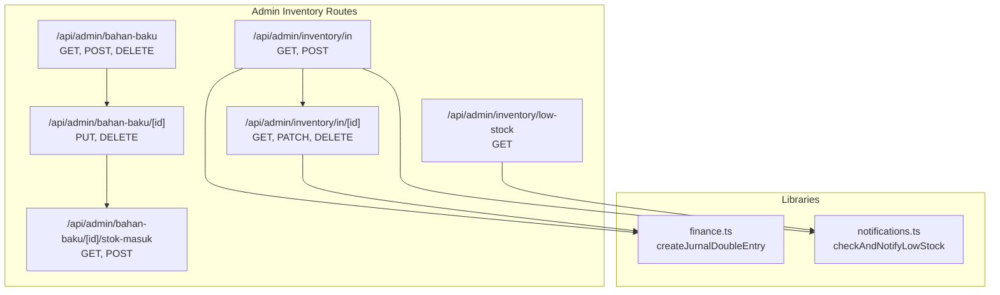
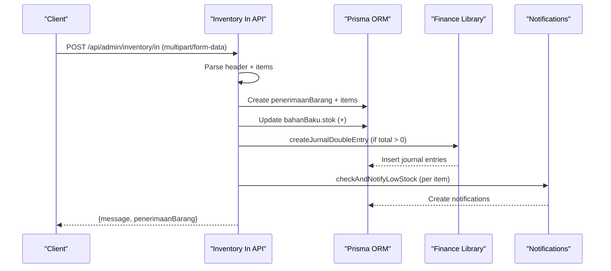
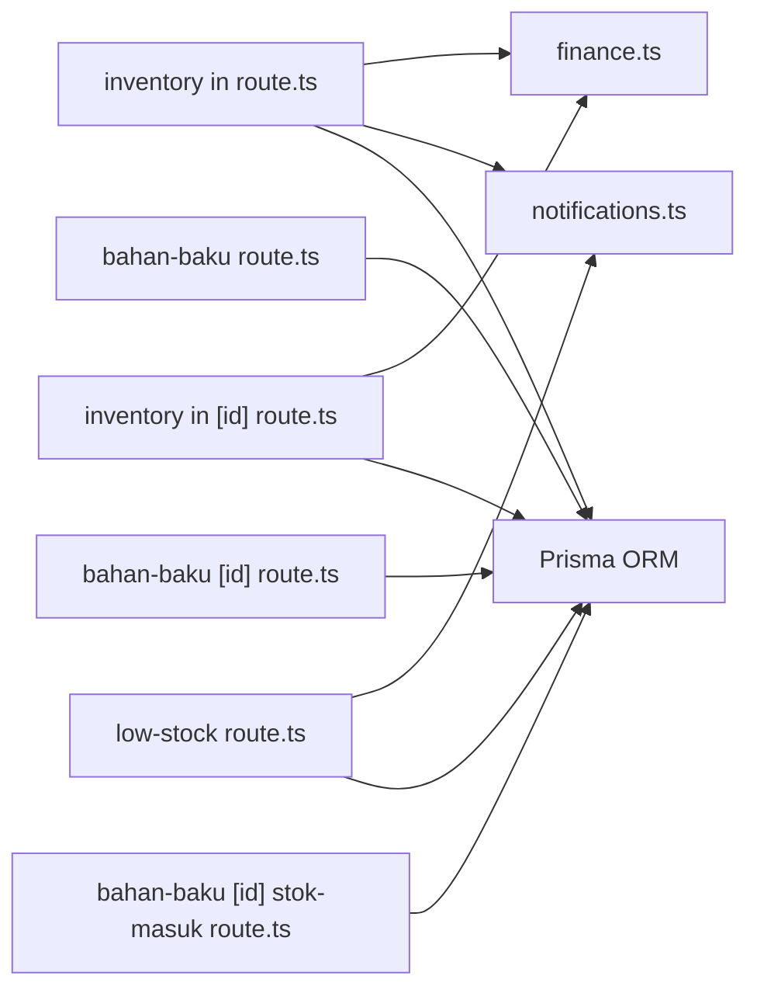

# Inventory Management API

<cite>
**Referenced Files in This Document**
- [bahan-baku route.ts](file://src/app/api/admin/bahan-baku/route.ts)
- [bahan-baku [id] route.ts](file://src/app/api/admin/bahan-baku/[id]/route.ts)
- [bahan-baku [id] stok-masuk route.ts](file://src/app/api/admin/bahan-baku/[id]/stok-masuk/route.ts)
- [inventory in route.ts](file://src/app/api/admin/inventory/in/route.ts)
- [inventory in [id] route.ts](file://src/app/api/admin/inventory/in/[id]/route.ts)
- [inventory low-stock route.ts](file://src/app/api/admin/inventory/low-stock/route.ts)
- [finance.ts](file://src/lib/finance.ts)
- [notifications.ts](file://src/lib/notifications.ts)
- [low-stock-banner.tsx](file://src/components/low-stock-banner.tsx)
</cite>

## Table of Contents
1. [Introduction](#introduction)
2. [Project Structure](#project-structure)
3. [Core Components](#core-components)
4. [Architecture Overview](#architecture-overview)
5. [Detailed Component Analysis](#detailed-component-analysis)
6. [Dependency Analysis](#dependency-analysis)
7. [Performance Considerations](#performance-considerations)
8. [Troubleshooting Guide](#troubleshooting-guide)
9. [Conclusion](#conclusion)
10. [Appendices](#appendices)

## Introduction
This document provides comprehensive API documentation for inventory management endpoints focused on receipts, issues, low stock alerts, stock movement tracking, batch management, and inventory valuation. It covers HTTP methods, URL patterns, request/response schemas, parameter specifications, error handling, success indicators, and integration patterns with purchase orders and production systems. The documentation also explains stock valuation methods and reporting APIs, along with practical examples and client implementation guidelines.

## Project Structure
The inventory management APIs are organized under the admin namespace with dedicated routes for raw materials, inventory receipts, and low stock alerts. Supporting libraries handle financial journal entries and notifications.

**Diagram sources**
- [bahan-baku route.ts:1-195](file://src/app/api/admin/bahan-baku/route.ts#L1-L195)
- [bahan-baku [id] route.ts](file://src/app/api/admin/bahan-baku/[id]/route.ts#L1-L133)
- [bahan-baku [id] stok-masuk route.ts](file://src/app/api/admin/bahan-baku/[id]/stok-masuk/route.ts#L1-L167)
- [inventory in route.ts:1-279](file://src/app/api/admin/inventory/in/route.ts#L1-L279)
- [inventory in [id] route.ts](file://src/app/api/admin/inventory/in/[id]/route.ts#L1-L291)
- [inventory low-stock route.ts:1-56](file://src/app/api/admin/inventory/low-stock/route.ts#L1-L56)
- [finance.ts:1-55](file://src/lib/finance.ts#L1-L55)
- [notifications.ts:52-95](file://src/lib/notifications.ts#L52-L95)

**Section sources**
- [bahan-baku route.ts:1-195](file://src/app/api/admin/bahan-baku/route.ts#L1-L195)
- [bahan-baku [id] route.ts](file://src/app/api/admin/bahan-baku/[id]/route.ts#L1-L133)
- [bahan-baku [id] stok-masuk route.ts](file://src/app/api/admin/bahan-baku/[id]/stok-masuk/route.ts#L1-L167)
- [inventory in route.ts:1-279](file://src/app/api/admin/inventory/in/route.ts#L1-L279)
- [inventory in [id] route.ts](file://src/app/api/admin/inventory/in/[id]/route.ts#L1-L291)
- [inventory low-stock route.ts:1-56](file://src/app/api/admin/inventory/low-stock/route.ts#L1-L56)
- [finance.ts:1-55](file://src/lib/finance.ts#L1-L55)
- [notifications.ts:52-95](file://src/lib/notifications.ts#L52-L95)

## Core Components
- Raw Materials Management: CRUD operations for raw materials with stock thresholds and unit associations.
- Inventory Receipts: Multi-item receipt creation with supplier association, file uploads, stock updates, and financial journal entries.
- Stock Movement Tracking: Per-material receipt history and per-receipt details with pagination and filtering.
- Low Stock Alerts: Real-time low stock detection and notifications for administrators and warehouse staff.
- Financial Integration: Automatic double-entry journal creation for inventory receipts.

**Section sources**
- [bahan-baku route.ts:1-195](file://src/app/api/admin/bahan-baku/route.ts#L1-L195)
- [bahan-baku [id] route.ts](file://src/app/api/admin/bahan-baku/[id]/route.ts#L1-L133)
- [bahan-baku [id] stok-masuk route.ts](file://src/app/api/admin/bahan-baku/[id]/stok-masuk/route.ts#L1-L167)
- [inventory in route.ts:1-279](file://src/app/api/admin/inventory/in/route.ts#L1-L279)
- [inventory in [id] route.ts](file://src/app/api/admin/inventory/in/[id]/route.ts#L1-L291)
- [inventory low-stock route.ts:1-56](file://src/app/api/admin/inventory/low-stock/route.ts#L1-L56)
- [finance.ts:1-55](file://src/lib/finance.ts#L1-L55)
- [notifications.ts:52-95](file://src/lib/notifications.ts#L52-L95)

## Architecture Overview
The inventory module integrates with Prisma ORM for database operations, Next.js server-side routing, and external storage for receipt documents. Financial journals are generated automatically for inventory receipts. Notifications trigger low stock alerts and broadcast via Pusher channels.

**Diagram sources**
- [inventory in route.ts:100-279](file://src/app/api/admin/inventory/in/route.ts#L100-L279)
- [finance.ts:26-54](file://src/lib/finance.ts#L26-L54)
- [notifications.ts:67-95](file://src/lib/notifications.ts#L67-L95)

## Detailed Component Analysis

### Raw Materials Management
- Purpose: Manage raw materials including name, unit, stock quantities, minimum stock thresholds, and activation status.
- Access Control: Requires authenticated admin or warehouse role.
- Endpoints:
  - GET /api/admin/bahan-baku
    - Query parameters: page, limit, all, search, isActive, stokFilter (menipis, habis, all)
    - Response: results[], count, page, limit, totalPages
  - POST /api/admin/bahan-baku
    - Request body: { nama, unitId, stok?, minStok?, keterangan? }
    - Response: { message, bahanBaku }
  - PUT /api/admin/bahan-baku/[id]
    - Request body: { nama, unitId, stok?, minStok?, keterangan?, isActive? }
    - Response: { message, bahanBaku }
  - DELETE /api/admin/bahan-baku
    - Request body: { ids[] }
    - Response: { message }
  - DELETE /api/admin/bahan-baku/[id]
    - Response: { message }

- Parameter Specifications:
  - Required: nama (string), unitId (string)
  - Optional: stok (number), minStok (number|null), keterangan (string|null), isActive (boolean)
  - Filtering: stokFilter supports menipis and habis to filter materials near or below minimum stock

- Success Indicators:
  - 200 OK for GET with paginated results
  - 201 Created for successful creation
  - 200 OK for successful updates/deletions

- Error Handling:
  - 400 Bad Request for invalid inputs (e.g., missing nama/unitId, duplicate names)
  - 401 Unauthorized for unauthenticated requests
  - 403 Forbidden for insufficient roles
  - 404 Not Found for missing resources
  - 500 Internal Server Error for unexpected failures

**Section sources**
- [bahan-baku route.ts:6-195](file://src/app/api/admin/bahan-baku/route.ts#L6-L195)

### Material Receipts (Inventory In)
- Purpose: Record incoming inventory with multi-item support, supplier association, optional file attachments, stock updates, and financial journal entries.
- Access Control: Requires authenticated admin or warehouse role.
- Endpoints:
  - GET /api/admin/inventory/in
    - Query parameters: limit, page, search, dateFrom, dateTo, supplierId, bahanBakuId
    - Response: { results[], pagination: { total, page, limit, totalPages } }
  - POST /api/admin/inventory/in
    - Form fields: supplierId, nomorFaktur, tanggal, keterangan, items (JSON string), buktiNota (file)
    - Items format: [{ bahanBakuId, jumlah, hargaBeli? }]
    - Response: { message, penerimaanBarang }
  - GET /api/admin/inventory/in/[id]
    - Response: penerimaanBarang record with items and supplier metadata
  - PATCH /api/admin/inventory/in/[id]
    - Form fields: supplierId, nomorFaktur, tanggal, keterangan, items (JSON string), buktiNota (file)
    - Behavior: Rollback old stock, soft-delete old items, create new items, update stock, regenerate journal
    - Response: { message }
  - DELETE /api/admin/inventory/in/[id]
    - Behavior: Rollback stock, soft-delete journal entries, mark penerimaan as deleted
    - Response: { message }

- Request Schema (POST/PATCH):
  - Header fields:
    - supplierId (string|null)
    - nomorFaktur (string|null)
    - tanggal (string|null)
    - keterangan (string|null)
    - buktiNota (file|null)
  - items (required): JSON string representing array of { bahanBakuId, jumlah, hargaBeli? }
  - Validation:
    - items must be a non-empty array
    - jumlah must be positive
    - hargaBeli defaults to 0 if omitted

- Response Schema:
  - GET /api/admin/inventory/in: { results[], pagination }
  - GET /api/admin/inventory/in/[id]: penerimaanBarang object with nested items and supplier info
  - POST/PATCH/DELETE: { message } or { message, penerimaanBarang }

- Success Indicators:
  - 201 Created for successful receipt creation
  - 200 OK for successful updates/deletion
  - Transactional guarantees ensure stock and journal consistency

- Error Handling:
  - 400 Bad Request for invalid items format or missing items
  - 401 Unauthorized for unauthenticated requests
  - 403 Forbidden for insufficient roles
  - 404 Not Found for missing receipts
  - 500 Internal Server Error for unexpected failures

- Journal Integration:
  - Automatic double-entry journal created when totalTagihan > 0
  - Debit: HPP (5-001), Credit: Hutang Usaha (2-001)
  - Journal reference prefixed with INV- and includes receipt ID

**Section sources**
- [inventory in route.ts:12-279](file://src/app/api/admin/inventory/in/route.ts#L12-L279)
- [inventory in [id] route.ts](file://src/app/api/admin/inventory/in/[id]/route.ts#L18-L291)
- [finance.ts:26-54](file://src/lib/finance.ts#L26-L54)

### Material Receipts by Raw Material ID
- Purpose: Retrieve receipt history for a specific raw material with pagination and inclusion of supplier and creator details.
- Access Control: Requires authenticated admin or warehouse role.
- Endpoints:
  - GET /api/admin/bahan-baku/[id]/stok-masuk
    - Query parameters: page, limit
    - Response: { results[], count, page, limit }
  - POST /api/admin/bahan-baku/[id]/stok-masuk
    - Form fields: jumlah, supplierId, hargaBeli, nomorFaktur, tanggal, keterangan, buktiNota (file)
    - Behavior: Creates receipt header/detail, updates bahanBaku stock, optionally uploads receipt document
    - Response: { message, penerimaanBarang }

- Request Schema (POST):
  - jumlah (required, positive number)
  - supplierId (string|null)
  - hargaBeli (string|null)
  - nomorFaktur (string|null)
  - tanggal (string|null)
  - keterangan (string|null)
  - buktiNota (file|null)

- Response Schema:
  - GET: { results[], count, page, limit }
  - POST: { message, penerimaanBarang }

- Success Indicators:
  - 200 OK for listing receipts
  - 201 Created for successful receipt entry

- Error Handling:
  - 400 Bad Request for invalid jumlah or missing bahanBaku
  - 401 Unauthorized for unauthenticated requests
  - 403 Forbidden for insufficient roles
  - 404 Not Found for missing raw material
  - 500 Internal Server Error for unexpected failures

**Section sources**
- [bahan-baku [id] stok-masuk route.ts](file://src/app/api/admin/bahan-baku/[id]/stok-masuk/route.ts#L8-L167)

### Low Stock Alerts
- Purpose: Provide real-time low stock alerts for both raw materials and products, integrated with notifications and optional Pusher channels.
- Access Control: Requires authenticated user.
- Endpoints:
  - GET /api/admin/inventory/low-stock
    - Response: Array of low stock items with type (bahan/produk), id, nama, stok, minStok, unit

- Notification Integration:
  - On receipt creation, low stock checks are performed for each item
  - Notifications are sent to admin and gudang roles with anti-duplication (once per 24 hours per item)
  - Frontend banner listens for new-notification events and refreshes low stock data

- Response Schema:
  - Array of items with fields: id, nama, stok, minStok, unit (optional), type

- Success Indicators:
  - 200 OK with filtered list of low stock items

- Error Handling:
  - 401 Unauthorized for unauthenticated requests
  - 500 Internal Server Error for unexpected failures

**Section sources**
- [inventory low-stock route.ts:6-56](file://src/app/api/admin/inventory/low-stock/route.ts#L6-L56)
- [notifications.ts:67-95](file://src/lib/notifications.ts#L67-L95)
- [low-stock-banner.tsx:19-50](file://src/components/low-stock-banner.tsx#L19-L50)

### Stock Adjustment and Batch Management
- Purpose: Adjust stock levels and manage batches through receipt updates and deletions.
- Mechanism:
  - PATCH /api/admin/inventory/in/[id]: Rollback old stock, delete old items, create new items, update stock, regenerate journal
  - DELETE /api/admin/inventory/in/[id]: Rollback stock, soft-delete journal entries, mark receipt as deleted
  - GET /api/admin/bahan-baku/[id]/stok-masuk: List receipt history per raw material

- Success Indicators:
  - Consistent stock updates and journal entries after adjustments

- Error Handling:
  - 404 Not Found for missing receipts
  - 500 Internal Server Error for unexpected failures

**Section sources**
- [inventory in [id] route.ts](file://src/app/api/admin/inventory/in/[id]/route.ts#L64-L291)
- [bahan-baku [id] stok-masuk route.ts](file://src/app/api/admin/bahan-baku/[id]/stok-masuk/route.ts#L8-L64)

### Inventory Valuation Endpoints
- Current Implementation:
  - Automatic valuation via receipt totals during inventory in operations
  - Journal entries reflect totalTagihan for each receipt
- Reporting APIs:
  - No explicit valuation report endpoint is exposed in the analyzed files
- Recommendations:
  - Extend GET /api/admin/inventory/in to include valuation summaries
  - Add GET /api/admin/inventory/valuation with filters (date range, supplier, material)

**Section sources**
- [inventory in route.ts:100-279](file://src/app/api/admin/inventory/in/route.ts#L100-L279)
- [finance.ts:26-54](file://src/lib/finance.ts#L26-L54)

## Dependency Analysis
The inventory APIs depend on shared libraries for financial journaling and notifications. Receipt creation triggers both stock updates and journal entries, while low stock checks trigger notifications.

**Diagram sources**
- [inventory in route.ts:1-279](file://src/app/api/admin/inventory/in/route.ts#L1-L279)
- [inventory in [id] route.ts](file://src/app/api/admin/inventory/in/[id]/route.ts#L1-L291)
- [inventory low-stock route.ts:1-56](file://src/app/api/admin/inventory/low-stock/route.ts#L1-L56)
- [finance.ts:1-55](file://src/lib/finance.ts#L1-L55)
- [notifications.ts:52-95](file://src/lib/notifications.ts#L52-L95)
- [bahan-baku route.ts:1-195](file://src/app/api/admin/bahan-baku/route.ts#L1-L195)
- [bahan-baku [id] route.ts](file://src/app/api/admin/bahan-baku/[id]/route.ts#L1-L133)
- [bahan-baku [id] stok-masuk route.ts](file://src/app/api/admin/bahan-baku/[id]/stok-masuk/route.ts#L1-L167)

**Section sources**
- [inventory in route.ts:1-279](file://src/app/api/admin/inventory/in/route.ts#L1-L279)
- [inventory in [id] route.ts](file://src/app/api/admin/inventory/in/[id]/route.ts#L1-L291)
- [inventory low-stock route.ts:1-56](file://src/app/api/admin/inventory/low-stock/route.ts#L1-L56)
- [finance.ts:1-55](file://src/lib/finance.ts#L1-L55)
- [notifications.ts:52-95](file://src/lib/notifications.ts#L52-L95)
- [bahan-baku route.ts:1-195](file://src/app/api/admin/bahan-baku/route.ts#L1-L195)
- [bahan-baku [id] route.ts](file://src/app/api/admin/bahan-baku/[id]/route.ts#L1-L133)
- [bahan-baku [id] stok-masuk route.ts](file://src/app/api/admin/bahan-baku/[id]/stok-masuk/route.ts#L1-L167)

## Performance Considerations
- Pagination: Use page and limit query parameters to avoid large payloads.
- Filtering: Apply dateFrom/dateTo and supplierId filters to reduce result sets.
- Asynchronous Operations: File uploads and notifications are executed asynchronously to minimize latency.
- Transactions: Receipt updates use database transactions to maintain consistency.

## Troubleshooting Guide
- Authentication Issues:
  - Ensure valid session headers; endpoints return 401 Unauthorized when missing.
- Authorization Issues:
  - Only admin and gudang roles can access inventory endpoints; returns 403 Forbidden otherwise.
- Data Validation:
  - Verify required fields (e.g., nama, unitId for raw materials; items for receipts).
  - Ensure jumlah is positive for receipts.
- File Uploads:
  - Confirm multipart/form-data encoding and correct field names (e.g., buktiNota).
- Journal Entries:
  - Automatic journals are created when totalTagihan > 0; verify account codes (5-001, 2-001) exist.
- Low Stock Notifications:
  - Check notification creation logic and anti-duplication window (24 hours).

**Section sources**
- [bahan-baku route.ts:11-19](file://src/app/api/admin/bahan-baku/route.ts#L11-L19)
- [bahan-baku [id] route.ts](file://src/app/api/admin/bahan-baku/[id]/route.ts#L12-L24)
- [bahan-baku [id] stok-masuk route.ts](file://src/app/api/admin/bahan-baku/[id]/stok-masuk/route.ts#L72-L95)
- [inventory in route.ts:101-137](file://src/app/api/admin/inventory/in/route.ts#L101-L137)
- [inventory in [id] route.ts](file://src/app/api/admin/inventory/in/[id]/route.ts#L69-L115)
- [finance.ts:26-54](file://src/lib/finance.ts#L26-L54)
- [notifications.ts:67-95](file://src/lib/notifications.ts#L67-L95)

## Conclusion
The inventory management API suite provides robust capabilities for managing raw materials, recording receipts, tracking stock movements, and alerting on low stock conditions. Integration with financial journals ensures accurate accounting, while notifications and frontend components enhance operational visibility. Extending reporting and valuation endpoints would further strengthen the system’s analytical capabilities.

## Appendices

### Practical Examples

- Create a Receipt (Multi-item):
  - Method: POST
  - URL: /api/admin/inventory/in
  - Content-Type: multipart/form-data
  - Fields:
    - supplierId: "SUP-001"
    - tanggal: "2025-01-15"
    - keterangan: "PO #PO-123"
    - items: "[{\"bahanBakuId\":\"BB-001\",\"jumlah\":100,\"hargaBeli\":5000},{\"bahanBakuId\":\"BB-002\",\"jumlah\":50}]"
    - buktiNota: [file]

- Update a Receipt:
  - Method: PATCH
  - URL: /api/admin/inventory/in/[id]
  - Content-Type: multipart/form-data
  - Fields:
    - tanggal: "2025-01-16"
    - items: "[{\"bahanBakuId\":\"BB-001\",\"jumlah\":90,\"hargaBeli\":5000}]"
    - buktiNota: [file]

- Retrieve Receipt History for a Raw Material:
  - Method: GET
  - URL: /api/admin/bahan-baku/[id]/stok-masuk?page=1&limit=10

- Get Low Stock Alerts:
  - Method: GET
  - URL: /api/admin/inventory/low-stock

### Client Implementation Guidelines
- Authentication:
  - Include session headers for all protected endpoints.
- File Uploads:
  - Use multipart/form-data with correct field names for attachments.
- Error Handling:
  - Parse error responses with error and field (when applicable) to provide user feedback.
- Notifications:
  - Subscribe to Pusher channels for real-time low stock and transaction alerts.

### Integration Patterns
- Purchase Orders:
  - Link receipts to PO numbers via nomorFaktur and supplierId.
- Production Systems:
  - Use low stock alerts to trigger procurement or production scheduling.
- Reporting:
  - Combine receipt lists with supplier/product filters for procurement analytics.