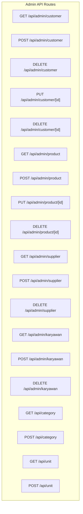
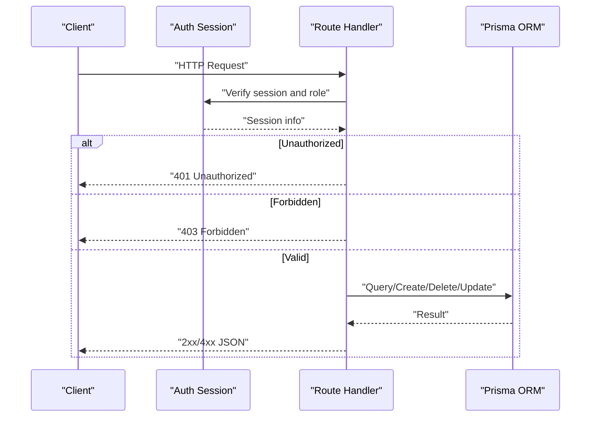
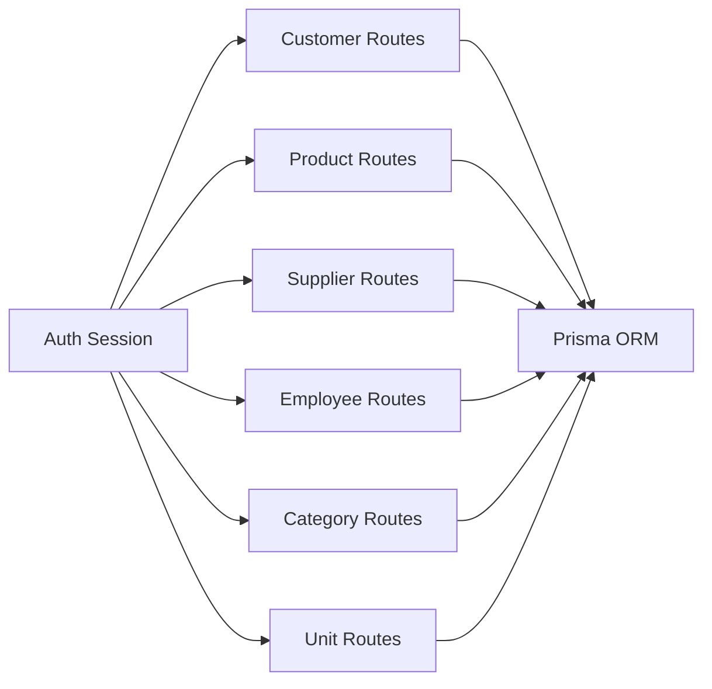

# Master Data Management API

<cite>
**Referenced Files in This Document**
- [customer.route.ts](file://src/app/api/admin/customer/route.ts)
- [customer.[id].route.ts](file://src/app/api/admin/customer/[id]/route.ts)
- [product.route.ts](file://src/app/api/admin/product/route.ts)
- [product.[id].route.ts](file://src/app/api/admin/product/[id]/route.ts)
- [supplier.route.ts](file://src/app/api/admin/supplier/route.ts)
- [karyawan.route.ts](file://src/app/api/admin/karyawan/route.ts)
- [category.route.ts](file://src/app/api/category/route.ts)
- [unit.route.ts](file://src/app/api/unit/route.ts)
</cite>

## Table of Contents
1. [Introduction](#introduction)
2. [Project Structure](#project-structure)
3. [Core Components](#core-components)
4. [Architecture Overview](#architecture-overview)
5. [Detailed Component Analysis](#detailed-component-analysis)
6. [Dependency Analysis](#dependency-analysis)
7. [Performance Considerations](#performance-considerations)
8. [Troubleshooting Guide](#troubleshooting-guide)
9. [Conclusion](#conclusion)
10. [Appendices](#appendices)

## Introduction
This document provides comprehensive API documentation for master data management endpoints. It covers HTTP methods, URL patterns, request/response schemas, validation rules, and business logic for managing customers, products, suppliers, employees (staff), categories, and units. The APIs enforce role-based access control and support CRUD operations, bulk deletions, and search/filtering capabilities.

## Project Structure
Master data endpoints are implemented as Next.js App Router API routes under the `/api/admin` namespace. Each domain (customer, product, supplier, karyawan) has dedicated route handlers for list/create/bulk delete and individual resource endpoints for update/delete. Reference data (categories and units) share similar patterns for listing and creation.

**Diagram sources**
- [customer.route.ts:7-198](file://src/app/api/admin/customer/route.ts#L7-L198)
- [customer.[id].route.ts](file://src/app/api/admin/customer/[id]/route.ts#L6-L124)
- [product.route.ts:7-268](file://src/app/api/admin/product/route.ts#L7-L268)
- [product.[id].route.ts](file://src/app/api/admin/product/[id]/route.ts#L6-L225)
- [supplier.route.ts:6-208](file://src/app/api/admin/supplier/route.ts#L6-L208)
- [karyawan.route.ts:6-184](file://src/app/api/admin/karyawan/route.ts#L6-L184)
- [category.route.ts:6-136](file://src/app/api/category/route.ts#L6-L136)
- [unit.route.ts:6-136](file://src/app/api/unit/route.ts#L6-L136)

**Section sources**
- [customer.route.ts:1-198](file://src/app/api/admin/customer/route.ts#L1-L198)
- [product.route.ts:1-268](file://src/app/api/admin/product/route.ts#L1-L268)
- [supplier.route.ts:1-208](file://src/app/api/admin/supplier/route.ts#L1-L208)
- [karyawan.route.ts:1-184](file://src/app/api/admin/karyawan/route.ts#L1-L184)
- [category.route.ts:1-136](file://src/app/api/category/route.ts#L1-L136)
- [unit.route.ts:1-136](file://src/app/api/unit/route.ts#L1-L136)

## Core Components
- Authentication and Authorization: All endpoints require a valid session. Roles vary by endpoint (admin, kasir, gudang, produksi, designer).
- Pagination and Filtering: List endpoints accept page, limit, and search parameters. Products support category/unit filters and service flag.
- Soft Deletion: Customer bulk delete uses soft deletion via a deletedAt timestamp; product delete also soft-deletes.
- Related Data Queries: Product listings include computed sales quantity; customer listings include order summaries.

**Section sources**
- [customer.route.ts:17-22](file://src/app/api/admin/customer/route.ts#L17-L22)
- [product.route.ts:21-52](file://src/app/api/admin/product/route.ts#L21-L52)
- [product.[id].route.ts](file://src/app/api/admin/product/[id]/route.ts#L23-L28)
- [customer.[id].route.ts](file://src/app/api/admin/customer/[id]/route.ts#L19-L24)

## Architecture Overview
The API follows a layered pattern:
- Route handlers validate session and roles, parse query/body, and delegate to Prisma ORM.
- Business validations include presence checks, uniqueness, referential integrity, and type coercion.
- Responses are JSON with consistent structure for lists and success/error payloads.

**Diagram sources**
- [customer.route.ts:10-22](file://src/app/api/admin/customer/route.ts#L10-L22)
- [product.route.ts:121-137](file://src/app/api/admin/product/route.ts#L121-L137)
- [supplier.route.ts:75-91](file://src/app/api/admin/supplier/route.ts#L75-L91)

## Detailed Component Analysis

### Customers
- Purpose: Manage customer records with optional avatar images and phone numbers.
- Roles: admin, kasir.
- Base URL: `/api/admin/customer`

Endpoints
- GET /api/admin/customer
  - Query parameters:
    - page: integer, default 1
    - limit: integer, default 10
    - search: string (substring match on nama)
  - Response: results array with pagination metadata; each customer includes computed summary fields derived from related orders.
  - Validation: none (filters applied server-side).
  - Success indicator: 200 OK.

- POST /api/admin/customer
  - Request body:
    - nama: string, required
    - nomorHp: string, required
    - image: string | null, optional
  - Validation:
    - Presence checks for required fields.
    - Unique constraint on nama.
  - Success indicator: 201 Created with customer payload.

- DELETE /api/admin/customer
  - Request body:
    - ids: string[], required
  - Behavior: Soft deletes multiple customers by setting deletedAt.
  - Success indicator: 200 OK with message.

Individual Resource
- PUT /api/admin/customer/[id]
  - Request body:
    - nama: string, required
    - nomorHp: string, required
    - image: string | null, optional (omitting retains current value)
  - Validation:
    - Required fields.
    - Uniqueness of nama excluding self.
  - Success indicator: 200 OK with updated customer.

- DELETE /api/admin/customer/[id]
  - Behavior: Hard deletes the customer record.
  - Success indicator: 200 OK with message.

Response Schema (List)
- results: array of customer objects with computed fields
  - id: string
  - nama: string
  - nomorHp: string
  - image: string | null
  - createdAt: datetime
  - updatedAt: datetime
  - firstOrder: object | null (order summary)
  - totalOrder: number
  - totalSpend: number
- count: number
- page: number
- limit: number
- totalPages: number

Validation Rules
- Required fields per operation.
- Unique constraints enforced at API level.
- Role-based access control.

Success Indicators
- 200 OK for successful reads, updates, deletes.
- 201 Created for successful creation.
- 400 Bad Request for validation errors.
- 401 Unauthorized for missing/invalid sessions.
- 403 Forbidden for insufficient roles.
- 404 Not Found for missing resources.

**Section sources**
- [customer.route.ts:7-85](file://src/app/api/admin/customer/route.ts#L7-L85)
- [customer.route.ts:87-155](file://src/app/api/admin/customer/route.ts#L87-L155)
- [customer.route.ts:157-198](file://src/app/api/admin/customer/route.ts#L157-L198)
- [customer.[id].route.ts](file://src/app/api/admin/customer/[id]/route.ts#L6-L83)
- [customer.[id].route.ts](file://src/app/api/admin/customer/[id]/route.ts#L85-L124)

### Products
- Purpose: Manage products with pricing, inventory, categorization, and unit of measure.
- Roles: admin, kasir, gudang.
- Base URL: `/api/admin/product`

Endpoints
- GET /api/admin/product
  - Query parameters:
    - page: integer, default 1
    - limit: integer, default 10
    - search: string (substring match on nama or sku)
    - categoryId: string, optional
    - unitId: string, optional
    - isService: "true"|"false"|undefined, optional
  - Response: results array with computed terjual (quantity sold) and category/unit relations.
  - Success indicator: 200 OK.

- POST /api/admin/product
  - Request body:
    - sku: string, required
    - nama: string, required
    - image: string | null, optional
    - hpp: number|string, required (converted to float)
    - hargaJual: number|string, required (converted to float)
    - stok: number|string | null, optional (converted to float or null)
    - minStok: number|string | null, optional (converted to float or null)
    - isService: boolean|string, required (Boolean coerced)
    - categoryId: string, required
    - unitId: string, required
  - Validation:
    - Presence of required fields.
    - Referential integrity: categoryId and unitId must reference existing records.
    - Unique constraint on sku.
  - Success indicator: 201 Created with product payload.

Individual Resource
- PUT /api/admin/product/[id]
  - Request body: same as POST except all fields are optional (partial updates).
  - Validation:
    - Required fields if provided.
    - Referential integrity for categoryId/unitId.
    - Unique constraint on sku excluding self.
  - Success indicator: 200 OK with updated product.

- DELETE /api/admin/product/[id]
  - Behavior: Soft deletes product by setting deletedAt.
  - Success indicator: 200 OK with message.

Response Schema (List)
- results: array of product objects
  - id: string
  - sku: string
  - nama: string
  - image: string | null
  - hpp: number
  - hargaJual: number
  - stok: number | null
  - minStok: number | null
  - isService: boolean
  - createdAt: datetime
  - updatedAt: datetime
  - category: { id: string, nama: string } | null
  - unit: { id: string, nama: string } | null
  - terjual: number
- count: number
- page: number
- limit: number
- totalPages: number

Validation Rules
- Required fields for creation/update.
- Referential integrity checks for category and unit.
- Numeric conversions and null handling for inventory fields.
- Unique SKU constraint.

Success Indicators
- 200 OK for successful reads, updates, deletes.
- 201 Created for successful creation.
- 400 Bad Request for validation errors.
- 401 Unauthorized for missing/invalid sessions.
- 403 Forbidden for insufficient roles.
- 404 Not Found for missing resources.

**Section sources**
- [product.route.ts:7-116](file://src/app/api/admin/product/route.ts#L7-L116)
- [product.route.ts:118-268](file://src/app/api/admin/product/route.ts#L118-L268)
- [product.[id].route.ts](file://src/app/api/admin/product/[id]/route.ts#L6-L170)
- [product.[id].route.ts](file://src/app/api/admin/product/[id]/route.ts#L172-L225)

### Suppliers
- Purpose: Manage supplier records with contact details and status.
- Roles: admin, gudang.
- Base URL: `/api/admin/supplier`

Endpoints
- GET /api/admin/supplier
  - Query parameters:
    - page: integer, default 1
    - limit: integer, default 10
    - all: "true" | undefined, when "true" ignores pagination
    - search: string (substring match on nama)
    - isActive: "true"|"false"|"all", optional
  - Response: results array with pagination metadata.
  - Success indicator: 200 OK.

- POST /api/admin/supplier
  - Request body:
    - nama: string, required
    - nomorHp: string, required
    - email: string | null, optional
    - alamat: string | null, optional
    - keterangan: string | null, optional
    - image: string | null, optional
  - Validation:
    - Presence checks for required fields.
    - Unique constraint on nama.
  - Success indicator: 201 Created with supplier payload.

- DELETE /api/admin/supplier
  - Request body:
    - ids: string[], required
  - Behavior: Hard deletes multiple suppliers.
  - Success indicator: 200 OK with message.

Response Schema (List)
- results: array of supplier objects
  - id: string
  - nama: string
  - nomorHp: string
  - email: string | null
  - alamat: string | null
  - keterangan: string | null
  - image: string | null
  - createdAt: datetime
  - updatedAt: datetime
  - isActive: boolean
- count: number
- page: number
- limit: number
- totalPages: number

Validation Rules
- Required fields for creation.
- Unique constraint on nama.

Success Indicators
- 200 OK for successful reads, updates, deletes.
- 201 Created for successful creation.
- 400 Bad Request for validation errors.
- 401 Unauthorized for missing/invalid sessions.
- 403 Forbidden for insufficient roles.
- 404 Not Found for missing resources.

**Section sources**
- [supplier.route.ts:6-70](file://src/app/api/admin/supplier/route.ts#L6-L70)
- [supplier.route.ts:72-162](file://src/app/api/admin/supplier/route.ts#L72-L162)
- [supplier.route.ts:164-208](file://src/app/api/admin/supplier/route.ts#L164-L208)

### Employees (Staff)
- Purpose: Manage employee records with contact and position details.
- Roles: admin only.
- Base URL: `/api/admin/karyawan`

Endpoints
- GET /api/admin/karyawan
  - Query parameters:
    - page: integer, default 1
    - limit: integer, default 10
    - search: string (substring match on nama)
    - isActive: "true"|"false"|"all", optional
  - Response: results array with pagination metadata.
  - Success indicator: 200 OK.

- POST /api/admin/karyawan
  - Request body:
    - nama: string, required
    - nomorHp: string | null, optional
    - posisi: string | null, optional
  - Validation:
    - Presence check for nama.
    - Unique constraint on nama.
  - Success indicator: 201 Created with karyawan payload.

- DELETE /api/admin/karyawan
  - Request body:
    - ids: string[], required
  - Behavior: Hard deletes multiple employees.
  - Success indicator: 200 OK with message.

Response Schema (List)
- results: array of karyawan objects
  - id: string
  - nama: string
  - nomorHp: string | null
  - posisi: string | null
  - createdAt: datetime
  - updatedAt: datetime
  - isActive: boolean
- count: number
- page: number
- limit: number
- totalPages: number

Validation Rules
- Required fields for creation.
- Unique constraint on nama.

Success Indicators
- 200 OK for successful reads, updates, deletes.
- 201 Created for successful creation.
- 400 Bad Request for validation errors.
- 401 Unauthorized for missing/invalid sessions.
- 403 Forbidden for insufficient roles.
- 404 Not Found for missing resources.

**Section sources**
- [karyawan.route.ts:6-69](file://src/app/api/admin/karyawan/route.ts#L6-L69)
- [karyawan.route.ts:71-138](file://src/app/api/admin/karyawan/route.ts#L71-L138)
- [karyawan.route.ts:140-184](file://src/app/api/admin/karyawan/route.ts#L140-L184)

### Categories
- Purpose: Manage product categories used for classification.
- Roles: admin, kasir.
- Base URL: `/api/category`

Endpoints
- GET /api/category
  - Query parameters:
    - page: integer, default 1
    - limit: integer, default 10
    - search: string (substring match on nama)
  - Response: results array with pagination metadata and product count per category.
  - Success indicator: 200 OK.

- POST /api/category
  - Request body:
    - nama: string, required
  - Validation:
    - Presence check for nama.
    - Unique constraint on nama.
  - Success indicator: 201 Created with category payload.

Response Schema (List)
- results: array of category objects
  - id: string
  - nama: string
  - createdAt: datetime
  - updatedAt: datetime
  - _count.products: number
- count: number
- page: number
- limit: number
- totalPages: number

Validation Rules
- Required fields for creation.
- Unique constraint on nama.

Success Indicators
- 200 OK for successful reads.
- 201 Created for successful creation.
- 400 Bad Request for validation errors.
- 401 Unauthorized for missing/invalid sessions.
- 403 Forbidden for insufficient roles.

**Section sources**
- [category.route.ts:6-64](file://src/app/api/category/route.ts#L6-L64)
- [category.route.ts:66-136](file://src/app/api/category/route.ts#L66-L136)

### Units
- Purpose: Manage units of measure used for products.
- Roles: admin, kasir.
- Base URL: `/api/unit`

Endpoints
- GET /api/unit
  - Query parameters:
    - page: integer, default 1
    - limit: integer, default 10
    - search: string (substring match on nama)
  - Response: results array with pagination metadata and product count per unit.
  - Success indicator: 200 OK.

- POST /api/unit
  - Request body:
    - nama: string, required
  - Validation:
    - Presence check for nama.
    - Unique constraint on nama.
  - Success indicator: 201 Created with unit payload.

Response Schema (List)
- results: array of unit objects
  - id: string
  - nama: string
  - createdAt: datetime
  - updatedAt: datetime
  - _count.products: number
- count: number
- page: number
- limit: number
- totalPages: number

Validation Rules
- Required fields for creation.
- Unique constraint on nama.

Success Indicators
- 200 OK for successful reads.
- 201 Created for successful creation.
- 400 Bad Request for validation errors.
- 401 Unauthorized for missing/invalid sessions.
- 403 Forbidden for insufficient roles.

**Section sources**
- [unit.route.ts:6-64](file://src/app/api/unit/route.ts#L6-L64)
- [unit.route.ts:66-136](file://src/app/api/unit/route.ts#L66-L136)

## Dependency Analysis
- Authentication: All routes use a shared session verification utility to extract role and enforce access control.
- Data Access: Prisma ORM handles database operations with explicit selects for performance and safety.
- Relationships:
  - Product belongs to Category and Unit (foreign keys).
  - Customer has related Orders (aggregated in list view).
  - Category and Unit maintain counts of associated products.

**Diagram sources**
- [customer.route.ts:9-11](file://src/app/api/admin/customer/route.ts#L9-L11)
- [product.route.ts:4-5](file://src/app/api/admin/product/route.ts#L4-L5)
- [supplier.route.ts:3-4](file://src/app/api/admin/supplier/route.ts#L3-L4)
- [karyawan.route.ts:3-4](file://src/app/api/admin/karyawan/route.ts#L3-L4)
- [category.route.ts:1-4](file://src/app/api/category/route.ts#L1-L4)
- [unit.route.ts:1-4](file://src/app/api/unit/route.ts#L1-L4)

**Section sources**
- [customer.route.ts:1-5](file://src/app/api/admin/customer/route.ts#L1-L5)
- [product.route.ts:1-5](file://src/app/api/admin/product/route.ts#L1-L5)
- [supplier.route.ts:1-4](file://src/app/api/admin/supplier/route.ts#L1-L4)
- [karyawan.route.ts:1-4](file://src/app/api/admin/karyawan/route.ts#L1-L4)
- [category.route.ts:1-4](file://src/app/api/category/route.ts#L1-L4)
- [unit.route.ts:1-4](file://src/app/api/unit/route.ts#L1-L4)

## Performance Considerations
- Pagination: All list endpoints support page and limit; use limit to cap result sets.
- Filtering: Use search and category/unit filters to reduce payload sizes.
- Selective Fields: Handlers specify selected fields to minimize data transfer.
- Parallel Queries: Count and list queries are executed concurrently for improved latency.
- Soft Deletes: Prefer soft deletes to avoid expensive cascading operations.

[No sources needed since this section provides general guidance]

## Troubleshooting Guide
Common Issues and Resolutions
- 401 Unauthorized
  - Cause: Missing or invalid session.
  - Resolution: Authenticate and retry with a valid session cookie/token.
- 403 Forbidden
  - Cause: Insufficient role for the endpoint.
  - Resolution: Ensure the user has the required role (admin, kasir, gudang, etc.).
- 400 Bad Request
  - Cause: Missing required fields, invalid types, duplicates, or invalid foreign keys.
  - Resolution: Validate request body against documented schemas and constraints.
- 404 Not Found
  - Cause: Resource not found by ID.
  - Resolution: Verify the ID exists and is not soft-deleted (where applicable).
- Internal Server Errors (500)
  - Cause: Unexpected runtime errors.
  - Resolution: Retry after checking server logs; ensure Prisma connection is healthy.

**Section sources**
- [customer.route.ts:13-18](file://src/app/api/admin/customer/route.ts#L13-L18)
- [product.route.ts:132-137](file://src/app/api/admin/product/route.ts#L132-L137)
- [supplier.route.ts:86-91](file://src/app/api/admin/supplier/route.ts#L86-L91)
- [karyawan.route.ts:85-90](file://src/app/api/admin/karyawan/route.ts#L85-L90)
- [category.route.ts:83-92](file://src/app/api/category/route.ts#L83-L92)
- [unit.route.ts:96-105](file://src/app/api/unit/route.ts#L96-L105)

## Conclusion
The master data management API provides robust, role-aware endpoints for maintaining customers, products, suppliers, employees, categories, and units. It enforces strong validation, supports efficient pagination and filtering, and integrates seamlessly with related business modules through foreign keys and computed aggregates.

[No sources needed since this section summarizes without analyzing specific files]

## Appendices

### Practical Examples

- Create a Product
  - Method: POST
  - URL: `/api/admin/product`
  - Body:
    - sku: "SKU001"
    - nama: "Premium Widget"
    - hpp: "15000"
    - hargaJual: "25000"
    - stok: "100"
    - minStok: "10"
    - isService: false
    - categoryId: "cat-uuid"
    - unitId: "unit-uuid"
  - Expected: 201 Created with product payload.

- List Products with Filters
  - Method: GET
  - URL: `/api/admin/product?page=1&limit=20&search=Widget&categoryId=cat-uuid&unitId=unit-uuid&isService=false`
  - Expected: 200 OK with paginated results including computed terjual.

- Update a Supplier
  - Method: PUT
  - URL: `/api/admin/supplier/[id]`
  - Body:
    - nama: "Updated Supplier Name"
    - nomorHp: "081234567890"
  - Expected: 200 OK with updated supplier.

- Bulk Delete Employees
  - Method: DELETE
  - URL: `/api/admin/karyawan`
  - Body:
    - ids: ["emp-1", "emp-2"]
  - Expected: 200 OK with confirmation message.

- Create a Category
  - Method: POST
  - URL: `/api/category`
  - Body:
    - nama: "Electronics"
  - Expected: 201 Created with category payload.

**Section sources**
- [product.route.ts:118-268](file://src/app/api/admin/product/route.ts#L118-L268)
- [product.[id].route.ts](file://src/app/api/admin/product/[id]/route.ts#L6-L170)
- [supplier.route.ts:72-162](file://src/app/api/admin/supplier/route.ts#L72-L162)
- [karyawan.route.ts:140-184](file://src/app/api/admin/karyawan/route.ts#L140-L184)
- [category.route.ts:66-136](file://src/app/api/category/route.ts#L66-L136)

### Client Implementation Guidelines
- Authentication: Include session credentials with each request; handle 401/403 gracefully.
- Idempotency: Use unique identifiers (UUIDs) consistently across requests.
- Error Handling: Parse error messages and missingFields arrays to guide UI feedback.
- Pagination: Respect page and limit; implement infinite scroll or pagination controls.
- Search: Apply substring filters on nama and sku fields for quick lookups.

[No sources needed since this section provides general guidance]

### Integration Patterns
- POS Module: Use customer endpoints to resolve customer details during checkout; product endpoints to fetch pricing and availability.
- Inventory Module: Use product endpoints to compute stock movements and low-stock alerts; supplier endpoints to manage vendor data.
- Reports Module: Aggregate data from product sales and customer order histories for financial reporting.

[No sources needed since this section provides general guidance]