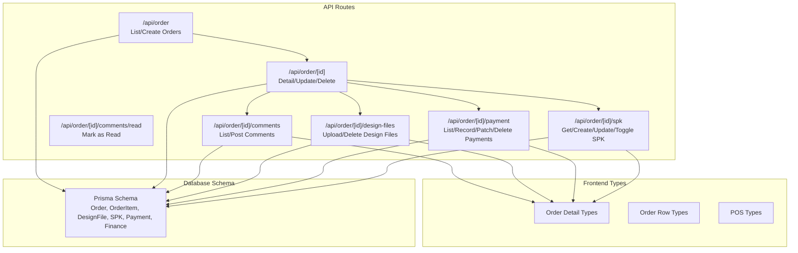
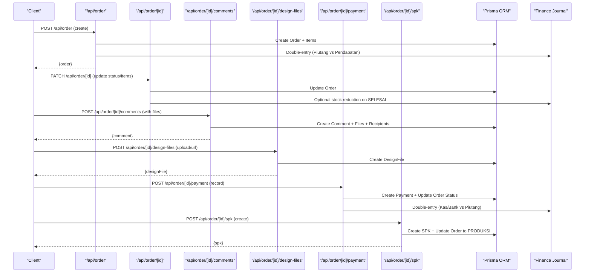
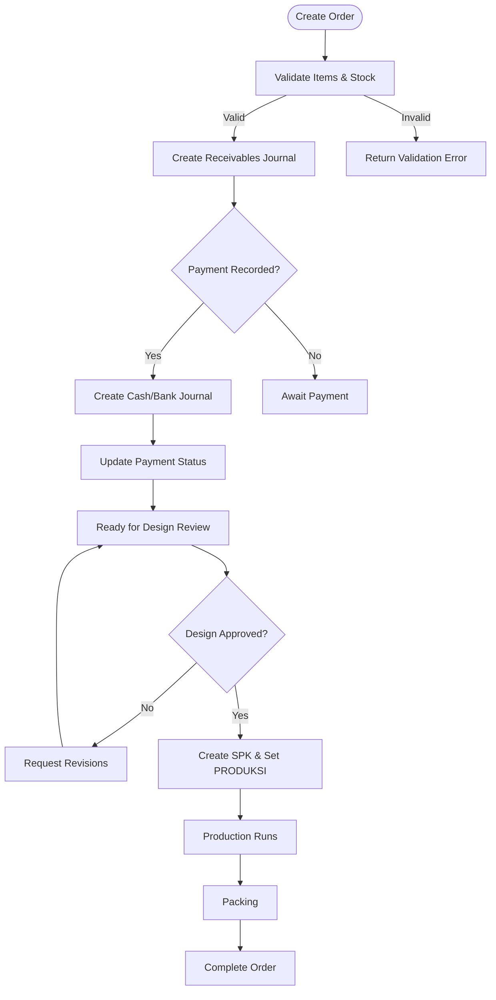
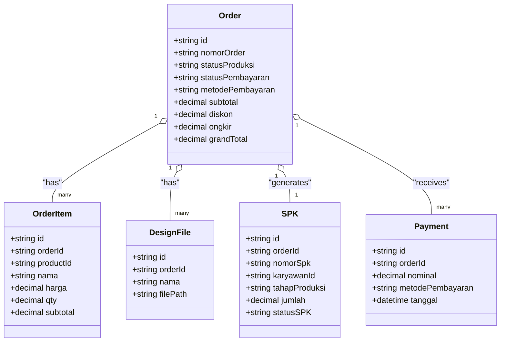

# Order Management API

<cite>
**Referenced Files in This Document**
- [route.ts](file://src/app/api/order/route.ts)
- [route.ts](file://src/app/api/order/[id]/route.ts)
- [route.ts](file://src/app/api/order/[id]/comments/route.ts)
- [route.ts](file://src/app/api/order/[id]/comments/read/route.ts)
- [route.ts](file://src/app/api/order/[id]/design-files/route.ts)
- [route.ts](file://src/app/api/order/[id]/payment/route.ts)
- [route.ts](file://src/app/api/order/[id]/spk/route.ts)
- [types.ts](file://src/app/(LoggedIn)/order/[id]/components/types.ts)
- [types.ts](file://src/app/(LoggedIn)/order/components/types.ts)
- [types.ts](file://src/app/(LoggedIn)/order/pos/components/types.ts)
- [schema.prisma](file://prisma/schema.prisma)
</cite>

## Table of Contents
1. [Introduction](#introduction)
2. [Project Structure](#project-structure)
3. [Core Components](#core-components)
4. [Architecture Overview](#architecture-overview)
5. [Detailed Component Analysis](#detailed-component-analysis)
6. [Dependency Analysis](#dependency-analysis)
7. [Performance Considerations](#performance-considerations)
8. [Troubleshooting Guide](#troubleshooting-guide)
9. [Conclusion](#conclusion)
10. [Appendices](#appendices)

## Introduction
This document provides comprehensive API documentation for the order management system. It covers endpoints for listing, creating, updating, and deleting orders; managing order comments and design file uploads; generating SPK (Production Work Order); and recording payments with financial reconciliation. It also documents request/response schemas, parameter specifications, validation rules, status transitions, and integration points with inventory and finance systems.

## Project Structure
The order management API is implemented as Next.js App Router API routes grouped under the order namespace. Supporting frontend types define shared data structures and enums used across the UI and API.

**Diagram sources**
- [route.ts:55-139](file://src/app/api/order/route.ts#L55-L139)
- [route.ts:119-146](file://src/app/api/order/[id]/route.ts#L119-L146)
- [route.ts:36-76](file://src/app/api/order/[id]/comments/route.ts#L36-L76)
- [route.ts:8-43](file://src/app/api/order/[id]/comments/read/route.ts#L8-L43)
- [route.ts:36-173](file://src/app/api/order/[id]/design-files/route.ts#L36-L173)
- [route.ts:21-45](file://src/app/api/order/[id]/payment/route.ts#L21-L45)
- [route.ts:37-57](file://src/app/api/order/[id]/spk/route.ts#L37-L57)
- [types.ts](file://src/app/(LoggedIn)/order/[id]/components/types.ts#L20-L80)
- [types.ts](file://src/app/(LoggedIn)/order/components/types.ts#L1-L73)
- [types.ts](file://src/app/(LoggedIn)/order/pos/components/types.ts#L1-L53)
- [schema.prisma:260-420](file://prisma/schema.prisma#L260-L420)

**Section sources**
- [route.ts:55-139](file://src/app/api/order/route.ts#L55-L139)
- [route.ts:119-146](file://src/app/api/order/[id]/route.ts#L119-L146)
- [route.ts:36-76](file://src/app/api/order/[id]/comments/route.ts#L36-L76)
- [route.ts:8-43](file://src/app/api/order/[id]/comments/read/route.ts#L8-L43)
- [route.ts:36-173](file://src/app/api/order/[id]/design-files/route.ts#L36-L173)
- [route.ts:21-45](file://src/app/api/order/[id]/payment/route.ts#L21-L45)
- [route.ts:37-57](file://src/app/api/order/[id]/spk/route.ts#L37-L57)
- [types.ts](file://src/app/(LoggedIn)/order/[id]/components/types.ts#L20-L80)
- [types.ts](file://src/app/(LoggedIn)/order/components/types.ts#L1-L73)
- [types.ts](file://src/app/(LoggedIn)/order/pos/components/types.ts#L1-L53)
- [schema.prisma:260-420](file://prisma/schema.prisma#L260-L420)

## Core Components
- Order CRUD: list, create, update, delete orders with pagination and filtering.
- Comments: threaded comments with optional file attachments.
- Design Files: upload and manage design assets with external URL support.
- Payments: record, correct, and delete payments; reconcile with finance.
- SPK: create, update, and toggle production work order status.
- Financial Integration: double-entry journal entries for order creation and payments.

**Section sources**
- [route.ts:141-442](file://src/app/api/order/route.ts#L141-L442)
- [route.ts:148-615](file://src/app/api/order/[id]/route.ts#L148-L615)
- [route.ts:36-234](file://src/app/api/order/[id]/comments/route.ts#L36-L234)
- [route.ts:36-232](file://src/app/api/order/[id]/design-files/route.ts#L36-L232)
- [route.ts:21-338](file://src/app/api/order/[id]/payment/route.ts#L21-L338)
- [route.ts:37-273](file://src/app/api/order/[id]/spk/route.ts#L37-L273)
- [schema.prisma:260-420](file://prisma/schema.prisma#L260-L420)

## Architecture Overview
The order lifecycle spans order creation, design review, production coordination, and payment reconciliation. The backend enforces role-based access, validates inputs, performs atomic operations, and triggers notifications and journals.

**Diagram sources**
- [route.ts:141-442](file://src/app/api/order/route.ts#L141-L442)
- [route.ts:148-615](file://src/app/api/order/[id]/route.ts#L148-L615)
- [route.ts:78-234](file://src/app/api/order/[id]/comments/route.ts#L78-L234)
- [route.ts:36-232](file://src/app/api/order/[id]/design-files/route.ts#L36-L232)
- [route.ts:47-173](file://src/app/api/order/[id]/payment/route.ts#L47-L173)
- [route.ts:59-151](file://src/app/api/order/[id]/spk/route.ts#L59-L151)
- [schema.prisma:260-420](file://prisma/schema.prisma#L260-L420)

## Detailed Component Analysis

### Order Listing and Creation
- Endpoint: GET /api/order
  - Purpose: Paginated listing with filters and sorting.
  - Query parameters:
    - page, limit, search, statusProduksi, statusPembayaran, customerId, sortBy
  - Sorting: deadline ascending (nulls last) or createdAt descending.
  - Response: { results, count, page, limit, totalPages } with selected fields.
- Endpoint: POST /api/order
  - Purpose: Create a new order with items, calculate totals, apply defaults, and validate inventory.
  - Request body fields:
    - customerId, channel, statusPembayaran, metodePembayaran, deadline, catatan, diskon, ongkir, subtotal, grandTotal, items[], kasBankId, nominalBayar
  - Validation:
    - Required: customerId, items (non-empty), subtotal and grandTotal present.
    - Payment validation: if statusPembayaran is DP/LUNAS, kasBankId and nominalBayar required and nominalBayar ≤ grandTotal.
    - Customer and product existence checks.
    - Stock availability for non-service products.
  - Defaults:
    - Channel defaults to LANGSURY, statusProduksi to PENDING, metodePembayaran to TUNAI.
    - Deadline auto-generated from settings if not provided.
    - DP upgraded to LUNAS if nominalBayar ≥ grandTotal.
  - Financial journal:
    - Creates double-entry for receivables upon order creation.
    - If payment recorded during creation, creates dual journal for cash/bank receipt.
  - Notifications: broadcast new order to admin/kasir/produksi/designer/gudang.

Response schema (creation):
- Success: { message, order }
- Error: { error } with appropriate HTTP status (400/403/404/500).

**Section sources**
- [route.ts:55-139](file://src/app/api/order/route.ts#L55-L139)
- [route.ts:141-442](file://src/app/api/order/route.ts#L141-L442)
- [schema.prisma:260-296](file://prisma/schema.prisma#L260-L296)

### Order Detail and Updates
- Endpoint: GET /api/order/[id]
  - Purpose: Retrieve full order detail with items, design files, payments, and SPK.
  - Response: { order } with nested relations and counts.
- Endpoint: PATCH /api/order/[id]
  - Purpose: Update order metadata and state with role-based restrictions.
  - Allowed fields by role:
    - All roles: statusProduksi, statusPembayaran, metodePembayaran, catatan, deadline, diskon, ongkir, isDesignFinal, designReviewStatus.
    - Admin only: customerId, channel, items (full replacement).
  - Validation:
    - statusProduksi must be one of PENDING, DESAIN, PRODUKSI, PACKING, SELESAI, BATAL.
    - statusPembayaran must be one of BELUM_BAYAR, DP, LUNAS.
    - Designer assignment: only admin/designer can claim; designer can only claim self.
    - isDesignFinal syncs designReviewStatus to ACC when true; resets when false.
    - designReviewStatus transitions: PENDING_REVIEW (designer/admin), ACC/REVISI (admin/kasir).
  - Inventory adjustment:
    - On statusProduksi=SELESAI and previous != SELESAI, decrement stock for non-service items.
  - Notifications: status change broadcasts to relevant roles.
  - Item replacement (admin): deletes old items and inserts new ones atomically.

Response schema (update):
- Success: { message, order }
- Error: { error } with appropriate HTTP status (400/403/404/500).

**Section sources**
- [route.ts:119-146](file://src/app/api/order/[id]/route.ts#L119-L146)
- [route.ts:148-615](file://src/app/api/order/[id]/route.ts#L148-L615)
- [types.ts](file://src/app/(LoggedIn)/order/[id]/components/types.ts#L20-L80)

### Order Comments
- Endpoint: GET /api/order/[id]/comments
  - Purpose: List comment thread with author and attached files.
  - Response: { comments[] } ordered by createdAt.
- Endpoint: POST /api/order/[id]/comments
  - Purpose: Post a comment with optional file attachments.
  - Form fields:
    - text (optional), files[] (multiple)
  - Validation:
    - At least one of text or files required.
    - Max file size 10MB; allowed MIME types include images, PDF, AI, PSD, ZIP.
  - Storage:
    - Uploads files to object storage; stores URLs in DB.
  - Recipients:
    - Creates recipients for admin, kasir, designer excluding the sender.
  - Real-time:
    - Triggers Pusher events for new comment notifications.

Response schema (post):
- Success: { comment } with files populated.
- Error: { error } with appropriate HTTP status (400/403/404/500).

- Endpoint: PATCH /api/order/[id]/comments/read
  - Purpose: Mark all comments for the current user as read.
  - Response: { message }

**Section sources**
- [route.ts:36-234](file://src/app/api/order/[id]/comments/route.ts#L36-L234)
- [route.ts:8-43](file://src/app/api/order/[id]/comments/read/route.ts#L8-L43)

### Design File Uploads
- Endpoint: POST /api/order/[id]/design-files
  - Purpose: Upload design assets or save external URLs.
  - Modes:
    - JSON mode: application/json with { nama, fileUrl }.
    - Form mode: multipart/form-data with { file, nama }.
  - Validation:
    - JSON mode: nama and valid URL required.
    - Form mode: file and nama required; size and MIME checks.
  - Storage:
    - Stores file in object storage; returns public URL.
  - Response: { designFile }.

- Endpoint: DELETE /api/order/[id]/design-files
  - Purpose: Remove design file and storage (if applicable).
  - Body: { designFileId }
  - Behavior:
    - Skips S3 deletion for external URLs detected by host patterns.
  - Response: { message }.

Response schema (both):
- Success: { designFile | message }
- Error: { error } with appropriate HTTP status (400/403/404/500).

**Section sources**
- [route.ts:36-232](file://src/app/api/order/[id]/design-files/route.ts#L36-L232)

### Payments
- Endpoint: GET /api/order/[id]/payment
  - Purpose: List payments for an order.
  - Response: { payments[] } ordered by tanggal desc.

- Endpoint: POST /api/order/[id]/payment
  - Purpose: Record a payment and reconcile order status.
  - Request body: { nominal, metodePembayaran, keterangan, tanggal, kasBankId }
  - Validation:
    - nominal > 0; kasBankId required; account must exist.
    - Nominal cannot exceed outstanding balance.
  - Status calculation:
    - LUNAS if total paid ≥ grandTotal; DP otherwise.
  - Journal:
    - Double-entry: debit kas/bank account, credit receivables (1-003).
  - Response: { message, payment, statusPembayaran }.

- Endpoint: PATCH /api/order/[id]/payment?paymentId=...
  - Purpose: Correct a payment (journal correction and recompute status).
  - Request body: { nominal, metodePembayaran, keterangan, tanggal, kasBankId }
  - Behavior:
    - Soft-deletes old journal; creates new journal with corrected values.
    - Recalculates order status based on remaining payments.

- Endpoint: DELETE /api/order/[id]/payment?paymentId=...
  - Purpose: Delete a payment (admin only).
  - Behavior:
    - Soft-deletes journal and payment; recalculates order status.

Response schema (all):
- Success: { payments | message | payment, statusPembayaran }
- Error: { error } with appropriate HTTP status (400/403/404/500).

**Section sources**
- [route.ts:21-338](file://src/app/api/order/[id]/payment/route.ts#L21-L338)
- [schema.prisma:399-419](file://prisma/schema.prisma#L399-L419)

### SPK Generation and Updates
- Endpoint: GET /api/order/[id]/spk
  - Purpose: Retrieve existing SPK for an order.
  - Response: { spk } with worker info.

- Endpoint: POST /api/order/[id]/spk
  - Purpose: Create SPK and update order status to PRODUKSI.
  - Request body: { karyawanId, model, tali, ukuran, jumlah, tanggalSetor, catatan }
  - Validation:
    - karyawanId required; jumlah numeric.
  - Behavior:
    - Generates SPK number from settings.
    - Atomic transaction: create SPK and update order status.
  - Response: { message, spk }.

- Endpoint: PUT /api/order/[id]/spk
  - Purpose: Update SPK details.
  - Request body: Partial fields (karyawanId, model, tali, ukuran, jumlah, tanggalSetor, catatan).
  - Response: { message, spk }.

- Endpoint: PATCH /api/order/[id]/spk
  - Purpose: Toggle printing approval (accCetak) and/or mark SPK status (SELESAI).
  - Request body: { accCetak?, statusSPK? }
  - Behavior:
    - On statusSPK=SELESAI, updates order status to PACKING and notifies.

Response schema (all):
- Success: { spk | message }
- Error: { error } with appropriate HTTP status (400/403/404/500).

**Section sources**
- [route.ts:37-273](file://src/app/api/order/[id]/spk/route.ts#L37-L273)

### Order Lifecycle Workflow

**Diagram sources**
- [route.ts:141-442](file://src/app/api/order/route.ts#L141-L442)
- [route.ts:148-615](file://src/app/api/order/[id]/route.ts#L148-L615)
- [route.ts:47-173](file://src/app/api/order/[id]/payment/route.ts#L47-L173)
- [route.ts:59-151](file://src/app/api/order/[id]/spk/route.ts#L59-L151)

## Dependency Analysis
- Authentication and Roles:
  - requireOrderAccess and requireAccess enforce role-based permissions across endpoints.
- Database Relations:
  - Order has items, payments, design files, comments, SPK, and customer relations.
  - Payments link to journals; SPK links to order and worker.
- Frontend Types:
  - Shared types define order row, detail, payment, item, and design file structures used by UI components.

**Diagram sources**
- [schema.prisma:260-420](file://prisma/schema.prisma#L260-L420)

**Section sources**
- [schema.prisma:260-420](file://prisma/schema.prisma#L260-L420)
- [types.ts](file://src/app/(LoggedIn)/order/components/types.ts#L1-L73)

## Performance Considerations
- Pagination and Filtering: Use page and limit parameters to avoid large payloads.
- Selective Fields: API responses use targeted selects to minimize data transfer.
- Transactions: Critical operations (order creation, SPK creation, payment corrections) use atomic transactions to maintain consistency.
- Asynchronous Notifications: Pusher and notification broadcasting occur after successful writes to avoid blocking.

## Troubleshooting Guide
Common errors and resolutions:
- Unauthorized/Forbidden:
  - Ensure proper authentication and role membership (admin, kasir, designer, produksi, gudang).
- Validation failures:
  - Missing required fields (customerId, items, subtotal/grandTotal).
  - Invalid payment status or nominal exceeding outstanding balance.
  - Non-existent customer/product or insufficient stock.
- Payment reconciliation:
  - Confirm kasBankId exists and has an associated chart of account.
  - Use PATCH to correct payments; DELETE to remove erroneous entries.
- SPK conflicts:
  - An SPK already exists for the order; delete or update accordingly.
- Comments/files:
  - Respect file size and MIME type limits; ensure at least one of text or files is provided.

**Section sources**
- [route.ts:141-442](file://src/app/api/order/route.ts#L141-L442)
- [route.ts:148-615](file://src/app/api/order/[id]/route.ts#L148-L615)
- [route.ts:78-234](file://src/app/api/order/[id]/comments/route.ts#L78-L234)
- [route.ts:36-232](file://src/app/api/order/[id]/design-files/route.ts#L36-L232)
- [route.ts:47-338](file://src/app/api/order/[id]/payment/route.ts#L47-L338)
- [route.ts:59-273](file://src/app/api/order/[id]/spk/route.ts#L59-L273)

## Conclusion
The order management API provides robust endpoints for end-to-end order lifecycle handling, including creation, updates, comments, design file management, SPK generation, and payment processing with financial reconciliation. Role-based access control, strict validations, and atomic transactions ensure data integrity. Integrations with inventory and finance systems are handled through stock adjustments and double-entry journals.

## Appendices

### API Reference Summary

- Order
  - GET /api/order
    - Query: page, limit, search, statusProduksi, statusPembayaran, customerId, sortBy
    - Response: { results, count, page, limit, totalPages }
  - POST /api/order
    - Body: { customerId, channel, statusPembayaran, metodePembayaran, deadline, catatan, diskon, ongkir, subtotal, grandTotal, items[], kasBankId, nominalBayar }
    - Response: { message, order }

- Order Detail
  - GET /api/order/[id]
    - Response: { order }

- Order Update
  - PATCH /api/order/[id]
    - Body: { statusProduksi, statusPembayaran, metodePembayaran, catatan, deadline, diskon, ongkir, designerId, isDesignFinal, designReviewStatus, customerId, channel, items[] }
    - Response: { message, order }

- Comments
  - GET /api/order/[id]/comments
    - Response: { comments[] }
  - POST /api/order/[id]/comments
    - Form: text, files[]
    - Response: { comment }
  - PATCH /api/order/[id]/comments/read
    - Response: { message }

- Design Files
  - POST /api/order/[id]/design-files
    - JSON: { nama, fileUrl } or Form: { file, nama }
    - Response: { designFile }
  - DELETE /api/order/[id]/design-files
    - Body: { designFileId }
    - Response: { message }

- Payments
  - GET /api/order/[id]/payment
    - Response: { payments[] }
  - POST /api/order/[id]/payment
    - Body: { nominal, metodePembayaran, keterangan, tanggal, kasBankId }
    - Response: { message, payment, statusPembayaran }
  - PATCH /api/order/[id]/payment?paymentId=...
    - Body: { nominal, metodePembayaran, keterangan, tanggal, kasBankId }
    - Response: { message, payment, statusPembayaran }
  - DELETE /api/order/[id]/payment?paymentId=...
    - Response: { message }

- SPK
  - GET /api/order/[id]/spk
    - Response: { spk }
  - POST /api/order/[id]/spk
    - Body: { karyawanId, model, tali, ukuran, jumlah, tanggalSetor, catatan }
    - Response: { message, spk }
  - PUT /api/order/[id]/spk
    - Body: { karyawanId, model, tali, ukuran, jumlah, tanggalSetor, catatan }
    - Response: { message, spk }
  - PATCH /api/order/[id]/spk
    - Body: { accCetak, statusSPK }
    - Response: { message, spk }

### Data Models and Enums
- Order fields: id, nomorOrder, channel, statusProduksi, statusPembayaran, metodePembayaran, deadline, catatan, subtotal, diskon, ongkir, grandTotal, createdAt, updatedAt, deletedAt, designerId, isDesignFinal, designReviewStatus, customer, items, designFiles, spk, payments, comments.
- Enums: StatusProduksi, StatusPembayaran, MetodePembayaran, OrderChannel, DesignReviewStatus, StatusSPK.

**Section sources**
- [schema.prisma:260-555](file://prisma/schema.prisma#L260-L555)
- [types.ts](file://src/app/(LoggedIn)/order/[id]/components/types.ts#L20-L80)
- [types.ts](file://src/app/(LoggedIn)/order/components/types.ts#L1-L73)
- [types.ts](file://src/app/(LoggedIn)/order/pos/components/types.ts#L1-L53)