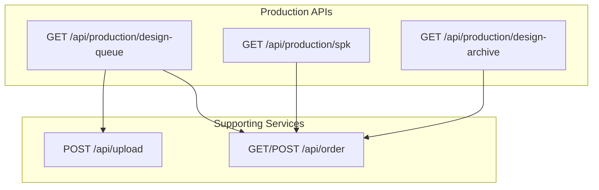
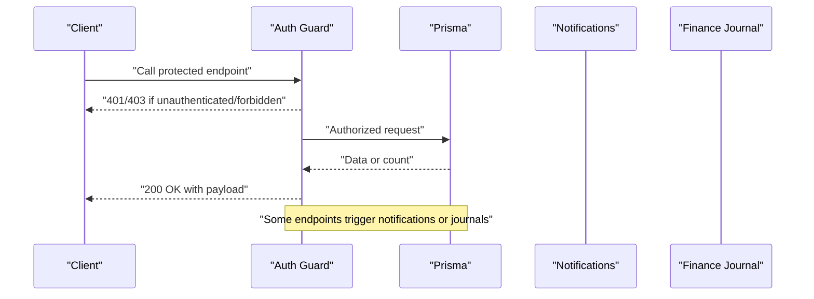
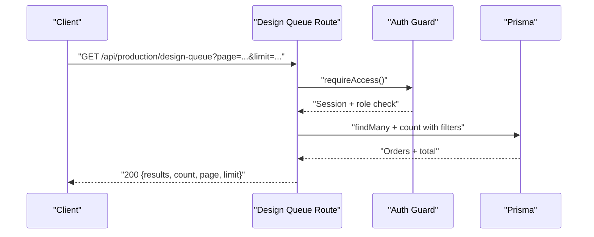
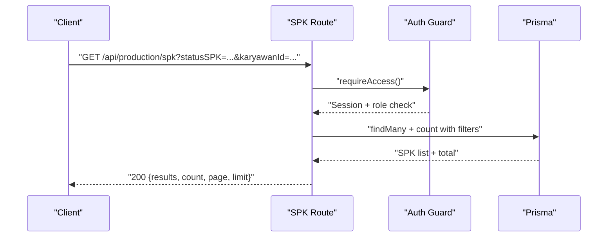
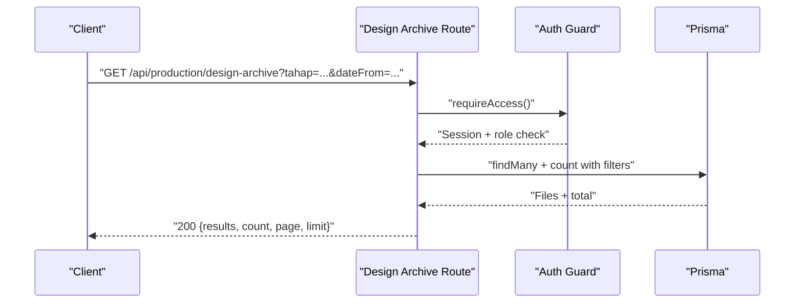
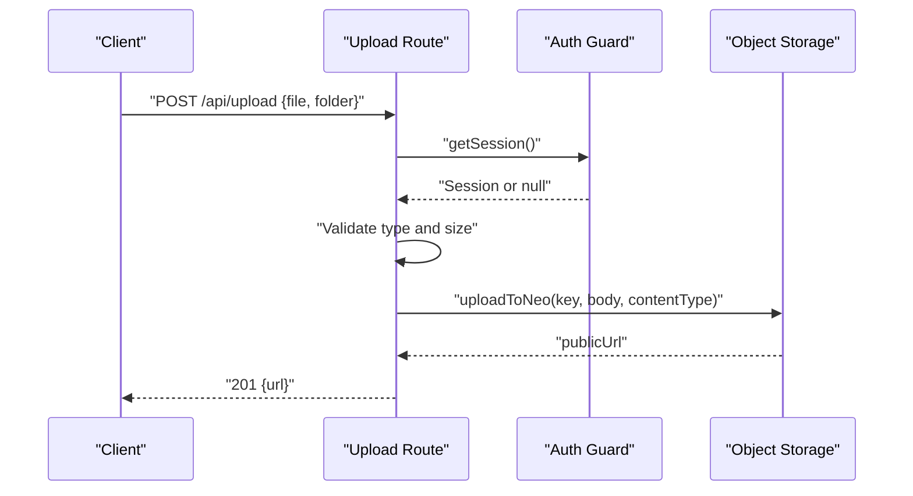
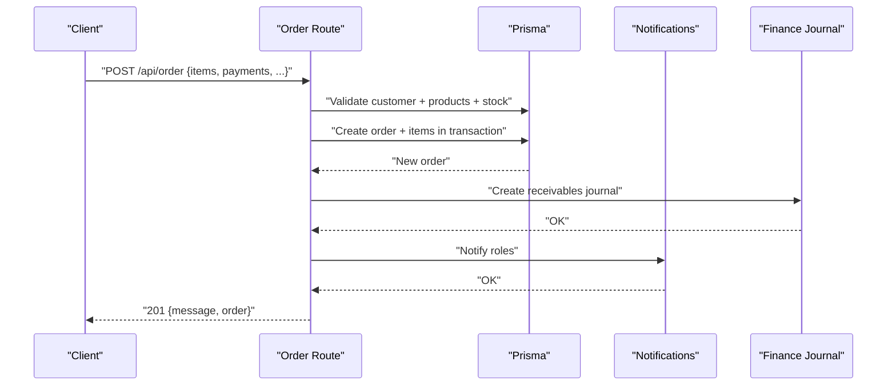
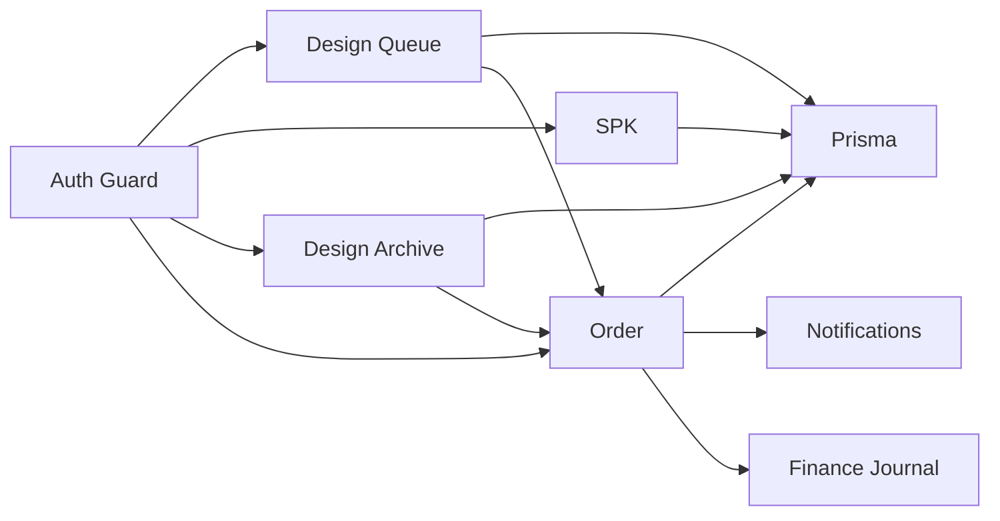

# Production Management API

<cite>
**Referenced Files in This Document**
- [route.ts](file://src/app/api/production/design-queue/route.ts)
- [route.ts](file://src/app/api/production/spk/route.ts)
- [route.ts](file://src/app/api/production/design-archive/route.ts)
- [route.ts](file://src/app/api/upload/route.ts)
- [route.ts](file://src/app/api/order/route.ts)
</cite>

## Table of Contents
1. [Introduction](#introduction)
2. [Project Structure](#project-structure)
3. [Core Components](#core-components)
4. [Architecture Overview](#architecture-overview)
5. [Detailed Component Analysis](#detailed-component-analysis)
6. [Dependency Analysis](#dependency-analysis)
7. [Performance Considerations](#performance-considerations)
8. [Troubleshooting Guide](#troubleshooting-guide)
9. [Conclusion](#conclusion)
10. [Appendices](#appendices)

## Introduction
This document provides comprehensive API documentation for production management endpoints. It covers design queue management, SPK (Work Order) processing, design archive operations, design file uploads, production workflow coordination, and quality control endpoints. It also documents request/response schemas, parameter specifications, error handling, and success indicators, along with integration patterns for order and inventory systems.

## Project Structure
The production management APIs are implemented under the Next.js App Router as server-side routes grouped by domain:
- Production design queue: GET endpoint to list design queue entries with filters and pagination
- Production SPK queue: GET endpoint to list SPKs with filters and pagination
- Production design archive: GET endpoint to list design files across orders and stages
- Upload service: POST endpoint to upload images and obtain a public URL
- Order service: GET/POST endpoints for order lifecycle, including creation and payment handling

**Diagram sources**
- [route.ts:17-151](file://src/app/api/production/design-queue/route.ts#L17-L151)
- [route.ts:15-106](file://src/app/api/production/spk/route.ts#L15-L106)
- [route.ts:16-95](file://src/app/api/production/design-archive/route.ts#L16-L95)
- [route.ts:6-75](file://src/app/api/upload/route.ts#L6-L75)
- [route.ts:55-442](file://src/app/api/order/route.ts#L55-L442)

**Section sources**
- [route.ts:17-151](file://src/app/api/production/design-queue/route.ts#L17-L151)
- [route.ts:15-106](file://src/app/api/production/spk/route.ts#L15-L106)
- [route.ts:16-95](file://src/app/api/production/design-archive/route.ts#L16-L95)
- [route.ts:6-75](file://src/app/api/upload/route.ts#L6-L75)
- [route.ts:55-442](file://src/app/api/order/route.ts#L55-L442)

## Core Components
- Design Queue API: Lists orders awaiting production with filtering by search term, file presence, designer, and review status; supports pagination and sorting by creation or deadline.
- SPK Queue API: Lists work orders with filtering by status, employee, and print acceptance; supports pagination and search across order/customer/employee/model.
- Design Archive API: Lists design files across all orders and production stages with date range and stage filters; supports pagination and search.
- Upload API: Accepts image uploads with size/type validation and returns a public URL after storing to object storage.
- Order API: Provides order listing and creation, including payment validation and financial journaling.

**Section sources**
- [route.ts:17-151](file://src/app/api/production/design-queue/route.ts#L17-L151)
- [route.ts:15-106](file://src/app/api/production/spk/route.ts#L15-L106)
- [route.ts:16-95](file://src/app/api/production/design-archive/route.ts#L16-L95)
- [route.ts:6-75](file://src/app/api/upload/route.ts#L6-L75)
- [route.ts:55-442](file://src/app/api/order/route.ts#L55-L442)

## Architecture Overview
The production APIs integrate with Prisma ORM for database queries and notifications/journaling utilities for cross-domain effects. Authentication is enforced per endpoint using a shared guard that checks session and role eligibility.

**Diagram sources**
- [route.ts:9-15](file://src/app/api/production/design-queue/route.ts#L9-L15)
- [route.ts:6-13](file://src/app/api/production/spk/route.ts#L6-L13)
- [route.ts:11-28](file://src/app/api/order/route.ts#L11-L28)

## Detailed Component Analysis

### Design Queue Management
- Endpoint: GET /api/production/design-queue
- Purpose: Retrieve orders in design stage with optional filters and pagination
- Authentication roles: admin, designer, produksi, kasir
- Query parameters:
  - page: integer ≥ 1
  - limit: integer 1–50 (default 18)
  - search: string (order number or customer name)
  - hasFile: "all" | "true" | "false" (presence of design files)
  - sortBy: "createdAt" | "deadline"
  - designerId: string (filter by designer ID)
  - reviewStatus: "all" | "null" | "unread" | valid review status value
- Sorting:
  - deadline: ascending with nulls last, then by createdAt desc
  - createdAt: descending
- Response fields (subset):
  - results: array of orders with nested designer, customer, items preview, SPK info, design files, and unread comment flag
  - count: total matching records
  - page, limit
- Success indicator: 200 OK with JSON payload
- Error handling:
  - Unauthorized: 401
  - Forbidden: 403
  - Internal error: 500 with error message

**Diagram sources**
- [route.ts:17-151](file://src/app/api/production/design-queue/route.ts#L17-L151)

**Section sources**
- [route.ts:17-151](file://src/app/api/production/design-queue/route.ts#L17-L151)

### SPK (Work Order) Processing
- Endpoint: GET /api/production/spk
- Purpose: Retrieve work orders with filters and pagination
- Authentication roles: admin, produksi, kasir, gudang
- Query parameters:
  - page: integer ≥ 1
  - all: "true" to fetch all without pagination
  - limit: integer 1–50 (default 12; ignored when all=true)
  - search: string (order number, customer name, employee name, or model)
  - statusSPK: "all" | valid status value
  - karyawanId: string (filter by assigned employee)
  - accCetak: "all" | "true" | "false" (print acceptance)
- Response fields (subset):
  - results: array of SPKs with nested order and employee details
  - count: total matching records
  - page, limit
- Success indicator: 200 OK with JSON payload
- Error handling:
  - Unauthorized: 401
  - Forbidden: 403
  - Internal error: 500 with error message

**Diagram sources**
- [route.ts:15-106](file://src/app/api/production/spk/route.ts#L15-L106)

**Section sources**
- [route.ts:15-106](file://src/app/api/production/spk/route.ts#L15-L106)

### Design Archive Operations
- Endpoint: GET /api/production/design-archive
- Purpose: Retrieve design files across orders and production stages with date and stage filters
- Authentication roles: admin, designer, produksi, kasir
- Query parameters:
  - page: integer ≥ 1
  - limit: integer 1–100 (default 24)
  - search: string (file name, order number, customer name, or uploader name)
  - tahap: "all" | valid production stage value
  - dateFrom: ISO date string
  - dateTo: ISO date string (inclusive)
- Response fields (subset):
  - results: array of design files with nested order and uploader details
  - count: total matching records
  - page, limit
- Success indicator: 200 OK with JSON payload
- Error handling:
  - Unauthorized: 401
  - Forbidden: 403
  - Internal error: 500 with error message

**Diagram sources**
- [route.ts:16-95](file://src/app/api/production/design-archive/route.ts#L16-L95)

**Section sources**
- [route.ts:16-95](file://src/app/api/production/design-archive/route.ts#L16-L95)

### Design File Uploads
- Endpoint: POST /api/upload
- Purpose: Upload image files and return a public URL
- Authentication: Required (session must be present)
- Request form fields:
  - file: File (only image/* allowed)
  - folder: string (optional, defaults to "others")
- Validation:
  - Content-Type must start with "image/"
  - Size ≤ 5 MB
- Response fields:
  - url: string (public URL of uploaded file)
- Success indicator: 201 Created with JSON payload
- Error handling:
  - Unauthorized: 401
  - Bad Request: 400 (missing file, invalid type, or size exceeded)
  - Internal error: 500 with error message

**Diagram sources**
- [route.ts:6-75](file://src/app/api/upload/route.ts#L6-L75)

**Section sources**
- [route.ts:6-75](file://src/app/api/upload/route.ts#L6-L75)

### Production Workflow Coordination and Quality Control
- Design Queue Review Status Filtering:
  - reviewStatus="null": orders with no review status
  - reviewStatus="unread": orders with unread comments for the current user
  - reviewStatus="<value>": orders with the given review status
- Print Acceptance Control:
  - accCetak="true" or "false" filters SPKs by print acceptance flag
- Deadline-Based Sorting:
  - Orders can be sorted by deadline ascending (nulls last) then by creation time

These controls support quality gates and workflow progression from design to production.

**Section sources**
- [route.ts:55-73](file://src/app/api/production/design-queue/route.ts#L55-L73)
- [route.ts:31-47](file://src/app/api/production/spk/route.ts#L31-L47)

### Order and Inventory Integration Patterns
- Order Creation:
  - Validates customer existence and product availability
  - Applies stock deduction rules for non-service products
  - Generates order number based on app settings
  - Creates financial journals for receivables and payments
  - Sends notifications to relevant roles
- Payment Handling:
  - Supports DP/Lunas with validation against grand total
  - Automatically upgrades DP to LUNAS when payment meets or exceeds total
- Integration touchpoints:
  - SPK queue depends on order relations
  - Design queue and archive depend on order and design file relations
  - Uploads feed into design files referenced by orders

**Diagram sources**
- [route.ts:142-442](file://src/app/api/order/route.ts#L142-L442)

**Section sources**
- [route.ts:142-442](file://src/app/api/order/route.ts#L142-L442)

## Dependency Analysis
- Authentication and Roles:
  - Shared guards enforce session and role checks across production endpoints
- Data Access:
  - All endpoints use Prisma ORM for reads/writes
- Cross-Cutting Concerns:
  - Notifications and finance journals are triggered from order creation
- External Integrations:
  - Uploads delegate to object storage via a dedicated function

**Diagram sources**
- [route.ts:9-15](file://src/app/api/production/design-queue/route.ts#L9-L15)
- [route.ts:6-13](file://src/app/api/production/spk/route.ts#L6-L13)
- [route.ts:8-14](file://src/app/api/production/design-archive/route.ts#L8-L14)
- [route.ts:11-28](file://src/app/api/order/route.ts#L11-L28)

**Section sources**
- [route.ts:9-15](file://src/app/api/production/design-queue/route.ts#L9-L15)
- [route.ts:6-13](file://src/app/api/production/spk/route.ts#L6-L13)
- [route.ts:8-14](file://src/app/api/production/design-archive/route.ts#L8-L14)
- [route.ts:11-28](file://src/app/api/order/route.ts#L11-L28)

## Performance Considerations
- Pagination limits:
  - Design queue: default 18 per page, max 50
  - SPK: default 12 per page, max 50
  - Design archive: default 24 per page, max 100
- Efficient queries:
  - Use of skip/take with indexed sorts (createdAt, deadline)
  - Count queries executed concurrently with data retrieval
- Filtering:
  - Composite OR conditions and nested relations are scoped to reduce payload sizes
- Recommendations:
  - Prefer pagination for large datasets
  - Use targeted search terms and filters to minimize result sets
  - Cache frequently accessed metadata where appropriate

[No sources needed since this section provides general guidance]

## Troubleshooting Guide
- Authentication failures:
  - Ensure a valid session exists and the user role is permitted for the endpoint
- Forbidden access:
  - Verify the requesting role matches the allowed roles for the endpoint
- Internal errors:
  - Inspect server logs for endpoint-specific error messages
- Upload issues:
  - Confirm file type is image/* and size ≤ 5 MB
  - Ensure the folder parameter is a valid string if provided
- Order creation errors:
  - Validate customer and product IDs
  - Ensure sufficient stock for non-service products
  - Confirm payment fields align with selected payment status

**Section sources**
- [route.ts:9-15](file://src/app/api/production/design-queue/route.ts#L9-L15)
- [route.ts:6-13](file://src/app/api/production/spk/route.ts#L6-L13)
- [route.ts:8-14](file://src/app/api/production/design-archive/route.ts#L8-L14)
- [route.ts:18-38](file://src/app/api/upload/route.ts#L18-L38)
- [route.ts:164-248](file://src/app/api/order/route.ts#L164-L248)

## Conclusion
The production management APIs provide robust endpoints for managing design queues, SPKs, and design archives, integrated with secure authentication, pagination, and quality control filters. Supporting upload and order services enable seamless workflow coordination with order and inventory systems.

[No sources needed since this section summarizes without analyzing specific files]

## Appendices

### Practical Examples of Production Operations
- Retrieve design queue with file presence filter:
  - GET /api/production/design-queue?hasFile=true&page=1&limit=18
- List SPKs with print acceptance:
  - GET /api/production/spk?accCetak=true&statusSPK=ON_PROGRESS&page=1&limit=12
- Archive search by date range and stage:
  - GET /api/production/design-archive?tahap=PRODUKSI&dateFrom=2025-01-01&dateTo=2025-01-31&page=1&limit=24
- Upload a design file:
  - POST /api/upload with form fields file and optional folder

[No sources needed since this section provides general guidance]

### Client Implementation Guidelines
- Always authenticate requests and handle 401/403 responses gracefully
- Use pagination parameters consistently to avoid large payloads
- Apply filters incrementally to refine results efficiently
- For SPK updates, use print acceptance flags to signal quality control completion
- For order creation, validate stock and payment fields before submission

[No sources needed since this section provides general guidance]