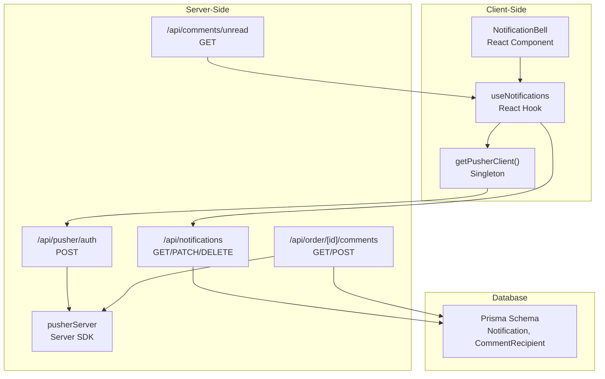
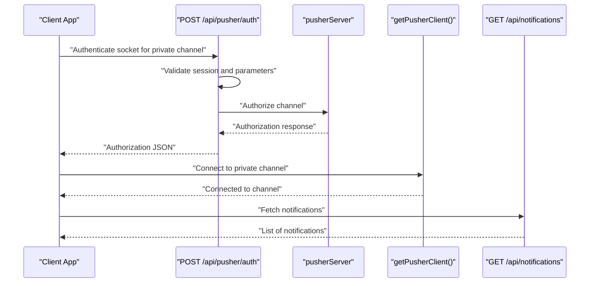
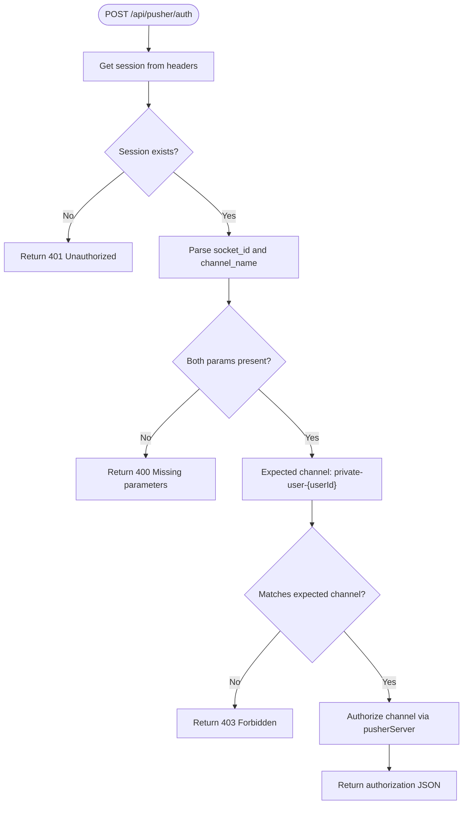
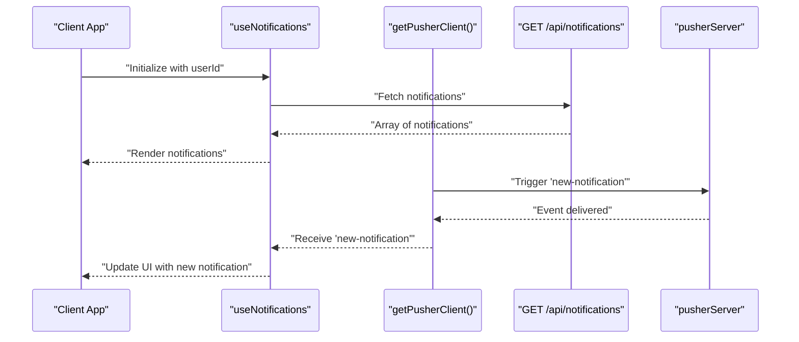
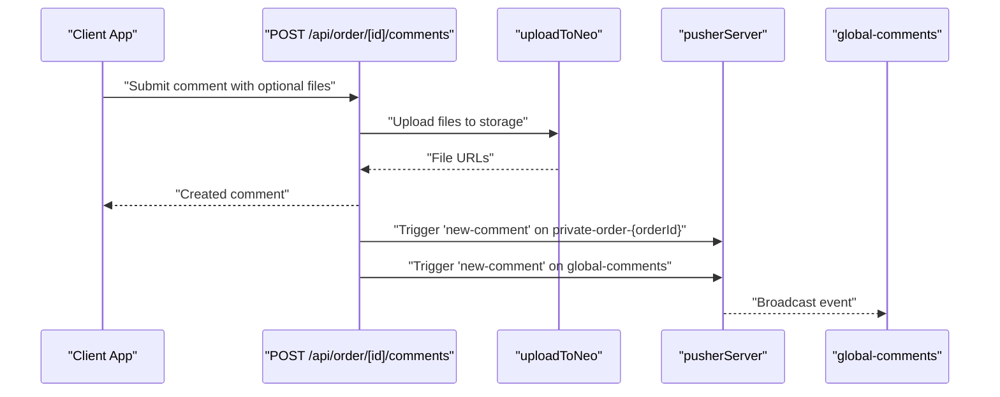
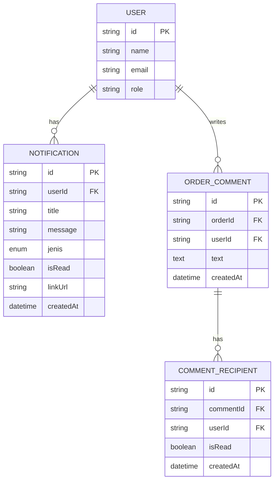
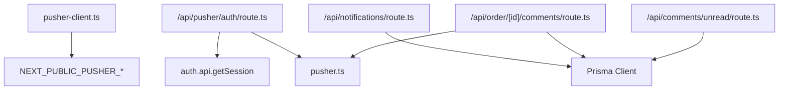

# Real-time Communication API

<cite>
**Referenced Files in This Document**
- [route.ts](file://src/app/api/pusher/auth/route.ts)
- [pusher.ts](file://src/lib/pusher.ts)
- [pusher-client.ts](file://src/lib/pusher-client.ts)
- [route.ts](file://src/app/api/notifications/route.ts)
- [notifications.ts](file://src/lib/notifications.ts)
- [use-notifications.ts](file://src/hooks/use-notifications.ts)
- [notification-bell.tsx](file://src/components/notification-bell.tsx)
- [route.ts](file://src/app/api/comments/unread/route.ts)
- [route.ts](file://src/app/api/order/[id]/comments/route.ts)
- [route.ts](file://src/app/api/order/[id]/comments/read/route.ts)
- [unread-comments-badge.tsx](file://src/components/unread-comments-badge.tsx)
- [schema.prisma](file://prisma/schema.prisma)
- [providers.tsx](file://src/app/providers.tsx)
</cite>

## Table of Contents
1. [Introduction](#introduction)
2. [Project Structure](#project-structure)
3. [Core Components](#core-components)
4. [Architecture Overview](#architecture-overview)
5. [Detailed Component Analysis](#detailed-component-analysis)
6. [Dependency Analysis](#dependency-analysis)
7. [Performance Considerations](#performance-considerations)
8. [Troubleshooting Guide](#troubleshooting-guide)
9. [Conclusion](#conclusion)

## Introduction
This document provides comprehensive API documentation for real-time communication endpoints, focusing on WebSocket authentication, notification delivery, and live update mechanisms. It covers Pusher integration, channel authentication, and event broadcasting endpoints. The documentation details parameter specifications for WebSocket connections, notification subscriptions, and real-time data synchronization, along with response formats, connection handling, error recovery, and practical client-side integration guidelines.

## Project Structure
The real-time features are implemented using:
- Server-side Pusher SDK for event broadcasting
- Client-side Pusher JS SDK with singleton initialization
- Next.js API routes for WebSocket channel authentication
- Prisma models for notifications and comment tracking
- React hooks and components for real-time UI updates

**Diagram sources**
- [pusher-client.ts:1-21](file://src/lib/pusher-client.ts#L1-L21)
- [route.ts:1-41](file://src/app/api/pusher/auth/route.ts#L1-L41)
- [pusher.ts:1-11](file://src/lib/pusher.ts#L1-L11)
- [route.ts:1-77](file://src/app/api/notifications/route.ts#L1-L77)
- [route.ts:1-234](file://src/app/api/order/[id]/comments/route.ts#L1-L234)
- [route.ts:1-26](file://src/app/api/comments/unread/route.ts#L1-L26)
- [schema.prisma:603-675](file://prisma/schema.prisma#L603-L675)

**Section sources**
- [pusher-client.ts:1-21](file://src/lib/pusher-client.ts#L1-L21)
- [route.ts:1-41](file://src/app/api/pusher/auth/route.ts#L1-L41)
- [pusher.ts:1-11](file://src/lib/pusher.ts#L1-L11)
- [route.ts:1-77](file://src/app/api/notifications/route.ts#L1-L77)
- [route.ts:1-234](file://src/app/api/order/[id]/comments/route.ts#L1-L234)
- [route.ts:1-26](file://src/app/api/comments/unread/route.ts#L1-L26)
- [schema.prisma:603-675](file://prisma/schema.prisma#L603-L675)

## Core Components
- WebSocket Authentication Endpoint: Validates sessions and authorizes private channels for the authenticated user.
- Pusher Server SDK: Initializes Pusher with environment variables and triggers events.
- Pusher Client SDK: Singleton wrapper for client-side WebSocket connections with channel authentication endpoint.
- Notifications API: CRUD operations for user-specific notifications with real-time delivery.
- Comments API: Thread retrieval, comment creation with file uploads, and real-time broadcasts for new comments.
- Unread Comments Tracking: Dedicated endpoint and UI badge for tracking unread comments across roles.
- Prisma Models: Notification, CommentRecipient, and related entities supporting real-time features.

**Section sources**
- [route.ts:1-41](file://src/app/api/pusher/auth/route.ts#L1-L41)
- [pusher.ts:1-11](file://src/lib/pusher.ts#L1-L11)
- [pusher-client.ts:1-21](file://src/lib/pusher-client.ts#L1-L21)
- [route.ts:1-77](file://src/app/api/notifications/route.ts#L1-L77)
- [route.ts:1-234](file://src/app/api/order/[id]/comments/route.ts#L1-L234)
- [route.ts:1-26](file://src/app/api/comments/unread/route.ts#L1-L26)
- [schema.prisma:603-675](file://prisma/schema.prisma#L603-L675)

## Architecture Overview
The system integrates Next.js API routes with Pusher for real-time messaging. Private channels are used for user-specific notifications, while global channels broadcast events to relevant roles.

**Diagram sources**
- [route.ts:9-35](file://src/app/api/pusher/auth/route.ts#L9-L35)
- [pusher.ts:3-10](file://src/lib/pusher.ts#L3-L10)
- [pusher-client.ts:6-17](file://src/lib/pusher-client.ts#L6-L17)
- [route.ts:14-38](file://src/app/api/notifications/route.ts#L14-L38)

## Detailed Component Analysis

### WebSocket Authentication
- Purpose: Authorize clients to subscribe to private channels using session-based authentication.
- Endpoint: POST /api/pusher/auth
- Request Body Parameters:
  - socket_id: String (required)
  - channel_name: String (required)
- Validation:
  - Session required; returns 401 Unauthorized if missing.
  - Requires both socket_id and channel_name; returns 400 Bad Request otherwise.
  - Enforces channel ownership: channel_name must match "private-user-{userId}".
- Response:
  - On success: Authorization object for Pusher.
  - On failure: JSON error object with appropriate HTTP status.

**Diagram sources**
- [route.ts:9-35](file://src/app/api/pusher/auth/route.ts#L9-L35)

**Section sources**
- [route.ts:1-41](file://src/app/api/pusher/auth/route.ts#L1-L41)
- [pusher.ts:1-11](file://src/lib/pusher.ts#L1-L11)

### Pusher Client Initialization
- Purpose: Initialize and expose a singleton Pusher client configured for private channel authentication.
- Configuration:
  - Uses NEXT_PUBLIC_PUSHER_* environment variables.
  - Enables WebSocket transports and sets authEndpoint to /api/pusher/auth.
- Behavior:
  - Prevents multiple connections during development/hot reload.

**Section sources**
- [pusher-client.ts:1-21](file://src/lib/pusher-client.ts#L1-L21)

### Notifications API
- Purpose: Manage user-specific notifications with real-time delivery.
- Endpoints:
  - GET /api/notifications
    - Query parameters:
      - unreadOnly: Boolean ("true" to filter unread)
      - limit: Integer (default 50)
    - Response: Array of notifications ordered by createdAt desc.
  - PATCH /api/notifications
    - Marks all unread notifications as read for the user.
    - Response: { success: true }.
  - DELETE /api/notifications
    - Deletes all notifications for the user.
    - Response: { success: true }.
  - PATCH /api/notifications/{id}
    - Marks a specific notification as read.
    - Response: { success: true }.

**Diagram sources**
- [route.ts:14-38](file://src/app/api/notifications/route.ts#L14-L38)
- [use-notifications.ts:17-61](file://src/hooks/use-notifications.ts#L17-L61)
- [notifications.ts:18-42](file://src/lib/notifications.ts#L18-L42)

**Section sources**
- [route.ts:1-77](file://src/app/api/notifications/route.ts#L1-L77)
- [use-notifications.ts:1-112](file://src/hooks/use-notifications.ts#L1-L112)
- [notifications.ts:1-122](file://src/lib/notifications.ts#L1-L122)

### Comments API and Real-time Updates
- Purpose: Retrieve comment threads, post new comments with optional file attachments, and broadcast real-time updates.
- Endpoints:
  - GET /api/order/{id}/comments
    - Returns ordered comments with user info and attached files.
  - POST /api/order/{id}/comments
    - Form fields:
      - text: String (optional if files provided)
      - files: File[] (supports images, PDF, AI, PSD, ZIP)
    - Validation:
      - Maximum file size 10 MB per file.
      - Allowed MIME types include common image and document formats.
    - Response: Created comment object with files and recipients.
    - Broadcasting:
      - Triggers "new-comment" on private-order-{orderId}.
      - Triggers "new-comment" on global-comments with summary payload.
  - PATCH /api/order/{id}/comments/read
    - Marks all comments for the order as read for the current user.

**Diagram sources**
- [route.ts:79-232](file://src/app/api/order/[id]/comments/route.ts#L79-L232)
- [pusher.ts:3-10](file://src/lib/pusher.ts#L3-L10)

**Section sources**
- [route.ts:1-234](file://src/app/api/order/[id]/comments/route.ts#L1-L234)
- [route.ts:1-44](file://src/app/api/order/[id]/comments/read/route.ts#L1-L44)

### Unread Comments Tracking
- Purpose: Track unread comments for authorized roles and display a badge with toast notifications.
- Endpoint:
  - GET /api/comments/unread
    - Returns { count: number }.
- Client-side:
  - Subscribes to "global-comments" channel.
  - Increments unread count and shows toast on "new-comment".
  - Role restrictions apply (admin, kasir, designer).

**Section sources**
- [route.ts:1-26](file://src/app/api/comments/unread/route.ts#L1-L26)
- [unread-comments-badge.tsx:1-84](file://src/components/unread-comments-badge.tsx#L1-L84)

### Database Models Supporting Real-time Features
- Notification: User-specific notifications with read status and type.
- CommentRecipient: Tracks unread state per user for each comment.
- OrderComment: Comments associated with orders, including files and recipients.

**Diagram sources**
- [schema.prisma:603-675](file://prisma/schema.prisma#L603-L675)

**Section sources**
- [schema.prisma:603-675](file://prisma/schema.prisma#L603-L675)

## Dependency Analysis
- Client-side dependencies:
  - getPusherClient depends on environment variables for Pusher configuration.
  - useNotifications depends on getPusherClient and local state management.
- Server-side dependencies:
  - /api/pusher/auth depends on session validation and pusherServer authorization.
  - Notifications API depends on Prisma for persistence.
  - Comments API depends on Prisma, file storage, and pusherServer for broadcasting.

**Diagram sources**
- [pusher-client.ts:6-17](file://src/lib/pusher-client.ts#L6-L17)
- [route.ts:1-41](file://src/app/api/pusher/auth/route.ts#L1-L41)
- [pusher.ts:1-11](file://src/lib/pusher.ts#L1-L11)
- [route.ts:1-77](file://src/app/api/notifications/route.ts#L1-L77)
- [route.ts:1-234](file://src/app/api/order/[id]/comments/route.ts#L1-L234)
- [route.ts:1-26](file://src/app/api/comments/unread/route.ts#L1-L26)

**Section sources**
- [pusher-client.ts:1-21](file://src/lib/pusher-client.ts#L1-L21)
- [route.ts:1-41](file://src/app/api/pusher/auth/route.ts#L1-L41)
- [pusher.ts:1-11](file://src/lib/pusher.ts#L1-L11)
- [route.ts:1-77](file://src/app/api/notifications/route.ts#L1-L77)
- [route.ts:1-234](file://src/app/api/order/[id]/comments/route.ts#L1-L234)
- [route.ts:1-26](file://src/app/api/comments/unread/route.ts#L1-L26)

## Performance Considerations
- Connection Management:
  - Use the singleton pattern for the Pusher client to avoid multiple connections.
  - Configure enabledTransports to ["ws", "wss"] to leverage efficient WebSocket transport.
- Event Broadcasting:
  - Limit payload sizes for real-time events to reduce bandwidth usage.
  - Use targeted channels (private-user-{userId}) to minimize unnecessary subscribers.
- Pagination and Limits:
  - Apply limit parameters for notifications to control payload size.
- File Uploads:
  - Enforce file size limits and MIME type validation to prevent large payloads.
- Caching:
  - Cache frequently accessed notification lists on the client with optimistic updates.

[No sources needed since this section provides general guidance]

## Troubleshooting Guide
- WebSocket Authentication Failures:
  - Ensure session is present and valid; missing session returns 401.
  - Verify socket_id and channel_name are provided; missing parameters return 400.
  - Confirm channel_name matches "private-user-{userId}" to avoid 403.
- Real-time Events Not Received:
  - Check that the client connects to the correct private channel.
  - Verify authEndpoint is correctly set to "/api/pusher/auth".
  - Ensure pusherServer is initialized with correct environment variables.
- Notifications Not Updating:
  - Confirm useNotifications hook subscribes to the user's private channel.
  - Validate that createNotification triggers the "new-notification" event.
- Comment Broadcast Issues:
  - Verify Comments API triggers events on both private-order-{orderId} and global-comments.
  - Check Prisma transaction integrity for comment creation and recipient assignment.

**Section sources**
- [route.ts:1-41](file://src/app/api/pusher/auth/route.ts#L1-L41)
- [pusher-client.ts:1-21](file://src/lib/pusher-client.ts#L1-L21)
- [pusher.ts:1-11](file://src/lib/pusher.ts#L1-L11)
- [use-notifications.ts:1-112](file://src/hooks/use-notifications.ts#L1-L112)
- [notifications.ts:1-122](file://src/lib/notifications.ts#L1-L122)
- [route.ts:1-234](file://src/app/api/order/[id]/comments/route.ts#L1-L234)

## Conclusion
The real-time communication system leverages Pusher for secure, scalable WebSocket messaging with robust authentication and event broadcasting. The APIs provide comprehensive support for user-specific notifications, collaborative comment threads, and unread tracking. By following the documented endpoints, parameter specifications, and integration guidelines, developers can implement reliable real-time features with efficient client-server communication.