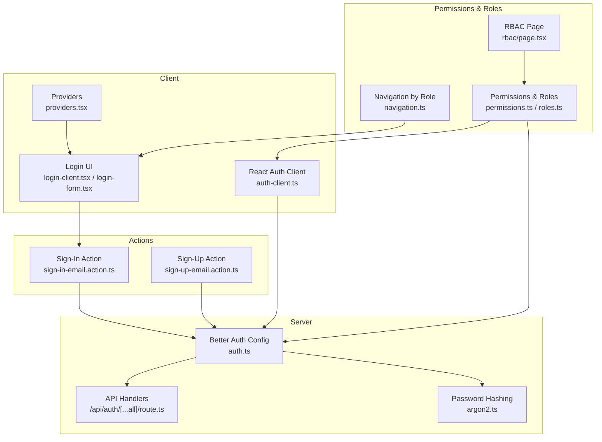
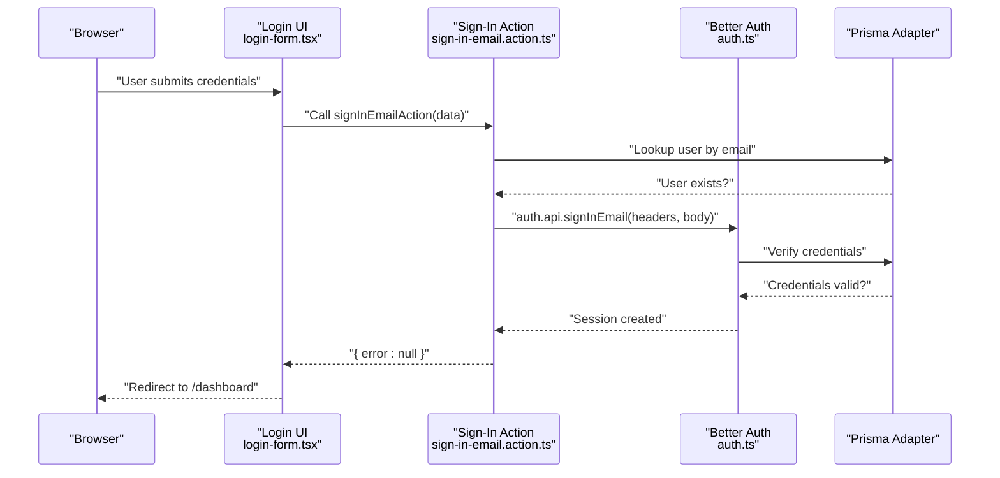
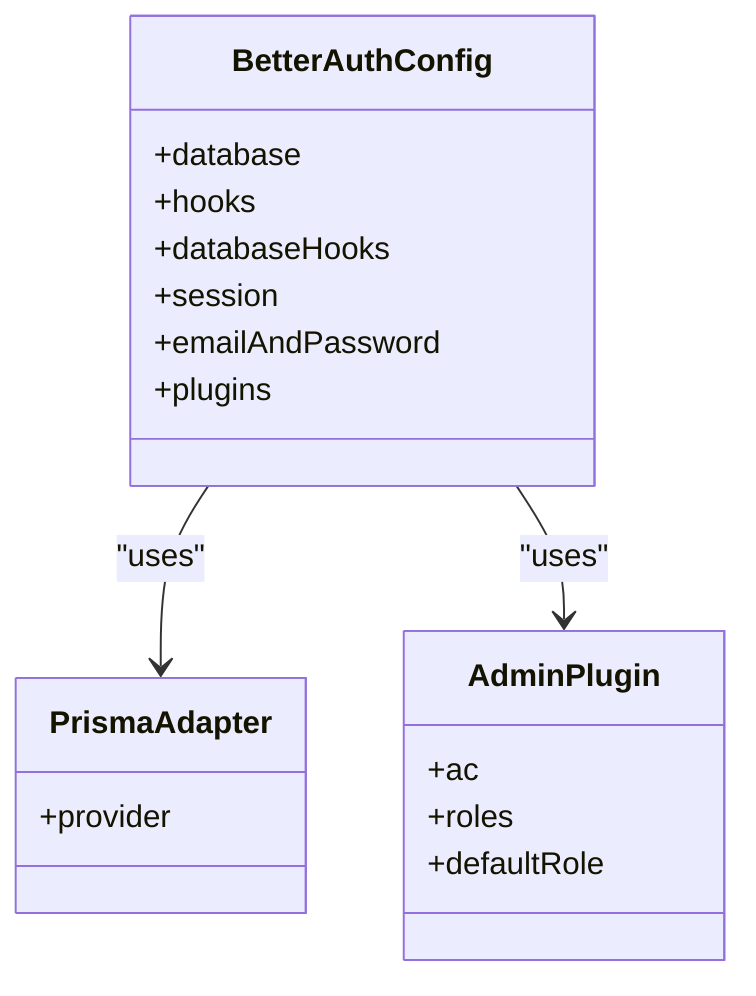
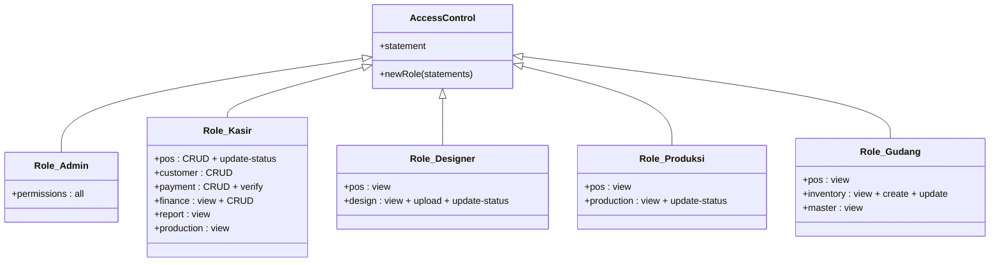
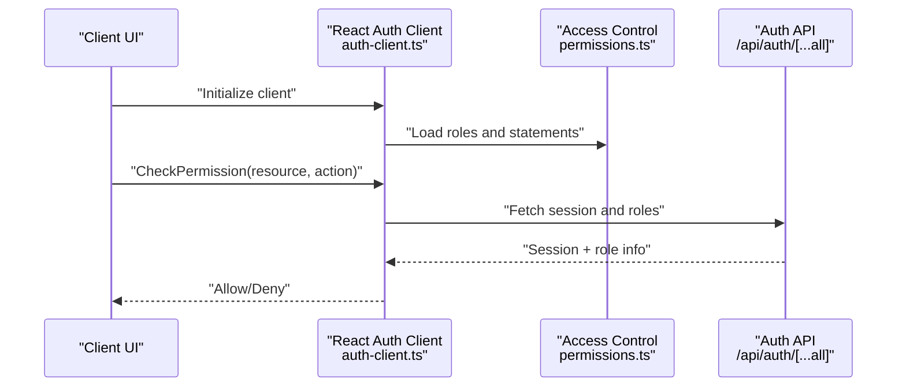
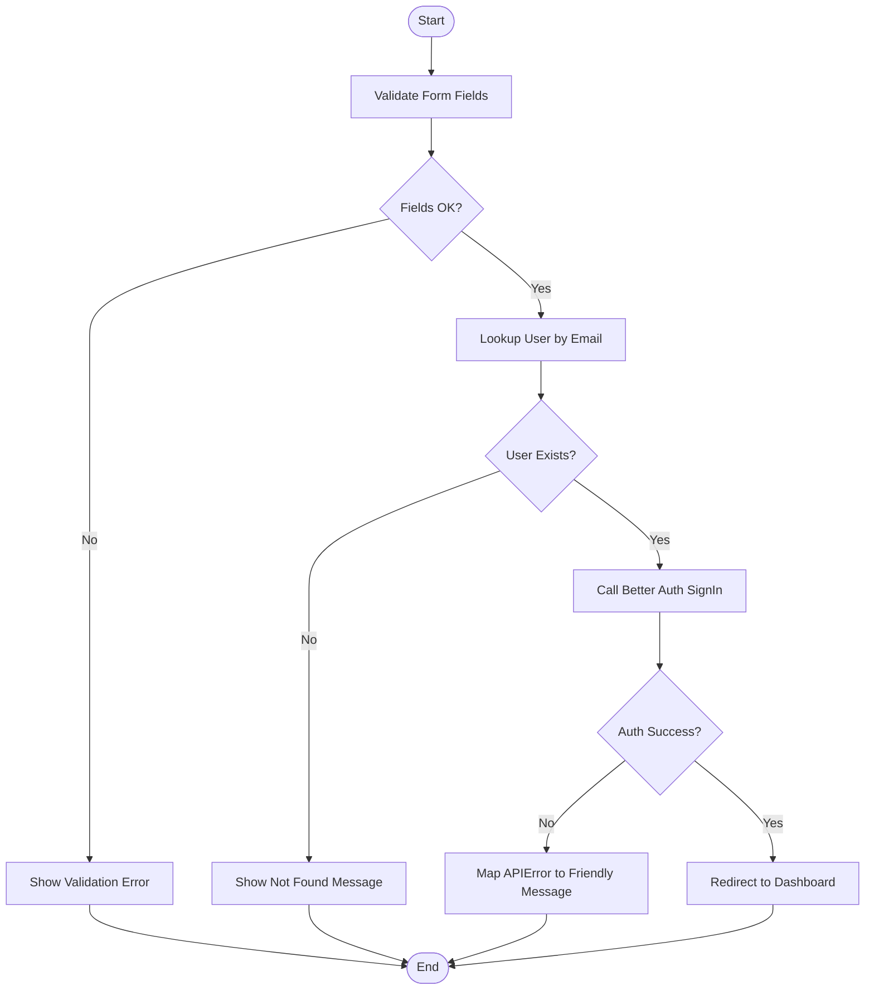
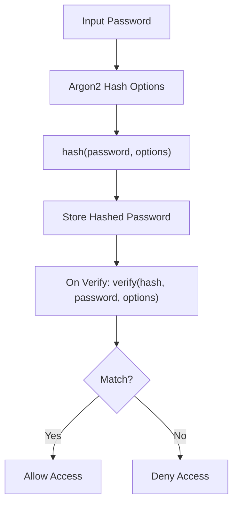
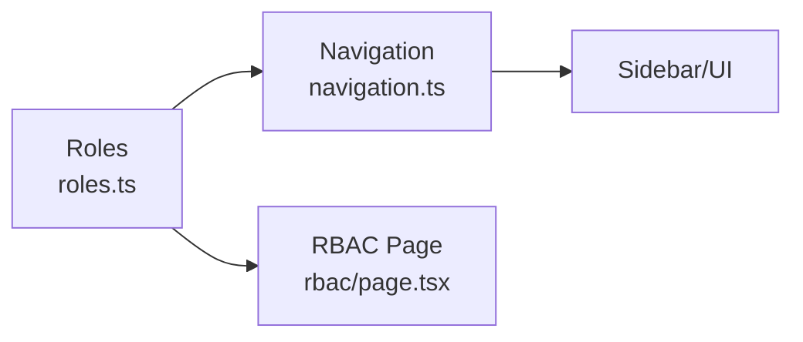
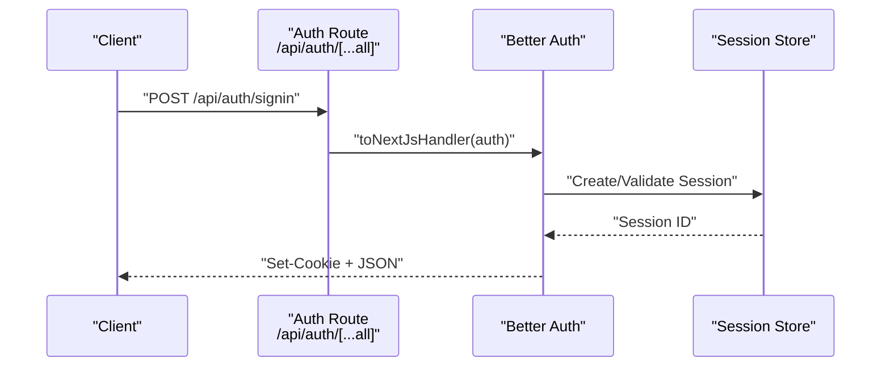
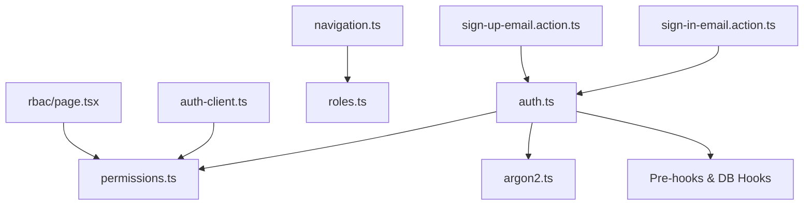

# Authentication & Authorization System

<cite>
**Referenced Files in This Document**
- [auth.ts](file://src/lib/auth.ts)
- [permissions.ts](file://src/lib/permissions.ts)
- [roles.ts](file://src/config/roles.ts)
- [navigation.ts](file://src/config/navigation.ts)
- [auth-client.ts](file://src/lib/auth-client.ts)
- [sign-in-email.action.ts](file://src/actions/sign-in-email.action.ts)
- [sign-up-email.action.ts](file://src/actions/sign-up-email.action.ts)
- [login-client.tsx](file://src/app/auth/login/login-client.tsx)
- [login-form.tsx](file://src/components/login-form.tsx)
- [argon2.ts](file://src/lib/argon2.ts)
- [route.ts](file://src/app/api/auth/[...all]/route.ts)
- [providers.tsx](file://src/app/providers.tsx)
- [page.tsx](file://src/app/(LoggedIn)/rbac/page.tsx)
</cite>

## Table of Contents
1. [Introduction](#introduction)
2. [Project Structure](#project-structure)
3. [Core Components](#core-components)
4. [Architecture Overview](#architecture-overview)
5. [Detailed Component Analysis](#detailed-component-analysis)
6. [Dependency Analysis](#dependency-analysis)
7. [Performance Considerations](#performance-considerations)
8. [Troubleshooting Guide](#troubleshooting-guide)
9. [Conclusion](#conclusion)
10. [Appendices](#appendices)

## Introduction
This document explains the authentication and authorization system built with Better Auth. It covers role-based access control (RBAC) with five roles (Admin, Kasir, Designer, Produksi, Gudang), session management, and permission enforcement. It documents the authentication flow, token handling, user registration and login processes, password hashing with Argon2, and security measures. It also details the permission system, navigation generation based on roles, and integration with business modules, including practical examples of role-specific access patterns, API endpoint protection, and client-side authentication handling.

## Project Structure
The authentication system spans several layers:
- Server-side configuration and API handlers powered by Better Auth
- Client-side SDK for React integration
- Action-based server functions for sign-up and sign-in
- Permission definitions and role configurations
- Navigation configuration driven by roles
- UI components for login and RBAC visualization

**Diagram sources**
- [auth.ts:1-95](file://src/lib/auth.ts#L1-L95)
- [route.ts:1-4](file://src/app/api/auth/[...all]/route.ts#L1-L4)
- [argon2.ts:1-21](file://src/lib/argon2.ts#L1-L21)
- [auth-client.ts:1-27](file://src/lib/auth-client.ts#L1-L27)
- [login-client.tsx:1-85](file://src/app/auth/login/login-client.tsx#L1-L85)
- [login-form.tsx:1-118](file://src/components/login-form.tsx#L1-L118)
- [providers.tsx:1-14](file://src/app/providers.tsx#L1-L14)
- [permissions.ts:1-67](file://src/lib/permissions.ts#L1-L67)
- [roles.ts:1-18](file://src/config/roles.ts#L1-L18)
- [navigation.ts:1-217](file://src/config/navigation.ts#L1-L217)
- [page.tsx:1-211](file://src/app/(LoggedIn)/rbac/page.tsx#L1-L211)
- [sign-in-email.action.ts:1-86](file://src/actions/sign-in-email.action.ts#L1-L86)
- [sign-up-email.action.ts:1-85](file://src/actions/sign-up-email.action.ts#L1-L85)

**Section sources**
- [auth.ts:1-95](file://src/lib/auth.ts#L1-L95)
- [route.ts:1-4](file://src/app/api/auth/[...all]/route.ts#L1-L4)
- [auth-client.ts:1-27](file://src/lib/auth-client.ts#L1-L27)
- [login-client.tsx:1-85](file://src/app/auth/login/login-client.tsx#L1-L85)
- [login-form.tsx:1-118](file://src/components/login-form.tsx#L1-L118)
- [providers.tsx:1-14](file://src/app/providers.tsx#L1-L14)
- [permissions.ts:1-67](file://src/lib/permissions.ts#L1-L67)
- [roles.ts:1-18](file://src/config/roles.ts#L1-L18)
- [navigation.ts:1-217](file://src/config/navigation.ts#L1-L217)
- [page.tsx:1-211](file://src/app/(LoggedIn)/rbac/page.tsx#L1-L211)
- [sign-in-email.action.ts:1-86](file://src/actions/sign-in-email.action.ts#L1-L86)
- [sign-up-email.action.ts:1-85](file://src/actions/sign-up-email.action.ts#L1-L85)

## Core Components
- Better Auth configuration defines database adapter, session policy, email/password settings, hooks, and the admin plugin with custom access control and roles.
- Password hashing uses Argon2 with tuned parameters.
- Client-side React SDK mirrors the server’s access control and roles for UI and runtime checks.
- Actions encapsulate sign-up and sign-in with robust error handling and user feedback.
- Navigation and RBAC pages reflect role permissions centrally.

Key implementation references:
- Better Auth initialization and session policy: [auth.ts:20-92](file://src/lib/auth.ts#L20-L92)
- Argon2 hashing and verification: [argon2.ts:10-20](file://src/lib/argon2.ts#L10-L20)
- Access control and roles: [permissions.ts:21-67](file://src/lib/permissions.ts#L21-L67)
- Role keys and labels: [roles.ts:5-17](file://src/config/roles.ts#L5-L17)
- Client-side auth client: [auth-client.ts:12-26](file://src/lib/auth-client.ts#L12-L26)
- Sign-in action: [sign-in-email.action.ts:13-85](file://src/actions/sign-in-email.action.ts#L13-L85)
- Sign-up action: [sign-up-email.action.ts:12-84](file://src/actions/sign-up-email.action.ts#L12-L84)
- Auth API handler: [route.ts:1-4](file://src/app/api/auth/[...all]/route.ts#L1-L4)

**Section sources**
- [auth.ts:20-92](file://src/lib/auth.ts#L20-L92)
- [argon2.ts:10-20](file://src/lib/argon2.ts#L10-L20)
- [permissions.ts:21-67](file://src/lib/permissions.ts#L21-L67)
- [roles.ts:5-17](file://src/config/roles.ts#L5-L17)
- [auth-client.ts:12-26](file://src/lib/auth-client.ts#L12-L26)
- [sign-in-email.action.ts:13-85](file://src/actions/sign-in-email.action.ts#L13-L85)
- [sign-up-email.action.ts:12-84](file://src/actions/sign-up-email.action.ts#L12-L84)
- [route.ts:1-4](file://src/app/api/auth/[...all]/route.ts#L1-L4)

## Architecture Overview
The system uses Better Auth as the central identity and access engine. On the server, sessions are stored and validated against the configured database adapter. On the client, the React SDK synchronizes with the server to enforce permissions and roles. Actions handle user-initiated operations like sign-up and sign-in, while the admin plugin integrates custom access control statements and role definitions.

**Diagram sources**
- [login-form.tsx:28-41](file://src/components/login-form.tsx#L28-L41)
- [sign-in-email.action.ts:13-44](file://src/actions/sign-in-email.action.ts#L13-L44)
- [auth.ts:35-41](file://src/lib/auth.ts#L35-L41)

**Section sources**
- [auth.ts:20-92](file://src/lib/auth.ts#L20-L92)
- [sign-in-email.action.ts:13-85](file://src/actions/sign-in-email.action.ts#L13-L85)
- [login-form.tsx:28-41](file://src/components/login-form.tsx#L28-L41)

## Detailed Component Analysis

### Better Auth Configuration
- Database adapter: Prisma MySQL adapter integrated with Better Auth.
- Session policy: 30-day expiration.
- Email/password: Enabled with minimum 6-character passwords; auto sign-in disabled.
- Hooks: Pre-sign-up hook validates domain and normalizes name; pre-create user hook assigns a random avatar if none provided.
- Plugins: nextCookies for cookie handling, admin plugin with custom access control and roles.

**Diagram sources**
- [auth.ts:20-92](file://src/lib/auth.ts#L20-L92)

**Section sources**
- [auth.ts:20-92](file://src/lib/auth.ts#L20-L92)

### Access Control and Roles
- Access control statements define resources and actions (e.g., pos, customer, payment, design, production, inventory, finance, report, master).
- Roles are defined as specialized access control sets:
  - Admin: full access across all resources and built-in user/session permissions.
  - Kasir: POS, customer, payment, finance, reports, and view-only production.
  - Designer: POS view and design queue management.
  - Produksi: POS view and production status updates.
  - Gudang: POS view, inventory CRUD, and read-only master data (suppliers).
- Default role is set to "kasir".

**Diagram sources**
- [permissions.ts:21-67](file://src/lib/permissions.ts#L21-L67)

**Section sources**
- [permissions.ts:8-21](file://src/lib/permissions.ts#L8-L21)
- [permissions.ts:25-67](file://src/lib/permissions.ts#L25-L67)
- [roles.ts:5-17](file://src/config/roles.ts#L5-L17)

### Client-Side Authentication Client
- React client mirrors server-side access control and roles.
- Uses base URL from environment for API calls.
- Integrates with admin client plugin to enable runtime permission checks.

**Diagram sources**
- [auth-client.ts:12-26](file://src/lib/auth-client.ts#L12-L26)
- [permissions.ts:21-67](file://src/lib/permissions.ts#L21-L67)
- [route.ts:1-4](file://src/app/api/auth/[...all]/route.ts#L1-L4)

**Section sources**
- [auth-client.ts:12-26](file://src/lib/auth-client.ts#L12-L26)
- [permissions.ts:21-67](file://src/lib/permissions.ts#L21-L67)

### Authentication Flow: Sign-In and Sign-Up
- Sign-in:
  - Validates presence of email and password.
  - Checks user existence in the database.
  - Delegates to Better Auth API for credential verification and session creation.
  - Handles API errors and maps them to user-friendly messages.
- Sign-up:
  - Validates form fields.
  - Delegates to Better Auth API for account creation.
  - Applies domain validation and normalization hooks during sign-up.
  - Handles API errors and maps them to user-friendly messages.

**Diagram sources**
- [sign-in-email.action.ts:13-85](file://src/actions/sign-in-email.action.ts#L13-L85)
- [auth.ts:25-48](file://src/lib/auth.ts#L25-L48)

**Section sources**
- [sign-in-email.action.ts:13-85](file://src/actions/sign-in-email.action.ts#L13-L85)
- [sign-up-email.action.ts:12-84](file://src/actions/sign-up-email.action.ts#L12-L84)
- [auth.ts:25-48](file://src/lib/auth.ts#L25-L48)

### Password Hashing with Argon2
- Password hashing and verification use @node-rs/argon2 with tuned options for memory, time, output length, and parallelism.
- Better Auth delegates password hashing and verification to these functions.

**Diagram sources**
- [argon2.ts:3-20](file://src/lib/argon2.ts#L3-L20)
- [auth.ts:73-76](file://src/lib/auth.ts#L73-L76)

**Section sources**
- [argon2.ts:3-20](file://src/lib/argon2.ts#L3-L20)
- [auth.ts:73-76](file://src/lib/auth.ts#L73-L76)

### Navigation Generation Based on Roles
- Navigation groups and items specify which roles can access them.
- Roles are typed centrally for reuse across UI and permissions.
- RBAC page renders a permission matrix reflecting role capabilities.

**Diagram sources**
- [roles.ts:5-17](file://src/config/roles.ts#L5-L17)
- [navigation.ts:35-217](file://src/config/navigation.ts#L35-L217)
- [page.tsx:18-82](file://src/app/(LoggedIn)/rbac/page.tsx#L18-L82)

**Section sources**
- [roles.ts:5-17](file://src/config/roles.ts#L5-L17)
- [navigation.ts:35-217](file://src/config/navigation.ts#L35-L217)
- [page.tsx:18-82](file://src/app/(LoggedIn)/rbac/page.tsx#L18-L82)

### API Endpoint Protection and Integration
- Auth endpoints are exposed via a single Next.js route that wraps Better Auth.
- Actions and client SDK integrate with this endpoint to manage sessions and permissions.
- Providers wrap the app to supply UI libraries and toast support for user feedback.

**Diagram sources**
- [route.ts:1-4](file://src/app/api/auth/[...all]/route.ts#L1-L4)
- [auth.ts:35-41](file://src/lib/auth.ts#L35-L41)

**Section sources**
- [route.ts:1-4](file://src/app/api/auth/[...all]/route.ts#L1-L4)
- [providers.tsx:6-13](file://src/app/providers.tsx#L6-L13)

## Dependency Analysis
- Server depends on Prisma adapter and Argon2 for persistence and hashing.
- Client depends on React SDK and admin client plugin to mirror server-side permissions.
- Actions depend on Better Auth API and Prisma for user lookup and session creation.
- Navigation and RBAC pages depend on centralized role definitions.

**Diagram sources**
- [auth.ts:20-92](file://src/lib/auth.ts#L20-L92)
- [permissions.ts:21-67](file://src/lib/permissions.ts#L21-L67)
- [argon2.ts:10-20](file://src/lib/argon2.ts#L10-L20)
- [auth-client.ts:12-26](file://src/lib/auth-client.ts#L12-L26)
- [sign-in-email.action.ts:13-44](file://src/actions/sign-in-email.action.ts#L13-L44)
- [sign-up-email.action.ts:12-28](file://src/actions/sign-up-email.action.ts#L12-L28)
- [navigation.ts:35-217](file://src/config/navigation.ts#L35-L217)
- [roles.ts:5-17](file://src/config/roles.ts#L5-L17)
- [page.tsx:18-82](file://src/app/(LoggedIn)/rbac/page.tsx#L18-L82)

**Section sources**
- [auth.ts:20-92](file://src/lib/auth.ts#L20-L92)
- [permissions.ts:21-67](file://src/lib/permissions.ts#L21-L67)
- [auth-client.ts:12-26](file://src/lib/auth-client.ts#L12-L26)
- [sign-in-email.action.ts:13-44](file://src/actions/sign-in-email.action.ts#L13-L44)
- [sign-up-email.action.ts:12-28](file://src/actions/sign-up-email.action.ts#L12-L28)
- [navigation.ts:35-217](file://src/config/navigation.ts#L35-L217)
- [roles.ts:5-17](file://src/config/roles.ts#L5-L17)
- [page.tsx:18-82](file://src/app/(LoggedIn)/rbac/page.tsx#L18-L82)

## Performance Considerations
- Session lifetime: 30 days reduces re-auth frequency but increases session validity window.
- Argon2 parameters balance security and performance; adjust time/memory costs based on deployment capacity.
- Client-side permission checks avoid unnecessary network requests by short-circuiting denied actions.
- Centralized role definitions minimize duplication and improve maintainability.

[No sources needed since this section provides general guidance]

## Troubleshooting Guide
Common issues and resolutions:
- Invalid domain during sign-up: Ensure email domain matches allowed domains; Better Auth throws a specific error mapped to a friendly message.
- Weak or invalid password: Minimum length enforced; errors are mapped to user-friendly messages.
- Too many requests: Rate limiting triggers; UI displays cooldown messaging.
- Incorrect credentials: Mapped to “password salah” with field-level validation.
- General server errors: Logged and surfaced as generic failures.

**Section sources**
- [sign-in-email.action.ts:44-84](file://src/actions/sign-in-email.action.ts#L44-L84)
- [sign-up-email.action.ts:31-83](file://src/actions/sign-up-email.action.ts#L31-L83)
- [auth.ts:25-48](file://src/lib/auth.ts#L25-L48)

## Conclusion
The system leverages Better Auth to deliver a secure, extensible authentication and authorization framework. RBAC is modeled centrally with explicit roles and permissions, enforced both server-side and client-side. Argon2 ensures strong password hashing, while actions and hooks provide robust user lifecycle management. Navigation and RBAC pages offer transparency into role capabilities, aiding administration and development.

[No sources needed since this section summarizes without analyzing specific files]

## Appendices

### Role-Specific Access Patterns
- Admin: Full CRUD across POS, customer, payment, design, production, inventory, finance, report, master, and user management.
- Kasir: POS, customer, payment, finance, reports, and read-only production.
- Designer: POS view and design queue management (view/upload/update-status).
- Produksi: POS view and production status updates.
- Gudang: POS view, inventory CRUD, and read-only supplier data.

**Section sources**
- [permissions.ts:25-67](file://src/lib/permissions.ts#L25-L67)

### API Endpoint Protection
- All auth endpoints are routed through a unified handler that delegates to Better Auth.
- Client SDK enforces roles and permissions locally for immediate feedback.

**Section sources**
- [route.ts:1-4](file://src/app/api/auth/[...all]/route.ts#L1-L4)
- [auth-client.ts:12-26](file://src/lib/auth-client.ts#L12-L26)

### Client-Side Authentication Handling
- Login UI integrates with sign-in action and Better Auth client.
- Providers supply UI components and toast notifications for user feedback.

**Section sources**
- [login-form.tsx:28-41](file://src/components/login-form.tsx#L28-L41)
- [login-client.tsx:16-84](file://src/app/auth/login/login-client.tsx#L16-L84)
- [providers.tsx:6-13](file://src/app/providers.tsx#L6-L13)