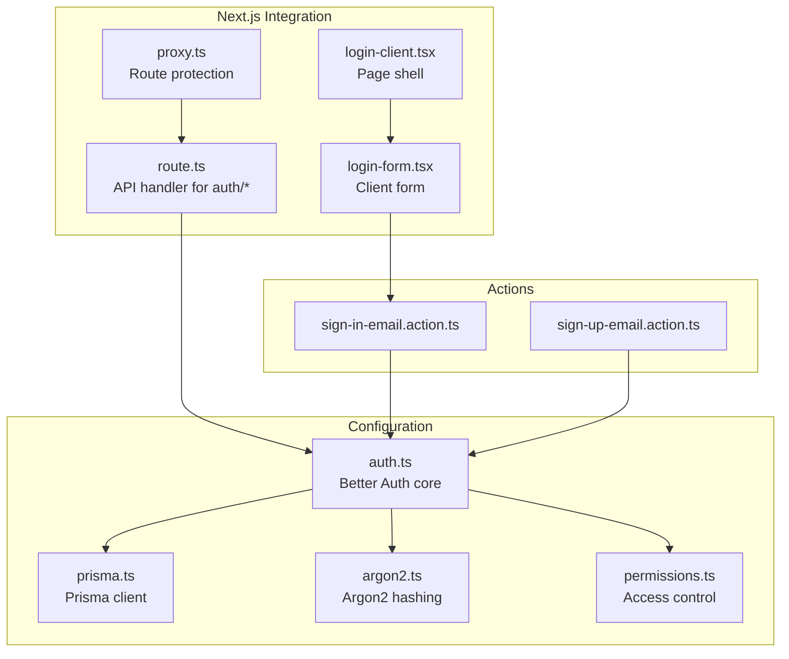
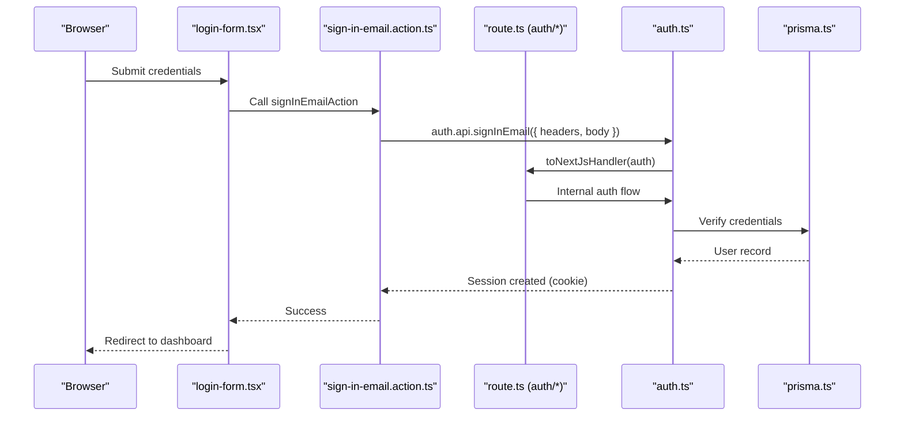
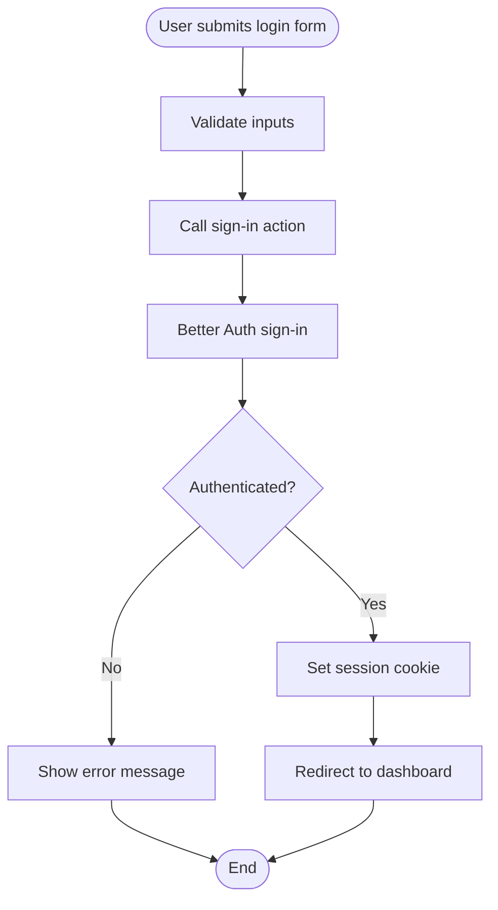
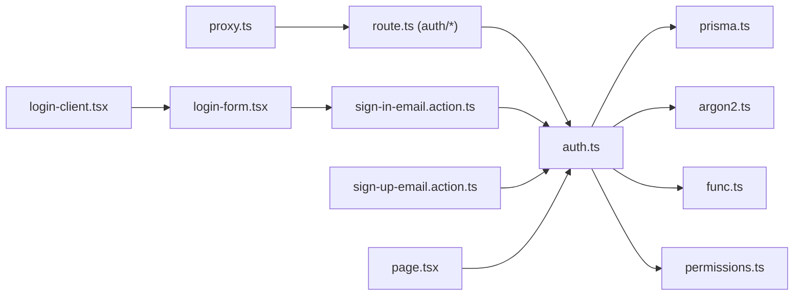

# Better Auth Integration

<cite>
**Referenced Files in This Document**
- [auth.ts](file://src/lib/auth.ts)
- [prisma.ts](file://src/lib/prisma.ts)
- [argon2.ts](file://src/lib/argon2.ts)
- [route.ts](file://src/app/api/auth/[...all]/route.ts)
- [sign-in-email.action.ts](file://src/actions/sign-in-email.action.ts)
- [sign-up-email.action.ts](file://src/actions/sign-up-email.action.ts)
- [func.ts](file://src/lib/func.ts)
- [proxy.ts](file://src/proxy.ts)
- [login-form.tsx](file://src/components/login-form.tsx)
- [login-client.tsx](file://src/app/auth/login/login-client.tsx)
- [page.tsx](file://src/app/auth/login/page.tsx)
- [permissions.ts](file://src/lib/permissions.ts)
- [route.ts](file://src/app/api/pusher/auth/route.ts)
- [page.tsx](file://src/app/page.tsx)
</cite>

## Table of Contents
1. [Introduction](#introduction)
2. [Project Structure](#project-structure)
3. [Core Components](#core-components)
4. [Architecture Overview](#architecture-overview)
5. [Detailed Component Analysis](#detailed-component-analysis)
6. [Dependency Analysis](#dependency-analysis)
7. [Performance Considerations](#performance-considerations)
8. [Troubleshooting Guide](#troubleshooting-guide)
9. [Conclusion](#conclusion)

## Introduction
This document explains the Better Auth integration in the CV. Haqi Koleksi system. It covers configuration setup (database adapter with Prisma, session management with 30-day expiration, email/password authentication with custom Argon2 hashing, and cookie-based session handling), authentication middleware and pre-authentication hooks, integration with Next.js cookies, and practical examples of authentication flows, session handling, and API endpoint protection. Security configurations, password validation rules, and custom domain validation for email registration are also addressed.

## Project Structure
The authentication system spans several layers:
- Authentication core configuration and plugins
- Database adapter and password hashing
- Next.js API routes and actions for sign-in/sign-up
- Middleware-like route protection using a Next.js middleware-style proxy
- Frontend login form and client-side integration
- Access control and role-based permissions

**Diagram sources**
- [auth.ts:20-92](file://src/lib/auth.ts#L20-L92)
- [prisma.ts:1-25](file://src/lib/prisma.ts#L1-L25)
- [argon2.ts:1-21](file://src/lib/argon2.ts#L1-L21)
- [permissions.ts:1-67](file://src/lib/permissions.ts#L1-L67)
- [route.ts:1-4](file://src/app/api/auth/[...all]/route.ts#L1-L4)
- [login-form.tsx:1-118](file://src/components/login-form.tsx#L1-L118)
- [login-client.tsx:1-85](file://src/app/auth/login/login-client.tsx#L1-L85)
- [proxy.ts:19-57](file://src/proxy.ts#L19-L57)
- [sign-in-email.action.ts:13-85](file://src/actions/sign-in-email.action.ts#L13-L85)
- [sign-up-email.action.ts:12-84](file://src/actions/sign-up-email.action.ts#L12-L84)

**Section sources**
- [auth.ts:20-92](file://src/lib/auth.ts#L20-L92)
- [prisma.ts:1-25](file://src/lib/prisma.ts#L1-L25)
- [argon2.ts:1-21](file://src/lib/argon2.ts#L1-L21)
- [route.ts:1-4](file://src/app/api/auth/[...all]/route.ts#L1-L4)
- [proxy.ts:19-57](file://src/proxy.ts#L19-L57)

## Core Components
- Better Auth core configuration with Prisma adapter, session, email/password, and plugins
- Prisma client configured for MariaDB/Mysql
- Argon2-based password hashing and verification
- Pre-authentication hooks for domain validation and user normalization
- Cookie-based session handling via nextCookies plugin
- Admin plugin with role-based access control
- Next.js API route bridging Better Auth handlers
- Sign-in and sign-up actions with error handling
- Route protection using a middleware-style proxy

**Section sources**
- [auth.ts:20-92](file://src/lib/auth.ts#L20-L92)
- [prisma.ts:1-25](file://src/lib/prisma.ts#L1-L25)
- [argon2.ts:1-21](file://src/lib/argon2.ts#L1-L21)
- [func.ts:11-19](file://src/lib/func.ts#L11-L19)
- [permissions.ts:21-67](file://src/lib/permissions.ts#L21-L67)
- [route.ts:1-4](file://src/app/api/auth/[...all]/route.ts#L1-L4)
- [sign-in-email.action.ts:13-85](file://src/actions/sign-in-email.action.ts#L13-L85)
- [sign-up-email.action.ts:12-84](file://src/actions/sign-up-email.action.ts#L12-L84)
- [proxy.ts:19-57](file://src/proxy.ts#L19-L57)

## Architecture Overview
The system integrates Better Auth with Next.js using:
- A central auth configuration exporting Better Auth’s typed API
- Prisma adapter for MySQL/MariaDB persistence
- Argon2 for secure password hashing
- nextCookies plugin enabling cookie-based sessions
- Admin plugin for role-based permissions
- Pre-authentication hooks for domain validation and name normalization
- Next.js API route forwarding Better Auth handlers
- Actions encapsulating sign-in/sign-up flows
- A proxy-based middleware for route protection

**Diagram sources**
- [login-form.tsx:28-41](file://src/components/login-form.tsx#L28-L41)
- [sign-in-email.action.ts:35-41](file://src/actions/sign-in-email.action.ts#L35-L41)
- [route.ts:1-4](file://src/app/api/auth/[...all]/route.ts#L1-L4)
- [auth.ts:20-92](file://src/lib/auth.ts#L20-L92)
- [prisma.ts:1-25](file://src/lib/prisma.ts#L1-L25)

## Detailed Component Analysis

### Better Auth Configuration
Key configuration highlights:
- Database adapter using Prisma with MySQL provider
- Hooks for pre-authentication validation (domain and name normalization)
- Database hooks for assigning random avatars to new users
- Session expiration set to 30 days
- Email/password enabled with Argon2 hashing and minimum 6-character passwords
- Plugins: nextCookies for cookie handling and admin with role definitions
- Role-based access control statements for resources

Security and validation features:
- Domain whitelist enforced during sign-up
- Name normalization applied before user creation
- Minimum password length enforced
- Auto sign-in disabled for email/password

**Section sources**
- [auth.ts:20-92](file://src/lib/auth.ts#L20-L92)
- [func.ts:11-19](file://src/lib/func.ts#L11-L19)
- [permissions.ts:21-67](file://src/lib/permissions.ts#L21-L67)

### Prisma Adapter Setup
- Uses Prisma MariaDB adapter with connection parameters parsed from DATABASE_URL
- Connection limit configured to 5
- Global singleton pattern to avoid multiple clients in development

**Section sources**
- [prisma.ts:1-25](file://src/lib/prisma.ts#L1-L25)

### Argon2 Password Hashing
- Custom hashing and verification using @node-rs/argon2
- Configured with memory cost, time cost, output length, and parallelism tuned for security and performance
- Integrated into Better Auth email/password configuration

**Section sources**
- [argon2.ts:1-21](file://src/lib/argon2.ts#L1-L21)
- [auth.ts:69-77](file://src/lib/auth.ts#L69-L77)

### Authentication Middleware and Pre-Authentication Hooks
- Pre-authentication middleware validates sign-up requests:
  - Checks email domain against a whitelist
  - Normalizes user name before creation
- Database hooks run before user creation to assign a random avatar if none provided

**Section sources**
- [auth.ts:24-65](file://src/lib/auth.ts#L24-L65)
- [func.ts:3-9](file://src/lib/func.ts#L3-L9)

### Cookie-Based Session Handling
- nextCookies plugin enables cookie-based session management
- Sessions expire after 30 days
- Cookies are handled transparently by Better Auth and Next.js integration

**Section sources**
- [auth.ts:66-68](file://src/lib/auth.ts#L66-L68)
- [auth.ts:79](file://src/lib/auth.ts#L79)

### Admin Plugin and Role-Based Access Control
- Admin plugin configured with custom access control statements
- Roles defined: admin, kasir, designer, produksi, gudang
- Default role assigned to new users

**Section sources**
- [auth.ts:78-91](file://src/lib/auth.ts#L78-L91)
- [permissions.ts:21-67](file://src/lib/permissions.ts#L21-L67)

### Next.js API Route Integration
- A single API route forwards all auth-related requests to Better Auth
- Uses toNextJsHandler to bridge Better Auth with Next.js

**Section sources**
- [route.ts:1-4](file://src/app/api/auth/[...all]/route.ts#L1-L4)

### Sign-In and Sign-Up Actions
- Sign-in action:
  - Validates presence of email and password
  - Checks user existence in database
  - Calls Better Auth sign-in API with headers
  - Handles APIError responses with user-friendly messages
- Sign-up action:
  - Calls Better Auth sign-up API
  - Handles APIError responses including domain validation and weak password messages

**Section sources**
- [sign-in-email.action.ts:13-85](file://src/actions/sign-in-email.action.ts#L13-L85)
- [sign-up-email.action.ts:12-84](file://src/actions/sign-up-email.action.ts#L12-L84)

### Route Protection and Middleware
- A middleware-style proxy enforces:
  - Redirects unauthenticated users trying to access protected routes
  - Redirects authenticated users away from guest-only routes
  - Uses optimistic cookie check via getSessionCookie
- Protected routes include dashboard, settings, transactions, production, inventory, master, reports, and RBAC
- Guest-only routes include login and register

**Section sources**
- [proxy.ts:19-57](file://src/proxy.ts#L19-L57)

### Frontend Integration
- Login page fetches company settings and renders the login client
- Login client renders the login form and handles toast notifications
- Login form triggers sign-in action and redirects on success

**Section sources**
- [page.tsx:15-19](file://src/app/auth/login/page.tsx#L15-L19)
- [login-client.tsx:16-84](file://src/app/auth/login/login-client.tsx#L16-L84)
- [login-form.tsx:28-41](file://src/components/login-form.tsx#L28-L41)

### API Endpoint Protection Example
- Pusher/Soketi private channel authorization:
  - Requires a valid Better Auth session
  - Ensures users can only subscribe to their own private channel
  - Returns authorization response or appropriate HTTP status

**Section sources**
- [route.ts:9-40](file://src/app/api/pusher/auth/route.ts#L9-L40)

### Practical Authentication Flow
- User visits login page and submits credentials
- Frontend calls sign-in action
- Action invokes Better Auth sign-in API
- On success, session cookie is set and user is redirected to dashboard
- Protected pages are enforced by the proxy middleware

**Diagram sources**
- [login-form.tsx:28-41](file://src/components/login-form.tsx#L28-L41)
- [sign-in-email.action.ts:35-41](file://src/actions/sign-in-email.action.ts#L35-L41)
- [auth.ts:20-92](file://src/lib/auth.ts#L20-L92)

## Dependency Analysis

**Diagram sources**
- [auth.ts:20-92](file://src/lib/auth.ts#L20-L92)
- [prisma.ts:1-25](file://src/lib/prisma.ts#L1-L25)
- [argon2.ts:1-21](file://src/lib/argon2.ts#L1-L21)
- [func.ts:11-19](file://src/lib/func.ts#L11-L19)
- [permissions.ts:21-67](file://src/lib/permissions.ts#L21-L67)
- [route.ts:1-4](file://src/app/api/auth/[...all]/route.ts#L1-L4)
- [sign-in-email.action.ts:3-5](file://src/actions/sign-in-email.action.ts#L3-L5)
- [sign-up-email.action.ts:3-4](file://src/actions/sign-up-email.action.ts#L3-L4)
- [proxy.ts:19-57](file://src/proxy.ts#L19-L57)
- [login-form.tsx:8](file://src/components/login-form.tsx#L8)
- [login-client.tsx:16](file://src/app/auth/login/login-client.tsx#L16)
- [page.tsx:6-8](file://src/app/page.tsx#L6-L8)

**Section sources**
- [auth.ts:20-92](file://src/lib/auth.ts#L20-L92)
- [route.ts:1-4](file://src/app/api/auth/[...all]/route.ts#L1-L4)
- [sign-in-email.action.ts:3-5](file://src/actions/sign-in-email.action.ts#L3-L5)
- [sign-up-email.action.ts:3-4](file://src/actions/sign-up-email.action.ts#L3-L4)
- [proxy.ts:19-57](file://src/proxy.ts#L19-L57)

## Performance Considerations
- Prisma connection limit is set to 5; monitor and adjust based on expected concurrency
- Argon2 parameters are tuned for a balance between security and performance; evaluate costs under load
- Session expiration of 30 days reduces re-auth frequency but increases session lifetime risk; consider shorter expirations for sensitive environments
- Cookie-based sessions offload state to the client; ensure secure cookie flags and HTTPS in production

## Troubleshooting Guide
Common issues and resolutions:
- Invalid domain during sign-up:
  - Ensure email domain is included in the whitelist; development adds an extra domain
- Weak password:
  - Enforce minimum 6 characters; improve user feedback
- Too many attempts:
  - Better Auth rate limiting triggers; advise users to retry later
- Incorrect credentials:
  - Distinguish between invalid email and wrong password via APIError codes/messages
- Unauthorized access to protected routes:
  - Verify session cookie presence and proxy redirection logic
- Pusher/Soketi authorization failures:
  - Confirm user is authenticated and attempting to join their private channel

**Section sources**
- [func.ts:11-19](file://src/lib/func.ts#L11-L19)
- [sign-in-email.action.ts:48-80](file://src/actions/sign-in-email.action.ts#L48-L80)
- [sign-up-email.action.ts:35-79](file://src/actions/sign-up-email.action.ts#L35-L79)
- [proxy.ts:44-54](file://src/proxy.ts#L44-L54)
- [route.ts:9-40](file://src/app/api/pusher/auth/route.ts#L9-L40)

## Conclusion
The Better Auth integration in CV. Haqi Koleksi provides a robust, secure, and extensible authentication foundation. It leverages Prisma for persistence, Argon2 for strong password hashing, cookie-based sessions with a 30-day expiration, and comprehensive pre-authentication hooks. The integration with Next.js is streamlined through dedicated API routes and actions, while route protection ensures secure access to protected areas. The admin plugin and role-based permissions enable fine-grained access control tailored to the organization’s needs.