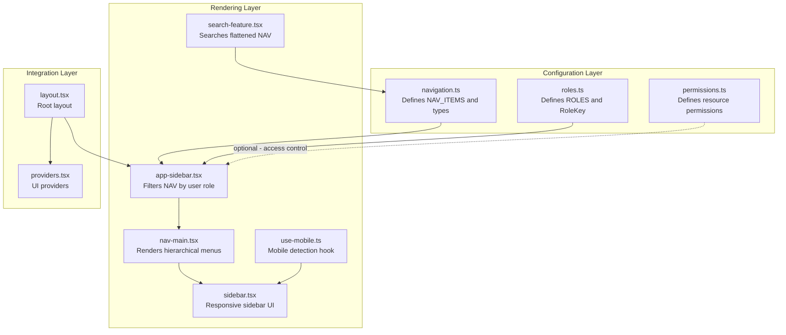
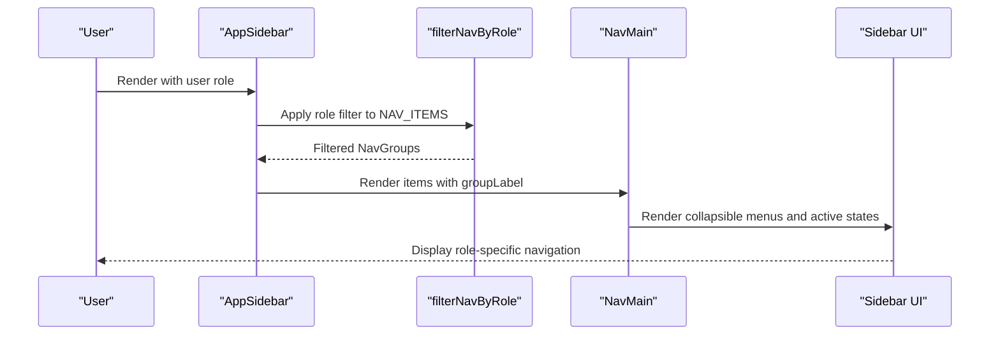
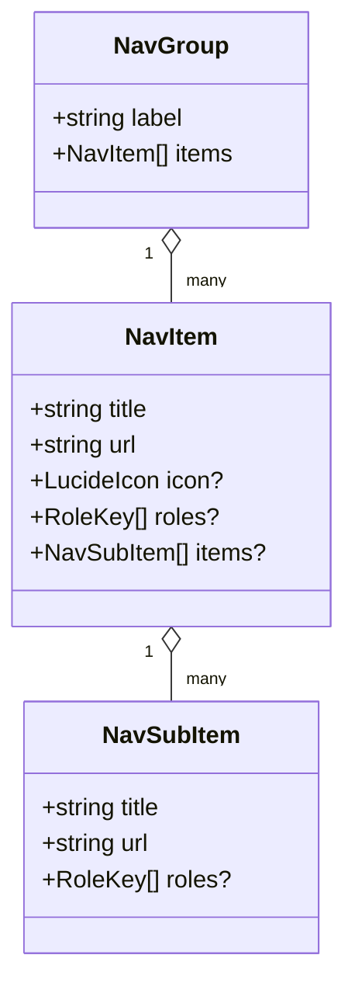
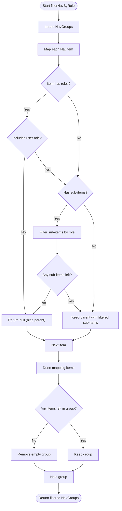
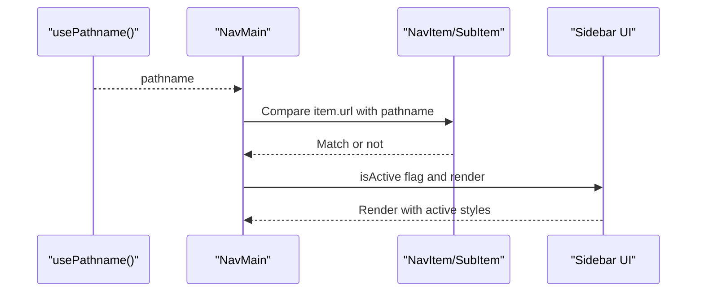
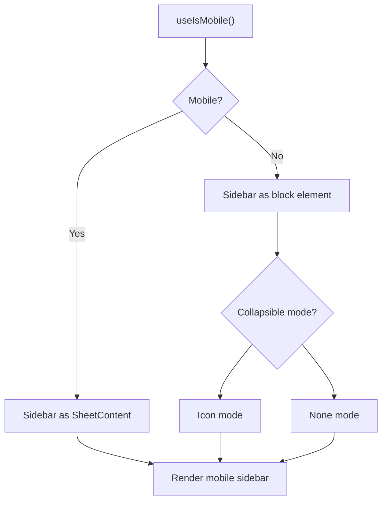
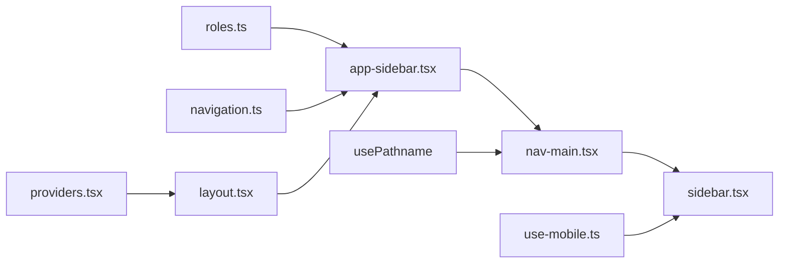

# Dynamic Navigation & Menu Generation

<cite>
**Referenced Files in This Document**
- [navigation.ts](file://src/config/navigation.ts)
- [roles.ts](file://src/config/roles.ts)
- [permissions.ts](file://src/lib/permissions.ts)
- [app-sidebar.tsx](file://src/components/app-sidebar.tsx)
- [nav-main.tsx](file://src/components/nav-main.tsx)
- [search-feature.tsx](file://src/components/search-feature.tsx)
- [sidebar.tsx](file://src/components/ui/sidebar.tsx)
- [use-mobile.ts](file://src/hooks/use-mobile.ts)
- [layout.tsx](file://src/app/layout.tsx)
- [providers.tsx](file://src/app/providers.tsx)
</cite>

## Table of Contents
1. [Introduction](#introduction)
2. [Project Structure](#project-structure)
3. [Core Components](#core-components)
4. [Architecture Overview](#architecture-overview)
5. [Detailed Component Analysis](#detailed-component-analysis)
6. [Dependency Analysis](#dependency-analysis)
7. [Performance Considerations](#performance-considerations)
8. [Troubleshooting Guide](#troubleshooting-guide)
9. [Conclusion](#conclusion)

## Introduction
This document explains the dynamic navigation system that generates role-specific menus in the application. It covers how navigation items are configured, filtered, and rendered based on user roles, the structure of navigation definitions, menu item properties, and conditional rendering logic. It also documents menu hierarchy management, how navigation changes when user roles are updated, and how the system supports mobile-responsive navigation patterns. Breadcrumb generation is not implemented in the current codebase; this document clarifies the existing capabilities and highlights areas for future enhancement.

## Project Structure
The navigation system spans three primary layers:
- Configuration layer: centralized navigation definitions and role constants
- Rendering layer: sidebar and menu components that render filtered navigation
- Integration layer: providers and layout that connect navigation to the application

**Diagram sources**
- [navigation.ts:1-217](file://src/config/navigation.ts#L1-L217)
- [roles.ts:1-18](file://src/config/roles.ts#L1-L18)
- [permissions.ts:1-67](file://src/lib/permissions.ts#L1-L67)
- [app-sidebar.tsx:1-91](file://src/components/app-sidebar.tsx#L1-L91)
- [nav-main.tsx:1-116](file://src/components/nav-main.tsx#L1-L116)
- [search-feature.tsx:1-262](file://src/components/search-feature.tsx#L1-L262)
- [sidebar.tsx:44-221](file://src/components/ui/sidebar.tsx#L44-L221)
- [use-mobile.ts:1-19](file://src/hooks/use-mobile.ts#L1-L19)
- [layout.tsx:1-63](file://src/app/layout.tsx#L1-L63)
- [providers.tsx:1-14](file://src/app/providers.tsx#L1-L14)

**Section sources**
- [navigation.ts:1-217](file://src/config/navigation.ts#L1-L217)
- [roles.ts:1-18](file://src/config/roles.ts#L1-L18)
- [permissions.ts:1-67](file://src/lib/permissions.ts#L1-L67)
- [app-sidebar.tsx:1-91](file://src/components/app-sidebar.tsx#L1-L91)
- [nav-main.tsx:1-116](file://src/components/nav-main.tsx#L1-L116)
- [search-feature.tsx:1-262](file://src/components/search-feature.tsx#L1-L262)
- [sidebar.tsx:44-221](file://src/components/ui/sidebar.tsx#L44-L221)
- [use-mobile.ts:1-19](file://src/hooks/use-mobile.ts#L1-L19)
- [layout.tsx:1-63](file://src/app/layout.tsx#L1-L63)
- [providers.tsx:1-14](file://src/app/providers.tsx#L1-L14)

## Core Components
- Navigation configuration: centralized definitions of menu groups, items, and sub-items with role restrictions
- Role definitions: single source of truth for supported roles
- Access control: resource-level permissions for advanced authorization
- Sidebar filter: role-based filtering of navigation groups and sub-items
- Menu renderer: renders hierarchical menus with collapsible sections and active state
- Search feature: role-filtered search across flattened navigation items
- Responsive sidebar: mobile-friendly sidebar with collapsible variants

**Section sources**
- [navigation.ts:16-33](file://src/config/navigation.ts#L16-L33)
- [roles.ts:5-17](file://src/config/roles.ts#L5-L17)
- [permissions.ts:25-66](file://src/lib/permissions.ts#L25-L66)
- [app-sidebar.tsx:24-51](file://src/components/app-sidebar.tsx#L24-L51)
- [nav-main.tsx:22-36](file://src/components/nav-main.tsx#L22-L36)
- [search-feature.tsx:37-80](file://src/components/search-feature.tsx#L37-L80)
- [sidebar.tsx:155-221](file://src/components/ui/sidebar.tsx#L155-L221)

## Architecture Overview
The navigation system follows a layered architecture:
- Configuration defines the static structure and role constraints
- Filtering applies user roles to produce a role-specific menu tree
- Rendering displays the filtered tree with active state and collapsible behavior
- Integration ensures the sidebar is responsive and works within the app layout

**Diagram sources**
- [app-sidebar.tsx:53-91](file://src/components/app-sidebar.tsx#L53-L91)
- [app-sidebar.tsx:24-51](file://src/components/app-sidebar.tsx#L24-L51)
- [nav-main.tsx:22-116](file://src/components/nav-main.tsx#L22-L116)
- [sidebar.tsx:155-221](file://src/components/ui/sidebar.tsx#L155-L221)

## Detailed Component Analysis

### Navigation Structure Definition
- Types define the shape of navigation items:
  - NavSubItem: title, url, optional roles array
  - NavItem: title, url, optional icon, optional roles array, optional nested items
  - NavGroup: label, items array
- NAV_ITEMS organizes top-level groups with nested sub-items and role restrictions
- RoleKey comes from roles.ts to ensure type-safe role checks

**Diagram sources**
- [navigation.ts:16-33](file://src/config/navigation.ts#L16-L33)

**Section sources**
- [navigation.ts:16-33](file://src/config/navigation.ts#L16-L33)
- [roles.ts:13-17](file://src/config/roles.ts#L13-L17)

### Role-Based Filtering Logic
- filterNavByRole iterates groups and items:
  - Skips items whose roles do not include the user's role
  - Recursively filters sub-items and hides parents if all children are filtered out
  - Returns a new NavGroup[] with only visible items
- The filtered result is memoized per role to avoid unnecessary re-renders

**Diagram sources**
- [app-sidebar.tsx:24-51](file://src/components/app-sidebar.tsx#L24-L51)

**Section sources**
- [app-sidebar.tsx:24-51](file://src/components/app-sidebar.tsx#L24-L51)

### Menu Rendering and Active State Highlighting
- NavMain renders:
  - Collapsible sections for items with sub-items
  - Active state detection based on pathname equality
  - Tooltip support and icons
- Active state is determined by comparing item.url with the current pathname

**Diagram sources**
- [nav-main.tsx:37-110](file://src/components/nav-main.tsx#L37-L110)

**Section sources**
- [nav-main.tsx:37-110](file://src/components/nav-main.tsx#L37-L110)

### Mobile-Responsive Navigation Patterns
- The sidebar supports three collapsible modes:
  - offcanvas: full-screen on mobile
  - icon: compact icon-only mode
  - none: fixed width
- Mobile detection uses a breakpoint hook to switch behavior
- On mobile, the sidebar uses SheetContent; on desktop, it uses a block element

**Diagram sources**
- [sidebar.tsx:155-221](file://src/components/ui/sidebar.tsx#L155-L221)
- [use-mobile.ts:5-18](file://src/hooks/use-mobile.ts#L5-L18)

**Section sources**
- [sidebar.tsx:155-221](file://src/components/ui/sidebar.tsx#L155-L221)
- [use-mobile.ts:5-18](file://src/hooks/use-mobile.ts#L5-L18)

### Role-Specific Menu Configuration Examples
- Admin: full access to all groups and sub-items
- Admin CS / Kasir: access to POS, customer, payment, finance, reports, and view-only production
- Designer: access to design queue, bank desain, and view orders
- Produksi: access to SPK and view orders
- Gudang: inventory management and view-only supplier/customer data

These configurations are defined in:
- Role keys and labels in roles.ts
- Resource permissions in permissions.ts
- Menu role restrictions in navigation.ts

**Section sources**
- [roles.ts:5-17](file://src/config/roles.ts#L5-L17)
- [permissions.ts:25-66](file://src/lib/permissions.ts#L25-L66)
- [navigation.ts:35-217](file://src/config/navigation.ts#L35-L217)

### Conditional Rendering Logic
- Items without roles are visible to everyone
- Parents with sub-items are hidden if all sub-items are filtered out
- Active state is computed per item/sub-item based on URL match
- Collapsible sections auto-open when any child matches the current URL

**Section sources**
- [app-sidebar.tsx:28-41](file://src/components/app-sidebar.tsx#L28-L41)
- [nav-main.tsx:46-49](file://src/components/nav-main.tsx#L46-L49)
- [nav-main.tsx:95-96](file://src/components/nav-main.tsx#L95-L96)

### Menu Hierarchy Management
- Top-level groups are labeled and contain items
- Items can have nested sub-items forming a tree
- Filtering preserves hierarchy by removing parents when children are filtered out
- Rendering supports nested collapsible sections with proper indentation and active states

**Section sources**
- [navigation.ts:30-33](file://src/config/navigation.ts#L30-L33)
- [app-sidebar.tsx:35-42](file://src/components/app-sidebar.tsx#L35-L42)
- [nav-main.tsx:44-91](file://src/components/nav-main.tsx#L44-L91)

### How Navigation Changes When User Roles Are Updated
- The filtered navigation is derived from user.role via a memoized selector
- When user.role changes, the memoization invalidates and recomputes the filtered tree
- The sidebar re-renders with the new role-specific menu

**Section sources**
- [app-sidebar.tsx:60-64](file://src/components/app-sidebar.tsx#L60-L64)

### Breadcrumb Generation
- The current codebase does not implement breadcrumb generation
- The search feature flattens navigation items for search but does not maintain a breadcrumb trail
- To implement breadcrumbs, integrate a breadcrumb component that derives path segments from the current route and maps them to NAV_ITEMS

**Section sources**
- [search-feature.tsx:37-80](file://src/components/search-feature.tsx#L37-L80)

## Dependency Analysis
The navigation system depends on:
- Configuration types and constants from roles.ts and navigation.ts
- UI primitives from sidebar.tsx and nav-main.tsx
- Routing state from Next.js (usePathname)
- Mobile detection from use-mobile.ts

**Diagram sources**
- [roles.ts:5-17](file://src/config/roles.ts#L5-L17)
- [navigation.ts:35-217](file://src/config/navigation.ts#L35-L217)
- [app-sidebar.tsx:13-14](file://src/components/app-sidebar.tsx#L13-L14)
- [nav-main.tsx:20](file://src/components/nav-main.tsx#L20)
- [sidebar.tsx:167-168](file://src/components/ui/sidebar.tsx#L167-L168)
- [use-mobile.ts:5-18](file://src/hooks/use-mobile.ts#L5-L18)
- [layout.tsx:4](file://src/app/layout.tsx#L4)
- [providers.tsx:6-12](file://src/app/providers.tsx#L6-L12)

**Section sources**
- [app-sidebar.tsx:13-14](file://src/components/app-sidebar.tsx#L13-L14)
- [nav-main.tsx:20](file://src/components/nav-main.tsx#L20)
- [sidebar.tsx:167-168](file://src/components/ui/sidebar.tsx#L167-L168)
- [use-mobile.ts:5-18](file://src/hooks/use-mobile.ts#L5-L18)
- [layout.tsx:4](file://src/app/layout.tsx#L4)
- [providers.tsx:6-12](file://src/app/providers.tsx#L6-L12)

## Performance Considerations
- Memoization: filterNavByRole is memoized by role to prevent redundant filtering
- Minimal re-renders: NavMain computes active state per item and only updates affected nodes
- Mobile optimization: collapsible modes reduce layout thrash on small screens
- Search feature: flattening and grouping are computed with useMemo to avoid heavy recalculations during typing

[No sources needed since this section provides general guidance]

## Troubleshooting Guide
- Items not appearing for a role:
  - Verify the role is included in the item’s roles array
  - Confirm the parent item is not filtered out due to empty sub-items
- Active state not highlighting:
  - Ensure item.url matches the current pathname exactly
  - Check that NavMain receives the correct pathname from usePathname
- Collapsible sections not opening:
  - Confirm that sub-item URLs match the current pathname to trigger hasActiveChild
- Mobile sidebar not working:
  - Check useIsMobile breakpoint and sidebar collapsible prop
  - Ensure the device width triggers the mobile branch

**Section sources**
- [app-sidebar.tsx:28-41](file://src/components/app-sidebar.tsx#L28-L41)
- [nav-main.tsx:46-49](file://src/components/nav-main.tsx#L46-L49)
- [nav-main.tsx:95-96](file://src/components/nav-main.tsx#L95-L96)
- [sidebar.tsx:184-207](file://src/components/ui/sidebar.tsx#L184-L207)
- [use-mobile.ts:5-18](file://src/hooks/use-mobile.ts#L5-L18)

## Conclusion
The dynamic navigation system provides a robust, role-aware menu that adapts to user permissions while maintaining a clean, hierarchical structure. It leverages memoization and conditional rendering to remain performant, and it integrates seamlessly with a responsive sidebar. While breadcrumbs are not currently implemented, the system’s modular design makes it straightforward to extend with breadcrumb generation and other UX enhancements.