# Permission Matrix & Enforcement

<cite>
**Referenced Files in This Document**
- [permissions.ts](file://src/lib/permissions.ts)
- [roles.ts](file://src/config/roles.ts)
- [auth.ts](file://src/lib/auth.ts)
- [proxy.ts](file://src/proxy.ts)
- [page.tsx](file://src/app/page.tsx)
- [route.ts](file://src/app/api/admin/bahan-baku/route.ts)
- [route.ts](file://src/app/api/admin/customer/[id]/route.ts)
- [page.tsx](file://src/app/(LoggedIn)/rbac/page.tsx)
- [layout.tsx](file://src/app/(LoggedIn)/rbac/layout.tsx)
- [page.tsx](file://src/app/(LoggedIn)/layout.tsx)
- [route.ts](file://src/app/api/auth/[...all]/route.ts)
- [route.ts](file://src/app/api/check-account/route.ts)
- [route.ts](file://src/app/api/notifications/route.ts)
- [route.ts](file://src/app/api/order/route.ts)
- [route.ts](file://src/app/api/production/design-queue/route.ts)
- [route.ts](file://src/app/api/reports/finance/cost/route.ts)
- [route.ts](file://src/app/api/upload/route.ts)
</cite>

## Table of Contents
1. [Introduction](#introduction)
2. [Project Structure](#project-structure)
3. [Core Components](#core-components)
4. [Architecture Overview](#architecture-overview)
5. [Detailed Component Analysis](#detailed-component-analysis)
6. [Dependency Analysis](#dependency-analysis)
7. [Performance Considerations](#performance-considerations)
8. [Troubleshooting Guide](#troubleshooting-guide)
9. [Conclusion](#conclusion)

## Introduction
This document explains the permission enforcement system used across the application. It covers how permissions are modeled, how roles map to permissions, how runtime checks are performed in API routes and UI components, and how the system integrates with authentication and routing. It also documents permission inheritance and overrides, caching strategies, and dynamic evaluation patterns.

## Project Structure
The permission system spans three layers:
- Model and roles: centralized definitions in a single module
- Authentication integration: Better Auth plugin wiring and role assignment
- Enforcement: route-level checks and optional UI guards

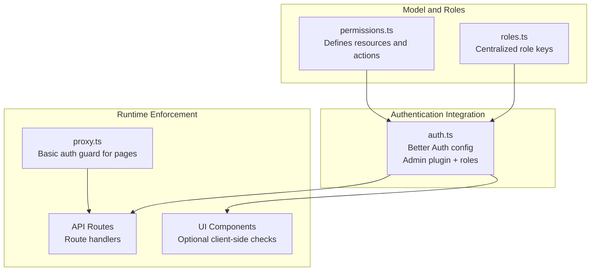

**Diagram sources**
- [permissions.ts:1-67](file://src/lib/permissions.ts#L1-L67)
- [roles.ts:1-18](file://src/config/roles.ts#L1-L18)
- [auth.ts:20-92](file://src/lib/auth.ts#L20-L92)
- [proxy.ts:19-57](file://src/proxy.ts#L19-L57)

**Section sources**
- [permissions.ts:1-67](file://src/lib/permissions.ts#L1-L67)
- [roles.ts:1-18](file://src/config/roles.ts#L1-L18)
- [auth.ts:20-92](file://src/lib/auth.ts#L20-L92)
- [proxy.ts:19-57](file://src/proxy.ts#L19-L57)

## Core Components
- Permission model: Resources mapped to allowed actions
- Roles: Typed role keys and labels
- Admin plugin: Better Auth admin plugin wired with custom access control and roles
- Route guards: Session retrieval and role-based access checks in API routes
- UI matrix: A rendered permission matrix for visibility and auditing

Key implementation references:
- [Resource statements and roles:8-67](file://src/lib/permissions.ts#L8-L67)
- [Role keys and labels:5-17](file://src/config/roles.ts#L5-L17)
- [Better Auth admin plugin wiring:78-91](file://src/lib/auth.ts#L78-L91)
- [Session retrieval pattern in API routes:9-15](file://src/app/api/admin/bahan-baku/route.ts#L9-L15)
- [Role-based access checks in API routes:17-21](file://src/app/api/admin/bahan-baku/route.ts#L17-L21)
- [Permission matrix UI](file://src/app/(LoggedIn)/rbac/page.tsx#L18-L36)

**Section sources**
- [permissions.ts:8-67](file://src/lib/permissions.ts#L8-L67)
- [roles.ts:5-17](file://src/config/roles.ts#L5-L17)
- [auth.ts:78-91](file://src/lib/auth.ts#L78-L91)
- [route.ts:9-21](file://src/app/api/admin/bahan-baku/route.ts#L9-L21)
- [page.tsx:18-36](file://src/app/(LoggedIn)/rbac/page.tsx#L18-L36)

## Architecture Overview
The system enforces permissions at two primary layers:
- Routing and session guard: Redirects unauthenticated users and prevents guest access when authenticated
- API route guard: Retrieves session and validates role membership per endpoint

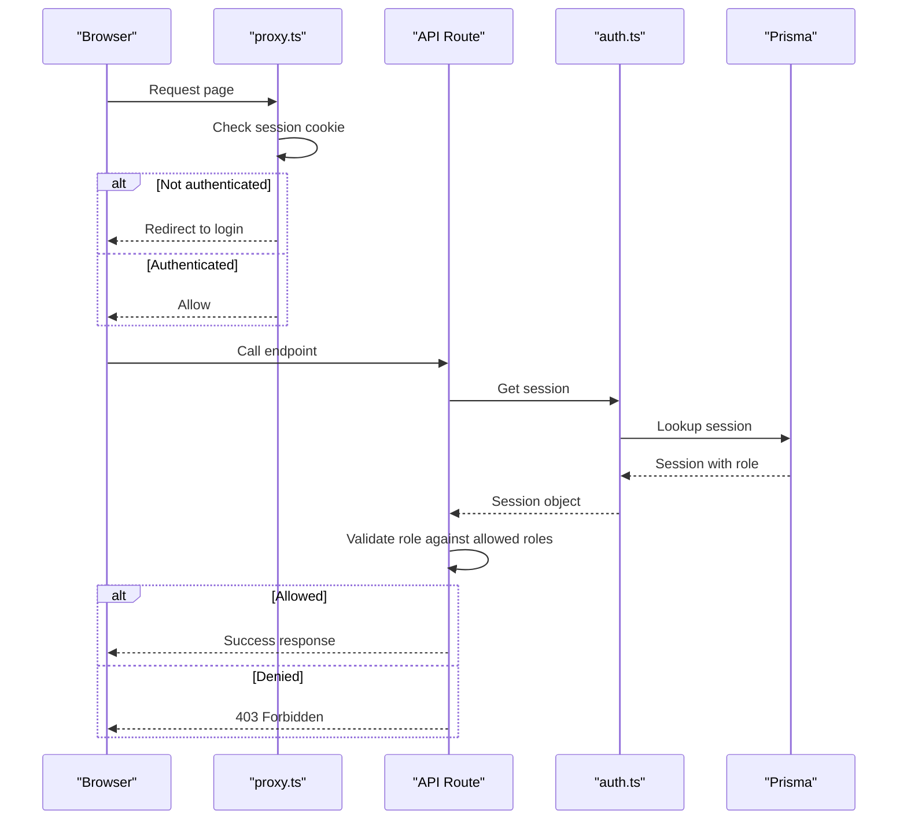

**Diagram sources**
- [proxy.ts:19-57](file://src/proxy.ts#L19-L57)
- [route.ts:9-21](file://src/app/api/admin/bahan-baku/route.ts#L9-L21)
- [auth.ts:20-92](file://src/lib/auth.ts#L20-L92)

## Detailed Component Analysis

### Permission Model and Roles
- Resources: pos, customer, payment, design, production, inventory, finance, report, master
- Actions: create, view, delete, update-status, verify, upload, update, ban, set-role, set-password, list, delete
- Roles: admin, kasir, designer, produksi, gudang
- Admin plugin: Provides built-in user/session administration actions via adminAc.statements

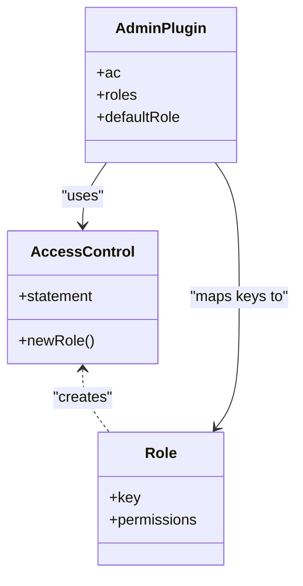

**Diagram sources**
- [permissions.ts:8-67](file://src/lib/permissions.ts#L8-L67)
- [auth.ts:78-91](file://src/lib/auth.ts#L78-L91)

**Section sources**
- [permissions.ts:8-67](file://src/lib/permissions.ts#L8-L67)
- [roles.ts:5-17](file://src/config/roles.ts#L5-L17)
- [auth.ts:78-91](file://src/lib/auth.ts#L78-L91)

### Authentication Integration and Role Assignment
- Better Auth configured with Prisma adapter and MySQL
- Admin plugin enabled with custom access control and role mapping
- Default role assigned to new users
- Hooks for pre-authentication normalization and avatar assignment

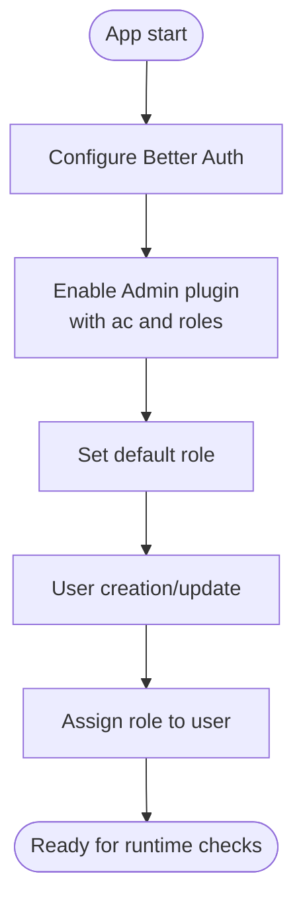

**Diagram sources**
- [auth.ts:20-92](file://src/lib/auth.ts#L20-L92)

**Section sources**
- [auth.ts:20-92](file://src/lib/auth.ts#L20-L92)

### Runtime Enforcement in API Routes
- Session retrieval via auth.api.getSession
- Role-based allow/deny lists per endpoint
- Consistent Unauthorized/Forbidden responses

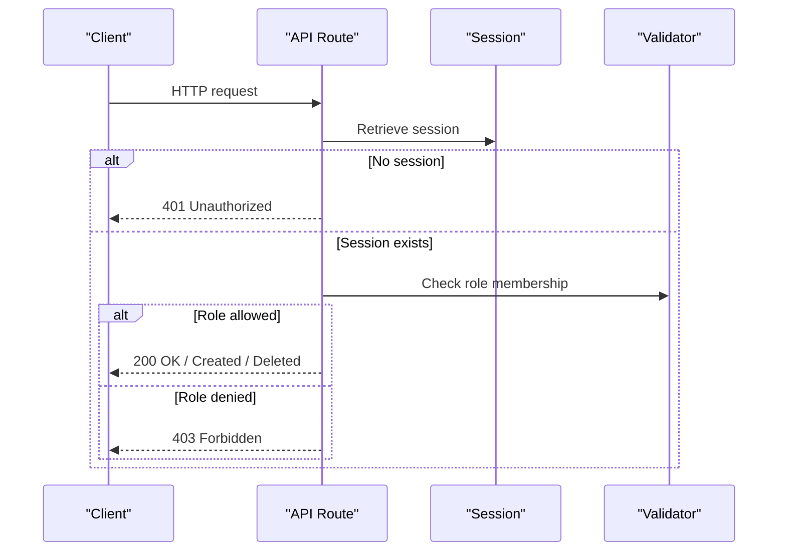

**Diagram sources**
- [route.ts:9-21](file://src/app/api/admin/bahan-baku/route.ts#L9-L21)
- [route.ts:17-98](file://src/app/api/admin/bahan-baku/route.ts#L17-L98)

**Section sources**
- [route.ts:9-21](file://src/app/api/admin/bahan-baku/route.ts#L9-L21)
- [route.ts:17-98](file://src/app/api/admin/bahan-baku/route.ts#L17-L98)

### UI Permission Matrix
- Centralized role metadata and permission sets
- Renders a matrix showing which roles have access to which resources and actions
- Used for documentation and self-service understanding of permissions

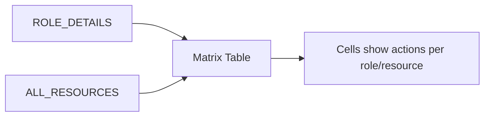

**Diagram sources**
- [page.tsx:18-36](file://src/app/(LoggedIn)/rbac/page.tsx#L18-L36)
- [page.tsx:144-188](file://src/app/(LoggedIn)/rbac/page.tsx#L144-L188)

**Section sources**
- [page.tsx:18-36](file://src/app/(LoggedIn)/rbac/page.tsx#L18-L36)
- [page.tsx:144-188](file://src/app/(LoggedIn)/rbac/page.tsx#L144-L188)

### Routing Guard and Session Validation
- Basic auth guard for pages using session cookie presence
- Redirects unauthenticated users to login
- Prevents authenticated users from accessing guest-only routes

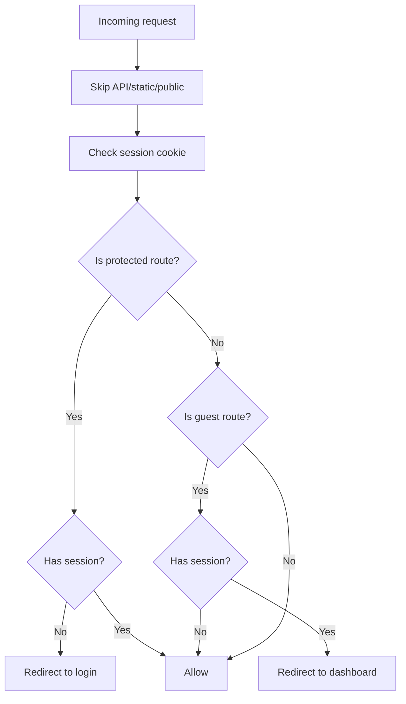

**Diagram sources**
- [proxy.ts:19-57](file://src/proxy.ts#L19-L57)

**Section sources**
- [proxy.ts:19-57](file://src/proxy.ts#L19-L57)

### Example: Inventory Endpoint Protection Pattern
- GET: Lists raw materials with pagination and filters; requires admin or gudang
- POST: Creates raw material; requires admin or gudang
- DELETE: Bulk deletes; requires admin or gudang

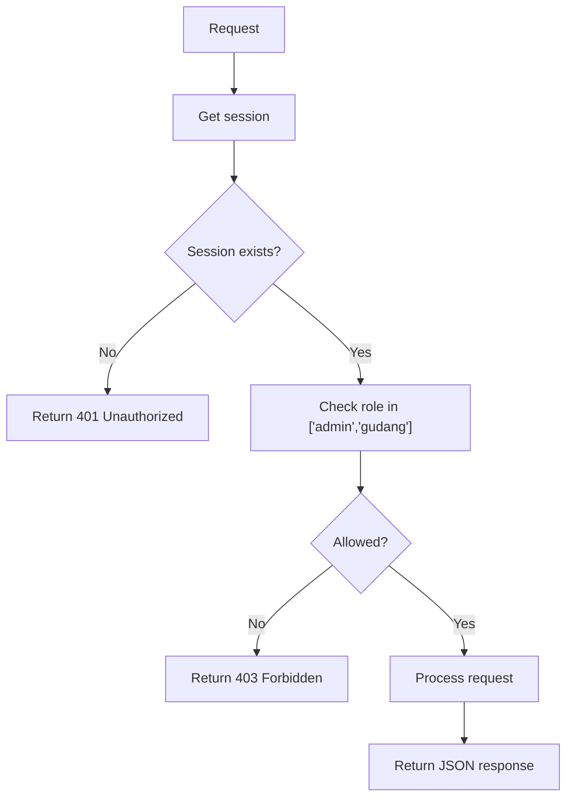

**Diagram sources**
- [route.ts:9-21](file://src/app/api/admin/bahan-baku/route.ts#L9-L21)
- [route.ts:17-21](file://src/app/api/admin/bahan-baku/route.ts#L17-L21)

**Section sources**
- [route.ts:9-21](file://src/app/api/admin/bahan-baku/route.ts#L9-L21)
- [route.ts:17-21](file://src/app/api/admin/bahan-baku/route.ts#L17-L21)

### Example: Customer Update/Delete Protection
- PUT/DELETE require admin or kasir roles
- Session retrieved and validated per request

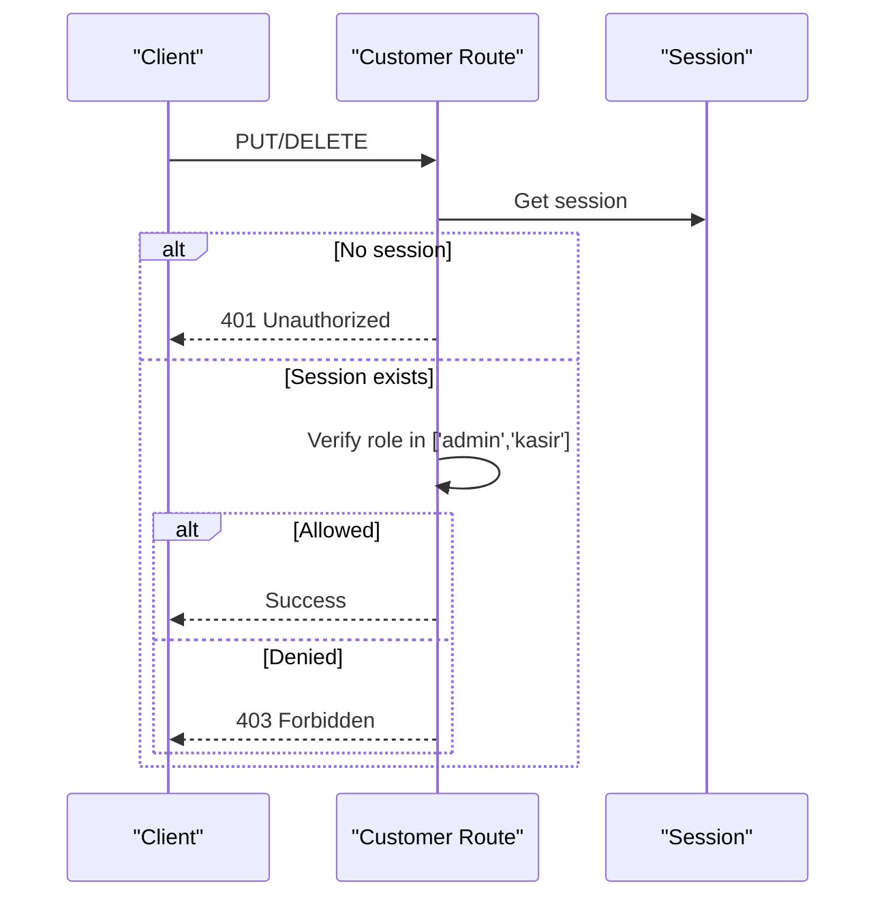

**Diagram sources**
- [route.ts:11-24](file://src/app/api/admin/customer/[id]/route.ts#L11-L24)
- [route.ts:91-103](file://src/app/api/admin/customer/[id]/route.ts#L91-L103)

**Section sources**
- [route.ts:11-24](file://src/app/api/admin/customer/[id]/route.ts#L11-L24)
- [route.ts:91-103](file://src/app/api/admin/customer/[id]/route.ts#L91-L103)

### Relationship Between Roles and Permissions
- Roles inherit permissions from the access control statements
- Built-in user/session admin actions are included for admin role
- Role keys are centrally defined and reused across schema/UI/API

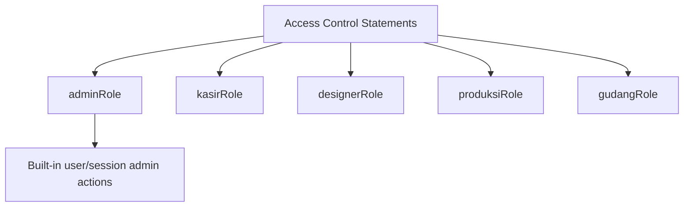

**Diagram sources**
- [permissions.ts:25-67](file://src/lib/permissions.ts#L25-L67)
- [roles.ts:5-11](file://src/config/roles.ts#L5-L11)

**Section sources**
- [permissions.ts:25-67](file://src/lib/permissions.ts#L25-L67)
- [roles.ts:5-11](file://src/config/roles.ts#L5-L11)

### Permission Inheritance and Overrides
- Roles are composed from resource-action statements
- Admin role merges built-in user/session admin statements
- Specific endpoints can override role checks with explicit allow/deny lists

**Section sources**
- [permissions.ts:25-37](file://src/lib/permissions.ts#L25-L37)
- [route.ts:17-21](file://src/app/api/admin/bahan-baku/route.ts#L17-L21)

### Dynamic Permission Evaluation During Runtime
- Session-based evaluation in API routes
- Optional client-side checks in UI components (pattern shown in UI matrix)
- Centralized role metadata supports dynamic rendering and tooltips

**Section sources**
- [route.ts:9-21](file://src/app/api/admin/bahan-baku/route.ts#L9-L21)
- [page.tsx:18-36](file://src/app/(LoggedIn)/rbac/page.tsx#L18-L36)

### Permission Caching Strategies
- Current implementation retrieves session per request
- Recommended caching approaches:
  - Short-lived in-memory cache keyed by session ID
  - Edge cache with TTL for read-heavy endpoints
  - Role and permission sets cached per user ID with invalidation on role change

[No sources needed since this section provides general guidance]

## Dependency Analysis
The following diagram shows how components depend on each other to enforce permissions:

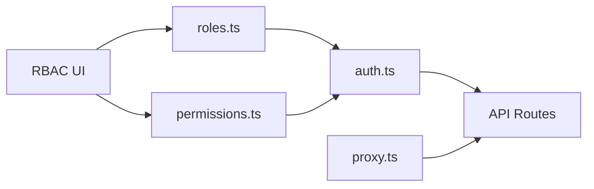

**Diagram sources**
- [roles.ts:5-17](file://src/config/roles.ts#L5-L17)
- [permissions.ts:8-67](file://src/lib/permissions.ts#L8-L67)
- [auth.ts:78-91](file://src/lib/auth.ts#L78-L91)
- [proxy.ts:19-57](file://src/proxy.ts#L19-L57)

**Section sources**
- [roles.ts:5-17](file://src/config/roles.ts#L5-L17)
- [permissions.ts:8-67](file://src/lib/permissions.ts#L8-L67)
- [auth.ts:78-91](file://src/lib/auth.ts#L78-L91)
- [proxy.ts:19-57](file://src/proxy.ts#L19-L57)

## Performance Considerations
- Minimize repeated session lookups by caching session data per request lifecycle
- Cache role and permission sets keyed by user ID with short TTL
- Use database indexes on frequently filtered fields (e.g., customer name)
- Batch reads for list endpoints to reduce round trips

[No sources needed since this section provides general guidance]

## Troubleshooting Guide
Common issues and resolutions:
- Unauthorized: Ensure the session cookie is present and valid; verify proxy redirection logic
- Forbidden: Confirm the user’s role is included in the endpoint’s allowed roles
- Role mismatches: Check the centralized role definitions and admin plugin mapping
- UI permission discrepancies: Verify the RBAC matrix matches the backend role definitions

**Section sources**
- [proxy.ts:45-49](file://src/proxy.ts#L45-L49)
- [route.ts:17-21](file://src/app/api/admin/bahan-baku/route.ts#L17-L21)
- [page.tsx:18-36](file://src/app/(LoggedIn)/rbac/page.tsx#L18-L36)

## Conclusion
The application employs a centralized permission model backed by Better Auth’s admin plugin. Roles are defined once and enforced consistently across API routes and UI components. The current design relies on session retrieval per request, with clear extension points for caching and dynamic evaluation. Adhering to the centralized role definitions ensures maintainability and reduces drift between UI and backend permissions.