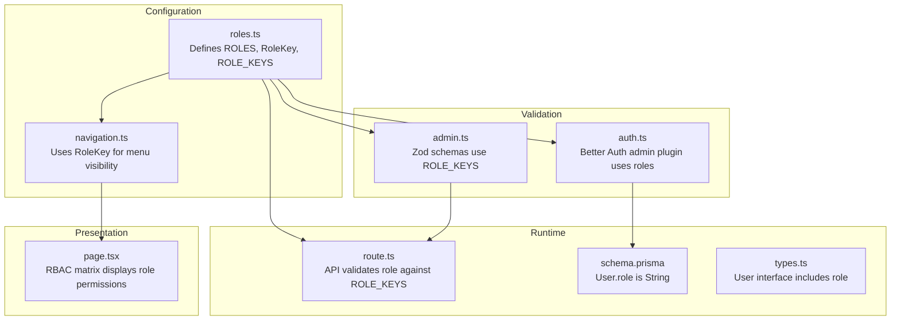
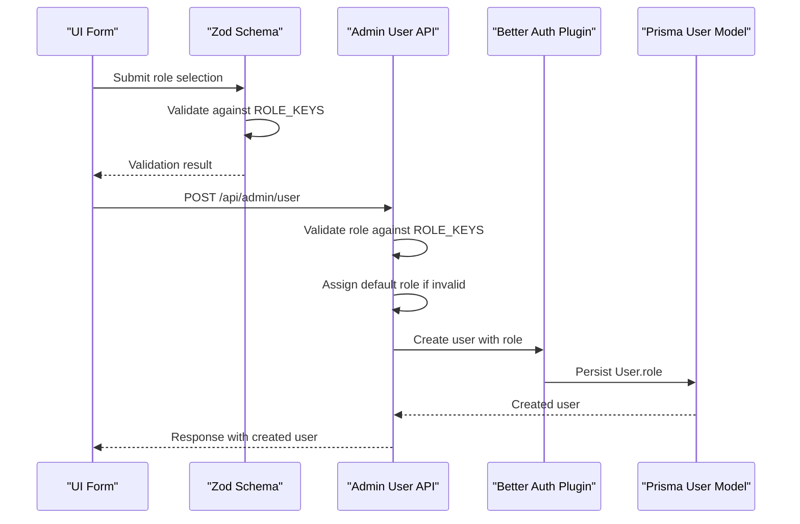
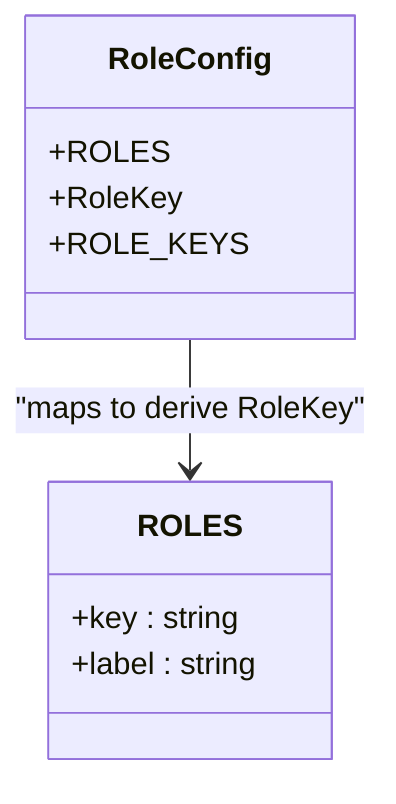
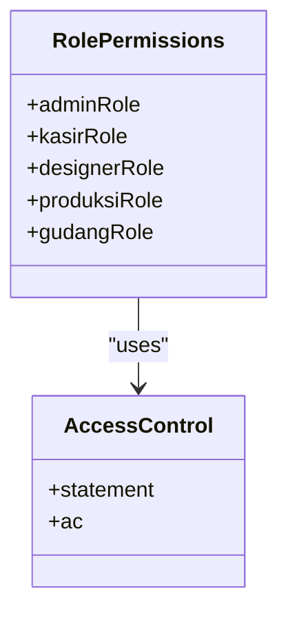
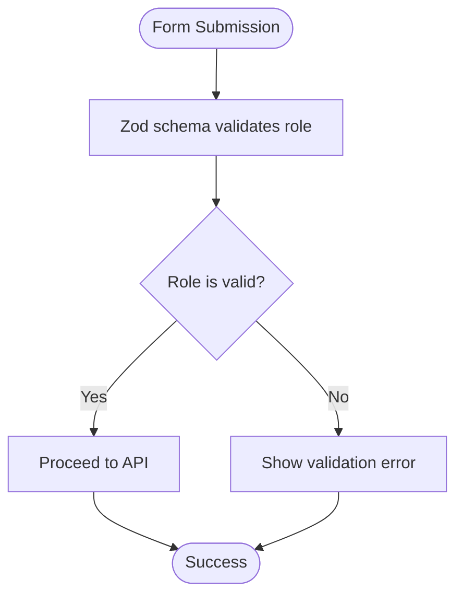
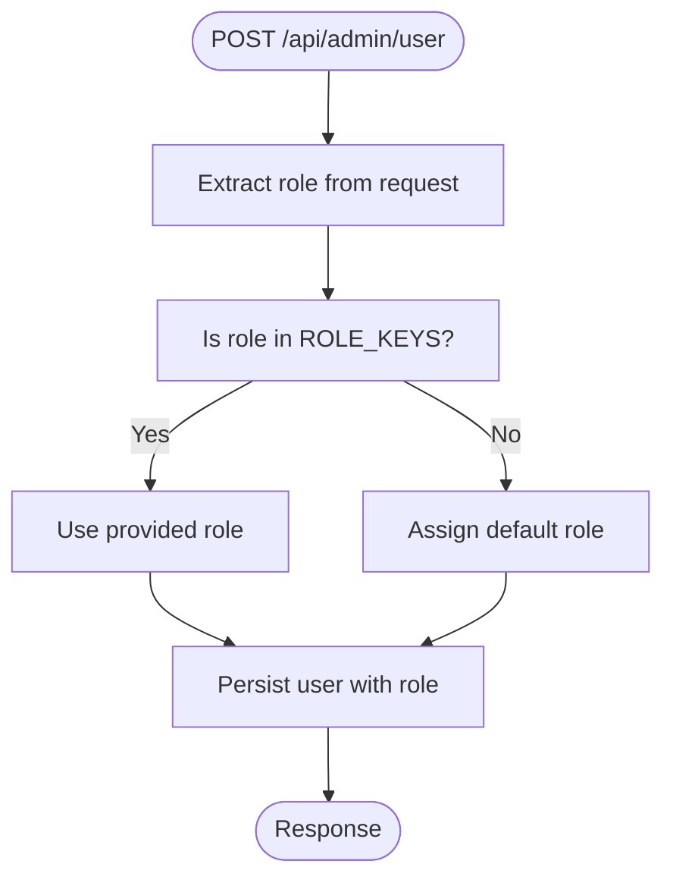
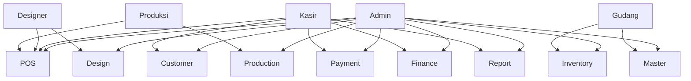
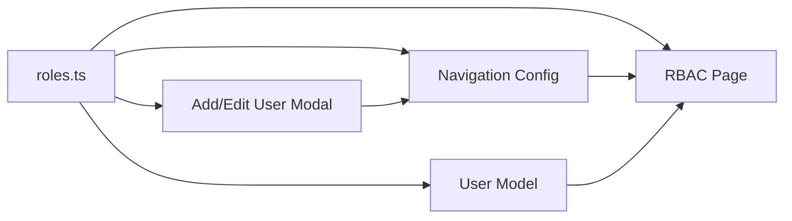
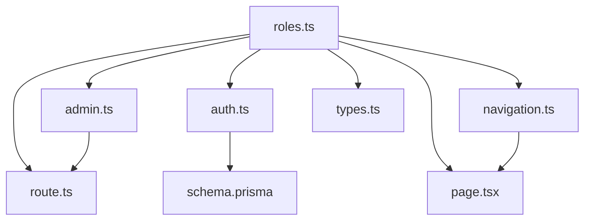

# Role Definitions & Configuration

<cite>
**Referenced Files in This Document**
- [roles.ts](file://src/config/roles.ts)
- [permissions.ts](file://src/lib/permissions.ts)
- [auth.ts](file://src/lib/auth.ts)
- [admin.ts](file://src/lib/schemas/admin.ts)
- [route.ts](file://src/app/api/admin/user/route.ts)
- [navigation.ts](file://src/config/navigation.ts)
- [types.ts](file://src/types/types.ts)
- [page.tsx](file://src/app/(LoggedIn)/rbac/page.tsx)
- [schema.prisma](file://prisma/schema.prisma)
</cite>

## Table of Contents
1. [Introduction](#introduction)
2. [Project Structure](#project-structure)
3. [Core Components](#core-components)
4. [Architecture Overview](#architecture-overview)
5. [Detailed Component Analysis](#detailed-component-analysis)
6. [Dependency Analysis](#dependency-analysis)
7. [Performance Considerations](#performance-considerations)
8. [Troubleshooting Guide](#troubleshooting-guide)
9. [Conclusion](#conclusion)

## Introduction
This document explains the centralized role definitions system used across the application. It covers the five core roles (admin, kasir, designer, produksi, gudang), their corresponding role keys, the configuration structure, type safety implementation using TypeScript, and how roles serve as a central source of truth. It also documents role key usage patterns, role hierarchy relationships, default role assignment, and the validation mechanisms that enforce role keys throughout the system.

## Project Structure
The role system spans several layers:
- Central configuration defines role keys and labels
- Type-safe schemas validate role keys during user creation/edit
- Authentication plugin integrates roles with session management
- Navigation configuration restricts menu access by role
- Database schema stores role as a string field
- UI components present role metadata and RBAC matrix

**Diagram sources**
- [roles.ts:1-18](file://src/config/roles.ts#L1-L18)
- [navigation.ts:14-28](file://src/config/navigation.ts#L14-L28)
- [admin.ts:1-51](file://src/lib/schemas/admin.ts#L1-L51)
- [auth.ts:11-92](file://src/lib/auth.ts#L11-L92)
- [route.ts:8-131](file://src/app/api/admin/user/route.ts#L8-L131)
- [schema.prisma:15-42](file://prisma/schema.prisma#L15-L42)
- [types.ts:1-12](file://src/types/types.ts#L1-L12)
- [page.tsx:18-82](file://src/app/(LoggedIn)/rbac/page.tsx#L18-L82)

**Section sources**
- [roles.ts:1-18](file://src/config/roles.ts#L1-L18)
- [navigation.ts:14-28](file://src/config/navigation.ts#L14-L28)
- [admin.ts:1-51](file://src/lib/schemas/admin.ts#L1-L51)
- [auth.ts:11-92](file://src/lib/auth.ts#L11-L92)
- [route.ts:8-131](file://src/app/api/admin/user/route.ts#L8-L131)
- [schema.prisma:15-42](file://prisma/schema.prisma#L15-L42)
- [types.ts:1-12](file://src/types/types.ts#L1-L12)
- [page.tsx:18-82](file://src/app/(LoggedIn)/rbac/page.tsx#L18-L82)

## Core Components
- Centralized role configuration: Defines the canonical list of roles and exports a strongly-typed role key union and a tuple of allowed keys.
- Role permission definitions: Uses Better Auth Access Control to define granular permissions per role.
- Type-safe validation: Zod schemas consume the role key tuple to validate user role selection.
- Default role assignment: API route enforces a default role when an invalid or missing role is provided.
- Navigation gating: Navigation items declare which roles can access them using the shared RoleKey type.
- Database persistence: User entity stores role as a string, aligned with the role key enumeration.

**Section sources**
- [roles.ts:5-17](file://src/config/roles.ts#L5-L17)
- [permissions.ts:25-66](file://src/lib/permissions.ts#L25-L66)
- [admin.ts:23-43](file://src/lib/schemas/admin.ts#L23-L43)
- [route.ts:130-131](file://src/app/api/admin/user/route.ts#L130-L131)
- [navigation.ts:19-26](file://src/config/navigation.ts#L19-L26)
- [schema.prisma:26](file://prisma/schema.prisma#L26)

## Architecture Overview
The role system is a single source of truth that propagates from configuration to validation, runtime enforcement, and presentation.

**Diagram sources**
- [roles.ts:13-17](file://src/config/roles.ts#L13-L17)
- [admin.ts:23-43](file://src/lib/schemas/admin.ts#L23-L43)
- [route.ts:130-131](file://src/app/api/admin/user/route.ts#L130-L131)
- [auth.ts:80-91](file://src/lib/auth.ts#L80-L91)
- [schema.prisma:26](file://prisma/schema.prisma#L26)

## Detailed Component Analysis

### Role Keys and Configuration
- Role keys are defined centrally with immutable arrays and exported as a readonly tuple of literal types.
- The RoleKey type is derived from the role keys, enabling exhaustive checks and autocompletion.
- ROLE_KEYS is a tuple of role keys, ensuring compile-time validation of role values.

**Diagram sources**
- [roles.ts:5-17](file://src/config/roles.ts#L5-L17)

**Section sources**
- [roles.ts:5-17](file://src/config/roles.ts#L5-L17)

### Role Permission Definitions
- Five roles are defined with explicit permission sets for resources (POS, customer, payment, design, production, inventory, finance, report, master).
- Admin role receives full access and built-in admin permissions.
- Other roles receive scoped permissions tailored to their responsibilities.

**Diagram sources**
- [permissions.ts:25-66](file://src/lib/permissions.ts#L25-L66)
- [permissions.ts:8-21](file://src/lib/permissions.ts#L8-L21)

**Section sources**
- [permissions.ts:25-66](file://src/lib/permissions.ts#L25-L66)
- [permissions.ts:8-21](file://src/lib/permissions.ts#L8-L21)

### Type Safety and Validation
- Zod schemas import ROLE_KEYS and enforce role selection using z.enum(ROLE_KEYS).
- Validation messages guide users to select a valid role.
- The validation occurs on both create and edit user forms.

**Diagram sources**
- [admin.ts:23-43](file://src/lib/schemas/admin.ts#L23-L43)

**Section sources**
- [admin.ts:23-43](file://src/lib/schemas/admin.ts#L23-L43)

### Default Role Assignment Pattern
- When creating users via the API, if the provided role is not among the allowed keys, the system assigns a default role.
- The default role is configured in the authentication plugin and used as fallback.

**Diagram sources**
- [route.ts:130-131](file://src/app/api/admin/user/route.ts#L130-L131)
- [auth.ts:89](file://src/lib/auth.ts#L89)

**Section sources**
- [route.ts:130-131](file://src/app/api/admin/user/route.ts#L130-L131)
- [auth.ts:89](file://src/lib/auth.ts#L89)

### Role Hierarchy and Relationships
- There is no explicit hierarchical inheritance between roles. Instead, each role has a fixed set of permissions.
- The admin role encompasses all permissions and includes built-in admin capabilities.
- Other roles are scoped to specific modules (e.g., kasir focuses on POS and payments, gudang on inventory).

**Diagram sources**
- [permissions.ts:25-66](file://src/lib/permissions.ts#L25-L66)
- [page.tsx:18-82](file://src/app/(LoggedIn)/rbac/page.tsx#L18-L82)

**Section sources**
- [permissions.ts:25-66](file://src/lib/permissions.ts#L25-L66)
- [page.tsx:18-82](file://src/app/(LoggedIn)/rbac/page.tsx#L18-L82)

### Role Key Usage Throughout the Application
- UI forms: Role selection dropdowns use the central role list for options.
- Navigation: Menu items declare allowed roles using the RoleKey type.
- RBAC matrix: A dedicated page displays role permissions across resources.
- Database: User entity stores role as a string, aligning with role keys.

**Diagram sources**
- [roles.ts:5-17](file://src/config/roles.ts#L5-L17)
- [page.tsx:157-159](file://src/app/(LoggedIn)/master/user/components/add-user-modal.tsx#L157-L159)
- [navigation.ts:19-26](file://src/config/navigation.ts#L19-L26)
- [page.tsx:18-82](file://src/app/(LoggedIn)/rbac/page.tsx#L18-L82)
- [schema.prisma:26](file://prisma/schema.prisma#L26)

**Section sources**
- [roles.ts:5-17](file://src/config/roles.ts#L5-L17)
- [page.tsx:157-159](file://src/app/(LoggedIn)/master/user/components/add-user-modal.tsx#L157-L159)
- [navigation.ts:19-26](file://src/config/navigation.ts#L19-L26)
- [page.tsx:18-82](file://src/app/(LoggedIn)/rbac/page.tsx#L18-L82)
- [schema.prisma:26](file://prisma/schema.prisma#L26)

## Dependency Analysis
The role system exhibits tight coupling around the central configuration while maintaining loose coupling elsewhere through type-safe interfaces.

**Diagram sources**
- [roles.ts:5-17](file://src/config/roles.ts#L5-L17)
- [admin.ts:23-43](file://src/lib/schemas/admin.ts#L23-L43)
- [auth.ts:80-91](file://src/lib/auth.ts#L80-L91)
- [route.ts:8-131](file://src/app/api/admin/user/route.ts#L8-L131)
- [navigation.ts:19-26](file://src/config/navigation.ts#L19-L26)
- [types.ts:6](file://src/types/types.ts#L6)
- [page.tsx:18-82](file://src/app/(LoggedIn)/rbac/page.tsx#L18-L82)
- [schema.prisma:26](file://prisma/schema.prisma#L26)

**Section sources**
- [roles.ts:5-17](file://src/config/roles.ts#L5-L17)
- [admin.ts:23-43](file://src/lib/schemas/admin.ts#L23-L43)
- [auth.ts:80-91](file://src/lib/auth.ts#L80-L91)
- [route.ts:8-131](file://src/app/api/admin/user/route.ts#L8-L131)
- [navigation.ts:19-26](file://src/config/navigation.ts#L19-L26)
- [types.ts:6](file://src/types/types.ts#L6)
- [page.tsx:18-82](file://src/app/(LoggedIn)/rbac/page.tsx#L18-L82)
- [schema.prisma:26](file://prisma/schema.prisma#L26)

## Performance Considerations
- Using a tuple of role keys ensures compile-time validation without runtime overhead.
- Role validation in Zod and API routes is O(n) against the allowed keys; with only five roles, this is negligible.
- Storing role as a string in the database is efficient and straightforward.

## Troubleshooting Guide
Common issues and resolutions:
- Invalid role key submission: Zod validation will fail; ensure the submitted role matches one of the allowed keys.
- Role not appearing in UI: Verify the role key exists in the central configuration and is used consistently across schemas and navigation.
- Role mismatch in navigation: Confirm that navigation items declare roles using the RoleKey type and that the user’s role matches the allowed list.
- Default role assignment: If a role is omitted or invalid, the system assigns the default role; verify the default role configuration.

**Section sources**
- [admin.ts:23-43](file://src/lib/schemas/admin.ts#L23-L43)
- [route.ts:130-131](file://src/app/api/admin/user/route.ts#L130-L131)
- [auth.ts:89](file://src/lib/auth.ts#L89)

## Conclusion
The role definitions system establishes a single source of truth for roles, enforcing type safety across schemas, UI, navigation, and runtime. The five core roles (admin, kasir, designer, produksi, gudang) are defined with precise permissions, validated rigorously, and persisted consistently. This design ensures maintainability, reduces errors, and supports clear separation of concerns across the application.