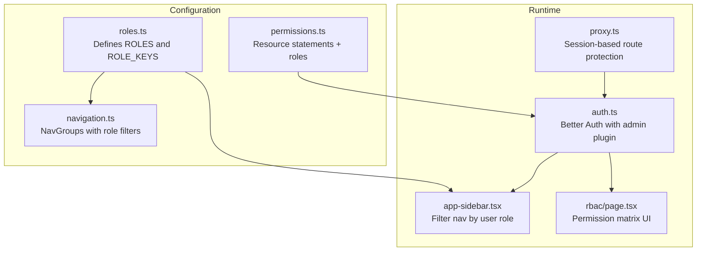
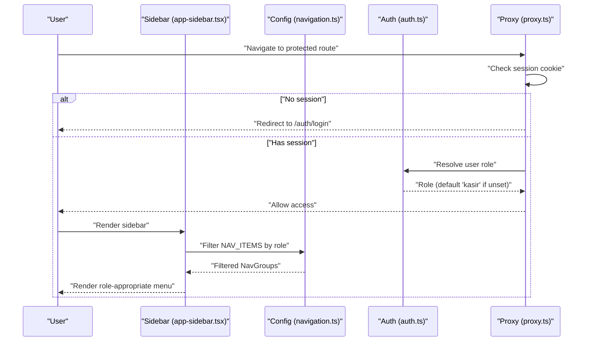
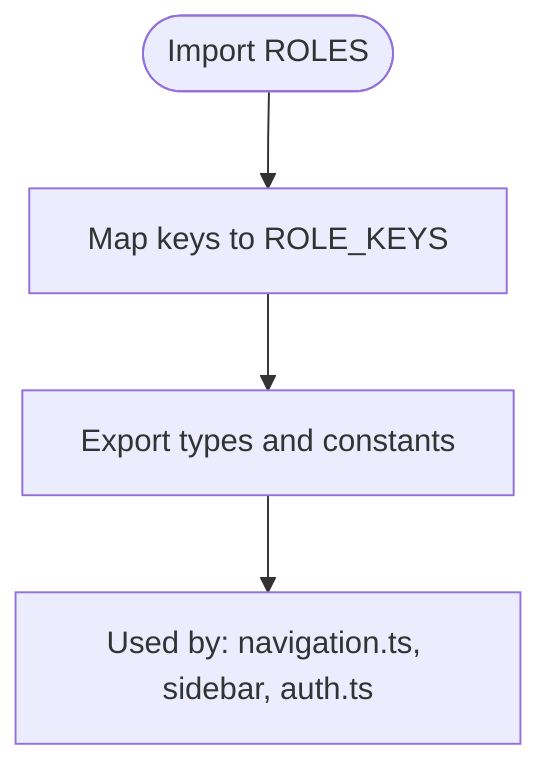
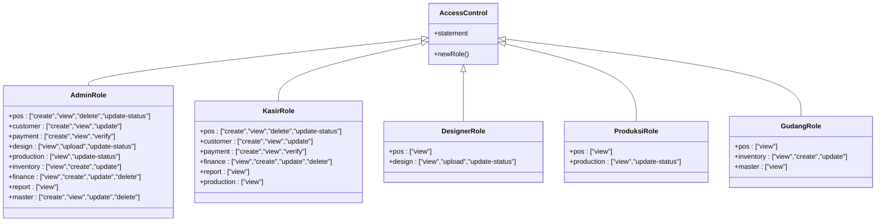
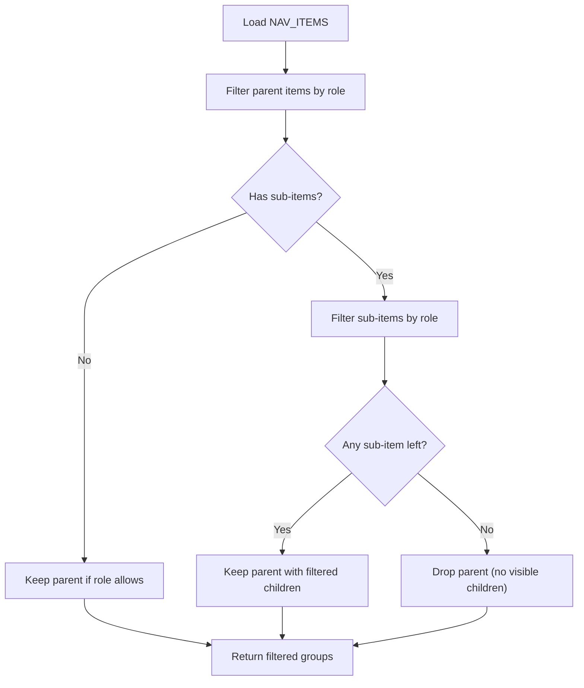
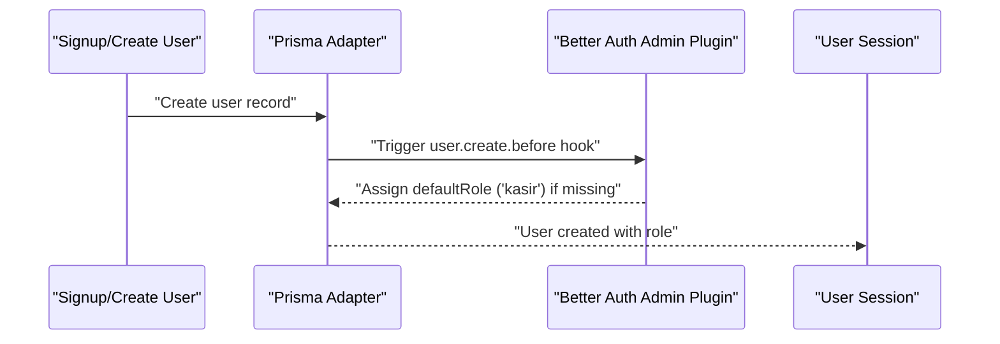
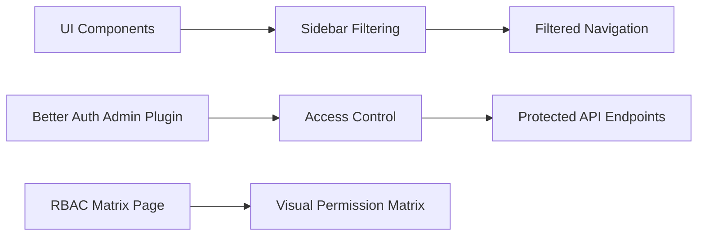
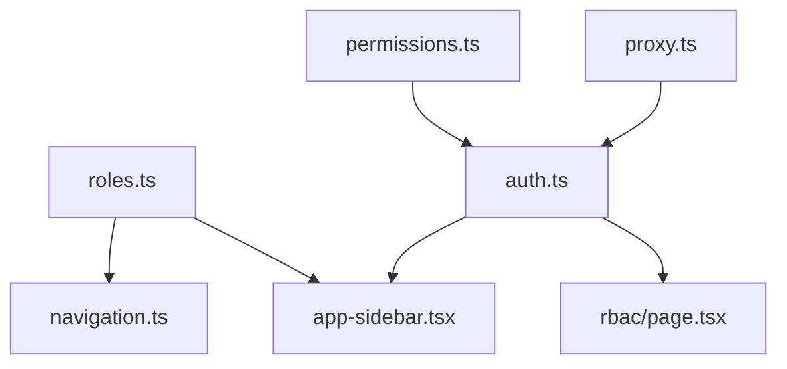

# Role-Based Access Control (RBAC)

<cite>
**Referenced Files in This Document**
- [roles.ts](file://src/config/roles.ts)
- [permissions.ts](file://src/lib/permissions.ts)
- [navigation.ts](file://src/config/navigation.ts)
- [auth.ts](file://src/lib/auth.ts)
- [app-sidebar.tsx](file://src/components/app-sidebar.tsx)
- [page.tsx](file://src/app/(LoggedIn)/rbac/page.tsx)
- [proxy.ts](file://src/proxy.ts)
- [layout.tsx](file://src/app/(LoggedIn)/rbac/layout.tsx)
</cite>

## Table of Contents
1. [Introduction](#introduction)
2. [Project Structure](#project-structure)
3. [Core Components](#core-components)
4. [Architecture Overview](#architecture-overview)
5. [Detailed Component Analysis](#detailed-component-analysis)
6. [Dependency Analysis](#dependency-analysis)
7. [Performance Considerations](#performance-considerations)
8. [Troubleshooting Guide](#troubleshooting-guide)
9. [Conclusion](#conclusion)

## Introduction
This document describes the Role-Based Access Control (RBAC) system for the POS application. It defines five user roles: Admin, Kasir (Cashier), Designer, Produksi (Production), and Gudang (Warehouse). The system enforces permissions across UI navigation, API endpoints, and administrative functions. It documents the permission matrix per role, role assignment mechanisms, dynamic menu generation, and protection of API endpoints. Practical examples illustrate role-specific functionality, permission checks, and role transitions.

## Project Structure
The RBAC implementation spans configuration, runtime enforcement, UI filtering, and administrative views:
- Centralized role definitions and keys
- Permission statements and role mappings
- Navigation tree with role-based visibility
- Authentication plugin wiring with default role assignment
- Sidebar filtering logic
- RBAC matrix page for transparency
- Request proxy for session-based protection

**Diagram sources**
- [roles.ts:1-18](file://src/config/roles.ts#L1-L18)
- [navigation.ts:1-217](file://src/config/navigation.ts#L1-L217)
- [permissions.ts:1-67](file://src/lib/permissions.ts#L1-L67)
- [auth.ts:1-95](file://src/lib/auth.ts#L1-L95)
- [app-sidebar.tsx:1-91](file://src/components/app-sidebar.tsx#L1-L91)
- [page.tsx:1-211](file://src/app/(LoggedIn)/rbac/page.tsx#L1-L211)
- [proxy.ts:1-71](file://src/proxy.ts#L1-L71)

**Section sources**
- [roles.ts:1-18](file://src/config/roles.ts#L1-L18)
- [permissions.ts:1-67](file://src/lib/permissions.ts#L1-L67)
- [navigation.ts:1-217](file://src/config/navigation.ts#L1-L217)
- [auth.ts:1-95](file://src/lib/auth.ts#L1-L95)
- [app-sidebar.tsx:1-91](file://src/components/app-sidebar.tsx#L1-L91)
- [page.tsx:1-211](file://src/app/(LoggedIn)/rbac/page.tsx#L1-L211)
- [proxy.ts:1-71](file://src/proxy.ts#L1-L71)

## Core Components
- Role definitions: Centralized enumeration of roles and derived keys.
- Permission statements: Resource-level actions mapped to roles.
- Navigation tree: Hierarchical menu with role visibility constraints.
- Authentication plugin: Better Auth admin plugin with role mappings and default role.
- Sidebar filtering: Dynamic menu rendering based on current user role.
- RBAC matrix: Administrative view displaying permission matrices per role.
- Route protection: Session-based proxy for protected/guest routes.

**Section sources**
- [roles.ts:1-18](file://src/config/roles.ts#L1-L18)
- [permissions.ts:1-67](file://src/lib/permissions.ts#L1-L67)
- [navigation.ts:1-217](file://src/config/navigation.ts#L1-L217)
- [auth.ts:1-95](file://src/lib/auth.ts#L1-L95)
- [app-sidebar.tsx:1-91](file://src/components/app-sidebar.tsx#L1-L91)
- [page.tsx:1-211](file://src/app/(LoggedIn)/rbac/page.tsx#L1-L211)
- [proxy.ts:1-71](file://src/proxy.ts#L1-L71)

## Architecture Overview
The RBAC architecture integrates role definitions, permission statements, and UI navigation. At runtime, the sidebar filters visible items based on the user’s role. The authentication plugin manages role assignment and enforces permissions via the access control layer. Protected routes are enforced by a proxy middleware that checks session cookies.

**Diagram sources**
- [app-sidebar.tsx:24-51](file://src/components/app-sidebar.tsx#L24-L51)
- [navigation.ts:35-217](file://src/config/navigation.ts#L35-L217)
- [auth.ts:80-91](file://src/lib/auth.ts#L80-L91)
- [proxy.ts:19-57](file://src/proxy.ts#L19-L57)

## Detailed Component Analysis

### Role Definitions and Keys
- Centralized role list with machine-readable keys and human-friendly labels.
- Derived keys array enables strict TypeScript usage across UI and backend.

**Diagram sources**
- [roles.ts:5-17](file://src/config/roles.ts#L5-L17)

**Section sources**
- [roles.ts:1-18](file://src/config/roles.ts#L1-L18)

### Permission Statements and Role Mapping
- Resource statements define available actions per module (e.g., pos, customer, payment, design, production, inventory, finance, report, master).
- Role definitions map resource actions to each role, including Admin built-in user/session permissions.
- Admin role includes user management capabilities; other roles reflect operational scopes.

**Diagram sources**
- [permissions.ts:8-66](file://src/lib/permissions.ts#L8-L66)

**Section sources**
- [permissions.ts:1-67](file://src/lib/permissions.ts#L1-L67)

### Navigation Menu Generation Based on Roles
- Navigation groups and items carry optional role arrays.
- Sidebar filters items and sub-items; parents without visible children are hidden.
- Default fallback role ensures navigation renders even if user lacks explicit role.

**Diagram sources**
- [navigation.ts:35-217](file://src/config/navigation.ts#L35-L217)
- [app-sidebar.tsx:24-51](file://src/components/app-sidebar.tsx#L24-L51)

**Section sources**
- [navigation.ts:1-217](file://src/config/navigation.ts#L1-L217)
- [app-sidebar.tsx:1-91](file://src/components/app-sidebar.tsx#L1-L91)

### Role Assignment Mechanisms
- Default role is assigned during user creation if none provided.
- Role mapping is registered with the Better Auth admin plugin.
- UI components consume user.role to drive navigation and permission checks.

**Diagram sources**
- [auth.ts:50-65](file://src/lib/auth.ts#L50-L65)
- [auth.ts:80-91](file://src/lib/auth.ts#L80-L91)

**Section sources**
- [auth.ts:1-95](file://src/lib/auth.ts#L1-L95)

### Permission Enforcement Across the Application
- UI: Sidebar filters items based on role.
- API: Access control statements and role mappings enforce permissions at the auth layer.
- Admin panel: RBAC matrix page displays effective permissions per role.

**Diagram sources**
- [app-sidebar.tsx:24-51](file://src/components/app-sidebar.tsx#L24-L51)
- [auth.ts:80-91](file://src/lib/auth.ts#L80-L91)
- [page.tsx:18-82](file://src/app/(LoggedIn)/rbac/page.tsx#L18-L82)

**Section sources**
- [app-sidebar.tsx:1-91](file://src/components/app-sidebar.tsx#L1-L91)
- [auth.ts:1-95](file://src/lib/auth.ts#L1-L95)
- [page.tsx:1-211](file://src/app/(LoggedIn)/rbac/page.tsx#L1-L211)

### Permission Matrix for Each Role
The RBAC matrix enumerates permissions per role and resource. Administrators have broad privileges, while operational roles focus on specific modules.

- Admin: Full access across modules including user management.
- Kasir: POS, customer, payment, finance CRUD, reporting, and view-only production.
- Designer: View-only POS and design upload/update-status.
- Produksi: View-only POS and production update-status.
- Gudang: View-only POS, inventory create/update, and view-only master data.

**Section sources**
- [page.tsx:18-82](file://src/app/(LoggedIn)/rbac/page.tsx#L18-L82)
- [permissions.ts:25-66](file://src/lib/permissions.ts#L25-L66)

### Role-Specific Functionality Examples
- Admin:
  - Manage users and roles.
  - Full CRUD on finance and master data.
  - View and manage reports.
- Kasir:
  - Create and update POS orders.
  - Process payments and verify transactions.
  - View financial summaries and production status.
- Designer:
  - Upload design files and update design status.
  - View orders and design archive.
- Produksi:
  - Track and update production status (SPK).
  - View orders related to production.
- Gudang:
  - Manage raw material inventory (in/out/create/update).
  - View supplier and product data.

**Section sources**
- [permissions.ts:25-66](file://src/lib/permissions.ts#L25-L66)
- [page.tsx:18-82](file://src/app/(LoggedIn)/rbac/page.tsx#L18-L82)

### Permission Checking Patterns
- UI-level checks: Sidebar filters items based on user role before rendering.
- Auth-level checks: Better Auth admin plugin validates permissions against resource actions.
- Matrix view: RBAC page presents a consolidated view of permissions for auditing and training.

**Section sources**
- [app-sidebar.tsx:24-51](file://src/components/app-sidebar.tsx#L24-L51)
- [auth.ts:80-91](file://src/lib/auth.ts#L80-L91)
- [page.tsx:110-211](file://src/app/(LoggedIn)/rbac/page.tsx#L110-L211)

### Role Transition Scenarios
- Default role assignment: New users receive the default role if not explicitly set.
- Manual role updates: Admin can change roles via user management screens.
- Effective permissions: After role changes, navigation and API access update immediately based on the new role mapping.

**Section sources**
- [auth.ts:89](file://src/lib/auth.ts#L89)
- [page.tsx:18-82](file://src/app/(LoggedIn)/rbac/page.tsx#L18-L82)

## Dependency Analysis
The RBAC system exhibits clear separation of concerns:
- Configuration depends on centralized role definitions.
- Runtime depends on permission statements and auth plugin registration.
- UI depends on navigation configuration and role-aware filtering.
- Protection depends on session validation and route classification.

**Diagram sources**
- [roles.ts:1-18](file://src/config/roles.ts#L1-L18)
- [navigation.ts:1-217](file://src/config/navigation.ts#L1-L217)
- [permissions.ts:1-67](file://src/lib/permissions.ts#L1-L67)
- [auth.ts:1-95](file://src/lib/auth.ts#L1-L95)
- [app-sidebar.tsx:1-91](file://src/components/app-sidebar.tsx#L1-L91)
- [page.tsx:1-211](file://src/app/(LoggedIn)/rbac/page.tsx#L1-L211)
- [proxy.ts:1-71](file://src/proxy.ts#L1-L71)

**Section sources**
- [roles.ts:1-18](file://src/config/roles.ts#L1-L18)
- [permissions.ts:1-67](file://src/lib/permissions.ts#L1-L67)
- [navigation.ts:1-217](file://src/config/navigation.ts#L1-L217)
- [auth.ts:1-95](file://src/lib/auth.ts#L1-L95)
- [app-sidebar.tsx:1-91](file://src/components/app-sidebar.tsx#L1-L91)
- [page.tsx:1-211](file://src/app/(LoggedIn)/rbac/page.tsx#L1-L211)
- [proxy.ts:1-71](file://src/proxy.ts#L1-L71)

## Performance Considerations
- Role filtering is computed client-side in the sidebar; memoization prevents unnecessary re-computation.
- Permission statements are static and evaluated at runtime by the auth plugin—keep action lists concise to minimize overhead.
- Default role assignment occurs during user creation hooks; avoid heavy operations in hooks to maintain fast sign-up flows.

## Troubleshooting Guide
- Users see empty navigation:
  - Verify user role is present; fallback to default role if absent.
  - Confirm NAV_ITEMS role arrays include the user’s role.
- Unexpected access to a page:
  - Check permission statements for the relevant resource/action.
  - Ensure the auth plugin roles mapping is correctly registered.
- Session redirects to login:
  - Confirm the proxy recognizes the route as protected.
  - Verify session cookie presence and validity.

**Section sources**
- [app-sidebar.tsx:60-64](file://src/components/app-sidebar.tsx#L60-L64)
- [auth.ts:80-91](file://src/lib/auth.ts#L80-L91)
- [proxy.ts:34-57](file://src/proxy.ts#L34-L57)

## Conclusion
The RBAC system provides a centralized, maintainable approach to enforcing permissions across UI and API. Roles are defined once and consumed by navigation, auth enforcement, and administrative views. Default role assignment ensures immediate usability, while role-specific functionality supports clear operational boundaries. The permission matrix offers transparency for audits and training, and the architecture scales with additional roles or resources.