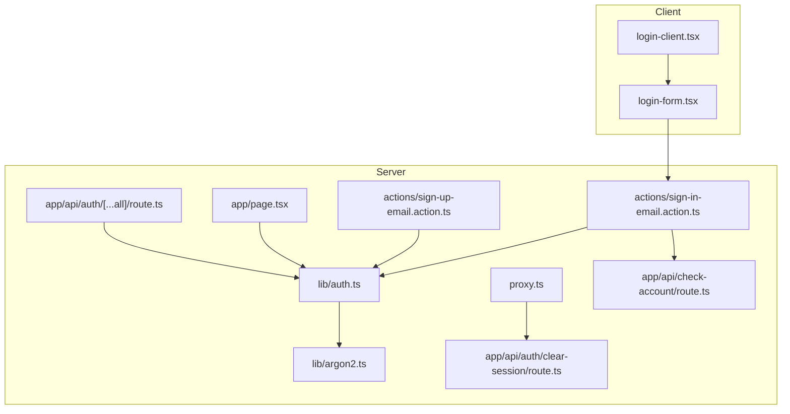
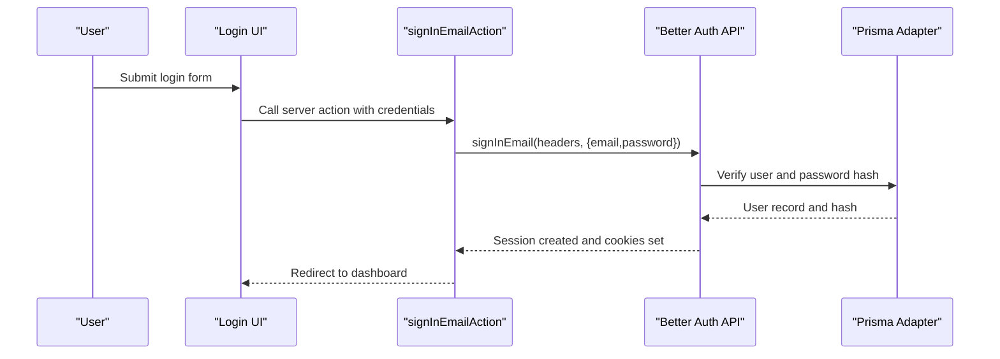
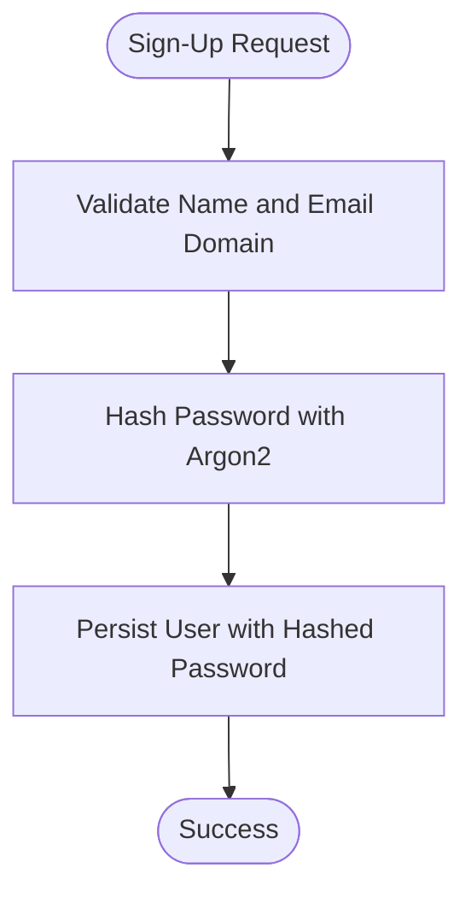
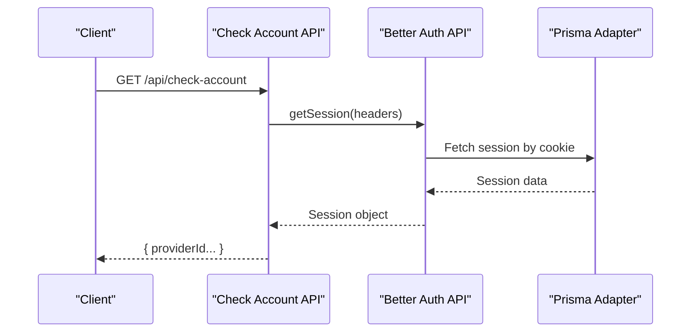
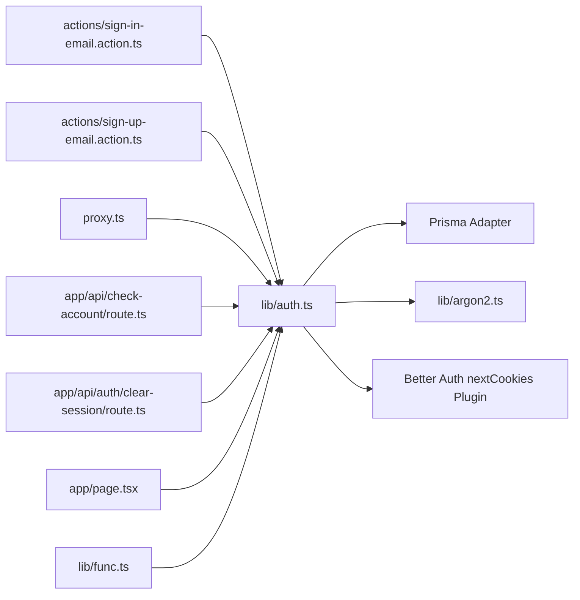

# Session Management & Security

<cite>
**Referenced Files in This Document**
- [auth.ts](file://src/lib/auth.ts)
- [argon2.ts](file://src/lib/argon2.ts)
- [sign-in-email.action.ts](file://src/actions/sign-in-email.action.ts)
- [sign-up-email.action.ts](file://src/actions/sign-up-email.action.ts)
- [login-form.tsx](file://src/components/login-form.tsx)
- [login-client.tsx](file://src/app/auth/login/login-client.tsx)
- [proxy.ts](file://src/proxy.ts)
- [route.ts](file://src/app/api/auth/[...all]/route.ts)
- [route.ts](file://src/app/api/check-account/route.ts)
- [route.ts](file://src/app/api/auth/clear-session/route.ts)
- [route.ts](file://src/app/page.tsx)
- [func.ts](file://src/lib/func.ts)
</cite>

## Table of Contents
1. [Introduction](#introduction)
2. [Project Structure](#project-structure)
3. [Core Components](#core-components)
4. [Architecture Overview](#architecture-overview)
5. [Detailed Component Analysis](#detailed-component-analysis)
6. [Dependency Analysis](#dependency-analysis)
7. [Performance Considerations](#performance-considerations)
8. [Troubleshooting Guide](#troubleshooting-guide)
9. [Conclusion](#conclusion)

## Introduction
This document explains the session management and security features of the application. It covers:
- Session lifecycle with 30-day expiration and automatic cleanup
- Secure cookie handling via Better Auth
- Password security using Argon2 hashing with minimum length enforcement
- Session validation, renewal mechanisms, and logout procedures
- Security measures such as CSRF protection, session fixation prevention, and secure cookie attributes
- Examples of client-side session handling, server-side session validation, and error handling for authentication failures

## Project Structure
The authentication and session management system is built around Better Auth with Prisma adapter and Next.js integration. Key areas:
- Authentication configuration and password hashing
- Action handlers for sign-in and sign-up
- Client components for login
- Middleware-like proxy for route protection
- API routes for session validation and logout
- Utility functions for domain validation and normalization

**Diagram sources**
- [login-form.tsx:1-118](file://src/components/login-form.tsx#L1-L118)
- [login-client.tsx:1-85](file://src/app/auth/login/login-client.tsx#L1-L85)
- [sign-in-email.action.ts:1-86](file://src/actions/sign-in-email.action.ts#L1-L86)
- [sign-up-email.action.ts:1-85](file://src/actions/sign-up-email.action.ts#L1-L85)
- [auth.ts:1-95](file://src/lib/auth.ts#L1-L95)
- [argon2.ts:1-21](file://src/lib/argon2.ts#L1-L21)
- [proxy.ts:1-71](file://src/proxy.ts#L1-L71)
- [route.ts:file://src/app/api/auth/[...all]/route.ts:1-4](file://src/app/api/auth/[...all]/route.ts#L1-L4)
- [route.ts:file://src/app/api/check-account/route.ts:1-41](file://src/app/api/check-account/route.ts#L1-L41)
- [route.ts:file://src/app/api/auth/clear-session/route.ts:1-11](file://src/app/api/auth/clear-session/route.ts#L1-L11)
- [page.tsx:file://src/app/page.tsx:1-15](file://src/app/page.tsx#L1-L15)

**Section sources**
- [auth.ts:1-95](file://src/lib/auth.ts#L1-L95)
- [proxy.ts:1-71](file://src/proxy.ts#L1-L71)
- [route.ts:file://src/app/api/auth/[...all]/route.ts:1-4](file://src/app/api/auth/[...all]/route.ts#L1-L4)
- [route.ts:file://src/app/api/check-account/route.ts:1-41](file://src/app/api/check-account/route.ts#L1-L41)
- [route.ts:file://src/app/api/auth/clear-session/route.ts:1-11](file://src/app/api/auth/clear-session/route.ts#L1-L11)
- [page.tsx:file://src/app/page.tsx:1-15](file://src/app/page.tsx#L1-L15)

## Core Components
- Authentication configuration: Better Auth with Prisma adapter, session expiration, email/password policy, and plugins.
- Password security: Argon2 hashing and verification with tuned parameters and minimum length.
- Client-side login: Form validation and submission to server actions.
- Server actions: Sign-in and sign-up with Better Auth API and error mapping.
- Route protection: Proxy checks for session cookie presence and redirects accordingly.
- Session validation and logout: API endpoints for checking session and clearing session cookie.

**Section sources**
- [auth.ts:20-92](file://src/lib/auth.ts#L20-L92)
- [argon2.ts:1-21](file://src/lib/argon2.ts#L1-L21)
- [sign-in-email.action.ts:13-85](file://src/actions/sign-in-email.action.ts#L13-L85)
- [sign-up-email.action.ts:12-84](file://src/actions/sign-up-email.action.ts#L12-L84)
- [proxy.ts:19-56](file://src/proxy.ts#L19-L56)
- [route.ts:file://src/app/api/check-account/route.ts:6-40](file://src/app/api/check-account/route.ts#L6-L40)
- [route.ts:file://src/app/api/auth/clear-session/route.ts:4-10](file://src/app/api/auth/clear-session/route.ts#L4-L10)

## Architecture Overview
The system integrates Better Auth for authentication and session management. Sessions are stored in cookies and validated on each request. Passwords are hashed using Argon2. Domain restrictions and name normalization are enforced during sign-up. Route protection is handled by a middleware-like proxy.

**Diagram sources**
- [login-form.tsx:28-41](file://src/components/login-form.tsx#L28-L41)
- [sign-in-email.action.ts:35-41](file://src/actions/sign-in-email.action.ts#L35-L41)
- [route.ts:file://src/app/api/auth/[...all]/route.ts:1-4](file://src/app/api/auth/[...all]/route.ts#L1-L4)
- [auth.ts:66-77](file://src/lib/auth.ts#L66-L77)

## Detailed Component Analysis

### Session Lifecycle and Expiration
- Session expiration: Configured to 30 days.
- Automatic cleanup: Better Auth manages session records and cookie lifecycle; expired sessions are invalidated server-side.
- Cookie handling: Next.js cookies plugin is enabled via Better Auth plugins.

Implementation highlights:
- Session expiration window configured in authentication settings.
- API handler exposes Better Auth endpoints for session creation and validation.

**Section sources**
- [auth.ts:66-68](file://src/lib/auth.ts#L66-L68)
- [route.ts:file://src/app/api/auth/[...all]/route.ts:1-4](file://src/app/api/auth/[...all]/route.ts#L1-L4)

### Secure Cookie Handling
- Cookies are managed by Better Auth’s Next.js cookies plugin.
- Domain and path policies are applied by Better Auth; the proxy enforces route-level protection.
- Logout clears the session cookie.

**Section sources**
- [auth.ts:78-80](file://src/lib/auth.ts#L78-L80)
- [route.ts:file://src/app/api/auth/clear-session/route.ts:5-6](file://src/app/api/auth/clear-session/route.ts#L5-L6)
- [proxy.ts:32-32](file://src/proxy.ts#L32-L32)

### Password Security with Argon2
- Hashing and verification use Argon2 with tuned parameters.
- Minimum password length enforced by Better Auth email/password policy.
- Hooks normalize user name and restrict sign-up domains.

**Diagram sources**
- [auth.ts:24-47](file://src/lib/auth.ts#L24-L47)
- [auth.ts:69-77](file://src/lib/auth.ts#L69-L77)
- [argon2.ts:10-20](file://src/lib/argon2.ts#L10-L20)
- [func.ts:11-19](file://src/lib/func.ts#L11-L19)

**Section sources**
- [auth.ts:24-47](file://src/lib/auth.ts#L24-L47)
- [auth.ts:69-77](file://src/lib/auth.ts#L69-L77)
- [argon2.ts:1-21](file://src/lib/argon2.ts#L1-L21)
- [func.ts:11-19](file://src/lib/func.ts#L11-L19)

### Session Validation and Renewal
- Session validation endpoint retrieves session info using Better Auth API.
- The proxy performs optimistic checks for session cookie presence and redirects unauthenticated users to login.
- Dashboard/home pages redirect authenticated users to dashboard and unauthenticated users to login.

**Diagram sources**
- [route.ts:file://src/app/api/check-account/route.ts:6-31](file://src/app/api/check-account/route.ts#L6-L31)
- [page.tsx:file://src/app/page.tsx:5-14](file://src/app/page.tsx#L5-L14)
- [proxy.ts:31-32](file://src/proxy.ts#L31-L32)

**Section sources**
- [route.ts:file://src/app/api/check-account/route.ts:6-40](file://src/app/api/check-account/route.ts#L6-L40)
- [page.tsx:file://src/app/page.tsx:5-14](file://src/app/page.tsx#L5-L14)
- [proxy.ts:31-32](file://src/proxy.ts#L31-L32)

### Logout Procedures
- Logout endpoint deletes the session cookie and redirects to login with an unauthorized flag.
- Client-side navigation to logout triggers this endpoint.

**Section sources**
- [route.ts:file://src/app/api/auth/clear-session/route.ts:4-10](file://src/app/api/auth/clear-session/route.ts#L4-L10)

### Client-Side Session Handling
- Login form validates input and submits to server action.
- On success, navigates to dashboard; otherwise displays field-specific or global errors.

**Section sources**
- [login-form.tsx:28-41](file://src/components/login-form.tsx#L28-L41)
- [login-client.tsx:16-84](file://src/app/auth/login/login-client.tsx#L16-L84)

### Server-Side Session Validation
- API route uses Better Auth API to validate session and fetch user account providers.
- Handles unauthorized and internal server errors gracefully.

**Section sources**
- [route.ts:file://src/app/api/check-account/route.ts:6-40](file://src/app/api/check-account/route.ts#L6-L40)

### Error Handling for Authentication Failures
- Sign-in action maps Better Auth API errors to user-friendly messages (invalid credentials, invalid email, rate limit).
- Sign-up action handles domain restrictions, weak passwords, and duplicate accounts.
- General catch-all returns server error messages.

**Section sources**
- [sign-in-email.action.ts:44-84](file://src/actions/sign-in-email.action.ts#L44-L84)
- [sign-up-email.action.ts:31-83](file://src/actions/sign-up-email.action.ts#L31-L83)

## Dependency Analysis

**Diagram sources**
- [auth.ts:1-95](file://src/lib/auth.ts#L1-L95)
- [argon2.ts:1-21](file://src/lib/argon2.ts#L1-L21)
- [sign-in-email.action.ts:3-5](file://src/actions/sign-in-email.action.ts#L3-L5)
- [sign-up-email.action.ts:3-4](file://src/actions/sign-up-email.action.ts#L3-L4)
- [proxy.ts:19-56](file://src/proxy.ts#L19-L56)
- [route.ts:file://src/app/api/check-account/route.ts:1-41](file://src/app/api/check-account/route.ts#L1-L41)
- [route.ts:file://src/app/api/auth/clear-session/route.ts:1-11](file://src/app/api/auth/clear-session/route.ts#L1-L11)
- [page.tsx:file://src/app/page.tsx:1-15](file://src/app/page.tsx#L1-L15)
- [func.ts:11-19](file://src/lib/func.ts#L11-L19)

**Section sources**
- [auth.ts:1-95](file://src/lib/auth.ts#L1-L95)
- [sign-in-email.action.ts:3-5](file://src/actions/sign-in-email.action.ts#L3-L5)
- [sign-up-email.action.ts:3-4](file://src/actions/sign-up-email.action.ts#L3-L4)
- [proxy.ts:19-56](file://src/proxy.ts#L19-L56)
- [route.ts:file://src/app/api/check-account/route.ts:1-41](file://src/app/api/check-account/route.ts#L1-L41)
- [route.ts:file://src/app/api/auth/clear-session/route.ts:1-11](file://src/app/api/auth/clear-session/route.ts#L1-L11)
- [page.tsx:file://src/app/page.tsx:1-15](file://src/app/page.tsx#L1-L15)
- [func.ts:11-19](file://src/lib/func.ts#L11-L19)

## Performance Considerations
- Argon2 parameters are tuned for balanced security and performance; adjust time/memory costs according to deployment capacity.
- Session validation occurs on demand; cache or memoize session checks at the edge if needed.
- Keep static asset and API routes excluded from middleware to minimize overhead.

## Troubleshooting Guide
Common issues and resolutions:
- Unauthorized access to protected routes: Ensure session cookie is present; the proxy redirects to login with an unauthorized flag.
- Login failures due to invalid credentials: The sign-in action maps API errors to user-friendly messages.
- Domain restriction errors on sign-up: Only allowed domains are accepted; development adds example.com for testing.
- Rate limiting: Better Auth applies rate limits; retry after cooldown.

**Section sources**
- [proxy.ts:44-54](file://src/proxy.ts#L44-L54)
- [sign-in-email.action.ts:48-80](file://src/actions/sign-in-email.action.ts#L48-L80)
- [sign-up-email.action.ts:35-79](file://src/actions/sign-up-email.action.ts#L35-L79)
- [func.ts:11-19](file://src/lib/func.ts#L11-L19)

## Conclusion
The application employs Better Auth for robust session management with 30-day expiration, secure cookie handling, and strong password hashing via Argon2. Route protection, session validation, and logout procedures are implemented consistently across client and server components. Additional security measures such as CSRF protection, session fixation prevention, and secure cookie attributes are provided by Better Auth and the Next.js cookies plugin.