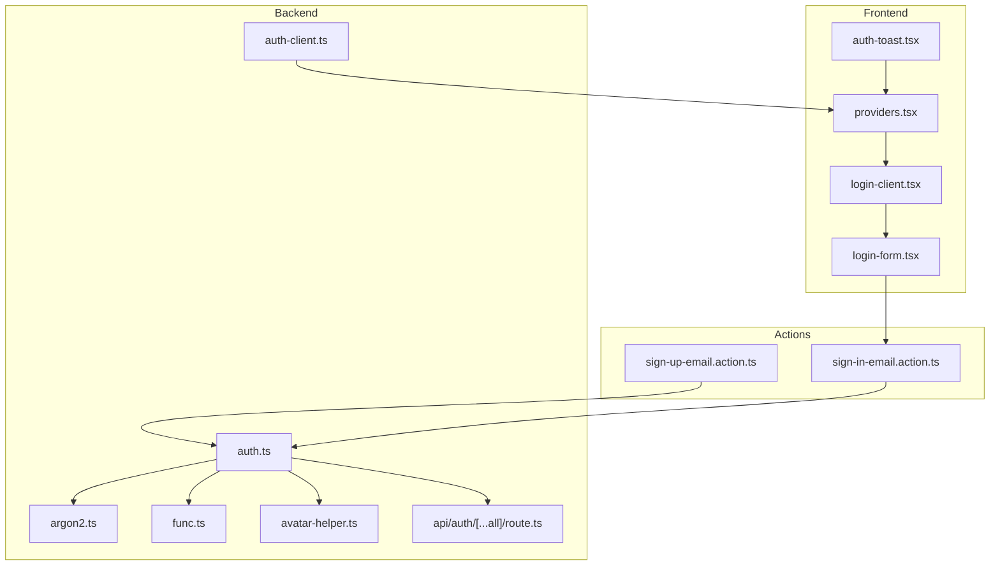
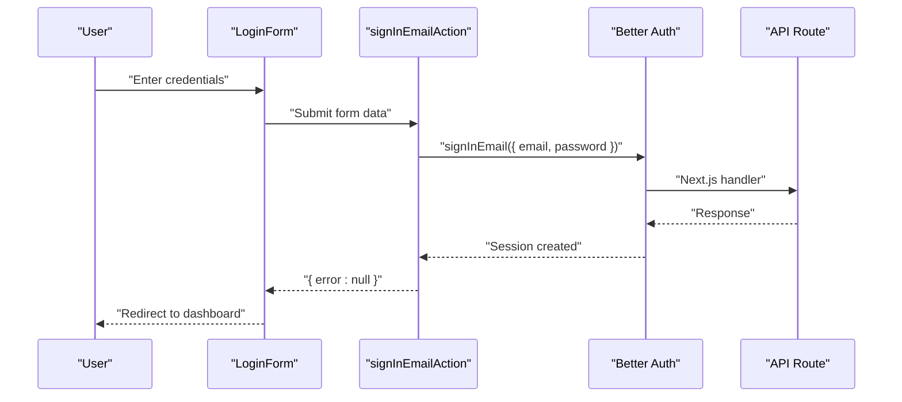
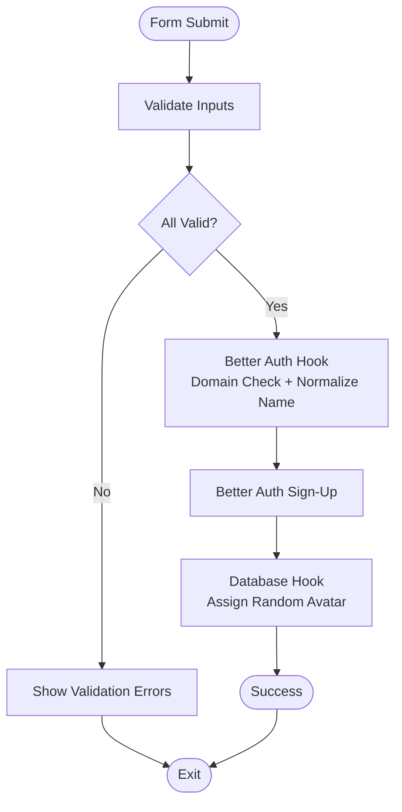
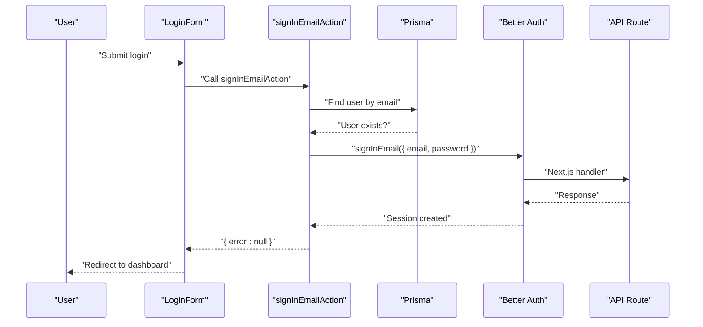
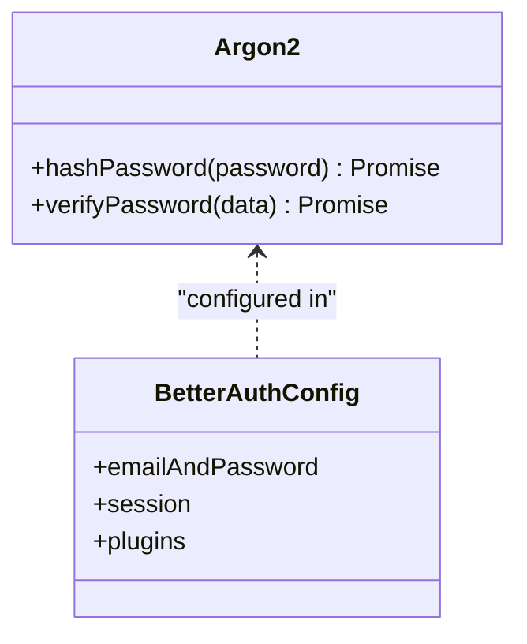
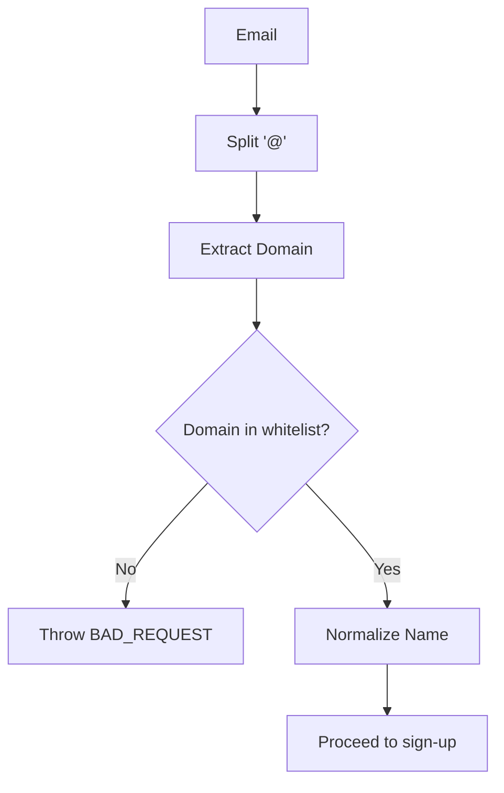
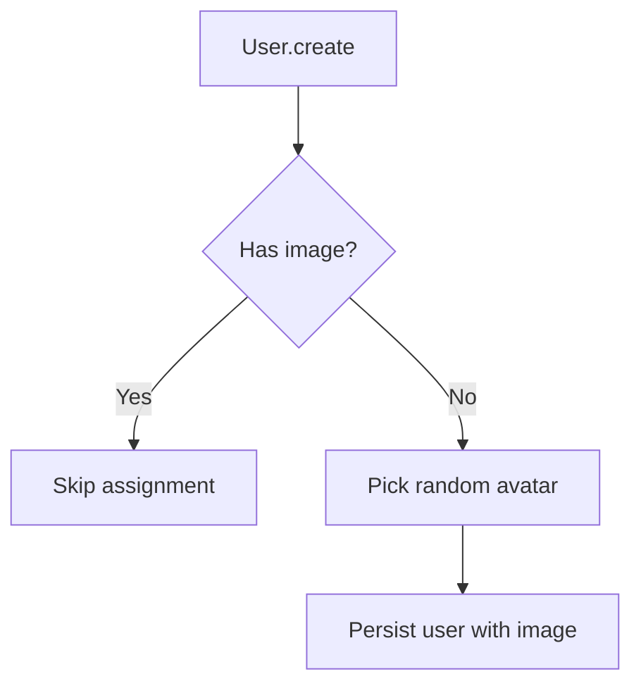
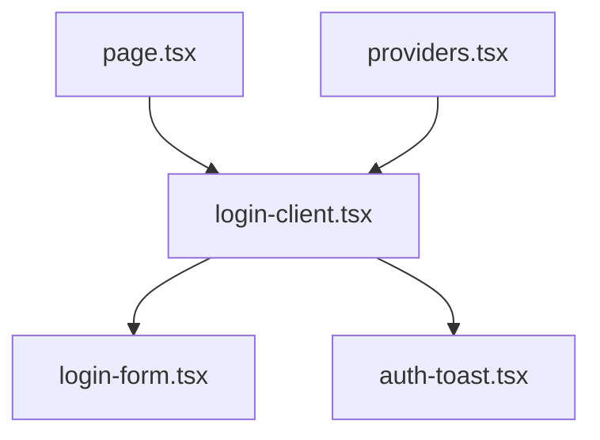
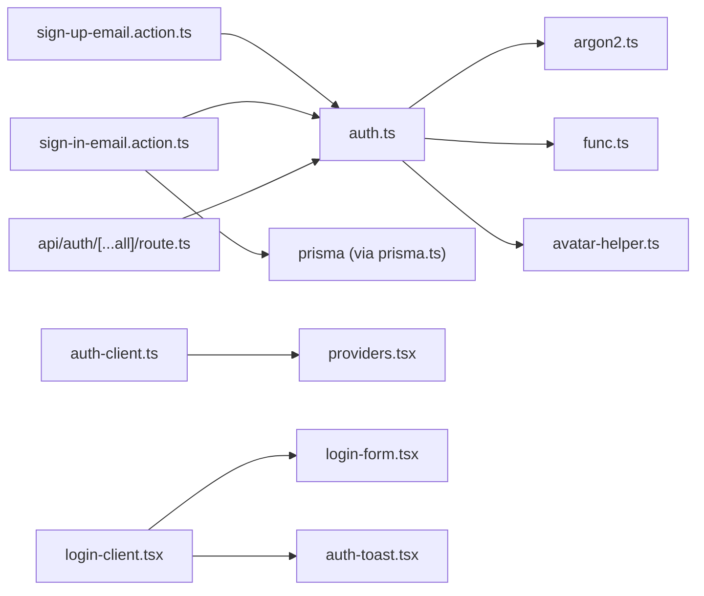

# User Registration & Login Process

<cite>
**Referenced Files in This Document**
- [sign-up-email.action.ts](file://src/actions/sign-up-email.action.ts)
- [sign-in-email.action.ts](file://src/actions/sign-in-email.action.ts)
- [auth.ts](file://src/lib/auth.ts)
- [func.ts](file://src/lib/func.ts)
- [avatar-helper.ts](file://src/lib/avatar-helper.ts)
- [argon2.ts](file://src/lib/argon2.ts)
- [auth-client.ts](file://src/lib/auth-client.ts)
- [login-form.tsx](file://src/components/login-form.tsx)
- [login-client.tsx](file://src/app/auth/login/login-client.tsx)
- [page.tsx](file://src/app/auth/login/page.tsx)
- [route.ts](file://src/app/api/auth/[...all]/route.ts)
- [auth-toast.tsx](file://src/components/auth-toast.tsx)
- [providers.tsx](file://src/app/providers.tsx)
</cite>

## Table of Contents
1. [Introduction](#introduction)
2. [Project Structure](#project-structure)
3. [Core Components](#core-components)
4. [Architecture Overview](#architecture-overview)
5. [Detailed Component Analysis](#detailed-component-analysis)
6. [Dependency Analysis](#dependency-analysis)
7. [Performance Considerations](#performance-considerations)
8. [Troubleshooting Guide](#troubleshooting-guide)
9. [Conclusion](#conclusion)

## Introduction
This document explains the user registration and login workflows powered by Better Auth and integrated with the frontend. It covers:
- Email-based authentication lifecycle
- Domain validation during registration
- Automatic avatar assignment for new users
- Normalized name formatting
- Login flow, password verification, and session creation
- Registration validation rules and error handling
- Frontend integration patterns and user experience considerations
- Common registration issues, password reset procedures, and account activation workflows

## Project Structure
The authentication system spans backend actions, Better Auth configuration, frontend components, and API routes:
- Actions handle server-side registration and login requests and translate Better Auth errors into user-friendly messages.
- Better Auth manages sessions, password hashing/verification, hooks for domain/name/avatar logic, and plugin-based role administration.
- Frontend components render forms, manage validation, and trigger actions.
- API routes expose Better Auth endpoints to Next.js handlers.

**Diagram sources**
- [login-client.tsx:1-85](file://src/app/auth/login/login-client.tsx#L1-L85)
- [login-form.tsx:1-118](file://src/components/login-form.tsx#L1-L118)
- [auth-toast.tsx:1-48](file://src/components/auth-toast.tsx#L1-L48)
- [providers.tsx:1-14](file://src/app/providers.tsx#L1-L14)
- [sign-up-email.action.ts:1-85](file://src/actions/sign-up-email.action.ts#L1-L85)
- [sign-in-email.action.ts:1-86](file://src/actions/sign-in-email.action.ts#L1-L86)
- [auth.ts:1-95](file://src/lib/auth.ts#L1-L95)
- [auth-client.ts:1-27](file://src/lib/auth-client.ts#L1-L27)
- [argon2.ts:1-21](file://src/lib/argon2.ts#L1-L21)
- [func.ts:1-70](file://src/lib/func.ts#L1-L70)
- [avatar-helper.ts:1-27](file://src/lib/avatar-helper.ts#L1-L27)
- [route.ts:1-4](file://src/app/api/auth/[...all]/route.ts#L1-L4)

**Section sources**
- [login-client.tsx:1-85](file://src/app/auth/login/login-client.tsx#L1-L85)
- [login-form.tsx:1-118](file://src/components/login-form.tsx#L1-L118)
- [sign-up-email.action.ts:1-85](file://src/actions/sign-up-email.action.ts#L1-L85)
- [sign-in-email.action.ts:1-86](file://src/actions/sign-in-email.action.ts#L1-L86)
- [auth.ts:1-95](file://src/lib/auth.ts#L1-L95)
- [route.ts:1-4](file://src/app/api/auth/[...all]/route.ts#L1-L4)

## Core Components
- Registration action: Validates inputs, calls Better Auth sign-up, and maps API errors to localized messages.
- Login action: Validates inputs, checks user existence, calls Better Auth sign-in, and maps errors to localized messages.
- Better Auth configuration: Enforces domain validation, normalizes names, assigns random avatars, configures Argon2 hashing, and sets session policies.
- Frontend login form: Uses Zod validation, controlled inputs, and triggers server actions.
- Authentication client: Provides typed client integration for frontend consumption.
- API route: Exposes Better Auth endpoints to Next.js runtime.

Key responsibilities:
- Domain validation prevents unapproved email domains during registration.
- Name normalization ensures consistent capitalization and sanitization.
- Avatar assignment provides a default profile image for new users.
- Password hashing and verification use Argon2 with tuned parameters.
- Session management controls expiration and cookie handling.

**Section sources**
- [sign-up-email.action.ts:12-85](file://src/actions/sign-up-email.action.ts#L12-L85)
- [sign-in-email.action.ts:13-86](file://src/actions/sign-in-email.action.ts#L13-L86)
- [auth.ts:20-95](file://src/lib/auth.ts#L20-L95)
- [login-form.tsx:12-118](file://src/components/login-form.tsx#L12-L118)
- [auth-client.ts:12-27](file://src/lib/auth-client.ts#L12-L27)
- [route.ts:1-4](file://src/app/api/auth/[...all]/route.ts#L1-L4)

## Architecture Overview
The system integrates frontend components with server actions and Better Auth endpoints. On successful authentication, Better Auth creates a session and sets cookies handled by the nextCookies plugin.

**Diagram sources**
- [login-form.tsx:28-41](file://src/components/login-form.tsx#L28-L41)
- [sign-in-email.action.ts:35-41](file://src/actions/sign-in-email.action.ts#L35-L41)
- [auth.ts:66-77](file://src/lib/auth.ts#L66-L77)
- [route.ts:1-4](file://src/app/api/auth/[...all]/route.ts#L1-L4)

## Detailed Component Analysis

### Registration Workflow
- Input validation occurs in the registration action for name, email, and password.
- Better Auth hook enforces domain validation and normalizes the name before persisting.
- Upon successful sign-up, Better Auth persists the user and invokes database hooks to assign a random avatar if none is present.
- Errors are mapped to localized messages for invalid domain, weak password, invalid email, and duplicate accounts.

**Diagram sources**
- [sign-up-email.action.ts:15-31](file://src/actions/sign-up-email.action.ts#L15-L31)
- [auth.ts:24-47](file://src/lib/auth.ts#L24-L47)
- [auth.ts:50-63](file://src/lib/auth.ts#L50-L63)
- [func.ts:3-9](file://src/lib/func.ts#L3-L9)
- [avatar-helper.ts:1-27](file://src/lib/avatar-helper.ts#L1-L27)

**Section sources**
- [sign-up-email.action.ts:12-85](file://src/actions/sign-up-email.action.ts#L12-L85)
- [auth.ts:24-63](file://src/lib/auth.ts#L24-L63)
- [func.ts:11-19](file://src/lib/func.ts#L11-L19)

### Login Workflow
- The login form validates inputs using Zod and triggers the login action.
- The action checks if the user exists in the database; if not, it returns a user-not-found message.
- Otherwise, it delegates to Better Auth to verify credentials and create a session.
- On success, the form redirects to the dashboard; otherwise, it displays localized errors.

**Diagram sources**
- [login-form.tsx:28-41](file://src/components/login-form.tsx#L28-L41)
- [sign-in-email.action.ts:20-43](file://src/actions/sign-in-email.action.ts#L20-L43)
- [auth.ts:66-77](file://src/lib/auth.ts#L66-L77)
- [route.ts:1-4](file://src/app/api/auth/[...all]/route.ts#L1-L4)

**Section sources**
- [login-form.tsx:12-118](file://src/components/login-form.tsx#L12-L118)
- [sign-in-email.action.ts:13-86](file://src/actions/sign-in-email.action.ts#L13-L86)

### Password Verification and Session Creation
- Password hashing and verification are implemented with Argon2, configured in Better Auth.
- On successful credential verification, Better Auth creates a session with an expiration policy and sets cookies via the nextCookies plugin.
- The frontend consumes the client SDK to integrate with the session state.

**Diagram sources**
- [argon2.ts:10-20](file://src/lib/argon2.ts#L10-L20)
- [auth.ts:66-77](file://src/lib/auth.ts#L66-L77)
- [auth.ts:66-68](file://src/lib/auth.ts#L66-L68)
- [auth.ts:78-91](file://src/lib/auth.ts#L78-L91)

**Section sources**
- [argon2.ts:1-21](file://src/lib/argon2.ts#L1-L21)
- [auth.ts:66-77](file://src/lib/auth.ts#L66-L77)

### Domain Validation and Name Normalization
- Domain validation is enforced in a Better Auth before-hook that inspects the email domain against a whitelist.
- Name normalization trims, sanitizes, and capitalizes words consistently.
- During development, an additional domain is permitted for testing.

**Diagram sources**
- [auth.ts:26-34](file://src/lib/auth.ts#L26-L34)
- [func.ts:11-19](file://src/lib/func.ts#L11-L19)
- [func.ts:3-9](file://src/lib/func.ts#L3-L9)

**Section sources**
- [auth.ts:24-47](file://src/lib/auth.ts#L24-L47)
- [func.ts:11-19](file://src/lib/func.ts#L11-L19)

### Automatic Avatar Assignment
- A database hook runs before user creation to assign a random avatar if none is provided.
- Avatars are selected from predefined lists for male and female identities.

**Diagram sources**
- [auth.ts:52-62](file://src/lib/auth.ts#L52-L62)
- [avatar-helper.ts:1-27](file://src/lib/avatar-helper.ts#L1-L27)

**Section sources**
- [auth.ts:50-63](file://src/lib/auth.ts#L50-L63)
- [avatar-helper.ts:1-27](file://src/lib/avatar-helper.ts#L1-L27)

### Frontend Integration and User Experience
- The login page renders a client component that hosts the login form and toast notifications.
- The form uses Zod validation, controlled inputs, and submits to a server action.
- Toasts inform users about unauthorized access attempts and login failures.
- Providers wrap the app to enable UI components and toast behavior.

**Diagram sources**
- [page.tsx:15-19](file://src/app/auth/login/page.tsx#L15-L19)
- [login-client.tsx:16-84](file://src/app/auth/login/login-client.tsx#L16-L84)
- [login-form.tsx:12-118](file://src/components/login-form.tsx#L12-L118)
- [auth-toast.tsx:7-47](file://src/components/auth-toast.tsx#L7-L47)
- [providers.tsx:6-13](file://src/app/providers.tsx#L6-L13)

**Section sources**
- [page.tsx:1-20](file://src/app/auth/login/page.tsx#L1-L20)
- [login-client.tsx:1-85](file://src/app/auth/login/login-client.tsx#L1-L85)
- [login-form.tsx:1-118](file://src/components/login-form.tsx#L1-L118)
- [auth-toast.tsx:1-48](file://src/components/auth-toast.tsx#L1-L48)
- [providers.tsx:1-14](file://src/app/providers.tsx#L1-L14)

## Dependency Analysis
- Actions depend on Better Auth for authentication operations and Prisma for pre-login user existence checks.
- Better Auth depends on Prisma adapter, Argon2 for hashing, nextCookies for session cookies, and custom hooks for domain/name/avatar logic.
- Frontend components depend on the Better Auth client SDK and UI libraries for rendering and UX.

**Diagram sources**
- [sign-up-email.action.ts:3](file://src/actions/sign-up-email.action.ts#L3)
- [sign-in-email.action.ts:4](file://src/actions/sign-in-email.action.ts#L4)
- [auth.ts:1-10](file://src/lib/auth.ts#L1-L10)
- [argon2.ts:1](file://src/lib/argon2.ts#L1)
- [func.ts:6](file://src/lib/func.ts#L6)
- [avatar-helper.ts:9](file://src/lib/avatar-helper.ts#L9)
- [auth-client.ts:1](file://src/lib/auth-client.ts#L1)
- [login-client.tsx:4-5](file://src/app/auth/login/login-client.tsx#L4-L5)
- [login-form.tsx:8](file://src/components/login-form.tsx#L8)
- [auth-toast.tsx:3-4](file://src/components/auth-toast.tsx#L3-L4)
- [route.ts:1](file://src/app/api/auth/[...all]/route.ts#L1)

**Section sources**
- [sign-up-email.action.ts:1-85](file://src/actions/sign-up-email.action.ts#L1-L85)
- [sign-in-email.action.ts:1-86](file://src/actions/sign-in-email.action.ts#L1-L86)
- [auth.ts:1-95](file://src/lib/auth.ts#L1-L95)
- [login-client.tsx:1-85](file://src/app/auth/login/login-client.tsx#L1-L85)
- [login-form.tsx:1-118](file://src/components/login-form.tsx#L1-L118)
- [auth-client.ts:1-27](file://src/lib/auth-client.ts#L1-L27)
- [route.ts:1-4](file://src/app/api/auth/[...all]/route.ts#L1-L4)

## Performance Considerations
- Prefer client-side Zod validation to reduce unnecessary server calls.
- Keep domain whitelist concise to minimize lookup overhead.
- Use Argon2 parameters appropriate for deployment load; tune memory/time costs carefully.
- Avoid excessive re-renders by controlling form submission states and disabling inputs during submit.
- Cache frequently accessed app settings (e.g., company name/logo) to reduce database queries on login pages.

## Troubleshooting Guide
Common registration issues:
- Invalid domain: Ensure the email domain matches the allowed list; development adds an extra domain for testing.
- Weak password: Enforce minimum length and complexity; Better Auth enforces a minimum password length.
- Duplicate email: Handle user-facing messaging to prompt login or use another email.
- Invalid email format: Validate format early and show clear messages.

Login issues:
- Nonexistent email: Prompt users to register first.
- Incorrect password: Provide targeted feedback and avoid exposing account existence.
- Too many requests: Implement rate limiting and communicate cooldown periods.

Frontend UX:
- Use toast notifications to guide users after unauthorized or failed attempts.
- Disable form inputs during submission to prevent duplicate submissions.
- Redirect to dashboard on success; preserve navigation context.

Password reset and account activation:
- Password reset: Integrate Better Auth’s built-in password reset flow via the client SDK and API endpoints.
- Account activation: Enable Better Auth’s email verification plugin to require email confirmation before login access.

**Section sources**
- [sign-up-email.action.ts:35-79](file://src/actions/sign-up-email.action.ts#L35-L79)
- [sign-in-email.action.ts:48-84](file://src/actions/sign-in-email.action.ts#L48-L84)
- [auth.ts:66-77](file://src/lib/auth.ts#L66-L77)
- [auth.ts:26-34](file://src/lib/auth.ts#L26-L34)
- [auth-toast.tsx:12-44](file://src/components/auth-toast.tsx#L12-L44)

## Conclusion
The authentication system combines robust server-side validation and session management with a responsive frontend. Domain validation, name normalization, and automatic avatar assignment improve data quality and user experience. Better Auth’s hooks and plugins streamline secure, scalable authentication, while frontend components deliver clear feedback and smooth interactions.