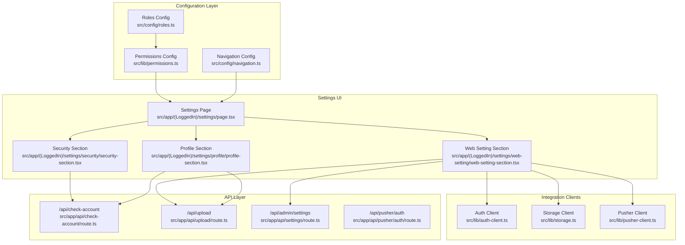
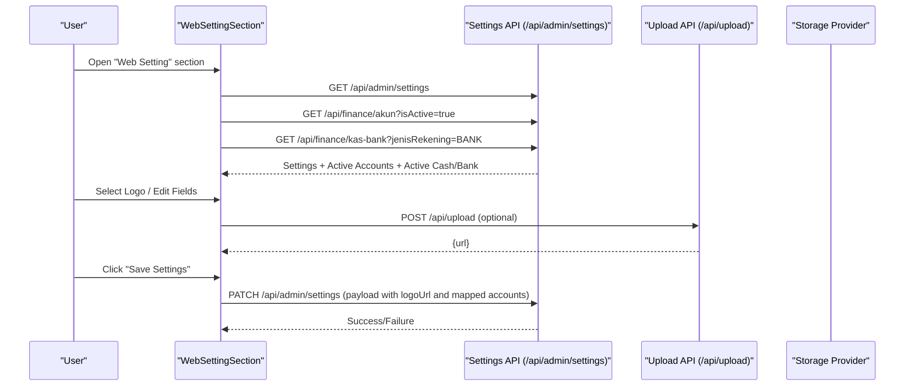
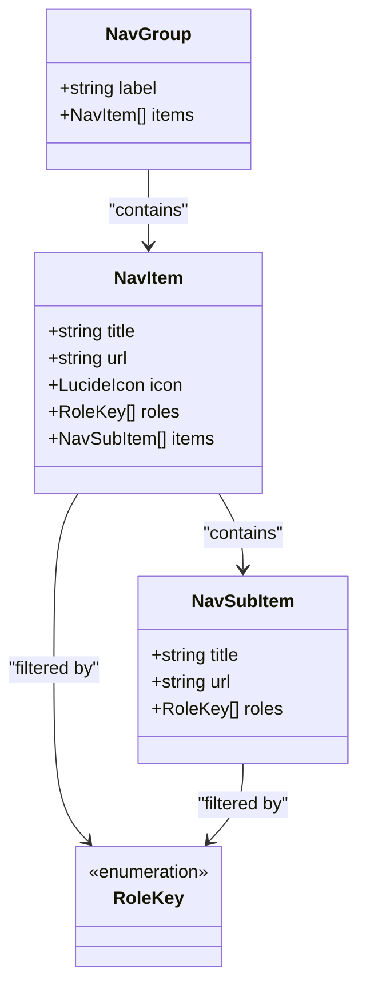
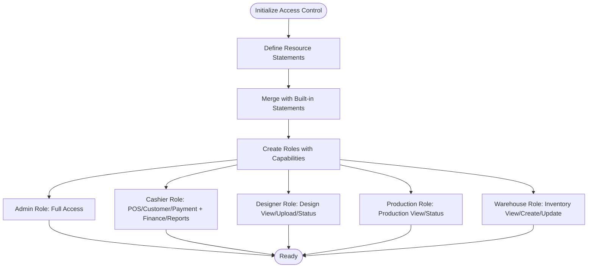
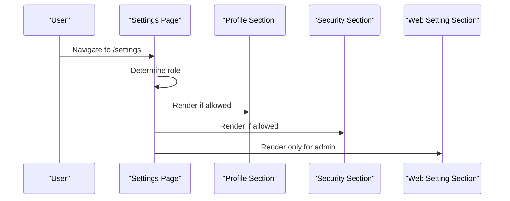
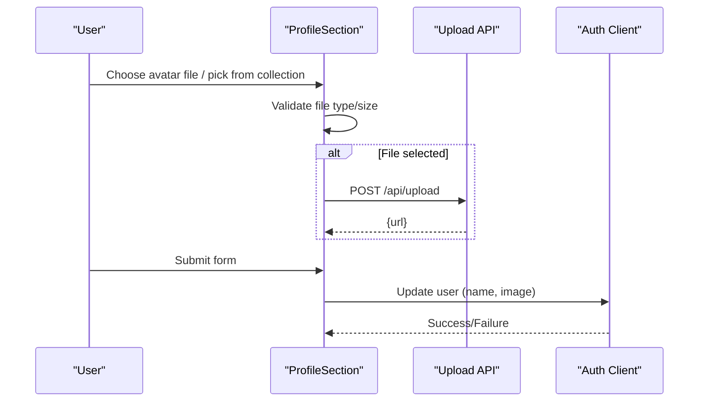
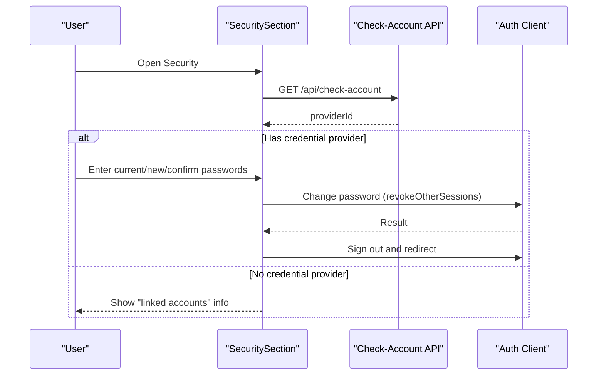
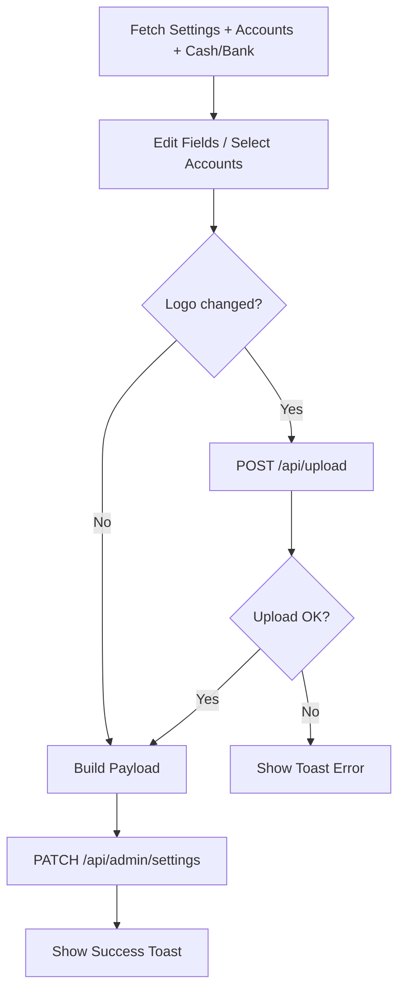
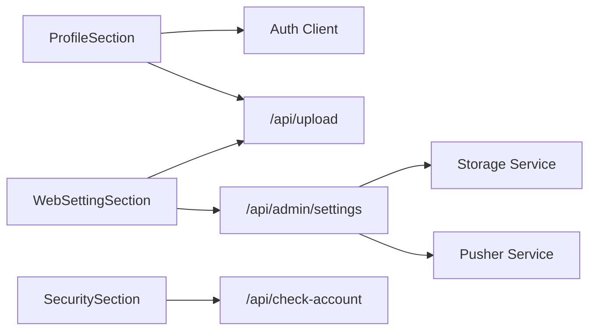

# Configuration & Settings

<cite>
**Referenced Files in This Document**
- [navigation.ts](file://src/config/navigation.ts)
- [roles.ts](file://src/config/roles.ts)
- [permissions.ts](file://src/lib/permissions.ts)
- [settings page](file://src/app/(LoggedIn)/settings/page.tsx)
- [profile section](file://src/app/(LoggedIn)/settings/profile/profile-section.tsx)
- [security section](file://src/app/(LoggedIn)/settings/security/security-section.tsx)
- [web setting section](file://src/app/(LoggedIn)/settings/web-setting/web-setting-section.tsx)
- [check-account route](file://src/app/api/check-account/route.ts)
- [upload route](file://src/app/api/upload/route.ts)
- [settings route](file://src/app/api/settings/route.ts)
- [pusher auth route](file://src/app/api/pusher/auth/route.ts)
- [auth client](file://src/lib/auth-client.ts)
- [storage client](file://src/lib/storage.ts)
- [pusher client](file://src/lib/pusher-client.ts)
- [next.config.ts](file://next.config.ts)
- [package.json](file://package.json)
</cite>

## Table of Contents
1. [Introduction](#introduction)
2. [Project Structure](#project-structure)
3. [Core Components](#core-components)
4. [Architecture Overview](#architecture-overview)
5. [Detailed Component Analysis](#detailed-component-analysis)
6. [Dependency Analysis](#dependency-analysis)
7. [Performance Considerations](#performance-considerations)
8. [Troubleshooting Guide](#troubleshooting-guide)
9. [Conclusion](#conclusion)
10. [Appendices](#appendices)

## Introduction
This document explains the centralized configuration and settings management system for the Point of Sale application. It covers:
- Centralized navigation and role-based access configuration
- Application settings for company identity, transactions, production, and financial mapping
- Environment variable management and deployment configuration
- Settings API endpoints and validation mechanisms
- Integration with external services (storage, real-time events, authentication)
- Practical examples and troubleshooting guidance

## Project Structure
The configuration system is organized around three pillars:
- Centralized role and permission definitions
- Navigation configuration with role gating
- Settings UI and API endpoints for application-wide preferences

**Diagram sources**
- [navigation.ts:1-217](file://src/config/navigation.ts#L1-L217)
- [roles.ts:1-18](file://src/config/roles.ts#L1-L18)
- [permissions.ts:1-67](file://src/lib/permissions.ts#L1-L67)
- [settings page](file://src/app/(LoggedIn)/settings/page.tsx#L1-L114)
- [profile section](file://src/app/(LoggedIn)/settings/profile/profile-section.tsx#L1-L297)
- [security section](file://src/app/(LoggedIn)/settings/security/security-section.tsx#L1-L294)
- [web setting section](file://src/app/(LoggedIn)/settings/web-setting/web-setting-section.tsx#L1-L421)
- [check-account route](file://src/app/api/check-account/route.ts)
- [upload route](file://src/app/api/upload/route.ts)
- [settings route](file://src/app/api/settings/route.ts)
- [pusher auth route](file://src/app/api/pusher/auth/route.ts)
- [auth client](file://src/lib/auth-client.ts)
- [storage client](file://src/lib/storage.ts)
- [pusher client](file://src/lib/pusher-client.ts)

**Section sources**
- [navigation.ts:1-217](file://src/config/navigation.ts#L1-L217)
- [roles.ts:1-18](file://src/config/roles.ts#L1-L18)
- [permissions.ts:1-67](file://src/lib/permissions.ts#L1-L67)
- [settings page](file://src/app/(LoggedIn)/settings/page.tsx#L1-L114)

## Core Components
- Centralized roles and permissions define resource-level access for POS, customers, payments, designs, production, inventory, finance, reports, and master data.
- Navigation groups and items are typed and gated by roles, ensuring only authorized users see relevant menus.
- Settings UI is split into Profile, Security, and Web Setting sections, each backed by dedicated API endpoints.

Key configuration files:
- Roles and keys: [roles.ts:1-18](file://src/config/roles.ts#L1-L18)
- Access control statements and role grants: [permissions.ts:1-67](file://src/lib/permissions.ts#L1-L67)
- Navigation tree with icons, URLs, and role filters: [navigation.ts:1-217](file://src/config/navigation.ts#L1-L217)
- Settings page composition and role-aware visibility: [settings page](file://src/app/(LoggedIn)/settings/page.tsx#L1-L114)

**Section sources**
- [roles.ts:1-18](file://src/config/roles.ts#L1-L18)
- [permissions.ts:1-67](file://src/lib/permissions.ts#L1-L67)
- [navigation.ts:1-217](file://src/config/navigation.ts#L1-L217)
- [settings page](file://src/app/(LoggedIn)/settings/page.tsx#L1-L114)

## Architecture Overview
The settings subsystem integrates UI, API, and external service clients. The Web Setting section orchestrates:
- Fetching current settings and related resources
- Uploading images to storage
- Patching settings via the admin settings endpoint
- Mapping financial accounts and invoice bank accounts

**Diagram sources**
- [web setting section](file://src/app/(LoggedIn)/settings/web-setting/web-setting-section.tsx#L30-L129)
- [settings route](file://src/app/api/settings/route.ts)
- [upload route](file://src/app/api/upload/route.ts)

## Detailed Component Analysis

### Centralized Role-Based Navigation
The navigation configuration defines:
- Groups (Main Menu, Finance, Others)
- Items with optional icons, URLs, and role arrays
- Subitems for nested navigation
- Role gating ensures only authorized roles can access specific sections

**Diagram sources**
- [navigation.ts:16-33](file://src/config/navigation.ts#L16-L33)

Practical implications:
- Adding a new role requires updates in both roles configuration and navigation items.
- Icons and labels are centralized for consistent UX.

**Section sources**
- [navigation.ts:35-217](file://src/config/navigation.ts#L35-L217)
- [roles.ts:5-11](file://src/config/roles.ts#L5-L11)

### Permissions and Access Control
Resource-level permissions are defined and merged with built-in statements. Roles are granted explicit capabilities:
- Admin: full access across all resources
- Cashier: POS, customer, payment, finance CRUD, reports view
- Designer: design view/upload/update-status
- Production: production view/update-status
- Warehouse: inventory view/create/update; supplier view only

**Diagram sources**
- [permissions.ts:8-21](file://src/lib/permissions.ts#L8-L21)
- [permissions.ts:26-66](file://src/lib/permissions.ts#L26-L66)

**Section sources**
- [permissions.ts:1-67](file://src/lib/permissions.ts#L1-L67)

### Settings UI Composition
The settings page dynamically renders sections based on the user’s role:
- Profile: update personal info and avatar
- Security: change password and view linked accounts
- Web Setting: company identity, transaction/POS preferences, production preferences, financial mapping, invoice bank accounts

**Diagram sources**
- [settings page](file://src/app/(LoggedIn)/settings/page.tsx#L25-L113)

**Section sources**
- [settings page](file://src/app/(LoggedIn)/settings/page.tsx#L1-L114)

### Profile Settings
Profile updates support:
- Name editing
- Avatar upload with size/type validation
- Avatar selection from a curated set
- Optional avatar upload to storage

**Diagram sources**
- [profile section](file://src/app/(LoggedIn)/settings/profile/profile-section.tsx#L77-L127)
- [upload route](file://src/app/api/upload/route.ts)
- [auth client](file://src/lib/auth-client.ts)

**Section sources**
- [profile section](file://src/app/(LoggedIn)/settings/profile/profile-section.tsx#L1-L297)

### Security Settings
Security section:
- Detects account provider (credentials vs social)
- Provides password change form with validation
- Revokes other sessions upon password change
- Triggers sign-out and redirects after successful change

**Diagram sources**
- [security section](file://src/app/(LoggedIn)/settings/security/security-section.tsx#L51-L102)
- [check-account route](file://src/app/api/check-account/route.ts)
- [auth client](file://src/lib/auth-client.ts)

**Section sources**
- [security section](file://src/app/(LoggedIn)/settings/security/security-section.tsx#L1-L294)

### Web Setting Configuration
Web Setting manages:
- Company identity (logo upload, name, contact, email, address)
- Transaction/POS preferences (order prefix, receipt footer note)
- Production preferences (SPK prefix, estimated days)
- Financial mapping (default income account)
- Invoice bank account mapping (multiple selection)

**Diagram sources**
- [web setting section](file://src/app/(LoggedIn)/settings/web-setting/web-setting-section.tsx#L30-L129)
- [settings route](file://src/app/api/settings/route.ts)
- [upload route](file://src/app/api/upload/route.ts)

**Section sources**
- [web setting section](file://src/app/(LoggedIn)/settings/web-setting/web-setting-section.tsx#L1-L421)

## Dependency Analysis
- UI depends on:
  - Auth client for session and user updates
  - Storage client for avatar/logo uploads
  - Pusher client for real-time integrations
- Settings API depends on:
  - Prisma-backed persistence for settings and related entities
  - Storage service for media assets
  - Pusher service for event broadcasting

**Diagram sources**
- [profile section](file://src/app/(LoggedIn)/settings/profile/profile-section.tsx#L104-L107)
- [web setting section](file://src/app/(LoggedIn)/settings/web-setting/web-setting-section.tsx#L103-L107)
- [security section](file://src/app/(LoggedIn)/settings/security/security-section.tsx#L19-L21)
- [upload route](file://src/app/api/upload/route.ts)
- [settings route](file://src/app/api/settings/route.ts)
- [check-account route](file://src/app/api/check-account/route.ts)

**Section sources**
- [auth client](file://src/lib/auth-client.ts)
- [storage client](file://src/lib/storage.ts)
- [pusher client](file://src/lib/pusher-client.ts)

## Performance Considerations
- Batch API calls in Web Setting reduce round-trips for initial load.
- Client-side caching of uploaded asset URLs avoids redundant uploads.
- Debounce or throttle frequent updates to avoid excessive API calls.
- Lazy-load heavy components only when their sections are visible.

## Troubleshooting Guide
Common configuration and deployment issues:
- Settings not saving
  - Verify /api/admin/settings PATCH endpoint availability and response.
  - Ensure uploaded logo meets size/format constraints.
  - Confirm invoice bank account IDs are valid and serialized correctly.
- Avatar/logo upload failures
  - Check /api/upload endpoint and storage service connectivity.
  - Validate file size (<5MB) and MIME type.
- Role-based navigation missing items
  - Confirm user role matches expected RoleKey values.
  - Ensure roles.ts and navigation.ts are synchronized.
- Password change errors
  - Validate current password and confirm new password match.
  - Ensure credential provider exists for the account.
- Real-time updates not working
  - Verify Pusher credentials and channel configuration.
  - Confirm /api/pusher/auth endpoint responds with proper signature.

Operational checks:
- Environment variables for storage and Pusher must be present during build and runtime.
- Next.js configuration supports static exports and runtime environment handling.

**Section sources**
- [web setting section](file://src/app/(LoggedIn)/settings/web-setting/web-setting-section.tsx#L79-L95)
- [profile section](file://src/app/(LoggedIn)/settings/profile/profile-section.tsx#L52-L61)
- [security section](file://src/app/(LoggedIn)/settings/security/security-section.tsx#L38-L49)
- [navigation.ts:49-76](file://src/config/navigation.ts#L49-L76)
- [roles.ts:5-11](file://src/config/roles.ts#L5-L11)

## Conclusion
The configuration and settings system provides a centralized, role-aware approach to managing application behavior and user preferences. By consolidating roles, permissions, navigation, and settings APIs, the system ensures consistent access control and streamlined customization across environments.

## Appendices

### Environment Variables and Deployment
- Define environment variables for:
  - Storage service (bucket, region, credentials)
  - Pusher (cluster, key, secret)
  - Authentication (issuer, cookie settings)
- Use environment-specific configuration files or CI/CD secrets for deployment.
- Validate environment variables at startup and provide clear error messages for missing values.

**Section sources**
- [next.config.ts](file://next.config.ts)
- [package.json](file://package.json)

### Settings API Endpoints Summary
- GET /api/check-account
  - Purpose: Detect account provider (credential/social) for conditional UI rendering.
  - Response: providerId array indicating configured providers.
- POST /api/upload
  - Purpose: Upload avatar/logo to storage.
  - Request: multipart/form-data with file and folder.
  - Response: { url } of uploaded asset.
- PATCH /api/admin/settings
  - Purpose: Update company identity, preferences, and mappings.
  - Request: JSON payload including logoUrl, invoiceRekeningIds, and other fields.
  - Response: Updated settings record.
- GET /api/finance/akun?isActive=true
  - Purpose: Fetch active chart of accounts for financial mapping.
- GET /api/finance/kas-bank?jenisRekening=BANK
  - Purpose: Fetch active cash/bank accounts for invoice display.

**Section sources**
- [check-account route](file://src/app/api/check-account/route.ts)
- [upload route](file://src/app/api/upload/route.ts)
- [settings route](file://src/app/api/settings/route.ts)

### External Integrations
- Storage
  - Used for avatar and company logo uploads.
  - Integrated via upload API and storage client.
- Pusher
  - Used for real-time notifications and collaboration features.
  - Auth endpoint generates signed channel tokens.
- Better Auth
  - Provides authentication, session management, and access control plugins.

**Section sources**
- [web setting section](file://src/app/(LoggedIn)/settings/web-setting/web-setting-section.tsx#L84-L95)
- [pusher auth route](file://src/app/api/pusher/auth/route.ts)
- [permissions.ts:1-21](file://src/lib/permissions.ts#L1-L21)