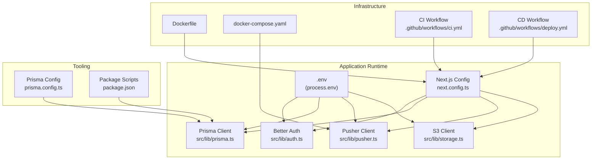
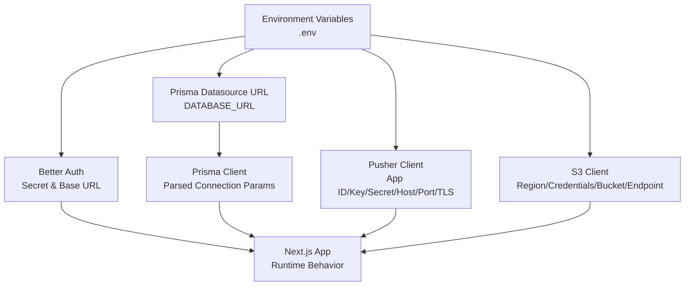
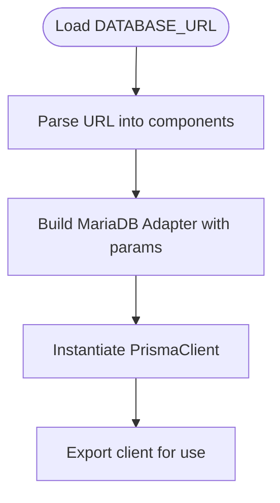
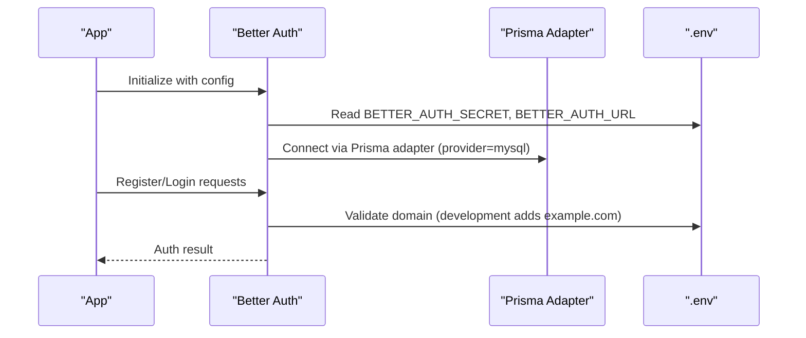
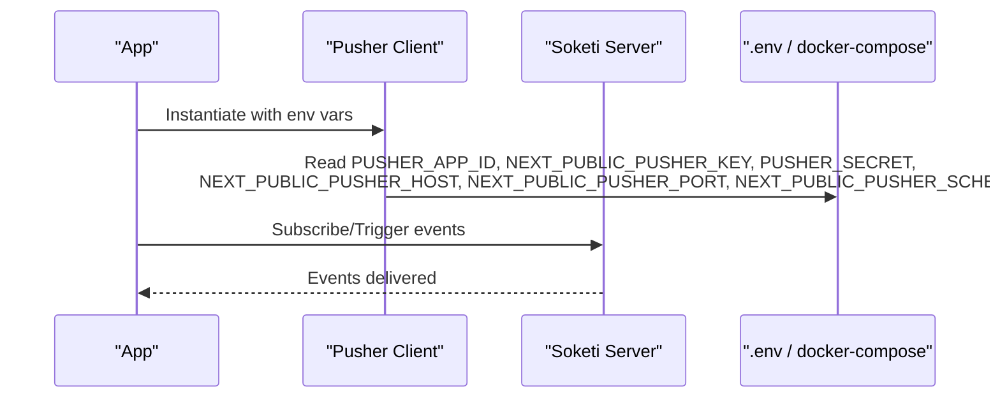
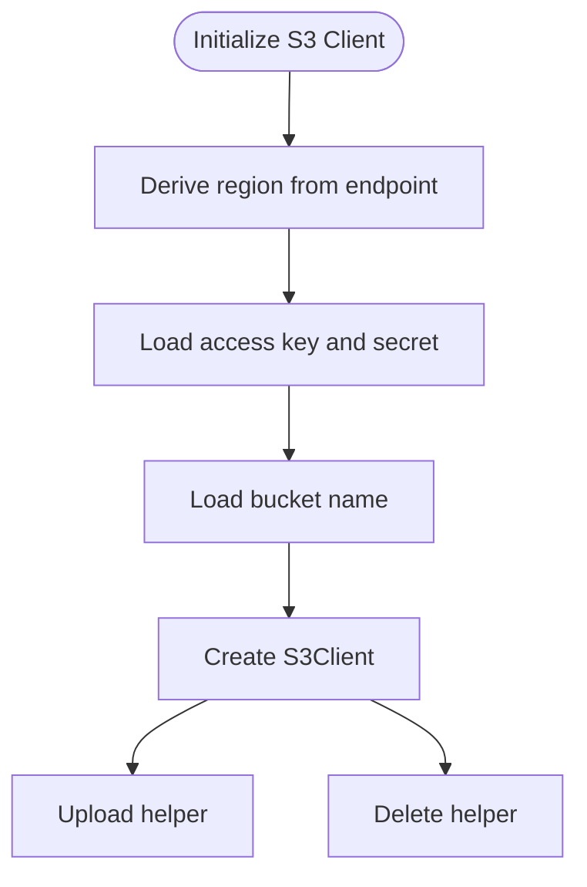
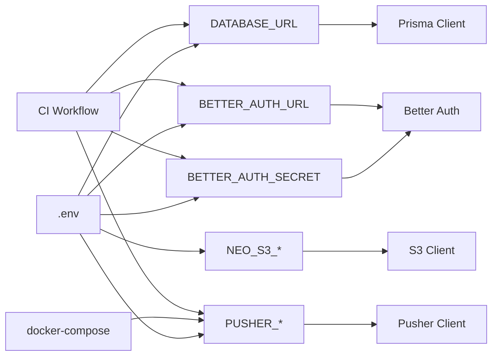

# Environment Variables & Configuration

<cite>
**Referenced Files in This Document**
- [README.md](file://README.md)
- [next.config.ts](file://next.config.ts)
- [prisma.config.ts](file://prisma.config.ts)
- [src/lib/prisma.ts](file://src/lib/prisma.ts)
- [src/lib/pusher.ts](file://src/lib/pusher.ts)
- [src/lib/storage.ts](file://src/lib/storage.ts)
- [src/lib/auth.ts](file://src/lib/auth.ts)
- [src/lib/func.ts](file://src/lib/func.ts)
- [Dockerfile](file://Dockerfile)
- [docker-compose.yaml](file://docker-compose.yaml)
- [.github/workflows/ci.yml](file://.github/workflows/ci.yml)
- [.github/workflows/deploy.yml](file://.github/workflows/deploy.yml)
- [package.json](file://package.json)
</cite>

## Table of Contents
1. [Introduction](#introduction)
2. [Project Structure](#project-structure)
3. [Core Components](#core-components)
4. [Architecture Overview](#architecture-overview)
5. [Detailed Component Analysis](#detailed-component-analysis)
6. [Dependency Analysis](#dependency-analysis)
7. [Performance Considerations](#performance-considerations)
8. [Troubleshooting Guide](#troubleshooting-guide)
9. [Conclusion](#conclusion)
10. [Appendices](#appendices)

## Introduction
This document explains environment variable management and system configuration for the POS and Finance system built with Next.js, Prisma, Better Auth, Pusher/Soketi, and AWS S3-compatible storage. It documents configuration structure using .env.example as a reference, lists required and optional environment variables per environment (development, staging, production), details Next.js configuration, database connectivity, and external service integrations. It also provides practical examples, security considerations, validation and defaults, and troubleshooting guidance.

## Project Structure
The configuration spans several layers:
- Application configuration: Next.js configuration and runtime environment
- Database configuration: Prisma client initialization and datasource URL parsing
- Authentication configuration: Better Auth setup and environment-driven behavior
- Real-time messaging: Pusher client/server configuration
- Cloud storage: S3-compatible client initialization
- Containerization and orchestration: Dockerfile and docker-compose for local development and self-hosted Pusher
- CI/CD: GitHub Actions workflows for testing and deployment

**Diagram sources**
- [next.config.ts:1-11](file://next.config.ts#L1-L11)
- [prisma.config.ts:1-13](file://prisma.config.ts#L1-L13)
- [src/lib/prisma.ts:1-25](file://src/lib/prisma.ts#L1-L25)
- [src/lib/auth.ts:1-95](file://src/lib/auth.ts#L1-L95)
- [src/lib/pusher.ts:1-11](file://src/lib/pusher.ts#L1-L11)
- [src/lib/storage.ts:1-91](file://src/lib/storage.ts#L1-L91)
- [Dockerfile:1-64](file://Dockerfile#L1-L64)
- [docker-compose.yaml:1-47](file://docker-compose.yaml#L1-L47)
- [.github/workflows/ci.yml:1-60](file://.github/workflows/ci.yml#L1-L60)
- [.github/workflows/deploy.yml:1-29](file://.github/workflows/deploy.yml#L1-L29)
- [package.json:1-95](file://package.json#L1-L95)

**Section sources**
- [README.md:73-98](file://README.md#L73-L98)
- [next.config.ts:1-11](file://next.config.ts#L1-L11)
- [prisma.config.ts:1-13](file://prisma.config.ts#L1-L13)
- [src/lib/prisma.ts:1-25](file://src/lib/prisma.ts#L1-L25)
- [src/lib/auth.ts:1-95](file://src/lib/auth.ts#L1-L95)
- [src/lib/pusher.ts:1-11](file://src/lib/pusher.ts#L1-L11)
- [src/lib/storage.ts:1-91](file://src/lib/storage.ts#L1-L91)
- [Dockerfile:1-64](file://Dockerfile#L1-L64)
- [docker-compose.yaml:1-47](file://docker-compose.yaml#L1-L47)
- [.github/workflows/ci.yml:1-60](file://.github/workflows/ci.yml#L1-L60)
- [.github/workflows/deploy.yml:1-29](file://.github/workflows/deploy.yml#L1-L29)
- [package.json:1-95](file://package.json#L1-L95)

## Core Components
- Next.js configuration enables React compiler, externalizes a native dependency, and builds a standalone output suitable for containers.
- Prisma configuration loads environment variables and defines datasource URL resolution.
- Prisma client parses DATABASE_URL into structured connection parameters and sets connection limits.
- Better Auth reads secret and base URL from environment variables and enforces domain validation in development.
- Pusher client reads app ID/key/secret/host/port/TLS scheme from environment variables.
- S3 client initializes with region derived from endpoint, credentials, and bucket from environment variables.
- Dockerfile sets runtime environment variables and exposes port 3000.
- docker-compose provisions MySQL, phpMyAdmin, and Soketi, passing Pusher app credentials from environment variables.
- CI/CD workflows set environment variables for tests and builds.

**Section sources**
- [next.config.ts:1-11](file://next.config.ts#L1-L11)
- [prisma.config.ts:1-13](file://prisma.config.ts#L1-L13)
- [src/lib/prisma.ts:1-25](file://src/lib/prisma.ts#L1-L25)
- [src/lib/auth.ts:1-95](file://src/lib/auth.ts#L1-L95)
- [src/lib/pusher.ts:1-11](file://src/lib/pusher.ts#L1-L11)
- [src/lib/storage.ts:1-91](file://src/lib/storage.ts#L1-L91)
- [Dockerfile:41-64](file://Dockerfile#L41-L64)
- [docker-compose.yaml:30-44](file://docker-compose.yaml#L30-L44)
- [.github/workflows/ci.yml:35-60](file://.github/workflows/ci.yml#L35-L60)
- [.github/workflows/deploy.yml:15-29](file://.github/workflows/deploy.yml#L15-L29)

## Architecture Overview
The environment configuration affects three primary subsystems:
- Database connectivity via Prisma client
- Authentication via Better Auth
- Real-time messaging via Pusher/Soketi and S3-compatible storage

**Diagram sources**
- [src/lib/prisma.ts:9-18](file://src/lib/prisma.ts#L9-L18)
- [src/lib/auth.ts:20-92](file://src/lib/auth.ts#L20-L92)
- [src/lib/pusher.ts:3-10](file://src/lib/pusher.ts#L3-L10)
- [src/lib/storage.ts:28-40](file://src/lib/storage.ts#L28-L40)
- [next.config.ts:3-8](file://next.config.ts#L3-L8)

## Detailed Component Analysis

### Database Configuration (Prisma)
- Datasource URL is loaded from environment and parsed by Prisma client.
- The client extracts host, port, user, password, and database name from DATABASE_URL and applies a connection limit.
- Migration and seeding are orchestrated via scripts.

**Diagram sources**
- [src/lib/prisma.ts:9-20](file://src/lib/prisma.ts#L9-L20)

**Section sources**
- [prisma.config.ts:10-12](file://prisma.config.ts#L10-L12)
- [src/lib/prisma.ts:9-20](file://src/lib/prisma.ts#L9-L20)
- [package.json:8-12](file://package.json#L8-L12)

### Authentication Configuration (Better Auth)
- Reads secret and base URL from environment variables.
- Enforces domain validation for user registration, with extra development domains.
- Uses Prisma adapter for MySQL.

**Diagram sources**
- [src/lib/auth.ts:20-92](file://src/lib/auth.ts#L20-L92)
- [src/lib/func.ts:11-19](file://src/lib/func.ts#L11-L19)

**Section sources**
- [src/lib/auth.ts:20-92](file://src/lib/auth.ts#L20-L92)
- [src/lib/func.ts:11-19](file://src/lib/func.ts#L11-L19)

### Real-time Messaging (Pusher/Soketi)
- Server-side Pusher client reads app credentials and TLS scheme from environment variables.
- docker-compose provisions Soketi and passes Pusher app credentials from environment variables.

**Diagram sources**
- [src/lib/pusher.ts:3-10](file://src/lib/pusher.ts#L3-L10)
- [docker-compose.yaml:38-43](file://docker-compose.yaml#L38-L43)

**Section sources**
- [src/lib/pusher.ts:3-10](file://src/lib/pusher.ts#L3-L10)
- [docker-compose.yaml:30-44](file://docker-compose.yaml#L30-L44)

### Cloud Storage (S3-Compatible)
- Initializes S3 client with region inferred from endpoint, credentials, and bucket from environment variables.
- Provides helpers to upload and delete objects.

**Diagram sources**
- [src/lib/storage.ts:19-40](file://src/lib/storage.ts#L19-L40)

**Section sources**
- [src/lib/storage.ts:1-91](file://src/lib/storage.ts#L1-L91)

### Next.js Configuration
- Enables React Compiler, externalizes a native dependency, and outputs a standalone server for containerized deployments.

**Section sources**
- [next.config.ts:3-8](file://next.config.ts#L3-L8)
- [Dockerfile:52-53](file://Dockerfile#L52-L53)

### Containerization and Orchestration
- Dockerfile sets runtime environment variables and exposes port 3000.
- docker-compose provisions MySQL, phpMyAdmin, and Soketi, forwarding Pusher app credentials from environment variables.

**Section sources**
- [Dockerfile:41-64](file://Dockerfile#L41-L64)
- [docker-compose.yaml:4-17](file://docker-compose.yaml#L4-L17)
- [docker-compose.yaml:30-44](file://docker-compose.yaml#L30-L44)

### CI/CD Configuration
- CI workflow sets environment variables for database, auth secret/base URL, and Pusher client for tests and builds.
- CD workflow deploys to a VPS via SSH, invoking Prisma generation, migrations, build, and process manager commands.

**Section sources**
- [.github/workflows/ci.yml:35-60](file://.github/workflows/ci.yml#L35-L60)
- [.github/workflows/deploy.yml:15-29](file://.github/workflows/deploy.yml#L15-L29)

## Dependency Analysis
- Environment variables flow from .env into runtime modules.
- Prisma client depends on DATABASE_URL; Better Auth depends on BETTER_AUTH_SECRET and BETTER_AUTH_URL; Pusher client depends on PUSHER_* variables; S3 client depends on NEO_S3_* variables.
- docker-compose injects Pusher app credentials into Soketi; CI/CD injects environment variables for ephemeral test runs.

**Diagram sources**
- [src/lib/prisma.ts:9-18](file://src/lib/prisma.ts#L9-L18)
- [src/lib/auth.ts:20-92](file://src/lib/auth.ts#L20-L92)
- [src/lib/pusher.ts:3-10](file://src/lib/pusher.ts#L3-L10)
- [src/lib/storage.ts:28-40](file://src/lib/storage.ts#L28-L40)
- [docker-compose.yaml:38-43](file://docker-compose.yaml#L38-L43)
- [.github/workflows/ci.yml:35-60](file://.github/workflows/ci.yml#L35-L60)

**Section sources**
- [src/lib/prisma.ts:9-18](file://src/lib/prisma.ts#L9-L18)
- [src/lib/auth.ts:20-92](file://src/lib/auth.ts#L20-L92)
- [src/lib/pusher.ts:3-10](file://src/lib/pusher.ts#L3-L10)
- [src/lib/storage.ts:28-40](file://src/lib/storage.ts#L28-L40)
- [docker-compose.yaml:38-43](file://docker-compose.yaml#L38-L43)
- [.github/workflows/ci.yml:35-60](file://.github/workflows/ci.yml#L35-L60)

## Performance Considerations
- Connection pooling: Prisma client sets a fixed connection limit; tune based on workload and database capacity.
- Standalone output: Next.js standalone build reduces cold starts and improves container startup performance.
- External packages: serverExternalPackages ensures native modules are handled outside the bundle for faster builds.

**Section sources**
- [src/lib/prisma.ts:17-18](file://src/lib/prisma.ts#L17-L18)
- [next.config.ts:6-7](file://next.config.ts#L6-L7)

## Troubleshooting Guide
Common configuration issues and resolutions:
- Database connectivity failures
  - Verify DATABASE_URL format and reachability.
  - Confirm Prisma datasource URL parsing aligns with expected host, port, user, password, and database.
- Authentication errors
  - Ensure BETTER_AUTH_SECRET and BETTER_AUTH_URL are present and correct.
  - In development, domain validation includes an example domain; confirm environment detection.
- Pusher/Soketi issues
  - Confirm PUSHER_APP_ID, NEXT_PUBLIC_PUSHER_KEY, PUSHER_SECRET, NEXT_PUBLIC_PUSHER_HOST, NEXT_PUBLIC_PUSHER_PORT, NEXT_PUBLIC_PUSHER_SCHEME are set.
  - Validate Soketi configuration in docker-compose and network accessibility.
- S3 upload failures
  - Check NEO_S3_ACCESS_KEY, NEO_S3_SECRET_KEY, NEO_S3_BUCKET, NEO_S3_ENDPOINT, NEO_S3_PUBLIC_URL.
  - Ensure endpoint region inference matches actual S3-compatible service region.
- Docker/container issues
  - Confirm NODE_ENV and PORT are set appropriately.
  - Validate exposed port and hostname binding.

**Section sources**
- [src/lib/prisma.ts:9-18](file://src/lib/prisma.ts#L9-L18)
- [src/lib/auth.ts:20-92](file://src/lib/auth.ts#L20-L92)
- [src/lib/pusher.ts:3-10](file://src/lib/pusher.ts#L3-L10)
- [src/lib/storage.ts:19-40](file://src/lib/storage.ts#L19-L40)
- [Dockerfile:41-64](file://Dockerfile#L41-L64)
- [docker-compose.yaml:30-44](file://docker-compose.yaml#L30-L44)

## Conclusion
Environment variables are central to configuring the POS and Finance system across environments. By consolidating configuration in .env and leveraging Prisma, Better Auth, Pusher/Soketi, and S3-compatible storage, the system achieves predictable behavior across development, CI/CD, and production. Following the documented variables, defaults, and best practices ensures secure, reliable, and maintainable deployments.

## Appendices

### Environment Variables Reference
- Database
  - DATABASE_URL: Datasource URL for Prisma
- Authentication
  - BETTER_AUTH_SECRET: Secret key for Better Auth
  - BETTER_AUTH_URL: Base URL for Better Auth
- Real-time Messaging
  - PUSHER_APP_ID: Pusher application identifier
  - PUSHER_SECRET: Pusher application secret
  - NEXT_PUBLIC_PUSHER_KEY: Pusher application key (client-visible)
  - NEXT_PUBLIC_PUSHER_HOST: Pusher host
  - NEXT_PUBLIC_PUSHER_PORT: Pusher port
  - NEXT_PUBLIC_PUSHER_SCHEME: Pusher scheme (http/https)
- Cloud Storage
  - NEO_S3_ACCESS_KEY: S3 access key
  - NEO_S3_SECRET_KEY: S3 secret key
  - NEO_S3_BUCKET: S3 bucket name
  - NEO_S3_ENDPOINT: S3-compatible endpoint
  - NEO_S3_PUBLIC_URL: Public base URL for objects

**Section sources**
- [README.md:77-98](file://README.md#L77-L98)
- [src/lib/prisma.ts:9-18](file://src/lib/prisma.ts#L9-L18)
- [src/lib/auth.ts:20-92](file://src/lib/auth.ts#L20-L92)
- [src/lib/pusher.ts:3-10](file://src/lib/pusher.ts#L3-L10)
- [src/lib/storage.ts:11-17](file://src/lib/storage.ts#L11-L17)

### Environment-Specific Examples
- Development
  - Enable development-specific domain validation and local Pusher host/port.
  - Use local MySQL instance and local S3-compatible endpoint.
- Staging
  - Use staging database URL, auth base URL, and S3-compatible staging endpoint.
  - Configure Pusher app credentials for staging environment.
- Production
  - Set production database URL, secure auth secret, and production S3-compatible endpoint.
  - Ensure TLS scheme is https for Pusher and proper DNS/SSL termination.

**Section sources**
- [src/lib/func.ts:14-16](file://src/lib/func.ts#L14-L16)
- [docker-compose.yaml:38-43](file://docker-compose.yaml#L38-L43)
- [Dockerfile:41-64](file://Dockerfile#L41-L64)

### Security Considerations
- Never commit secrets to version control; use .env files and CI/CD secrets.
- Rotate BETTER_AUTH_SECRET regularly and keep it sufficiently long and random.
- Restrict access to Pusher app credentials and enforce least privilege.
- Use HTTPS endpoints for S3-compatible services and configure appropriate ACLs.
- Limit database user privileges and restrict network access to the database.

**Section sources**
- [.github/workflows/deploy.yml:18-20](file://.github/workflows/deploy.yml#L18-L20)
- [src/lib/storage.ts:60-69](file://src/lib/storage.ts#L60-L69)

### Validation and Defaults
- DATABASE_URL is required; Prisma client parses it and sets defaults for host, port, and database.
- S3 client derives region from endpoint and uses defaults for credentials and bucket if not provided.
- Pusher client requires all app credentials and TLS scheme; defaults are not applied for these values.
- Better Auth requires secret and base URL; domain validation is environment-aware.

**Section sources**
- [src/lib/prisma.ts:9-18](file://src/lib/prisma.ts#L9-L18)
- [src/lib/storage.ts:19-30](file://src/lib/storage.ts#L19-L30)
- [src/lib/pusher.ts:3-10](file://src/lib/pusher.ts#L3-L10)
- [src/lib/auth.ts:66-77](file://src/lib/auth.ts#L66-L77)