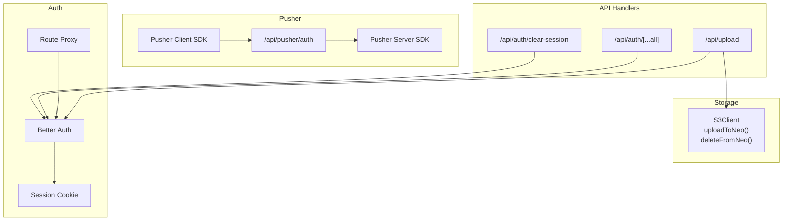
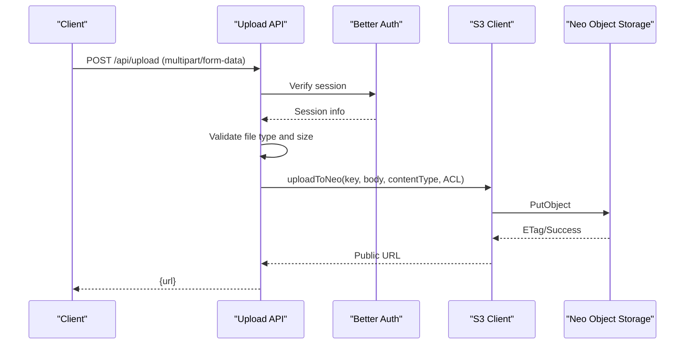
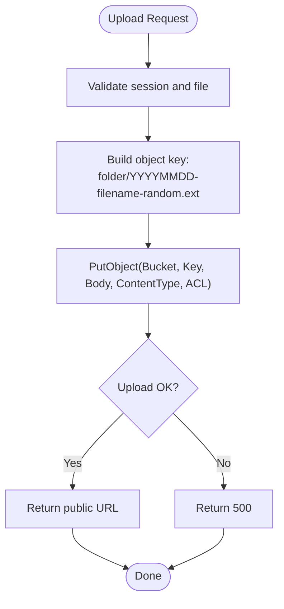
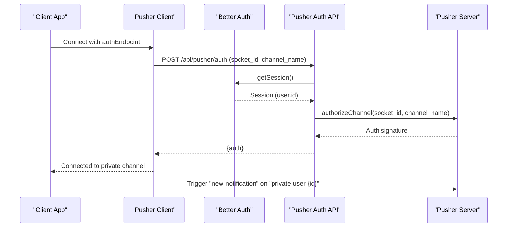
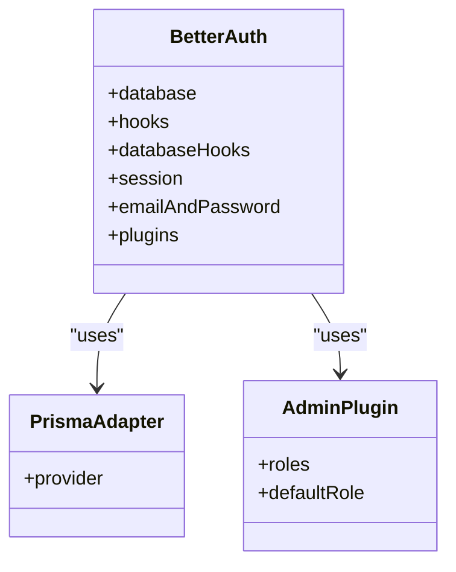
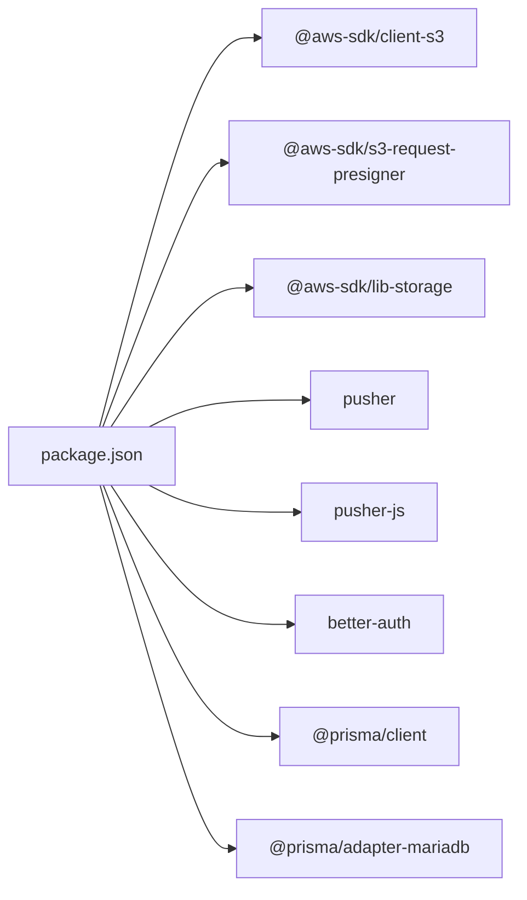

# External Service Configuration

<cite>
**Referenced Files in This Document**
- [storage.ts](file://src/lib/storage.ts)
- [pusher.ts](file://src/lib/pusher.ts)
- [pusher-client.ts](file://src/lib/pusher-client.ts)
- [notifications.ts](file://src/lib/notifications.ts)
- [route.ts](file://src/app/api/pusher/auth/route.ts)
- [route.ts](file://src/app/api/upload/route.ts)
- [route.ts](file://src/app/api/auth/[...all]/route.ts)
- [route.ts](file://src/app/api/auth/clear-session/route.ts)
- [auth.ts](file://src/lib/auth.ts)
- [proxy.ts](file://src/proxy.ts)
- [package.json](file://package.json)
</cite>

## Table of Contents
1. [Introduction](#introduction)
2. [Project Structure](#project-structure)
3. [Core Components](#core-components)
4. [Architecture Overview](#architecture-overview)
5. [Detailed Component Analysis](#detailed-component-analysis)
6. [Dependency Analysis](#dependency-analysis)
7. [Performance Considerations](#performance-considerations)
8. [Troubleshooting Guide](#troubleshooting-guide)
9. [Conclusion](#conclusion)

## Introduction
This document explains how external services are configured and integrated in the application, focusing on three pillars:
- AWS S3-compatible storage (Neo Object Storage) for file uploads
- Pusher WebSocket (via Soketi) for real-time notifications
- Better Auth for authentication and session management

It covers environment variable requirements, configuration parameters, integration flows, security considerations, operational limits, and troubleshooting steps.

## Project Structure
The external service integrations are implemented as reusable libraries and API handlers:
- Storage integration: centralized S3 client and helpers
- Pusher integration: server-side SDK and client-side SDK initialization
- Authentication: Better Auth configuration and session enforcement
- API endpoints: upload handler and Pusher auth endpoint

**Diagram sources**
- [storage.ts:1-91](file://src/lib/storage.ts#L1-L91)
- [pusher.ts:1-11](file://src/lib/pusher.ts#L1-L11)
- [pusher-client.ts:1-21](file://src/lib/pusher-client.ts#L1-L21)
- [route.ts:1-40](file://src/app/api/pusher/auth/route.ts#L1-L40)
- [route.ts:1-76](file://src/app/api/upload/route.ts#L1-L76)
- [auth.ts:1-95](file://src/lib/auth.ts#L1-L95)
- [proxy.ts:1-72](file://src/proxy.ts#L1-L72)
- [route.ts:1-4](file://src/app/api/auth/[...all]/route.ts#L1-L4)
- [route.ts:1-11](file://src/app/api/auth/clear-session/route.ts#L1-L11)

**Section sources**
- [storage.ts:1-91](file://src/lib/storage.ts#L1-L91)
- [pusher.ts:1-11](file://src/lib/pusher.ts#L1-L11)
- [pusher-client.ts:1-21](file://src/lib/pusher-client.ts#L1-L21)
- [route.ts:1-40](file://src/app/api/pusher/auth/route.ts#L1-L40)
- [route.ts:1-76](file://src/app/api/upload/route.ts#L1-L76)
- [auth.ts:1-95](file://src/lib/auth.ts#L1-L95)
- [proxy.ts:1-72](file://src/proxy.ts#L1-L72)
- [route.ts:1-4](file://src/app/api/auth/[...all]/route.ts#L1-L4)
- [route.ts:1-11](file://src/app/api/auth/clear-session/route.ts#L1-L11)

## Core Components
- AWS S3-compatible storage (Neo Object Storage)
  - Environment variables: access key, secret key, bucket name, endpoint, public URL
  - Client configuration: region derived from endpoint, path-style addressing
  - Operations: upload with ACL control, delete by key or public URL
- Pusher WebSocket (Soketi-compatible)
  - Server SDK: app ID, key, secret, host, port, TLS scheme
  - Client SDK: singleton connection, transports, auth endpoint for private channels
  - Real-time events: per-user private channels, event name convention
- Better Auth
  - Session lifecycle: expiration, cookie-based sessions
  - Email/password policy: minimum length, hashing/verification
  - Role-based access: admin plugin with roles and permissions
  - Route protection: middleware and proxy-based enforcement

**Section sources**
- [storage.ts:1-91](file://src/lib/storage.ts#L1-L91)
- [pusher.ts:1-11](file://src/lib/pusher.ts#L1-L11)
- [pusher-client.ts:1-21](file://src/lib/pusher-client.ts#L1-L21)
- [auth.ts:1-95](file://src/lib/auth.ts#L1-L95)
- [proxy.ts:1-72](file://src/proxy.ts#L1-L72)

## Architecture Overview
The system integrates external services through dedicated modules and API endpoints:
- Upload flow: authenticated request -> upload handler -> S3 upload -> return public URL
- Real-time notifications: database write -> trigger Pusher event on private channel
- Authentication: Better Auth manages sessions and protects routes

**Diagram sources**
- [route.ts:1-76](file://src/app/api/upload/route.ts#L1-L76)
- [storage.ts:48-69](file://src/lib/storage.ts#L48-L69)
- [auth.ts:1-95](file://src/lib/auth.ts#L1-L95)

## Detailed Component Analysis

### AWS S3 Storage Configuration (Neo Object Storage)
- Environment variables
  - NEO_S3_ACCESS_KEY: Access key for the S3-compatible service
  - NEO_S3_SECRET_KEY: Secret key for the S3-compatible service
  - NEO_S3_BUCKET: Target bucket name
  - NEO_S3_ENDPOINT: Endpoint hostname (supports http/https stripping)
  - NEO_S3_PUBLIC_URL: Optional override for public base URL
- Region and endpoint parsing
  - Region extracted from endpoint subdomain pattern
  - Endpoint normalized to HTTPS with stripped prefix
- Client configuration
  - forcePathStyle: true for compatibility with S3-compatible APIs
  - Credentials loaded from environment
- Upload parameters
  - Key: composed from folder, date, cleaned filename, and random suffix
  - Content-Type: derived from uploaded file
  - ACL: public-read or private based on isPublic flag
- Deletion
  - Accepts either a key or a public URL; normalizes input before deletion

**Diagram sources**
- [route.ts:1-76](file://src/app/api/upload/route.ts#L1-L76)
- [storage.ts:48-69](file://src/lib/storage.ts#L48-L69)

**Section sources**
- [storage.ts:1-91](file://src/lib/storage.ts#L1-L91)
- [route.ts:1-76](file://src/app/api/upload/route.ts#L1-L76)

### Pusher WebSocket Configuration (Real-time Notifications)
- Server SDK configuration
  - appId, key, secret, host, port, TLS based on scheme
- Client SDK configuration
  - Singleton connection to avoid reconnect loops
  - Cluster set to "mt1"
  - Auth endpoint for private channels: "/api/pusher/auth"
  - Stats disabled (Soketi compatibility)
- Private channel authorization
  - Endpoint validates session and enforces per-user channel naming
  - Only allows subscription to "private-user-{userId}"
- Real-time event triggering
  - Uses per-user private channels
  - Event name: "new-notification"
  - Payload: notification record

**Diagram sources**
- [pusher-client.ts:1-21](file://src/lib/pusher-client.ts#L1-L21)
- [route.ts:1-40](file://src/app/api/pusher/auth/route.ts#L1-L40)
- [pusher.ts:1-11](file://src/lib/pusher.ts#L1-L11)
- [notifications.ts:18-42](file://src/lib/notifications.ts#L18-L42)

**Section sources**
- [pusher.ts:1-11](file://src/lib/pusher.ts#L1-L11)
- [pusher-client.ts:1-21](file://src/lib/pusher-client.ts#L1-L21)
- [route.ts:1-40](file://src/app/api/pusher/auth/route.ts#L1-L40)
- [notifications.ts:18-42](file://src/lib/notifications.ts#L18-L42)

### Better Auth Configuration (Authentication Services)
- Database adapter: Prisma with MySQL/MariaDB provider
- Hooks
  - Pre-create hook for email domain validation and name normalization
  - Database hook to assign random avatar if none provided
- Session management
  - Expiration: 30 days
  - Cookie-based sessions via nextCookies plugin
- Email and password
  - Enabled with minimum password length of 6
  - Custom hashing and verification using Argon2
- Plugins
  - Admin plugin with predefined roles and default role
- Route protection
  - Middleware and proxy enforce session presence for protected routes
  - Redirects guests to login and logged-in users away from guest routes

**Diagram sources**
- [auth.ts:20-92](file://src/lib/auth.ts#L20-L92)

**Section sources**
- [auth.ts:1-95](file://src/lib/auth.ts#L1-L95)
- [proxy.ts:1-72](file://src/proxy.ts#L1-L72)
- [route.ts:1-4](file://src/app/api/auth/[...all]/route.ts#L1-L4)
- [route.ts:1-11](file://src/app/api/auth/clear-session/route.ts#L1-L11)

## Dependency Analysis
External dependencies relevant to service configuration:
- AWS SDK for JavaScript (S3 client, presigner, lib-storage)
- Pusher server and client SDKs
- Better Auth core and plugins
- Prisma client and adapter

**Diagram sources**
- [package.json:14-68](file://package.json#L14-L68)

**Section sources**
- [package.json:14-68](file://package.json#L14-L68)

## Performance Considerations
- S3 uploads
  - Prefer smaller images and enforce client-side size limits (as implemented)
  - Consider multipart uploads for larger files using @aws-sdk/lib-storage
  - Use CDN distribution via public URL for reduced origin load
- Pusher
  - Keep transport selection minimal (ws/wss) to reduce overhead
  - Disable stats for Soketi compatibility to avoid unsupported requests
  - Batch notifications when possible to reduce event volume
- Authentication
  - Session expiration set to 30 days; adjust based on risk tolerance
  - Use efficient database queries for role checks and notifications

[No sources needed since this section provides general guidance]

## Troubleshooting Guide
- S3 upload failures
  - Verify environment variables: bucket, endpoint, access key, secret key
  - Confirm endpoint format and region extraction logic
  - Check ACL and public URL overrides
  - Review upload API validation (file type, size)
- Pusher connection/authentication issues
  - Ensure NEXT_PUBLIC_PUSHER_* variables match server configuration
  - Confirm auth endpoint responds with proper signatures for private channels
  - Validate per-user channel naming: "private-user-{userId}"
  - Check TLS scheme and port configuration
- Authentication problems
  - Verify session cookie presence for protected routes
  - Confirm Better Auth routes are mounted and functioning
  - Clear session endpoint can be used to reset state during testing
- General diagnostics
  - Inspect console logs for detailed error messages
  - Use global error boundary to capture unhandled exceptions

**Section sources**
- [storage.ts:19-40](file://src/lib/storage.ts#L19-L40)
- [route.ts:1-76](file://src/app/api/upload/route.ts#L1-L76)
- [pusher-client.ts:6-20](file://src/lib/pusher-client.ts#L6-L20)
- [route.ts:1-40](file://src/app/api/pusher/auth/route.ts#L1-L40)
- [proxy.ts:19-57](file://src/proxy.ts#L19-L57)
- [route.ts:1-11](file://src/app/api/auth/clear-session/route.ts#L1-L11)

## Conclusion
The application integrates external services through well-defined modules:
- S3-compatible storage with robust environment-driven configuration and safe upload/delete operations
- Pusher WebSocket with secure per-user private channels and a dedicated auth endpoint
- Better Auth providing session management, role-based access, and route protection

Follow the environment variable requirements, validate configurations, and leverage the provided API endpoints and helpers to maintain reliable and secure integrations.