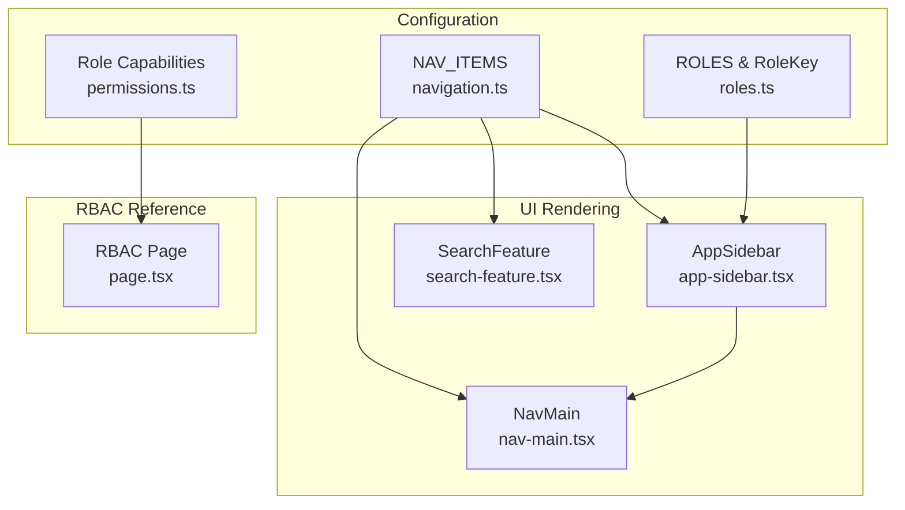
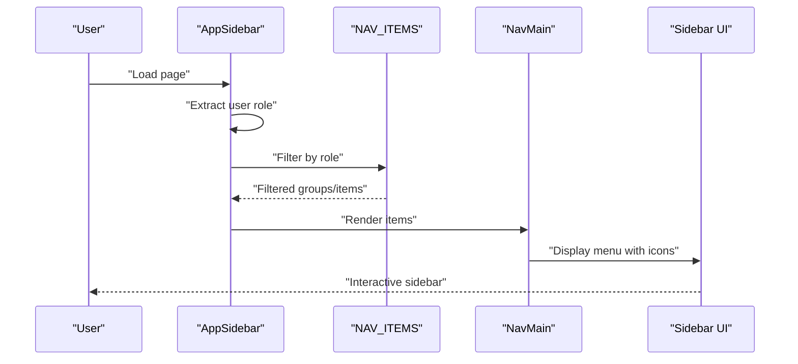
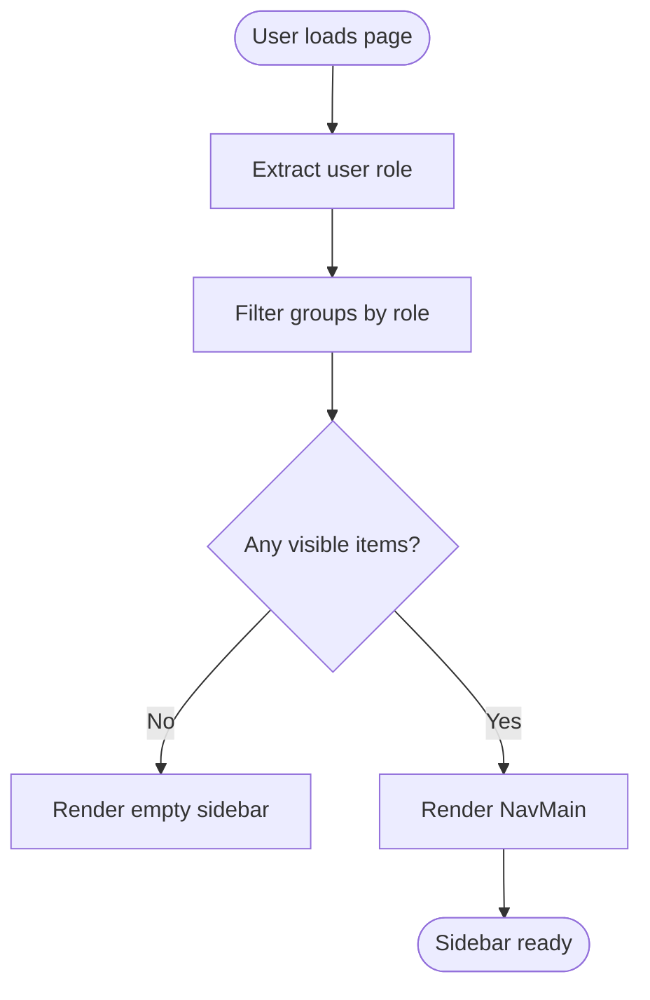
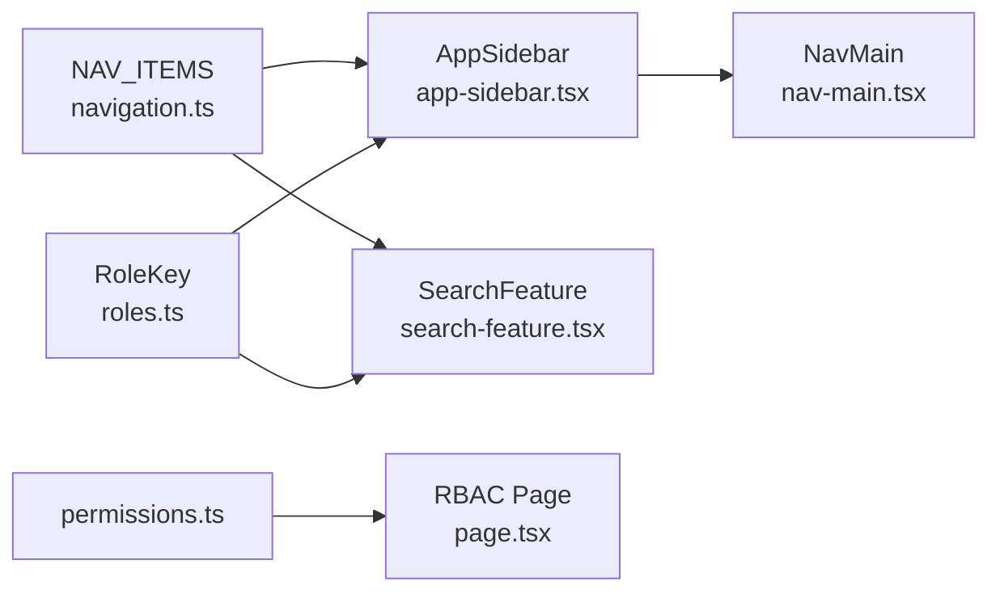

# Navigation & Menu Configuration

<cite>
**Referenced Files in This Document**
- [navigation.ts](file://src/config/navigation.ts)
- [roles.ts](file://src/config/roles.ts)
- [permissions.ts](file://src/lib/permissions.ts)
- [app-sidebar.tsx](file://src/components/app-sidebar.tsx)
- [nav-main.tsx](file://src/components/nav-main.tsx)
- [search-feature.tsx](file://src/components/search-feature.tsx)
- [page.tsx](file://src/app/(LoggedIn)/rbac/page.tsx)
</cite>

## Table of Contents
1. [Introduction](#introduction)
2. [Project Structure](#project-structure)
3. [Core Components](#core-components)
4. [Architecture Overview](#architecture-overview)
5. [Detailed Component Analysis](#detailed-component-analysis)
6. [Dependency Analysis](#dependency-analysis)
7. [Performance Considerations](#performance-considerations)
8. [Troubleshooting Guide](#troubleshooting-guide)
9. [Conclusion](#conclusion)

## Introduction
This document explains the role-based navigation system configuration used in the application. It covers the NAV_ITEMS structure, the NavItem and NavSubItem types, how navigation groups are organized, and how role-based access control is enforced. It also documents dynamic navigation generation based on user roles, Lucide icon integration, and the menu hierarchy. Practical examples demonstrate how to add new menu items, customize existing navigation, and implement role-specific layouts. Finally, it addresses navigation validation, menu item permissions, and troubleshooting navigation issues.

## Project Structure
The navigation system is composed of:
- A centralized configuration that defines the menu structure and roles
- UI components that render the sidebar and menu items
- A search feature that filters navigation items by role and query
- A permissions module that defines role capabilities for resource actions

**Diagram sources**
- [navigation.ts:35-217](file://src/config/navigation.ts#L35-L217)
- [roles.ts:5-18](file://src/config/roles.ts#L5-L18)
- [permissions.ts:1-67](file://src/lib/permissions.ts#L1-L67)
- [app-sidebar.tsx:24-91](file://src/components/app-sidebar.tsx#L24-L91)
- [nav-main.tsx:22-116](file://src/components/nav-main.tsx#L22-L116)
- [search-feature.tsx:31-262](file://src/components/search-feature.tsx#L31-L262)
- [page.tsx:18-211](file://src/app/(LoggedIn)/rbac/page.tsx#L18-L211)

**Section sources**
- [navigation.ts:1-217](file://src/config/navigation.ts#L1-L217)
- [roles.ts:1-18](file://src/config/roles.ts#L1-L18)
- [permissions.ts:1-67](file://src/lib/permissions.ts#L1-L67)
- [app-sidebar.tsx:1-91](file://src/components/app-sidebar.tsx#L1-L91)
- [nav-main.tsx:1-116](file://src/components/nav-main.tsx#L1-L116)
- [search-feature.tsx:1-262](file://src/components/search-feature.tsx#L1-L262)
- [page.tsx:1-211](file://src/app/(LoggedIn)/rbac/page.tsx#L1-L211)

## Core Components
- NAV_ITEMS: Defines the hierarchical navigation structure with groups, items, and subitems. Each item supports optional roles to restrict visibility.
- NavItem and NavSubItem types: Define the shape of menu entries, including title, URL, optional icon, optional roles array, and optional nested items.
- AppSidebar: Filters NAV_ITEMS by user role and renders the sidebar with NavMain.
- NavMain: Renders the menu items and subitems, supporting collapsible groups and active-state highlighting.
- SearchFeature: Flattens NAV_ITEMS into a searchable list, filtered by role and query.
- RBAC page: Provides a reference matrix of roles and their capabilities.

**Section sources**
- [navigation.ts:16-33](file://src/config/navigation.ts#L16-L33)
- [navigation.ts:35-217](file://src/config/navigation.ts#L35-L217)
- [app-sidebar.tsx:24-91](file://src/components/app-sidebar.tsx#L24-L91)
- [nav-main.tsx:22-116](file://src/components/nav-main.tsx#L22-L116)
- [search-feature.tsx:31-262](file://src/components/search-feature.tsx#L31-L262)
- [page.tsx:18-211](file://src/app/(LoggedIn)/rbac/page.tsx#L18-L211)

## Architecture Overview
The navigation pipeline:
- Configuration defines NAV_ITEMS with icons and role restrictions.
- AppSidebar reads the user’s role and filters NAV_ITEMS accordingly.
- NavMain renders the filtered items, handling collapsible groups and active states.
- SearchFeature flattens NAV_ITEMS for quick search, respecting role filters.
- RBAC page displays role-to-capability mappings for reference.

**Diagram sources**
- [app-sidebar.tsx:60-89](file://src/components/app-sidebar.tsx#L60-L89)
- [nav-main.tsx:37-114](file://src/components/nav-main.tsx#L37-L114)
- [navigation.ts:35-217](file://src/config/navigation.ts#L35-L217)

## Detailed Component Analysis

### NAV_ITEMS Structure and Types
- NavSubItem: title, url, optional roles.
- NavItem: title, url, optional icon, optional roles, optional items array of NavSubItem.
- NavGroup: label, items array of NavItem.
- NAV_ITEMS: Array of NavGroup defining top-level groups such as “Main Menu”, “Finance”, and “Other”.

Key characteristics:
- Icons are Lucide icons imported and attached to items.
- roles arrays define who can see an item or subitem.
- url "#" indicates a group header without a direct route; actual links are provided by subitems.

Practical example locations:
- Adding a new top-level group: append to NAV_ITEMS array.
- Adding a new subitem under an existing group: extend the items array of the target NavItem.

**Section sources**
- [navigation.ts:16-33](file://src/config/navigation.ts#L16-L33)
- [navigation.ts:35-217](file://src/config/navigation.ts#L35-L217)

### Role-Based Access Control (RBAC) for Menu Items
- RoleKey comes from roles.ts and is used consistently across configuration and filtering.
- AppSidebar.filterNavByRole enforces:
  - If an item has roles, it is shown only if the user’s role is included.
  - If an item has subitems, only subitems allowed by the user’s role remain; if none remain, the parent is hidden.
- The fallback role is “kasir” if user lacks a role field.

Validation behavior:
- Items without roles are visible to everyone.
- Parent items are hidden if all subitems are filtered out.

**Section sources**
- [roles.ts:13-18](file://src/config/roles.ts#L13-L18)
- [app-sidebar.tsx:24-51](file://src/components/app-sidebar.tsx#L24-L51)

### Dynamic Navigation Generation Based on User Roles
- AppSidebar computes filteredNav via React.useMemo to avoid unnecessary re-renders.
- NavMain receives filtered items and renders them with:
  - Collapsible groups for items with subitems.
  - Active state detection based on current pathname.
  - Icon rendering when present.

**Diagram sources**
- [app-sidebar.tsx:60-89](file://src/components/app-sidebar.tsx#L60-L89)
- [nav-main.tsx:37-114](file://src/components/nav-main.tsx#L37-L114)

**Section sources**
- [app-sidebar.tsx:60-89](file://src/components/app-sidebar.tsx#L60-L89)
- [nav-main.tsx:37-114](file://src/components/nav-main.tsx#L37-L114)

### Icon Integration Using Lucide Icons
- Lucide icons are imported and assigned to NavItem.icon.
- NavMain renders the icon alongside the title when present.
- SearchFeature preserves the parent icon for grouped search results.

Best practices:
- Use semantic icon assignments aligned with the item’s function.
- Keep icon usage consistent across similar items.

**Section sources**
- [navigation.ts:1-14](file://src/config/navigation.ts#L1-L14)
- [nav-main.tsx:104-106](file://src/components/nav-main.tsx#L104-L106)
- [search-feature.tsx:210-216](file://src/components/search-feature.tsx#L210-L216)

### Menu Hierarchy Structure
- Groups: labeled containers for related items.
- Items: top-level entries with optional subitems.
- Subitems: leaf-level entries that are actual navigable routes.

Rendering logic:
- Items with subitems render as collapsible groups.
- Active state is determined by matching the current pathname against subitem URLs.

**Section sources**
- [navigation.ts:30-33](file://src/config/navigation.ts#L30-L33)
- [nav-main.tsx:44-91](file://src/components/nav-main.tsx#L44-L91)

### Practical Examples

#### Example 1: Add a New Menu Item Under an Existing Group
Steps:
- Open navigation.ts.
- Locate the target NavGroup and its items array.
- Append a new NavItem with:
  - title: human-readable label
  - url: absolute path or "#"
  - icon: import and assign a Lucide icon
  - roles: optional array restricting visibility
  - items: optional array of NavSubItem for submenus

Validation:
- Ensure url is not "#" unless the item is a group header.
- Verify role keys match RoleKey values.

**Section sources**
- [navigation.ts:35-217](file://src/config/navigation.ts#L35-L217)
- [roles.ts:13-18](file://src/config/roles.ts#L13-L18)

#### Example 2: Customize Existing Navigation
- Adjust existing NavItem.title or url to rename or re-route.
- Change icon by swapping the imported Lucide icon.
- Restrict visibility by modifying roles or removing the field.

Impact:
- AppSidebar will reflect changes immediately after role filtering.
- NavMain will render updated labels and icons.

**Section sources**
- [app-sidebar.tsx:24-51](file://src/components/app-sidebar.tsx#L24-L51)
- [nav-main.tsx:97-110](file://src/components/nav-main.tsx#L97-L110)

#### Example 3: Implement Role-Specific Navigation Layouts
- Use roles.ts to define RoleKey values.
- Assign roles arrays in NAV_ITEMS to control visibility.
- For advanced scenarios, extend AppSidebar.filterNavByRole to support additional logic (e.g., per-module permissions).

Note: The current implementation relies on RoleKey and the fallback role “kasir”.

**Section sources**
- [roles.ts:5-18](file://src/config/roles.ts#L5-L18)
- [app-sidebar.tsx:24-51](file://src/components/app-sidebar.tsx#L24-L51)

### RBAC Reference and Validation
- permissions.ts defines resource statements and role capabilities.
- RBAC page presents a matrix of roles and their permissions for cross-reference.

Validation tips:
- Confirm role keys in NAV_ITEMS match RoleKey.
- Cross-check NAV_ITEM roles against the RBAC matrix for consistency.

**Section sources**
- [permissions.ts:8-21](file://src/lib/permissions.ts#L8-L21)
- [page.tsx:18-211](file://src/app/(LoggedIn)/rbac/page.tsx#L18-L211)

## Dependency Analysis
- AppSidebar depends on:
  - NAV_ITEMS for structure
  - RoleKey for type safety
  - Better Auth access control for capability modeling (reference)
- NavMain depends on:
  - Next.js routing for active state
  - UI primitives for collapsible menus and icons
- SearchFeature depends on:
  - NAV_ITEMS for flattened search
  - RoleKey for filtering

**Diagram sources**
- [navigation.ts:35-217](file://src/config/navigation.ts#L35-L217)
- [roles.ts:13-18](file://src/config/roles.ts#L13-L18)
- [app-sidebar.tsx:60-89](file://src/components/app-sidebar.tsx#L60-L89)
- [nav-main.tsx:37-114](file://src/components/nav-main.tsx#L37-L114)
- [search-feature.tsx:38-80](file://src/components/search-feature.tsx#L38-L80)
- [permissions.ts:1-67](file://src/lib/permissions.ts#L1-L67)
- [page.tsx:18-211](file://src/app/(LoggedIn)/rbac/page.tsx#L18-L211)

**Section sources**
- [app-sidebar.tsx:60-89](file://src/components/app-sidebar.tsx#L60-L89)
- [nav-main.tsx:37-114](file://src/components/nav-main.tsx#L37-L114)
- [search-feature.tsx:38-80](file://src/components/search-feature.tsx#L38-L80)
- [permissions.ts:1-67](file://src/lib/permissions.ts#L1-L67)

## Performance Considerations
- Memoization: AppSidebar uses React.useMemo to compute filteredNav once per role change, preventing unnecessary recomputation.
- Conditional rendering: NavMain avoids rendering icons when not present.
- SearchFeature flattens NAV_ITEMS once per userRole change and filters by query efficiently.

Recommendations:
- Keep NAV_ITEMS reasonably sized to minimize filtering overhead.
- Avoid excessive nesting to reduce traversal costs.
- Use role keys consistently to prevent runtime errors and improve maintainability.

[No sources needed since this section provides general guidance]

## Troubleshooting Guide
Common issues and resolutions:
- Menu item not visible
  - Cause: roles array excludes the user’s role.
  - Fix: Add the user’s RoleKey to the item’s roles or remove roles to make it public.
  - Reference: AppSidebar.filterNavByRole logic.

- Entire group disappears
  - Cause: all subitems were filtered out due to role restrictions.
  - Fix: Ensure at least one subitem allows the user’s role.

- Icon not rendering
  - Cause: icon field is missing or not imported.
  - Fix: Import a Lucide icon and assign it to NavItem.icon.

- Active state not highlighting
  - Cause: url mismatch with current pathname.
  - Fix: Ensure item.url matches the current route.

- Search not finding items
  - Cause: roles filter hides items or query does not match titles.
  - Fix: Verify userRole prop passed to SearchFeature and adjust query.

**Section sources**
- [app-sidebar.tsx:24-51](file://src/components/app-sidebar.tsx#L24-L51)
- [nav-main.tsx:95-109](file://src/components/nav-main.tsx#L95-L109)
- [search-feature.tsx:42-80](file://src/components/search-feature.tsx#L42-L80)

## Conclusion
The navigation system combines a centralized configuration (NAV_ITEMS), role enforcement (AppSidebar), and UI rendering (NavMain) to deliver a flexible, role-aware sidebar. Lucide icons enhance usability, while the search feature improves discoverability. By aligning role keys and permissions, teams can maintain a consistent and secure navigation experience across roles.