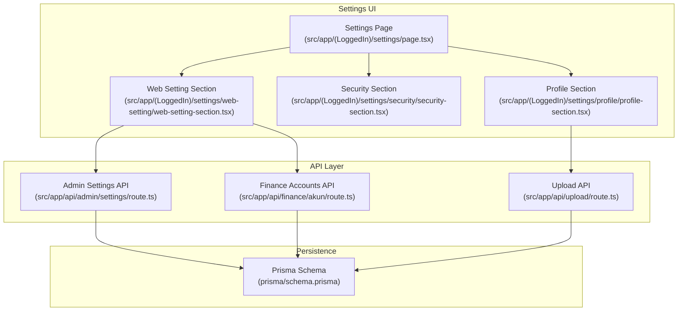
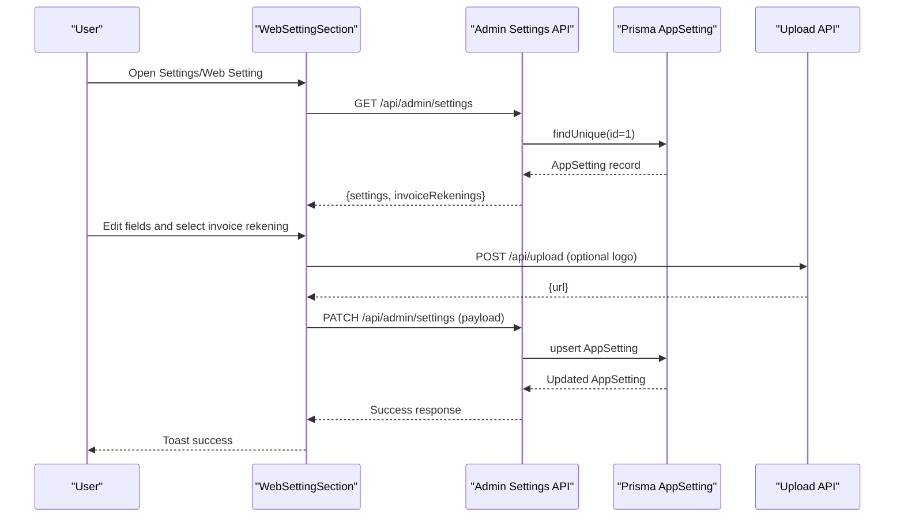
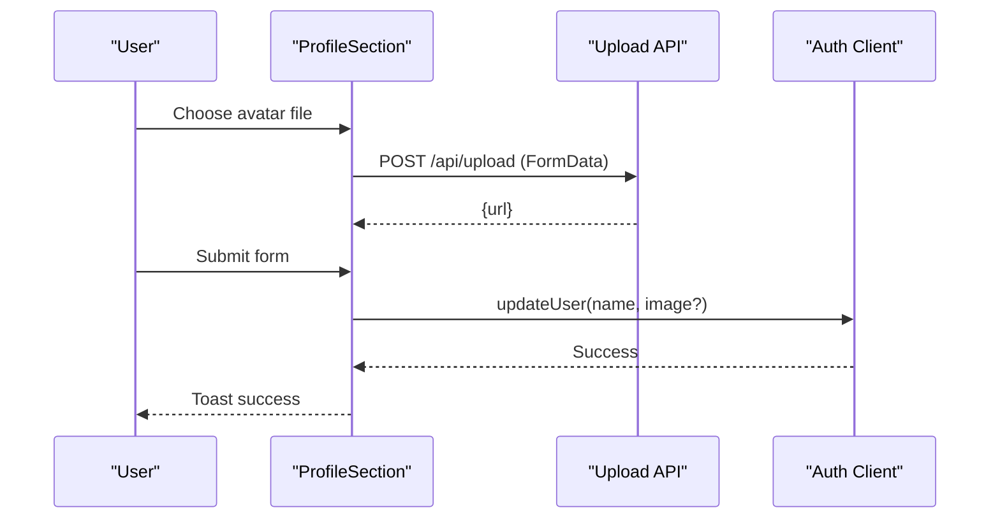
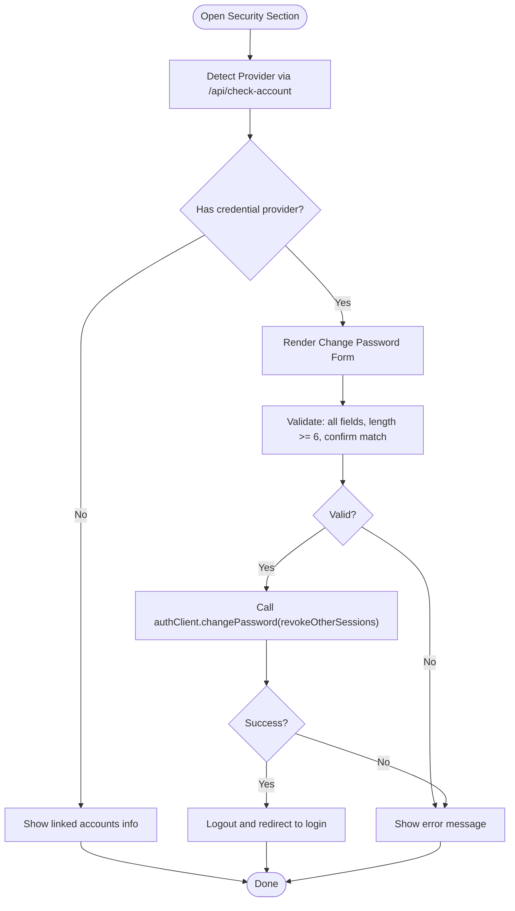
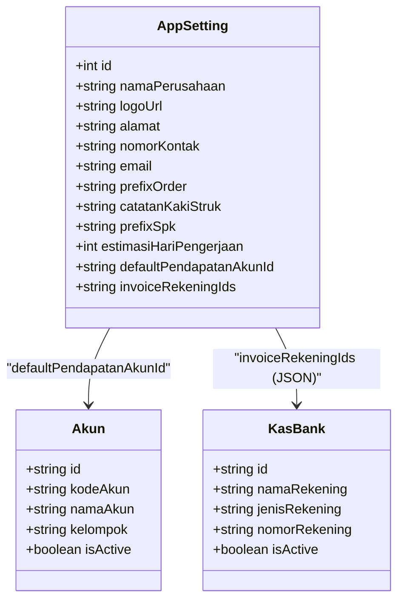
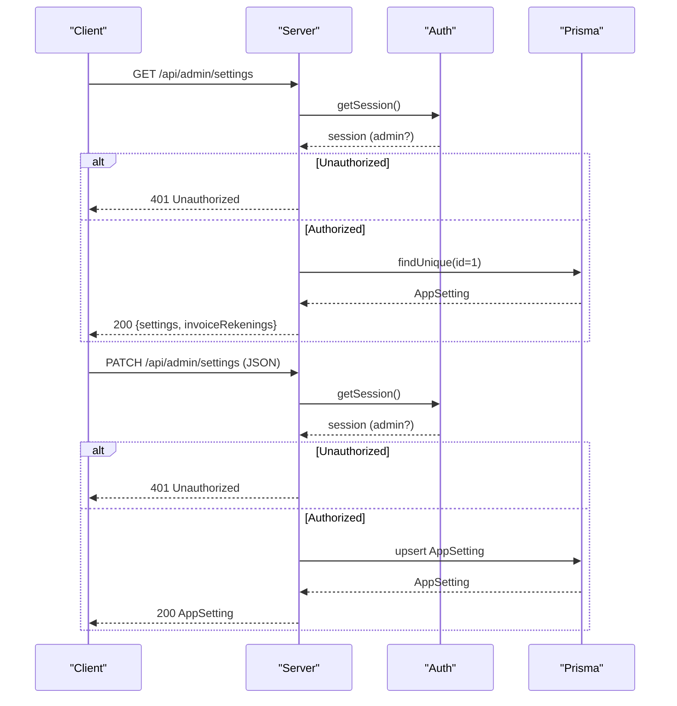
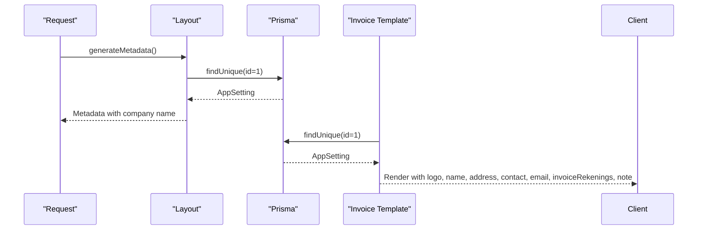
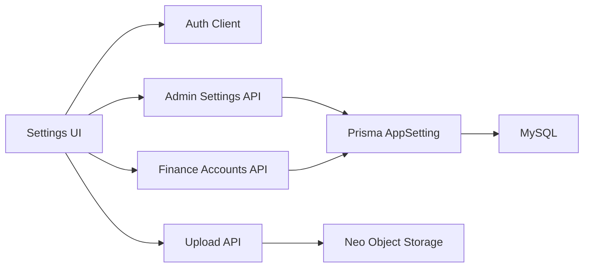

# System Settings & Preferences

<cite>
**Referenced Files in This Document**
- [page.tsx](file://src/app/(LoggedIn)/settings/page.tsx)
- [profile-section.tsx](file://src/app/(LoggedIn)/settings/profile/profile-section.tsx)
- [security-section.tsx](file://src/app/(LoggedIn)/settings/security/security-section.tsx)
- [web-setting-section.tsx](file://src/app/(LoggedIn)/settings/web-setting/web-setting-section.tsx)
- [route.ts](file://src/app/api/admin/settings/route.ts)
- [layout.tsx](file://src/app/(LoggedIn)/layout.tsx)
- [invoice-template.tsx](file://src/app/(LoggedIn)/order/[id]/components/invoice-template.tsx)
- [route.ts](file://src/app/api/upload/route.ts)
- [schema.prisma](file://prisma/schema.prisma)
- [route.ts](file://src/app/api/finance/akun/route.ts)
- [storage.ts](file://src/lib/storage.ts)
</cite>

## Table of Contents
1. [Introduction](#introduction)
2. [Project Structure](#project-structure)
3. [Core Components](#core-components)
4. [Architecture Overview](#architecture-overview)
5. [Detailed Component Analysis](#detailed-component-analysis)
6. [Dependency Analysis](#dependency-analysis)
7. [Performance Considerations](#performance-considerations)
8. [Troubleshooting Guide](#troubleshooting-guide)
9. [Conclusion](#conclusion)

## Introduction
This document explains the system-wide settings and preferences management for the Point of Sale and Production Management application. It covers:
- Settings interface components: profile settings, security settings, and web configuration options
- Settings API endpoints, validation, and persistence mechanisms
- Company information, financial mapping, invoice preferences, and localization options
- Practical examples of customization, user preference management, and system-wide configuration changes
- Validation, defaults, and troubleshooting

## Project Structure
The settings feature is organized under a dedicated settings page with three functional sections:
- Profile settings for personal user data and avatar
- Security settings for password change and linked accounts
- Web setting for company identity, transaction preferences, production preferences, financial mapping, and invoice rekening

**Diagram sources**
- [page.tsx](file://src/app/(LoggedIn)/settings/page.tsx#L1-L113)
- [profile-section.tsx](file://src/app/(LoggedIn)/settings/profile/profile-section.tsx#L1-L297)
- [security-section.tsx](file://src/app/(LoggedIn)/settings/security/security-section.tsx#L1-L294)
- [web-setting-section.tsx](file://src/app/(LoggedIn)/settings/web-setting/web-setting-section.tsx#L1-L421)
- [route.ts:1-110](file://src/app/api/admin/settings/route.ts#L1-L110)
- [route.ts:1-75](file://src/app/api/upload/route.ts#L1-L75)
- [route.ts:1-153](file://src/app/api/finance/akun/route.ts#L1-L153)
- [schema.prisma:569-597](file://prisma/schema.prisma#L569-L597)

**Section sources**
- [page.tsx](file://src/app/(LoggedIn)/settings/page.tsx#L1-L113)

## Core Components
- Settings Page: Hosts navigation and renders the selected section (Profile, Security, Web Setting). Role-based visibility hides Web Setting for non-admins.
- Profile Section: Updates user name and avatar; supports image upload and avatar picker.
- Security Section: Changes password for credential-based accounts and displays linked accounts.
- Web Setting Section: Manages company identity, transaction and POS preferences, production preferences, default income account mapping, and invoice rekening selection.
- Admin Settings API: Retrieves and updates AppSetting records with validation and serialization.
- Upload API: Handles image uploads to object storage and returns a public URL.
- Finance Accounts API: Provides active chart of accounts for mapping default income account.
- Prisma Schema: Defines AppSetting and related entities (Akun, KasBank).

**Section sources**
- [page.tsx](file://src/app/(LoggedIn)/settings/page.tsx#L18-L63)
- [profile-section.tsx](file://src/app/(LoggedIn)/settings/profile/profile-section.tsx#L14-L127)
- [security-section.tsx](file://src/app/(LoggedIn)/settings/security/security-section.tsx#L14-L102)
- [web-setting-section.tsx](file://src/app/(LoggedIn)/settings/web-setting/web-setting-section.tsx#L20-L129)
- [route.ts:6-42](file://src/app/api/admin/settings/route.ts#L6-L42)
- [route.ts:6-74](file://src/app/api/upload/route.ts#L6-L74)
- [route.ts:28-59](file://src/app/api/finance/akun/route.ts#L28-L59)
- [schema.prisma:569-597](file://prisma/schema.prisma#L569-L597)

## Architecture Overview
The settings subsystem integrates UI components, API routes, and persistent storage. The Web Setting section fetches data from multiple endpoints and persists changes via a single endpoint.

**Diagram sources**
- [web-setting-section.tsx](file://src/app/(LoggedIn)/settings/web-setting/web-setting-section.tsx#L30-L129)
- [route.ts:6-109](file://src/app/api/admin/settings/route.ts#L6-L109)
- [route.ts:6-74](file://src/app/api/upload/route.ts#L6-L74)
- [schema.prisma:569-597](file://prisma/schema.prisma#L569-L597)

## Detailed Component Analysis

### Settings Page Navigation
- Renders three tabs: Profile, Security, Web Setting.
- On mobile, a dropdown selects the active section.
- Admin-only visibility for Web Setting.

**Section sources**
- [page.tsx](file://src/app/(LoggedIn)/settings/page.tsx#L18-L110)

### Profile Settings
- Loads current user name and avatar preview from session.
- Supports selecting an avatar from device or built-in collection.
- Validates image type and size before upload.
- Uploads to object storage and updates user profile.

**Diagram sources**
- [profile-section.tsx](file://src/app/(LoggedIn)/settings/profile/profile-section.tsx#L77-L127)
- [route.ts:6-74](file://src/app/api/upload/route.ts#L6-L74)

**Section sources**
- [profile-section.tsx](file://src/app/(LoggedIn)/settings/profile/profile-section.tsx#L14-L127)
- [route.ts:6-74](file://src/app/api/upload/route.ts#L6-L74)

### Security Settings
- Detects linked account provider via a dedicated endpoint.
- Validates new password length and confirmation match.
- Calls auth service to change password and revokes other sessions.
- Redirects to login after successful change.

**Diagram sources**
- [security-section.tsx](file://src/app/(LoggedIn)/settings/security/security-section.tsx#L18-L102)

**Section sources**
- [security-section.tsx](file://src/app/(LoggedIn)/settings/security/security-section.tsx#L14-L102)

### Web Setting (Company Identity, Preferences, Financial Mapping)
- Fetches:
  - AppSetting (company identity, prefixes, defaults)
  - Active chart of accounts for default income account selection
  - Active bank cash accounts for invoice rekening selection
- Allows uploading a new logo and persisting all settings via a single PATCH endpoint.
- Serializes invoice rekening IDs to JSON string for storage.

**Diagram sources**
- [schema.prisma:569-597](file://prisma/schema.prisma#L569-L597)
- [route.ts:74-103](file://src/app/api/admin/settings/route.ts#L74-L103)

**Section sources**
- [web-setting-section.tsx](file://src/app/(LoggedIn)/settings/web-setting/web-setting-section.tsx#L20-L129)
- [route.ts:6-109](file://src/app/api/admin/settings/route.ts#L6-L109)
- [route.ts:28-59](file://src/app/api/finance/akun/route.ts#L28-L59)
- [schema.prisma:569-597](file://prisma/schema.prisma#L569-L597)

### Settings API Endpoints
- GET /api/admin/settings
  - Requires admin session
  - Returns AppSetting plus resolved invoice rekening list
- PATCH /api/admin/settings
  - Requires admin session
  - Upserts AppSetting with sanitized numeric and JSON fields

**Diagram sources**
- [route.ts:6-109](file://src/app/api/admin/settings/route.ts#L6-L109)

**Section sources**
- [route.ts:6-109](file://src/app/api/admin/settings/route.ts#L6-L109)

### Persistence Mechanisms
- AppSetting is a singleton row with ID 1.
- invoiceRekeningIds stored as JSON string of KasBank IDs.
- defaultPendapatanAkunId references Akun.
- Logo URLs stored as public URLs returned by upload API.

**Section sources**
- [schema.prisma:569-597](file://prisma/schema.prisma#L569-L597)
- [route.ts:74-103](file://src/app/api/admin/settings/route.ts#L74-L103)
- [route.ts:60-68](file://src/app/api/upload/route.ts#L60-L68)

### Localization and Presentation
- Company name and description are injected into page metadata.
- Invoice template uses settings for company branding and footer note.

**Diagram sources**
- [layout.tsx](file://src/app/(LoggedIn)/layout.tsx#L19-L37)
- [invoice-template.tsx](file://src/app/(LoggedIn)/order/[id]/components/invoice-template.tsx#L9-L126)
- [schema.prisma:569-597](file://prisma/schema.prisma#L569-L597)

**Section sources**
- [layout.tsx](file://src/app/(LoggedIn)/layout.tsx#L19-L37)
- [invoice-template.tsx](file://src/app/(LoggedIn)/order/[id]/components/invoice-template.tsx#L9-L126)

## Dependency Analysis
- Settings UI depends on:
  - Auth client for session and user updates
  - Upload API for images
  - Finance Accounts API for default income account mapping
  - Admin Settings API for persisted configuration
- Backend depends on:
  - Prisma AppSetting model
  - Neo Object Storage for public image URLs

**Diagram sources**
- [page.tsx](file://src/app/(LoggedIn)/settings/page.tsx#L1-L17)
- [profile-section.tsx](file://src/app/(LoggedIn)/settings/profile/profile-section.tsx#L104-L107)
- [web-setting-section.tsx](file://src/app/(LoggedIn)/settings/web-setting/web-setting-section.tsx#L103-L107)
- [route.ts:1-4](file://src/app/api/admin/settings/route.ts#L1-L4)
- [route.ts:1-4](file://src/app/api/upload/route.ts#L1-L4)
- [route.ts:1-6](file://src/app/api/finance/akun/route.ts#L1-L6)
- [schema.prisma:569-597](file://prisma/schema.prisma#L569-L597)
- [storage.ts:48-69](file://src/lib/storage.ts#L48-L69)

**Section sources**
- [page.tsx](file://src/app/(LoggedIn)/settings/page.tsx#L1-L17)
- [profile-section.tsx](file://src/app/(LoggedIn)/settings/profile/profile-section.tsx#L104-L107)
- [web-setting-section.tsx](file://src/app/(LoggedIn)/settings/web-setting/web-setting-section.tsx#L103-L107)
- [route.ts:1-4](file://src/app/api/admin/settings/route.ts#L1-L4)
- [route.ts:1-4](file://src/app/api/upload/route.ts#L1-L4)
- [route.ts:1-6](file://src/app/api/finance/akun/route.ts#L1-L6)
- [schema.prisma:569-597](file://prisma/schema.prisma#L569-L597)
- [storage.ts:48-69](file://src/lib/storage.ts#L48-L69)

## Performance Considerations
- Parallelize initial loads in Web Setting section to reduce perceived latency.
- Debounce user input for numeric fields to avoid frequent updates.
- Cache frequently accessed AppSetting data in client-side state to minimize network requests.
- Limit invoice rekening list rendering to visible items if lists grow large.

## Troubleshooting Guide
Common issues and resolutions:
- Unauthorized Access
  - Symptom: 401 errors when accessing settings endpoints.
  - Cause: Missing or insufficient admin session.
  - Resolution: Ensure admin login and session validity.
  - Section sources
    - [route.ts:11-13](file://src/app/api/admin/settings/route.ts#L11-L13)
- Invalid Image Upload
  - Symptom: Upload fails with validation errors.
  - Causes: Non-image file type, file size > 5MB.
  - Resolution: Select a valid image under 5MB.
  - Section sources
    - [route.ts:25-38](file://src/app/api/upload/route.ts#L25-L38)
- JSON Parsing Errors for Rekening IDs
  - Symptom: Invoice rekening list not loading.
  - Cause: Malformed JSON string in invoiceRekeningIds.
  - Resolution: Ensure stored JSON is a valid array string; backend serializes arrays to JSON.
  - Section sources
    - [route.ts:25-35](file://src/app/api/admin/settings/route.ts#L25-L35)
    - [route.ts:70-72](file://src/app/api/admin/settings/route.ts#L70-L72)
- Numeric Defaults
  - Symptom: Unexpected zero or default values for numeric fields.
  - Cause: Missing or invalid numeric input.
  - Resolution: Ensure numeric inputs are integers; backend falls back to safe defaults.
  - Section sources
    - [route.ts:84-98](file://src/app/api/admin/settings/route.ts#L84-L98)
- Metadata Not Updating
  - Symptom: Browser tab title or description not reflecting company name.
  - Cause: Cached metadata or missing settings record.
  - Resolution: Verify AppSetting exists; refresh page; ensure Prisma query succeeds.
  - Section sources
    - [layout.tsx](file://src/app/(LoggedIn)/layout.tsx#L19-L37)
    - [schema.prisma:569-572](file://prisma/schema.prisma#L569-L572)

## Conclusion
The settings subsystem provides a cohesive interface for managing user profiles, security, and system-wide configurations. It leverages role-based access, robust validation, and a centralized persistence model to maintain consistency across the application. By following the documented patterns and troubleshooting steps, administrators can confidently customize company identity, preferences, and financial mappings while ensuring reliability and performance.