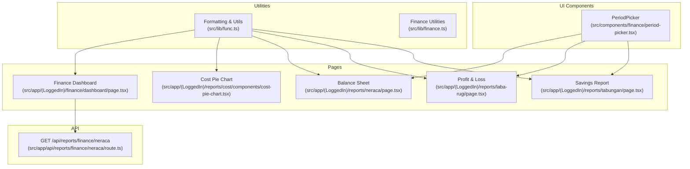
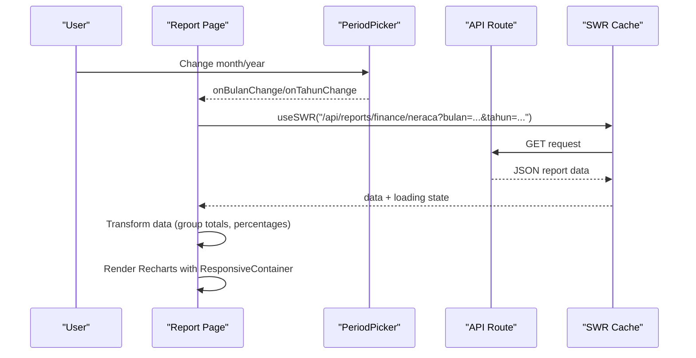
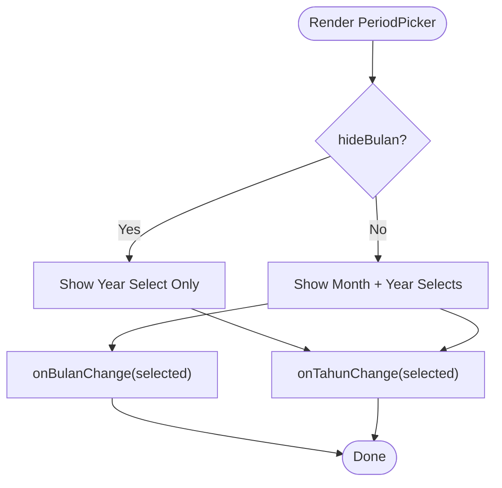
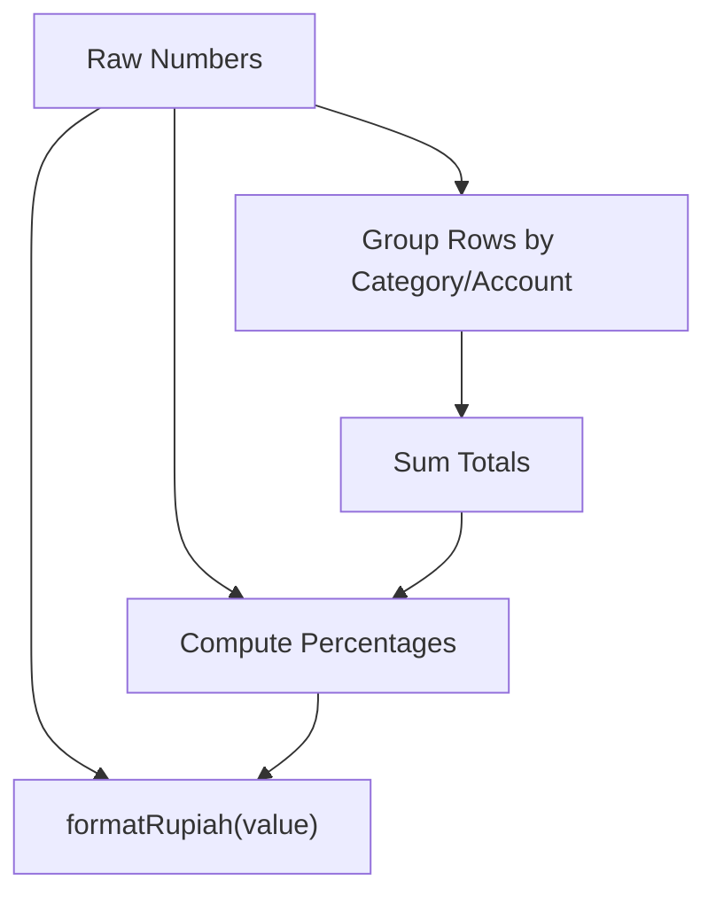
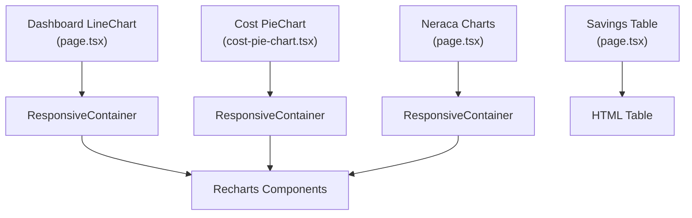
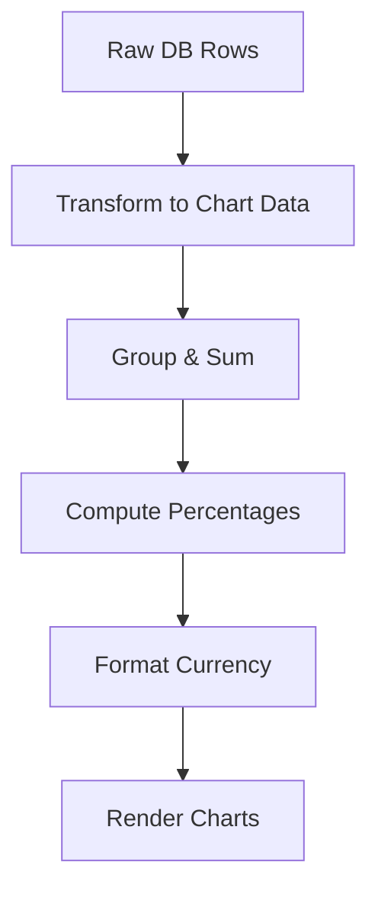
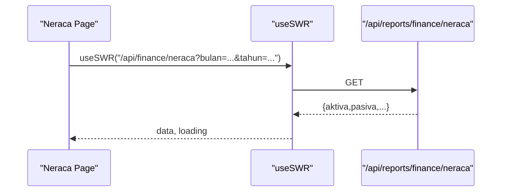
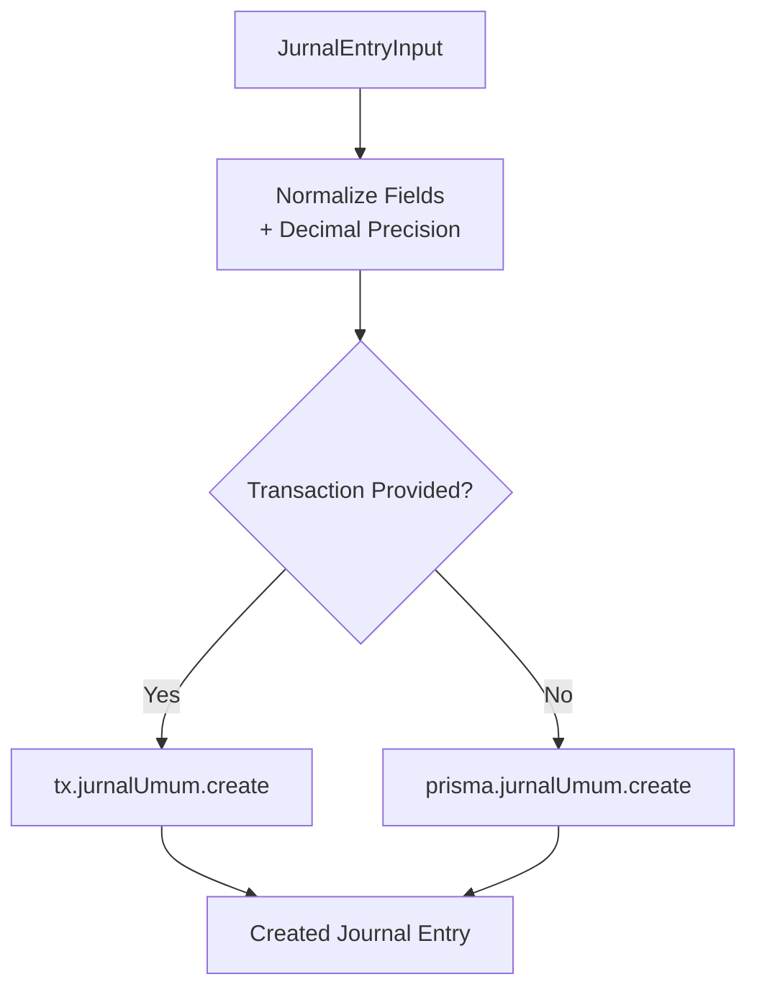
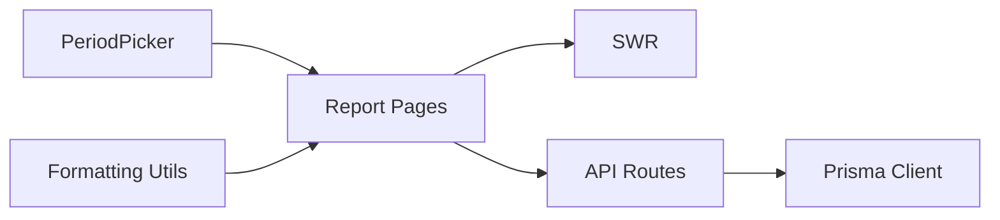

# Analytics Components

<cite>
**Referenced Files in This Document**
- [period-picker.tsx](file://src/components/finance/period-picker.tsx)
- [finance.ts](file://src/lib/finance.ts)
- [func.ts](file://src/lib/func.ts)
- [page.tsx](file://src/app/(LoggedIn)/finance/dashboard/page.tsx)
- [cost-pie-chart.tsx](file://src/app/(LoggedIn)/reports/cost/components/cost-pie-chart.tsx)
- [page.tsx](file://src/app/(LoggedIn)/reports/neraca/page.tsx)
- [page.tsx](file://src/app/(LoggedIn)/reports/laba-rugi/page.tsx)
- [page.tsx](file://src/app/(LoggedIn)/reports/tabungan/page.tsx)
- [route.ts](file://src/app/api/reports/finance/neraca/route.ts)
</cite>

## Table of Contents
1. [Introduction](#introduction)
2. [Project Structure](#project-structure)
3. [Core Components](#core-components)
4. [Architecture Overview](#architecture-overview)
5. [Detailed Component Analysis](#detailed-component-analysis)
6. [Dependency Analysis](#dependency-analysis)
7. [Performance Considerations](#performance-considerations)
8. [Troubleshooting Guide](#troubleshooting-guide)
9. [Conclusion](#conclusion)
10. [Appendices](#appendices)

## Introduction
This document explains the analytics components and utilities used for financial reporting and visualization. It covers:
- The period picker component for selecting months and years
- Financial data processing utilities for formatting and calculations
- Chart rendering with Recharts, including responsive design
- Data transformation utilities for converting database query results into visualization-ready formats
- Caching and performance optimization via SWR
- Accessibility, internationalization, and mobile responsiveness

## Project Structure
The analytics features are organized across:
- Shared UI component for period selection
- Utility libraries for formatting and financial operations
- Report pages that render charts and summaries
- API routes that compute aggregated financial data

**Diagram sources**
- [period-picker.tsx:1-53](file://src/components/finance/period-picker.tsx#L1-L53)
- [func.ts:1-70](file://src/lib/func.ts#L1-L70)
- [finance.ts:1-55](file://src/lib/finance.ts#L1-L55)
- [page.tsx](file://src/app/(LoggedIn)/finance/dashboard/page.tsx#L1-L916)
- [cost-pie-chart.tsx](file://src/app/(LoggedIn)/reports/cost/components/cost-pie-chart.tsx#L1-L209)
- [page.tsx](file://src/app/(LoggedIn)/reports/neraca/page.tsx#L1-L401)
- [page.tsx](file://src/app/(LoggedIn)/reports/laba-rugi/page.tsx#L1-L340)
- [page.tsx](file://src/app/(LoggedIn)/reports/tabungan/page.tsx#L1-L284)
- [route.ts:1-33](file://src/app/api/reports/finance/neraca/route.ts#L1-L33)

**Section sources**
- [period-picker.tsx:1-53](file://src/components/finance/period-picker.tsx#L1-L53)
- [func.ts:1-70](file://src/lib/func.ts#L1-L70)
- [finance.ts:1-55](file://src/lib/finance.ts#L1-L55)
- [page.tsx](file://src/app/(LoggedIn)/finance/dashboard/page.tsx#L1-L916)
- [cost-pie-chart.tsx](file://src/app/(LoggedIn)/reports/cost/components/cost-pie-chart.tsx#L1-L209)
- [page.tsx](file://src/app/(LoggedIn)/reports/neraca/page.tsx#L1-L401)
- [page.tsx](file://src/app/(LoggedIn)/reports/laba-rugi/page.tsx#L1-L340)
- [page.tsx](file://src/app/(LoggedIn)/reports/tabungan/page.tsx#L1-L284)
- [route.ts:1-33](file://src/app/api/reports/finance/neraca/route.ts#L1-L33)

## Core Components
- Period Picker: A lightweight selector for month and year with optional hiding of month selection. It emits selection changes to parent components.
- Formatting and Utilities: Functions for Indonesian currency formatting, date formatting, parsing thousands-formatted strings, and a generic fetcher for SWR.
- Finance Utilities: A utility to create double-entry journal records with normalized decimal values and transaction support.
- Chart Components: Recharts-based visualizations for trends, expenses by account, balance sheet composition, and savings allocation.

**Section sources**
- [period-picker.tsx:1-53](file://src/components/finance/period-picker.tsx#L1-L53)
- [func.ts:42-70](file://src/lib/func.ts#L42-L70)
- [finance.ts:21-55](file://src/lib/finance.ts#L21-L55)
- [cost-pie-chart.tsx](file://src/app/(LoggedIn)/reports/cost/components/cost-pie-chart.tsx#L1-L209)

## Architecture Overview
The analytics architecture follows a client-driven pattern:
- Pages use SWR to fetch report data from API routes
- PeriodPicker updates query parameters for month/year
- Formatting utilities convert raw numbers into localized currency strings
- Recharts renders responsive charts with custom tooltips and legends
- Data transformation occurs in pages to group and aggregate rows for visualization

**Diagram sources**
- [page.tsx](file://src/app/(LoggedIn)/reports/neraca/page.tsx#L192-L246)
- [period-picker.tsx:19-50](file://src/components/finance/period-picker.tsx#L19-L50)
- [route.ts:13-33](file://src/app/api/reports/finance/neraca/route.ts#L13-L33)
- [page.tsx](file://src/app/(LoggedIn)/finance/dashboard/page.tsx#L248-L251)

## Detailed Component Analysis

### Period Picker Component
- Purpose: Allow users to pick month and year for analytics views; optionally hide month selection.
- Behavior:
  - Renders two selects: month and year
  - Uses a predefined month label map and a fixed year range
  - Emits selection change events to parent handlers
- Accessibility and internationalization:
  - Month labels are in Indonesian
  - Select components use accessible variants and labels
- Mobile responsiveness:
  - Compact select sizes and flexible layout enable mobile-friendly usage

**Diagram sources**
- [period-picker.tsx:19-50](file://src/components/finance/period-picker.tsx#L19-L50)

**Section sources**
- [period-picker.tsx:1-53](file://src/components/finance/period-picker.tsx#L1-L53)

### Financial Data Processing Utilities
- Currency formatting: Localized Indonesian Rupiah formatting without decimals
- Percentage calculation helpers: Used across pages to compute share of totals
- Data aggregation functions: Grouping and summing rows by categories or accounts
- Fetcher: Generic fetcher for SWR to hydrate pages with server data

**Diagram sources**
- [func.ts:42-70](file://src/lib/func.ts#L42-L70)
- [page.tsx](file://src/app/(LoggedIn)/finance/dashboard/page.tsx#L259-L278)

**Section sources**
- [func.ts:42-70](file://src/lib/func.ts#L42-L70)
- [page.tsx](file://src/app/(LoggedIn)/finance/dashboard/page.tsx#L259-L278)

### Chart Rendering Components
- Finance Dashboard Line Chart:
  - Responsive container with fixed height
  - Axis formatters for compact labels
  - Tooltips and legends with localized currency formatting
- Cost Distribution Pie Chart:
  - Donut chart with center label and custom tooltip
  - Legend with truncated labels and percentages
- Balance Sheet Pie Charts:
  - Multiple pie charts for asset liquidity, liabilities, and equity
  - Color schemes and tooltips with localized currency formatting
- Savings Allocation Table:
  - Aggregated monthly totals per category
  - Responsive table with totals and best month computation

**Diagram sources**
- [page.tsx](file://src/app/(LoggedIn)/finance/dashboard/page.tsx#L388-L426)
- [cost-pie-chart.tsx](file://src/app/(LoggedIn)/reports/cost/components/cost-pie-chart.tsx#L154-L197)
- [page.tsx](file://src/app/(LoggedIn)/reports/neraca/page.tsx#L69-L95)
- [page.tsx](file://src/app/(LoggedIn)/reports/tabungan/page.tsx#L192-L280)

**Section sources**
- [page.tsx](file://src/app/(LoggedIn)/finance/dashboard/page.tsx#L388-L426)
- [cost-pie-chart.tsx](file://src/app/(LoggedIn)/reports/cost/components/cost-pie-chart.tsx#L154-L197)
- [page.tsx](file://src/app/(LoggedIn)/reports/neraca/page.tsx#L59-L96)
- [page.tsx](file://src/app/(LoggedIn)/reports/tabungan/page.tsx#L192-L280)

### Data Transformation Utilities
- Dashboard trend data: Transformed into label-value pairs for line chart
- Expense grouping: Aggregates operational costs into named buckets
- Income breakdown: Computes percentage shares of revenue streams
- Balance sheet composition: Converts journal entries into asset/liability/equity slices
- Savings allocation: Builds monthly totals per category and computes best performing month

**Diagram sources**
- [page.tsx](file://src/app/(LoggedIn)/finance/dashboard/page.tsx#L259-L298)
- [page.tsx](file://src/app/(LoggedIn)/reports/neraca/page.tsx#L59-L65)
- [page.tsx](file://src/app/(LoggedIn)/reports/tabungan/page.tsx#L48-L66)

**Section sources**
- [page.tsx](file://src/app/(LoggedIn)/finance/dashboard/page.tsx#L259-L298)
- [page.tsx](file://src/app/(LoggedIn)/reports/neraca/page.tsx#L59-L65)
- [page.tsx](file://src/app/(LoggedIn)/reports/tabungan/page.tsx#L48-L66)

### API Integration and Caching
- SWR is used to fetch report data with automatic caching and revalidation
- PeriodPicker updates query parameters, triggering SWR to refetch
- Example: Balance Sheet endpoint aggregates journals up to a given month and year

**Diagram sources**
- [page.tsx](file://src/app/(LoggedIn)/reports/neraca/page.tsx#L197-L200)
- [route.ts:13-33](file://src/app/api/reports/finance/neraca/route.ts#L13-L33)

**Section sources**
- [page.tsx](file://src/app/(LoggedIn)/reports/neraca/page.tsx#L197-L200)
- [route.ts:13-33](file://src/app/api/reports/finance/neraca/route.ts#L13-L33)

### Double-Entry Journal Utility
- Creates normalized journal entries with decimal precision
- Supports optional transaction client for atomic writes
- Ensures null handling for optional fields

**Diagram sources**
- [finance.ts:26-54](file://src/lib/finance.ts#L26-L54)

**Section sources**
- [finance.ts:21-55](file://src/lib/finance.ts#L21-L55)

## Dependency Analysis
- UI depends on:
  - PeriodPicker for month/year selection
  - Formatting utilities for currency and dates
  - Recharts for visualization
- Pages depend on:
  - SWR for caching and fetching
  - API routes for computed aggregates
- API routes depend on:
  - Authentication middleware
  - Prisma for querying and aggregating journal entries

**Diagram sources**
- [period-picker.tsx:1-53](file://src/components/finance/period-picker.tsx#L1-L53)
- [func.ts:1-70](file://src/lib/func.ts#L1-L70)
- [page.tsx](file://src/app/(LoggedIn)/finance/dashboard/page.tsx#L1-L916)
- [route.ts:1-33](file://src/app/api/reports/finance/neraca/route.ts#L1-L33)

**Section sources**
- [period-picker.tsx:1-53](file://src/components/finance/period-picker.tsx#L1-L53)
- [func.ts:1-70](file://src/lib/func.ts#L1-L70)
- [page.tsx](file://src/app/(LoggedIn)/finance/dashboard/page.tsx#L1-L916)
- [route.ts:1-33](file://src/app/api/reports/finance/neraca/route.ts#L1-L33)

## Performance Considerations
- Caching: SWR caches responses keyed by URL, reducing redundant network requests
- Responsive charts: ResponsiveContainer adapts to viewport changes without remounting
- Minimal re-renders: useSWR’s internal cache avoids unnecessary computations
- Efficient aggregation: Grouping and summing occur in memory after fetching
- Lazy loading: Skeleton loaders improve perceived performance during initial load

[No sources needed since this section provides general guidance]

## Troubleshooting Guide
- PeriodPicker does not update charts:
  - Verify that onBulanChange/onTahunChange update state and trigger SWR refetch
- Charts show empty data:
  - Confirm API route returns data for the selected period
  - Check that transform functions handle missing rows gracefully
- Currency formatting issues:
  - Ensure values are numbers before formatting; avoid passing NaN or undefined
- SWR not refreshing:
  - Verify query keys change when month/year change
  - Check for runtime errors in API route that would prevent response

**Section sources**
- [page.tsx](file://src/app/(LoggedIn)/reports/neraca/page.tsx#L197-L200)
- [page.tsx](file://src/app/(LoggedIn)/reports/laba-rugi/page.tsx#L141-L144)
- [func.ts:42-49](file://src/lib/func.ts#L42-L49)

## Conclusion
The analytics system combines a simple period picker, robust formatting utilities, and Recharts-based visualizations to deliver responsive, localized financial insights. SWR provides efficient caching and real-time updates, while API routes aggregate data from the database. The modular design allows easy extension to new reports and visualizations.

[No sources needed since this section summarizes without analyzing specific files]

## Appendices

### Accessibility Features
- Select components use accessible labels and variants
- Tooltips and legends provide contextual information
- Sufficient color contrast and readable typography

**Section sources**
- [period-picker.tsx:20-50](file://src/components/finance/period-picker.tsx#L20-L50)
- [cost-pie-chart.tsx](file://src/app/(LoggedIn)/reports/cost/components/cost-pie-chart.tsx#L34-L50)

### Internationalization Support
- Indonesian month labels and currency formatting
- Date formatting using Indonesian locale
- Thousands separators and currency symbols aligned with local standards

**Section sources**
- [period-picker.tsx:5-8](file://src/components/finance/period-picker.tsx#L5-L8)
- [func.ts:42-65](file://src/lib/func.ts#L42-L65)

### Mobile Responsiveness
- Compact select sizes and flexible layouts
- Responsive containers adapt to small screens
- Skeleton loaders improve UX on slower connections

**Section sources**
- [period-picker.tsx:22-47](file://src/components/finance/period-picker.tsx#L22-L47)
- [page.tsx](file://src/app/(LoggedIn)/finance/dashboard/page.tsx#L388-L426)
- [page.tsx](file://src/app/(LoggedIn)/reports/tabungan/page.tsx#L178-L191)