# Dashboard & Analytics

<cite>
**Referenced Files in This Document**
- [page.tsx](file://src/app/(LoggedIn)/dashboard/page.tsx)
- [page.tsx](file://src/app/(LoggedIn)/finance/dashboard/page.tsx)
- [route.ts](file://src/app/api/finance/dashboard/route.ts)
- [period-picker.tsx](file://src/components/finance/period-picker.tsx)
- [page.tsx](file://src/app/(LoggedIn)/reports/laba-rugi/page.tsx)
- [route.ts](file://src/app/api/reports/finance/laba-rugi/route.ts)
- [page.tsx](file://src/app/(LoggedIn)/reports/neraca/page.tsx)
- [page.tsx](file://src/app/(LoggedIn)/reports/piutang/page.tsx)
- [page.tsx](file://src/app/(LoggedIn)/reports/cost/page.tsx)
- [page.tsx](file://src/app/(LoggedIn)/reports/tabungan/page.tsx)
- [finance.ts](file://src/lib/finance.ts)
</cite>

## Table of Contents
1. [Introduction](#introduction)
2. [Project Structure](#project-structure)
3. [Core Components](#core-components)
4. [Architecture Overview](#architecture-overview)
5. [Detailed Component Analysis](#detailed-component-analysis)
6. [Dependency Analysis](#dependency-analysis)
7. [Performance Considerations](#performance-considerations)
8. [Troubleshooting Guide](#troubleshooting-guide)
9. [Conclusion](#conclusion)
10. [Appendices](#appendices)

## Introduction
This document explains the dashboard and analytics system, focusing on:
- Dashboard architecture and real-time data visualization
- Finance dashboard functionality: revenue tracking, expense monitoring, profit calculations, and financial trend analysis
- Period picker functionality and data aggregation
- Chart rendering with Recharts
- Practical examples for customization, metric configuration, and real-time updates
- Performance optimization, caching strategies, and user-specific personalization
- Integration across business modules and data sources

## Project Structure
The dashboard and analytics system spans UI pages, shared components, and backend API routes:
- Business dashboards: main operational dashboard and finance-focused dashboard
- Reports: Profit & Loss, Balance Sheet, Receivables, Expenses, Savings
- Shared components: reusable period picker and chart utilities
- Backend APIs: secure endpoints aggregating data from the database

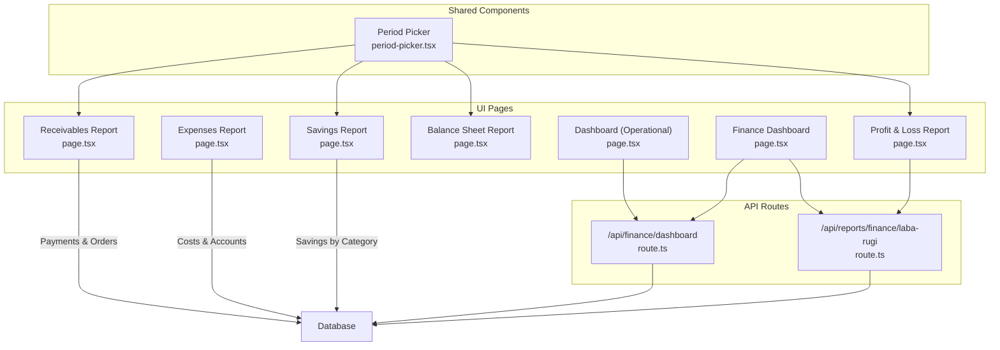

**Diagram sources**
- [page.tsx](file://src/app/(LoggedIn)/dashboard/page.tsx#L151-L475)
- [page.tsx](file://src/app/(LoggedIn)/finance/dashboard/page.tsx#L215-L566)
- [route.ts:12-259](file://src/app/api/finance/dashboard/route.ts#L12-L259)
- [page.tsx](file://src/app/(LoggedIn)/reports/laba-rugi/page.tsx#L136-L340)
- [route.ts:104-122](file://src/app/api/reports/finance/laba-rugi/route.ts#L104-L122)
- [period-picker.tsx:19-50](file://src/components/finance/period-picker.tsx#L19-L50)

**Section sources**
- [page.tsx](file://src/app/(LoggedIn)/dashboard/page.tsx#L151-L475)
- [page.tsx](file://src/app/(LoggedIn)/finance/dashboard/page.tsx#L215-L566)
- [route.ts:12-259](file://src/app/api/finance/dashboard/route.ts#L12-L259)
- [page.tsx](file://src/app/(LoggedIn)/reports/laba-rugi/page.tsx#L136-L340)
- [route.ts:104-122](file://src/app/api/reports/finance/laba-rugi/route.ts#L104-L122)
- [period-picker.tsx:19-50](file://src/components/finance/period-picker.tsx#L19-L50)

## Core Components
- Dashboard pages:
  - Operational dashboard: presents sales, customers, active orders, receivables, low stock alerts, and recent orders with weekly revenue vs expenses area chart.
  - Finance dashboard: KPI cards, monthly trend line chart, operational cost breakdown bar chart, income detail progress bars, and detailed report tables.
- Shared period picker: month/year selection with controlled state and optional hiding of month selector.
- Reports:
  - Profit & Loss: aggregated by account groups, computes totals and margin.
  - Balance Sheet: asset/liability/equity composition with pie charts.
  - Receivables: monitor unpaid invoices, payment capture, and overdue reminders.
  - Expenses: filtered cost entries with pie distribution by account.
  - Savings: monthly allocation by category across the year.

**Section sources**
- [page.tsx](file://src/app/(LoggedIn)/dashboard/page.tsx#L151-L475)
- [page.tsx](file://src/app/(LoggedIn)/finance/dashboard/page.tsx#L215-L566)
- [period-picker.tsx:19-50](file://src/components/finance/period-picker.tsx#L19-L50)
- [page.tsx](file://src/app/(LoggedIn)/reports/laba-rugi/page.tsx#L136-L340)
- [page.tsx](file://src/app/(LoggedIn)/reports/neraca/page.tsx#L192-L401)
- [page.tsx](file://src/app/(LoggedIn)/reports/piutang/page.tsx#L349-L763)
- [page.tsx](file://src/app/(LoggedIn)/reports/cost/page.tsx#L38-L213)
- [page.tsx](file://src/app/(LoggedIn)/reports/tabungan/page.tsx#L38-L284)

## Architecture Overview
The system follows a client-server pattern:
- Client pages use SWR for data fetching and caching.
- API routes validate sessions, compute aggregates, and return structured JSON.
- Charts render via Recharts with responsive containers.
- Shared components encapsulate common UI patterns (period selection, tooltips, legends).

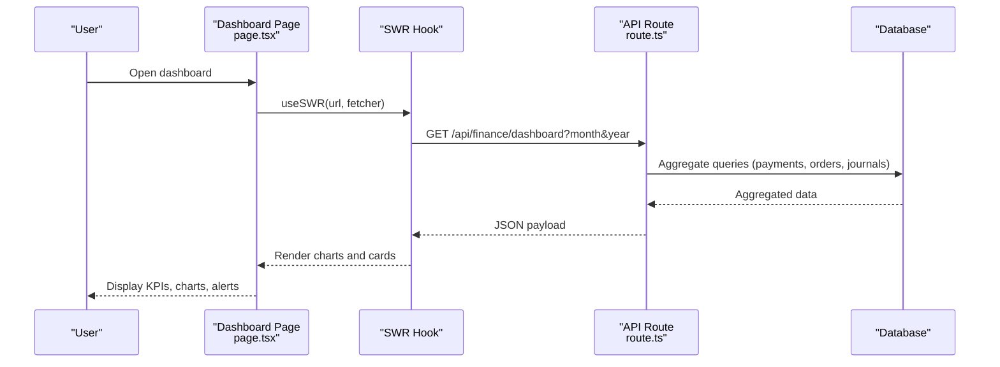

**Diagram sources**
- [page.tsx](file://src/app/(LoggedIn)/dashboard/page.tsx#L151-L160)
- [route.ts:12-259](file://src/app/api/finance/dashboard/route.ts#L12-L259)

**Section sources**
- [page.tsx](file://src/app/(LoggedIn)/dashboard/page.tsx#L151-L160)
- [route.ts:12-259](file://src/app/api/finance/dashboard/route.ts#L12-L259)

## Detailed Component Analysis

### Finance Dashboard Page
- Purpose: Consolidated financial KPIs, monthly trends, operational cost grouping, income detail distribution, and detailed report tables.
- Key features:
  - Period navigation with month/year controls.
  - KPI cards for total income, total expenses, net profit, margin, receivables.
  - Monthly trend line chart (income vs expenses).
  - Horizontal bar chart of operational costs grouped by categories.
  - Income detail progress bars and percentage contributions.
  - Detailed report tables for income and expenses.

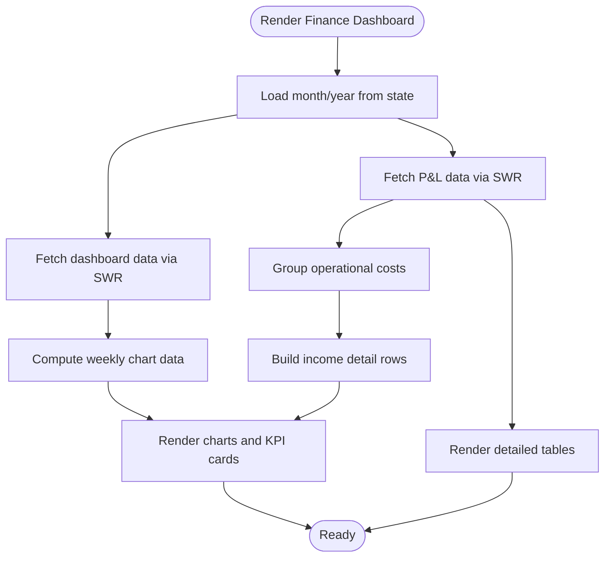

**Diagram sources**
- [page.tsx](file://src/app/(LoggedIn)/finance/dashboard/page.tsx#L215-L566)
- [route.ts:104-122](file://src/app/api/reports/finance/laba-rugi/route.ts#L104-L122)

**Section sources**
- [page.tsx](file://src/app/(LoggedIn)/finance/dashboard/page.tsx#L215-L566)
- [route.ts:104-122](file://src/app/api/reports/finance/laba-rugi/route.ts#L104-L122)

### Operational Dashboard Page
- Purpose: Real-time operational overview with quick KPIs, weekly revenue vs expenses, low stock alerts, and recent orders.
- Key features:
  - Stat cards for today’s sales, this month’s income, customers, active orders, this month’s expenses, net profit, receivables, and low stock count.
  - Weekly area chart comparing income and expenses.
  - Low stock alerts list with stock level chips.
  - Recent orders table with payment status chips.

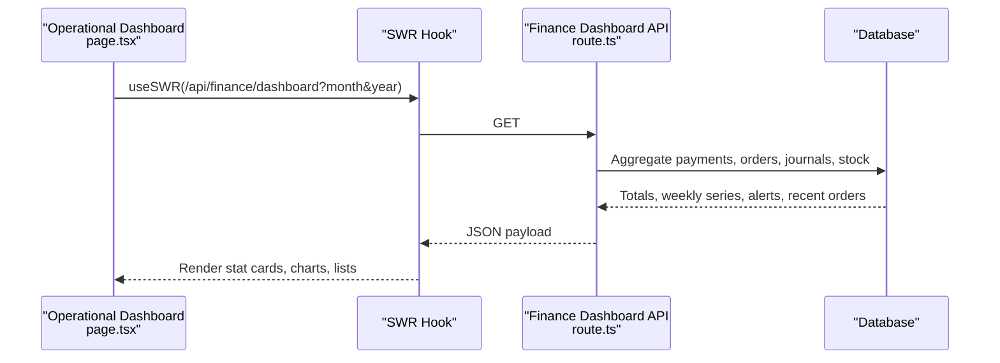

**Diagram sources**
- [page.tsx](file://src/app/(LoggedIn)/dashboard/page.tsx#L151-L160)
- [route.ts:12-259](file://src/app/api/finance/dashboard/route.ts#L12-L259)

**Section sources**
- [page.tsx](file://src/app/(LoggedIn)/dashboard/page.tsx#L151-L475)
- [route.ts:12-259](file://src/app/api/finance/dashboard/route.ts#L12-L259)

### Period Picker Component
- Purpose: Unified month/year selection across reports.
- Features:
  - Controlled selection with on change handlers.
  - Optional hiding of month selector.
  - Static month labels mapping.

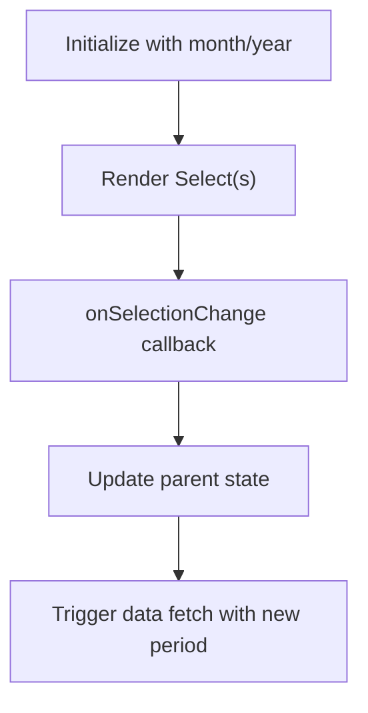

**Diagram sources**
- [period-picker.tsx:19-50](file://src/components/finance/period-picker.tsx#L19-L50)

**Section sources**
- [period-picker.tsx:19-50](file://src/components/finance/period-picker.tsx#L19-L50)

### Profit & Loss Report
- Purpose: Monthly income and expense aggregation by account groups, computing totals and margin.
- Features:
  - Account group filtering (income/expense).
  - Aggregation by date range.
  - Computed margin and totals returned.

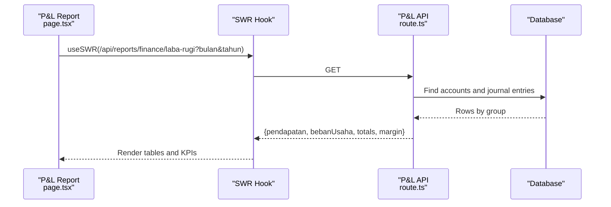

**Diagram sources**
- [page.tsx](file://src/app/(LoggedIn)/reports/laba-rugi/page.tsx#L136-L144)
- [route.ts:104-122](file://src/app/api/reports/finance/laba-rugi/route.ts#L104-L122)

**Section sources**
- [page.tsx](file://src/app/(LoggedIn)/reports/laba-rugi/page.tsx#L136-L340)
- [route.ts:104-122](file://src/app/api/reports/finance/laba-rugi/route.ts#L104-L122)

### Balance Sheet Report
- Purpose: Asset composition, liability and equity breakdown, and balance verification.
- Features:
  - Asset liquidity groups, liability groups, and equity components.
  - Pie charts for visual distribution.
  - KPI summary cards and balanced/unbalanced status.

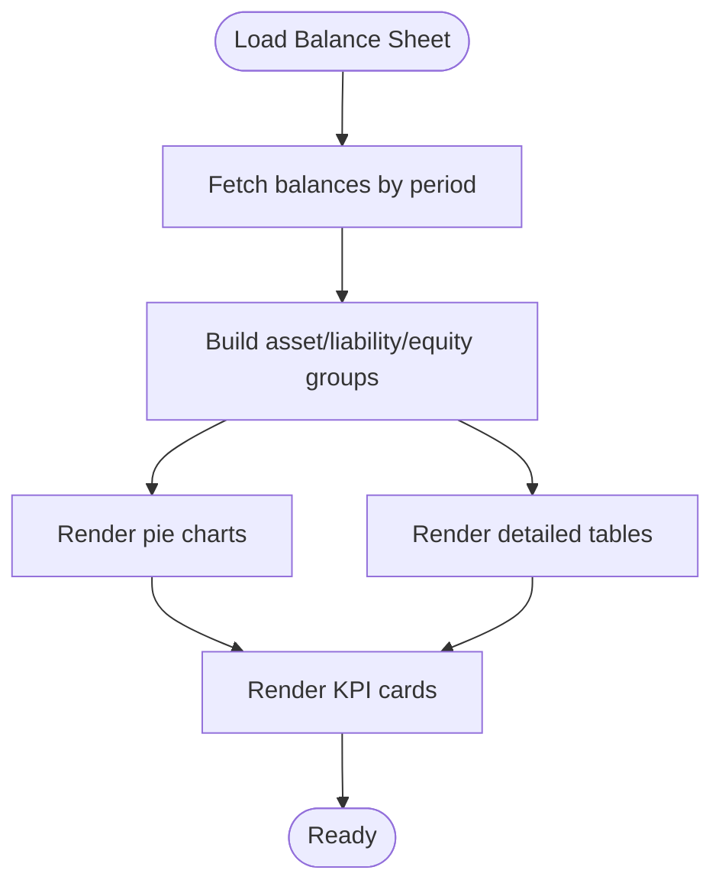

**Diagram sources**
- [page.tsx](file://src/app/(LoggedIn)/reports/neraca/page.tsx#L192-L401)

**Section sources**
- [page.tsx](file://src/app/(LoggedIn)/reports/neraca/page.tsx#L192-L401)

### Receivables Report
- Purpose: Monitor unpaid orders, record payments, and send reminders.
- Features:
  - Filters: all, unpaid, down payment, overdue.
  - Payment capture modal with validations.
  - Overdue warning banner and summary cards.

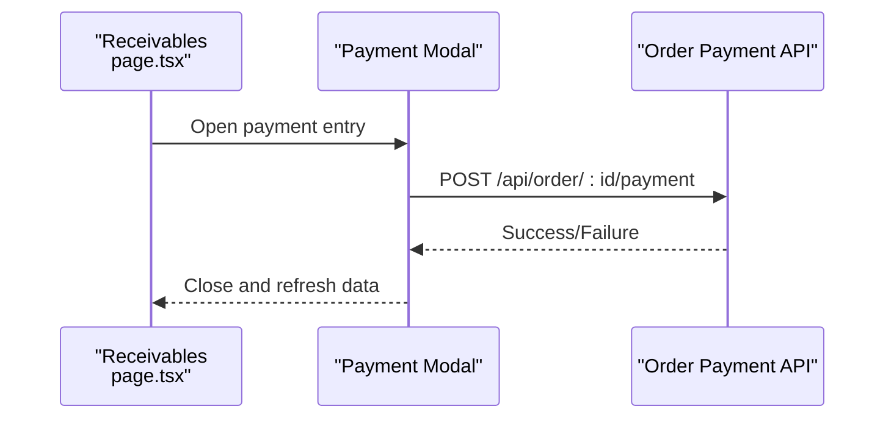

**Diagram sources**
- [page.tsx](file://src/app/(LoggedIn)/reports/piutang/page.tsx#L349-L763)

**Section sources**
- [page.tsx](file://src/app/(LoggedIn)/reports/piutang/page.tsx#L349-L763)

### Expenses Report
- Purpose: Filter and analyze operational costs by account and period.
- Features:
  - Search, month/year filters, and account filters.
  - Pie chart of cost distribution by account.
  - Paginated table of cost entries.

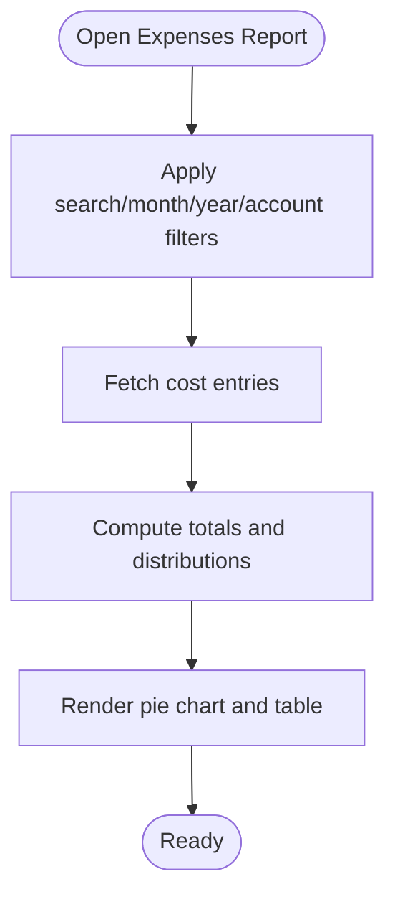

**Diagram sources**
- [page.tsx](file://src/app/(LoggedIn)/reports/cost/page.tsx#L38-L213)

**Section sources**
- [page.tsx](file://src/app/(LoggedIn)/reports/cost/page.tsx#L38-L213)

### Savings Report
- Purpose: Annual savings allocation by category across months.
- Features:
  - Year picker and summary cards.
  - Monthly allocation table with totals and best month.

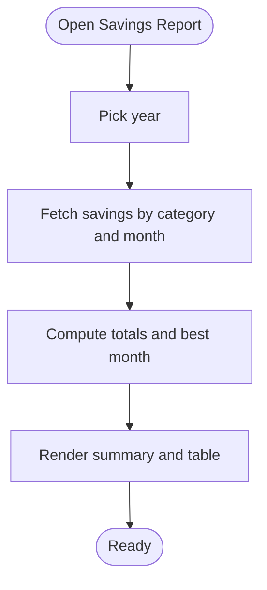

**Diagram sources**
- [page.tsx](file://src/app/(LoggedIn)/reports/tabungan/page.tsx#L38-L284)

**Section sources**
- [page.tsx](file://src/app/(LoggedIn)/reports/tabungan/page.tsx#L38-L284)

## Dependency Analysis
- UI pages depend on:
  - SWR for data fetching and caching.
  - Recharts for visualization.
  - Shared components (e.g., PeriodPicker).
- API routes depend on:
  - Authentication middleware for session validation.
  - Prisma ORM for database queries and aggregations.
- Finance utilities:
  - Double-entry journal creation helper for accounting integrations.

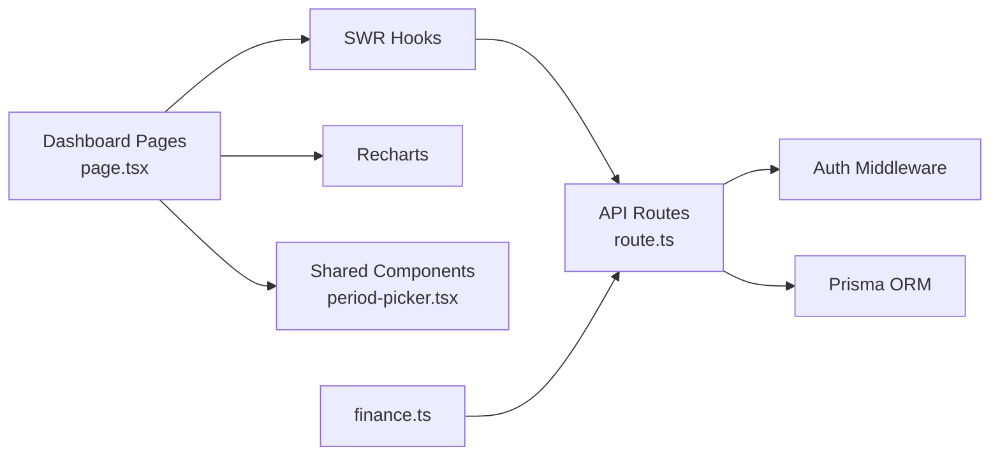

**Diagram sources**
- [page.tsx](file://src/app/(LoggedIn)/dashboard/page.tsx#L151-L160)
- [page.tsx](file://src/app/(LoggedIn)/finance/dashboard/page.tsx#L215-L255)
- [route.ts:12-259](file://src/app/api/finance/dashboard/route.ts#L12-L259)
- [finance.ts:26-54](file://src/lib/finance.ts#L26-L54)

**Section sources**
- [page.tsx](file://src/app/(LoggedIn)/dashboard/page.tsx#L151-L160)
- [page.tsx](file://src/app/(LoggedIn)/finance/dashboard/page.tsx#L215-L255)
- [route.ts:12-259](file://src/app/api/finance/dashboard/route.ts#L12-L259)
- [finance.ts:26-54](file://src/lib/finance.ts#L26-L54)

## Performance Considerations
- Data fetching and caching:
  - Use SWR with appropriate refresh intervals for near-real-time updates.
  - Prefer server-side aggregation in API routes to minimize client computation.
- Database queries:
  - Batch related queries using Promise.all to reduce round-trips.
  - Limit result sets and apply pagination for large datasets.
- Rendering:
  - Use ResponsiveContainer for charts to avoid layout thrashing.
  - Defer heavy computations to worker threads if needed.
- Caching strategies:
  - Leverage SWR cache keys with month/year parameters.
  - Invalidate cache on period change or after payment recording.
- Personalization:
  - Store user preferences (e.g., preferred period, visible metrics) in local storage or user settings.
- Large datasets:
  - Paginate tables and limit chart data points to recent periods.
  - Use virtualized lists for long tables.

[No sources needed since this section provides general guidance]

## Troubleshooting Guide
- Unauthorized or forbidden access:
  - API routes enforce session checks and role-based access; ensure authentication is established.
- Missing or stale data:
  - Verify period parameters and that the API route is invoked with correct month/year.
  - Confirm SWR cache is invalidated after transactions.
- Chart anomalies:
  - Ensure chart data arrays are non-empty and properly typed.
  - Validate axis formatters and tooltip configurations.
- Receivables payment errors:
  - Validate nominal amount does not exceed remaining balance.
  - Ensure a destination cash/bank account is selected.

**Section sources**
- [route.ts:12-15](file://src/app/api/finance/dashboard/route.ts#L12-L15)
- [page.tsx](file://src/app/(LoggedIn)/reports/piutang/page.tsx#L124-L184)

## Conclusion
The dashboard and analytics system integrates operational and financial insights through:
- Real-time KPIs and charts powered by SWR and Recharts
- Secure, authenticated API routes performing efficient aggregations
- Reusable components for period selection and consistent UX
- Comprehensive reporting across income, expenses, receivables, balance sheet, and savings

This foundation supports customization, performance tuning, and cross-module data integration for robust business intelligence.

[No sources needed since this section summarizes without analyzing specific files]

## Appendices

### Practical Examples
- Customize metrics:
  - Add new KPI cards in the finance dashboard by extending the data model and adding new chart sections.
- Configure period picker:
  - Use the shared PeriodPicker component in any report page to maintain consistency.
- Real-time updates:
  - Adjust SWR refresh interval for dashboards requiring frequent updates.
- Chart rendering:
  - Wrap charts in ResponsiveContainer and ensure data keys match the payload structure.

[No sources needed since this section provides general guidance]