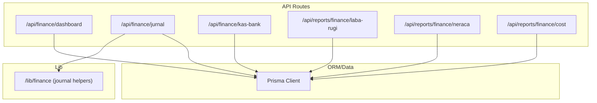
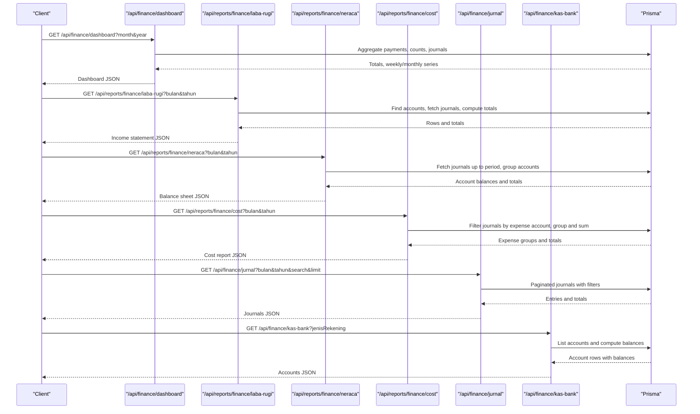
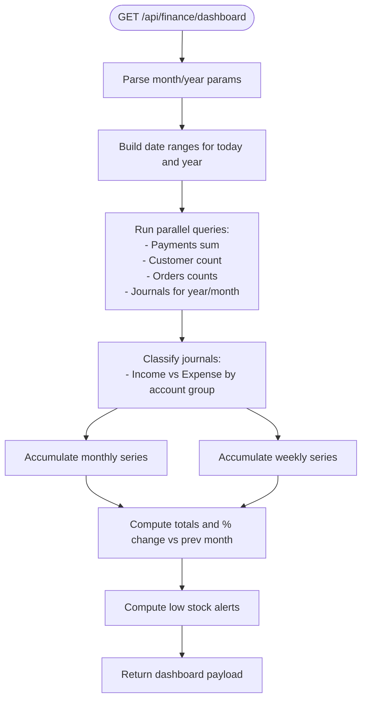
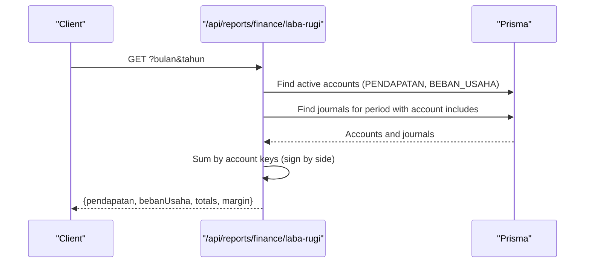
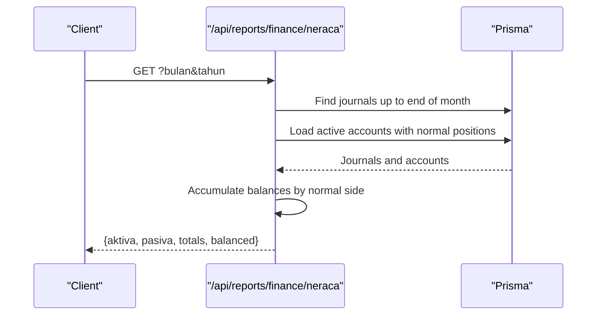
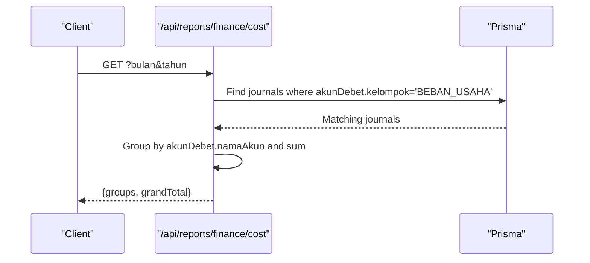
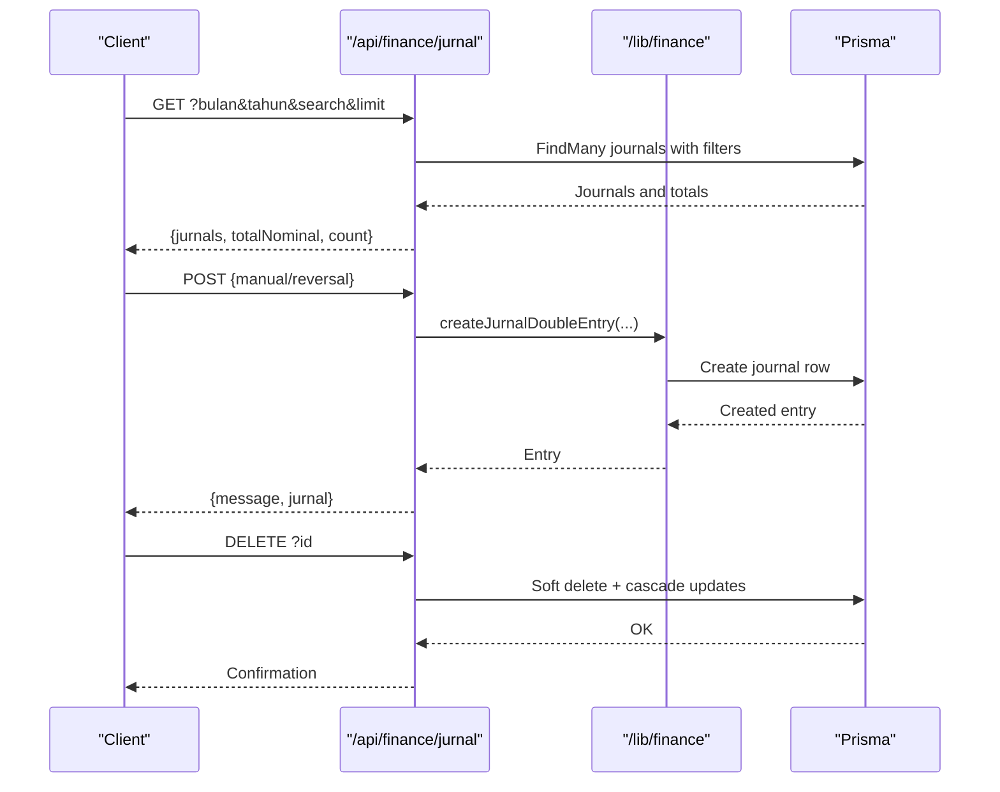
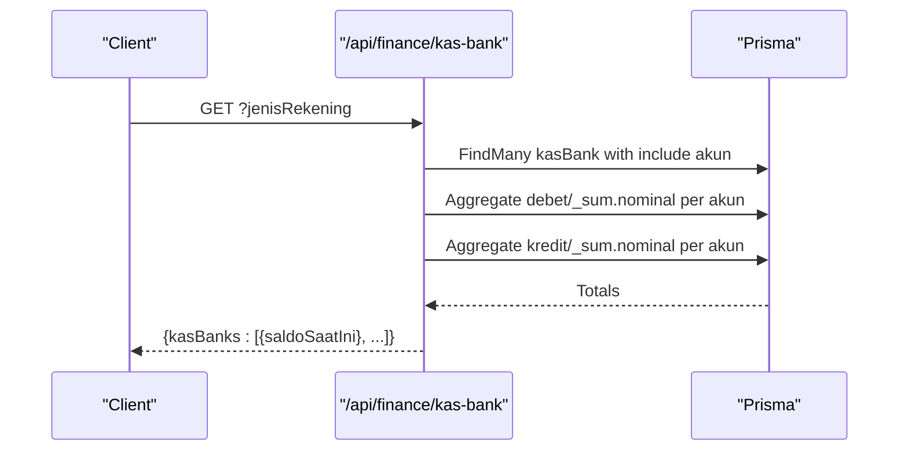
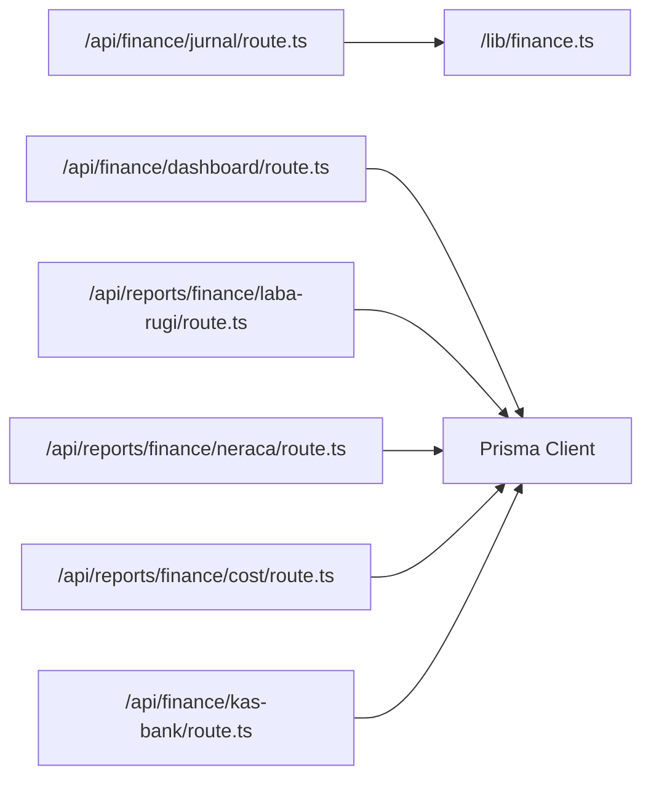

# Finance Dashboard

<cite>
**Referenced Files in This Document**
- [route.ts](file://src/app/api/finance/dashboard/route.ts)
- [route.ts](file://src/app/api/reports/finance/laba-rugi/route.ts)
- [route.ts](file://src/app/api/reports/finance/neraca/route.ts)
- [route.ts](file://src/app/api/reports/finance/cost/route.ts)
- [route.ts](file://src/app/api/finance/jurnal/route.ts)
- [route.ts](file://src/app/api/finance/kas-bank/route.ts)
- [finance.ts](file://src/lib/finance.ts)
</cite>

## Table of Contents
1. [Introduction](#introduction)
2. [Project Structure](#project-structure)
3. [Core Components](#core-components)
4. [Architecture Overview](#architecture-overview)
5. [Detailed Component Analysis](#detailed-component-analysis)
6. [Dependency Analysis](#dependency-analysis)
7. [Performance Considerations](#performance-considerations)
8. [Troubleshooting Guide](#troubleshooting-guide)
9. [Conclusion](#conclusion)
10. [Appendices](#appendices)

## Introduction
This document describes the finance dashboard analytics system, focusing on financial metrics calculation, revenue tracking, expense monitoring, profit analysis, API integrations for monthly/yearly aggregation, financial charts, period selection, financial ratios, trend analysis, comparative reporting, accounting system integration, real-time synchronization signals, and export/data sharing capabilities. The backend is implemented with Next.js routes under the API surface, backed by Prisma ORM and a relational database.

## Project Structure
The finance analytics features are primarily implemented as Next.js API routes grouped under:
- Finance dashboard summary and charts
- Financial statements (Income Statement, Balance Sheet, Cost Report)
- Journal entries management
- Cash/Bank accounts and balances

**Diagram sources**
- [route.ts:1-259](file://src/app/api/finance/dashboard/route.ts#L1-L259)
- [route.ts:1-169](file://src/app/api/finance/jurnal/route.ts#L1-L169)
- [route.ts:1-112](file://src/app/api/finance/kas-bank/route.ts#L1-L112)
- [route.ts:1-122](file://src/app/api/reports/finance/laba-rugi/route.ts#L1-L122)
- [route.ts:1-133](file://src/app/api/reports/finance/neraca/route.ts#L1-L133)
- [route.ts:1-68](file://src/app/api/reports/finance/cost/route.ts#L1-L68)
- [finance.ts:1-55](file://src/lib/finance.ts#L1-L55)

**Section sources**
- [route.ts:1-259](file://src/app/api/finance/dashboard/route.ts#L1-L259)
- [route.ts:1-169](file://src/app/api/finance/jurnal/route.ts#L1-L169)
- [route.ts:1-112](file://src/app/api/finance/kas-bank/route.ts#L1-L112)
- [route.ts:1-122](file://src/app/api/reports/finance/laba-rugi/route.ts#L1-L122)
- [route.ts:1-133](file://src/app/api/reports/finance/neraca/route.ts#L1-L133)
- [route.ts:1-68](file://src/app/api/reports/finance/cost/route.ts#L1-L68)
- [finance.ts:1-55](file://src/lib/finance.ts#L1-L55)

## Core Components
- Finance Dashboard Summary and Charts
  - Computes daily/monthly aggregates, weekly buckets, receivables, KPI trends vs previous month, and alerts for low stock items.
  - Provides monthly income and expense series for trend visualization.
- Income Statement (Profit & Loss) Report
  - Aggregates accounts by group (Revenue and Operating Expenses) for a selected month/year, computes totals and operating margin.
- Balance Sheet Report
  - Accumulates journal entries up to a selected month/year, groups by account categories, and validates equality of assets vs liabilities + equity.
- Cost Report
  - Groups expenses by expense account for a selected month/year and shows totals.
- Journal Management
  - Retrieves filtered journals by month/year/search, supports manual posting and reversal entries, and cascades soft deletes to related records.
- Cash/Bank Accounts
  - Lists bank accounts and computes current balances by summing debits and credits from journals.

**Section sources**
- [route.ts:12-250](file://src/app/api/finance/dashboard/route.ts#L12-L250)
- [route.ts:13-101](file://src/app/api/reports/finance/laba-rugi/route.ts#L13-L101)
- [route.ts:13-127](file://src/app/api/reports/finance/neraca/route.ts#L13-L127)
- [route.ts:13-62](file://src/app/api/reports/finance/cost/route.ts#L13-L62)
- [route.ts:16-82](file://src/app/api/finance/jurnal/route.ts#L16-L82)
- [route.ts:16-73](file://src/app/api/finance/kas-bank/route.ts#L16-L73)

## Architecture Overview
The system follows a layered architecture:
- Presentation/UI: Next.js App Router pages/components (outside the scope of this document).
- Application/API: Route handlers under src/app/api handle requests, enforce auth, and orchestrate queries.
- Domain Services: Utility functions encapsulate double-entry journal creation.
- Persistence: Prisma client executes queries against the database.

**Diagram sources**
- [route.ts:12-250](file://src/app/api/finance/dashboard/route.ts#L12-L250)
- [route.ts:104-116](file://src/app/api/reports/finance/laba-rugi/route.ts#L104-L116)
- [route.ts:15-127](file://src/app/api/reports/finance/neraca/route.ts#L15-L127)
- [route.ts:14-62](file://src/app/api/reports/finance/cost/route.ts#L14-L62)
- [route.ts:17-82](file://src/app/api/finance/jurnal/route.ts#L17-L82)
- [route.ts:16-73](file://src/app/api/finance/kas-bank/route.ts#L16-L73)

## Detailed Component Analysis

### Finance Dashboard Summary and Charts
- Purpose: Provide a high-level snapshot of today’s sales, customer base, new orders, active orders, receivables, recent orders, low stock alerts, and monthly/weekly financial trends.
- Inputs: Query params month and year; defaults to current local month/year.
- Outputs: Totals, receivables, KPI percentage changes vs previous month, recent orders, and two chart series arrays (monthly and weekly).
- Implementation highlights:
  - Uses Prisma aggregations for today’s payments and counts.
  - Builds weekly buckets for the current month and monthly buckets for the year.
  - Iterates through journals to classify entries as income or expense by account group and accumulate per week/month.
  - Calculates percentage change for income, expense, and profit vs previous month.
  - Low stock alerts computed from raw materials and products with thresholds.

**Diagram sources**
- [route.ts:12-250](file://src/app/api/finance/dashboard/route.ts#L12-L250)

**Section sources**
- [route.ts:12-250](file://src/app/api/finance/dashboard/route.ts#L12-L250)

### Income Statement (Monthly) Report
- Purpose: Produce an income statement for a selected month and year by grouping revenue and operating expense accounts and computing totals and operating margin.
- Inputs: Query params bulan (month) and tahun (year).
- Outputs: Revenue rows, expense rows, total revenue, total expenses, net profit, and operating margin percentage.
- Implementation highlights:
  - Loads active accounts belonging to revenue and operating expense groups.
  - Aggregates journal entries by account keys, increasing revenue on credit side and expenses on debit side.
  - Returns rows and derived metrics.

**Diagram sources**
- [route.ts:13-101](file://src/app/api/reports/finance/laba-rugi/route.ts#L13-L101)

**Section sources**
- [route.ts:13-101](file://src/app/api/reports/finance/laba-rugi/route.ts#L13-L101)

### Balance Sheet (Cumulative) Report
- Purpose: Produce a balance sheet up to a selected month and year by accumulating all journal entries and grouping by asset, liability, equity, and retained earnings.
- Inputs: Query params bulan (month) and tahun (year).
- Outputs: Assets (current), Liabilities, Equity (capital and retained earnings), totals, and a balancing check.
- Implementation highlights:
  - Loads active accounts across asset, liability, capital, revenue, and expense groups.
  - Accumulates balances by normal side (debit/credit) for each account up to the selected period.
  - Sums groups and verifies equality of total assets vs total liabilities plus equity.

**Diagram sources**
- [route.ts:13-127](file://src/app/api/reports/finance/neraca/route.ts#L13-L127)

**Section sources**
- [route.ts:13-127](file://src/app/api/reports/finance/neraca/route.ts#L13-L127)

### Cost Report (Expense Breakdown)
- Purpose: Provide a monthly breakdown of expenses grouped by expense account.
- Inputs: Query params bulan (month) and tahun (year).
- Outputs: Expense groups sorted by total, grand total, and metadata.
- Implementation highlights:
  - Filters journals by debit-side expense accounts for the selected month.
  - Groups by account name, sums amounts, and returns ordered results.

**Diagram sources**
- [route.ts:13-62](file://src/app/api/reports/finance/cost/route.ts#L13-L62)

**Section sources**
- [route.ts:13-62](file://src/app/api/reports/finance/cost/route.ts#L13-L62)

### Journal Management
- Purpose: Retrieve, create, and delete journal entries with support for manual postings and reversals; integrates with related modules via soft delete cascading.
- Inputs: GET supports month, year, search term, and pagination; POST supports manual or reversal entries; DELETE requires entry ID.
- Outputs: Lists of journals, totals, created entry, or deletion confirmation.
- Implementation highlights:
  - Authentication and role checks (admin, cashier).
  - Search across multiple fields.
  - Double-entry creation via utility function.
  - Soft delete with cascading updates to related records.

**Diagram sources**
- [route.ts:16-169](file://src/app/api/finance/jurnal/route.ts#L16-L169)
- [finance.ts:26-54](file://src/lib/finance.ts#L26-L54)

**Section sources**
- [route.ts:16-169](file://src/app/api/finance/jurnal/route.ts#L16-L169)
- [finance.ts:26-54](file://src/lib/finance.ts#L26-L54)

### Cash/Bank Accounts
- Purpose: List cash/bank accounts and compute current balances by summing debits and credits from journals.
- Inputs: Query param jenisRekening optional filter.
- Outputs: Account list with computed balances.
- Implementation highlights:
  - For each account, aggregates debits and credits and computes difference as current balance.
  - Assumes asset normal position is debit.

**Diagram sources**
- [route.ts:16-73](file://src/app/api/finance/kas-bank/route.ts#L16-L73)

**Section sources**
- [route.ts:16-73](file://src/app/api/finance/kas-bank/route.ts#L16-L73)

## Dependency Analysis
- Internal dependencies:
  - Journal routes depend on a shared utility for double-entry creation.
  - All report routes depend on Prisma for data retrieval.
  - Dashboard route depends on journal entries to compute monthly/weekly series and KPIs.
- External dependencies:
  - Authentication enforced via session checks.
  - Database via Prisma client.

**Diagram sources**
- [route.ts:6-14](file://src/app/api/finance/jurnal/route.ts#L6-L14)
- [finance.ts:1-55](file://src/lib/finance.ts#L1-L55)
- [route.ts:1-10](file://src/app/api/finance/dashboard/route.ts#L1-L10)
- [route.ts:1-11](file://src/app/api/reports/finance/laba-rugi/route.ts#L1-L11)
- [route.ts:1-11](file://src/app/api/reports/finance/neraca/route.ts#L1-L11)
- [route.ts:1-11](file://src/app/api/reports/finance/cost/route.ts#L1-L11)

**Section sources**
- [route.ts:6-14](file://src/app/api/finance/jurnal/route.ts#L6-L14)
- [finance.ts:1-55](file://src/lib/finance.ts#L1-L55)
- [route.ts:1-10](file://src/app/api/finance/dashboard/route.ts#L1-L10)
- [route.ts:1-11](file://src/app/api/reports/finance/laba-rugi/route.ts#L1-L11)
- [route.ts:1-11](file://src/app/api/reports/finance/neraca/route.ts#L1-L11)
- [route.ts:1-11](file://src/app/api/reports/finance/cost/route.ts#L1-L11)

## Performance Considerations
- Parallelization: Dashboard uses concurrent queries for multiple aggregates to reduce latency.
- Filtering and pagination: Journal listing supports limit and search to avoid large payloads.
- Efficient classification: Single pass over journals to compute monthly/weekly series minimizes repeated scans.
- Sorting and slicing: Low stock lists are sliced after sorting to limit response size.
- Aggregation precision: Decimals are handled via Prisma Decimal during journal creation.

[No sources needed since this section provides general guidance]

## Troubleshooting Guide
- Unauthorized/Forbidden errors:
  - Dashboard and reports enforce session checks; journal and cash endpoints restrict roles to admin and cashier.
- Validation errors on journal posting:
  - Missing required fields or invalid nominal cause 400 responses.
  - Debtor and creditor accounts must differ.
- Deletion issues:
  - Missing ID or non-existent entry returns appropriate errors; cascading soft delete ensures referential integrity.
- Server errors:
  - All endpoints wrap logic in try/catch and log errors before returning generic internal server error responses.

**Section sources**
- [route.ts:84-125](file://src/app/api/finance/jurnal/route.ts#L84-L125)
- [route.ts:127-168](file://src/app/api/finance/jurnal/route.ts#L127-L168)
- [route.ts:83-111](file://src/app/api/finance/kas-bank/route.ts#L83-L111)
- [route.ts:104-121](file://src/app/api/reports/finance/laba-rugi/route.ts#L104-L121)
- [route.ts:15-132](file://src/app/api/reports/finance/neraca/route.ts#L15-L132)
- [route.ts:14-67](file://src/app/api/reports/finance/cost/route.ts#L14-L67)
- [route.ts:12-258](file://src/app/api/finance/dashboard/route.ts#L12-L258)

## Conclusion
The finance dashboard integrates accounting-driven calculations with practical reporting. It provides timely summaries, monthly/yearly financial insights, and robust controls for journal management and cash accounts. The modular API design enables incremental enhancements for exporting reports and advanced analytics while maintaining strong separation of concerns.

[No sources needed since this section summarizes without analyzing specific files]

## Appendices

### API Definitions and Behavior Summary
- Finance Dashboard
  - Method: GET
  - Path: /api/finance/dashboard
  - Query: month (optional), year (optional)
  - Response: Totals, receivables, counts, trend percentages, recent orders, low stock alerts, monthly and weekly series
- Income Statement (Monthly)
  - Method: GET
  - Path: /api/reports/finance/laba-rugi
  - Query: bulan (required), tahun (required)
  - Response: Revenue rows, expense rows, totals, margin
- Balance Sheet (Cumulative)
  - Method: GET
  - Path: /api/reports/finance/neraca
  - Query: bulan (required), tahun (required)
  - Response: Asset/liability/equity groups, totals, balancing indicator
- Cost Report (Monthly)
  - Method: GET
  - Path: /api/reports/finance/cost
  - Query: bulan (required), tahun (required)
  - Response: Expense groups, grand total
- Journal Management
  - GET: /api/finance/jurnal?bulan&tahun&search&limit
  - POST: Manual or reversal journal entry
  - DELETE: Soft delete with cascading updates
- Cash/Bank Accounts
  - GET: /api/finance/kas-bank?jenisRekening
  - PATCH: Update account fields

[No sources needed since this section summarizes without analyzing specific files]