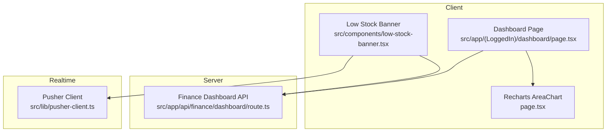
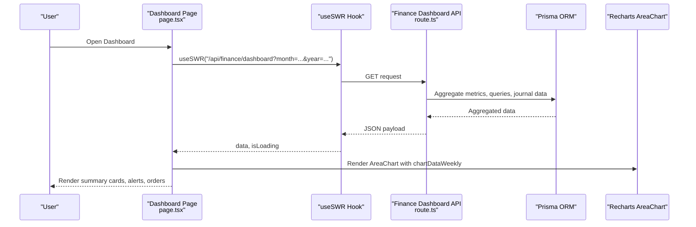
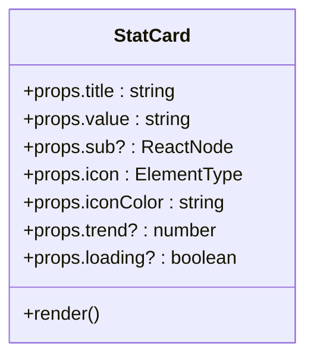
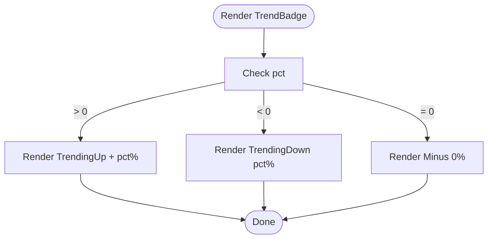
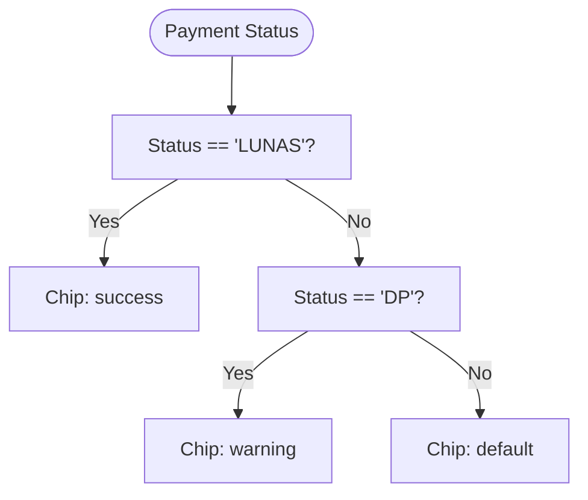
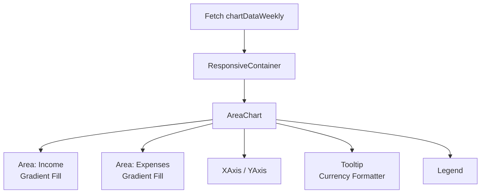
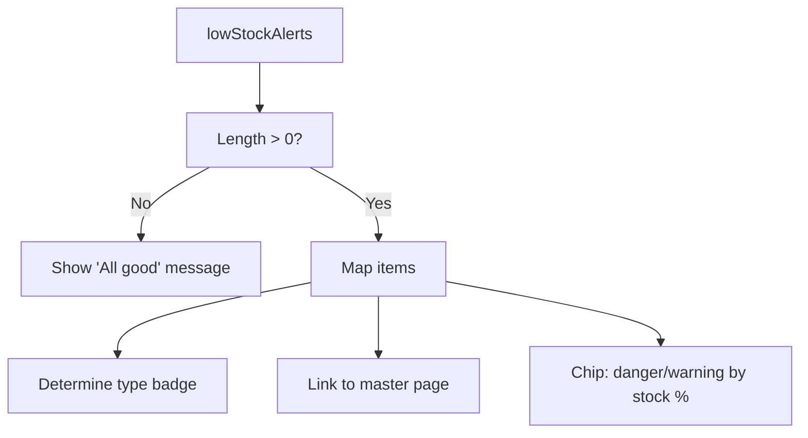
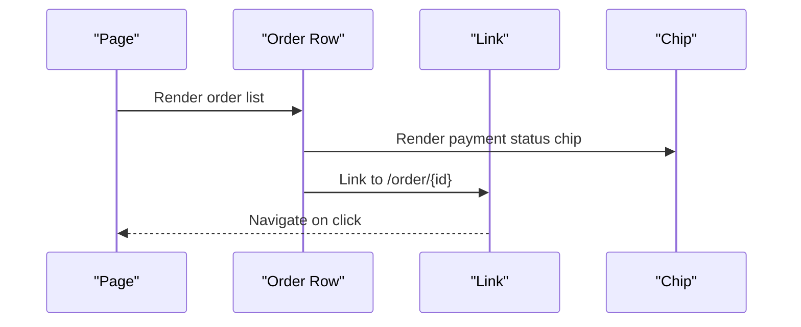
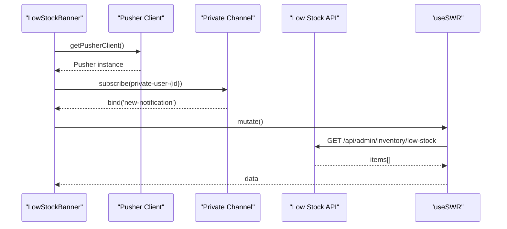
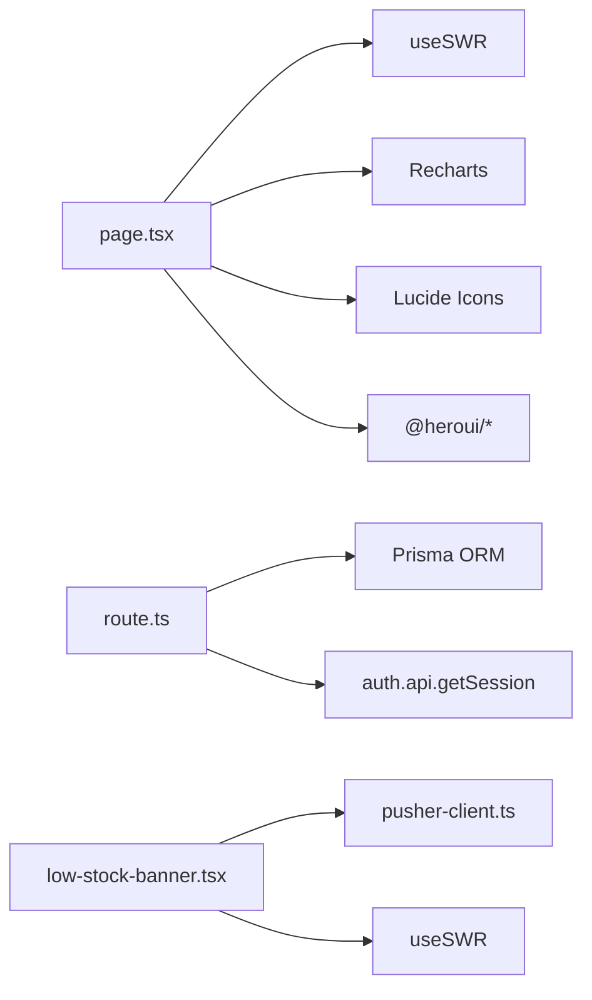

# General Dashboard

<cite>
**Referenced Files in This Document**
- [page.tsx](file://src/app/(LoggedIn)/dashboard/page.tsx)
- [layout.tsx](file://src/app/(LoggedIn)/dashboard/layout.tsx)
- [route.ts](file://src/app/api/finance/dashboard/route.ts)
- [low-stock-banner.tsx](file://src/components/low-stock-banner.tsx)
- [pusher-client.ts](file://src/lib/pusher-client.ts)
- [func.ts](file://src/lib/func.ts)
- [layout.tsx](file://src/app/layout.tsx)
- [providers.tsx](file://src/app/providers.tsx)
</cite>

## Table of Contents
1. [Introduction](#introduction)
2. [Project Structure](#project-structure)
3. [Core Components](#core-components)
4. [Architecture Overview](#architecture-overview)
5. [Detailed Component Analysis](#detailed-component-analysis)
6. [Dependency Analysis](#dependency-analysis)
7. [Performance Considerations](#performance-considerations)
8. [Troubleshooting Guide](#troubleshooting-guide)
9. [Conclusion](#conclusion)

## Introduction
This document explains the general dashboard functionality, focusing on the dashboard architecture, main metrics display, and real-time data aggregation. It documents the eight key stat cards (daily sales, monthly income, customer count, active orders, monthly expenses, net profit, outstanding receivables, and low stock alerts), the responsive grid layout, skeleton loading states, and interactive elements. It also covers the StatCard component, TrendBadge functionality, and the payment status chip coloring system. The weekly revenue vs expense area chart implementation using Recharts is explained with gradient fills, tooltips, and responsive container sizing. The low stock alerts panel is documented with dynamic item categorization and navigation. The recent orders table is described with payment status indicators and click-to-navigate functionality. Finally, performance optimization techniques for real-time data updates and caching strategies are included.

## Project Structure
The general dashboard is implemented as a Next.js app page under the logged-in section. It integrates with a backend API endpoint that computes financial summaries, trends, charts, and recent data. Real-time updates are supported via Pusher for low stock alerts.

**Diagram sources**
- [page.tsx](file://src/app/(LoggedIn)/dashboard/page.tsx#L151-L475)
- [route.ts:12-259](file://src/app/api/finance/dashboard/route.ts#L12-L259)
- [low-stock-banner.tsx:19-97](file://src/components/low-stock-banner.tsx#L19-L97)
- [pusher-client.ts:6-21](file://src/lib/pusher-client.ts#L6-L21)

**Section sources**
- [page.tsx](file://src/app/(LoggedIn)/dashboard/page.tsx#L1-L475)
- [layout.tsx](file://src/app/(LoggedIn)/dashboard/layout.tsx#L1-L11)

## Core Components
- StatCard: Reusable metric card with icon, value, optional trend badge, and skeleton loading.
- TrendBadge: Renders directional trend indicator with icons and percentage.
- paymentChipColor: Maps payment statuses to chip colors.
- Low Stock Alerts Panel: Displays actionable low stock items with category badges and navigation.
- Weekly Revenue vs Expense Area Chart: Recharts area chart with gradients, responsive container, and tooltips.
- Recent Orders Table: List of recent orders with payment status chips and click-to-navigate links.

**Section sources**
- [page.tsx](file://src/app/(LoggedIn)/dashboard/page.tsx#L92-L133)
- [page.tsx](file://src/app/(LoggedIn)/dashboard/page.tsx#L72-L90)
- [page.tsx](file://src/app/(LoggedIn)/dashboard/page.tsx#L135-L141)
- [page.tsx](file://src/app/(LoggedIn)/dashboard/page.tsx#L351-L417)
- [page.tsx](file://src/app/(LoggedIn)/dashboard/page.tsx#L254-L349)
- [page.tsx](file://src/app/(LoggedIn)/dashboard/page.tsx#L419-L471)

## Architecture Overview
The dashboard fetches data from a server-side API endpoint that aggregates financial metrics, computes trends, and prepares chart data. The client renders summary cards, a weekly area chart, low stock alerts, and recent orders. Real-time updates for low stock are handled via Pusher private channels.

**Diagram sources**
- [page.tsx](file://src/app/(LoggedIn)/dashboard/page.tsx#L156-L160)
- [route.ts:12-259](file://src/app/api/finance/dashboard/route.ts#L12-L259)

## Detailed Component Analysis

### StatCard Component
- Purpose: Display a single metric with icon, value, optional trend percentage, and subtext.
- Loading: Uses skeleton placeholders while data is fetching.
- Interactions: Hover shadow effect; icon color determined by prop.
- Props: title, value, sub, icon, iconColor, trend, loading.

**Diagram sources**
- [page.tsx](file://src/app/(LoggedIn)/dashboard/page.tsx#L92-L133)

**Section sources**
- [page.tsx](file://src/app/(LoggedIn)/dashboard/page.tsx#L92-L133)

### TrendBadge Component
- Purpose: Visual trend indicator with directional icon and percentage.
- Behavior: Positive trend green with up arrow, negative red with down arrow, zero gray with minus.

**Diagram sources**
- [page.tsx](file://src/app/(LoggedIn)/dashboard/page.tsx#L72-L90)

**Section sources**
- [page.tsx](file://src/app/(LoggedIn)/dashboard/page.tsx#L72-L90)

### Payment Status Chip Coloring System
- Mapping: LUNAS → success, DP → warning, otherwise default.
- Usage: Applied to recent orders table chips for quick status recognition.

**Diagram sources**
- [page.tsx](file://src/app/(LoggedIn)/dashboard/page.tsx#L135-L141)

**Section sources**
- [page.tsx](file://src/app/(LoggedIn)/dashboard/page.tsx#L135-L141)

### Weekly Revenue vs Expense Area Chart (Recharts)
- Data: chartDataWeekly from API response.
- Gradients: Linear gradients for income and expense areas.
- Responsiveness: ResponsiveContainer with fixed height.
- Tooltips: Formatted currency values.
- Axes: Custom tick formatters and styles.

**Diagram sources**
- [page.tsx](file://src/app/(LoggedIn)/dashboard/page.tsx#L256-L349)
- [route.ts:125-203](file://src/app/api/finance/dashboard/route.ts#L125-L203)

**Section sources**
- [page.tsx](file://src/app/(LoggedIn)/dashboard/page.tsx#L256-L349)
- [route.ts:125-203](file://src/app/api/finance/dashboard/route.ts#L125-L203)

### Low Stock Alerts Panel
- Data: lowStockAlerts from API response.
- Categories: Items labeled as bahan_baku or product with unit and minimum stock thresholds.
- Navigation: Clickable rows navigate to appropriate master pages (/master/bahan-baku or /master/product).
- Dynamic badges: Chip color depends on stock percentage (danger vs warning).

**Diagram sources**
- [page.tsx](file://src/app/(LoggedIn)/dashboard/page.tsx#L351-L417)
- [route.ts:102-116](file://src/app/api/finance/dashboard/route.ts#L102-L116)

**Section sources**
- [page.tsx](file://src/app/(LoggedIn)/dashboard/page.tsx#L351-L417)
- [route.ts:102-116](file://src/app/api/finance/dashboard/route.ts#L102-L116)

### Recent Orders Table
- Data: recentOrders from API response.
- Indicators: Payment status chips with color mapping.
- Navigation: Click row to view order details.
- Formatting: Grand total formatted as Rupiah; date localized.

**Diagram sources**
- [page.tsx](file://src/app/(LoggedIn)/dashboard/page.tsx#L419-L471)
- [page.tsx](file://src/app/(LoggedIn)/dashboard/page.tsx#L135-L141)

**Section sources**
- [page.tsx](file://src/app/(LoggedIn)/dashboard/page.tsx#L419-L471)

### Real-Time Data Updates and Low Stock Banner
- LowStockBanner listens to Pusher private channel events for new notifications.
- On relevant events (low stock, new order, new delivery), it triggers a refetch of low stock items.
- Banner visibility respects a dismissal flag stored in localStorage.

**Diagram sources**
- [low-stock-banner.tsx:19-50](file://src/components/low-stock-banner.tsx#L19-L50)
- [pusher-client.ts:6-21](file://src/lib/pusher-client.ts#L6-L21)
- [low-stock-banner.tsx:26-29](file://src/components/low-stock-banner.tsx#L26-L29)

**Section sources**
- [low-stock-banner.tsx:19-97](file://src/components/low-stock-banner.tsx#L19-L97)
- [pusher-client.ts:6-21](file://src/lib/pusher-client.ts#L6-L21)

## Dependency Analysis
- Client-side dependencies:
  - useSWR for data fetching and caching.
  - Recharts for area chart rendering.
  - Lucide icons for visual indicators.
  - @heroui components for skeleton and chips.
- Server-side dependencies:
  - Prisma ORM for database queries and aggregations.
  - Authentication guard for protected endpoint.
- Real-time dependencies:
  - Pusher-JS for WebSocket connections.
  - Private channels for per-user notifications.

**Diagram sources**
- [page.tsx](file://src/app/(LoggedIn)/dashboard/page.tsx#L1-L30)
- [route.ts:1-10](file://src/app/api/finance/dashboard/route.ts#L1-L10)
- [low-stock-banner.tsx:1-8](file://src/components/low-stock-banner.tsx#L1-L8)
- [pusher-client.ts:1-21](file://src/lib/pusher-client.ts#L1-L21)

**Section sources**
- [page.tsx](file://src/app/(LoggedIn)/dashboard/page.tsx#L1-L30)
- [route.ts:1-10](file://src/app/api/finance/dashboard/route.ts#L1-L10)
- [low-stock-banner.tsx:1-8](file://src/components/low-stock-banner.tsx#L1-L8)
- [pusher-client.ts:1-21](file://src/lib/pusher-client.ts#L1-L21)

## Performance Considerations
- Real-time updates:
  - Use SWR’s mutate to refetch low stock items upon relevant Pusher events.
  - Debounce frequent updates if needed to avoid excessive network requests.
- Caching:
  - useSWR cache keys should remain stable; consider adding a cacheKey for dashboard endpoint to reuse data across navigations.
  - LocalStorage dismissal flag prevents repeated banner rendering for the same day.
- Rendering:
  - Skeleton loaders reduce perceived load time during initial fetch.
  - Recharts containers are sized with fixed heights to avoid layout shifts.
- Network:
  - API endpoint aggregates multiple queries using Promise.all to minimize round trips.
  - Chart data is precomputed server-side to reduce client-side computation.
- Environment:
  - Provider setup ensures consistent UI behavior and toast notifications.

**Section sources**
- [page.tsx](file://src/app/(LoggedIn)/dashboard/page.tsx#L156-L160)
- [low-stock-banner.tsx:20-29](file://src/components/low-stock-banner.tsx#L20-L29)
- [route.ts:46-100](file://src/app/api/finance/dashboard/route.ts#L46-L100)
- [providers.tsx:6-13](file://src/app/providers.tsx#L6-L13)
- [layout.tsx:42-62](file://src/app/layout.tsx#L42-L62)

## Troubleshooting Guide
- Unauthorized access to dashboard API:
  - Ensure authentication middleware is satisfied; otherwise, the endpoint returns unauthorized.
- Missing or empty data:
  - Verify that the month and year parameters are valid; defaults to current month/year if omitted.
  - Confirm Prisma queries return expected counts and aggregates.
- Chart not rendering:
  - Ensure chartDataWeekly is populated; otherwise, skeleton is shown.
  - Check Recharts container dimensions and responsive sizing.
- Low stock banner not updating:
  - Confirm Pusher private channel subscription and event binding.
  - Verify that notification types trigger mutate on the low stock endpoint.
- Payment status chips incorrect:
  - Ensure payment status values match expected constants; mapping supports LUNAS and DP.

**Section sources**
- [route.ts:6-10](file://src/app/api/finance/dashboard/route.ts#L6-L10)
- [page.tsx](file://src/app/(LoggedIn)/dashboard/page.tsx#L156-L160)
- [page.tsx](file://src/app/(LoggedIn)/dashboard/page.tsx#L263-L265)
- [low-stock-banner.tsx:31-50](file://src/components/low-stock-banner.tsx#L31-L50)
- [page.tsx](file://src/app/(LoggedIn)/dashboard/page.tsx#L135-L141)

## Conclusion
The general dashboard provides a comprehensive overview of business metrics with responsive design, skeleton loading, and real-time updates. The StatCard and TrendBadge components deliver clear KPI presentation, while the weekly revenue vs expense chart offers insightful financial trends. The low stock alerts panel and recent orders table enhance operational visibility with actionable navigation and status indicators. Server-side aggregation and client-side caching ensure efficient performance, while Pusher enables timely updates for stock-related notifications.