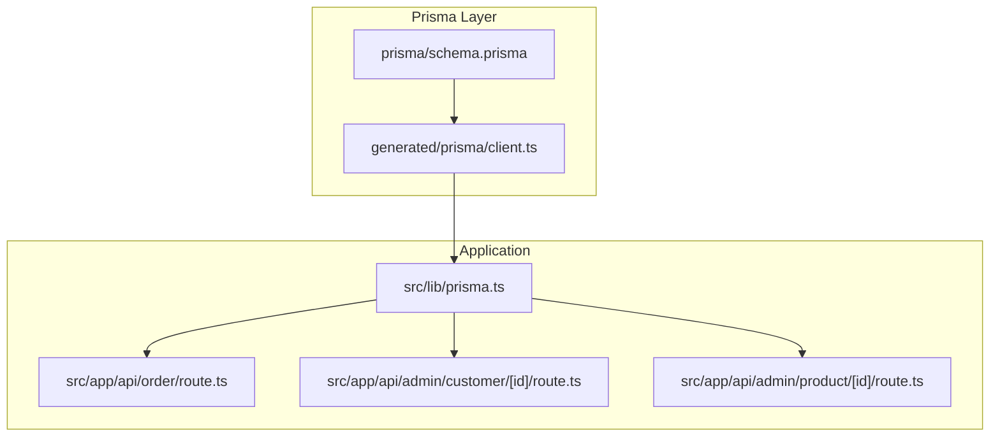
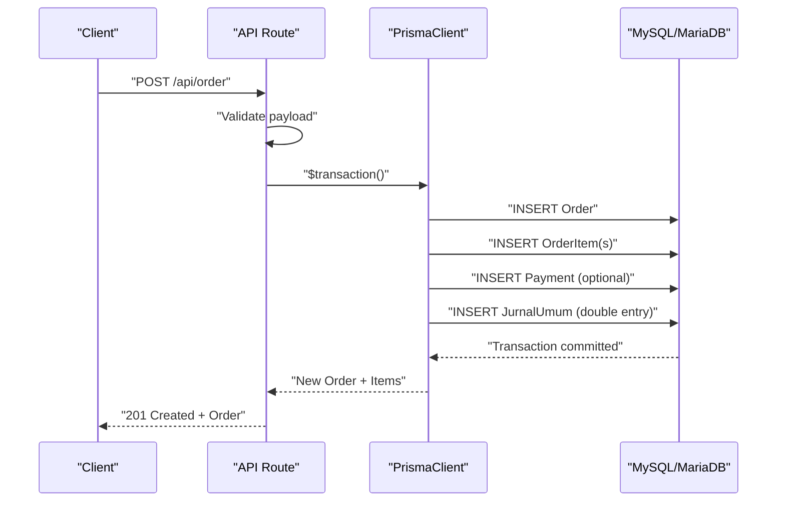
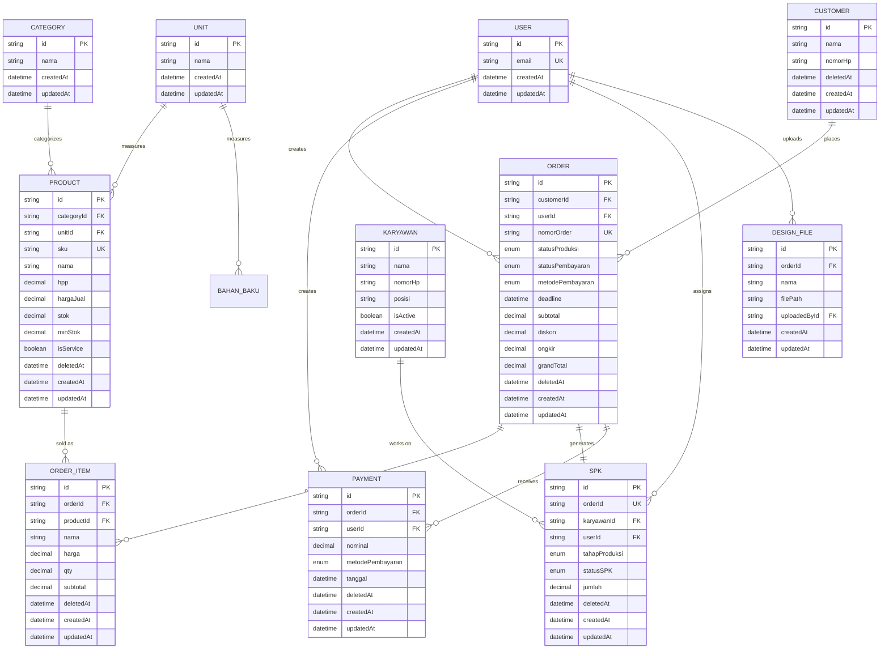
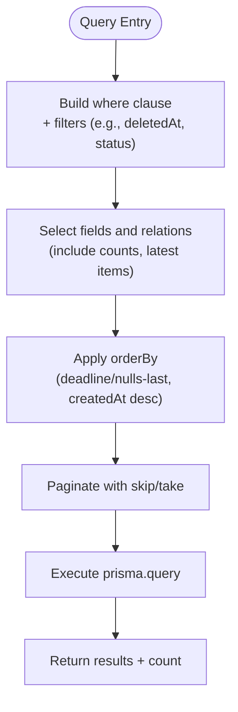
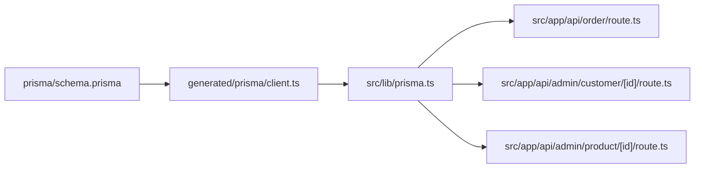

# Core Entities & Relationships

<cite>
**Referenced Files in This Document**
- [schema.prisma](file://prisma/schema.prisma)
- [migration.sql](file://prisma/migrations/20260423131358_add_soft_delete/migration.sql)
- [client.ts](file://generated/prisma/client.ts)
- [prisma.ts](file://src/lib/prisma.ts)
- [order.route.ts](file://src/app/api/order/route.ts)
- [customer.[id].route.ts](file://src/app/api/admin/customer/[id]/route.ts)
- [product.[id].route.ts](file://src/app/api/admin/product/[id]/route.ts)
- [func.ts](file://src/lib/func.ts)
</cite>

## Table of Contents
1. [Introduction](#introduction)
2. [Project Structure](#project-structure)
3. [Core Components](#core-components)
4. [Architecture Overview](#architecture-overview)
5. [Detailed Component Analysis](#detailed-component-analysis)
6. [Dependency Analysis](#dependency-analysis)
7. [Performance Considerations](#performance-considerations)
8. [Troubleshooting Guide](#troubleshooting-guide)
9. [Conclusion](#conclusion)
10. [Appendices](#appendices)

## Introduction
This document explains the core database entities and their relationships in the Point of Sale system. It focuses on the fundamental business entities: User, Customer, Product, Order, and their interconnected relationships. It documents primary keys, foreign key constraints, referential integrity rules, soft delete implementation, cascading behaviors, indexing strategies, and common query patterns using Prisma ORM. Entity lifecycle and practical traversal patterns are illustrated with real API routes.

## Project Structure
The data model is defined in the Prisma schema and generated into a strongly-typed client. The application uses a PrismaClient configured with a MariaDB adapter. API routes demonstrate typical CRUD and transactional operations against these entities.

**Diagram sources**
- [schema.prisma](file://prisma/schema.prisma)
- [client.ts](file://generated/prisma/client.ts)
- [prisma.ts](file://src/lib/prisma.ts)
- [order.route.ts](file://src/app/api/order/route.ts)
- [customer.[id].route.ts](file://src/app/api/admin/customer/[id]/route.ts)
- [product.[id].route.ts](file://src/app/api/admin/product/[id]/route.ts)

**Section sources**
- [schema.prisma](file://prisma/schema.prisma)
- [client.ts](file://generated/prisma/client.ts)
- [prisma.ts](file://src/lib/prisma.ts)

## Core Components
This section outlines the core entities and their attributes, constraints, and relationships.

- User
  - Primary key: id (String)
  - Unique constraints: email
  - Relationships: owns Orders, Payments, SPKs, Notifications, Comments; authenticates via Accounts and Sessions
  - Lifecycle: soft delete column exists in schema; cascade on dependent relations
  - Indexes: none explicitly declared; relies on unique/email constraints

- Customer
  - Primary key: id (String)
  - Attributes: nama, nomorHp, image, timestamps
  - Soft delete: deletedAt (DateTime?)
  - Relationships: places Orders
  - Indexes: composite index on nama

- Product
  - Primary key: id (String)
  - Unique constraints: sku
  - Attributes: categoryId, unitId, nama, image, hpp, hargaJual, stok, minStok, isService, timestamps
  - Soft delete: deletedAt (DateTime?)
  - Relationships: referenced by OrderItem; belongs to Category and Unit
  - Indexes: sku, nama

- Order
  - Primary key: id (String)
  - Unique constraints: nomorOrder (VarChar(50))
  - Enumerations: channel, statusProduksi, statusPembayaran, metodePembayaran, designReviewStatus
  - Attributes: customerId, userId, designerId, deadline, catatan, subtotal, diskon, ongkir, grandTotal, timestamps, isDesignFinal
  - Soft delete: deletedAt (DateTime?)
  - Relationships: belongs to Customer and optional User; contains OrderItems; links to SPK, Payments, DesignFiles, Comments
  - Indexes: customerId, userId, nomorOrder, statusPembayaran, createdAt

- OrderItem
  - Primary key: id (String)
  - Attributes: orderId, productId, nama, harga, qty, subtotal, timestamps
  - Soft delete: deletedAt (DateTime?)
  - Relationships: belongs to Order and Product
  - Indexes: orderId, productId

- DesignFile
  - Primary key: id (String)
  - Attributes: orderId, nama, filePath, uploadedById, timestamps
  - Relationships: belongs to Order and User (uploadedBy)
  - Indexes: orderId

- SPK
  - Primary key: id (String)
  - Unique constraints: orderId, nomorSpk (VarChar(50))
  - Enumerations: tahapProduksi, statusSPK
  - Attributes: orderId, karyawanId, userId, model, tali, ukuran, jumlah, catatan, tanggalSetor, accCetak flags, timestamps
  - Soft delete: deletedAt (DateTime?)
  - Relationships: belongs to Order and Karyawan; creates PengeluaranBarang entries
  - Indexes: karyawanId, tahapProduksi

- Payment
  - Primary key: id (String)
  - Attributes: orderId, userId, nominal, metodePembayaran, keterangan, tanggal, timestamps
  - Soft delete: deletedAt (DateTime?)
  - Relationships: belongs to Order and optional User; connects to JurnalUmum entries
  - Indexes: orderId, userId, tanggal

- Additional Entities (selected)
  - Category: id, nama, timestamps; Products
  - Unit: id, nama, timestamps; Products, BahanBaku
  - BahanBaku: id, unitId, nama, stok, minStok, keterangan, isActive, timestamps; Unit, StokMasuk, StokKeluar
  - PenerimaanBarang: id, nomorFaktur, supplierId, tanggal, keterangan, buktiNota, totalTagihan, addedById, timestamps; Supplier, User, StokMasuk, JurnalUmum
  - StokMasuk/StokKeluar: linking entries for inventory movement
  - Karyawan: id, nama, nomorHp, posisi, isActive, timestamps; SPK
  - PengeluaranBarang: id, spkId, tanggal, keterangan, addedById, timestamps; SPK, User, StokKeluar
  - Akun/KasBank/JurnalUmum: Chart of Accounts, Bank/Cash accounts, Double-entry journal entries
  - AppSetting: system-wide settings (single-row table)
  - Notification: user notifications
  - OrderComment/CommentRecipient: order discussion and recipients

**Section sources**
- [schema.prisma](file://prisma/schema.prisma)

## Architecture Overview
The application uses Prisma ORM to define entities and relationships, generating a client consumed by API routes. Transactions are used to maintain consistency across related writes (e.g., creating an Order and associated Journal entries).

**Diagram sources**
- [order.route.ts](file://src/app/api/order/route.ts)
- [client.ts](file://generated/prisma/client.ts)

**Section sources**
- [order.route.ts](file://src/app/api/order/route.ts)
- [prisma.ts](file://src/lib/prisma.ts)

## Detailed Component Analysis

### Entity Relationship Model
The following ER diagram captures primary keys, foreign keys, and key relationships among core entities.

**Diagram sources**
- [schema.prisma](file://prisma/schema.prisma)

**Section sources**
- [schema.prisma](file://prisma/schema.prisma)

### Soft Delete Implementation
Soft deletes are implemented via a deletedAt timestamp on several entities: Product, Customer, Order, OrderItem, Payment, PenerimaanBarang, PengeluaranBarang, SPK, and Cost. The 20260423 migration adds deletedAt columns and re-indexes product.sku. Queries commonly filter by deletedAt IS NULL to exclude soft-deleted rows.

Key behaviors:
- Product deletion sets deletedAt; API routes demonstrate moving a product to trash by updating deletedAt.
- Customer deletion removes the record immediately (no soft delete in the route shown).
- Other entities support soft delete via deletedAt.

**Section sources**
- [schema.prisma](file://prisma/schema.prisma)
- [migration.sql](file://prisma/migrations/20260423131358_add_soft_delete/migration.sql)
- [product.[id].route.ts](file://src/app/api/admin/product/[id]/route.ts)
- [customer.[id].route.ts](file://src/app/api/admin/customer/[id]/route.ts)

### Cascading Behaviors and Referential Integrity
- Order.customerId → Customer(id): onDelete Restrict (prevents deleting a customer who has orders)
- Order.userId → User(id): onDelete SetNull (optional user association)
- OrderItem.orderId → Order(id): onDelete Cascade (deleting an order also deletes items)
- OrderItem.productId → Product(id): onDelete Restrict (prevents deleting a product referenced by items)
- Product.categoryId → Category(id): onDelete Cascade (deleting a category deletes products)
- Product.unitId → Unit(id): onDelete Cascade
- SPK.orderId → Order(id): onDelete Cascade
- SPK.karyawanId → Karyawan(id): onDelete Restrict
- Payment.orderId → Order(id): onDelete Cascade
- Payment.userId → User(id): onDelete SetNull
- DesignFile.orderId → Order(id): onDelete Cascade
- DesignFile.uploadedById → User(id): onDelete Restrict
- PenerimaanBarang.supplierId → Supplier(id): onDelete SetNull
- PenerimaanBarang.addedById → User(id): onDelete SetNull
- StokMasuk.penerimaanId → PenerimaanBarang(id): onDelete Cascade
- StokMasuk.bahanBakuId → BahanBaku(id): onDelete Restrict
- StokKeluar.pengeluaranId → PengeluaranBarang(id): onDelete Cascade
- StokKeluar.bahanBakuId → BahanBaku(id): onDelete Restrict
- BahanBaku.unitId → Unit(id): onDelete Restrict

These rules ensure referential integrity and predictable cascades during updates/deletes.

**Section sources**
- [schema.prisma](file://prisma/schema.prisma)

### Indexing Strategies
Indexes improve query performance for frequent filters and joins:
- Product: sku, nama
- Customer: nama
- Order: customerId, userId, nomorOrder, statusPembayaran, createdAt
- OrderItem: orderId, productId
- DesignFile: orderId
- SPK: karyawanId, tahapProduksi
- Payment: orderId, userId, tanggal
- PenerimaanBarang: supplierId, addedById, tanggal
- PengeluaranBarang: spkId, addedById, tanggal
- StokMasuk/StokKeluar: penerimaanId/bahanBakuId, pengeluaranId/bahanBakuId
- Unit: nama
- Category: nama
- Notification: userId, isRead
- CommentRecipient: userId, isRead

**Section sources**
- [schema.prisma](file://prisma/schema.prisma)

### Common Query Patterns and Traversals (Prisma ORM)
Below are representative patterns used across the codebase. Replace the ellipsis (...) with the appropriate selection fields and relations.

- List Orders with customer, item counts, and latest items
  - Pattern: findMany with where filters, orderBy, and select including relations and _count
  - Reference: [order.route.ts](file://src/app/api/order/route.ts)

- Create Order with Items and optional Payment + Journal Entries
  - Pattern: Prisma $transaction to insert Order, OrderItem(s), Payment (if applicable), and JurnalUmum entries
  - Reference: [order.route.ts](file://src/app/api/order/route.ts)

- Update Product (SKU uniqueness, category/unit validation)
  - Pattern: findFirst for duplicates, findUnique for category/unit, update
  - Reference: [product.[id].route.ts](file://src/app/api/admin/product/[id]/route.ts)

- Update Customer (name uniqueness excluding self)
  - Pattern: findFirst with not filter, update
  - Reference: [customer.[id].route.ts](file://src/app/api/admin/customer/[id]/route.ts)

- Soft delete Product
  - Pattern: update with deletedAt set
  - Reference: [product.[id].route.ts](file://src/app/api/admin/product/[id]/route.ts)

- Count stock status for UI
  - Pattern: computed status based on isService, stok, minStok
  - Reference: [func.ts](file://src/lib/func.ts)

**Diagram sources**
- [order.route.ts](file://src/app/api/order/route.ts)

**Section sources**
- [order.route.ts](file://src/app/api/order/route.ts)
- [product.[id].route.ts](file://src/app/api/admin/product/[id]/route.ts)
- [customer.[id].route.ts](file://src/app/api/admin/customer/[id]/route.ts)
- [func.ts](file://src/lib/func.ts)

## Dependency Analysis
High-level dependencies between layers and files:

**Diagram sources**
- [schema.prisma](file://prisma/schema.prisma)
- [client.ts](file://generated/prisma/client.ts)
- [prisma.ts](file://src/lib/prisma.ts)
- [order.route.ts](file://src/app/api/order/route.ts)
- [customer.[id].route.ts](file://src/app/api/admin/customer/[id]/route.ts)
- [product.[id].route.ts](file://src/app/api/admin/product/[id]/route.ts)

**Section sources**
- [schema.prisma](file://prisma/schema.prisma)
- [client.ts](file://generated/prisma/client.ts)
- [prisma.ts](file://src/lib/prisma.ts)
- [order.route.ts](file://src/app/api/order/route.ts)
- [customer.[id].route.ts](file://src/app/api/admin/customer/[id]/route.ts)
- [product.[id].route.ts](file://src/app/api/admin/product/[id]/route.ts)

## Performance Considerations
- Use targeted selects to avoid fetching unnecessary relation data in list views.
- Leverage indexes on frequently filtered columns (e.g., nomorOrder, statusPembayaran, customerId).
- Batch reads/writes using Promise.all where safe.
- Prefer orderBy with supported indices (createdAt, deadline) to reduce sorting overhead.
- Soft delete queries should consistently filter deletedAt IS NULL to prevent scanning tombstoned rows.

## Troubleshooting Guide
Common issues and resolutions:
- Foreign key constraint violations
  - Example: Deleting a Customer with existing Orders fails with Restrict. Resolve by removing or reassigning orders first.
  - Reference: [schema.prisma](file://prisma/schema.prisma)

- Duplicate unique keys
  - Example: Creating Order with existing nomorOrder or Product with existing sku triggers unique constraint errors.
  - Reference: [order.route.ts](file://src/app/api/order/route.ts), [product.[id].route.ts](file://src/app/api/admin/product/[id]/route.ts)

- Missing mandatory fields
  - Example: Order creation requires items, subtotal, and grandTotal; Payment requires valid kasBankId and nominal when status is DP/Lunas.
  - Reference: [order.route.ts](file://src/app/api/order/route.ts)

- Soft-deleted records interfering with queries
  - Ensure deletedAt IS NULL filtering in list endpoints.
  - Reference: [order.route.ts](file://src/app/api/order/route.ts), [migration.sql](file://prisma/migrations/20260423131358_add_soft_delete/migration.sql)

**Section sources**
- [schema.prisma](file://prisma/schema.prisma)
- [order.route.ts](file://src/app/api/order/route.ts)
- [product.[id].route.ts](file://src/app/api/admin/product/[id]/route.ts)
- [migration.sql](file://prisma/migrations/20260423131358_add_soft_delete/migration.sql)

## Conclusion
The system’s core entities form a cohesive domain model centered around Orders, Customers, Products, and supporting operational entities. Soft deletes and explicit indexes enable scalable maintenance and performance. Prisma’s typed client and transactional APIs facilitate robust, consistent operations across the order lifecycle.

## Appendices

### Appendix A: Entity Lifecycle Summary
- Creation: API routes validate inputs, optionally reserve stock, and persist transactions atomically.
- Updates: Validation ensures uniqueness (email, sku, nama) and referential integrity (category/unit existence).
- Deletion: Product soft-deleted; Customer hard-deleted in the provided route; other entities support soft delete via deletedAt.

**Section sources**
- [order.route.ts](file://src/app/api/order/route.ts)
- [product.[id].route.ts](file://src/app/api/admin/product/[id]/route.ts)
- [customer.[id].route.ts](file://src/app/api/admin/customer/[id]/route.ts)
- [schema.prisma](file://prisma/schema.prisma)