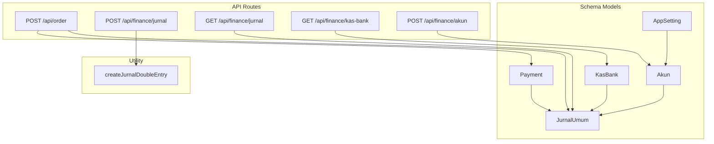
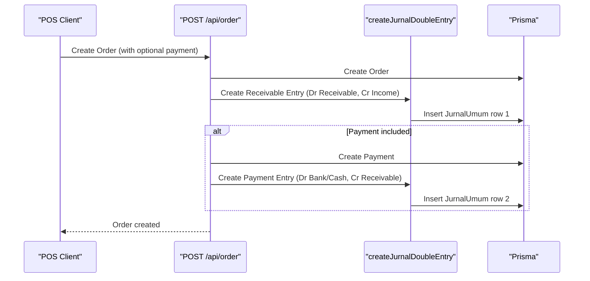
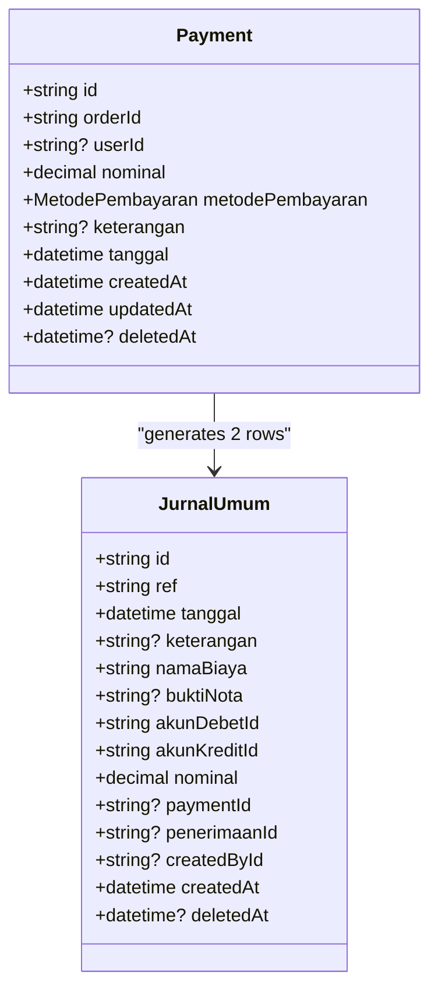
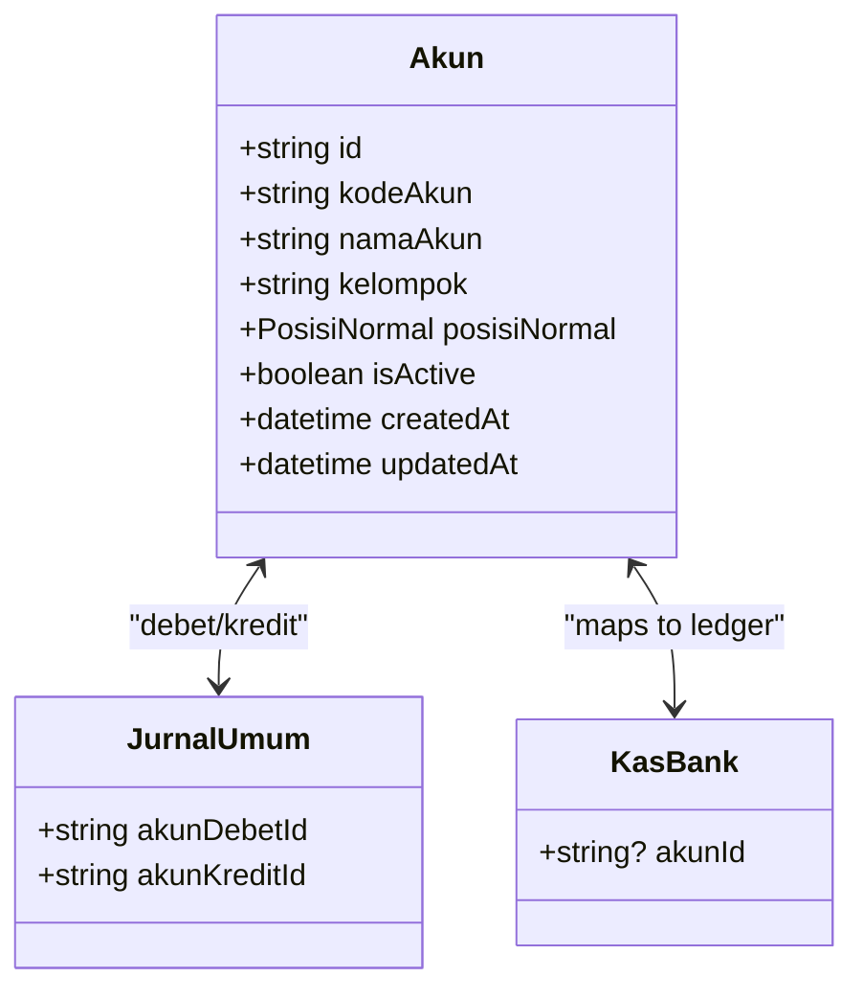
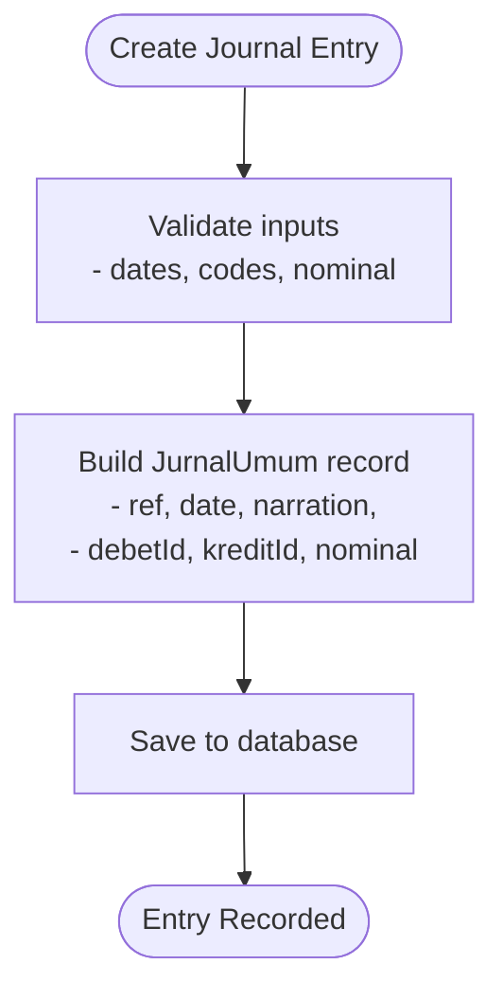
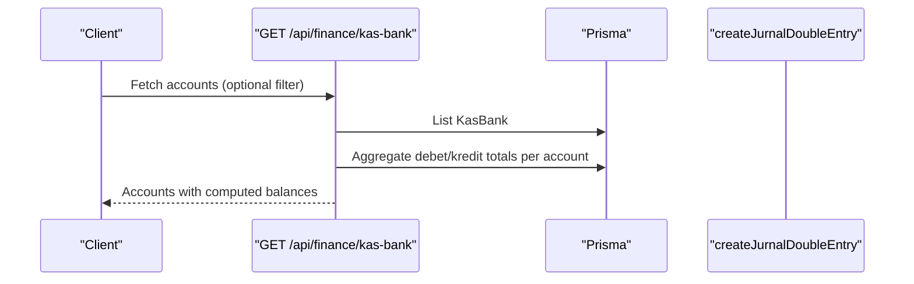
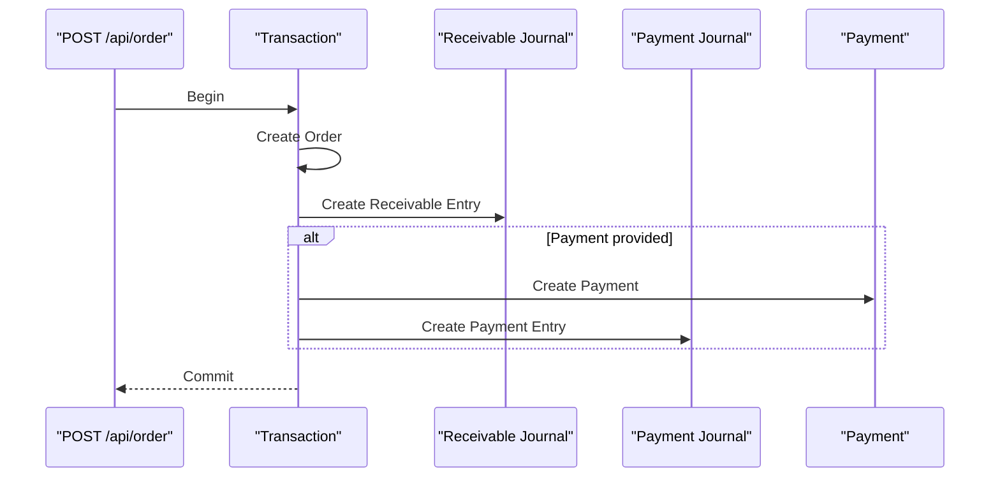
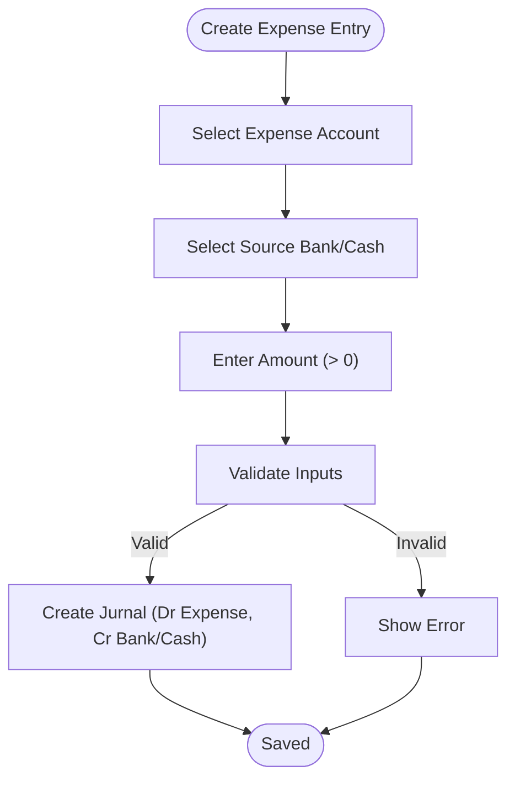
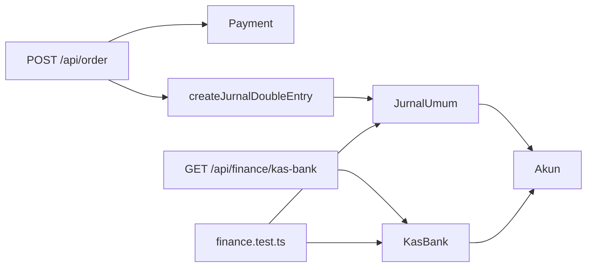

# Financial Accounting Entities

<cite>
**Referenced Files in This Document**
- [schema.prisma](file://prisma/schema.prisma)
- [order.route.ts](file://src/app/api/order/route.ts)
- [finance.ts](file://src/lib/finance.ts)
- [akun.route.ts](file://src/app/api/finance/akun/route.ts)
- [jurnal.route.ts](file://src/app/api/finance/jurnal/route.ts)
- [kas-bank.route.ts](file://src/app/api/finance/kas-bank/route.ts)
- [finance.test.ts](file://src/__tests__/finance.test.ts)
- [seed-finance.ts](file://prisma/seed-finance.ts)
</cite>

## Table of Contents
1. [Introduction](#introduction)
2. [Project Structure](#project-structure)
3. [Core Components](#core-components)
4. [Architecture Overview](#architecture-overview)
5. [Detailed Component Analysis](#detailed-component-analysis)
6. [Dependency Analysis](#dependency-analysis)
7. [Performance Considerations](#performance-considerations)
8. [Troubleshooting Guide](#troubleshooting-guide)
9. [Conclusion](#conclusion)
10. [Appendices](#appendices)

## Introduction
This document explains the financial accounting entities and workflows in the system, focusing on Payment, Akun (Chart of Accounts), JurnalUmum (General Journal), and KasBank (Bank/Cash Accounts). It covers the chart of accounts structure, double-entry bookkeeping system, automated journal entry generation, payment processing integration with sales transactions, revenue recognition, expense recording, multi-rekening support, cash flow tracking, and financial statement generation.

## Project Structure
The financial domain is defined in the Prisma schema and implemented through API routes and shared utilities:
- Prisma schema defines models and enums for financial entities and their relationships
- API routes orchestrate transactional workflows (orders, payments, journals)
- Shared utility creates standardized double-entry journal records
- Tests validate financial calculations and report logic
- Seed script initializes chart of accounts and bank accounts

**Diagram sources**
- [schema.prisma:399-503](file://prisma/schema.prisma#L399-L503)
- [order.route.ts:333-408](file://src/app/api/order/route.ts#L333-L408)
- [finance.ts:26-54](file://src/lib/finance.ts#L26-L54)
- [jurnal.route.ts:16-125](file://src/app/api/finance/jurnal/route.ts#L16-L125)
- [kas-bank.route.ts:16-81](file://src/app/api/finance/kas-bank/route.ts#L16-L81)
- [akun.route.ts:27-180](file://src/app/api/finance/akun/route.ts#L27-L180)

**Section sources**
- [schema.prisma:399-503](file://prisma/schema.prisma#L399-L503)
- [order.route.ts:333-408](file://src/app/api/order/route.ts#L333-L408)
- [finance.ts:26-54](file://src/lib/finance.ts#L26-L54)
- [jurnal.route.ts:16-125](file://src/app/api/finance/jurnal/route.ts#L16-L125)
- [kas-bank.route.ts:16-81](file://src/app/api/finance/kas-bank/route.ts#L16-L81)
- [akun.route.ts:27-180](file://src/app/api/finance/akun/route.ts#L27-L180)

## Core Components
- Payment: Records cash/bank receipts against orders, linked to two journal rows (automatically generated)
- Akun: Chart of Accounts with groups (Asset, Liability, Equity, Income, Expense), normal positions, and links to journals and bank accounts
- JurnalUmum: General Journal storing debits, credits, amounts, references, and optional associations to payments and receipts
- KasBank: Bank/cash accounts mapped to ledger accounts, with balances computed from journal entries

Key relationships:
- Payment has many JurnalUmum entries (two rows per payment)
- JurnalUmum references two Akun (debet and kredit) and optionally Payment or Receipt
- KasBank belongs to an Akun (ledger alignment)

**Section sources**
- [schema.prisma:399-503](file://prisma/schema.prisma#L399-L503)
- [schema.prisma:425-446](file://prisma/schema.prisma#L425-L446)
- [schema.prisma:452-480](file://prisma/schema.prisma#L452-L480)
- [schema.prisma:488-503](file://prisma/schema.prisma#L488-L503)

## Architecture Overview
The system follows a double-entry bookkeeping architecture:
- Sales create a receivable entry (debit receivable, credit income)
- Payments against sales reduce receivables and increase bank/cash
- Expenses create expense entries (debit expense, credit bank/cash)
- All entries are stored in JurnalUmum with consistent debits and credits

**Diagram sources**
- [order.route.ts:333-408](file://src/app/api/order/route.ts#L333-L408)
- [finance.ts:26-54](file://src/lib/finance.ts#L26-L54)

**Section sources**
- [order.route.ts:333-408](file://src/app/api/order/route.ts#L333-L408)
- [finance.ts:26-54](file://src/lib/finance.ts#L26-L54)

## Detailed Component Analysis

### Payment Model
- Purpose: Track cash/bank receipts associated with orders
- Behavior: Automatically generates two journal rows upon creation (via API transaction)
- Fields: Amount, method, date, optional user association, and links to order and journals

**Diagram sources**
- [schema.prisma:399-419](file://prisma/schema.prisma#L399-L419)
- [schema.prisma:452-480](file://prisma/schema.prisma#L452-L480)

**Section sources**
- [schema.prisma:399-419](file://prisma/schema.prisma#L399-L419)
- [order.route.ts:369-408](file://src/app/api/order/route.ts#L369-L408)

### Akun (Chart of Accounts)
- Structure: Unique code, name, group, normal position (Debet or Kredit), active flag
- Groups: Asset (AKTIVA_LANCAR), Liability (KEWAJIBAN), Equity (MODAL), Income (PENDAPATAN), Expense (BEBAN_USAHA)
- Links: Related journals (both debit and credit sides) and bank accounts

**Diagram sources**
- [schema.prisma:425-446](file://prisma/schema.prisma#L425-L446)
- [schema.prisma:452-480](file://prisma/schema.prisma#L452-L480)
- [schema.prisma:488-503](file://prisma/schema.prisma#L488-L503)

**Section sources**
- [schema.prisma:425-446](file://prisma/schema.prisma#L425-L446)
- [akun.route.ts:62-135](file://src/app/api/finance/akun/route.ts#L62-L135)
- [seed-finance.ts:13-84](file://prisma/seed-finance.ts#L13-L84)

### JurnalUmum (General Journal)
- Purpose: Central ledger capturing all financial movements
- Double-entry: Every entry has equal debits and credits
- Optional associations: Payment, Receipt, Created-by user
- Filtering: Supports date range, search, and pagination

**Diagram sources**
- [jurnal.route.ts:84-125](file://src/app/api/finance/jurnal/route.ts#L84-L125)
- [finance.ts:26-54](file://src/lib/finance.ts#L26-L54)

**Section sources**
- [jurnal.route.ts:16-125](file://src/app/api/finance/jurnal/route.ts#L16-L125)
- [finance.ts:26-54](file://src/lib/finance.ts#L26-L54)

### KasBank (Bank/Cash Accounts)
- Purpose: Manage multiple bank and cash accounts
- Linkage: Each account maps to a ledger Akun for balance alignment
- Balance computation: Sum of debet vs. kredit entries for the mapped ledger account

**Diagram sources**
- [kas-bank.route.ts:16-81](file://src/app/api/finance/kas-bank/route.ts#L16-L81)

**Section sources**
- [kas-bank.route.ts:16-81](file://src/app/api/finance/kas-bank/route.ts#L16-L81)
- [schema.prisma:488-503](file://prisma/schema.prisma#L488-L503)

### Automated Journal Generation on Orders
- Receivable entry: On order creation, a journal entry debits receivable and credits income
- Payment entry: If payment is provided during order creation, a second entry debits bank/cash and credits receivable
- Both entries are created within the same transaction to maintain atomicity

**Diagram sources**
- [order.route.ts:333-408](file://src/app/api/order/route.ts#L333-L408)

**Section sources**
- [order.route.ts:333-408](file://src/app/api/order/route.ts#L333-L408)

### Expense Recording Workflow
- Expense entry creation: Select expense account, source bank/cash, amount, and optional reference
- Journal pair: Debit expense account, Credit bank/cash account
- Validation: Ensures valid account, positive amount, and valid source account

**Diagram sources**
- [jurnal.route.ts:84-125](file://src/app/api/finance/jurnal/route.ts#L84-L125)

**Section sources**
- [jurnal.route.ts:84-125](file://src/app/api/finance/jurnal/route.ts#L84-L125)

### Multi-Rekening Support and Cash Flow Tracking
- Multi-rekening: Multiple KasBank entries mapped to distinct ledger accounts
- Cash flow: Computed by aggregating debet and kredit totals per ledger account
- Filtering: API supports filtering by account type (bank, cash, ewallet)

**Section sources**
- [kas-bank.route.ts:16-81](file://src/app/api/finance/kas-bank/route.ts#L16-L81)
- [schema.prisma:488-503](file://prisma/schema.prisma#L488-L503)

### Financial Reporting Preparation
- Income Statement: Sum income and expense accounts by groups
- Balance Sheet: Compute asset, liability, equity balances using normal positions
- Savings/Tabs: Group tabungan entries by month for trend analysis

**Section sources**
- [finance.test.ts:35-101](file://src/__tests__/finance.test.ts#L35-L101)
- [finance.test.ts:103-161](file://src/__tests__/finance.test.ts#L103-L161)

## Dependency Analysis
- API routes depend on Prisma models and the shared journal utility
- Payment depends on JurnalUmum for dual-row entries
- JurnalUmum depends on Akun for debet/kredit accounts and optionally Payment/Receipt
- KasBank depends on Akun for ledger alignment
- Tests validate report computations independently of runtime

**Diagram sources**
- [order.route.ts:333-408](file://src/app/api/order/route.ts#L333-L408)
- [finance.ts:26-54](file://src/lib/finance.ts#L26-L54)
- [jurnal.route.ts:16-125](file://src/app/api/finance/jurnal/route.ts#L16-L125)
- [kas-bank.route.ts:16-81](file://src/app/api/finance/kas-bank/route.ts#L16-L81)
- [finance.test.ts:35-161](file://src/__tests__/finance.test.ts#L35-L161)

**Section sources**
- [order.route.ts:333-408](file://src/app/api/order/route.ts#L333-L408)
- [finance.ts:26-54](file://src/lib/finance.ts#L26-L54)
- [jurnal.route.ts:16-125](file://src/app/api/finance/jurnal/route.ts#L16-L125)
- [kas-bank.route.ts:16-81](file://src/app/api/finance/kas-bank/route.ts#L16-L81)
- [finance.test.ts:35-161](file://src/__tests__/finance.test.ts#L35-L161)

## Performance Considerations
- Indexes on frequently filtered fields (dates, account IDs) improve query performance
- Aggregation queries for balances should leverage indexed fields
- Transaction batching for multiple journal entries reduces round trips
- Pagination for journal listings prevents large result sets

## Troubleshooting Guide
Common issues and resolutions:
- Invalid account codes: Ensure codes match expected prefixes and uniqueness constraints
- Journal imbalance: Verify debet and kredit IDs are set and nominal is positive
- Payment without valid bank account: Confirm KasBank has a valid ledger account mapping
- Soft deletion: Deleting journals cascades to related Payment/Receipt records

**Section sources**
- [akun.route.ts:62-135](file://src/app/api/finance/akun/route.ts#L62-L135)
- [jurnal.route.ts:127-169](file://src/app/api/finance/jurnal/route.ts#L127-L169)
- [kas-bank.route.ts:83-112](file://src/app/api/finance/kas-bank/route.ts#L83-L112)

## Conclusion
The system implements a robust double-entry financial framework with automated journal generation tied to sales and payment workflows. The chart of accounts aligns with ledger standards, multi-rekening support enables cash flow tracking, and built-in utilities ensure consistent journal entries. Financial statements can be prepared by grouping journal entries by account groups and applying normal positions.

## Appendices

### Example Workflows

- Invoice Payment Processing
  - Create order with optional down payment
  - Automatic receivable entry on order creation
  - Additional payment entry debits bank/cash and credits receivable

- Automatic Journal Creation
  - Receivable entry: Dr Receivable, Cr Income
  - Payment entry: Dr Bank/Cash, Cr Receivable

- Financial Reporting
  - Income Statement: Group income and expense accounts by category
  - Balance Sheet: Compute asset/liability/equity balances using normal positions
  - Tabungan Reports: Group savings entries by month

**Section sources**
- [order.route.ts:333-408](file://src/app/api/order/route.ts#L333-L408)
- [finance.test.ts:35-101](file://src/__tests__/finance.test.ts#L35-L101)
- [finance.test.ts:103-161](file://src/__tests__/finance.test.ts#L103-L161)