# Inventory & Raw Materials Entities

<cite>
**Referenced Files in This Document**
- [schema.prisma](file://prisma/schema.prisma)
- [types.ts](file://src/types/types.ts)
- [route.ts](file://src/app/api/admin/bahan-baku/[id]/stok-masuk/route.ts)
- [gudang.puml](file://diagram/activity/gudang.puml)
- [part3-produksi-inventori.plantuml](file://diagram/class/part3-produksi-inventori.plantuml)
</cite>

## Table of Contents
1. [Introduction](#introduction)
2. [Project Structure](#project-structure)
3. [Core Components](#core-components)
4. [Architecture Overview](#architecture-overview)
5. [Detailed Component Analysis](#detailed-component-analysis)
6. [Dependency Analysis](#dependency-analysis)
7. [Performance Considerations](#performance-considerations)
8. [Troubleshooting Guide](#troubleshooting-guide)
9. [Conclusion](#conclusion)
10. [Appendices](#appendices)

## Introduction
This document explains the inventory management entities and workflows focused on raw materials (BahanBaku), incoming goods (PenerimaanBarang and StokMasuk), outgoing materials for production (PengeluaranBarang and StokKeluar), and the end-to-end inventory flow from procurement to production consumption. It also covers stock tracking mechanisms, valuation, minimum stock thresholds, alerts, and reporting capabilities grounded in the repository’s Prisma schema, TypeScript types, and API routes.

## Project Structure
The inventory domain spans three primary areas:
- Data modeling: Prisma schema defines entities and relations for raw materials, receipts, issues, and production linkage.
- Type definitions: TypeScript interfaces formalize entity shapes for frontend/backend contracts.
- API layer: Routes implement stock entry procedures, stock updates, and retrieval of transaction history.

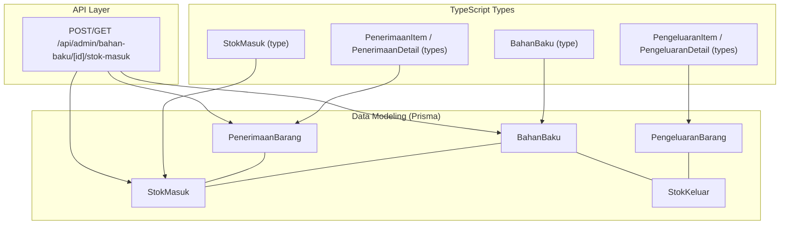

**Diagram sources**
- [schema.prisma](file://prisma/schema.prisma)
- [types.ts](file://src/types/types.ts)
- [route.ts](file://src/app/api/admin/bahan-baku/[id]/stok-masuk/route.ts)

**Section sources**
- [schema.prisma](file://prisma/schema.prisma)
- [types.ts](file://src/types/types.ts)
- [route.ts](file://src/app/api/admin/bahan-baku/[id]/stok-masuk/route.ts)

## Core Components
- BahanBaku: Raw material entity with current stock level, minimum stock threshold, unit relation, and lifecycle timestamps.
- PenerimaanBarang: Receipt header capturing supplier, invoice/reference, receipt date, notes, attached proof, and total invoice amount.
- StokMasuk: Receipt line items linking a receipt to a raw material, quantity received, purchase price, and computed item total.
- PengeluaranBarang: Production issue header linked to SPK, with date, notes, and creator.
- StokKeluar: Issue line items linking an issue to a raw material and quantity issued.

These components collectively support the procurement-to-production inventory cycle with explicit audit trails and financial linkage via journal entries.

**Section sources**
- [schema.prisma](file://prisma/schema.prisma)
- [types.ts](file://src/types/types.ts)

## Architecture Overview
The inventory architecture follows a relational model with clear separation of concerns:
- Entities define schema and referential integrity.
- Types define API/UI contracts.
- API routes encapsulate business logic for recording stock movements and updating balances.

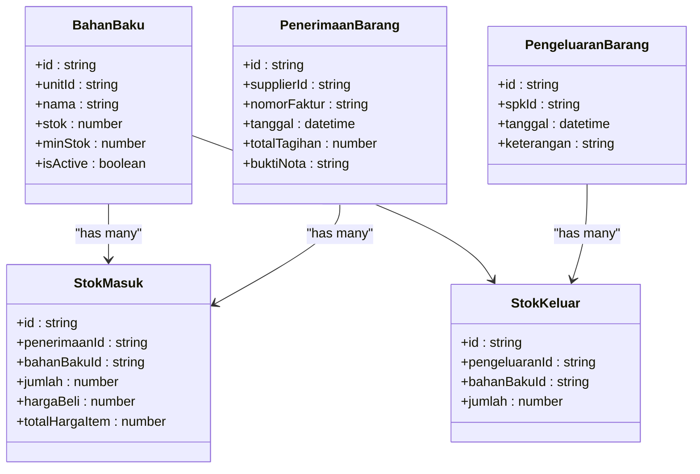

**Diagram sources**
- [schema.prisma](file://prisma/schema.prisma)

**Section sources**
- [schema.prisma](file://prisma/schema.prisma)

## Detailed Component Analysis

### BahanBaku (Raw Material)
- Purpose: Stores raw material identity, unit association, current stock, minimum stock threshold, and metadata.
- Key attributes: id, unitId, nama, stok, minStok, isActive, timestamps.
- Behavior: Supports stock increase upon receipt and decrease upon issuance; minimum stock threshold enables alerting.

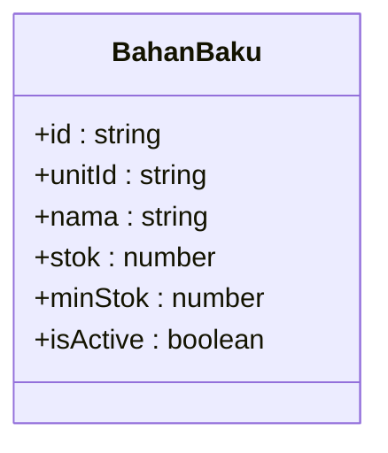

**Diagram sources**
- [schema.prisma](file://prisma/schema.prisma)
- [types.ts](file://src/types/types.ts)

**Section sources**
- [schema.prisma](file://prisma/schema.prisma)
- [types.ts](file://src/types/types.ts)

### PenerimaanBarang (Incoming Goods Header)
- Purpose: Captures receipt events with supplier, invoice/reference, receipt date, notes, and attached proof.
- Key attributes: id, supplierId, nomorFaktur, tanggal, keterangan, buktiNota, totalTagihan, addedById, timestamps.
- Relations: Links to Supplier and User; contains multiple StokMasuk items; connects to journal entries.

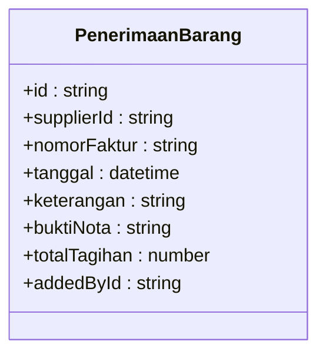

**Diagram sources**
- [schema.prisma](file://prisma/schema.prisma)
- [types.ts](file://src/types/types.ts)

**Section sources**
- [schema.prisma](file://prisma/schema.prisma)
- [types.ts](file://src/types/types.ts)

### StokMasuk (Incoming Goods Line Items)
- Purpose: Records quantities received per raw material for a given receipt, optional purchase price, and computed item total.
- Key attributes: id, penerimaanId, bahanBakuId, jumlah, hargaBeli, totalHargaItem, timestamps.
- Relations: Links to PenerimaanBarang and BahanBaku; cascading deletes on receipt deletion.

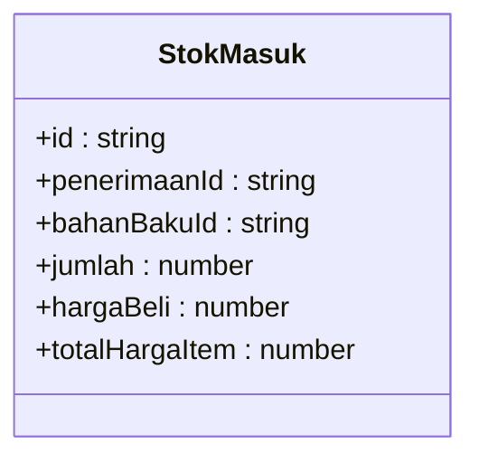

**Diagram sources**
- [schema.prisma](file://prisma/schema.prisma)
- [types.ts](file://src/types/types.ts)

**Section sources**
- [schema.prisma](file://prisma/schema.prisma)
- [types.ts](file://src/types/types.ts)

### PengeluaranBarang (Production Issue Header)
- Purpose: Tracks issuance of raw materials for production (linked to SPK), with date, notes, and creator.
- Key attributes: id, spkId, tanggal, keterangan, addedById, timestamps.
- Relations: Links to SPK and User; contains multiple StokKeluar items.

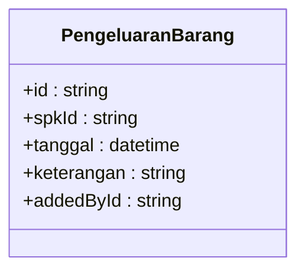

**Diagram sources**
- [schema.prisma](file://prisma/schema.prisma)
- [types.ts](file://src/types/types.ts)

**Section sources**
- [schema.prisma](file://prisma/schema.prisma)
- [types.ts](file://src/types/types.ts)

### StokKeluar (Production Issue Line Items)
- Purpose: Records quantities issued per raw material for a given issue.
- Key attributes: id, pengeluaranId, bahanBakuId, jumlah, timestamps.
- Relations: Links to PengeluaranBarang and BahanBaku; cascading deletes on issue deletion.

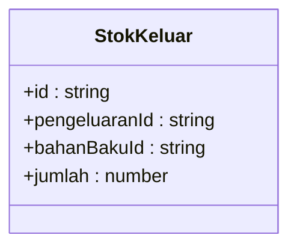

**Diagram sources**
- [schema.prisma](file://prisma/schema.prisma)
- [types.ts](file://src/types/types.ts)

**Section sources**
- [schema.prisma](file://prisma/schema.prisma)
- [types.ts](file://src/types/types.ts)

### API Workflow: Recording Stock Entry (StokMasuk)
This sequence illustrates the end-to-end process for adding incoming stock and updating the raw material balance.

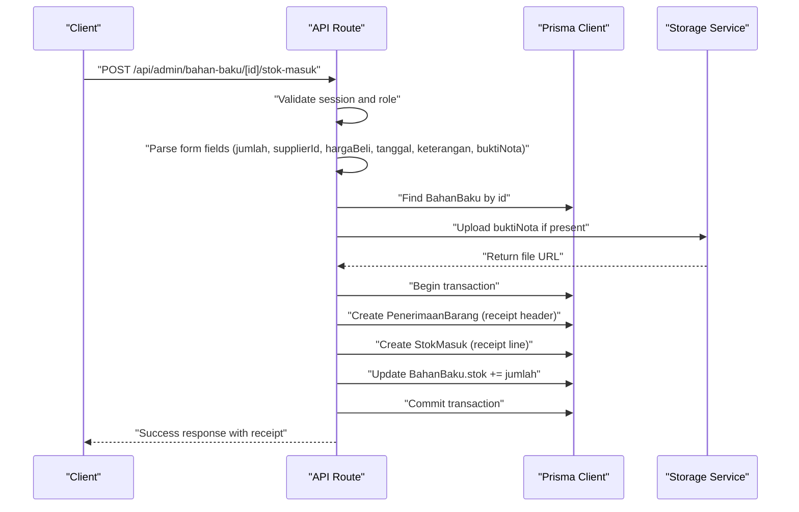

**Diagram sources**
- [route.ts](file://src/app/api/admin/bahan-baku/[id]/stok-masuk/route.ts)

**Section sources**
- [route.ts](file://src/app/api/admin/bahan-baku/[id]/stok-masuk/route.ts)

### Inventory Valuation Mechanisms
- Purchase price capture: StokMasuk stores hargaBeli per item, enabling cost tracking per receipt line.
- Item total computation: totalHargaItem reflects jumlah × hargaBeli when applicable.
- Financial linkage: PenerimaanBarang maintains totalTagihan aligned with receipt line totals, supporting journal entries.

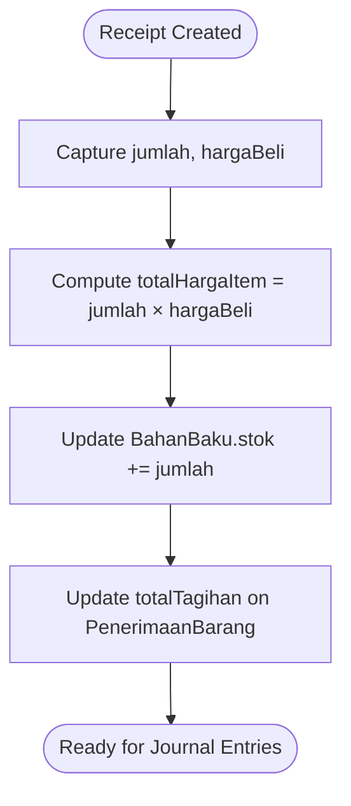

**Diagram sources**
- [schema.prisma](file://prisma/schema.prisma)
- [route.ts](file://src/app/api/admin/bahan-baku/[id]/stok-masuk/route.ts)

**Section sources**
- [schema.prisma](file://prisma/schema.prisma)
- [route.ts](file://src/app/api/admin/bahan-baku/[id]/stok-masuk/route.ts)

### Stock Tracking and Minimum Stock Thresholds
- Current stock: BahanBaku.stok tracks available inventory.
- Minimum stock: BahanBaku.minStok sets threshold for alerts.
- Alerting: The activity diagram indicates checking availability and raising errors when stock is insufficient, enabling minimum stock enforcement.

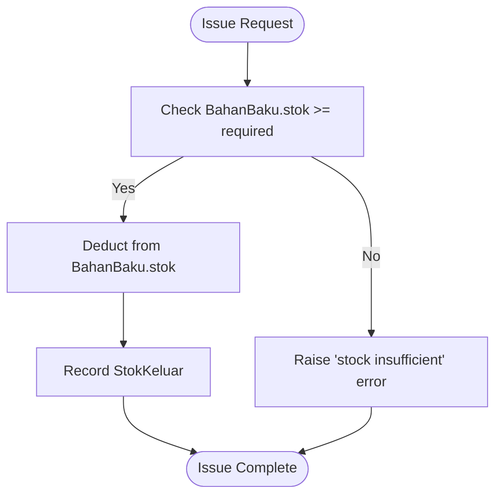

**Diagram sources**
- [gudang.puml](file://diagram/activity/gudang.puml)
- [schema.prisma](file://prisma/schema.prisma)

**Section sources**
- [gudang.puml](file://diagram/activity/gudang.puml)
- [schema.prisma](file://prisma/schema.prisma)

### Relationship Between Raw Materials and Production Workflows
- SPK linkage: PengeluaranBarang is associated with SPK, connecting material issuance to production tasks.
- Issue flow: StokKeluar records quantities issued per raw material for a given SPK-linked issue.
- Material requirements: While explicit BOM calculations are not shown in the referenced files, the SPK entity holds production parameters (model, size, quantity) that inform material requirement planning.

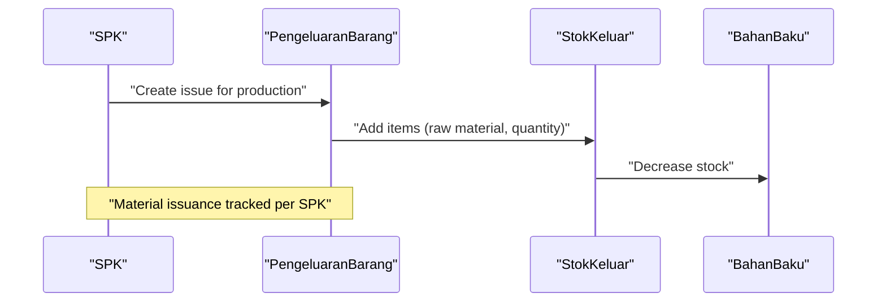

**Diagram sources**
- [schema.prisma](file://prisma/schema.prisma)

**Section sources**
- [schema.prisma](file://prisma/schema.prisma)

### Examples and Procedures

#### Example: Recording Stock Entry (Procurement Receipt)
- Steps:
  - Authenticate and authorize admin.
  - Submit form with jumlah, supplierId (optional), hargaBeli (optional), tanggal, keterangan, and buktiNota (optional).
  - Backend validates inputs, uploads attachment if provided, creates PenerimaanBarang header, StokMasuk line, and increments BahanBaku.stok within a transaction.
- Outcome: Receipt recorded with updated stock and financial totals ready for journal posting.

**Section sources**
- [route.ts](file://src/app/api/admin/bahan-baku/[id]/stok-masuk/route.ts)
- [schema.prisma](file://prisma/schema.prisma)

#### Example: Material Issuance for SPK Production
- Steps:
  - Create PengeluaranBarang linked to SPK.
  - Add StokKeluar items specifying raw material and quantity.
  - System enforces stock availability and decrements BahanBaku.stok accordingly.
- Outcome: Production-ready issuance with traceable material consumption.

**Section sources**
- [schema.prisma](file://prisma/schema.prisma)
- [gudang.puml](file://diagram/activity/gudang.puml)

#### Example: Inventory Reconciliation Processes
- Conceptual steps:
  - Compare system BahanBaku.stok against physical counts.
  - Adjust via stock adjustments (not shown in current schema) or reconcile discrepancies.
  - Update BahanBaku.stok and record supporting documentation/journal entries.
- Note: The current schema includes a separate StokOpname domain; reconciliation can leverage similar patterns if re-enabled.

**Section sources**
- [schema.prisma](file://prisma/schema.prisma)

### Inventory Reporting
- Receipt history: API supports paginated retrieval of StokMasuk entries per raw material, including supplier and receipt metadata.
- Issue history: Similar patterns apply for StokKeluar under PengeluaranBarang.
- Reporting surfaces: Use the returned arrays of items to build reports on movement trends, supplier spend, and consumption by SPK.

**Section sources**
- [route.ts](file://src/app/api/admin/bahan-baku/[id]/stok-masuk/route.ts)
- [types.ts](file://src/types/types.ts)

## Dependency Analysis
The following diagram highlights key dependencies among inventory entities and their relations.

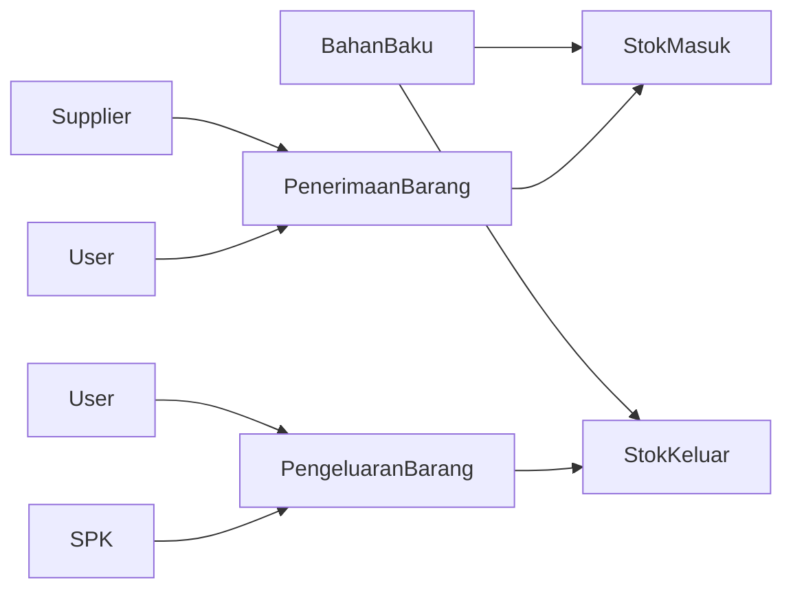

**Diagram sources**
- [schema.prisma](file://prisma/schema.prisma)

**Section sources**
- [schema.prisma](file://prisma/schema.prisma)

## Performance Considerations
- Indexes: Schema includes indexes on frequently queried columns (e.g., tanggal, supplierId, addedById), aiding query performance for receipts and issues.
- Transactions: API routes wrap receipt creation and stock updates in transactions to maintain consistency.
- Pagination: API supports pagination for retrieving movement histories, reducing payload sizes.

[No sources needed since this section provides general guidance]

## Troubleshooting Guide
- Unauthorized/Forbidden Access:
  - Ensure admin role and valid session before invoking stock entry APIs.
- Invalid Quantity:
  - The API rejects zero or negative quantities; verify input validation.
- Missing Raw Material:
  - Creation fails if the target BahanBaku does not exist; confirm ID correctness.
- File Upload Issues:
  - Attachment upload requires non-empty files; verify file presence and type.
- Stock Insufficient:
  - Production issuance fails if available stock is below required quantity; adjust or delay issuance.

**Section sources**
- [route.ts](file://src/app/api/admin/bahan-baku/[id]/stok-masuk/route.ts)
- [gudang.puml](file://diagram/activity/gudang.puml)

## Conclusion
The inventory system integrates raw material tracking, procurement receipts, and production issuance through well-defined entities and API workflows. The schema supports stock updates, valuation, and financial alignment, while types and routes provide robust contracts and transactional integrity. Minimum stock thresholds and alerting patterns enable proactive inventory management, and reporting is supported by paginated movement retrieval.

[No sources needed since this section summarizes without analyzing specific files]

## Appendices

### Entity and Attribute Reference
- BahanBaku
  - Attributes: id, unitId, nama, stok, minStok, isActive, timestamps.
  - Relations: stokMasuk[], stokKeluar[].
- PenerimaanBarang
  - Attributes: id, supplierId, nomorFaktur, tanggal, keterangan, buktiNota, totalTagihan, addedById, timestamps.
  - Relations: items[], jurnalUmums[].
- StokMasuk
  - Attributes: id, penerimaanId, bahanBakuId, jumlah, hargaBeli, totalHargaItem, timestamps.
- PengeluaranBarang
  - Attributes: id, spkId, tanggal, keterangan, addedById, timestamps.
  - Relations: items[].
- StokKeluar
  - Attributes: id, pengeluaranId, bahanBakuId, jumlah, timestamps.

**Section sources**
- [schema.prisma](file://prisma/schema.prisma)
- [types.ts](file://src/types/types.ts)