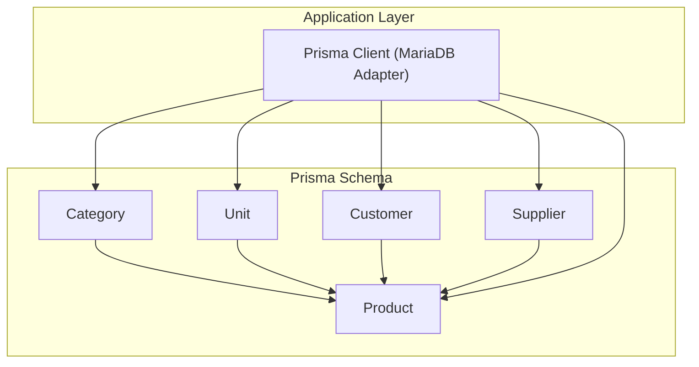
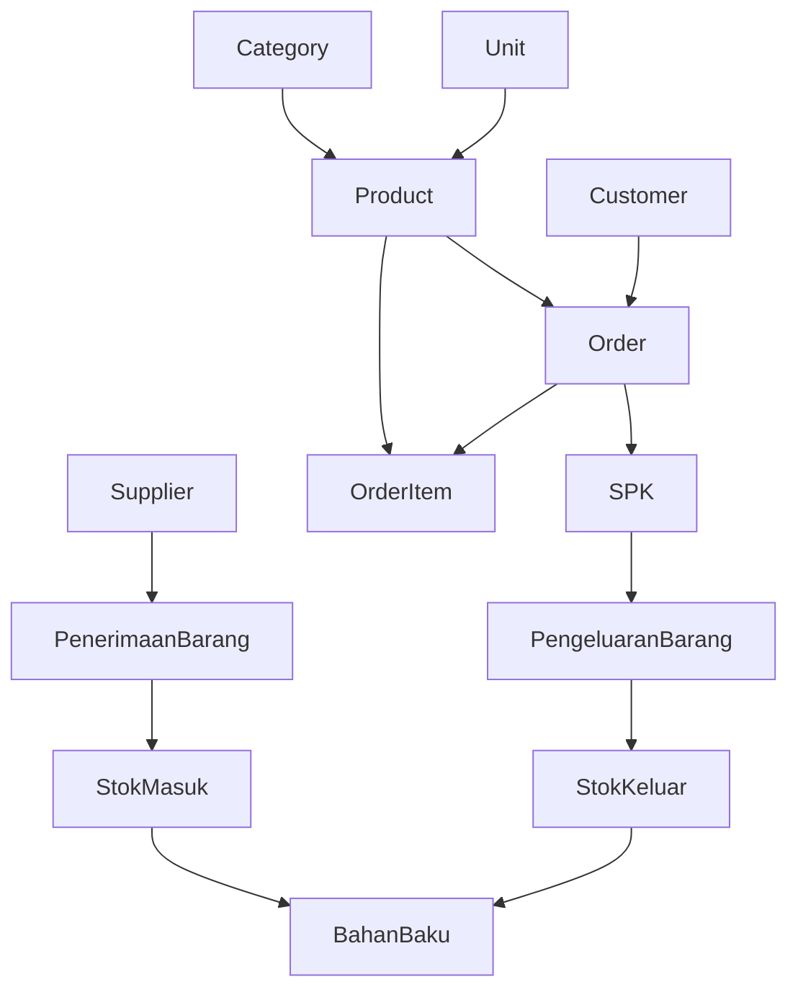
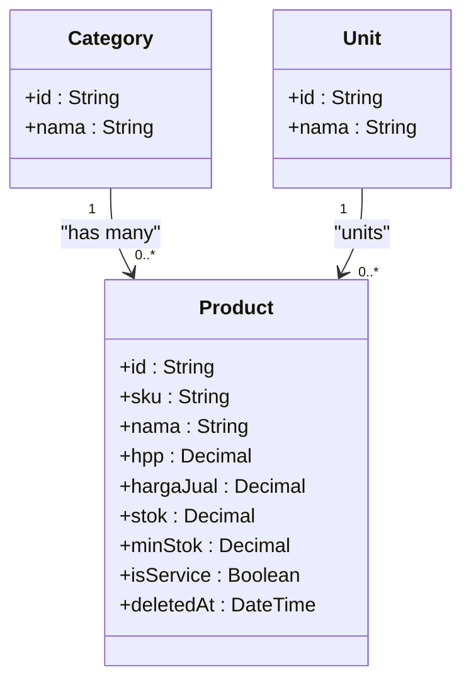
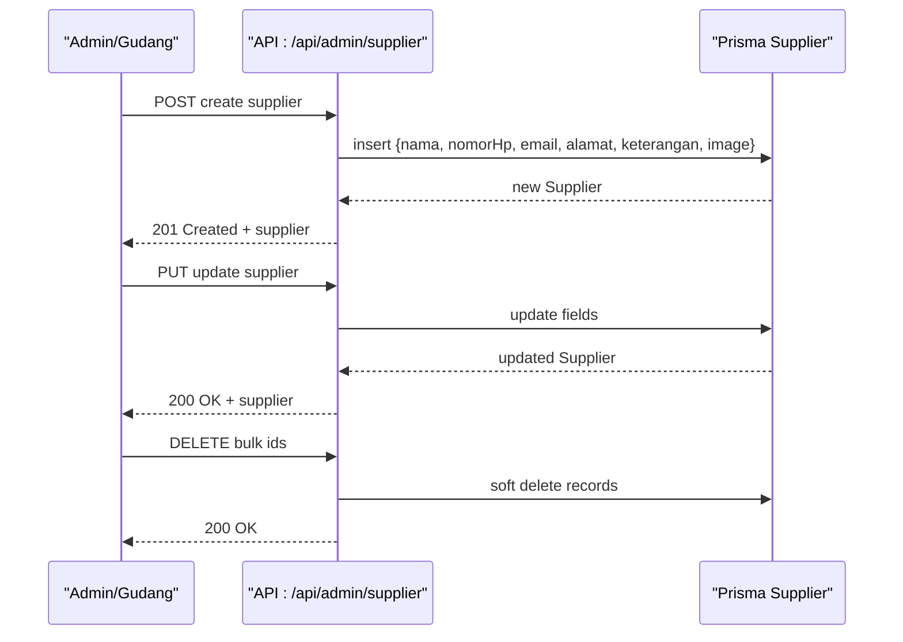
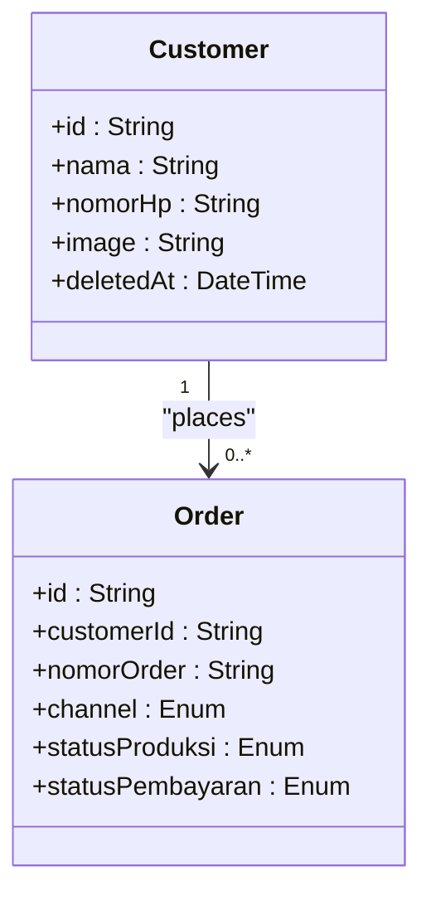
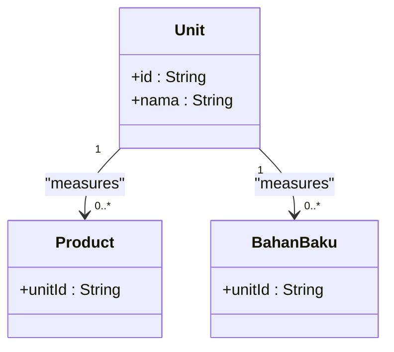
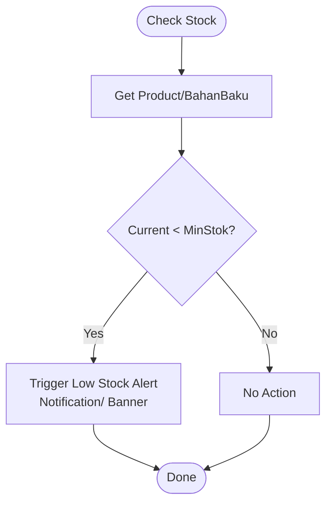
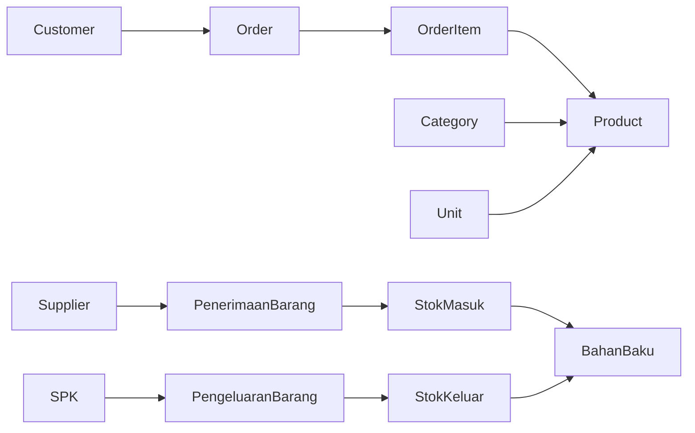
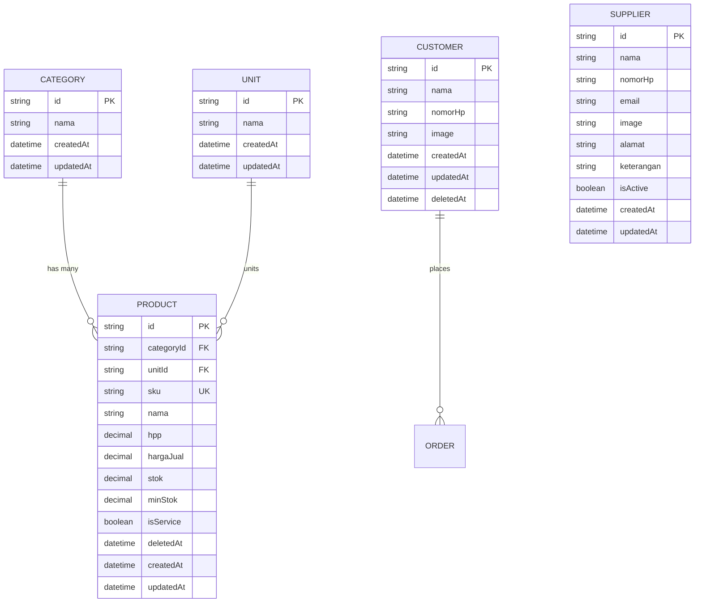

# Master Data Entities

<cite>
**Referenced Files in This Document**
- [schema.prisma](file://prisma/schema.prisma)
- [prisma.ts](file://src/lib/prisma.ts)
- [seed-product.ts](file://prisma/seed-product.ts)
- [part1-master-data.plantuml](file://diagram/class/part1-master-data.plantuml)
- [part3-produksi-inventori.plantuml](file://diagram/class/part3-produksi-inventori.plantuml)
- [class.plantuml](file://diagram/class.plantuml)
- [route.ts (Admin Supplier)](file://src/app/api/admin/supplier/route.ts)
- [route.ts (Admin Supplier ID)](file://src/app/api/admin/supplier/[id]/route.ts)
</cite>

## Table of Contents
1. [Introduction](#introduction)
2. [Project Structure](#project-structure)
3. [Core Components](#core-components)
4. [Architecture Overview](#architecture-overview)
5. [Detailed Component Analysis](#detailed-component-analysis)
6. [Dependency Analysis](#dependency-analysis)
7. [Performance Considerations](#performance-considerations)
8. [Troubleshooting Guide](#troubleshooting-guide)
9. [Conclusion](#conclusion)
10. [Appendices](#appendices)

## Introduction
This document explains the master data entities central to the garment manufacturing workflow: Customer, Supplier, Category, Unit, and Product. It details their relationships, business significance, and how they integrate with inventory, production, and financial modules. It also covers product categorization, unit measurements, supplier relationships, customer management, SKU generation, pricing structures, stock management, minimum stock alerts, and soft delete/archiving strategies.

## Project Structure
The master data models are defined in the Prisma schema and backed by a MariaDB adapter in the application. The class diagrams illustrate conceptual and code-level relationships among entities.

**Diagram sources**
- [schema.prisma](file://prisma/schema.prisma)
- [prisma.ts](file://src/lib/prisma.ts)

**Section sources**
- [schema.prisma](file://prisma/schema.prisma)
- [prisma.ts](file://src/lib/prisma.ts)

## Core Components
This section documents each entity’s attributes, constraints, and relationships, and ties them to business processes.

- Category
  - Purpose: Defines product classification (e.g., Totebag, Ransel).
  - Attributes: id, nama, timestamps.
  - Relationship: One-to-many with Product via categoryId.
  - Business Significance: Enables product categorization and reporting.

- Unit
  - Purpose: Standardizes measurement units (e.g., Pcs, Lusin).
  - Attributes: id, nama, timestamps.
  - Relationships: One-to-many with Product and BahanBaku (raw materials).
  - Business Significance: Ensures consistent unit usage across procurement, production, and sales.

- Product
  - Purpose: Core offering in the manufacturing workflow.
  - Key Fields: sku (unique), nama, hpp, hargaJual, stok, minStok, isService, deletedAt, categoryId, unitId.
  - Relationships: Belongs to Category and Unit; referenced by OrderItem.
  - Business Significance: Central to pricing, stock control, and order fulfillment.

- Customer
  - Purpose: Entity placing orders.
  - Attributes: id, nama, nomorHp, image, timestamps, deletedAt.
  - Relationships: One-to-many with Order.
  - Business Significance: Drives demand planning and customer segmentation.

- Supplier
  - Purpose: Source of raw materials.
  - Attributes: id, nama, nomorHp, email, image, alamat, keterangan, isActive, timestamps.
  - Relationships: One-to-many with PenerimaanBarang (goods receipt).
  - Business Significance: Supports procurement planning and vendor performance tracking.

**Section sources**
- [schema.prisma](file://prisma/schema.prisma)

## Architecture Overview
The master data layer integrates tightly with inventory, production, and finance. Suppliers deliver raw materials recorded as goods receipts, which update BahanBaku stock. Products are sold via Orders, tracked by OrderItems, and priced using hpp and hargaJual. Stock levels and minimum thresholds trigger alerts.

**Diagram sources**
- [schema.prisma](file://prisma/schema.prisma)
- [part3-produksi-inventori.plantuml](file://diagram/class/part3-produksi-inventori.plantuml)

## Detailed Component Analysis

### Product Model and SKU Generation
- SKU Generation
  - The Product model enforces a unique sku field, ensuring each product variant has a distinct identifier.
  - The seed script demonstrates SKU-driven categorization and estimation of HPP as a percentage below selling price.
- Pricing Structure
  - hpp stores the cost of goods manufactured/purchased.
  - hargaJual stores the sale price.
  - isService indicates whether the “product” is a service versus a physical item.
- Stock Management
  - stok holds current inventory quantity; minStok defines reorder threshold.
  - OrderItem references Product to track sales and stock deductions during order fulfillment.
- Soft Delete and Archiving
  - deletedAt enables soft deletion for archival while preserving referential integrity in related transactions.

**Diagram sources**
- [schema.prisma](file://prisma/schema.prisma)
- [seed-product.ts](file://prisma/seed-product.ts)

**Section sources**
- [schema.prisma](file://prisma/schema.prisma)
- [seed-product.ts](file://prisma/seed-product.ts)

### Supplier Onboarding and Management
- Supplier lifecycle includes creation, updates, activation/deactivation, and bulk deletion.
- API endpoints enforce role-based access (admin/gudang) and validate inputs.
- deletedAt is not present on Supplier; archival is handled outside the master data scope here.

**Diagram sources**
- [route.ts (Admin Supplier)](file://src/app/api/admin/supplier/route.ts)
- [route.ts (Admin Supplier ID)](file://src/app/api/admin/supplier/[id]/route.ts)
- [schema.prisma](file://prisma/schema.prisma)

**Section sources**
- [route.ts (Admin Supplier)](file://src/app/api/admin/supplier/route.ts)
- [route.ts (Admin Supplier ID)](file://src/app/api/admin/supplier/[id]/route.ts)
- [schema.prisma](file://prisma/schema.prisma)

### Customer Management and Segmentation
- Customer stores contact and identification details and supports soft deletion via deletedAt.
- Orders link customers to purchase history, enabling segmentation by transaction volume, recency, and channels.

**Diagram sources**
- [schema.prisma](file://prisma/schema.prisma)

**Section sources**
- [schema.prisma](file://prisma/schema.prisma)

### Unit Measurements and Inventory Alignment
- Unit serves as a shared denominator across Product and BahanBaku.
- Consistent unit selection ensures accurate conversions and stock tracking across procurement, production, and sales.

**Diagram sources**
- [schema.prisma](file://prisma/schema.prisma)
- [part3-produksi-inventori.plantuml](file://diagram/class/part3-produksi-inventori.plantuml)

**Section sources**
- [schema.prisma](file://prisma/schema.prisma)
- [part3-produksi-inventori.plantuml](file://diagram/class/part3-produksi-inventori.plantuml)

### Minimum Stock Alerts and Low Stock Mechanism
- Product.minStok and BahanBaku.minStok define thresholds for automatic alerts.
- The low stock banner and notifications module surface real-time alerts to users.

**Diagram sources**
- [schema.prisma](file://prisma/schema.prisma)
- [class.plantuml](file://diagram/class/class.plantuml)

**Section sources**
- [schema.prisma](file://prisma/schema.prisma)
- [class.plantuml](file://diagram/class/class.plantuml)

### Example Workflows

- Product Creation
  - Steps: Define Category and Unit, create Product with sku, nama, hpp, hargaJual, stok, minStok, isService, categoryId, unitId.
  - Validation: Unique sku enforced; category and unit relations validated.
  - Reference: [seed-product.ts](file://prisma/seed-product.ts)

- Supplier Onboarding
  - Steps: POST to supplier API with contact details; optionally set isActive; manage via PUT and DELETE endpoints.
  - Access Control: Requires admin or gudang role.
  - Reference: [route.ts (Admin Supplier)](file://src/app/api/admin/supplier/route.ts), [route.ts (Admin Supplier ID)](file://src/app/api/admin/supplier/[id]/route.ts)

- Customer Segmentation
  - Steps: Use Customer orders to segment by channel, status, and lifetime value; leverage Order.channel and Order.statusProduksi/statusPembayaran.
  - Reference: [schema.prisma](file://prisma/schema.prisma)

**Section sources**
- [seed-product.ts](file://prisma/seed-product.ts)
- [route.ts (Admin Supplier)](file://src/app/api/admin/supplier/route.ts)
- [route.ts (Admin Supplier ID)](file://src/app/api/admin/supplier/[id]/route.ts)
- [schema.prisma](file://prisma/schema.prisma)

## Dependency Analysis
Master data entities depend on Prisma models and are consumed by inventory, production, and finance modules. The class diagram below maps key relationships across modules.

**Diagram sources**
- [schema.prisma](file://prisma/schema.prisma)
- [class.plantuml](file://diagram/class/class.plantuml)

**Section sources**
- [schema.prisma](file://prisma/schema.prisma)
- [class.plantuml](file://diagram/class/class.plantuml)

## Performance Considerations
- Indexing: Unique and composite indexes on frequently queried fields (sku, nama, order identifiers) improve lookup performance.
- Decimal Precision: Using Decimal(10,2)/Decimal(12,2) ensures consistent financial calculations and avoids floating-point errors.
- Soft Deletes: deletedAt fields enable efficient archival without costly cascading deletes.
- Role-Based Access: API endpoints restrict sensitive operations to authorized roles, reducing accidental misuse.

[No sources needed since this section provides general guidance]

## Troubleshooting Guide
- Supplier API Errors
  - Unauthorized: Ensure session exists and role is admin or gudang.
  - Forbidden: Verify user role permissions.
  - Bad Request: Confirm payload includes required fields and ids array for bulk delete.
  - Internal Server Error: Check server logs for Prisma exceptions.
- Product Seeding
  - If products already exceed a threshold, seeding is skipped to avoid duplication.
  - SKU uniqueness is enforced; ensure SKUs are properly generated.

**Section sources**
- [route.ts (Admin Supplier)](file://src/app/api/admin/supplier/route.ts)
- [route.ts (Admin Supplier ID)](file://src/app/api/admin/supplier/[id]/route.ts)
- [seed-product.ts](file://prisma/seed-product.ts)

## Conclusion
Master data entities form the backbone of the garment manufacturing workflow. Category and Unit standardize product definitions and measurements; Product encapsulates pricing and stock; Customer and Supplier anchor demand and supply sides. The system leverages soft deletes, robust indexing, and modular APIs to support scalable operations, while class and sequence diagrams clarify relationships and flows.

[No sources needed since this section summarizes without analyzing specific files]

## Appendices

### Data Model Diagram (Master Data)

**Diagram sources**
- [schema.prisma](file://prisma/schema.prisma)