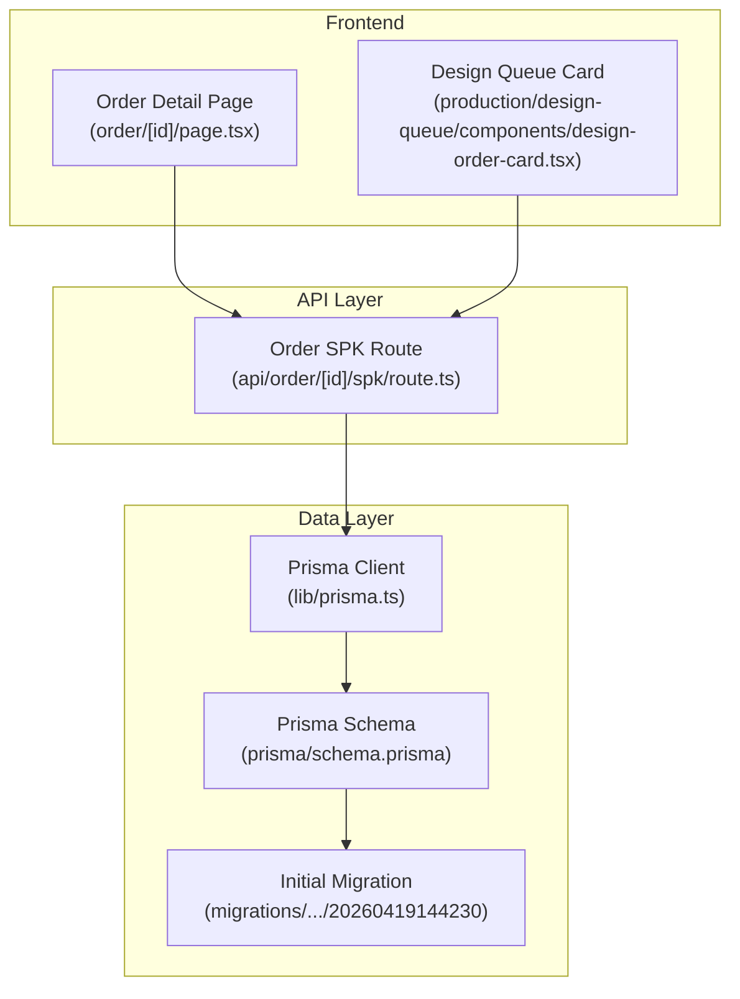
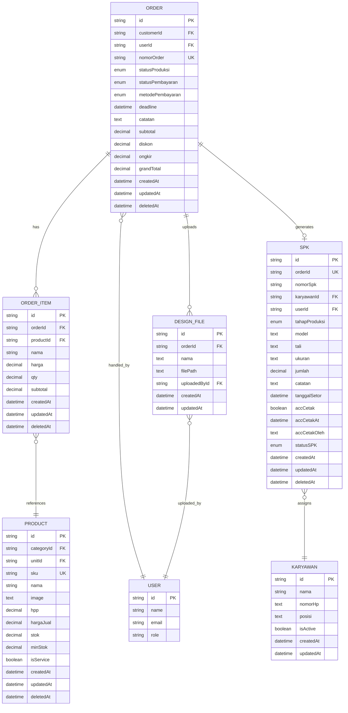
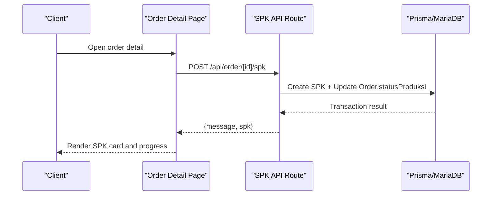
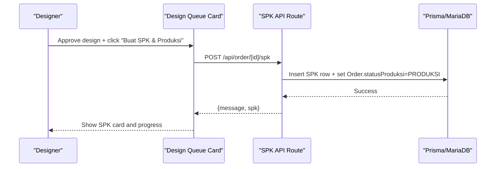
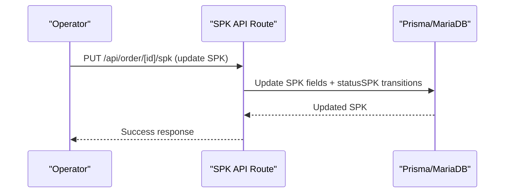
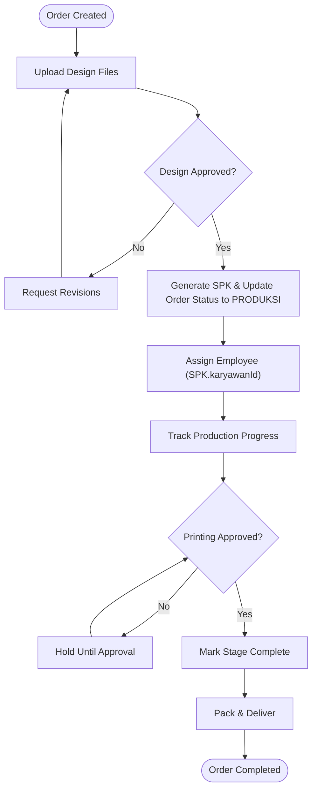
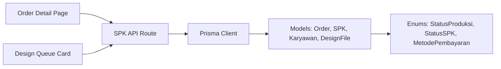
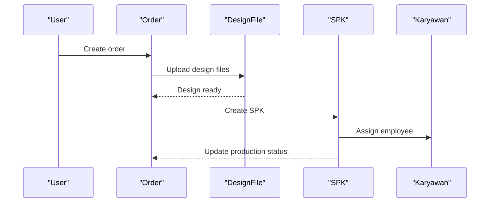

# Order & Production Entities

<cite>
**Referenced Files in This Document**
- [schema.prisma](file://prisma/schema.prisma)
- [migration.sql](file://prisma/migrations/20260419144230/migration.sql)
- [prisma.ts](file://src/lib/prisma.ts)
- [route.ts](file://src/app/api/order/[id]/spk/route.ts)
- [page.tsx](file://src/app/(LoggedIn)/order/[id]/page.tsx)
- [types.ts](file://src/app/(LoggedIn)/order/[id]/components/types.ts)
- [design-order-card.tsx](file://src/app/(LoggedIn)/production/design-queue/components/design-order-card.tsx)
- [types.ts](file://src/app/(LoggedIn)/production/design-queue/components/types.ts)
- [part3-produksi-inventori.plantuml](file://diagram/class/part3-produksi-inventori.plantuml)
- [01-buat-pesanan.mmd](file://diagram/sequence/01-buat-pesanan.mmd)
- [06-buat-spk-produksi.mmd](file://diagram/sequence/06-buat-spk-produksi.mmd)
- [07-update-status-spk.mmd](file://diagram/sequence/07-update-status-spk.mmd)
</cite>

## Table of Contents
1. [Introduction](#introduction)
2. [Project Structure](#project-structure)
3. [Core Components](#core-components)
4. [Architecture Overview](#architecture-overview)
5. [Detailed Component Analysis](#detailed-component-analysis)
6. [Dependency Analysis](#dependency-analysis)
7. [Performance Considerations](#performance-considerations)
8. [Troubleshooting Guide](#troubleshooting-guide)
9. [Conclusion](#conclusion)
10. [Appendices](#appendices)

## Introduction
This document explains the order management and production entities in the system, focusing on Order, OrderItem, DesignFile, SPK, and Karyawan models. It documents the end-to-end order-to-production workflow from order placement to delivery, including production scheduling, work order management, employee assignment, design review, production tracking, and quality checkpoints. It also covers order status management, deadline tracking, and production capacity planning.

## Project Structure
The system is a Next.js application with a Prisma ORM layer backed by MariaDB. The order and production features are organized under:
- Prisma schema defining models and enums
- API routes for SPK creation and updates
- Frontend pages and components for order detail, design queue, and SPK management
- Sequence diagrams illustrating key workflows

**Diagram sources**
- [page.tsx](file://src/app/(LoggedIn)/order/[id]/page.tsx#L1-L257)
- [design-order-card.tsx](file://src/app/(LoggedIn)/production/design-queue/components/design-order-card.tsx#L1-L772)
- [route.ts:115-158](file://src/app/api/order/[id]/spk/route.ts#L115-L158)
- [prisma.ts:1-25](file://src/lib/prisma.ts#L1-L25)
- [schema.prisma:260-374](file://prisma/schema.prisma#L260-L374)
- [migration.sql:286-326](file://prisma/migrations/20260419144230/migration.sql#L286-L326)

**Section sources**
- [prisma.ts:1-25](file://src/lib/prisma.ts#L1-L25)
- [schema.prisma:260-374](file://prisma/schema.prisma#L260-L374)
- [migration.sql:286-326](file://prisma/migrations/20260419144230/migration.sql#L286-L326)

## Core Components
This section defines the core entities and their relationships, derived from the Prisma schema and initial migration.

- Order
  - Unique order number, customer, user, channel, statusProduksi, statusPembayaran, metodePembayaran, deadline, subtotal, discount, shipping, grandTotal, and timestamps.
  - Relations: Customer, User, OrderItem[], DesignFile[], SPK?, Payment[], Designer (User).
  - Indexes: customerId, userId, nomorOrder, statusPembayaran, createdAt.

- OrderItem
  - Links an order to a product with quantity, pricing, and computed subtotal.
  - Relations: Order, Product.
  - Indexes: orderId, productId.

- DesignFile
  - Stores uploaded design files per order with metadata and uploader relation.
  - Relations: Order, User (uploadedBy).
  - Indexes: orderId.

- SPK (Work Order)
  - Unique work order linked to an order, with production stage (tahapProduksi), employee (Karyawan), model/tali/size/quantity, notes, printing approval fields, statusSPK, and timestamps.
  - Relations: Order, Karyawan, User, PengeluaranBarang[].
  - Indexes: karyawanId, tahapProduksi.

- Karyawan (Employee)
  - Employee record with name, phone, position, active flag, and relations to SPK.
  - Indexes: nama.

**Diagram sources**
- [schema.prisma:260-374](file://prisma/schema.prisma#L260-L374)
- [migration.sql:286-326](file://prisma/migrations/20260419144230/migration.sql#L286-L326)

**Section sources**
- [schema.prisma:260-374](file://prisma/schema.prisma#L260-L374)
- [migration.sql:286-326](file://prisma/migrations/20260419144230/migration.sql#L286-L326)

## Architecture Overview
The order-to-production workflow integrates frontend pages, API routes, and Prisma models. The sequence diagrams below illustrate key interactions.

**Diagram sources**
- [page.tsx](file://src/app/(LoggedIn)/order/[id]/page.tsx#L244-L256)
- [route.ts:115-158](file://src/app/api/order/[id]/spk/route.ts#L115-L158)

**Diagram sources**
- [design-order-card.tsx](file://src/app/(LoggedIn)/production/design-queue/components/design-order-card.tsx#L682-L693)
- [route.ts:115-158](file://src/app/api/order/[id]/spk/route.ts#L115-L158)

**Diagram sources**
- [route.ts:153-200](file://src/app/api/order/[id]/spk/route.ts#L153-L200)

## Detailed Component Analysis

### Order Model
- Purpose: Central entity representing customer orders, including financials, channel, payment status, and production status.
- Key fields: nomorOrder (unique), statusProduksi (PENDING, DESAIN, PRODUKSI, PACKING, SELESAI, BATAL), statusPembayaran (BELUM_BAYAR, DP, LUNAS, REFUND), metodePembayaran, deadline, totals.
- Relations: OrderItem (items), DesignFile (designs), SPK (work order), Payment (transactions), Customer/User (entities), Designer (User).
- Indexes optimize queries by customer, order number, payment status, and creation date.

**Section sources**
- [schema.prisma:260-296](file://prisma/schema.prisma#L260-L296)
- [types.ts](file://src/app/(LoggedIn)/order/[id]/components/types.ts#L22-L42)

### OrderItem Model
- Purpose: Line items linking an order to a product with pricing and quantities.
- Key fields: productId, nama, harga, qty, subtotal.
- Relations: Order, Product.
- Indexes: orderId, productId.

**Section sources**
- [schema.prisma:298-315](file://prisma/schema.prisma#L298-L315)
- [types.ts](file://src/app/(LoggedIn)/order/[id]/components/types.ts#L52-L60)

### DesignFile Model
- Purpose: Stores design assets uploaded for an order, with uploader identity.
- Key fields: orderId, nama, filePath, uploadedById.
- Relations: Order, User (uploadedBy).
- Indexes: orderId.

**Section sources**
- [schema.prisma:317-330](file://prisma/schema.prisma#L317-L330)
- [types.ts](file://src/app/(LoggedIn)/production/design-queue/components/types.ts#L1-L7)

### SPK (Work Order) Model
- Purpose: Production work order tied to an order, tracking stage, employee, and materials.
- Key fields: orderId (unique), nomorSpk (unique), karyawanId, tahapProduksi, model, tali, ukuran, jumlah, catatan, tanggalSetor, accCetak, statusSPK.
- Relations: Order, Karyawan, User, PengeluaranBarang[].
- Indexes: karyawanId, tahapProduksi.

**Section sources**
- [schema.prisma:346-374](file://prisma/schema.prisma#L346-L374)
- [types.ts](file://src/app/(LoggedIn)/order/[id]/components/types.ts#L1-L18)

### Karyawan (Employee) Model
- Purpose: Employee records with contact, position, and active status, linked to SPK assignments.
- Key fields: id, nama, nomorHp, posisi, isActive.
- Relations: SPK[].
- Indexes: nama.

**Section sources**
- [schema.prisma:332-344](file://prisma/schema.prisma#L332-L344)
- [types.ts](file://src/app/(LoggedIn)/order/[id]/components/types.ts#L1-L18)

### Order-to-Production Workflow
- From order placement to production:
  - Order created with channel, deadline, and payment status.
  - Design phase: DesignFile uploads and optional design review status.
  - Production phase: SPK generated from order, linking to an employee and setting Order.statusProduksi to PRODUKSI.
  - Tracking: SPK statusSPK transitions (DRAFT → AKTIF → SELESAI) and optional printing approval (accCetak).
  - Delivery: Packing and completion stages finalize the order lifecycle.

**Diagram sources**
- [route.ts:115-158](file://src/app/api/order/[id]/spk/route.ts#L115-L158)
- [design-order-card.tsx](file://src/app/(LoggedIn)/production/design-queue/components/design-order-card.tsx#L682-L693)
- [schema.prisma:509-515](file://prisma/schema.prisma#L509-L515)

**Section sources**
- [route.ts:115-158](file://src/app/api/order/[id]/spk/route.ts#L115-L158)
- [design-order-card.tsx](file://src/app/(LoggedIn)/production/design-queue/components/design-order-card.tsx#L682-L693)

### Production Scheduling and Work Order Management
- SPK creation sets Order.statusProduksi to PRODUKSI and creates a unique SPK with production stage and employee assignment.
- SPK updates support status transitions and printing approvals.
- Material issuance is tracked via PengeluaranBarang and StokKeluar.

**Section sources**
- [route.ts:115-158](file://src/app/api/order/[id]/spk/route.ts#L115-L158)
- [schema.prisma:376-393](file://prisma/schema.prisma#L376-L393)

### Employee Assignment Processes
- SPK links to Karyawan via karyawanId; employees are searchable by name.
- SPK includes employee details (id, name, position) for visibility.

**Section sources**
- [schema.prisma:346-374](file://prisma/schema.prisma#L346-L374)
- [types.ts](file://src/app/(LoggedIn)/order/[id]/components/types.ts#L1-L18)

### Design Review Process
- DesignFile uploads are associated with orders; design review status supports PENDING_REVIEW, REVISI, ACC.
- The design queue card controls actions based on design finalization and SPK existence.

**Section sources**
- [schema.prisma:317-330](file://prisma/schema.prisma#L317-L330)
- [types.ts](file://src/app/(LoggedIn)/production/design-queue/components/types.ts#L1-L24)
- [design-order-card.tsx](file://src/app/(LoggedIn)/production/design-queue/components/design-order-card.tsx#L682-L693)

### Production Tracking and Quality Control
- SPK tracks production stage (tahapProduksi) and statusSPK transitions.
- Printing approval (accCetak) acts as a quality checkpoint before moving to packing.

**Section sources**
- [schema.prisma:346-374](file://prisma/schema.prisma#L346-L374)

### Examples

- Order creation
  - Place an order with customer, items, channel, and deadline; payment status starts as BELUM_BAYAR.
  - Example path: [Order model definition:260-296](file://prisma/schema.prisma#L260-L296)

- Design file upload
  - Upload design files per order; files are stored with metadata and uploader identity.
  - Example path: [DesignFile model definition:317-330](file://prisma/schema.prisma#L317-L330)

- SPK generation
  - POST to /api/order/[id]/spk creates a work order and updates order production status to PRODUKSI.
  - Example path: [SPK creation route:115-158](file://src/app/api/order/[id]/spk/route.ts#L115-L158)

- Production progress monitoring
  - View order detail page to monitor SPK status and production stage; update SPK via PUT endpoint.
  - Example path: [Order detail page](file://src/app/(LoggedIn)/order/[id]/page.tsx#L244-L256), [SPK update route:153-200](file://src/app/api/order/[id]/spk/route.ts#L153-L200)

**Section sources**
- [schema.prisma:260-330](file://prisma/schema.prisma#L260-L330)
- [route.ts:115-200](file://src/app/api/order/[id]/spk/route.ts#L115-L200)
- [page.tsx](file://src/app/(LoggedIn)/order/[id]/page.tsx#L244-L256)

## Dependency Analysis
The frontend components depend on API routes, which in turn use Prisma models to persist data. Enums define shared semantics across models.

**Diagram sources**
- [page.tsx](file://src/app/(LoggedIn)/order/[id]/page.tsx#L1-L257)
- [design-order-card.tsx](file://src/app/(LoggedIn)/production/design-queue/components/design-order-card.tsx#L1-L772)
- [route.ts:115-200](file://src/app/api/order/[id]/spk/route.ts#L115-L200)
- [prisma.ts:1-25](file://src/lib/prisma.ts#L1-L25)
- [schema.prisma:509-554](file://prisma/schema.prisma#L509-L554)

**Section sources**
- [schema.prisma:509-554](file://prisma/schema.prisma#L509-L554)
- [prisma.ts:1-25](file://src/lib/prisma.ts#L1-L25)

## Performance Considerations
- Database connections: Prisma client configured with a MariaDB adapter and a connection limit suitable for small to medium deployments.
- Indexes: Strategic indexes on frequently queried fields (order number, customer, payment status, production stage) improve query performance.
- Enum usage: Shared enums reduce data inconsistencies and simplify filtering.
- Recommendations:
  - Monitor slow queries and add composite indexes if needed.
  - Use pagination for large lists (design queue, order lists).
  - Cache frequently accessed order summaries where appropriate.

**Section sources**
- [prisma.ts:1-25](file://src/lib/prisma.ts#L1-L25)
- [schema.prisma:290-295](file://prisma/schema.prisma#L290-L295)
- [schema.prisma:371-372](file://prisma/schema.prisma#L371-L372)

## Troubleshooting Guide
- SPK creation fails
  - Verify order exists and is eligible for production (design approved, not canceled).
  - Check API route error handling and logs.
  - Reference: [SPK creation route:147-150](file://src/app/api/order/[id]/spk/route.ts#L147-L150)

- Order status not updating to PRODUKSI
  - Ensure design is finalized and SPK is created successfully.
  - Confirm notification triggers after status change.
  - Reference: [SPK creation and status update:132-141](file://src/app/api/order/[id]/spk/route.ts#L132-L141)

- Employee assignment issues
  - Confirm karyawanId exists and employee is active.
  - Validate SPK includes employee details.
  - Reference: [SPK model relations:366-368](file://prisma/schema.prisma#L366-L368)

- Design file upload problems
  - Ensure file metadata and uploader identity are recorded.
  - Reference: [DesignFile model:317-330](file://prisma/schema.prisma#L317-L330)

**Section sources**
- [route.ts:132-150](file://src/app/api/order/[id]/spk/route.ts#L132-L150)
- [schema.prisma:317-330](file://prisma/schema.prisma#L317-L330)
- [schema.prisma:366-368](file://prisma/schema.prisma#L366-L368)

## Conclusion
The system models a clear order-to-production pipeline with robust entities for orders, items, designs, work orders, and employees. API routes coordinate SPK creation and updates, while frontend components provide intuitive workflows for design review, production scheduling, and progress tracking. Enums and indexes support reliable status management and efficient queries.

## Appendices

### Sequence Diagrams (Conceptual)

[No sources needed since this diagram shows conceptual workflow, not actual code structure]