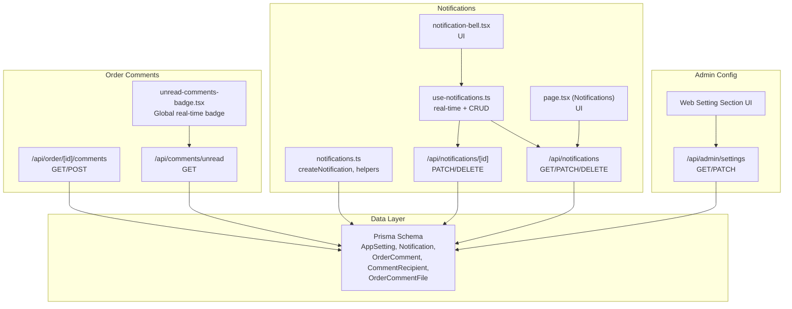
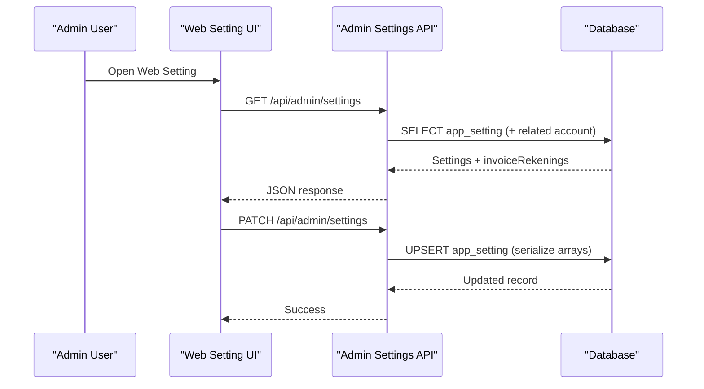
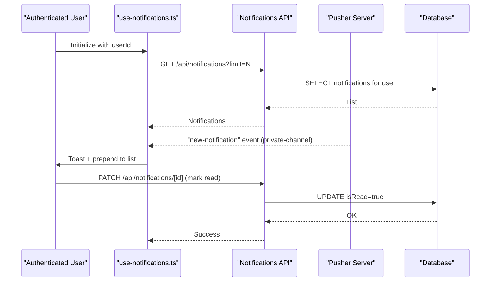
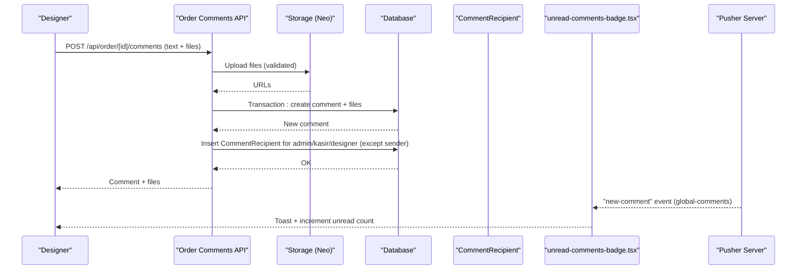
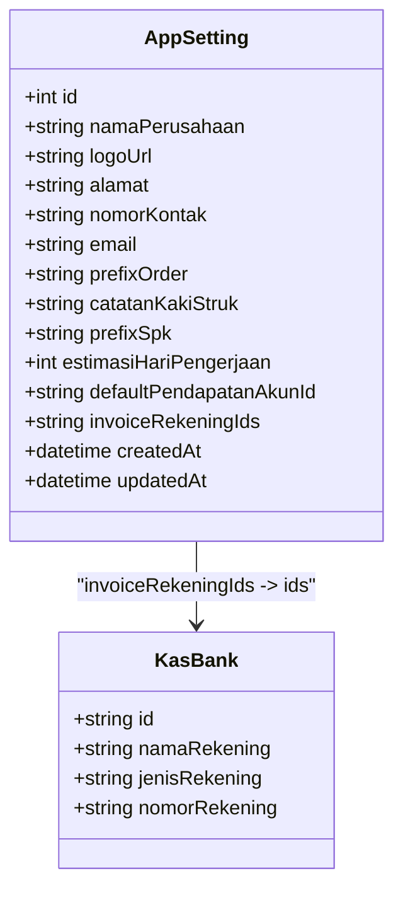
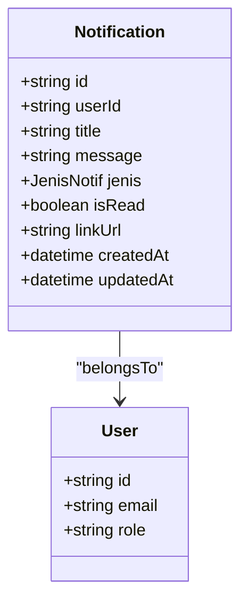
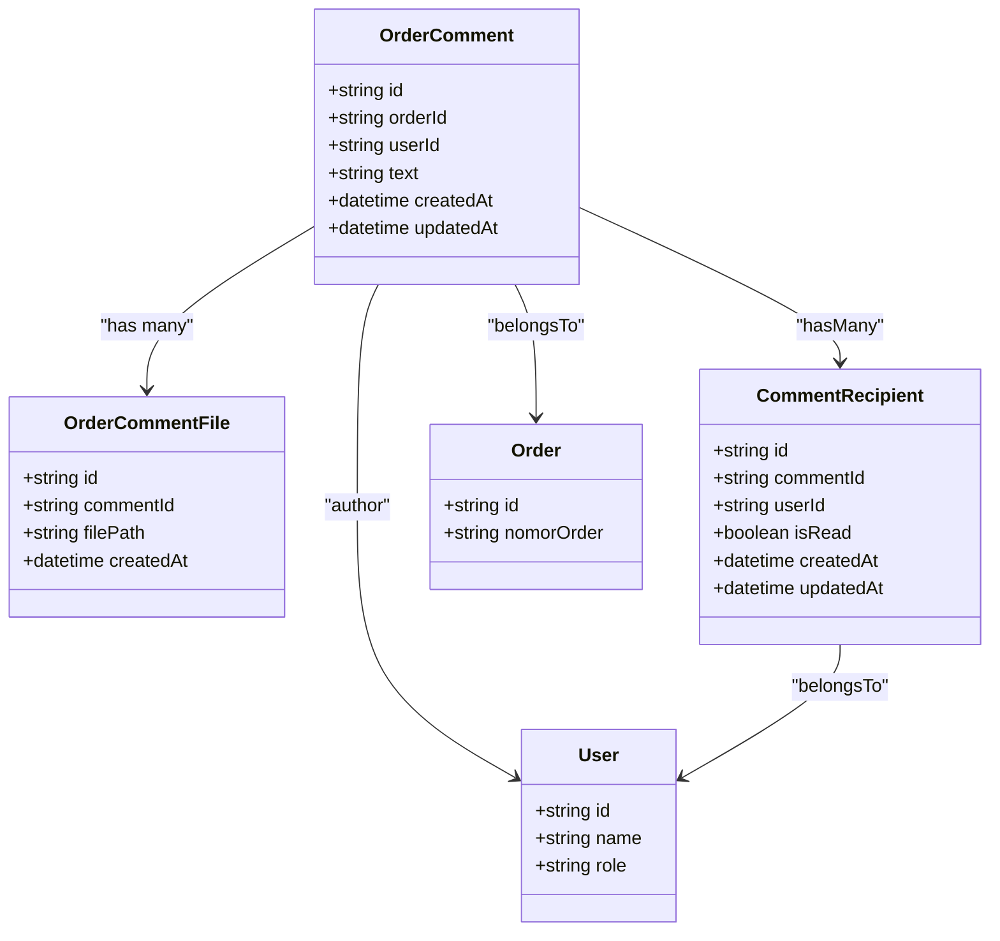
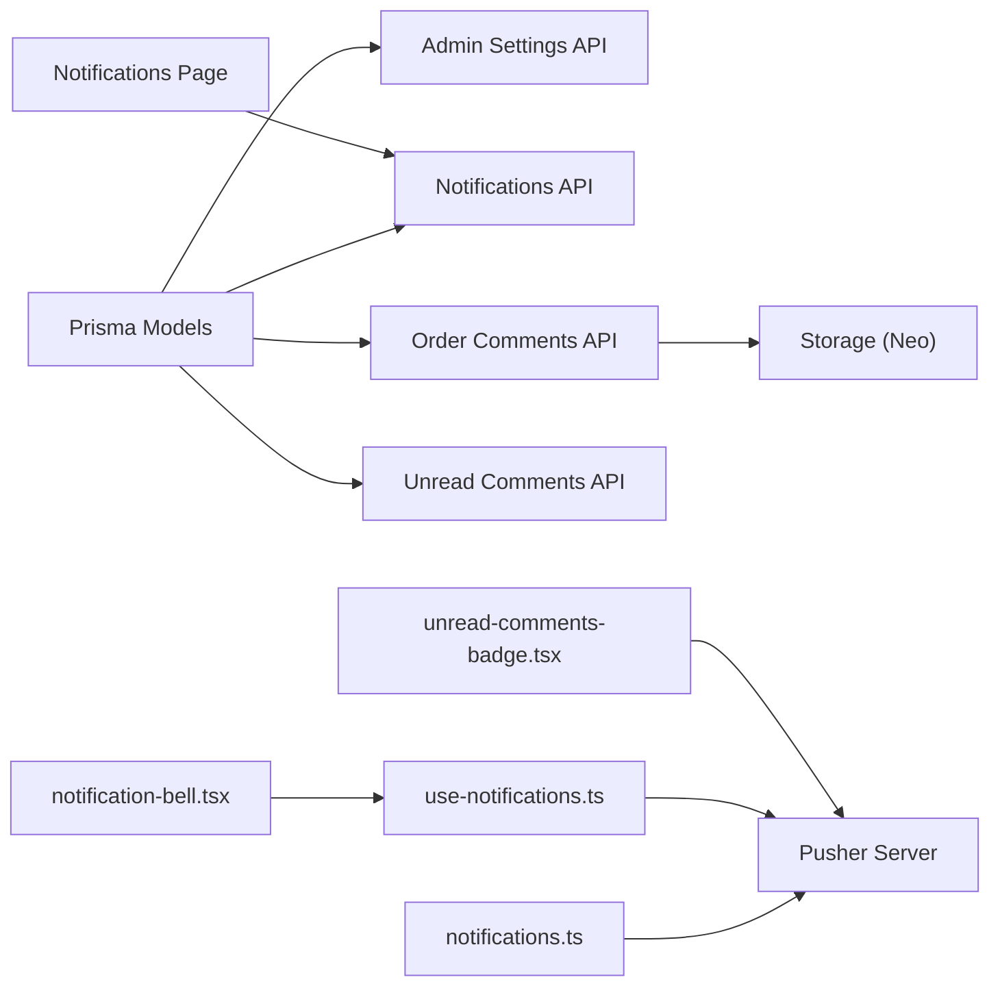

# System & Configuration Entities

<cite>
**Referenced Files in This Document**
- [schema.prisma](file://prisma/schema.prisma)
- [20260426131857_add_email_to_app_setting/migration.sql](file://prisma/migrations/20260426131857_add_email_to_app_setting/migration.sql)
- [20260518134933_add_design_queue_comments/migration.sql](file://prisma/migrations/20260518134933_add_design_queue_comments/migration.sql)
- [20260601160457_add_comment_recipient/migration.sql](file://prisma/migrations/20260601160457_add_comment_recipient/migration.sql)
- [route.ts (admin settings)](file://src/app/api/admin/settings/route.ts)
- [web-setting-section.tsx](file://src/app/(LoggedIn)/settings/web-setting/web-setting-section.tsx)
- [notifications.ts](file://src/lib/notifications.ts)
- [route.ts (notifications)](file://src/app/api/notifications/route.ts)
- [route.ts (notification by id)](file://src/app/api/notifications/[id]/route.ts)
- [use-notifications.ts](file://src/hooks/use-notifications.ts)
- [notification-bell.tsx](file://src/components/notification-bell.tsx)
- [page.tsx (notifications page)](file://src/app/(LoggedIn)/notifikasi/page.tsx)
- [route.ts (order comments)](file://src/app/api/order/[id]/comments/route.ts)
- [route.ts (unread comments)](file://src/app/api/comments/unread/route.ts)
- [unread-comments-badge.tsx](file://src/components/unread-comments-badge.tsx)
- [pusher.ts](file://src/lib/pusher.ts)
</cite>

## Table of Contents
1. [Introduction](#introduction)
2. [Project Structure](#project-structure)
3. [Core Components](#core-components)
4. [Architecture Overview](#architecture-overview)
5. [Detailed Component Analysis](#detailed-component-analysis)
6. [Dependency Analysis](#dependency-analysis)
7. [Performance Considerations](#performance-considerations)
8. [Troubleshooting Guide](#troubleshooting-guide)
9. [Conclusion](#conclusion)

## Introduction
This document explains the system-level entities and workflows centered around AppSetting, Notification, OrderComment, and CommentRecipient. It covers:
- Application configuration via AppSetting and the admin web setting UI
- Notification management, including real-time delivery and user preferences
- Collaborative commenting for orders, including attachments and recipient tracking
- Examples of configuration, notification triggers, and team communication patterns
- Audit-friendly behavior through explicit read-state tracking and real-time updates

## Project Structure
The relevant system entities are defined in Prisma schema and surfaced through API routes and React components:
- Data models: AppSetting, Notification, OrderComment, CommentRecipient, OrderCommentFile
- Admin configuration API and UI
- Notification APIs, hooks, and UI components
- Order comment APIs, recipient counters, and global real-time badges

**Diagram sources**
- [schema.prisma:569-674](file://prisma/schema.prisma#L569-L674)
- [route.ts (admin settings):1-84](file://src/app/api/admin/settings/route.ts#L1-L84)
- [web-setting-section.tsx](file://src/app/(LoggedIn)/settings/web-setting/web-setting-section.tsx#L121-L165)
- [notifications.ts:1-95](file://src/lib/notifications.ts#L1-L95)
- [route.ts (notifications):42-76](file://src/app/api/notifications/route.ts#L42-L76)
- [route.ts (notification by id):1-45](file://src/app/api/notifications/[id]/route.ts#L1-L45)
- [use-notifications.ts:1-112](file://src/hooks/use-notifications.ts#L1-L112)
- [notification-bell.tsx:1-219](file://src/components/notification-bell.tsx#L1-L219)
- [page.tsx (notifications page)](file://src/app/(LoggedIn)/notifikasi/page.tsx#L1-L237)
- [route.ts (order comments):1-234](file://src/app/api/order/[id]/comments/route.ts#L1-L234)
- [route.ts (unread comments):1-25](file://src/app/api/comments/unread/route.ts#L1-L25)
- [unread-comments-badge.tsx:1-84](file://src/components/unread-comments-badge.tsx#L1-L84)

**Section sources**
- [schema.prisma:569-674](file://prisma/schema.prisma#L569-L674)
- [route.ts (admin settings):1-84](file://src/app/api/admin/settings/route.ts#L1-L84)
- [web-setting-section.tsx](file://src/app/(LoggedIn)/settings/web-setting/web-setting-section.tsx#L121-L165)
- [notifications.ts:1-95](file://src/lib/notifications.ts#L1-L95)
- [route.ts (notifications):42-76](file://src/app/api/notifications/route.ts#L42-L76)
- [route.ts (notification by id):1-45](file://src/app/api/notifications/[id]/route.ts#L1-L45)
- [use-notifications.ts:1-112](file://src/hooks/use-notifications.ts#L1-L112)
- [notification-bell.tsx:1-219](file://src/components/notification-bell.tsx#L1-L219)
- [page.tsx (notifications page)](file://src/app/(LoggedIn)/notifikasi/page.tsx#L1-L237)
- [route.ts (order comments):1-234](file://src/app/api/order/[id]/comments/route.ts#L1-L234)
- [route.ts (unread comments):1-25](file://src/app/api/comments/unread/route.ts#L1-L25)
- [unread-comments-badge.tsx:1-84](file://src/components/unread-comments-badge.tsx#L1-L84)

## Core Components
- AppSetting: Single-row configuration for company identity, prefixes, default revenue account, invoice bank accounts, and contact info. Admin-only editing via API and UI.
- Notification: User-specific alerts with typed categories, read state, optional links, and real-time delivery via Pusher.
- OrderComment: Threaded comments on orders with optional file attachments and recipient tracking.
- CommentRecipient: Tracks who should receive notifications for each comment and whether they’ve read it.

**Section sources**
- [schema.prisma:569-674](file://prisma/schema.prisma#L569-L674)
- [route.ts (admin settings):1-84](file://src/app/api/admin/settings/route.ts#L1-L84)
- [web-setting-section.tsx](file://src/app/(LoggedIn)/settings/web-setting/web-setting-section.tsx#L121-L165)
- [notifications.ts:1-95](file://src/lib/notifications.ts#L1-L95)
- [route.ts (order comments):1-234](file://src/app/api/order/[id]/comments/route.ts#L1-L234)

## Architecture Overview
The system integrates persistent storage (Prisma), server-side APIs, and real-time messaging (Pusher) to deliver a responsive configuration and collaboration experience.

**Diagram sources**
- [route.ts (admin settings):1-84](file://src/app/api/admin/settings/route.ts#L1-L84)
- [web-setting-section.tsx](file://src/app/(LoggedIn)/settings/web-setting/web-setting-section.tsx#L121-L165)
- [schema.prisma:569-597](file://prisma/schema.prisma#L569-L597)

**Diagram sources**
- [use-notifications.ts:1-112](file://src/hooks/use-notifications.ts#L1-L112)
- [route.ts (notifications):42-76](file://src/app/api/notifications/route.ts#L42-L76)
- [route.ts (notification by id):1-45](file://src/app/api/notifications/[id]/route.ts#L1-L45)
- [notifications.ts:1-95](file://src/lib/notifications.ts#L1-L95)
- [pusher.ts:1-11](file://src/lib/pusher.ts#L1-L11)

**Diagram sources**
- [route.ts (order comments):1-234](file://src/app/api/order/[id]/comments/route.ts#L1-L234)
- [route.ts (unread comments):1-25](file://src/app/api/comments/unread/route.ts#L1-L25)
- [unread-comments-badge.tsx:1-84](file://src/components/unread-comments-badge.tsx#L1-L84)
- [schema.prisma:632-674](file://prisma/schema.prisma#L632-L674)

## Detailed Component Analysis

### AppSetting Model and Admin Configuration
- Purpose: Centralized system-wide settings including company identity, order/spk prefixes, default revenue account, invoice bank accounts, and contact details.
- Key behaviors:
  - Single-row constraint enforced by fixed id.
  - Invoice bank accounts stored as a JSON array of IDs and resolved at read time.
  - Email field added via migration.
- Admin workflow:
  - GET returns settings plus resolved invoiceRekenings.
  - PATCH accepts structured fields and serializes invoiceRekeningIds to JSON if needed.

**Diagram sources**
- [schema.prisma:569-597](file://prisma/schema.prisma#L569-L597)
- [20260518134933_add_design_queue_comments/migration.sql:1-46](file://prisma/migrations/20260518134933_add_design_queue_comments/migration.sql#L1-L46)
- [20260426131857_add_email_to_app_setting/migration.sql:1-8](file://prisma/migrations/20260426131857_add_email_to_app_setting/migration.sql#L1-L8)

**Section sources**
- [schema.prisma:569-597](file://prisma/schema.prisma#L569-L597)
- [route.ts (admin settings):1-84](file://src/app/api/admin/settings/route.ts#L1-L84)
- [web-setting-section.tsx](file://src/app/(LoggedIn)/settings/web-setting/web-setting-section.tsx#L121-L165)
- [20260426131857_add_email_to_app_setting/migration.sql:1-8](file://prisma/migrations/20260426131857_add_email_to_app_setting/migration.sql#L1-L8)

### Notification System
- Data model: Notification with typed category (JenisNotif), read flag, optional link, and timestamps.
- Real-time delivery: createNotification persists and emits a private Pusher event per user.
- Management APIs:
  - GET paginated notifications
  - PATCH to mark a single notification as read
  - PATCH to mark all as read
  - DELETE to clear all notifications
- UI integration:
  - use-notifications hook subscribes to private channels, maintains local state, and supports optimistic updates.
  - notification-bell.tsx renders unread counts, icons per type, and navigation to notification pages.
  - page.tsx (notifications page) filters and displays notifications by type and read state.

**Diagram sources**
- [schema.prisma:603-618](file://prisma/schema.prisma#L603-L618)
- [schema.prisma:620-630](file://prisma/schema.prisma#L620-L630)

**Section sources**
- [schema.prisma:603-630](file://prisma/schema.prisma#L603-L630)
- [notifications.ts:1-95](file://src/lib/notifications.ts#L1-L95)
- [route.ts (notifications):42-76](file://src/app/api/notifications/route.ts#L42-L76)
- [route.ts (notification by id):1-45](file://src/app/api/notifications/[id]/route.ts#L1-L45)
- [use-notifications.ts:1-112](file://src/hooks/use-notifications.ts#L1-L112)
- [notification-bell.tsx:1-219](file://src/components/notification-bell.tsx#L1-L219)
- [page.tsx (notifications page)](file://src/app/(LoggedIn)/notifikasi/page.tsx#L1-L237)

### Order Commenting and Recipient Tracking
- Data model:
  - OrderComment: belongs to Order and User, supports files and recipients.
  - OrderCommentFile: stores attachment URLs linked to comments.
  - CommentRecipient: tracks recipients per comment with read state.
- Workflow:
  - POST creates a comment, uploads attachments (validated), and inserts CommentRecipient entries for admin, kasir, and designer (excluding the sender).
  - GET retrieves ordered comment threads with author and file metadata.
  - Unread count endpoint counts CommentRecipient records per user with isRead=false.
  - Global badge listens to a global “new-comment” event and increments unread count with a toast.

**Diagram sources**
- [schema.prisma:632-674](file://prisma/schema.prisma#L632-L674)

**Section sources**
- [schema.prisma:632-674](file://prisma/schema.prisma#L632-L674)
- [route.ts (order comments):1-234](file://src/app/api/order/[id]/comments/route.ts#L1-L234)
- [route.ts (unread comments):1-25](file://src/app/api/comments/unread/route.ts#L1-L25)
- [unread-comments-badge.tsx:1-84](file://src/components/unread-comments-badge.tsx#L1-L84)

### Notification Preferences and Audit Trail
- Read state tracking:
  - Notifications maintain isRead per user, enabling unread counts and filtering.
  - APIs support marking as read individually and in bulk.
- Audit-friendly behavior:
  - Real-time events are triggered upon creation, ensuring immediate visibility.
  - Comment recipients are explicitly tracked, enabling audit of who was notified and when.
- User communication patterns:
  - Role-based notifications (e.g., low stock) target specific roles.
  - Order comments automatically notify relevant roles except the sender.

**Section sources**
- [use-notifications.ts:63-110](file://src/hooks/use-notifications.ts#L63-L110)
- [route.ts (notification by id):1-45](file://src/app/api/notifications/[id]/route.ts#L1-L45)
- [route.ts (notifications):42-76](file://src/app/api/notifications/route.ts#L42-L76)
- [notifications.ts:67-95](file://src/lib/notifications.ts#L67-L95)
- [route.ts (order comments):177-193](file://src/app/api/order/[id]/comments/route.ts#L177-L193)
- [route.ts (unread comments):1-25](file://src/app/api/comments/unread/route.ts#L1-L25)

## Dependency Analysis
- Data model dependencies:
  - AppSetting relates to Akun for default revenue account.
  - Notification belongs to User; CommentRecipient belongs to both OrderComment and User.
  - OrderComment has associated files and recipients.
- API dependencies:
  - Admin settings API depends on Prisma and resolves invoiceRekenings from KasBank.
  - Notification APIs depend on Prisma and Pusher for real-time updates.
  - Order comments API depends on storage service for file uploads and Prisma for persistence.
- Frontend dependencies:
  - use-notifications hook depends on Pusher client and exposes CRUD actions.
  - Notification UI components depend on use-notifications and routing.

**Diagram sources**
- [schema.prisma:569-674](file://prisma/schema.prisma#L569-L674)
- [route.ts (admin settings):1-84](file://src/app/api/admin/settings/route.ts#L1-L84)
- [notifications.ts:1-95](file://src/lib/notifications.ts#L1-L95)
- [use-notifications.ts:1-112](file://src/hooks/use-notifications.ts#L1-L112)
- [notification-bell.tsx:1-219](file://src/components/notification-bell.tsx#L1-L219)
- [page.tsx (notifications page)](file://src/app/(LoggedIn)/notifikasi/page.tsx#L1-L237)
- [route.ts (order comments):1-234](file://src/app/api/order/[id]/comments/route.ts#L1-L234)
- [route.ts (unread comments):1-25](file://src/app/api/comments/unread/route.ts#L1-L25)
- [unread-comments-badge.tsx:1-84](file://src/components/unread-comments-badge.tsx#L1-L84)
- [pusher.ts:1-11](file://src/lib/pusher.ts#L1-L11)

**Section sources**
- [schema.prisma:569-674](file://prisma/schema.prisma#L569-L674)
- [route.ts (admin settings):1-84](file://src/app/api/admin/settings/route.ts#L1-L84)
- [notifications.ts:1-95](file://src/lib/notifications.ts#L1-L95)
- [use-notifications.ts:1-112](file://src/hooks/use-notifications.ts#L1-L112)
- [notification-bell.tsx:1-219](file://src/components/notification-bell.tsx#L1-L219)
- [page.tsx (notifications page)](file://src/app/(LoggedIn)/notifikasi/page.tsx#L1-L237)
- [route.ts (order comments):1-234](file://src/app/api/order/[id]/comments/route.ts#L1-L234)
- [route.ts (unread comments):1-25](file://src/app/api/comments/unread/route.ts#L1-L25)
- [unread-comments-badge.tsx:1-84](file://src/components/unread-comments-badge.tsx#L1-L84)
- [pusher.ts:1-11](file://src/lib/pusher.ts#L1-L11)

## Performance Considerations
- Indexes and relations:
  - Notification indices on userId and isRead optimize unread queries and filtering.
  - CommentRecipient unique and composite indexes support efficient read-state tracking.
- Real-time scaling:
  - Private channels per user minimize broadcast overhead.
  - Global comment channel uses lightweight event emission for badge updates.
- API pagination:
  - Limit parameter in notification hook prevents oversized payloads.
- File handling:
  - Strict MIME and size checks reduce storage and bandwidth misuse.
  - Transactional writes ensure atomicity for comments, files, and recipients.

[No sources needed since this section provides general guidance]

## Troubleshooting Guide
- Unauthorized or forbidden access:
  - Admin settings and order comments enforce role-based access; verify session and role before proceeding.
- Notification delivery failures:
  - Socket event failures are logged; retry after verifying Pusher credentials and network connectivity.
- Attachment upload errors:
  - Validate file size and MIME type; ensure storage service availability and write permissions.
- Read-state inconsistencies:
  - Use optimistic updates in the hook and reconcile with backend responses; rely on PATCH endpoints to persist read state.

**Section sources**
- [route.ts (admin settings):1-84](file://src/app/api/admin/settings/route.ts#L1-L84)
- [route.ts (order comments):24-34](file://src/app/api/order/[id]/comments/route.ts#L24-L34)
- [notifications.ts:31-41](file://src/lib/notifications.ts#L31-L41)
- [use-notifications.ts:67-110](file://src/hooks/use-notifications.ts#L67-L110)

## Conclusion
The system provides a cohesive foundation for configuration, real-time notifications, and collaborative order commenting:
- AppSetting centralizes system-wide preferences and financial mappings.
- Notification APIs and UI offer timely, role-aware alerts with robust read-state management.
- OrderComment and CommentRecipient enable transparent, auditable collaboration with file attachments and recipient tracking.
- Real-time integrations via Pusher enhance responsiveness and user engagement.

[No sources needed since this section summarizes without analyzing specific files]