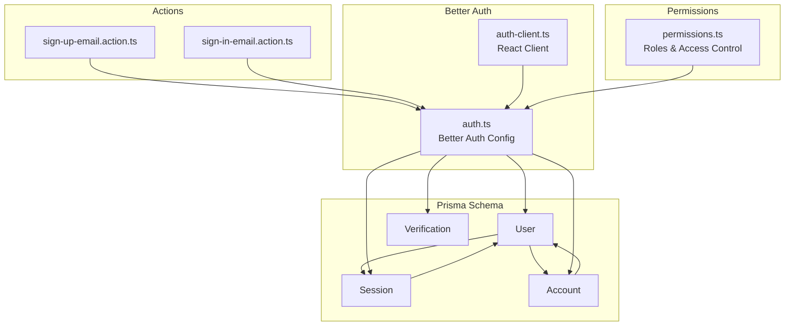
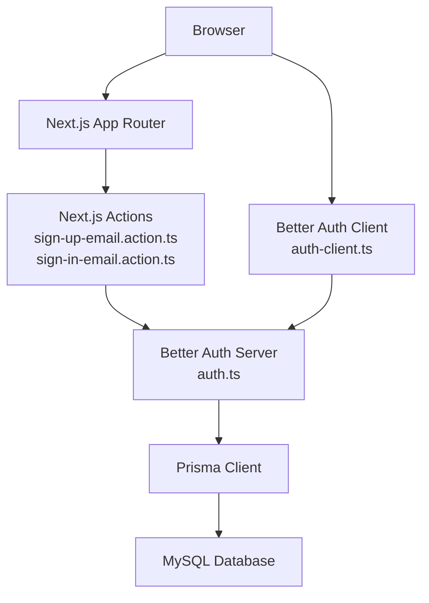
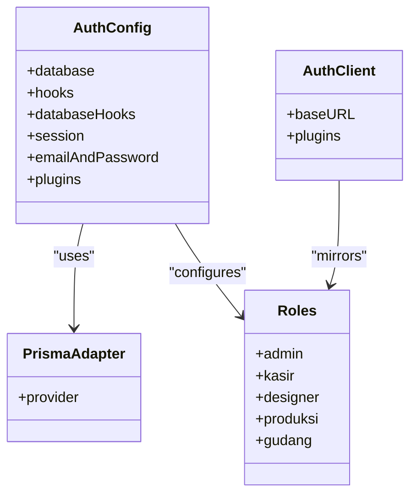
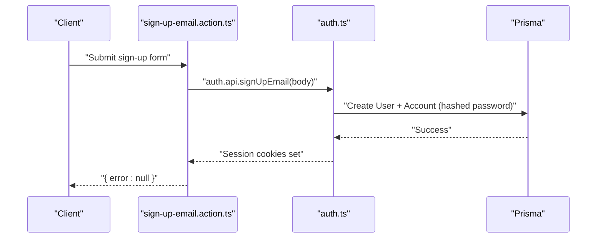
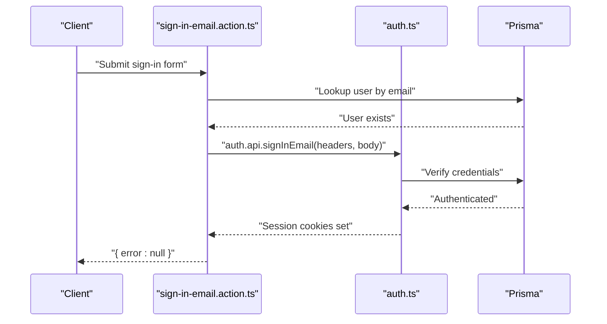
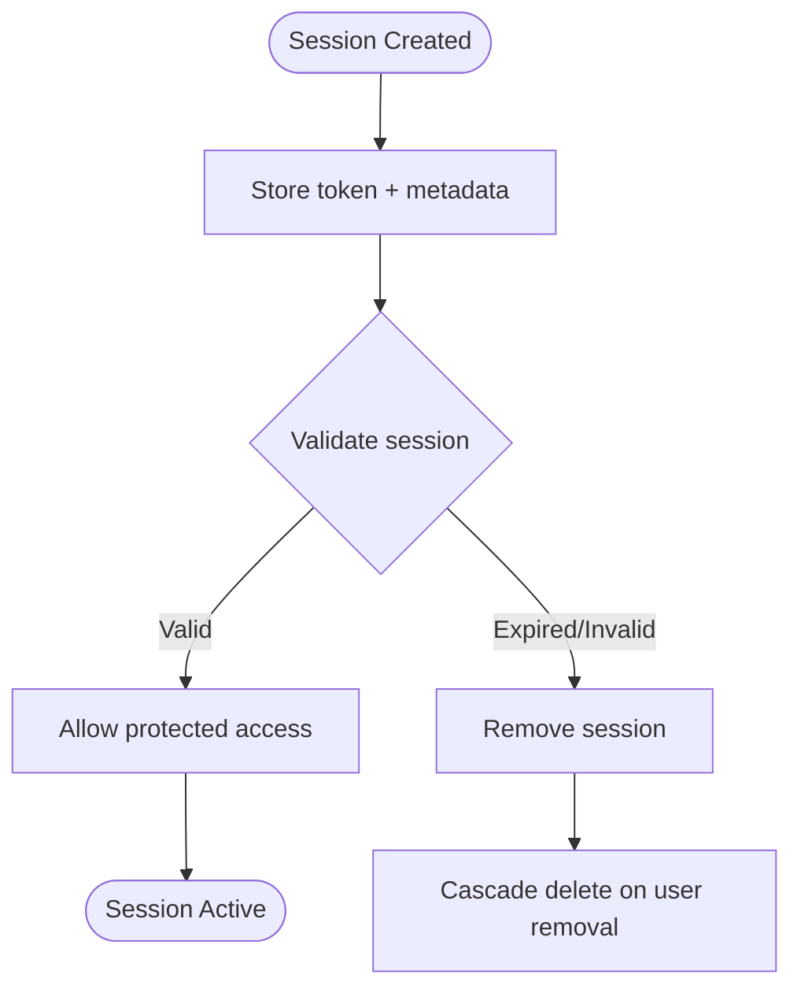
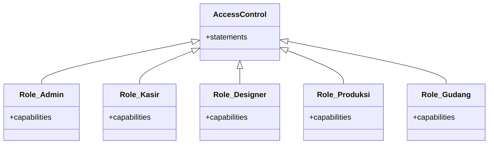
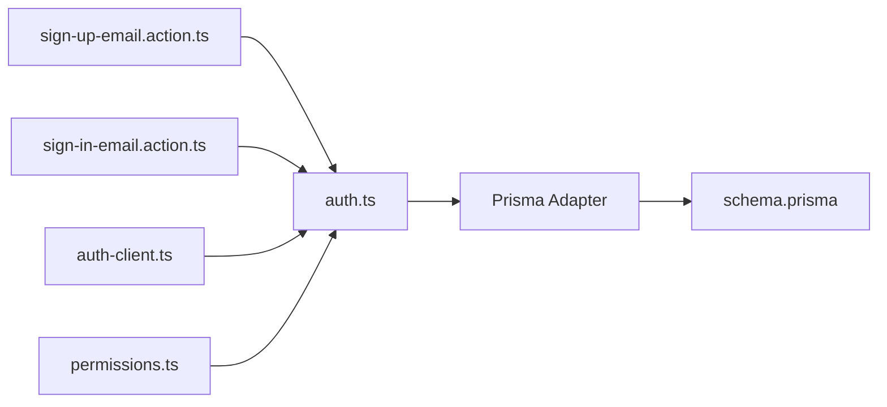

# User & Authentication Entities

<cite>
**Referenced Files in This Document**
- [schema.prisma](file://prisma/schema.prisma)
- [auth.ts](file://src/lib/auth.ts)
- [auth-client.ts](file://src/lib/auth-client.ts)
- [sign-in-email.action.ts](file://src/actions/sign-in-email.action.ts)
- [sign-up-email.action.ts](file://src/actions/sign-up-email.action.ts)
- [permissions.ts](file://src/lib/permissions.ts)
</cite>

## Table of Contents
1. [Introduction](#introduction)
2. [Project Structure](#project-structure)
3. [Core Components](#core-components)
4. [Architecture Overview](#architecture-overview)
5. [Detailed Component Analysis](#detailed-component-analysis)
6. [Dependency Analysis](#dependency-analysis)
7. [Performance Considerations](#performance-considerations)
8. [Troubleshooting Guide](#troubleshooting-guide)
9. [Conclusion](#conclusion)

## Introduction
This document explains the User and authentication-related entities in the system, focusing on the User, Session, Account, and Verification models. It details the Better Auth integration, session management, role-based access control (RBAC), account linking, password hashing, token management, and security features such as email verification and impersonation. It also documents relationships among User, Session, and Account, including cascade deletion policies, and provides examples of user registration, login, and session validation. Additional topics include user banning, email verification, and impersonation features.

## Project Structure
The authentication and user-related logic is primarily implemented in:
- Prisma schema defining the User, Session, Account, and Verification models and their relations
- Better Auth configuration and client setup
- Action handlers for sign-up and sign-in flows
- Permissions and roles for RBAC

**Diagram sources**
- [schema.prisma](file://prisma/schema.prisma)
- [auth.ts](file://src/lib/auth.ts)
- [auth-client.ts](file://src/lib/auth-client.ts)
- [sign-up-email.action.ts](file://src/actions/sign-up-email.action.ts)
- [sign-in-email.action.ts](file://src/actions/sign-in-email.action.ts)
- [permissions.ts](file://src/lib/permissions.ts)

**Section sources**
- [schema.prisma](file://prisma/schema.prisma)
- [auth.ts](file://src/lib/auth.ts)
- [auth-client.ts](file://src/lib/auth-client.ts)
- [sign-up-email.action.ts](file://src/actions/sign-up-email.action.ts)
- [sign-in-email.action.ts](file://src/actions/sign-in-email.action.ts)
- [permissions.ts](file://src/lib/permissions.ts)

## Core Components
- User: central identity entity with optional role, ban fields, and relations to Account, Session, Notifications, Orders, SPK, DesignFiles, PenerimaanBarang, PengeluaranBarang, Payments, JurnalUmum, and Comments.
- Session: stores session tokens with expiration, IP address, user agent, and optional impersonation metadata; cascades deletion on user removal.
- Account: links providers and credentials; supports OAuth tokens and hashed passwords; cascades deletion on user removal.
- Verification: stores verification identifiers and values with expiration.

Key relationships and cascade policies:
- User.accounts and User.sessions are collections; Account and Session have onDelete: Cascade relative to User.
- Other relations (e.g., Notifications, Orders, Payments) are defined but not explicitly shown as cascade here; refer to schema for full relation graph.

**Section sources**
- [schema.prisma](file://prisma/schema.prisma)

## Architecture Overview
The system integrates Better Auth for authentication, with Prisma as the persistence layer. The React client communicates with the server via Better Auth’s client library, while Next.js actions invoke Better Auth APIs for sign-up and sign-in. RBAC is configured via Better Auth plugins.

**Diagram sources**
- [auth.ts](file://src/lib/auth.ts)
- [auth-client.ts](file://src/lib/auth-client.ts)
- [sign-up-email.action.ts](file://src/actions/sign-up-email.action.ts)
- [sign-in-email.action.ts](file://src/actions/sign-in-email.action.ts)
- [schema.prisma](file://prisma/schema.prisma)

## Detailed Component Analysis

### User Model
- Identity fields: id, name, email (unique), emailVerified flag
- Security and lifecycle: createdAt, updatedAt, ban fields (banReason, banExpires, banned)
- Role and associations: role field; relations to Account[], Session[], Notification[], Order[], SPK[], DesignFile[], PenerimaanBarang[], PengeluaranBarang[], Payment[], JurnalUmum[], and Comments
- Impersonation: Sessions optionally record impersonatedBy

Security and policy highlights:
- Ban fields enable temporary or permanent restrictions
- Relations imply cascading deletes for Account and Session when a User is removed

**Section sources**
- [schema.prisma](file://prisma/schema.prisma)

### Session Model
- Fields: id, expiresAt, token (unique), createdAt, updatedAt, ipAddress, userAgent, userId, impersonatedBy
- Relation: belongs to User with onDelete: Cascade
- Impersonation: optional metadata indicates who impersonated the session

Lifecycle:
- Expiration handled by Better Auth configuration
- Token uniqueness ensures robust session identification

**Section sources**
- [schema.prisma](file://prisma/schema.prisma)
- [auth.ts](file://src/lib/auth.ts)

### Account Model
- Fields: id, accountId, providerId, userId, accessToken, refreshToken, idToken, accessTokenExpiresAt, refreshTokenExpiresAt, scope, password
- Relation: belongs to User with onDelete: Cascade
- Supports both OAuth tokens and email/password credentials

Security:
- Password stored as hashed value via Better Auth hooks
- Tokens and scopes support external provider integrations

**Section sources**
- [schema.prisma](file://prisma/schema.prisma)
- [auth.ts](file://src/lib/auth.ts)

### Verification Model
- Fields: id, identifier, value, expiresAt, createdAt, updatedAt
- Index: identifier with length constraint
- Purpose: verification codes/tokens for email verification and similar flows

**Section sources**
- [schema.prisma](file://prisma/schema.prisma)

### Better Auth Integration
- Server configuration:
  - Database adapter: Prisma adapter for MySQL
  - Hooks: pre-sign-up validation for domain and normalization
  - Database hooks: assign random avatar for new users without images
  - Session: 30-day expiry
  - Email and password: enabled with minimum length and custom hash/verify functions
  - Plugins: nextCookies for cookie handling, admin with roles and access control
- Client configuration:
  - React client with base URL and admin plugin mirroring server roles

**Diagram sources**
- [auth.ts](file://src/lib/auth.ts)
- [auth-client.ts](file://src/lib/auth-client.ts)
- [permissions.ts](file://src/lib/permissions.ts)

**Section sources**
- [auth.ts](file://src/lib/auth.ts)
- [auth-client.ts](file://src/lib/auth-client.ts)
- [permissions.ts](file://src/lib/permissions.ts)

### Authentication Flow: Sign-Up (Email/Password)

**Diagram sources**
- [sign-up-email.action.ts](file://src/actions/sign-up-email.action.ts)
- [auth.ts](file://src/lib/auth.ts)

**Section sources**
- [sign-up-email.action.ts](file://src/actions/sign-up-email.action.ts)
- [auth.ts](file://src/lib/auth.ts)

### Authentication Flow: Sign-In (Email/Password)

**Diagram sources**
- [sign-in-email.action.ts](file://src/actions/sign-in-email.action.ts)
- [auth.ts](file://src/lib/auth.ts)

**Section sources**
- [sign-in-email.action.ts](file://src/actions/sign-in-email.action.ts)
- [auth.ts](file://src/lib/auth.ts)

### Session Management
- Sessions are stored with unique tokens and expiration timestamps.
- Cascading deletion ensures cleanup when users are removed.
- Impersonation metadata allows tracking of delegated sessions.

**Diagram sources**
- [schema.prisma](file://prisma/schema.prisma)
- [auth.ts](file://src/lib/auth.ts)

**Section sources**
- [schema.prisma](file://prisma/schema.prisma)
- [auth.ts](file://src/lib/auth.ts)

### Role-Based Access Control (RBAC)
- Access control statements define capabilities per resource.
- Roles:
  - admin: full access
  - kasir: POS, customer, payment, finance, reports, limited production
  - designer: design queue, uploads, status updates
  - produksi: production visibility and status updates
  - gudang: inventory and supplier views
- Built-in admin permissions are merged into roles.

**Diagram sources**
- [permissions.ts](file://src/lib/permissions.ts)

**Section sources**
- [permissions.ts](file://src/lib/permissions.ts)

### Account Linking Capabilities
- Accounts support multiple providers via providerId and accountId.
- Optional OAuth tokens and scopes enable linking external identities.
- Password field enables email/password accounts.

**Section sources**
- [schema.prisma](file://prisma/schema.prisma)
- [auth.ts](file://src/lib/auth.ts)

### Security Features
- Password hashing and verification via Argon2 integration in Better Auth.
- Minimum password length enforced.
- Domain validation during sign-up.
- Random avatar assignment for new users.
- Session cookies managed by Better Auth plugins.

**Section sources**
- [auth.ts](file://src/lib/auth.ts)
- [sign-up-email.action.ts](file://src/actions/sign-up-email.action.ts)

### User Banning Functionality
- User model includes banReason, banExpires, and banned flags.
- Enforce checks at login and protected endpoints to deny access when banned.

**Section sources**
- [schema.prisma](file://prisma/schema.prisma)

### Email Verification
- Verification model stores identifier/value with expiration.
- Typical flow: send verification token -> validate -> mark emailVerified.

**Section sources**
- [schema.prisma](file://prisma/schema.prisma)

### Impersonation Features
- Sessions optionally record impersonatedBy to track delegation.
- Admin plugin supports impersonation workflows.

**Section sources**
- [schema.prisma](file://prisma/schema.prisma)
- [auth.ts](file://src/lib/auth.ts)

## Dependency Analysis

**Diagram sources**
- [sign-up-email.action.ts](file://src/actions/sign-up-email.action.ts)
- [sign-in-email.action.ts](file://src/actions/sign-in-email.action.ts)
- [auth.ts](file://src/lib/auth.ts)
- [auth-client.ts](file://src/lib/auth-client.ts)
- [schema.prisma](file://prisma/schema.prisma)
- [permissions.ts](file://src/lib/permissions.ts)

**Section sources**
- [sign-up-email.action.ts](file://src/actions/sign-up-email.action.ts)
- [sign-in-email.action.ts](file://src/actions/sign-in-email.action.ts)
- [auth.ts](file://src/lib/auth.ts)
- [auth-client.ts](file://src/lib/auth-client.ts)
- [schema.prisma](file://prisma/schema.prisma)
- [permissions.ts](file://src/lib/permissions.ts)

## Performance Considerations
- Prefer indexed fields for lookups (e.g., User.email, Session.token, Account.userId).
- Use selective queries to avoid N+1 issues when loading User with relations.
- Keep session expiration aligned with business needs to balance security and UX.
- Cache frequently accessed role/access control decisions at runtime where appropriate.

## Troubleshooting Guide
Common issues and resolutions:
- Invalid domain during sign-up: ensure email domain is whitelisted.
- Weak or invalid password: enforce minimum length and acceptable complexity.
- Too many requests: rate limiting triggered; wait before retrying.
- Incorrect credentials: verify email and password; check ban status.
- Session not persisting: confirm cookies are enabled and secure flags match deployment.

**Section sources**
- [sign-up-email.action.ts](file://src/actions/sign-up-email.action.ts)
- [sign-in-email.action.ts](file://src/actions/sign-in-email.action.ts)
- [auth.ts](file://src/lib/auth.ts)

## Conclusion
The system provides a robust authentication foundation using Better Auth with Prisma-backed User, Session, Account, and Verification models. RBAC is configured via plugins, enabling fine-grained permissions across roles. Security features include password hashing, domain validation, and session management with impersonation support. Relationships and cascade policies ensure clean data lifecycle management.