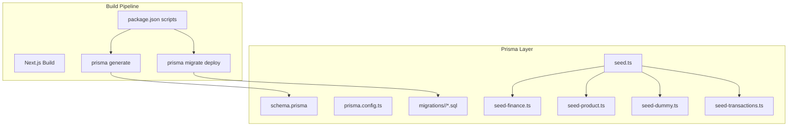
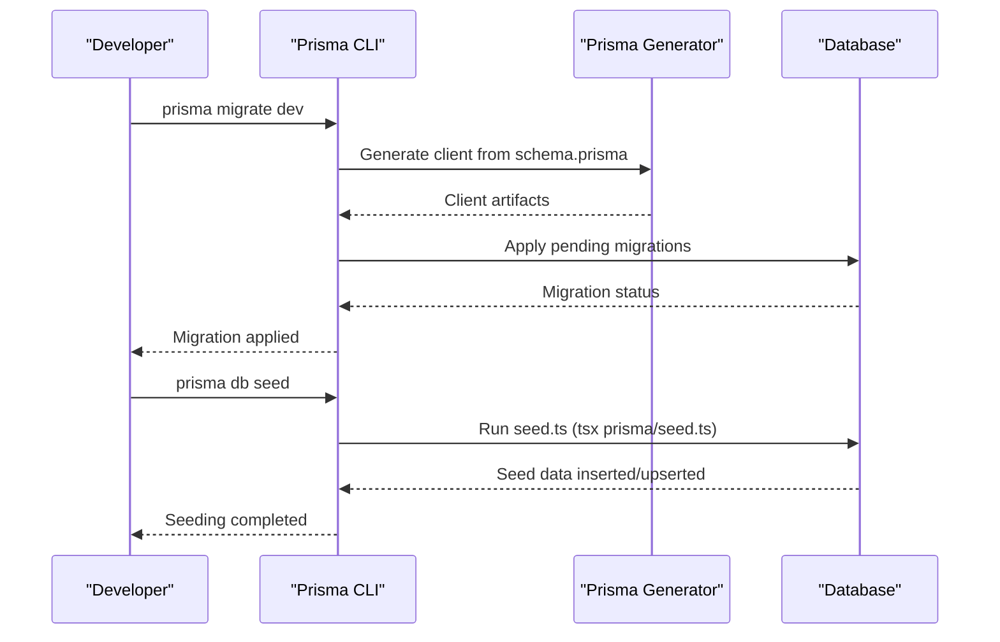
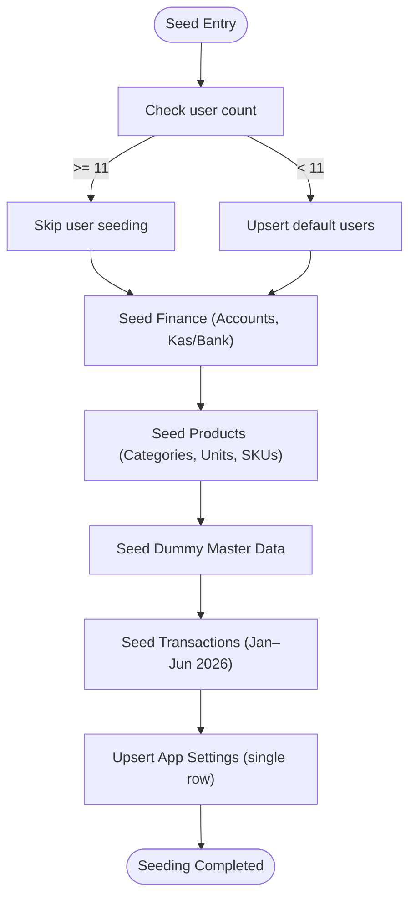
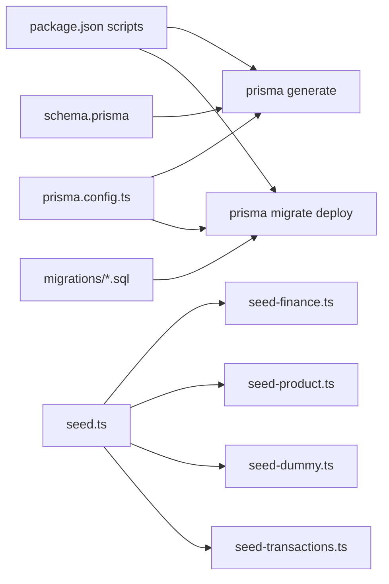

# Database Migrations & Seeding

<cite>
**Referenced Files in This Document**
- [prisma.config.ts](file://prisma.config.ts)
- [package.json](file://package.json)
- [schema.prisma](file://prisma/schema.prisma)
- [seed.ts](file://prisma/seed.ts)
- [seed-finance.ts](file://prisma/seed-finance.ts)
- [seed-product.ts](file://prisma/seed-product.ts)
- [seed-dummy.ts](file://prisma/seed-dummy.ts)
- [seed-transactions.ts](file://prisma/seed-transactions.ts)
- [20260419144230_init/migration.sql](file://prisma/migrations/20260419144230_init/migration.sql)
- [20260420044937_add_invoice_rekening_ids/migration.sql](file://prisma/migrations/20260420044937_add_invoice_rekening_ids/migration.sql)
- [20260421054837_add_table_notification/migration.sql](file://prisma/migrations/20260421054837_add_table_notification/migration.sql)
- [20260421122118_remove_unique_constraints_on_journals/migration.sql](file://prisma/migrations/20260421122118_remove_unique_constraints_on_journals/migration.sql)
- [20260422125859_remove_role_from_notification/migration.sql](file://prisma/migrations/20260422125859_remove_role_from_notification/migration.sql)
</cite>

## Table of Contents
1. [Introduction](#introduction)
2. [Project Structure](#project-structure)
3. [Core Components](#core-components)
4. [Architecture Overview](#architecture-overview)
5. [Detailed Component Analysis](#detailed-component-analysis)
6. [Dependency Analysis](#dependency-analysis)
7. [Performance Considerations](#performance-considerations)
8. [Troubleshooting Guide](#troubleshooting-guide)
9. [Conclusion](#conclusion)

## Introduction
This document explains the database migration management and seed data configuration for the project. It covers the migration lifecycle, version control strategies, rollback procedures, and seed data organization. It also documents best practices for data transformations, environment-specific data loading, and production deployment considerations, with practical examples for creating new migrations and maintaining data consistency across environments.

## Project Structure
The project uses Prisma for schema definition and migrations, with TypeScript seed scripts that populate initial and test data. Migration files are stored under the Prisma migrations directory, while the Prisma configuration defines schema location, migration path, and seed command. The build pipeline integrates Prisma generation and migration deployment into the Next.js build process.

**Diagram sources**
- [prisma.config.ts:1-13](file://prisma.config.ts#L1-L13)
- [package.json:6-12](file://package.json#L6-L12)
- [schema.prisma:1-675](file://prisma/schema.prisma#L1-L675)

**Section sources**
- [prisma.config.ts:1-13](file://prisma.config.ts#L1-L13)
- [package.json:6-12](file://package.json#L6-L12)

## Core Components
- Prisma configuration: Defines schema path, migration directory, seed command, and datasource URL.
- Schema: Describes the complete data model, relations, indexes, and enums.
- Migrations: SQL-based migration files representing incremental schema changes.
- Seed scripts: TypeScript scripts that initialize static data, master lists, dummy data, and realistic transactional data.

Key responsibilities:
- Prisma configuration coordinates Prisma CLI behavior and build integration.
- Schema drives both migration generation and client generation.
- Migrations provide deterministic schema evolution across environments.
- Seed scripts ensure consistent baseline data for development, testing, and demo environments.

**Section sources**
- [prisma.config.ts:4-12](file://prisma.config.ts#L4-L12)
- [schema.prisma:1-675](file://prisma/schema.prisma#L1-L675)
- [seed.ts:1-136](file://prisma/seed.ts#L1-L136)

## Architecture Overview
The migration and seeding architecture follows a declarative schema-first approach with imperative migration application and deterministic seeding.

**Diagram sources**
- [prisma.config.ts:6-8](file://prisma.config.ts#L6-L8)
- [package.json:8](file://package.json#L8)
- [seed.ts:1-136](file://prisma/seed.ts#L1-L136)

## Detailed Component Analysis

### Migration Lifecycle and Version Control
- Migration creation: Developers modify schema.prisma and run Prisma CLI commands to generate SQL migrations. Each migration is timestamped and stored under the migrations directory.
- Applying migrations: During build, the pipeline runs Prisma migrate deploy to apply pending migrations to the target database.
- Version control: Migrations are committed alongside schema changes, enabling reproducible deployments across environments.

Best practices:
- Keep schema changes minimal and atomic.
- Use descriptive migration names and commit messages.
- Test migrations locally and in staging before production deployment.

Rollback procedures:
- Prisma migrations are designed to be forward-only. For reversible changes, implement compensating migrations or maintain a backup strategy outside the migration system.

**Section sources**
- [prisma.config.ts:6-8](file://prisma.config.ts#L6-L8)
- [package.json:8](file://package.json#L8)
- [20260419144230_init/migration.sql:1-600](file://prisma/migrations/20260419144230_init/migration.sql#L1-L600)

### Seed Data Organization and Initialization Patterns
The seeding system is composed of modular scripts orchestrated by a main entry point:

**Diagram sources**
- [seed.ts:8-126](file://prisma/seed.ts#L8-L126)
- [seed-finance.ts:4-106](file://prisma/seed-finance.ts#L4-L106)
- [seed-product.ts:164-237](file://prisma/seed-product.ts#L164-L237)
- [seed-dummy.ts:16-98](file://prisma/seed-dummy.ts#L16-L98)
- [seed-transactions.ts:14-617](file://prisma/seed-transactions.ts#L14-L617)

Initialization patterns:
- Upsert semantics prevent duplication and preserve existing data.
- Conditional checks avoid re-seeding when sufficient baseline data exists.
- Modular scripts encapsulate domain-specific data preparation.

Environment-specific loading:
- Seed scripts rely on Prisma Client and can be executed against any configured datasource URL.
- For production, run seeding after migrations and ensure proper credentials and isolation.

**Section sources**
- [seed.ts:8-126](file://prisma/seed.ts#L8-L126)
- [seed-finance.ts:4-106](file://prisma/seed-finance.ts#L4-L106)
- [seed-product.ts:164-237](file://prisma/seed-product.ts#L164-L237)
- [seed-dummy.ts:16-98](file://prisma/seed-dummy.ts#L16-L98)
- [seed-transactions.ts:14-617](file://prisma/seed-transactions.ts#L14-L617)

### Data Transformation Strategies
Transactional seeding demonstrates realistic financial and operational flows:
- Journal entries for opening balances, purchases, payments, transfers, expenses, and revenue.
- Order creation with items, SPK linkage, and stock adjustments.
- Payment recording and receivable tracking (cash vs. credit).

These transformations are idempotent and use upserts to handle repeated executions safely.

**Section sources**
- [seed-transactions.ts:14-617](file://prisma/seed-transactions.ts#L14-L617)

### Production Deployment Considerations
- Build pipeline integration ensures migrations are applied during deployment.
- Seed execution should be reserved for non-production environments or controlled manual runs in production.
- Use environment variables for datasource URLs and ensure secure credential management.

**Section sources**
- [package.json:8](file://package.json#L8)
- [prisma.config.ts:10-12](file://prisma.config.ts#L10-L12)

## Dependency Analysis
The migration and seeding system depends on Prisma configuration, schema, and scripts. The build pipeline orchestrates Prisma generation and migration deployment.

**Diagram sources**
- [package.json:6-12](file://package.json#L6-L12)
- [prisma.config.ts:4-12](file://prisma.config.ts#L4-L12)
- [schema.prisma:1-675](file://prisma/schema.prisma#L1-L675)

**Section sources**
- [package.json:6-12](file://package.json#L6-L12)
- [prisma.config.ts:4-12](file://prisma.config.ts#L4-L12)

## Performance Considerations
- Prefer batch operations (e.g., createMany) for large datasets to reduce round-trips.
- Use upserts to avoid redundant writes and maintain idempotency.
- Indexes defined in schema support efficient lookups during seeding and runtime queries.
- Limit seed verbosity in production to minimize log volume.

## Troubleshooting Guide
Common issues and resolutions:
- Migration conflicts: Ensure migrations are generated and applied in order; resolve index or constraint conflicts by reviewing the specific migration SQL.
- Seed failures: Verify prerequisites (e.g., finance and product seeds must precede transactional seeding). Check for missing accounts or insufficient dummy data.
- Build pipeline errors: Confirm Prisma datasource URL is set and reachable; ensure Prisma CLI and client versions match.

**Section sources**
- [seed-transactions.ts:31-34](file://prisma/seed-transactions.ts#L31-L34)
- [20260421122118_remove_unique_constraints_on_journals/migration.sql:1-24](file://prisma/migrations/20260421122118_remove_unique_constraints_on_journals/migration.sql#L1-L24)

## Conclusion
The project employs a robust, schema-driven approach to database migrations and seed data management. By leveraging Prisma’s declarative schema, timestamped migrations, and modular seed scripts, teams can reliably evolve the schema, initialize consistent data, and maintain data integrity across environments. Following the documented best practices ensures predictable deployments and smooth operations in production.