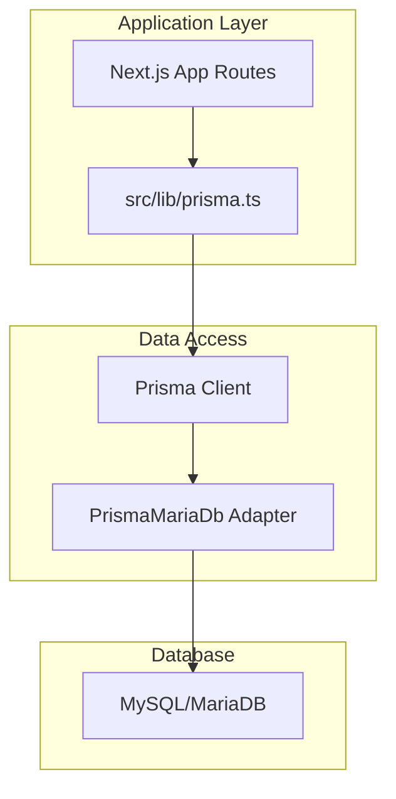
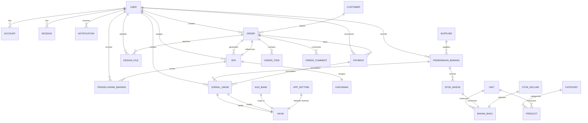

# Database Schema & Data Models

<cite>
**Referenced Files in This Document**
- [schema.prisma](file://prisma/schema.prisma)
- [prisma.ts](file://src/lib/prisma.ts)
- [seed.ts](file://prisma/seed.ts)
- [seed-finance.ts](file://prisma/seed-finance.ts)
- [seed-product.ts](file://prisma/seed-product.ts)
- [seed-dummy.ts](file://prisma/seed-dummy.ts)
- [seed-transactions.ts](file://prisma/seed-transactions.ts)
- [20260423131358_add_soft_delete/migration.sql](file://prisma/migrations/20260423131358_add_soft_delete/migration.sql)
- [20260426131857_add_email_to_app_setting/migration.sql](file://prisma/migrations/20260426131857_add_email_to_app_setting/migration.sql)
- [20260506074853_remove_stok_opname_and_stok_opname_item/migration.sql](file://prisma/migrations/20260506074853_remove_stok_opname_and_stok_opname_item/migration.sql)
- [20260518134933_add_design_queue_comments/migration.sql](file://prisma/migrations/20260518134933_add_design_queue_comments/migration.sql)
</cite>

## Table of Contents
1. [Introduction](#introduction)
2. [Project Structure](#project-structure)
3. [Core Components](#core-components)
4. [Architecture Overview](#architecture-overview)
5. [Detailed Component Analysis](#detailed-component-analysis)
6. [Dependency Analysis](#dependency-analysis)
7. [Performance Considerations](#performance-considerations)
8. [Troubleshooting Guide](#troubleshooting-guide)
9. [Conclusion](#conclusion)
10. [Appendices](#appendices)

## Introduction
This document provides comprehensive data model documentation for the database schema and data models used by the Point-of-Sale (POS) system. It covers entity relationships, field definitions, data types, constraints, and indexes across business domains including users, orders, products, inventory, financial accounts, and production workflows. It also documents Prisma ORM usage, migration management, seed data configuration, data lifecycle management (including soft deletes), and operational considerations such as performance and security.

## Project Structure
The data model is defined declaratively using Prisma Schema and generated into a strongly-typed client. Database connectivity is configured via an adapter that targets MariaDB-compatible MySQL. Seed scripts populate initial master data, chart of accounts, dummy entities, and realistic transactional history spanning multiple months.

**Diagram sources**
- [prisma.ts:1-25](file://src/lib/prisma.ts#L1-L25)
- [schema.prisma:1-10](file://prisma/schema.prisma#L1-L10)

**Section sources**
- [prisma.ts:1-25](file://src/lib/prisma.ts#L1-L25)
- [schema.prisma:1-10](file://prisma/schema.prisma#L1-L10)

## Core Components
This section outlines the major domain models and their relationships. Each model’s primary keys, foreign keys, indexes, and constraints are documented alongside business rules and data types.

- Authentication & User Management
  - User: central identity with accounts, sessions, notifications, orders, SPKs, design files, and journal entries.
  - Account: credential/provider linkage to User.
  - Session: session tokens with expiry and optional impersonation metadata.
  - Verification: email verification tokens.

- Master Data
  - Category: product classification.
  - Unit: measurement units for products and raw materials.
  - Product: SKUs, pricing, stock levels, and service flag.
  - Customer: client profiles.
  - Supplier: vendor profiles.
  - Karyawan: production staff.

- Inventory & Materials
  - BahanBaku: raw material items with stock and minimum thresholds.
  - PenerimaanBarang: goods receipts with supplier and items.
  - StokMasuk/StokKeluar: inbound/outbound movements linked to receipts and production.

- Orders & Production
  - Order: customer orders with channels, statuses, totals, and payment linkage.
  - OrderItem: line items per order.
  - DesignFile: design attachments per order.
  - SPK: production work order with stage, employee, and status.
  - PengeluaranBarang: outbound issuance against SPK.

- Payments & Finance
  - Payment: order payments with method and date.
  - Akun: chart of accounts with groups and normal position.
  - JurnalUmum: general ledger entries with debits and credits.
  - KasBank: cash/bank accounts mapped to chart of accounts.
  - AppSetting: single-row system settings including prefixes and default revenue account.

- Comments & Notifications
  - OrderComment, OrderCommentFile, CommentRecipient: order collaboration and notifications.
  - Notification: user-specific alerts.

- Enums
  - OrderChannel, StatusProduksi, StatusPembayaran, MetodePembayaran, StatusSPK, DesignReviewStatus, PosisiNormal, JenisNotif.

**Section sources**
- [schema.prisma:15-675](file://prisma/schema.prisma#L15-L675)

## Architecture Overview
The system uses Prisma ORM with a MariaDB-compatible adapter. Data seeding is performed via TypeScript scripts that upsert master data and realistic transactions. Migrations evolve the schema over time, adding soft delete support, new columns, and removing unused tables.

**Diagram sources**
- [schema.prisma:15-675](file://prisma/schema.prisma#L15-L675)

## Detailed Component Analysis

### Users and Authentication
- User
  - Fields: identifiers, profile, timestamps, ban fields, role, and soft delete.
  - Relations: accounts, sessions, notifications, orders, SPKs, design files, receipts, issuances, payments, journals, comments, comment recipients.
  - Indexes: none declared; relies on Prisma defaults.
- Account
  - Fields: provider credentials, tokens, scopes, timestamps.
  - Relation: belongs to User.
  - Index: userId.
- Session
  - Fields: token, expiry, IP/user agent, timestamps, impersonation info.
  - Relation: belongs to User.
  - Index: userId.
- Verification
  - Fields: identifier, value, expiry, timestamps.
  - Index: identifier.

**Section sources**
- [schema.prisma:15-90](file://prisma/schema.prisma#L15-L90)

### Master Data: Products, Categories, Units
- Category
  - Unique name index.
- Unit
  - Unique name index.
- Product
  - Unique SKU, indexes on SKU and name.
  - Relations: Category, Unit.
  - Soft delete column present in schema.
- Customer
  - Name and phone searchable; soft delete.
- Supplier
  - Contact info, address, notes, active flag.

**Section sources**
- [schema.prisma:96-176](file://prisma/schema.prisma#L96-L176)

### Inventory and Materials
- BahanBaku
  - Stock, min stock, unit relation with restrict deletion.
  - Indexes: name, unitId.
- PenerimaanBarang
  - Receipt header with supplier and items; soft delete.
  - Indexes: supplierId, addedById, date.
- StokMasuk/StokKeluar
  - Movement items with quantities and totals; restrict on raw material deletion.
  - Indexes: receipt/spk, raw material.

**Section sources**
- [schema.prisma:182-254](file://prisma/schema.prisma#L182-L254)

### Orders and Production
- Order
  - Unique order number, indexes on customer, user, order number, payment status, creation date.
  - Relations: Customer, User, OrderItems, DesignFiles, SPK, Payments, Designer (User), Comments.
  - Soft delete.
- OrderItem
  - Composite index on orderId, productId; restrict on product deletion; soft delete.
- DesignFile
  - Upload metadata and relation to Order and User.
- SPK
  - Unique order and SPK number; indexes on employee and production stage; soft delete.
  - Relations: Order, Karyawan, User, Issuances.
- PengeluaranBarang
  - Outgoing issuance with items; soft delete; indexes on SPK and addedBy.

**Section sources**
- [schema.prisma:260-393](file://prisma/schema.prisma#L260-L393)

### Payments and Finance
- Payment
  - Indexes on orderId, userId, date; soft delete.
  - Journal linkage for dual-entry accounting.
- Akun
  - Chart of accounts with group and normal position; active flag; indexes on code and group.
- JurnalUmum
  - General ledger entries; dual-accounting for each payment/receipt; indexes on date, paymentId, debit/credit accounts.
- KasBank
  - Cash/bank accounts mapped to chart of accounts; indexes on account and type.
- AppSetting
  - Single-row settings including prefixes, contact info, default revenue account.

**Section sources**
- [schema.prisma:399-597](file://prisma/schema.prisma#L399-L597)

### Comments and Notifications
- OrderComment
  - Text content, relations to Order and User; cascade delete on order/user.
- CommentRecipient
  - Read/unread tracking per user; unique constraint on (commentId, userId).
- OrderCommentFile
  - Attachment linkage to comments.
- Notification
  - Indexed by user and read status.

**Section sources**
- [schema.prisma:603-675](file://prisma/schema.prisma#L603-L675)

### Data Types and Constraints
- Strings: @db.VarChar(n), @db.Text, @db.Decimal(precision, scale).
- Dates: DateTime with defaults and updates.
- Enums: defined in schema for business states and classifications.
- Soft Delete: deletedAt fields on multiple tables for logical deletion.

**Section sources**
- [schema.prisma:15-675](file://prisma/schema.prisma#L15-L675)

### Data Validation and Business Rules
- Unique constraints: email, product SKU, order number, SPK number.
- Foreign keys: restrict/cascade per relationship semantics (e.g., raw material movement restricts deletion).
- Defaults: timestamps, booleans, decimal scales for currency/stock.
- Business enums: channels, production stages, payment statuses, methods, SPK status, review status, normal position.

**Section sources**
- [schema.prisma:15-675](file://prisma/schema.prisma#L15-L675)

## Dependency Analysis
Prisma ORM connects to MariaDB via an adapter. The client is instantiated once and reused globally outside production. Seed scripts orchestrate master data and transactional history, ensuring referential integrity and realistic balances.

**Diagram sources**
- [schema.prisma:1-10](file://prisma/schema.prisma#L1-L10)
- [prisma.ts:1-25](file://src/lib/prisma.ts#L1-L25)

**Section sources**
- [prisma.ts:1-25](file://src/lib/prisma.ts#L1-L25)
- [schema.prisma:1-10](file://prisma/schema.prisma#L1-L10)

## Performance Considerations
- Indexes: strategic indexes on frequently filtered/sorted fields (SKU, names, dates, foreign keys) improve query performance.
- Decimal precision: standardized currency and stock decimals reduce rounding errors and optimize storage.
- Soft delete: deletedAt enables logical deletion without costly cascades; application logic should filter by deletedAt.
- Connection limits: adapter connection limit set to moderate concurrency.
- Enum usage: reduces variability and improves query plans.

[No sources needed since this section provides general guidance]

## Troubleshooting Guide
- Migration conflicts: ensure migration lock and SQL consistency; recent migrations include soft delete additions, column additions, and table removals.
- Seed failures: seed scripts check existence and use upsert/createMany; verify prerequisites (chart of accounts, master data) before running transaction seeds.
- Connection issues: confirm DATABASE_URL format and adapter parameters.

**Section sources**
- [20260423131358_add_soft_delete/migration.sql:1-36](file://prisma/migrations/20260423131358_add_soft_delete/migration.sql#L1-L36)
- [20260426131857_add_email_to_app_setting/migration.sql:1-9](file://prisma/migrations/20260426131857_add_email_to_app_setting/migration.sql#L1-L9)
- [20260506074853_remove_stok_opname_and_stok_opname_item/migration.sql:1-28](file://prisma/migrations/20260506074853_remove_stok_opname_and_stok_opname_item/migration.sql#L1-L28)
- [20260518134933_add_design_queue_comments/migration.sql:1-47](file://prisma/migrations/20260518134933_add_design_queue_comments/migration.sql#L1-L47)

## Conclusion
The data model supports a complete end-to-end workflow from customer orders through production and inventory to financial accounting. Prisma provides strong typing and migrations for schema evolution, while seed scripts deliver realistic datasets for development and testing. Soft delete, enums, and indexes collectively balance flexibility, integrity, and performance.

[No sources needed since this section summarizes without analyzing specific files]

## Appendices

### A. Data Access Patterns Using Prisma ORM
- Client initialization: adapter-based client with connection pooling.
- CRUD patterns: upsert for master data, createMany for bulk inserts, cascade relations for nested writes.
- Transactions: use Prisma transaction blocks for multi-entity consistency (e.g., order + items + SPK + issuance).

**Section sources**
- [prisma.ts:1-25](file://src/lib/prisma.ts#L1-L25)
- [seed.ts:1-136](file://prisma/seed.ts#L1-L136)
- [seed-finance.ts:1-106](file://prisma/seed-finance.ts#L1-L106)
- [seed-product.ts:1-237](file://prisma/seed-product.ts#L1-L237)
- [seed-dummy.ts:1-98](file://prisma/seed-dummy.ts#L1-L98)
- [seed-transactions.ts:1-617](file://prisma/seed-transactions.ts#L1-L617)

### B. Migration Management
- Evolution: migrations add soft delete, new columns, and remove unused stock adjustment tables.
- Lock file: migration lock ensures controlled deployment.

**Section sources**
- [20260423131358_add_soft_delete/migration.sql:1-36](file://prisma/migrations/20260423131358_add_soft_delete/migration.sql#L1-L36)
- [20260426131857_add_email_to_app_setting/migration.sql:1-9](file://prisma/migrations/20260426131857_add_email_to_app_setting/migration.sql#L1-L9)
- [20260506074853_remove_stok_opname_and_stok_opname_item/migration.sql:1-28](file://prisma/migrations/20260506074853_remove_stok_opname_and_stok_opname_item/migration.sql#L1-L28)
- [20260518134933_add_design_queue_comments/migration.sql:1-47](file://prisma/migrations/20260518134933_add_design_queue_comments/migration.sql#L1-L47)

### C. Seed Data Configuration
- Users: predefined identities with hashed default passwords.
- Finance: chart of accounts and cash/bank accounts.
- Products: categories, units, and SKUs with estimated costs and stock.
- Dummy data: employees, customers, suppliers, raw materials.
- Transactions: realistic monthly journals, purchases, payments, receivables, and production flows.

**Section sources**
- [seed.ts:1-136](file://prisma/seed.ts#L1-L136)
- [seed-finance.ts:1-106](file://prisma/seed-finance.ts#L1-L106)
- [seed-product.ts:1-237](file://prisma/seed-product.ts#L1-L237)
- [seed-dummy.ts:1-98](file://prisma/seed-dummy.ts#L1-L98)
- [seed-transactions.ts:1-617](file://prisma/seed-transactions.ts#L1-L617)

### D. Data Lifecycle Management
- Soft delete: deletedAt fields enable logical deletion; queries should filter by null deletedAt unless explicitly retrieving trashed records.
- Retention: no explicit retention policies defined in schema; implement at application level if required.
- Audit: createdAt/updatedAt timestamps capture lifecycle changes.

**Section sources**
- [schema.prisma:15-675](file://prisma/schema.prisma#L15-L675)

### E. Security and Access Control
- Authentication: credential-based accounts with hashed passwords.
- Authorization: role-based access enforced in application routes.
- Data exposure: ensure API routes sanitize outputs and enforce RBAC checks.

[No sources needed since this section provides general guidance]

### F. Backup and Recovery
- Recommended: use database-native backups for full recovery; schedule regular snapshots.
- Prisma: leverage migrations for schema drift control; maintain migration history.

[No sources needed since this section provides general guidance]