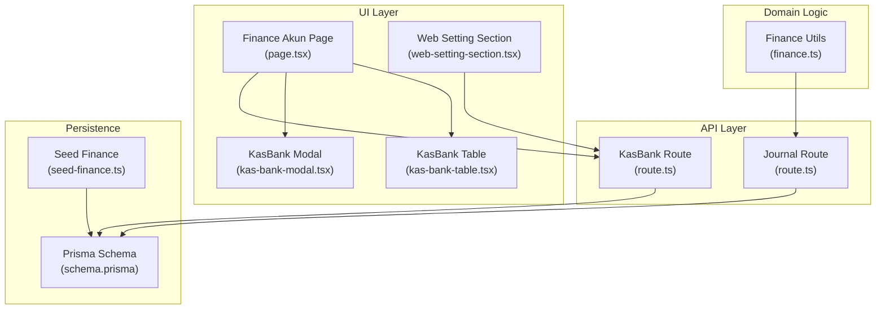
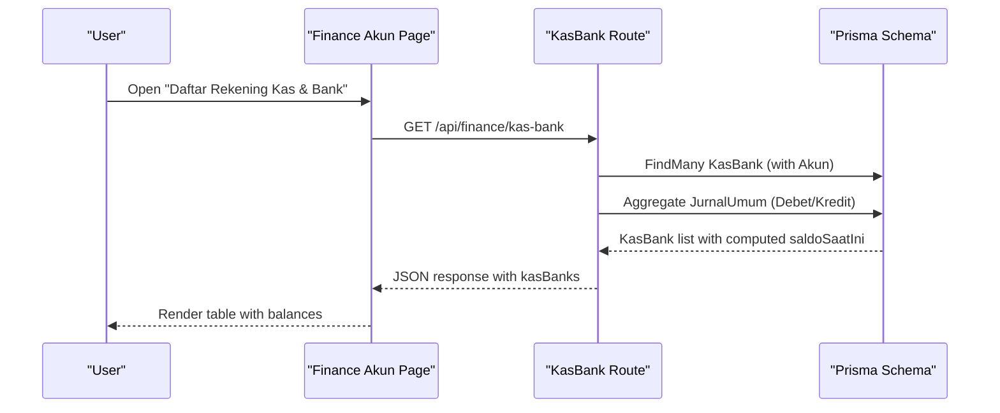
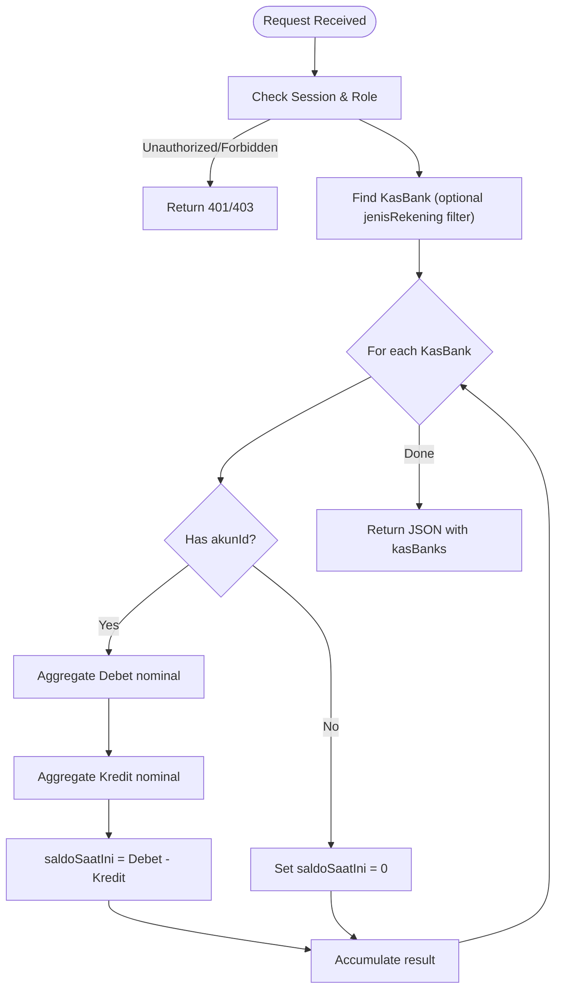
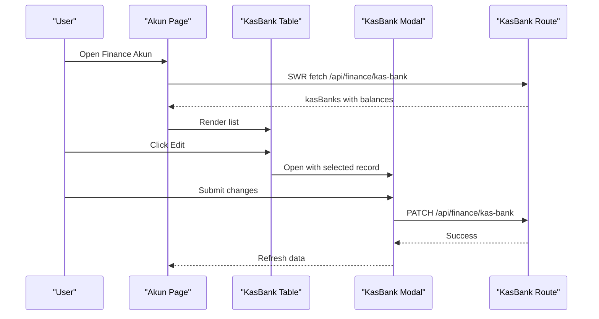
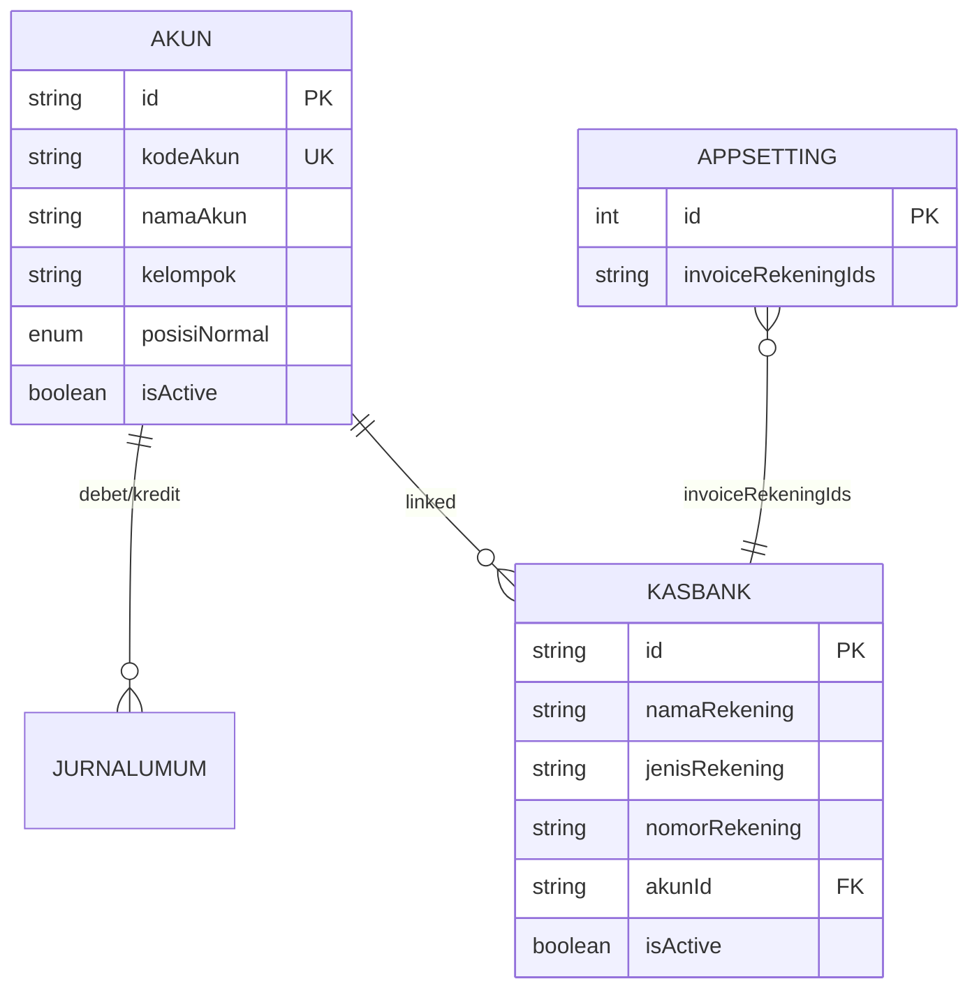
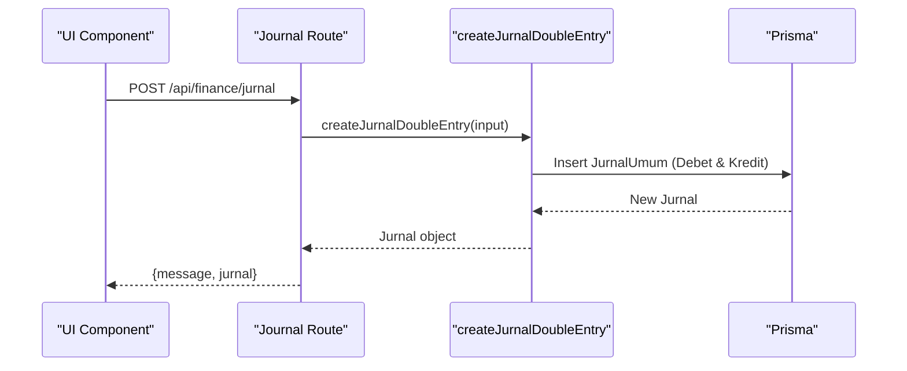
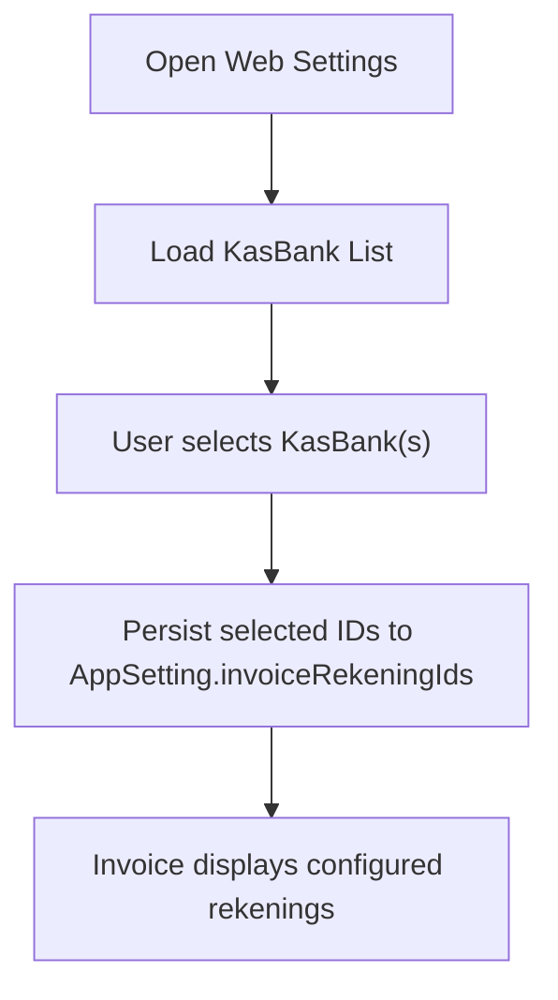
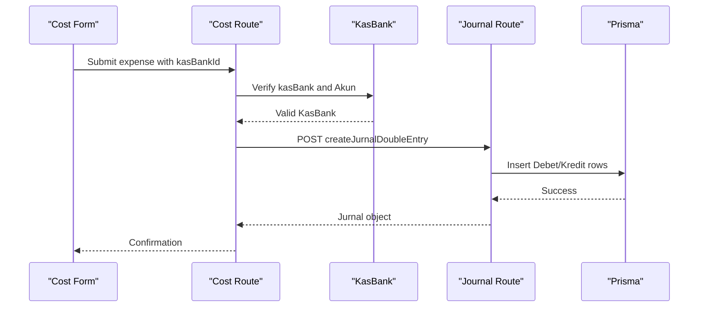
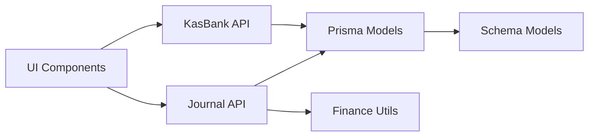

# Cash & Bank Accounts (KasBank)

<cite>
**Referenced Files in This Document**
- [route.ts](file://src/app/api/finance/kas-bank/route.ts)
- [page.tsx](file://src/app/(LoggedIn)/finance/akun/page.tsx)
- [layout.tsx](file://src/app/(LoggedIn)/finance/akun/layout.tsx)
- [kas-bank-modal.tsx](file://src/app/(LoggedIn)/finance/akun/components/kas-bank-modal.tsx)
- [kas-bank-table.tsx](file://src/app/(LoggedIn)/finance/akun/components/kas-bank-table.tsx)
- [web-setting-section.tsx](file://src/app/(LoggedIn)/settings/web-setting/web-setting-section.tsx)
- [schema.prisma](file://prisma/schema.prisma)
- [seed-finance.ts](file://prisma/seed-finance.ts)
- [route.ts](file://src/app/api/finance/jurnal/route.ts)
- [finance.ts](file://src/lib/finance.ts)
- [route.ts](file://src/app/api/finance/cost/route.ts)
</cite>

## Table of Contents
1. [Introduction](#introduction)
2. [Project Structure](#project-structure)
3. [Core Components](#core-components)
4. [Architecture Overview](#architecture-overview)
5. [Detailed Component Analysis](#detailed-component-analysis)
6. [Dependency Analysis](#dependency-analysis)
7. [Performance Considerations](#performance-considerations)
8. [Troubleshooting Guide](#troubleshooting-guide)
9. [Conclusion](#conclusion)
10. [Appendices](#appendices)

## Introduction
This document explains the Cash & Bank Accounts (KasBank) management system, focusing on multi-rekening support with jenisRekening categories (BANK, CASH, EWALLET), account linkage to the Chart of Accounts (COA), and rekening configuration for invoice display. It covers account lifecycle management (creation, maintenance, deactivation), nomorRekening management, bank reconciliation via journal entries, and practical examples such as setting up multiple payment channels, configuring default payment methods, managing balances, and integrating with journal entries. Security measures, reporting, and compliance considerations are also addressed.

## Project Structure
The KasBank module spans UI pages, API routes, and database schema definitions:
- UI: Finance account page with tabs for Chart of Accounts and KasBank, including editable modal and table components.
- API: Server-side endpoints for retrieving and updating KasBank records, including computed balances derived from journal entries.
- Schema: Prisma models for Akun (Chart of Accounts), KasBank, and AppSetting (invoice rekening configuration).
- Seed: Initial data seeding for KasBank and related accounts.

**Diagram sources**
- [page.tsx:1-248](file://src/app/(LoggedIn)/finance/akun/page.tsx#L1-L248)
- [kas-bank-table.tsx:1-123](file://src/app/(LoggedIn)/finance/akun/components/kas-bank-table.tsx#L1-L123)
- [kas-bank-modal.tsx:1-176](file://src/app/(LoggedIn)/finance/akun/components/kas-bank-modal.tsx#L1-L176)
- [web-setting-section.tsx:340-421](file://src/app/(LoggedIn)/settings/web-setting/web-setting-section.tsx#L340-L421)
- [route.ts:16-112](file://src/app/api/finance/kas-bank/route.ts#L16-L112)
- [route.ts:16-169](file://src/app/api/finance/jurnal/route.ts#L16-L169)
- [finance.ts:1-55](file://src/lib/finance.ts#L1-L55)
- [schema.prisma:425-503](file://prisma/schema.prisma#L425-L503)
- [seed-finance.ts:91-105](file://prisma/seed-finance.ts#L91-L105)

**Section sources**
- [page.tsx:1-248](file://src/app/(LoggedIn)/finance/akun/page.tsx#L1-L248)
- [route.ts:16-112](file://src/app/api/finance/kas-bank/route.ts#L16-L112)
- [schema.prisma:425-503](file://prisma/schema.prisma#L425-L503)

## Core Components
- KasBank API endpoint: Provides filtered retrieval of rekening data with computed balances and supports PATCH updates for name, jenisRekening, nomorRekening, and isActive.
- UI components: A tabbed interface displaying Chart of Accounts and KasBank, with a dedicated table and modal for editing KasBank records.
- Schema models: Akun (COA), KasBank (linked to Akun), and AppSetting (invoiceRekeningIds) define the domain structure.
- Journal integration: Balances are computed from journal entries; transactions are created via double-entry utilities.

Key capabilities:
- Multi-rekening with jenisRekening categories (BANK, CASH, EWALLET).
- Link to Chart of Accounts via akunId for accurate balance computation.
- Invoice display configuration via AppSetting.invoiceRekeningIds.
- Real-time balance calculation from JurnalUmum aggregates.

**Section sources**
- [route.ts:16-112](file://src/app/api/finance/kas-bank/route.ts#L16-L112)
- [kas-bank-modal.tsx:26-100](file://src/app/(LoggedIn)/finance/akun/components/kas-bank-modal.tsx#L26-L100)
- [kas-bank-table.tsx:21-123](file://src/app/(LoggedIn)/finance/akun/components/kas-bank-table.tsx#L21-L123)
- [schema.prisma:425-503](file://prisma/schema.prisma#L425-L503)
- [web-setting-section.tsx:346-407](file://src/app/(LoggedIn)/settings/web-setting/web-setting-section.tsx#L346-L407)

## Architecture Overview
The system follows a layered architecture:
- UI layer: Next.js client components render forms and tables.
- API layer: Next.js routes handle authentication checks, data retrieval, and updates.
- Domain layer: Utility functions encapsulate double-entry journal creation.
- Persistence layer: Prisma ORM models and seed scripts manage schema and initial data.

**Diagram sources**
- [page.tsx:42-46](file://src/app/(LoggedIn)/finance/akun/page.tsx#L42-L46)
- [route.ts:16-81](file://src/app/api/finance/kas-bank/route.ts#L16-L81)
- [schema.prisma:425-503](file://prisma/schema.prisma#L425-L503)

## Detailed Component Analysis

### KasBank API Endpoint
Responsibilities:
- Authentication and authorization enforcement for admin and kasir roles.
- Filtering by jenisRekening query parameter.
- Including Akun relation for COA linkage.
- Computing current balance by aggregating Debet and Kredit totals from JurnalUmum.
- PATCH endpoint to update namaRekening, jenisRekening, nomorRekening, and isActive.

**Diagram sources**
- [route.ts:16-81](file://src/app/api/finance/kas-bank/route.ts#L16-L81)

**Section sources**
- [route.ts:6-14](file://src/app/api/finance/kas-bank/route.ts#L6-L14)
- [route.ts:16-81](file://src/app/api/finance/kas-bank/route.ts#L16-L81)
- [route.ts:83-112](file://src/app/api/finance/kas-bank/route.ts#L83-L112)

### UI: Finance Akun Page and Components
- Finance Akun Page orchestrates fetching of Akun, KasBank, and Kelompok data, applies filters, and renders two tabs: Buku Besar and Daftar Rekening Kas & Bank.
- KasBankTable displays namaRekening, jenisRekening, nomorRekening, linked Akun, current saldoSaatIni, and optional edit action.
- KasBankModal allows editing of namaRekening, jenisRekening, nomorRekening, and isActive for existing records.

**Diagram sources**
- [page.tsx:42-86](file://src/app/(LoggedIn)/finance/akun/page.tsx#L42-L86)
- [kas-bank-table.tsx:21-123](file://src/app/(LoggedIn)/finance/akun/components/kas-bank-table.tsx#L21-L123)
- [kas-bank-modal.tsx:28-100](file://src/app/(LoggedIn)/finance/akun/components/kas-bank-modal.tsx#L28-L100)
- [route.ts:83-112](file://src/app/api/finance/kas-bank/route.ts#L83-L112)

**Section sources**
- [page.tsx:23-248](file://src/app/(LoggedIn)/finance/akun/page.tsx#L23-L248)
- [kas-bank-table.tsx:21-123](file://src/app/(LoggedIn)/finance/akun/components/kas-bank-table.tsx#L21-L123)
- [kas-bank-modal.tsx:28-176](file://src/app/(LoggedIn)/finance/akun/components/kas-bank-modal.tsx#L28-L176)

### Schema Models and Data Relationships
- Akun: Chart of Accounts with kodeAkun, namaAkun, kelompok, posisiNormal, and relations to JurnalUmum and KasBank.
- KasBank: Rekening with id, namaRekening, jenisRekening (BANK/CASH/EWALLET), nomorRekening, akunId (optional), and isActive.
- AppSetting: Contains invoiceRekeningIds (JSON array of KasBank IDs) for invoice display configuration.

**Diagram sources**
- [schema.prisma:425-503](file://prisma/schema.prisma#L425-L503)
- [schema.prisma:569-597](file://prisma/schema.prisma#L569-L597)

**Section sources**
- [schema.prisma:425-503](file://prisma/schema.prisma#L425-L503)
- [schema.prisma:569-597](file://prisma/schema.prisma#L569-L597)

### Journal Integration and Double-Entry Creation
- Journal Route handles GET (filtered queries), POST (manual or reversal entries), and DELETE (soft delete with cascading).
- Finance Utils provides createJurnalDoubleEntry to insert standardized double-entry rows with proper decimal handling.

**Diagram sources**
- [route.ts:84-125](file://src/app/api/finance/jurnal/route.ts#L84-L125)
- [finance.ts:26-54](file://src/lib/finance.ts#L26-L54)

**Section sources**
- [route.ts:16-169](file://src/app/api/finance/jurnal/route.ts#L16-L169)
- [finance.ts:26-54](file://src/lib/finance.ts#L26-L54)

### Invoice Rekening Configuration
- Web Setting Section allows selecting multiple KasBank records to display on invoices via invoiceRekeningIds.
- The selection toggles IDs stored as a JSON array string in AppSetting.

**Diagram sources**
- [web-setting-section.tsx:346-407](file://src/app/(LoggedIn)/settings/web-setting/web-setting-section.tsx#L346-L407)
- [schema.prisma:569-597](file://prisma/schema.prisma#L569-L597)

**Section sources**
- [web-setting-section.tsx:346-407](file://src/app/(LoggedIn)/settings/web-setting/web-setting-section.tsx#L346-L407)
- [schema.prisma:569-597](file://prisma/schema.prisma#L569-L597)

### Cost Transaction Using KasBank (Example)
- Cost route validates inputs, ensures a valid KasBank source (with linked Akun), and creates double-entry journals for expenses.
- Demonstrates linking payment sources to KasBank for expense recording.

**Diagram sources**
- [route.ts:112-144](file://src/app/api/finance/cost/route.ts#L112-L144)
- [route.ts:84-125](file://src/app/api/finance/jurnal/route.ts#L84-L125)
- [finance.ts:26-54](file://src/lib/finance.ts#L26-L54)

**Section sources**
- [route.ts:112-144](file://src/app/api/finance/cost/route.ts#L112-L144)

## Dependency Analysis
- UI depends on SWR for data fetching and on API routes for mutations.
- API routes depend on Prisma models for persistence and on Finance Utils for journal creation.
- KasBank depends on Akun for balance computation and on AppSetting for invoice display.

**Diagram sources**
- [page.tsx:36-51](file://src/app/(LoggedIn)/finance/akun/page.tsx#L36-L51)
- [route.ts:16-112](file://src/app/api/finance/kas-bank/route.ts#L16-L112)
- [route.ts:16-169](file://src/app/api/finance/jurnal/route.ts#L16-L169)
- [finance.ts:26-54](file://src/lib/finance.ts#L26-L54)
- [schema.prisma:425-503](file://prisma/schema.prisma#L425-L503)

**Section sources**
- [page.tsx:36-51](file://src/app/(LoggedIn)/finance/akun/page.tsx#L36-L51)
- [route.ts:16-112](file://src/app/api/finance/kas-bank/route.ts#L16-L112)
- [route.ts:16-169](file://src/app/api/finance/jurnal/route.ts#L16-L169)
- [finance.ts:26-54](file://src/lib/finance.ts#L26-L54)
- [schema.prisma:425-503](file://prisma/schema.prisma#L425-L503)

## Performance Considerations
- Balance computation uses aggregation per KasBank; consider indexing on akunDebetId and akunKreditId in JurnalUmum for improved performance.
- Batch operations: Prefer server-side filtering and pagination for large datasets.
- UI responsiveness: Debounced search and memoized lists reduce unnecessary re-renders.

[No sources needed since this section provides general guidance]

## Troubleshooting Guide
Common issues and resolutions:
- Unauthorized or Forbidden access to KasBank APIs: Ensure session exists and user role is admin or kasir.
- No balances shown: Verify that akunId is set on KasBank and that JurnalUmum entries exist for the linked Akun.
- PATCH fails: Confirm id is provided and required fields are valid; check toast messages for validation errors.
- Invoice rekening not appearing: Ensure AppSetting.invoiceRekeningIds contains valid KasBank IDs and that the records are active.

**Section sources**
- [route.ts:6-14](file://src/app/api/finance/kas-bank/route.ts#L6-L14)
- [kas-bank-modal.tsx:49-100](file://src/app/(LoggedIn)/finance/akun/components/kas-bank-modal.tsx#L49-L100)
- [web-setting-section.tsx:355-407](file://src/app/(LoggedIn)/settings/web-setting/web-setting-section.tsx#L355-L407)

## Conclusion
The KasBank module integrates seamlessly with the Chart of Accounts and journaling system to provide accurate, real-time balance tracking for BANK, CASH, and EWALLET accounts. Its UI enables efficient maintenance and configuration, while AppSetting supports flexible invoice presentation. Robust API endpoints and transaction utilities ensure reliable financial recording and reporting readiness.

[No sources needed since this section summarizes without analyzing specific files]

## Appendices

### Account Lifecycle Examples
- Creating multiple payment channels:
  - Add separate KasBank records for each channel (e.g., multiple BANK accounts).
  - Configure default payment methods by linking appropriate Akun in AppSetting or order workflows.
- Managing account balances:
  - Ensure each KasBank links to an Akun; balances reflect JurnalUmum activity.
- Integrating with journal entries:
  - Use createJurnalDoubleEntry to maintain balanced accounting entries for all transactions.
- Security and compliance:
  - Restrict access to admin and kasir roles.
  - Maintain audit trails via JurnalUmum and soft deletion on removal.
  - Regular reconciliation by comparing computed balances with external statements.

[No sources needed since this section provides general guidance]