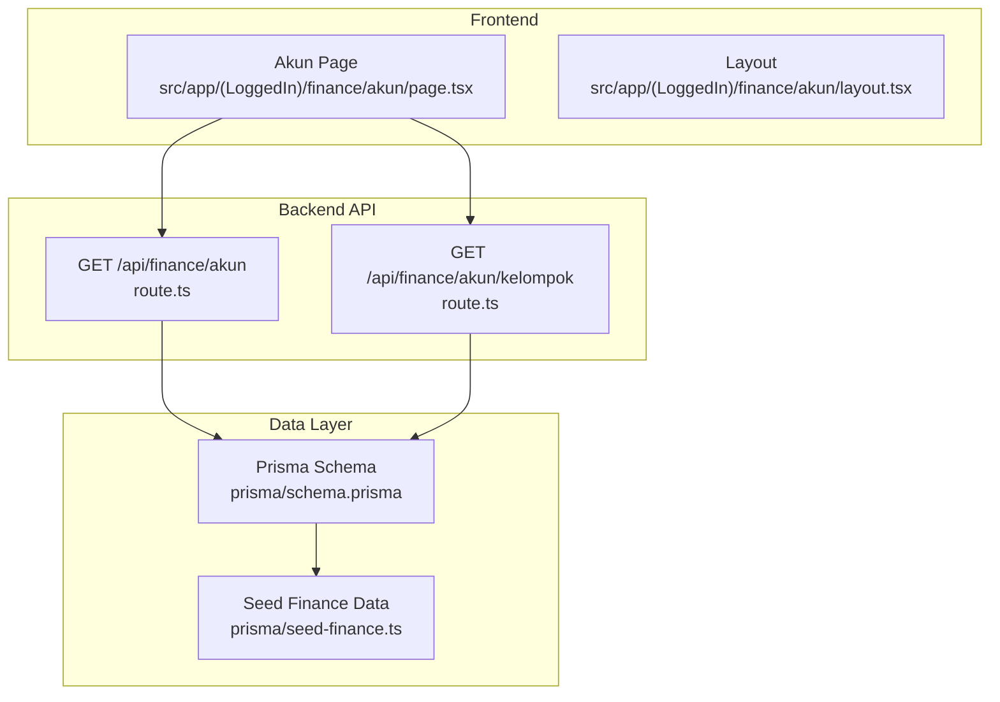
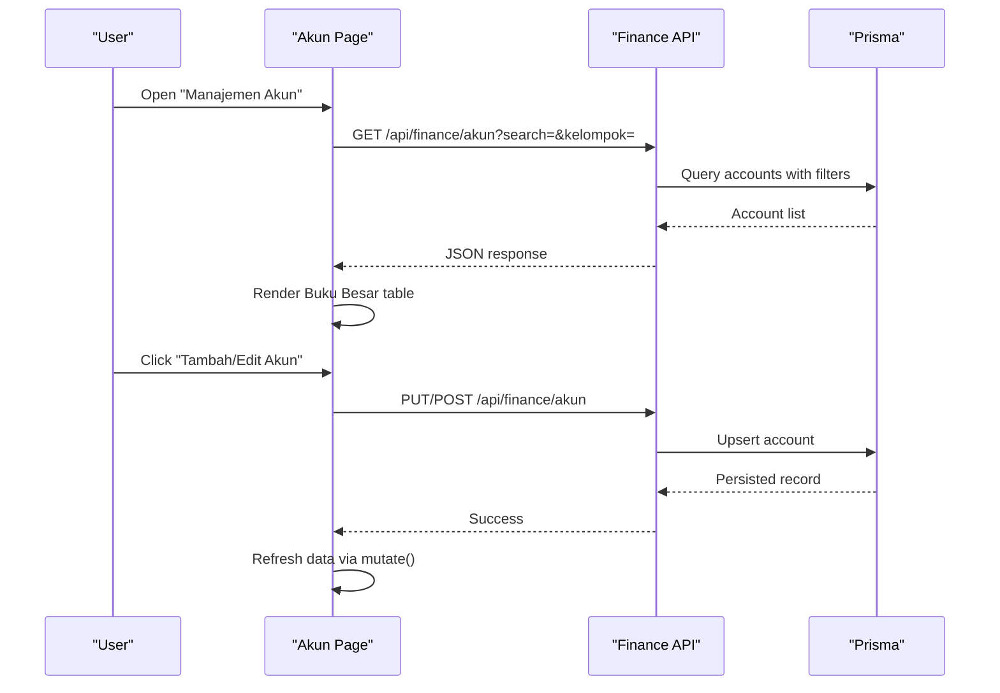
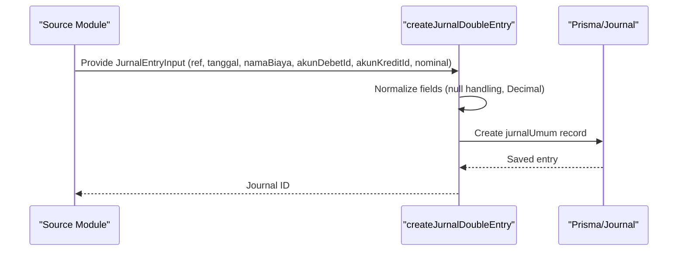
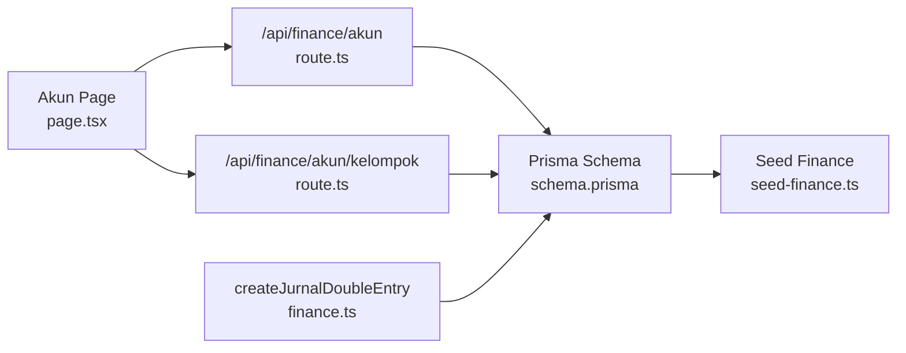

# Chart of Accounts (Akun)

<cite>
**Referenced Files in This Document**
- [page.tsx](file://src/app/(LoggedIn)/finance/akun/page.tsx)
- [layout.tsx](file://src/app/(LoggedIn)/finance/akun/layout.tsx)
- [finance.ts](file://src/lib/finance.ts)
- [route.ts](file://src/app/api/finance/akun/route.ts)
- [route.ts](file://src/app/api/finance/akun/kelompok/route.ts)
- [schema.prisma](file://prisma/schema.prisma)
- [seed-finance.ts](file://prisma/seed-finance.ts)
</cite>

## Table of Contents
1. [Introduction](#introduction)
2. [Project Structure](#project-structure)
3. [Core Components](#core-components)
4. [Architecture Overview](#architecture-overview)
5. [Detailed Component Analysis](#detailed-component-analysis)
6. [Dependency Analysis](#dependency-analysis)
7. [Performance Considerations](#performance-considerations)
8. [Troubleshooting Guide](#troubleshooting-guide)
9. [Conclusion](#conclusion)

## Introduction
This document explains the Chart of Accounts (Akun) system in the Point of Sale (POS) application. It covers the hierarchical account structure, classification by kelompok (account groups), normal balance rules (posisiNormal), and how accounts relate to journal entries. It also documents multi-rekening (multiple bank/cash accounts) support, default account configurations for financial transactions, account activation/deactivation, and alignment with standard accounting classifications.

## Project Structure
The Akun module is organized as a Next.js app route under the finance section. The frontend page integrates with backend APIs for fetching accounts, groups, and managing records. The backend uses Prisma ORM to persist data and seeds initial chart of accounts.

**Diagram sources**
- [page.tsx](file://src/app/(LoggedIn)/finance/akun/page.tsx#L36-L51)
- [route.ts](file://src/app/api/finance/akun/route.ts)
- [route.ts](file://src/app/api/finance/akun/kelompok/route.ts)
- [schema.prisma](file://prisma/schema.prisma)
- [seed-finance.ts](file://prisma/seed-finance.ts)

**Section sources**
- [page.tsx](file://src/app/(LoggedIn)/finance/akun/page.tsx#L1-L248)
- [layout.tsx](file://src/app/(LoggedIn)/finance/akun/layout.tsx#L1-L11)

## Core Components
- Akun Page: Renders two tabs—Chart of Accounts (Buku Besar) and Cash/Bank Accounts (Daftar Rekening Kas & Bank). Supports search, advanced filters (by kelompok and status), and admin actions to edit records.
- Finance Utilities: Provides a double-entry journal creation helper that ensures proper debet/kredit pairings and numeric precision.
- Backend Routes: Expose endpoints to list accounts with filters, list kelompok (groups), and manage cash/bank accounts.
- Data Model: Prisma schema defines account, journal, and related entities with appropriate relations and constraints.
- Seed Data: Initial finance data includes typical kelompok categories and sample accounts.

**Section sources**
- [page.tsx](file://src/app/(LoggedIn)/finance/akun/page.tsx#L23-L248)
- [finance.ts:1-55](file://src/lib/finance.ts#L1-L55)
- [route.ts](file://src/app/api/finance/akun/route.ts)
- [route.ts](file://src/app/api/finance/akun/kelompok/route.ts)
- [schema.prisma](file://prisma/schema.prisma)
- [seed-finance.ts](file://prisma/seed-finance.ts)

## Architecture Overview
The Akun system follows a layered architecture:
- Presentation: Next.js client-side page renders tabs, filters, and modals.
- API: Route handlers serve filtered lists of accounts and kelompok.
- Persistence: Prisma ORM maps to database tables for accounts, journals, and cash/bank records.
- Business Logic: Finance utilities encapsulate double-entry journal creation.

**Diagram sources**
- [page.tsx](file://src/app/(LoggedIn)/finance/akun/page.tsx#L36-L51)
- [route.ts](file://src/app/api/finance/akun/route.ts)
- [schema.prisma](file://prisma/schema.prisma)

## Detailed Component Analysis

### Hierarchical Account Structure and kodeAkun Formatting
- The system supports hierarchical account codes with a standardized format such as '1-001', '2-001'. This structure enables grouping by major categories (e.g., 1 for Aktiva Lancar, 2 for Kewajiban) and further subdivision into sub-accounts.
- The frontend displays accounts in a table with filtering by kelompok and status. While the exact parsing/formatting logic is not shown here, the presence of search and group filters indicates structured account codes are expected and utilized for efficient navigation.

**Section sources**
- [page.tsx](file://src/app/(LoggedIn)/finance/akun/page.tsx#L58-L86)

### Account Classification by kelompok
- kelompok represents the account group aligned with standard accounting classifications:
  - Aktiva Lancar
  - Kewajiban
  - Modal
  - Pendapatan
  - Beban
- The frontend fetches kelompok options dynamically and allows filtering accounts by group. This ensures consistent categorization across the system.

**Section sources**
- [page.tsx](file://src/app/(LoggedIn)/finance/akun/page.tsx#L48-L51)
- [page.tsx](file://src/app/(LoggedIn)/finance/akun/page.tsx#L98-L107)
- [route.ts](file://src/app/api/finance/akun/kelompok/route.ts)

### posisiNormal (DEBET/KREDIT) Rules
- The system enforces double-entry bookkeeping via a utility that creates journal entries with explicit debet and kredit accounts and a nominal amount. This ensures every transaction impacts at least two accounts, maintaining debit-credit balance.
- The utility accepts akunDebetId and akunKreditId, ensuring that normal balance rules are respected at the application level.

**Section sources**
- [finance.ts:26-54](file://src/lib/finance.ts#L26-L54)

### Relationship Between Accounts and Journal Entries
- Accounts are the foundational building blocks for journal entries. Each journal entry references two accounts (debet and kredit) and a monetary amount.
- The double-entry helper centralizes journal creation, reducing errors and ensuring consistency across financial transactions.

**Diagram sources**
- [finance.ts:26-54](file://src/lib/finance.ts#L26-L54)

### Multi-Rekening Support
- The Akun page includes a dedicated tab for Cash/Bank Accounts (Daftar Rekening Kas & Bank). Filtering and editing capabilities indicate support for multiple bank and cash accounts.
- This separation allows assigning transactions to specific cash/bank accounts while still linking to the appropriate ledger accounts.

**Section sources**
- [page.tsx](file://src/app/(LoggedIn)/finance/akun/page.tsx#L218-L243)

### Default Account Configurations for Financial Transactions
- The finance utility provides a standardized input model for journal entries, including optional fields for references, supporting documentation, and linkage to related entities (payment, cost, penerimaan).
- This design enables default mappings for common transactions by selecting appropriate debet/kredit accounts per kelompok and transaction type.

**Section sources**
- [finance.ts:5-19](file://src/lib/finance.ts#L5-L19)

### Examples of Account Creation, Categorization, and Reporting Integration
- Creating an account:
  - Use the modal to add/edit an account with kodeAkun, kelompok, and status. The page triggers a mutation to refresh data after successful updates.
- Categorization:
  - Select kelompok from the dynamic dropdown to classify accounts consistently with standard accounting groups.
- Reporting:
  - With accounts properly categorized and linked to journal entries, financial statements (e.g., Neraca, Laba-Rugi) can be generated by aggregating balances per kelompok and account.

Note: Specific UI modals and tables are integrated into the page and rely on the backend APIs for persistence and retrieval.

**Section sources**
- [page.tsx](file://src/app/(LoggedIn)/finance/akun/page.tsx#L153-L180)
- [page.tsx](file://src/app/(LoggedIn)/finance/akun/page.tsx#L210-L214)

### Account Activation/Deactivation and Hierarchy Management
- Status filtering (active/inactive) is supported in both the Buku Besar and Daftar Rekening tabs, enabling quick visibility and management of inactive accounts.
- Hierarchy management:
  - The kodeAkun format implies a parent-child structure suitable for tree-based navigation and reporting. While the exact hierarchy rendering is not shown here, the filtering and grouping mechanisms support hierarchical browsing.

**Section sources**
- [page.tsx](file://src/app/(LoggedIn)/finance/akun/page.tsx#L53-L65)
- [page.tsx](file://src/app/(LoggedIn)/finance/akun/page.tsx#L80-L86)

### Compliance with Standard Accounting Classifications
- kelompok aligns with standard accounting classifications (Aktiva Lancar, Kewajiban, Modal, Pendapatan, Beban), ensuring compliance with common financial reporting frameworks.
- Double-entry enforcement via the journal utility guarantees balanced accounting records.

**Section sources**
- [page.tsx](file://src/app/(LoggedIn)/finance/akun/page.tsx#L98-L107)
- [finance.ts:26-54](file://src/lib/finance.ts#L26-L54)

## Dependency Analysis
The Akun system exhibits clear separation of concerns:
- Frontend depends on:
  - SWR for data fetching and caching
  - Backend API routes for CRUD operations
  - Local state for filters and modals
- Backend depends on:
  - Prisma schema for data modeling
  - Seed data for initial setup
- Finance utilities encapsulate journal creation logic, decoupling business rules from presentation.

**Diagram sources**
- [page.tsx](file://src/app/(LoggedIn)/finance/akun/page.tsx#L36-L51)
- [route.ts](file://src/app/api/finance/akun/route.ts)
- [route.ts](file://src/app/api/finance/akun/kelompok/route.ts)
- [finance.ts:26-54](file://src/lib/finance.ts#L26-L54)
- [schema.prisma](file://prisma/schema.prisma)
- [seed-finance.ts](file://prisma/seed-finance.ts)

**Section sources**
- [page.tsx](file://src/app/(LoggedIn)/finance/akun/page.tsx#L1-L248)
- [finance.ts:1-55](file://src/lib/finance.ts#L1-L55)
- [route.ts](file://src/app/api/finance/akun/route.ts)
- [route.ts](file://src/app/api/finance/akun/kelompok/route.ts)
- [schema.prisma](file://prisma/schema.prisma)
- [seed-finance.ts](file://prisma/seed-finance.ts)

## Performance Considerations
- Debounced search reduces unnecessary API calls during typing.
- SWR caching minimizes repeated network requests for the same filters.
- Filtering is applied client-side after fetching, which is efficient for moderate-sized datasets. For larger datasets, consider server-side pagination and filtering.

## Troubleshooting Guide
- If kelompok options are empty:
  - Verify the endpoint for kelompok returns data and the page’s fetcher handles the response correctly.
- If journal entries fail:
  - Ensure akunDebetId and akunKreditId are valid and belong to the same kelompok classification boundaries.
- If account edits do not reflect:
  - Confirm the mutation triggers after successful API responses and that the page refreshes data appropriately.

**Section sources**
- [page.tsx](file://src/app/(LoggedIn)/finance/akun/page.tsx#L48-L51)
- [finance.ts:26-54](file://src/lib/finance.ts#L26-L54)

## Conclusion
The Akun system provides a robust foundation for chart of accounts management, integrating hierarchical account codes, standardized kelompok classifications, and strict double-entry journal creation. Its modular design supports multi-rekening configurations, flexible filtering, and future reporting integrations aligned with standard accounting practices.