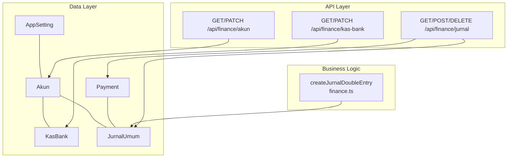
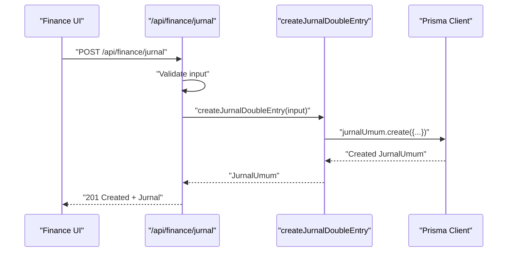
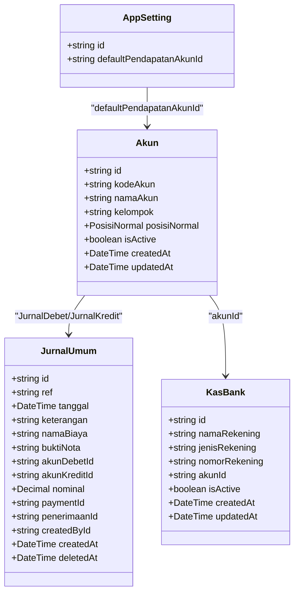
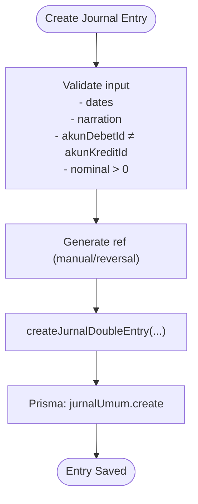
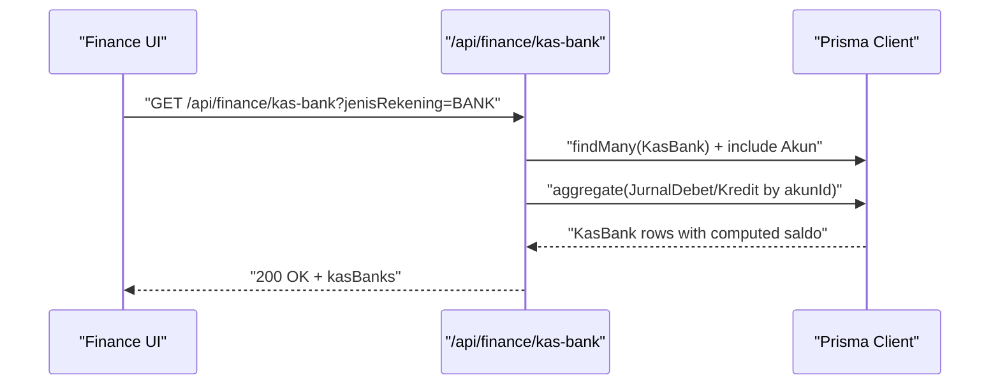
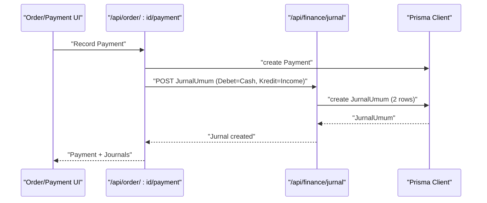
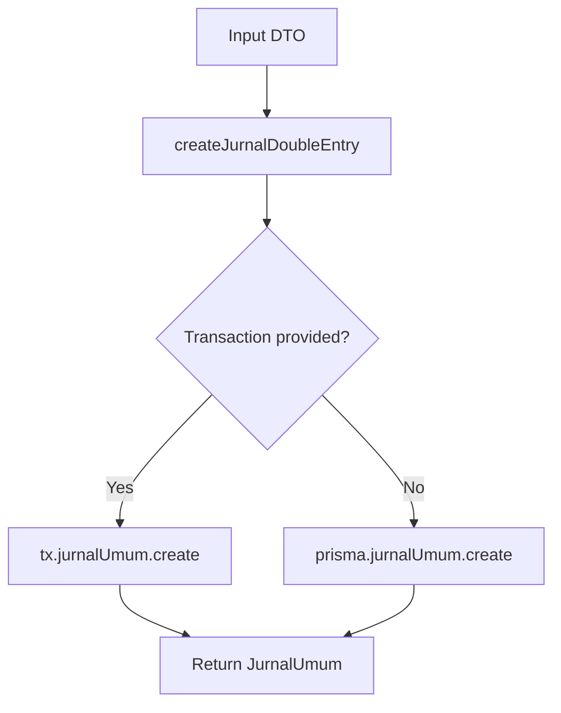
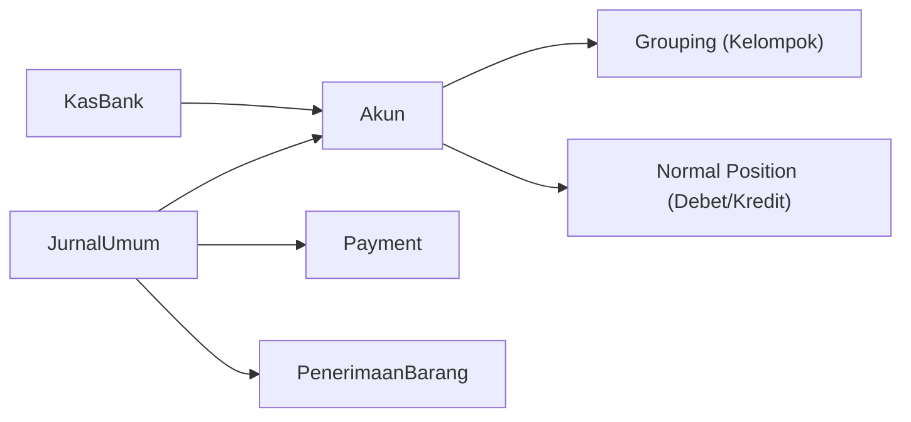
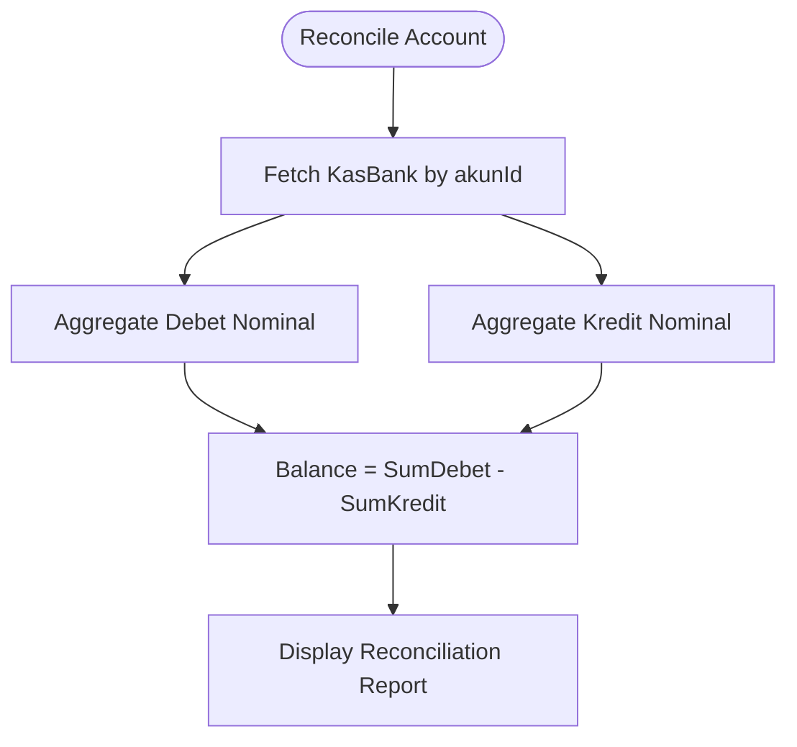
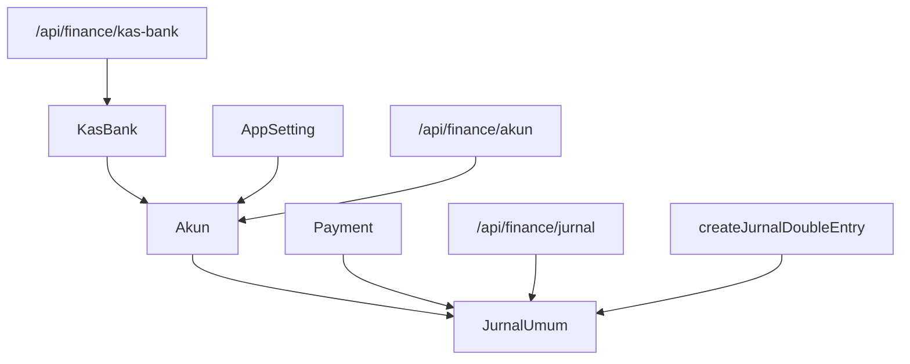

# Financial & Accounting Entities

<cite>
**Referenced Files in This Document**
- [schema.prisma](file://prisma/schema.prisma)
- [finance.ts](file://src/lib/finance.ts)
- [akun.route.ts](file://src/app/api/finance/akun/route.ts)
- [jurnal.route.ts](file://src/app/api/finance/jurnal/route.ts)
- [kas-bank.route.ts](file://src/app/api/finance/kas-bank/route.ts)
- [finance.test.ts](file://src/__tests__/finance.test.ts)
</cite>

## Table of Contents
1. [Introduction](#introduction)
2. [Project Structure](#project-structure)
3. [Core Components](#core-components)
4. [Architecture Overview](#architecture-overview)
5. [Detailed Component Analysis](#detailed-component-analysis)
6. [Dependency Analysis](#dependency-analysis)
7. [Performance Considerations](#performance-considerations)
8. [Troubleshooting Guide](#troubleshooting-guide)
9. [Conclusion](#conclusion)
10. [Appendices](#appendices)

## Introduction
This document explains the financial and accounting data models implemented in the system, focusing on:
- Chart of Accounts (Akun)
- Journal Entries (JurnalUmum)
- Bank/Cash Accounts (KasBank)
- Payment records (Payment)
- Multi-rekening support and default account configurations
- Automated journal entry generation, financial reporting relationships, and reconciliation processes

It also documents the accounting principles applied (double-entry), debit/credit rules, and how transactions propagate across entities.

## Project Structure
The financial domain is defined by Prisma models and supported by API routes and shared utilities:
- Data modeling: Prisma schema defines entities, relations, and enums
- Business logic: Utility functions encapsulate double-entry creation
- API layer: Routes enforce authorization, validation, and CRUD operations
- Tests: Finance tests validate accounting rules and workflows

**Diagram sources**
- [schema.prisma:425-503](file://prisma/schema.prisma#L425-L503)
- [finance.ts:26-54](file://src/lib/finance.ts#L26-L54)
- [akun.route.ts:27-179](file://src/app/api/finance/akun/route.ts#L27-L179)
- [kas-bank.route.ts:16-111](file://src/app/api/finance/kas-bank/route.ts#L16-L111)
- [jurnal.route.ts:16-168](file://src/app/api/finance/jurnal/route.ts#L16-L168)

**Section sources**
- [schema.prisma:425-503](file://prisma/schema.prisma#L425-L503)
- [finance.ts:26-54](file://src/lib/finance.ts#L26-L54)
- [akun.route.ts:27-179](file://src/app/api/finance/akun/route.ts#L27-L179)
- [kas-bank.route.ts:16-111](file://src/app/api/finance/kas-bank/route.ts#L16-L111)
- [jurnal.route.ts:16-168](file://src/app/api/finance/jurnal/route.ts#L16-L168)

## Core Components
- Akun (Chart of Accounts): Defines account codes, groupings, and normal position (debit or credit). Each account links to journal entries and optional bank/cash accounts.
- JurnalUmum (Journal): Central double-entry ledger recording debits, credits, amounts, references, and related entities (payments, receipts).
- KasBank (Bank/Cash Accounts): Represents operational bank and cash accounts linked to a ledger account (Akun) for balance reconciliation.
- Payment: Records incoming payments against orders; integrates with journals via double-entry.
- AppSetting: Stores system-wide defaults, including default income account for automated entries.

Key accounting principles:
- Double-entry: Every transaction affects at least two accounts with equal and opposite effects.
- Debit and Credit: Normal position per account determines whether increases are debits or credits.
- Multi-rekening: A single account can be linked to multiple operational bank/cash accounts.

**Section sources**
- [schema.prisma:425-503](file://prisma/schema.prisma#L425-L503)
- [finance.ts:26-54](file://src/lib/finance.ts#L26-L54)

## Architecture Overview
The financial architecture follows a layered pattern:
- Prisma models define the domain schema and referential integrity
- Utility functions encapsulate accounting-safe creation of journal entries
- API routes handle authorization, validation, and orchestrate transactions
- Frontend components consume these APIs to manage accounts, journals, and bank accounts

**Diagram sources**
- [jurnal.route.ts:84-125](file://src/app/api/finance/jurnal/route.ts#L84-L125)
- [finance.ts:26-54](file://src/lib/finance.ts#L26-L54)

## Detailed Component Analysis

### Akun (Chart of Accounts)
Akun defines the ledger structure:
- Unique account code and descriptive name
- Group classification (e.g., asset, liability, equity, revenue, expense)
- Normal position (debit or credit) determining increase effects
- Optional default income account linkage via AppSetting
- Relations to JurnalUmum (both debit and credit sides) and KasBank

Implementation highlights:
- Auto-generation of account codes by group prefix and incremental numbering
- Optional automatic creation of a corresponding KasBank record during account creation
- Synchronized updates to linked KasBank names when an account is renamed

**Diagram sources**
- [schema.prisma:425-503](file://prisma/schema.prisma#L425-L503)

**Section sources**
- [schema.prisma:425-446](file://prisma/schema.prisma#L425-L446)
- [akun.route.ts:62-135](file://src/app/api/finance/akun/route.ts#L62-L135)
- [akun.route.ts:137-179](file://src/app/api/finance/akun/route.ts#L137-L179)

### JurnalUmum (Journal Entries)
JurnalUmum is the central double-entry record:
- Each entry has a reference, date, narration, and amount
- Links to two Akun (debet and kredit) and supports optional associations to Payment and Receipt
- Supports soft deletion and cascading soft deletes to related entities

Accounting rules enforced:
- Debit and Credit accounts must differ
- Nominal must be a positive number
- Reference prefixes distinguish manual vs reversal entries

**Diagram sources**
- [jurnal.route.ts:84-125](file://src/app/api/finance/jurnal/route.ts#L84-L125)
- [finance.ts:26-54](file://src/lib/finance.ts#L26-L54)

**Section sources**
- [schema.prisma:452-480](file://prisma/schema.prisma#L452-L480)
- [jurnal.route.ts:16-82](file://src/app/api/finance/jurnal/route.ts#L16-L82)
- [jurnal.route.ts:84-125](file://src/app/api/finance/jurnal/route.ts#L84-L125)
- [finance.ts:26-54](file://src/lib/finance.ts#L26-L54)

### KasBank (Bank/Cash Accounts)
KasBank represents operational bank and cash accounts:
- Each record optionally links to a ledger Akun
- Supports filtering by account type (bank, cash, ewallet)
- On GET, computes current balance per account by aggregating debet and kredit totals from JurnalUmum

Multi-rekening support:
- One Akun can back multiple KasBank records (e.g., multiple bank accounts under the same ledger account)

**Diagram sources**
- [kas-bank.route.ts:16-81](file://src/app/api/finance/kas-bank/route.ts#L16-L81)

**Section sources**
- [schema.prisma:488-503](file://prisma/schema.prisma#L488-L503)
- [kas-bank.route.ts:16-111](file://src/app/api/finance/kas-bank/route.ts#L16-L111)

### Payment (Incoming Payments)
Payment records:
- Link to an order and user who recorded the payment
- Automatically generate two journal entries (double-entry) upon creation
- Associated with JurnalUmum entries for auditability

Integration with defaults:
- AppSetting holds a default income account ID used to automate posting when generating journals for payments

**Diagram sources**
- [schema.prisma:399-419](file://prisma/schema.prisma#L399-L419)
- [schema.prisma:569-597](file://prisma/schema.prisma#L569-L597)
- [jurnal.route.ts:84-125](file://src/app/api/finance/jurnal/route.ts#L84-L125)

**Section sources**
- [schema.prisma:399-419](file://prisma/schema.prisma#L399-L419)
- [schema.prisma:569-597](file://prisma/schema.prisma#L569-L597)
- [jurnal.route.ts:84-125](file://src/app/api/finance/jurnal/route.ts#L84-L125)

### Automated Journal Entry Generation
Automated creation of double-entry journals is centralized in a utility function:
- Accepts a typed input DTO with ref, date, narration, account IDs, amount, and optional associations
- Ensures safe decimal handling and optional fields
- Supports transactional persistence via Prisma or caller-provided transaction client

**Diagram sources**
- [finance.ts:26-54](file://src/lib/finance.ts#L26-L54)

**Section sources**
- [finance.ts:26-54](file://src/lib/finance.ts#L26-L54)

### Financial Statement Preparation and Reporting Relationships
Reporting leverages the double-entry foundation:
- JurnalUmum aggregates by account and date range for trial balance and income statement
- Akun grouping and normal position enable proper classification
- KasBank balances support cash flow reporting

**Diagram sources**
- [schema.prisma:425-480](file://prisma/schema.prisma#L425-L480)
- [schema.prisma:488-503](file://prisma/schema.prisma#L488-L503)

**Section sources**
- [schema.prisma:425-480](file://prisma/schema.prisma#L425-L480)
- [schema.prisma:488-503](file://prisma/schema.prisma#L488-L503)

### Account Reconciliation Processes
Reconciliation is supported by:
- KasBank listing with computed balances per account
- Aggregation of debet and kredit totals per account
- Filtering by account type and date ranges

**Diagram sources**
- [kas-bank.route.ts:38-71](file://src/app/api/finance/kas-bank/route.ts#L38-L71)

**Section sources**
- [kas-bank.route.ts:16-111](file://src/app/api/finance/kas-bank/route.ts#L16-L111)

## Dependency Analysis
- Akun is central: linked to JurnalUmum (both sides) and KasBank
- JurnalUmum depends on Akun for debet and kredit, and optionally on Payment and Receipt
- AppSetting references Akun for default income account
- API routes depend on Prisma for persistence and on the utility function for double-entry creation

**Diagram sources**
- [schema.prisma:425-503](file://prisma/schema.prisma#L425-L503)
- [akun.route.ts:27-179](file://src/app/api/finance/akun/route.ts#L27-L179)
- [kas-bank.route.ts:16-111](file://src/app/api/finance/kas-bank/route.ts#L16-L111)
- [jurnal.route.ts:16-168](file://src/app/api/finance/jurnal/route.ts#L16-L168)
- [finance.ts:26-54](file://src/lib/finance.ts#L26-L54)

**Section sources**
- [schema.prisma:425-503](file://prisma/schema.prisma#L425-L503)
- [akun.route.ts:27-179](file://src/app/api/finance/akun/route.ts#L27-L179)
- [kas-bank.route.ts:16-111](file://src/app/api/finance/kas-bank/route.ts#L16-L111)
- [jurnal.route.ts:16-168](file://src/app/api/finance/jurnal/route.ts#L16-L168)
- [finance.ts:26-54](file://src/lib/finance.ts#L26-L54)

## Performance Considerations
- Indexes on frequently filtered fields (e.g., tanggal, akunDebetId, akunKreditId, paymentId) improve query performance for journal listings and reconciliation
- Aggregations per account in KasBank GET should be cached or paginated for large datasets
- Soft delete cascades reduce accidental hard deletions but add transaction overhead; keep cascade logic minimal and explicit

## Troubleshooting Guide
Common issues and resolutions:
- Unauthorized or Forbidden access to finance endpoints: Verify user role and session
- Validation errors on journal creation: Ensure debet and kredit accounts differ and nominal is valid
- Duplicate account code: Use auto-generated codes or ensure uniqueness
- Reconciliation mismatch: Confirm date range filters and that deleted entries are excluded

**Section sources**
- [akun.route.ts:8-25](file://src/app/api/finance/akun/route.ts#L8-L25)
- [jurnal.route.ts:93-98](file://src/app/api/finance/jurnal/route.ts#L93-L98)
- [kas-bank.route.ts:16-25](file://src/app/api/finance/kas-bank/route.ts#L16-L25)

## Conclusion
The financial module implements a robust double-entry system grounded in Prisma models and enforced by API routes and a dedicated utility for journal creation. It supports multi-rekening, default account configurations, automated journal generation, and reconciliation-ready reporting through aggregated balances.

## Appendices

### Accounting Principles and Debit/Credit Rules
- Debit and Credit: Each transaction must have equal debits and credits
- Normal position: Increases to asset accounts are debits; increases to liability and equity accounts are credits
- Multi-rekening: Operational accounts (KasBank) can mirror a single ledger account for consolidated reporting

**Section sources**
- [schema.prisma:425-446](file://prisma/schema.prisma#L425-L446)
- [schema.prisma:556-563](file://prisma/schema.prisma#L556-L563)

### Example Workflows

#### Automated Journal Entry Generation
- Use the utility function to create a pair of JurnalUmum entries for a given transaction
- Ensure input DTO includes valid account IDs, amount, and reference

**Section sources**
- [finance.ts:26-54](file://src/lib/finance.ts#L26-L54)
- [jurnal.route.ts:84-125](file://src/app/api/finance/jurnal/route.ts#L84-L125)

#### Financial Statement Preparation
- Build trial balance by grouping JurnalUmum by Akun and summing debet/kredit
- Classify by Akun.kelompok and apply PosisiNormal to derive balances for income statement and balance sheet

**Section sources**
- [schema.prisma:425-480](file://prisma/schema.prisma#L425-L480)
- [schema.prisma:429-432](file://prisma/schema.prisma#L429-L432)

#### Account Reconciliation
- Compute per-account balances by aggregating nominal from JurnalUmum for debet and kredit
- Filter by date range and exclude deleted entries

**Section sources**
- [kas-bank.route.ts:38-71](file://src/app/api/finance/kas-bank/route.ts#L38-L71)

### Test Coverage
Finance tests validate:
- Double-entry creation rules
- Account code generation and uniqueness
- Journal validation and soft delete cascades

**Section sources**
- [finance.test.ts](file://src/__tests__/finance.test.ts)