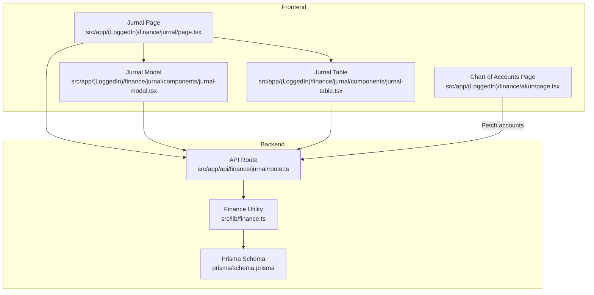
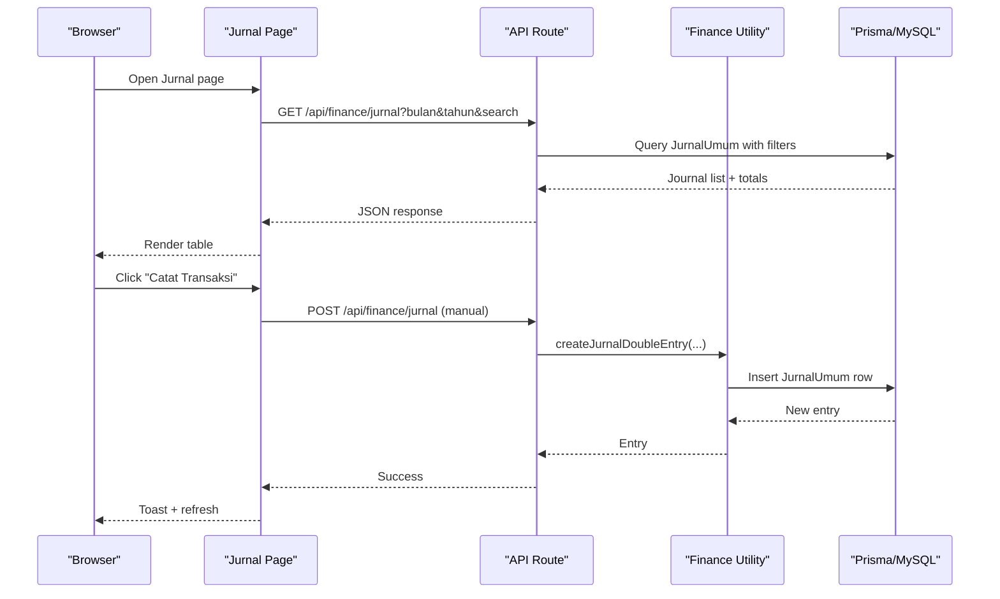
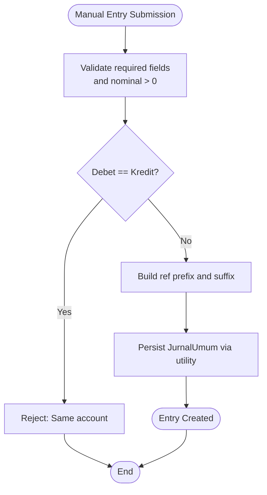
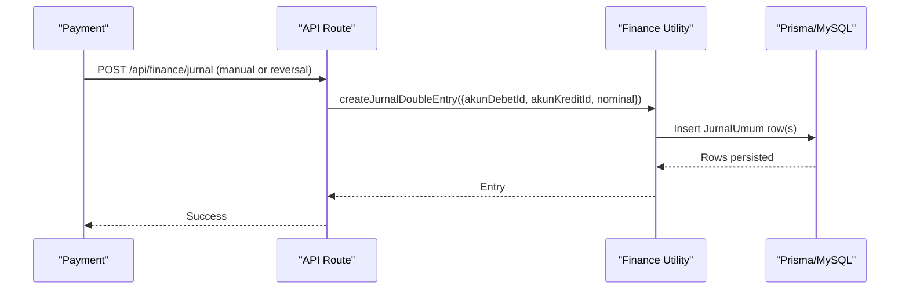
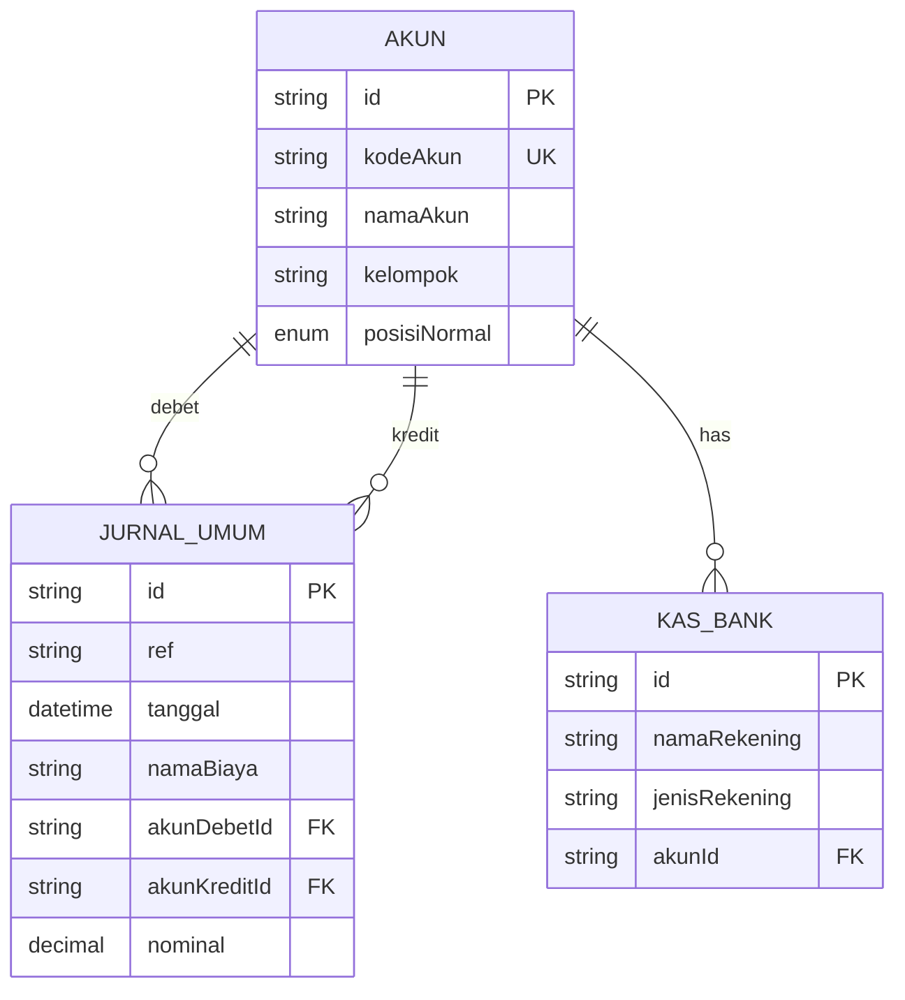
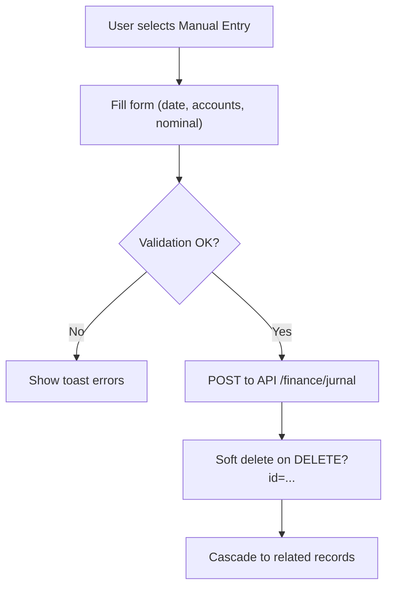
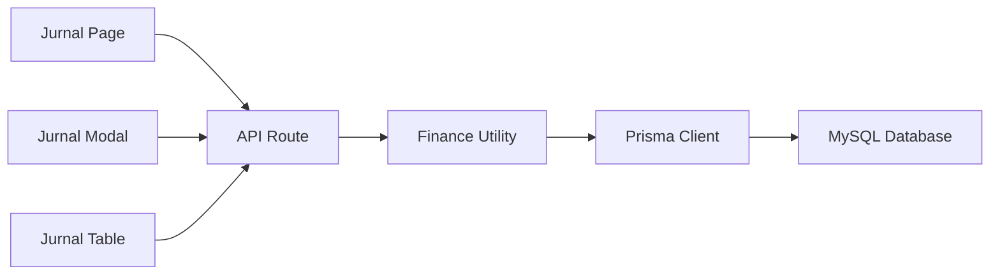

# Journal Entries (Jurnal Umum)

<cite>
**Referenced Files in This Document**
- [page.tsx](file://src/app/(LoggedIn)/finance/jurnal/page.tsx)
- [jurnal-modal.tsx](file://src/app/(LoggedIn)/finance/jurnal/components/jurnal-modal.tsx)
- [jurnal-table.tsx](file://src/app/(LoggedIn)/finance/jurnal/components/jurnal-table.tsx)
- [layout.tsx](file://src/app/(LoggedIn)/finance/jurnal/layout.tsx)
- [route.ts](file://src/app/api/finance/jurnal/route.ts)
- [schema.prisma](file://prisma/schema.prisma)
- [finance.ts](file://src/lib/finance.ts)
- [page.tsx](file://src/app/(LoggedIn)/finance/akun/page.tsx)
- [route.ts](file://src/app/api/finance/akun/route.ts)
- [page.tsx](file://src/app/(LoggedIn)/finance/dashboard/page.tsx)
</cite>

## Table of Contents
1. [Introduction](#introduction)
2. [Project Structure](#project-structure)
3. [Core Components](#core-components)
4. [Architecture Overview](#architecture-overview)
5. [Detailed Component Analysis](#detailed-component-analysis)
6. [Dependency Analysis](#dependency-analysis)
7. [Performance Considerations](#performance-considerations)
8. [Troubleshooting Guide](#troubleshooting-guide)
9. [Conclusion](#conclusion)
10. [Appendices](#appendices)

## Introduction
This document explains the Journal Entries (Jurnal Umum) system, focusing on how double-entry bookkeeping is implemented, how journal entries are automatically generated from financial events (such as payments and inventory receipts), and how journal entries relate to the Chart of Accounts. It also covers manual journal creation, editing and deletion processes, the reference numbering scheme, supporting documents (buktiNota), temporal organization by tanggal, validation rules, approval workflows, audit trails, and integration with financial reporting.

## Project Structure
The Jurnal Umum module is organized around a Next.js app router with a dedicated page, components, and an API route. The backend integrates with Prisma ORM and a MySQL database, and the frontend uses SWR for data fetching and Heroui components for UI.

**Diagram sources**
- [page.tsx](file://src/app/(LoggedIn)/finance/jurnal/page.tsx#L40-L155)
- [jurnal-modal.tsx](file://src/app/(LoggedIn)/finance/jurnal/components/jurnal-modal.tsx#L44-L503)
- [jurnal-table.tsx](file://src/app/(LoggedIn)/finance/jurnal/components/jurnal-table.tsx#L53-L225)
- [route.ts:16-169](file://src/app/api/finance/jurnal/route.ts#L16-L169)
- [finance.ts:26-54](file://src/lib/finance.ts#L26-L54)
- [schema.prisma:452-480](file://prisma/schema.prisma#L452-L480)
- [page.tsx](file://src/app/(LoggedIn)/finance/akun/page.tsx#L23-L248)

**Section sources**
- [page.tsx](file://src/app/(LoggedIn)/finance/jurnal/page.tsx#L40-L155)
- [jurnal-modal.tsx](file://src/app/(LoggedIn)/finance/jurnal/components/jurnal-modal.tsx#L44-L503)
- [jurnal-table.tsx](file://src/app/(LoggedIn)/finance/jurnal/components/jurnal-table.tsx#L53-L225)
- [route.ts:16-169](file://src/app/api/finance/jurnal/route.ts#L16-L169)
- [finance.ts:26-54](file://src/lib/finance.ts#L26-L54)
- [schema.prisma:452-480](file://prisma/schema.prisma#L452-L480)
- [page.tsx](file://src/app/(LoggedIn)/finance/akun/page.tsx#L23-L248)

## Core Components
- Jurnal Page: Provides filtering by month/year, search, and lists all journal entries with pagination hints. Supports deleting manual entries.
- Jurnal Modal: Allows manual journal entry creation with mode switching (expense/income), account selection, date and amount input, optional supporting document upload, and preview of double-entry mapping.
- Jurnal Table: Displays journal entries with ref, tanggal, keterangan, debet and kredit accounts, nominal, and action buttons. Shows linked supporting documents and related records.
- API Route: Implements GET (filtered listing), POST (manual entry or reversal), and DELETE (soft cascade to related records).
- Finance Utility: Encapsulates double-entry creation with normalized input and decimal handling.
- Prisma Schema: Defines JurnalUmum, Akun, KasBank, and related relations and indexes.

**Section sources**
- [page.tsx](file://src/app/(LoggedIn)/finance/jurnal/page.tsx#L40-L155)
- [jurnal-modal.tsx](file://src/app/(LoggedIn)/finance/jurnal/components/jurnal-modal.tsx#L44-L503)
- [jurnal-table.tsx](file://src/app/(LoggedIn)/finance/jurnal/components/jurnal-table.tsx#L53-L225)
- [route.ts:16-169](file://src/app/api/finance/jurnal/route.ts#L16-L169)
- [finance.ts:26-54](file://src/lib/finance.ts#L26-L54)
- [schema.prisma:425-480](file://prisma/schema.prisma#L425-L480)

## Architecture Overview
The system follows a clean separation between frontend UI and backend APIs. The API enforces access control, validates inputs, generates refs, and persists double-entry journal rows via a shared utility. The database schema ensures referential integrity and supports reporting queries.

**Diagram sources**
- [page.tsx](file://src/app/(LoggedIn)/finance/jurnal/page.tsx#L54-L57)
- [route.ts:16-82](file://src/app/api/finance/jurnal/route.ts#L16-L82)
- [route.ts:84-125](file://src/app/api/finance/jurnal/route.ts#L84-L125)
- [finance.ts:26-54](file://src/lib/finance.ts#L26-L54)
- [schema.prisma:452-480](file://prisma/schema.prisma#L452-L480)

## Detailed Component Analysis

### Double-Entry Bookkeeping Implementation
- Each journal entry records one debit and one credit account with equal nominal amounts.
- The utility function creates a single JurnalUmum row with akunDebetId and akunKreditId, ensuring debet = kredit in aggregate.
- Validation prevents identical debet and kredit accounts and requires positive nominal.

**Diagram sources**
- [jurnal-modal.tsx](file://src/app/(LoggedIn)/finance/jurnal/components/jurnal-modal.tsx#L145-L202)
- [route.ts:93-98](file://src/app/api/finance/jurnal/route.ts#L93-L98)
- [finance.ts:26-54](file://src/lib/finance.ts#L26-L54)

**Section sources**
- [jurnal-modal.tsx](file://src/app/(LoggedIn)/finance/jurnal/components/jurnal-modal.tsx#L84-L90)
- [route.ts:93-98](file://src/app/api/finance/jurnal/route.ts#L93-L98)
- [finance.ts:26-54](file://src/lib/finance.ts#L26-L54)

### Automatic Journal Generation from Financial Transactions
- Payments: One payment event produces two journal rows (debit cash account, credit income account) via the shared utility.
- Inventory Receipts: Purchase receipts link to JurnalUmum rows similarly.
- The API route for journal entries accepts a flag to indicate reversal entries and constructs refs accordingly.

**Diagram sources**
- [route.ts:84-125](file://src/app/api/finance/jurnal/route.ts#L84-L125)
- [finance.ts:26-54](file://src/lib/finance.ts#L26-L54)
- [schema.prisma:452-480](file://prisma/schema.prisma#L452-L480)

**Section sources**
- [route.ts:84-125](file://src/app/api/finance/jurnal/route.ts#L84-L125)
- [finance.ts:26-54](file://src/lib/finance.ts#L26-L54)

### Relationship Between Journal Entries and Chart of Accounts
- JurnalUmum relates to Akun via akunDebetId and akunKreditId.
- The accounts page allows administrators to manage account codes, groups (e.g., AKTIVA_LANCAR, BEBAN_USAHA, PENDAPATAN), and positions.
- KasBank links to Akun to represent cash/bank accounts.

**Diagram sources**
- [schema.prisma:425-480](file://prisma/schema.prisma#L425-L480)

**Section sources**
- [schema.prisma:425-480](file://prisma/schema.prisma#L425-L480)
- [page.tsx](file://src/app/(LoggedIn)/finance/akun/page.tsx#L23-L248)

### Journal Entry Creation, Editing, and Deletion
- Creation:
  - Manual: Jurnal Modal collects tanggal, keterangan, namaBiaya, buktiNota (optional), debet and kredit accounts, and nominal. On submit, the API route validates and persists via the utility.
  - Reversal: Optional flag and reference to the original entry are supported.
- Editing:
  - Not exposed in the current UI/API surface. Any corrections should be made via reversal entries.
- Deletion:
  - Only manual entries can be deleted. The API performs a soft delete on JurnalUmum and cascades to related records (e.g., Payment, PenerimaanBarang).

**Diagram sources**
- [jurnal-modal.tsx](file://src/app/(LoggedIn)/finance/jurnal/components/jurnal-modal.tsx#L145-L202)
- [route.ts:127-168](file://src/app/api/finance/jurnal/route.ts#L127-L168)

**Section sources**
- [jurnal-modal.tsx](file://src/app/(LoggedIn)/finance/jurnal/components/jurnal-modal.tsx#L145-L202)
- [route.ts:127-168](file://src/app/api/finance/jurnal/route.ts#L127-L168)

### Reference Numbering System (ref)
- Manual entries: ref begins with "J-MAN" plus a timestamp-based suffix.
- Reversal entries: ref begins with "J-REV" followed by the original ref.
- The API constructs refs based on the isReversal flag and optional reversalOfRef.

**Section sources**
- [route.ts:100-103](file://src/app/api/finance/jurnal/route.ts#L100-L103)

### Supporting Documents (buktiNota)
- For expense entries, users can optionally upload an image receipt. The modal handles upload via a separate endpoint and stores the URL in buktiNota.
- The table displays a link to view the receipt when present.

**Section sources**
- [jurnal-modal.tsx](file://src/app/(LoggedIn)/finance/jurnal/components/jurnal-modal.tsx#L110-L143)
- [jurnal-table.tsx](file://src/app/(LoggedIn)/finance/jurnal/components/jurnal-table.tsx#L131-L151)

### Temporal Organization by Tanggal
- Filtering by month and year is supported in the API and UI.
- The table sorts by tanggal descending and formats dates for display.

**Section sources**
- [page.tsx](file://src/app/(LoggedIn)/finance/jurnal/page.tsx#L50-L57)
- [route.ts:22-40](file://src/app/api/finance/jurnal/route.ts#L22-L40)
- [jurnal-table.tsx](file://src/app/(LoggedIn)/finance/jurnal/components/jurnal-table.tsx#L104-L112)

### Examples of Common Journal Entry Scenarios
- Expense (Pengeluaran): Debit BEBAN_USAHA account, Credit AKTIVA_LANCAR (Cash/Bank). Supports receipt upload.
- Income (Pemasukan): Debit AKTIVA_LANCAR (Cash/Bank), Credit PENDAPATAN account.
- Reversal: Create a reversal entry referencing the original ref.

**Section sources**
- [jurnal-modal.tsx](file://src/app/(LoggedIn)/finance/jurnal/components/jurnal-modal.tsx#L84-L90)
- [route.ts:100-103](file://src/app/api/finance/jurnal/route.ts#L100-L103)

### Manual Entry Creation Workflow
- Switch mode to expense or income.
- Select source/target cash account and category account.
- Enter tanggal, nominal, and optional keterangan.
- Optionally attach buktiNota.
- Submit to persist the double-entry.

**Section sources**
- [jurnal-modal.tsx](file://src/app/(LoggedIn)/finance/jurnal/components/jurnal-modal.tsx#L232-L284)
- [jurnal-modal.tsx](file://src/app/(LoggedIn)/finance/jurnal/components/jurnal-modal.tsx#L322-L378)
- [jurnal-modal.tsx](file://src/app/(LoggedIn)/finance/jurnal/components/jurnal-modal.tsx#L145-L202)

### Journal Entry Validation Rules
- Required fields: tanggal, namaBiaya, akunDebetId, akunKreditId, nominal > 0.
- Debet and Kredit must differ.
- File uploads are restricted to images for expense receipts.

**Section sources**
- [route.ts:93-98](file://src/app/api/finance/jurnal/route.ts#L93-L98)
- [jurnal-modal.tsx](file://src/app/(LoggedIn)/finance/jurnal/components/jurnal-modal.tsx#L147-L162)
- [jurnal-modal.tsx](file://src/app/(LoggedIn)/finance/jurnal/components/jurnal-modal.tsx#L114-L117)

### Approval Workflows and Audit Trails
- Access control: Only admin and kasir roles can access journal endpoints.
- Audit trail: Created by user ID is stored; soft deletes preserve history with deletedAt timestamps.

**Section sources**
- [route.ts:8-14](file://src/app/api/finance/jurnal/route.ts#L8-L14)
- [schema.prisma:464-466](file://prisma/schema.prisma#L464-L466)

### Integration with Financial Reporting Systems
- The dashboard page consumes financial data and aggregates income vs. operational expenses, demonstrating how journals feed higher-level reporting.
- The chart of accounts page manages account groups and codes that align with reporting needs.

**Section sources**
- [page.tsx](file://src/app/(LoggedIn)/finance/dashboard/page.tsx#L248-L256)
- [page.tsx](file://src/app/(LoggedIn)/finance/akun/page.tsx#L23-L248)

## Dependency Analysis
- Frontend depends on:
  - SWR for data fetching.
  - Heroui components for forms and tables.
  - Localized date handling for tanggal.
- Backend depends on:
  - Authentication middleware for access control.
  - Prisma for database operations.
  - Shared utility for double-entry creation.

**Diagram sources**
- [page.tsx](file://src/app/(LoggedIn)/finance/jurnal/page.tsx#L54-L57)
- [route.ts:16-169](file://src/app/api/finance/jurnal/route.ts#L16-L169)
- [finance.ts:26-54](file://src/lib/finance.ts#L26-L54)
- [schema.prisma:452-480](file://prisma/schema.prisma#L452-L480)

**Section sources**
- [page.tsx](file://src/app/(LoggedIn)/finance/jurnal/page.tsx#L54-L57)
- [route.ts:16-169](file://src/app/api/finance/jurnal/route.ts#L16-L169)
- [finance.ts:26-54](file://src/lib/finance.ts#L26-L54)
- [schema.prisma:452-480](file://prisma/schema.prisma#L452-L480)

## Performance Considerations
- Pagination and limits: The API enforces a default limit for listing journals to avoid heavy loads.
- Indexes: JurnalUmum has indexes on tanggal, akunDebetId, akunKreditId, and paymentId/penerimaanId to optimize queries.
- Filtering: Search and date range filters reduce result sets efficiently.

**Section sources**
- [route.ts:27-50](file://src/app/api/finance/jurnal/route.ts#L27-L50)
- [schema.prisma:475-479](file://prisma/schema.prisma#L475-L479)

## Troubleshooting Guide
- Unauthorized or Forbidden: Ensure the user role is admin or kasir.
- Validation errors: Confirm required fields are filled, nominal is positive, and debet/kredit are different.
- Upload failures: Verify image file type and size constraints.
- Deletion issues: Only manual entries can be deleted; the API will cascade to related records.

**Section sources**
- [route.ts:8-14](file://src/app/api/finance/jurnal/route.ts#L8-L14)
- [route.ts:93-98](file://src/app/api/finance/jurnal/route.ts#L93-L98)
- [jurnal-modal.tsx](file://src/app/(LoggedIn)/finance/jurnal/components/jurnal-modal.tsx#L114-L117)
- [route.ts:127-168](file://src/app/api/finance/jurnal/route.ts#L127-L168)

## Conclusion
The Jurnal Umum module implements robust double-entry bookkeeping with clear separation of concerns between UI, API, and persistence. It supports automatic generation from financial events, manual entry with validations, soft deletion with cascading, and integrates with charts of accounts and reporting dashboards. Access control and audit trails ensure secure and traceable accounting operations.

## Appendices

### API Endpoints Summary
- GET /api/finance/jurnal?bulan&tahun&search&limit
  - Filters by month/year and free-text search; returns list with totals.
- POST /api/finance/jurnal
  - Creates manual or reversal entries with validated inputs and ref generation.
- DELETE /api/finance/jurnal?id=...
  - Soft deletes manual entries and cascades to related records.

**Section sources**
- [route.ts:16-169](file://src/app/api/finance/jurnal/route.ts#L16-L169)