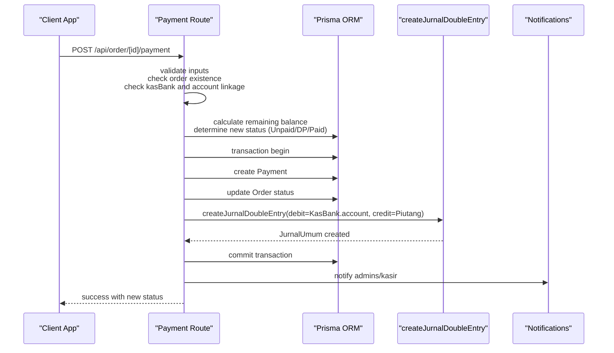
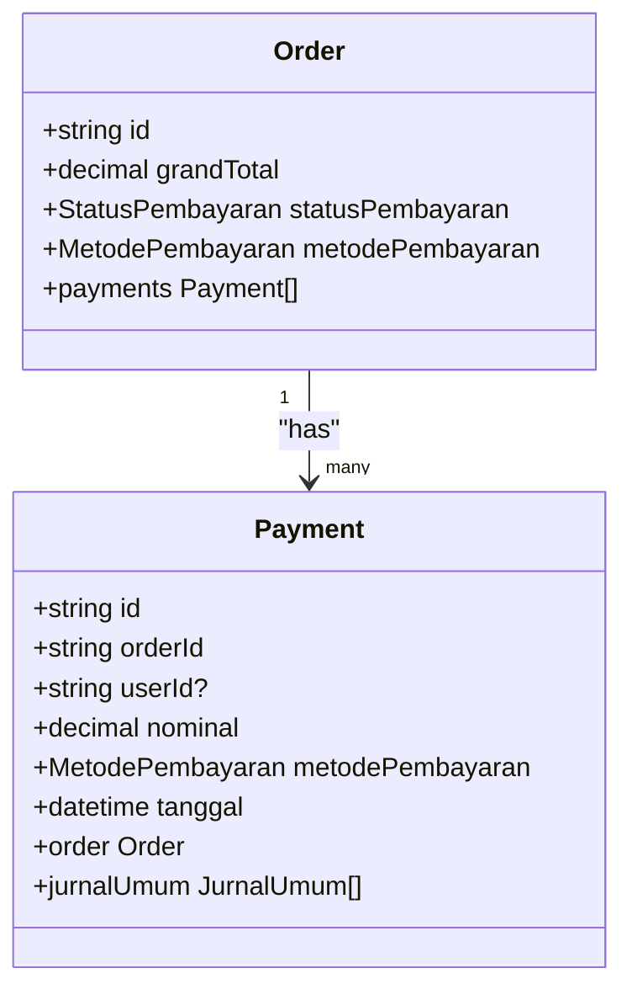
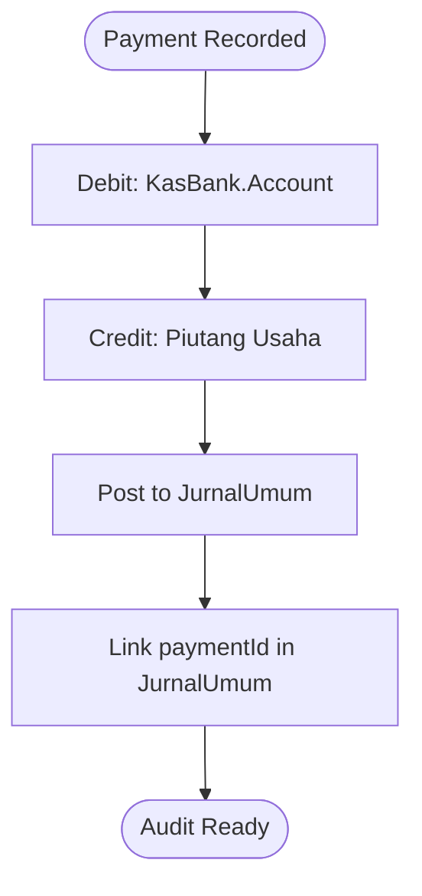
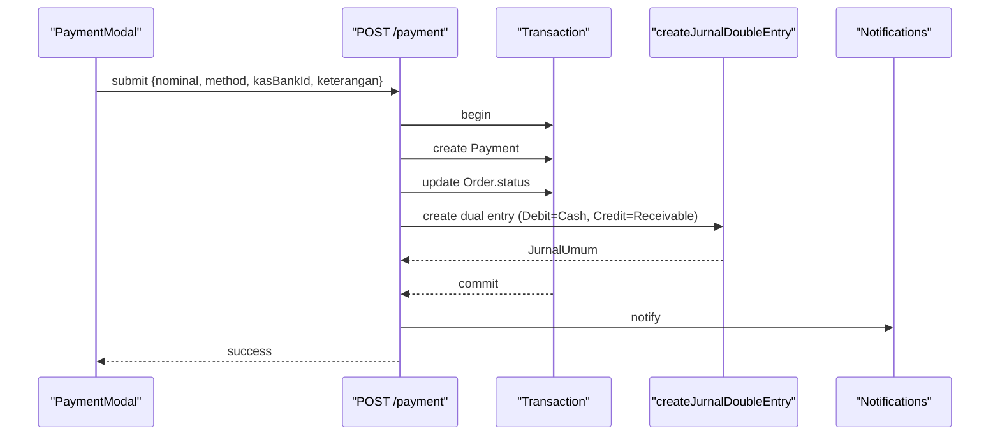
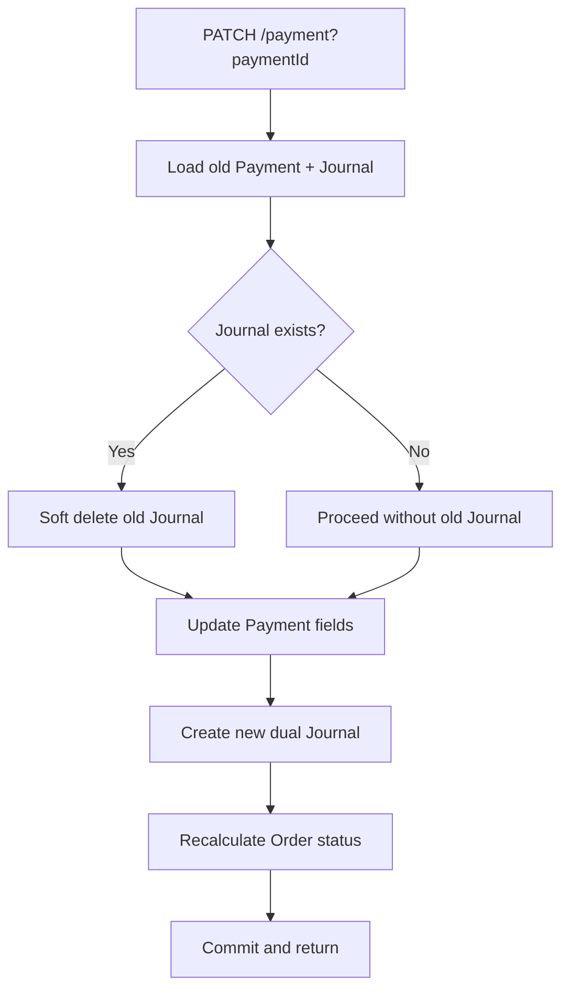
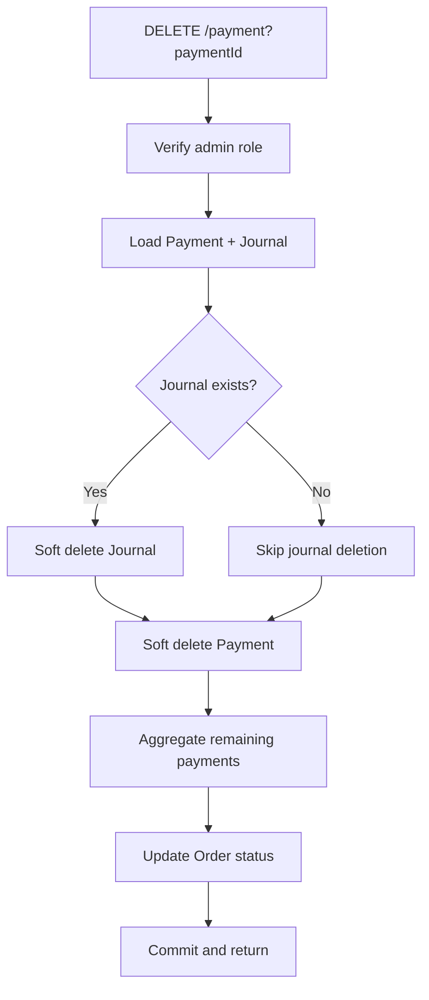
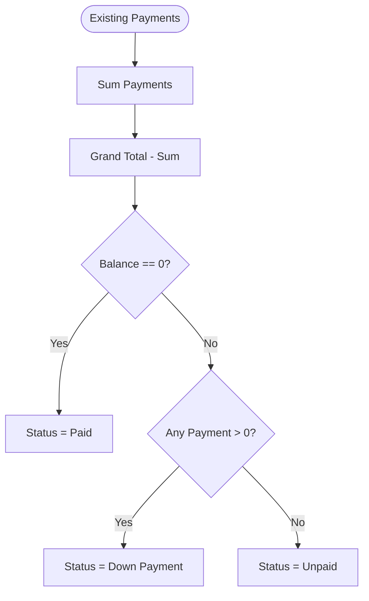
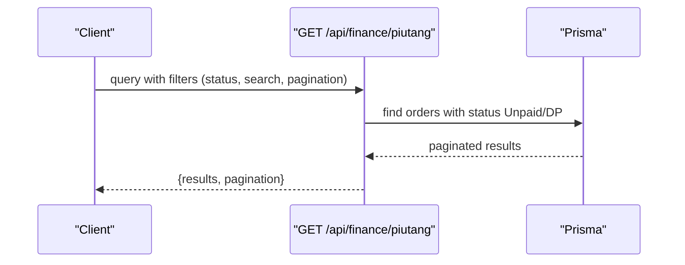
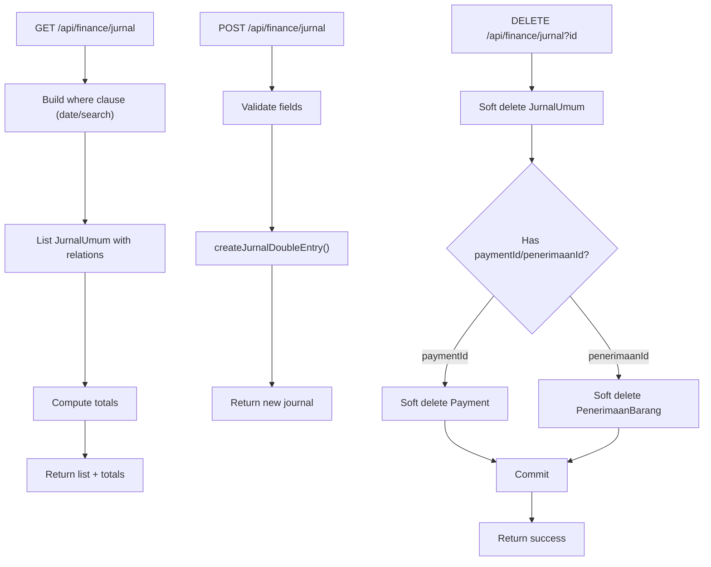
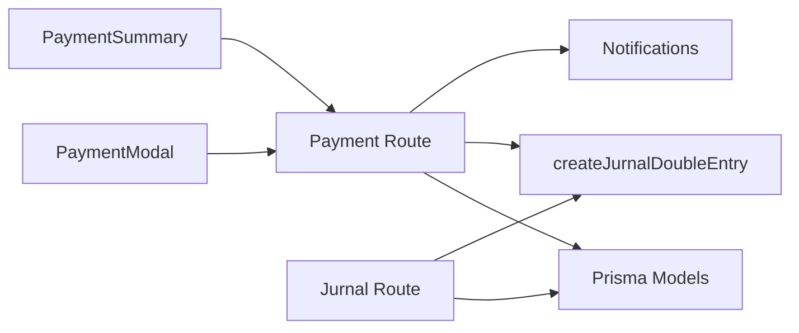

# Payment Processing & Records

<cite>
**Referenced Files in This Document**
- [schema.prisma](file://prisma/schema.prisma)
- [route.ts](file://src/app/api/order/[id]/payment/route.ts)
- [route.ts](file://src/app/api/finance/jurnal/route.ts)
- [finance.ts](file://src/lib/finance.ts)
- [payment-modal.tsx](file://src/app/(LoggedIn)/order/[id]/components/payment-modal.tsx)
- [payment-summary.tsx](file://src/app/(LoggedIn)/order/[id]/components/payment-summary.tsx)
- [route.ts](file://src/app/api/finance/piutang/route.ts)
- [05-pembayaran-order.mmd](file://diagram/sequence/05-pembayaran-order.mmd)
</cite>

## Table of Contents
1. [Introduction](#introduction)
2. [Project Structure](#project-structure)
3. [Core Components](#core-components)
4. [Architecture Overview](#architecture-overview)
5. [Detailed Component Analysis](#detailed-component-analysis)
6. [Dependency Analysis](#dependency-analysis)
7. [Performance Considerations](#performance-considerations)
8. [Troubleshooting Guide](#troubleshooting-guide)
9. [Conclusion](#conclusion)
10. [Appendices](#appendices)

## Introduction
This document explains the payment processing and records management system, focusing on how payments integrate with orders and journal entries, automatic dual journal entry generation (debit/credit), and payment method categorization (Cash, Transfer, QRIS, Credit). It documents payment recording, modification, and deletion workflows, reconciliation and refund procedures, payment history tracking, partial payments, and integration with cash/bank accounts. It also covers validation, security considerations, and reporting capabilities for receivables management.

## Project Structure
The payment system spans database models, backend API routes, shared finance utilities, and frontend components:
- Database models define Orders, Payments, Journal, Accounts, and Cash/Bank Rekening.
- Backend routes handle payment CRUD operations and journal queries.
- Finance utilities encapsulate double-entry journal creation.
- Frontend components render payment summaries, capture inputs, and trigger API calls.

```mermaid
graph TB
subgraph "Database Models"
Order["Order"]
Payment["Payment"]
Jurnal["JurnalUmum"]
Akun["Akun"]
KasBank["KasBank"]
end
subgraph "Backend APIs"
PayRoute["/api/order/[id]/payment"]
JurnalRoute["/api/finance/jurnal"]
PiutangRoute["/api/finance/piutang"]
end
subgraph "Finance Utility"
FinanceLib["createJurnalDoubleEntry()"]
end
subgraph "Frontend"
PaymentSummary["PaymentSummary"]
PaymentModal["PaymentModal"]
end
Payment --> Jurnal
Order <- --> Payment
KasBank --> Akun
PayRoute --> FinanceLib
FinanceLib --> Jurnal
PaymentSummary --> PayRoute
PaymentModal --> PayRoute
PiutangRoute --> Order
PiutangRoute --> Payment
```

**Diagram sources**
- [schema.prisma](file://prisma/schema.prisma)
- [route.ts](file://src/app/api/order/[id]/payment/route.ts)
- [route.ts](file://src/app/api/finance/jurnal/route.ts)
- [finance.ts](file://src/lib/finance.ts)
- [payment-summary.tsx](file://src/app/(LoggedIn)/order/[id]/components/payment-summary.tsx)
- [payment-modal.tsx](file://src/app/(LoggedIn)/order/[id]/components/payment-modal.tsx)
- [route.ts](file://src/app/api/finance/piutang/route.ts)

**Section sources**
- [schema.prisma](file://prisma/schema.prisma)
- [route.ts](file://src/app/api/order/[id]/payment/route.ts)
- [route.ts](file://src/app/api/finance/jurnal/route.ts)
- [finance.ts](file://src/lib/finance.ts)
- [payment-summary.tsx](file://src/app/(LoggedIn)/order/[id]/components/payment-summary.tsx)
- [payment-modal.tsx](file://src/app/(LoggedIn)/order/[id]/components/payment-modal.tsx)
- [route.ts](file://src/app/api/finance/piutang/route.ts)

## Core Components
- Payment model: Stores payment details linked to an order, user, method, and timestamp, with a relation to journal entries.
- Order model: Tracks order totals, payment status, and payment method defaults.
- Journal model: Central double-entry ledger capturing debits/credits against chart-of-account heads.
- Cash/Bank model: Holds bank/cash/e-wallet accounts mapped to ledger accounts.
- Finance utility: Provides a single function to create balanced debit/credit journal entries.
- API routes: Implement payment recording, correction, deletion, and journal listing/reversal.
- Frontend components: Render payment summaries, capture payment inputs, and submit to the backend.

Key enums and statuses:
- Payment methods: Cash, Transfer, QRIS, Credit, Other.
- Payment statuses: Unpaid, Down Payment, Paid, Refund.
- Production statuses exclude finished/cancelled orders from receivable reporting.

**Section sources**
- [schema.prisma](file://prisma/schema.prisma)
- [route.ts](file://src/app/api/order/[id]/payment/route.ts)
- [finance.ts](file://src/lib/finance.ts)
- [payment-summary.tsx](file://src/app/(LoggedIn)/order/[id]/components/payment-summary.tsx)
- [payment-modal.tsx](file://src/app/(LoggedIn)/order/[id]/components/payment-modal.tsx)
- [route.ts](file://src/app/api/finance/piutang/route.ts)

## Architecture Overview
Payments are recorded as cash receipts against receivable accounts, automatically generating dual journal entries. The process ensures atomicity and referential integrity across payment and journal records.



**Diagram sources**
- [route.ts](file://src/app/api/order/[id]/payment/route.ts)
- [finance.ts](file://src/lib/finance.ts)
- [05-pembayaran-order.mmd](file://diagram/sequence/05-pembayaran-order.mmd)

**Section sources**
- [route.ts](file://src/app/api/order/[id]/payment/route.ts)
- [finance.ts](file://src/lib/finance.ts)

## Detailed Component Analysis

### Payment Model and Order Integration
- Each Payment belongs to an Order and optionally to a User who recorded it.
- Payments are linked to journal entries, enabling full auditability.
- Order status is recalculated based on aggregated payments:
  - Zero paid → Unpaid
  - Paid > 0 and < Grand Total → Down Payment
  - Paid ≥ Grand Total → Paid



**Diagram sources**
- [schema.prisma](file://prisma/schema.prisma)

**Section sources**
- [schema.prisma](file://prisma/schema.prisma)
- [route.ts](file://src/app/api/order/[id]/payment/route.ts)

### Journal Entries and Dual Entry Mapping
- Every payment creates two journal rows (debit and credit) via a shared utility.
- Debit account comes from the selected Cash/Bank account’s linked ledger account.
- Credit account is the Receivable account (Piutang Usaha).
- Journal entries reference the Payment ID for traceability.



**Diagram sources**
- [finance.ts](file://src/lib/finance.ts)
- [route.ts](file://src/app/api/order/[id]/payment/route.ts)
- [schema.prisma](file://prisma/schema.prisma)

**Section sources**
- [finance.ts](file://src/lib/finance.ts)
- [route.ts](file://src/app/api/order/[id]/payment/route.ts)

### Payment Recording Workflow
- Validation:
  - Nominal > 0
  - Target Cash/Bank account exists and has a ledger account
  - Nominal does not exceed remaining balance
- Transaction:
  - Create Payment
  - Update Order status
  - Create dual journal entries
- Notifications:
  - Inform admins and cashiers upon successful payment



**Diagram sources**
- [payment-modal.tsx](file://src/app/(LoggedIn)/order/[id]/components/payment-modal.tsx)
- [route.ts](file://src/app/api/order/[id]/payment/route.ts)
- [finance.ts](file://src/lib/finance.ts)

**Section sources**
- [payment-modal.tsx](file://src/app/(LoggedIn)/order/[id]/components/payment-modal.tsx)
- [route.ts](file://src/app/api/order/[id]/payment/route.ts)

### Payment Modification (Correction)
- Allowed for authorized users; requires paymentId.
- Soft-deletes prior journal entry and creates corrected entries.
- Recalculates order status based on current payments.



**Diagram sources**
- [route.ts](file://src/app/api/order/[id]/payment/route.ts)
- [finance.ts](file://src/lib/finance.ts)

**Section sources**
- [route.ts](file://src/app/api/order/[id]/payment/route.ts)

### Payment Deletion (Admin Only)
- Admins can soft-delete a payment and its associated journal.
- Recalculates order status after deletion.



**Diagram sources**
- [route.ts](file://src/app/api/order/[id]/payment/route.ts)

**Section sources**
- [route.ts](file://src/app/api/order/[id]/payment/route.ts)

### Partial Payments and Status Management
- Partial payments update order status to Down Payment.
- Remaining balance is computed as Grand Total minus total payments.
- UI reflects remaining amount and allows further partial payments until Paid.



**Diagram sources**
- [route.ts](file://src/app/api/order/[id]/payment/route.ts)
- [payment-summary.tsx](file://src/app/(LoggedIn)/order/[id]/components/payment-summary.tsx)

**Section sources**
- [route.ts](file://src/app/api/order/[id]/payment/route.ts)
- [payment-summary.tsx](file://src/app/(LoggedIn)/order/[id]/components/payment-summary.tsx)

### Receivables Reporting
- Receivables report lists unpaid and down-payment orders.
- Filters by status (Unpaid/Down Payment) and supports search by order/customer.
- Excludes finished or cancelled production orders.



**Diagram sources**
- [route.ts](file://src/app/api/finance/piutang/route.ts)

**Section sources**
- [route.ts](file://src/app/api/finance/piutang/route.ts)

### Journal Listing and Reversal
- Journal listing supports date range, free-text search, and limits.
- Manual journals can be posted with reversal support.
- Deleting a manual journal triggers cascading soft deletes to related records.



**Diagram sources**
- [route.ts](file://src/app/api/finance/jurnal/route.ts)
- [finance.ts](file://src/lib/finance.ts)

**Section sources**
- [route.ts](file://src/app/api/finance/jurnal/route.ts)
- [finance.ts](file://src/lib/finance.ts)

## Dependency Analysis
- Payment route depends on:
  - Prisma models for Order, Payment, Journal, Account, and Cash/Bank
  - Finance utility for creating balanced journal entries
  - Notification service for payment events
- Journal route depends on:
  - Prisma models for Journal, Payment, and PenerimaanBarang
  - Finance utility for posting manual journals
- Frontend components depend on:
  - Payment route for listing and submitting payments
  - Cash/Bank endpoint for account selection



**Diagram sources**
- [route.ts](file://src/app/api/order/[id]/payment/route.ts)
- [route.ts](file://src/app/api/finance/jurnal/route.ts)
- [finance.ts](file://src/lib/finance.ts)
- [payment-modal.tsx](file://src/app/(LoggedIn)/order/[id]/components/payment-modal.tsx)
- [payment-summary.tsx](file://src/app/(LoggedIn)/order/[id]/components/payment-summary.tsx)

**Section sources**
- [route.ts](file://src/app/api/order/[id]/payment/route.ts)
- [route.ts](file://src/app/api/finance/jurnal/route.ts)
- [finance.ts](file://src/lib/finance.ts)
- [payment-modal.tsx](file://src/app/(LoggedIn)/order/[id]/components/payment-modal.tsx)
- [payment-summary.tsx](file://src/app/(LoggedIn)/order/[id]/components/payment-summary.tsx)

## Performance Considerations
- Use transactions for payment creation and updates to maintain consistency.
- Indexes on Order.statusPembayaran, Payment.orderId, and Journal dates improve query performance.
- Journal listing supports pagination and date-range filtering to avoid large result sets.
- Frontend uses SWR for efficient caching and incremental updates of payment history.

## Troubleshooting Guide
Common issues and resolutions:
- Unauthorized or Forbidden:
  - Ensure user role is admin or kasir for payment operations.
- Payment not found or already deleted:
  - Verify paymentId and order association; soft-deleted records are excluded from normal queries.
- Invalid Cash/Bank selection:
  - Confirm the selected account has a ledger account linked.
- Nominal exceeds remaining balance:
  - Adjust payment amount to match remaining charge.
- Journal mismatch after correction:
  - Ensure correction soft-deletes the old journal before posting a new one.

**Section sources**
- [route.ts](file://src/app/api/order/[id]/payment/route.ts)
- [route.ts](file://src/app/api/finance/jurnal/route.ts)

## Conclusion
The payment system integrates tightly with orders and journals, ensuring accurate receivables tracking and full auditability. It supports partial payments, corrections, deletions, and robust reporting for receivables. The design leverages dual-entry bookkeeping, strict validations, and role-based access to maintain financial integrity.

## Appendices

### Payment Method Categories
- Cash (TUNAI)
- Bank Transfer (TRANSFER)
- QRIS
- Credit
- Other (LAINNYA)

These categories are stored in the payment method enum and surfaced in UI and reports.

**Section sources**
- [schema.prisma](file://prisma/schema.prisma)

### Security Considerations
- Role gating: Only admin and kasir roles can create, modify, or delete payments.
- Soft deletes: Payment and journal records are soft-deleted to preserve audit trails.
- Transactional integrity: All payment changes occur within a single transaction.

**Section sources**
- [route.ts](file://src/app/api/order/[id]/payment/route.ts)
- [route.ts](file://src/app/api/finance/jurnal/route.ts)