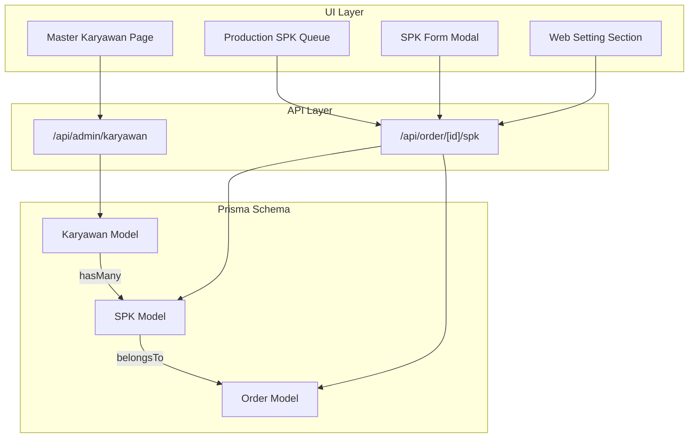
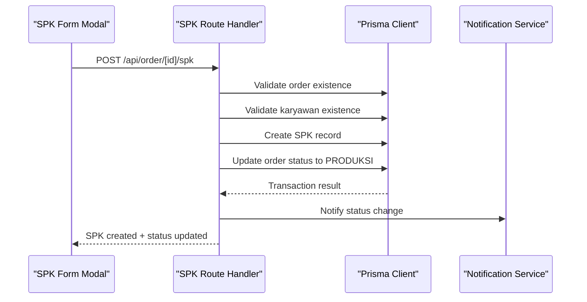
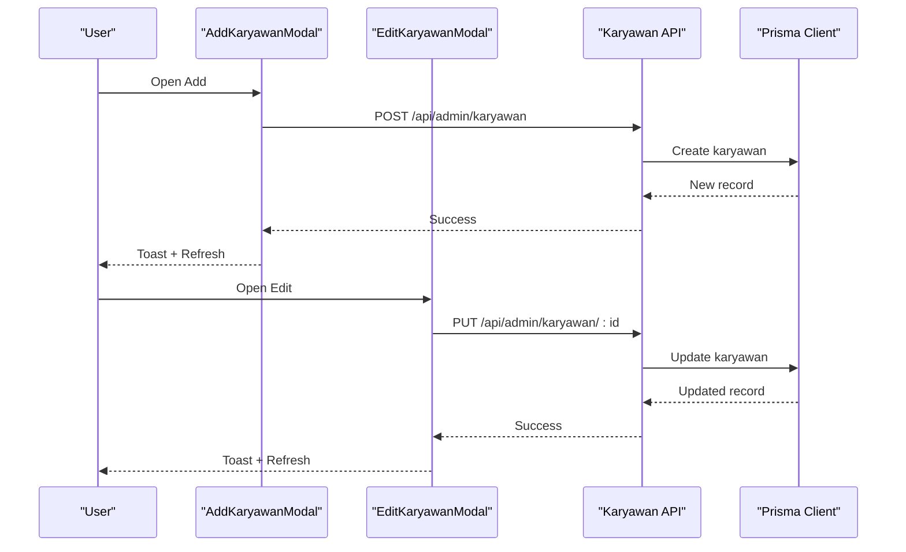
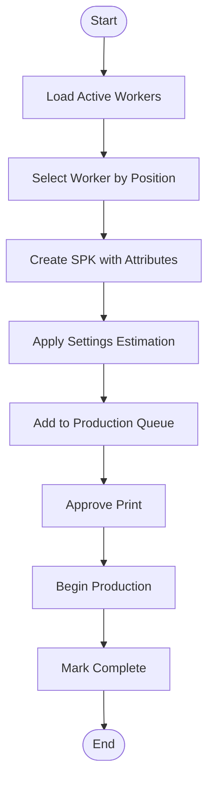
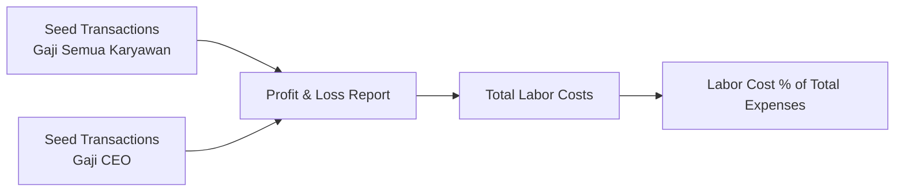
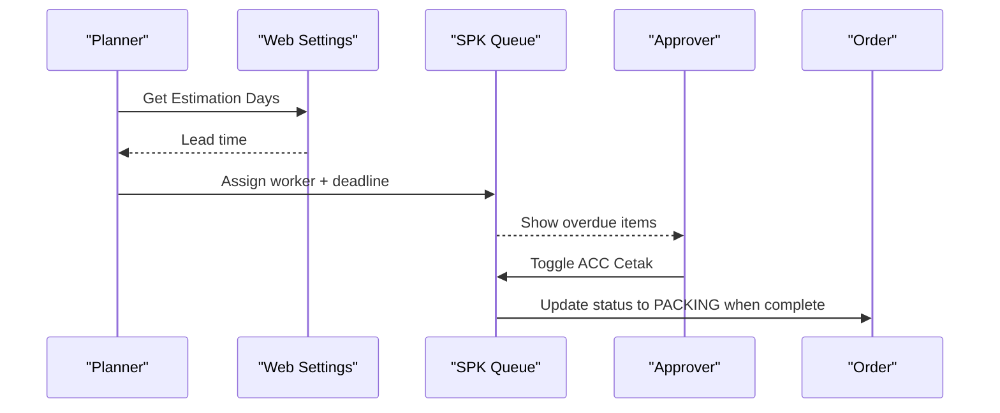
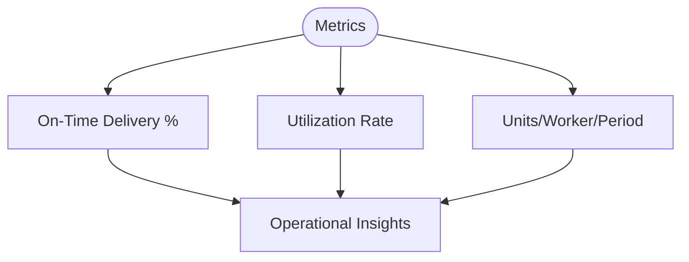
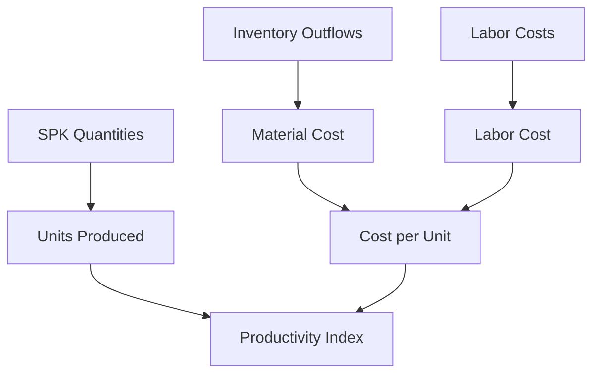
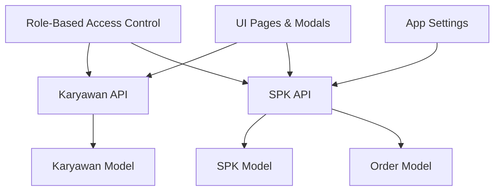
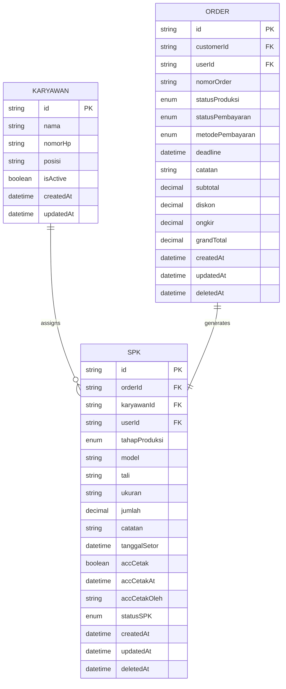

# Employee & Labor Management

<cite>
**Referenced Files in This Document**
- [schema.prisma](file://prisma/schema.prisma)
- [types.ts](file://src/types/types.ts)
- [route.ts](file://src/app/api/admin/karyawan/route.ts)
- [page.tsx](file://src/app/(LoggedIn)/master/karyawan/page.tsx)
- [add-karyawan-modal.tsx](file://src/app/(LoggedIn)/master/karyawan/components/add-karyawan-modal.tsx)
- [edit-karyawan-modal.tsx](file://src/app/(LoggedIn)/master/karyawan/components/edit-karyawan-modal.tsx)
- [route.ts](file://src/app/api/order/[id]/spk/route.ts)
- [spk-form-modal.tsx](file://src/app/(LoggedIn)/order/[id]/components/spk-form-modal.tsx)
- [spk-card.tsx](file://src/app/(LoggedIn)/order/[id]/components/spk-card.tsx)
- [page.tsx](file://src/app/(LoggedIn)/production/spk/page.tsx)
- [spk-queue-card.tsx](file://src/app/(LoggedIn)/production/spk/components/spk-queue-card.tsx)
- [web-setting-section.tsx](file://src/app/(LoggedIn)/settings/web-setting/web-setting-section.tsx)
- [design-order-card.tsx](file://src/app/(LoggedIn)/production/design-queue/components/design-order-card.tsx)
- [page.tsx](file://src/app/(LoggedIn)/inventory/out/page.tsx)
- [page.tsx](file://src/app/(LoggedIn)/finance/dashboard/page.tsx)
- [seed-transactions.ts](file://prisma/seed-transactions.ts)
- [part3-produksi-inventori.plantuml](file://diagram/class/part3-produksi-inventori.plantuml)
</cite>

## Table of Contents
1. [Introduction](#introduction)
2. [Project Structure](#project-structure)
3. [Core Components](#core-components)
4. [Architecture Overview](#architecture-overview)
5. [Detailed Component Analysis](#detailed-component-analysis)
6. [Dependency Analysis](#dependency-analysis)
7. [Performance Considerations](#performance-considerations)
8. [Troubleshooting Guide](#troubleshooting-guide)
9. [Conclusion](#conclusion)
10. [Appendices](#appendices)

## Introduction
This document explains the employee management system within the POS application, focusing on the Karyawan entity, labor tracking, production assignments, and workforce optimization. It covers employee registration processes, skill classification systems, production capacity calculations, labor cost tracking methodologies, performance metrics, production efficiency monitoring, shift scheduling integration, and labor resource allocation strategies. Practical examples include employee skill mapping, production team formation, and labor productivity analytics.

## Project Structure
The system is organized around:
- Prisma schema defining the Karyawan entity and its relationships to SPK and Order
- API routes for managing employees and creating production work orders (SPK)
- Frontend pages and modals for employee CRUD and SPK creation
- Settings for production preferences affecting deadlines and numbering
- Inventory and finance integrations for material consumption and cost tracking

**Diagram sources**
- [schema.prisma](file://prisma/schema.prisma)
- [route.ts](file://src/app/api/admin/karyawan/route.ts)
- [route.ts](file://src/app/api/order/[id]/spk/route.ts)
- [page.tsx](file://src/app/(LoggedIn)/master/karyawan/page.tsx)
- [page.tsx](file://src/app/(LoggedIn)/production/spk/page.tsx)
- [spk-form-modal.tsx](file://src/app/(LoggedIn)/order/[id]/components/spk-form-modal.tsx)
- [web-setting-section.tsx](file://src/app/(LoggedIn)/settings/web-setting/web-setting-section.tsx)

**Section sources**
- [schema.prisma](file://prisma/schema.prisma)
- [route.ts](file://src/app/api/admin/karyawan/route.ts)
- [route.ts](file://src/app/api/order/[id]/spk/route.ts)
- [page.tsx](file://src/app/(LoggedIn)/master/karyawan/page.tsx)
- [page.tsx](file://src/app/(LoggedIn)/production/spk/page.tsx)
- [spk-form-modal.tsx](file://src/app/(LoggedIn)/order/[id]/components/spk-form-modal.tsx)
- [web-setting-section.tsx](file://src/app/(LoggedIn)/settings/web-setting/web-setting-section.tsx)

## Core Components
- Karyawan entity: Stores employee identity, contact, position, and active status. Used to assign production work.
- SPK (Work Order): Links an Order to a Karyawan, captures production details (model, size, accessories, quantity), deadlines, and status.
- Production queue: Visualizes active SPKs, deadlines, and progress controls (approve print, advance stage).
- Settings: Controls SPK numbering prefix and estimated production lead time influencing scheduling.
- Finance integration: Labor costs appear under operational expenses, enabling cost tracking and reporting.

Key implementation references:
- Karyawan model and relations: [schema.prisma](file://prisma/schema.prisma)
- Employee CRUD API: [route.ts](file://src/app/api/admin/karyawan/route.ts)
- SPK lifecycle API: [route.ts](file://src/app/api/order/[id]/spk/route.ts)
- UI for employee management: [page.tsx](file://src/app/(LoggedIn)/master/karyawan/page.tsx), [add-karyawan-modal.tsx](file://src/app/(LoggedIn)/master/karyawan/components/add-karyawan-modal.tsx), [edit-karyawan-modal.tsx](file://src/app/(LoggedIn)/master/karyawan/components/edit-karyawan-modal.tsx)
- SPK queue and forms: [page.tsx](file://src/app/(LoggedIn)/production/spk/page.tsx), [spk-queue-card.tsx](file://src/app/(LoggedIn)/production/spk/components/spk-queue-card.tsx), [spk-form-modal.tsx](file://src/app/(LoggedIn)/order/[id]/components/spk-form-modal.tsx), [spk-card.tsx](file://src/app/(LoggedIn)/order/[id]/components/spk-card.tsx)
- Settings integration: [web-setting-section.tsx](file://src/app/(LoggedIn)/settings/web-setting/web-setting-section.tsx)
- Labor cost reporting: [page.tsx](file://src/app/(LoggedIn)/finance/dashboard/page.tsx), [seed-transactions.ts](file://prisma/seed-transactions.ts)

**Section sources**
- [schema.prisma](file://prisma/schema.prisma)
- [route.ts](file://src/app/api/admin/karyawan/route.ts)
- [route.ts](file://src/app/api/order/[id]/spk/route.ts)
- [page.tsx](file://src/app/(LoggedIn)/master/karyawan/page.tsx)
- [add-karyawan-modal.tsx](file://src/app/(LoggedIn)/master/karyawan/components/add-karyawan-modal.tsx)
- [edit-karyawan-modal.tsx](file://src/app/(LoggedIn)/master/karyawan/components/edit-karyawan-modal.tsx)
- [page.tsx](file://src/app/(LoggedIn)/production/spk/page.tsx)
- [spk-queue-card.tsx](file://src/app/(LoggedIn)/production/spk/components/spk-queue-card.tsx)
- [spk-form-modal.tsx](file://src/app/(LoggedIn)/order/[id]/components/spk-form-modal.tsx)
- [spk-card.tsx](file://src/app/(LoggedIn)/order/[id]/components/spk-card.tsx)
- [web-setting-section.tsx](file://src/app/(LoggedIn)/settings/web-setting/web-setting-section.tsx)
- [page.tsx](file://src/app/(LoggedIn)/finance/dashboard/page.tsx)
- [seed-transactions.ts](file://prisma/seed-transactions.ts)

## Architecture Overview
The system follows a layered architecture:
- Data layer: Prisma models define entities and relationships
- API layer: Route handlers enforce authorization, validate inputs, and coordinate transactions
- UI layer: Pages and modals orchestrate user interactions and data binding
- Integrations: Settings influence scheduling; finance reports consume operational expense data

**Diagram sources**
- [spk-form-modal.tsx](file://src/app/(LoggedIn)/order/[id]/components/spk-form-modal.tsx)
- [route.ts](file://src/app/api/order/[id]/spk/route.ts)

**Section sources**
- [route.ts](file://src/app/api/order/[id]/spk/route.ts)
- [spk-form-modal.tsx](file://src/app/(LoggedIn)/order/[id]/components/spk-form-modal.tsx)

## Detailed Component Analysis

### Employee Registration and Skill Classification
- Registration process:
  - UI: Add/Edit modals validate required fields and submit to the admin endpoint
  - Backend: Endpoint enforces role-based access, deduplicates by name, and persists records
- Skill classification:
  - Position field serves as a skill classifier (e.g., "Pekerja Produksi", "Desainer", "Admin")
  - Active status enables/disables resource allocation

**Diagram sources**
- [add-karyawan-modal.tsx](file://src/app/(LoggedIn)/master/karyawan/components/add-karyawan-modal.tsx)
- [edit-karyawan-modal.tsx](file://src/app/(LoggedIn)/master/karyawan/components/edit-karyawan-modal.tsx)
- [route.ts](file://src/app/api/admin/karyawan/route.ts)

**Section sources**
- [add-karyawan-modal.tsx](file://src/app/(LoggedIn)/master/karyawan/components/add-karyawan-modal.tsx)
- [edit-karyawan-modal.tsx](file://src/app/(LoggedIn)/master/karyawan/components/edit-karyawan-modal.tsx)
- [route.ts](file://src/app/api/admin/karyawan/route.ts)
- [page.tsx](file://src/app/(LoggedIn)/master/karyawan/page.tsx)

### Production Capacity and Team Formation
- Capacity calculation:
  - Available workers: Filter active employees
  - Team composition: Assign one worker per SPK; group by position for cross-training
  - Lead time: Use settings to estimate completion dates
- Team formation:
  - SPK form selects a worker and sets production attributes
  - Queue displays deadlines and allows approvals to move work forward

**Diagram sources**
- [page.tsx](file://src/app/(LoggedIn)/production/spk/page.tsx)
- [spk-form-modal.tsx](file://src/app/(LoggedIn)/order/[id]/components/spk-form-modal.tsx)
- [web-setting-section.tsx](file://src/app/(LoggedIn)/settings/web-setting/web-setting-section.tsx)

**Section sources**
- [page.tsx](file://src/app/(LoggedIn)/production/spk/page.tsx)
- [spk-form-modal.tsx](file://src/app/(LoggedIn)/order/[id]/components/spk-form-modal.tsx)
- [web-setting-section.tsx](file://src/app/(LoggedIn)/settings/web-setting/web-setting-section.tsx)

### Labor Cost Tracking Methodology
- Labor costs are categorized under operational expenses in financial reporting
- Examples include "Gaji Semua Karyawan" and "Gaji CEO" in seed data
- Reports aggregate these categories to compute totals and percentages

**Diagram sources**
- [seed-transactions.ts](file://prisma/seed-transactions.ts)
- [page.tsx](file://src/app/(LoggedIn)/finance/dashboard/page.tsx)

**Section sources**
- [seed-transactions.ts](file://prisma/seed-transactions.ts)
- [page.tsx](file://src/app/(LoggedIn)/finance/dashboard/page.tsx)

### Labor Resource Allocation Strategies
- Shift scheduling integration:
  - Use estimated production days from settings to set deadlines
  - Monitor queue cards for overdue items and adjust allocations
- Approvals and handoffs:
  - Require print approval before advancing to packing
  - Sync order stage transitions with SPK status updates

**Diagram sources**
- [web-setting-section.tsx](file://src/app/(LoggedIn)/settings/web-setting/web-setting-section.tsx)
- [spk-queue-card.tsx](file://src/app/(LoggedIn)/production/spk/components/spk-queue-card.tsx)
- [route.ts](file://src/app/api/order/[id]/spk/route.ts)

**Section sources**
- [web-setting-section.tsx](file://src/app/(LoggedIn)/settings/web-setting/web-setting-section.tsx)
- [spk-queue-card.tsx](file://src/app/(LoggedIn)/production/spk/components/spk-queue-card.tsx)
- [route.ts](file://src/app/api/order/[id]/spk/route.ts)

### Employee Performance Metrics and Efficiency Monitoring
- Metrics:
  - On-time delivery rate: Compare actual completion vs. deadline
  - Utilization: Active SPK count per worker
  - Throughput: Completed units per worker per period
- Monitoring:
  - Queue cards highlight overdue and near-deadline tasks
  - Financial dashboards summarize labor cost trends

[No sources needed since this diagram shows conceptual workflow, not actual code structure]

**Section sources**
- [spk-queue-card.tsx](file://src/app/(LoggedIn)/production/spk/components/spk-queue-card.tsx)
- [page.tsx](file://src/app/(LoggedIn)/finance/dashboard/page.tsx)

### Labor Productivity Analytics
- Labor productivity can be derived from:
  - Units produced per worker per day
  - Cost per unit (labor + materials)
  - Variance from estimated lead time
- Data sources:
  - SPK quantities and deadlines
  - Inventory outflows linked to SPKs
  - Labor costs in profit & loss

**Diagram sources**
- [spk-form-modal.tsx](file://src/app/(LoggedIn)/order/[id]/components/spk-form-modal.tsx)
- [page.tsx](file://src/app/(LoggedIn)/inventory/out/page.tsx)
- [page.tsx](file://src/app/(LoggedIn)/finance/dashboard/page.tsx)

**Section sources**
- [spk-form-modal.tsx](file://src/app/(LoggedIn)/order/[id]/components/spk-form-modal.tsx)
- [page.tsx](file://src/app/(LoggedIn)/inventory/out/page.tsx)
- [page.tsx](file://src/app/(LoggedIn)/finance/dashboard/page.tsx)

## Dependency Analysis
The system exhibits clear separation of concerns:
- Entities: Karyawan, SPK, Order defined in schema
- Authorization: Routes restrict access by role
- Transactions: SPK creation updates order atomically
- UI-to-API bindings: Modals and pages call route endpoints
- Settings-to-workflow: Production preferences influence deadlines and numbering

**Diagram sources**
- [route.ts](file://src/app/api/admin/karyawan/route.ts)
- [route.ts](file://src/app/api/order/[id]/spk/route.ts)
- [schema.prisma](file://prisma/schema.prisma)
- [web-setting-section.tsx](file://src/app/(LoggedIn)/settings/web-setting/web-setting-section.tsx)

**Section sources**
- [route.ts](file://src/app/api/admin/karyawan/route.ts)
- [route.ts](file://src/app/api/order/[id]/spk/route.ts)
- [schema.prisma](file://prisma/schema.prisma)
- [web-setting-section.tsx](file://src/app/(LoggedIn)/settings/web-setting/web-setting-section.tsx)

## Performance Considerations
- Use pagination and filtering for large employee lists
- Debounce search queries to reduce backend load
- Batch operations for bulk deletes
- Optimize SPK queue rendering by limiting visible items and using skeletons
- Cache frequently accessed settings (prefix, estimation days)

[No sources needed since this section provides general guidance]

## Troubleshooting Guide
Common issues and resolutions:
- Unauthorized access to employee management:
  - Verify session role; only admins can manage employees
- Duplicate employee names:
  - Validation prevents duplicate entries by name
- SPK creation errors:
  - Ensure order exists, worker exists, and required fields are present
  - Transaction ensures atomicity of SPK creation and order status update
- Approving print or marking complete:
  - Use queue controls to toggle ACC Cetak and status transitions
- Labor cost discrepancies:
  - Confirm financial report categories and totals align with seed data

**Section sources**
- [route.ts](file://src/app/api/admin/karyawan/route.ts)
- [route.ts](file://src/app/api/order/[id]/spk/route.ts)
- [spk-queue-card.tsx](file://src/app/(LoggedIn)/production/spk/components/spk-queue-card.tsx)
- [page.tsx](file://src/app/(LoggedIn)/finance/dashboard/page.tsx)

## Conclusion
The employee management system integrates Karyawan entities with SPK workflows, enabling efficient labor tracking, production capacity planning, and cost monitoring. By leveraging role-based access, atomic transactions, and configurable production settings, the platform supports workforce optimization, performance insights, and scalable production operations.

[No sources needed since this section summarizes without analyzing specific files]

## Appendices

### Entity Relationship Model

**Diagram sources**
- [schema.prisma](file://prisma/schema.prisma)

### Example Workflows

- Employee skill mapping:
  - Use the position field to classify skills (e.g., "Pekerja Produksi", "Desainer")
  - Group workers by position for targeted assignments

- Production team formation:
  - Select a worker from the active list
  - Fill SPK attributes (model, size, accessories, quantity)
  - Set deadline using estimated production days from settings

- Labor productivity analytics:
  - Track units produced per worker per period
  - Compare actual vs. estimated completion times
  - Monitor labor cost as percentage of total operational expenses

**Section sources**
- [page.tsx](file://src/app/(LoggedIn)/master/karyawan/page.tsx)
- [spk-form-modal.tsx](file://src/app/(LoggedIn)/order/[id]/components/spk-form-modal.tsx)
- [web-setting-section.tsx](file://src/app/(LoggedIn)/settings/web-setting/web-setting-section.tsx)
- [page.tsx](file://src/app/(LoggedIn)/finance/dashboard/page.tsx)