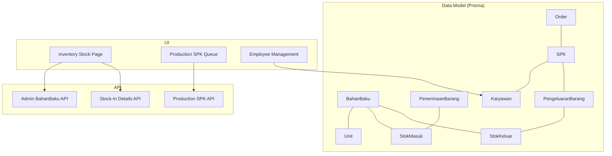
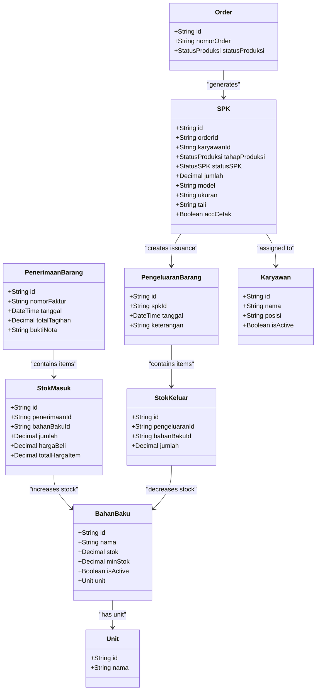
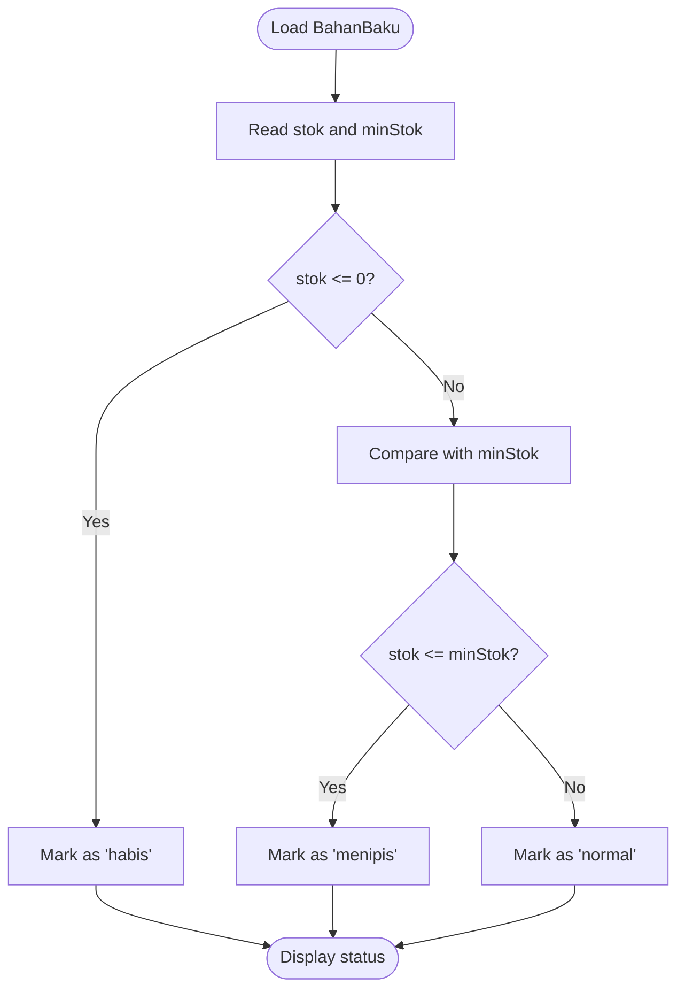
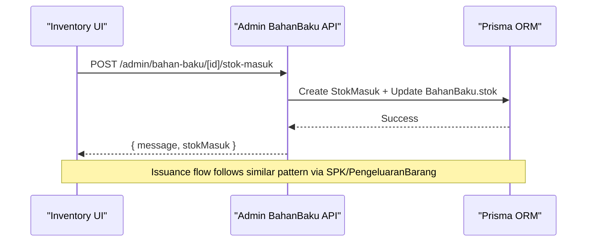
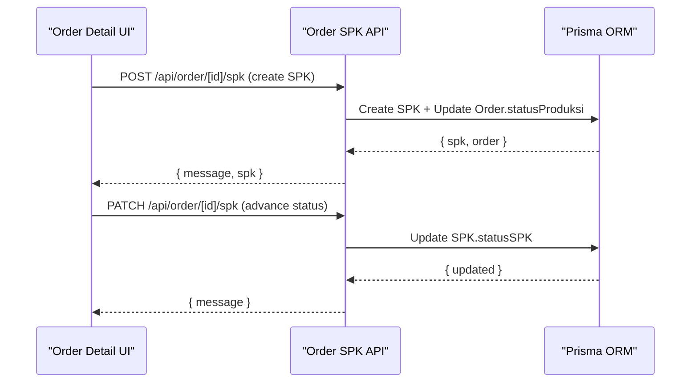
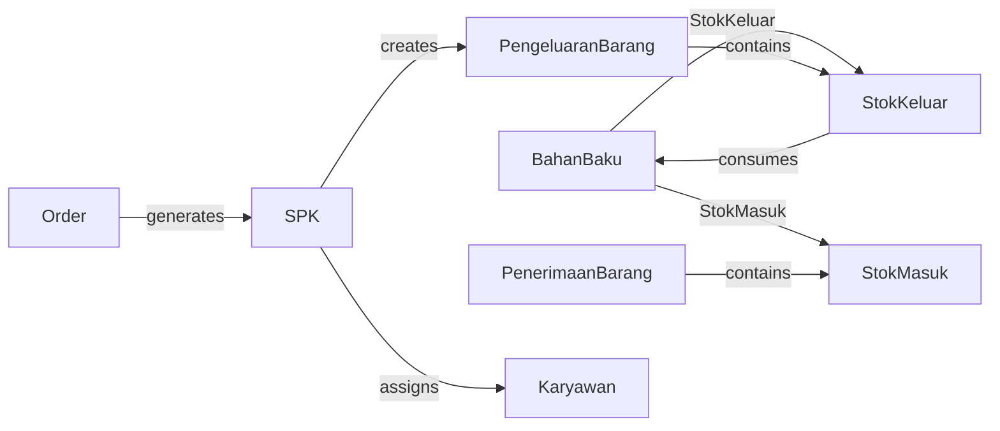

# Inventory & Production Entities

<cite>
**Referenced Files in This Document**
- [schema.prisma](file://prisma/schema.prisma)
- [part3-produksi-inventori.plantuml](file://diagram/class/part3-produksi-inventori.plantuml)
- [gudang.puml](file://diagram/activity/gudang.puml)
- [page.tsx](file://src/app/(LoggedIn)/inventory/stock/page.tsx)
- [columns.tsx](file://src/app/(LoggedIn)/inventory/stock/components/columns.tsx)
- [route.ts](file://src/app/api/admin/bahan-baku/[id]/stok-masuk/route.ts)
- [route.ts](file://src/app/api/admin/bahan-baku/route.ts)
- [page.tsx](file://src/app/(LoggedIn)/production/spk/page.tsx)
- [route.ts](file://src/app/api/production/spk/route.ts)
- [page.tsx](file://src/app/(LoggedIn)/master/karyawan/page.tsx)
- [page.tsx](file://src/app/(LoggedIn)/order/[id]/page.tsx)
- [route.ts](file://src/app/api/order/[id]/spk/route.ts)
</cite>

## Table of Contents
1. [Introduction](#introduction)
2. [Project Structure](#project-structure)
3. [Core Components](#core-components)
4. [Architecture Overview](#architecture-overview)
5. [Detailed Component Analysis](#detailed-component-analysis)
6. [Dependency Analysis](#dependency-analysis)
7. [Performance Considerations](#performance-considerations)
8. [Troubleshooting Guide](#troubleshooting-guide)
9. [Conclusion](#conclusion)
10. [Appendices](#appendices)

## Introduction
This document explains the inventory and production data models implemented in the system, focusing on Raw Materials (BahanBaku), Stock Movements (StokMasuk/StokKeluar), Work Orders (SPK), and Employee records (Karyawan). It covers inventory tracking methods, stock valuation, production workflow management, material consumption tracking, low stock alerts, batch tracking, production scheduling relationships, and practical examples such as inventory reconciliation, production costing, and material requirement planning.

## Project Structure
The inventory and production domain spans:
- Data modeling via Prisma schema
- UI surfaces for inventory and production management
- API routes for CRUD and workflow operations
- PlantUML class and activity diagrams for conceptual understanding

**Diagram sources**
- [schema.prisma](file://prisma/schema.prisma)
- [page.tsx](file://src/app/(LoggedIn)/inventory/stock/page.tsx)
- [page.tsx](file://src/app/(LoggedIn)/production/spk/page.tsx)
- [page.tsx](file://src/app/(LoggedIn)/master/karyawan/page.tsx)
- [route.ts](file://src/app/api/admin/bahan-baku/[id]/stok-masuk/route.ts)
- [route.ts](file://src/app/api/admin/bahan-baku/route.ts)
- [route.ts](file://src/app/api/production/spk/route.ts)

**Section sources**
- [schema.prisma](file://prisma/schema.prisma)
- [page.tsx](file://src/app/(LoggedIn)/inventory/stock/page.tsx)
- [page.tsx](file://src/app/(LoggedIn)/production/spk/page.tsx)
- [page.tsx](file://src/app/(LoggedIn)/master/karyawan/page.tsx)
- [route.ts](file://src/app/api/admin/bahan-baku/[id]/stok-masuk/route.ts)
- [route.ts](file://src/app/api/admin/bahan-baku/route.ts)
- [route.ts](file://src/app/api/production/spk/route.ts)

## Core Components
- Raw Materials (BahanBaku)
  - Tracks name, unit, current stock, minimum stock threshold, and activity status.
  - Linked to Unit for measurement and to stock movement entries.
- Stock Movements
  - StokMasuk: Records incoming stock with purchase invoice linkage, quantity, and optional unit cost.
  - StokKeluar: Records outgoing stock tied to a work order’s production issuance.
- Work Orders (SPK)
  - Links an Order to a Karyawan, captures production stage, status, and issuance records.
- Employees (Karyawan)
  - Maintains employee profiles and assignment to SPKs.

**Section sources**
- [schema.prisma](file://prisma/schema.prisma)
- [page.tsx](file://src/app/(LoggedIn)/production/spk/page.tsx)
- [page.tsx](file://src/app/(LoggedIn)/master/karyawan/page.tsx)

## Architecture Overview
The system enforces a clear separation between inventory and production domains:
- Inventory ingestion (StokMasuk) increases BahanBaku stock.
- Production issuance (StokKeluar) reduces BahanBaku stock.
- SPK orchestrates production tasks and links issuance to specific materials.

**Diagram sources**
- [schema.prisma](file://prisma/schema.prisma)
- [part3-produksi-inventori.plantuml](file://diagram/class/part3-produksi-inventori.plantuml)

**Section sources**
- [schema.prisma](file://prisma/schema.prisma)
- [part3-produksi-inventori.plantuml](file://diagram/class/part3-produksi-inventori.plantuml)

## Detailed Component Analysis

### Raw Materials (BahanBaku)
- Purpose: Central record for raw material inventory with thresholds and unit association.
- Key attributes: name, unit, current stock, minimum stock, and activity flag.
- Behavior:
  - Low stock detection is computed client-side by comparing current stock against minimum stock.
  - Filtering by “menipis” and “habis” is supported in the admin API and UI.

**Diagram sources**
- [page.tsx](file://src/app/(LoggedIn)/inventory/stock/page.tsx)

**Section sources**
- [schema.prisma](file://prisma/schema.prisma)
- [page.tsx](file://src/app/(LoggedIn)/inventory/stock/page.tsx)
- [columns.tsx](file://src/app/(LoggedIn)/inventory/stock/components/columns.tsx)

### Stock Movements (StokMasuk/StokKeluar)
- StokMasuk
  - Captures incoming stock with optional unit cost and total item cost.
  - Linked to PenerimaanBarang (purchase receipt) and BahanBaku.
- StokKeluar
  - Captures outgoing stock for production issuance, linked to PengeluaranBarang and BahanBaku.

**Diagram sources**
- [route.ts](file://src/app/api/admin/bahan-baku/[id]/stok-masuk/route.ts)
- [schema.prisma](file://prisma/schema.prisma)

**Section sources**
- [schema.prisma](file://prisma/schema.prisma)
- [route.ts](file://src/app/api/admin/bahan-baku/[id]/stok-masuk/route.ts)

### Work Orders (SPK) and Production Workflow
- SPK creation ties an Order to a Karyawan and initiates production status.
- SPK queue supports filtering by status, printing approval, and advancing to completion.
- Production issuance is recorded via PengeluaranBarang and StokKeluar.

**Diagram sources**
- [page.tsx](file://src/app/(LoggedIn)/order/[id]/page.tsx)
- [route.ts](file://src/app/api/order/[id]/spk/route.ts)
- [route.ts](file://src/app/api/production/spk/route.ts)

**Section sources**
- [page.tsx](file://src/app/(LoggedIn)/production/spk/page.tsx)
- [route.ts](file://src/app/api/production/spk/route.ts)
- [page.tsx](file://src/app/(LoggedIn)/order/[id]/page.tsx)
- [route.ts](file://src/app/api/order/[id]/spk/route.ts)

### Employee Records (Karyawan)
- Manages employee profiles, positions, and activity status.
- Integrated with SPK assignments for production oversight.

**Section sources**
- [schema.prisma](file://prisma/schema.prisma)
- [page.tsx](file://src/app/(LoggedIn)/master/karyawan/page.tsx)

## Dependency Analysis
- Inventory ingestion depends on PenerimaanBarang → StokMasuk → BahanBaku updates.
- Production issuance depends on SPK → PengeluaranBarang → StokKeluar → BahanBaku updates.
- UI filters and displays rely on API endpoints with pagination and search.

**Diagram sources**
- [schema.prisma](file://prisma/schema.prisma)

**Section sources**
- [schema.prisma](file://prisma/schema.prisma)

## Performance Considerations
- Indexes on frequently queried fields (e.g., BahanBaku.nama, StokMasuk.bahanBakuId, StokKeluar.pengeluaranId) improve lookup performance.
- Pagination and search parameters reduce payload sizes for large datasets.
- Client-side post-filtering for low stock conditions is acceptable for moderate dataset sizes; consider moving to database-level filtering for very large inventories.

[No sources needed since this section provides general guidance]

## Troubleshooting Guide
- Unauthorized/Forbidden Access
  - Ensure the requesting user has the correct role for inventory and production endpoints.
- Stock Validation Failures
  - Confirm sufficient BahanBaku stock before creating StokKeluar entries.
- SPK Creation/Status Updates
  - Verify Order exists and is in the expected production stage before creating/updating SPK.

**Section sources**
- [route.ts](file://src/app/api/admin/bahan-baku/[id]/stok-masuk/route.ts)
- [route.ts](file://src/app/api/admin/bahan-baku/route.ts)
- [route.ts](file://src/app/api/production/spk/route.ts)
- [route.ts](file://src/app/api/order/[id]/spk/route.ts)

## Conclusion
The system models a robust inventory-production pipeline centered on BahanBaku, StokMasuk/StokKeluar, SPK, and Karyawan. It supports low stock monitoring, issuance tracking, and production workflow orchestration. The provided APIs and UI components enable efficient management, while the Prisma schema ensures referential integrity and scalability.

[No sources needed since this section summarizes without analyzing specific files]

## Appendices

### Practical Examples

- Inventory Reconciliation
  - Use the stock page to filter by “menipis” and “habis,” then reconcile discrepancies by reviewing StokMasuk entries and issuance logs.
  - Reference: [page.tsx](file://src/app/(LoggedIn)/inventory/stock/page.tsx), [route.ts](file://src/app/api/admin/bahan-baku/[id]/stok-masuk/route.ts)

- Production Costing
  - Track material costs via StokMasuk.hargaBeli and totalHargaItem to compute per-unit cost for finished goods.
  - Reference: [schema.prisma](file://prisma/schema.prisma)

- Material Requirement Planning (MRP)
  - Compute required quantities by aggregating SPK quantities and linking to material needs through production formulas; monitor BahanBaku stock and reorder when reaching minStok.
  - Reference: [schema.prisma](file://prisma/schema.prisma), [page.tsx](file://src/app/(LoggedIn)/inventory/stock/page.tsx)

- Low Stock Alerts
  - The UI computes low stock status client-side; configure minStok per material to trigger alerts.
  - Reference: [page.tsx](file://src/app/(LoggedIn)/inventory/stock/page.tsx)

- Batch Tracking
  - Use PenerimaanBarang.nomorFaktur and StokMasuk entries to track batches; link issuance via PengeluaranBarang and StokKeluar.
  - Reference: [schema.prisma](file://prisma/schema.prisma)

- Production Scheduling Relationships
  - SPK links Order, Karyawan, and issuance records; advance statuses to move production forward.
  - Reference: [page.tsx](file://src/app/(LoggedIn)/production/spk/page.tsx), [route.ts](file://src/app/api/order/[id]/spk/route.ts)