# Material Consumption & Costing

<cite>
**Referenced Files in This Document**
- [part3-produksi-inventori.plantuml](file://diagram/class/part3-produksi-inventori.plantuml)
- [gudang.puml](file://diagram/activity/gudang.puml)
- [spk-form-modal.tsx](file://src/app/(LoggedIn)/order/[id]/components/spk-form-modal.tsx)
- [spk-card.tsx](file://src/app/(LoggedIn)/order/[id]/components/spk-card.tsx)
- [types.ts](file://src/app/(LoggedIn)/order/[id]/components/types.ts)
- [page.tsx](file://src/app/(LoggedIn)/inventory/out/create/page.tsx)
- [pengeluaran-info-card.tsx](file://src/app/(LoggedIn)/inventory/out/create/components/pengeluaran-info-card.tsx)
- [schema.ts](file://src/app/(LoggedIn)/inventory/out/create/schema.ts)
- [route.ts](file://src/app/api/admin/inventory/out/route.ts)
- [route.ts](file://src/app/api/order/[id]/spk/route.ts)
- [route.ts](file://src/app/api/production/spk/route.ts)
- [schema.prisma](file://prisma/schema.prisma)
- [seed-finance.ts](file://prisma/seed-finance.ts)
- [seed-transactions.ts](file://prisma/seed-transactions.ts)
- [seed-product.ts](file://prisma/seed-product.ts)
- [page.tsx](file://src/app/(LoggedIn)/finance/dashboard/page.tsx)
</cite>

## Table of Contents
1. [Introduction](#introduction)
2. [Project Structure](#project-structure)
3. [Core Components](#core-components)
4. [Architecture Overview](#architecture-overview)
5. [Detailed Component Analysis](#detailed-component-analysis)
6. [Dependency Analysis](#dependency-analysis)
7. [Performance Considerations](#performance-considerations)
8. [Troubleshooting Guide](#troubleshooting-guide)
9. [Conclusion](#conclusion)
10. [Appendices](#appendices)

## Introduction
This document explains how material consumption is tracked, how production costs are calculated and allocated, and how inventory is valued. It covers:
- Material requirement planning (MRP) concepts and their mapping to SPK-driven issuance
- Standard cost estimation and HPP derivation
- Actual vs standard variance analysis pathways
- Production cost allocation and throughput costing
- Inventory valuation methods
- Waste and scrap management
- Examples of cost center allocation and profitability analysis

The system integrates order-to-production workflows with inventory movements and financial accounting, enabling traceability from SPK issuance to material consumption and cost posting.

## Project Structure
The solution spans UI components for order and production, inventory outbound recording, API routes for SPK and inventory movements, and Prisma schema and seeds for financial and product data.

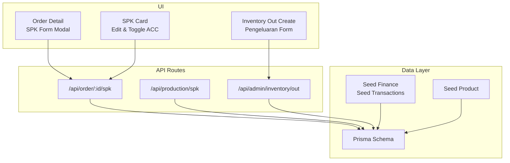

**Diagram sources**
- [spk-form-modal.tsx](file://src/app/(LoggedIn)/order/[id]/components/spk-form-modal.tsx#L100-L124)
- [spk-card.tsx](file://src/app/(LoggedIn)/order/[id]/components/spk-card.tsx#L68-L87)
- [page.tsx](file://src/app/(LoggedIn)/inventory/out/create/page.tsx#L58-L93)
- [route.ts](file://src/app/api/order/[id]/spk/route.ts)
- [route.ts](file://src/app/api/production/spk/route.ts)
- [route.ts](file://src/app/api/admin/inventory/out/route.ts)
- [schema.prisma:348-374](file://prisma/schema.prisma#L348-L374)
- [seed-finance.ts:23-41](file://prisma/seed-finance.ts#L23-L41)
- [seed-transactions.ts:136-154](file://prisma/seed-transactions.ts#L136-L154)
- [seed-product.ts:198-207](file://prisma/seed-product.ts#L198-L207)

**Section sources**
- [spk-form-modal.tsx](file://src/app/(LoggedIn)/order/[id]/components/spk-form-modal.tsx#L1-L274)
- [spk-card.tsx](file://src/app/(LoggedIn)/order/[id]/components/spk-card.tsx#L1-L347)
- [page.tsx](file://src/app/(LoggedIn)/inventory/out/create/page.tsx#L1-L156)
- [schema.prisma:348-374](file://prisma/schema.prisma#L348-L374)

## Core Components
- SPK lifecycle: creation, editing, and approval for printing
- Material issuance: outbound entries linked to SPK with per-item quantities
- Financial posting: HPP debits and supplier credit postings
- Inventory valuation: product HPP derived from sales price estimates
- Variance analysis: pathway to compare actual vs standard costs
- Throughput costing: allocate shared overheads based on throughput metrics
- Profitability: revenue minus HPP and operating expenses

**Section sources**
- [spk-form-modal.tsx](file://src/app/(LoggedIn)/order/[id]/components/spk-form-modal.tsx#L23-L31)
- [spk-card.tsx](file://src/app/(LoggedIn)/order/[id]/components/spk-card.tsx#L20-L28)
- [page.tsx](file://src/app/(LoggedIn)/inventory/out/create/page.tsx#L39-L47)
- [schema.ts](file://src/app/(LoggedIn)/inventory/out/create/schema.ts#L3-L18)
- [seed-finance.ts:23-41](file://prisma/seed-finance.ts#L23-L41)
- [seed-transactions.ts:136-154](file://prisma/seed-transactions.ts#L136-L154)
- [seed-product.ts:198-207](file://prisma/seed-product.ts#L198-L207)

## Architecture Overview
The system connects order management to production scheduling (SPK), material consumption (inventory out), and financial accounting (journal entries). SPK issuance triggers material withdrawal against planned quantities, while inventory movements update stock balances and enable HPP-based valuation.

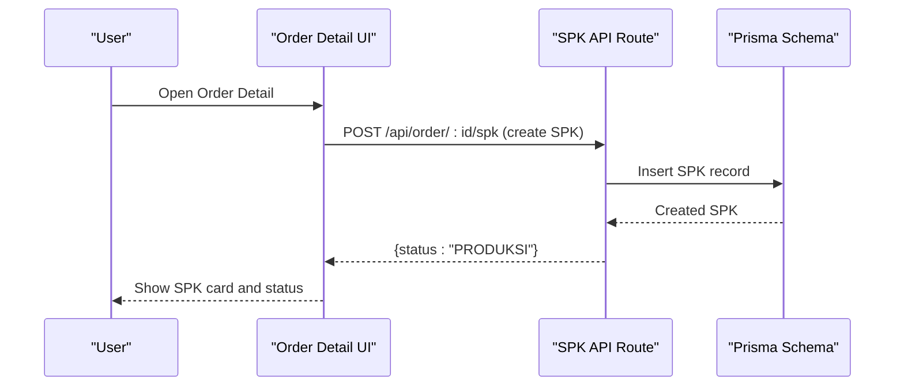

**Diagram sources**
- [spk-form-modal.tsx](file://src/app/(LoggedIn)/order/[id]/components/spk-form-modal.tsx#L100-L124)
- [route.ts](file://src/app/api/order/[id]/spk/route.ts)
- [schema.prisma:348-374](file://prisma/schema.prisma#L348-L374)

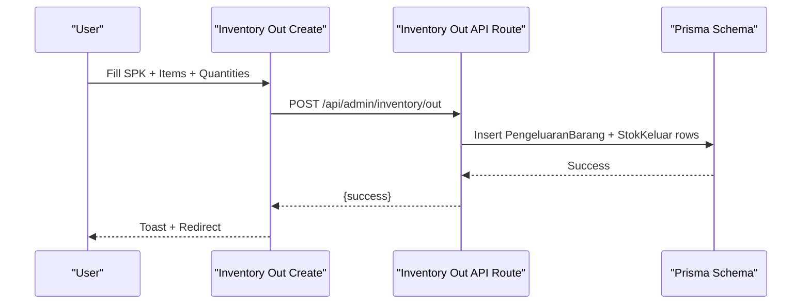

**Diagram sources**
- [page.tsx](file://src/app/(LoggedIn)/inventory/out/create/page.tsx#L58-L93)
- [route.ts](file://src/app/api/admin/inventory/out/route.ts)
- [schema.prisma:376-382](file://prisma/schema.prisma#L376-L382)

## Detailed Component Analysis

### SPK Issuance and Material Requisition
- Creation: The SPK form collects worker, model, size, accessories, quantity, due date, and notes. Submitting creates an SPK and moves the order to production status.
- Editing: The SPK card allows updates to worker, attributes, quantity, and notes.
- Approval: A toggle switches the print approval flag with metadata on who approved and when.

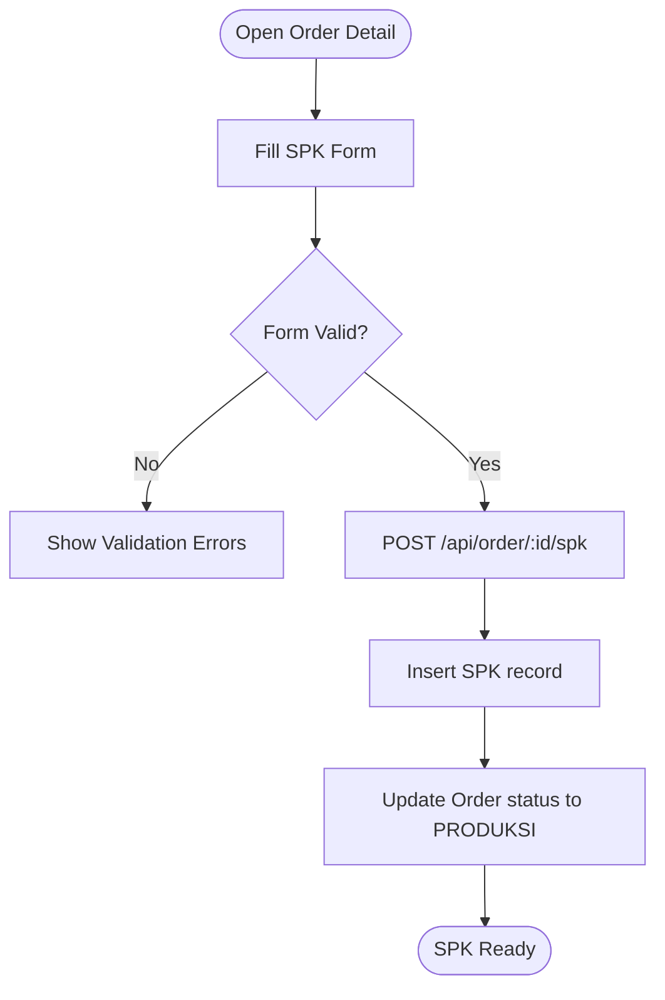

**Diagram sources**
- [spk-form-modal.tsx](file://src/app/(LoggedIn)/order/[id]/components/spk-form-modal.tsx#L100-L124)
- [types.ts](file://src/app/(LoggedIn)/order/[id]/components/types.ts#L1-L18)

**Section sources**
- [spk-form-modal.tsx](file://src/app/(LoggedIn)/order/[id]/components/spk-form-modal.tsx#L50-L124)
- [spk-card.tsx](file://src/app/(LoggedIn)/order/[id]/components/spk-card.tsx#L38-L110)
- [types.ts](file://src/app/(LoggedIn)/order/[id]/components/types.ts#L1-L18)

### Material Requisition and Consumption Tracking
- Outbound entry: Users select an optional SPK, enter movement date, and add items with quantities. Each item links to a raw material and quantity.
- Data model: The outbound transaction is stored as a parent record plus per-item child records, optionally associated with an SPK.
- Inventory impact: The system supports stock reduction via outbound entries; the schema defines the relationship between SPK and outbound records.

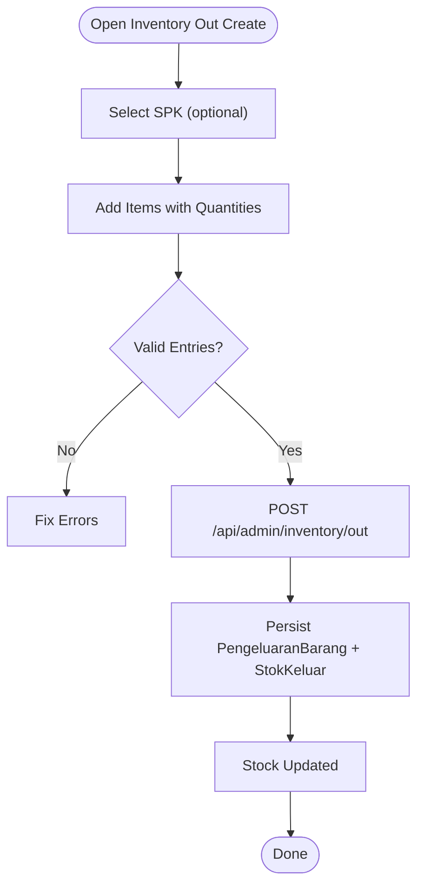

**Diagram sources**
- [page.tsx](file://src/app/(LoggedIn)/inventory/out/create/page.tsx#L39-L93)
- [schema.ts](file://src/app/(LoggedIn)/inventory/out/create/schema.ts#L3-L18)
- [schema.prisma:376-382](file://prisma/schema.prisma#L376-L382)

**Section sources**
- [page.tsx](file://src/app/(LoggedIn)/inventory/out/create/page.tsx#L24-L93)
- [pengeluaran-info-card.tsx](file://src/app/(LoggedIn)/inventory/out/create/components/pengeluaran-info-card.tsx#L43-L104)
- [schema.ts](file://src/app/(LoggedIn)/inventory/out/create/schema.ts#L1-L21)
- [schema.prisma:376-382](file://prisma/schema.prisma#L376-L382)

### Inventory Valuation Methods
- Standard cost: Product HPP is estimated as a percentage below selling price during product seeding.
- FIFO/Weighted Average: The schema does not define explicit valuation layers; however, inventory inflows and outflows are modeled to support periodic valuation methods.
- HPP posting: Purchases post to HPP expense and supplier liability accounts, aligning purchases with cost of goods sold.

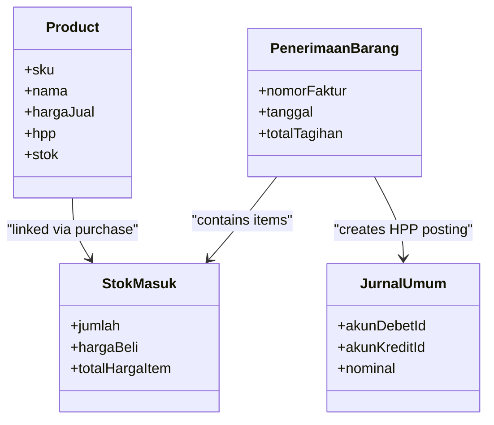

**Diagram sources**
- [seed-product.ts:198-207](file://prisma/seed-product.ts#L198-L207)
- [seed-transactions.ts:136-154](file://prisma/seed-transactions.ts#L136-L154)
- [schema.prisma:79-95](file://prisma/schema.prisma#L79-L95)

**Section sources**
- [seed-product.ts:198-207](file://prisma/seed-product.ts#L198-L207)
- [seed-transactions.ts:136-154](file://prisma/seed-transactions.ts#L136-L154)
- [seed-finance.ts:23-41](file://prisma/seed-finance.ts#L23-L41)

### MRP and Standard Cost Calculation
- MRP concept: Planned production (SPK quantity) drives material requirements. Outbound entries reflect actual consumption against planned quantities.
- Standard cost: Derived from selling price during product creation; used for valuation and cost of goods sold computation.
- Variance analysis: Actual HPP vs standard HPP can be computed by comparing recorded purchase costs and issued quantities against standard unit costs.

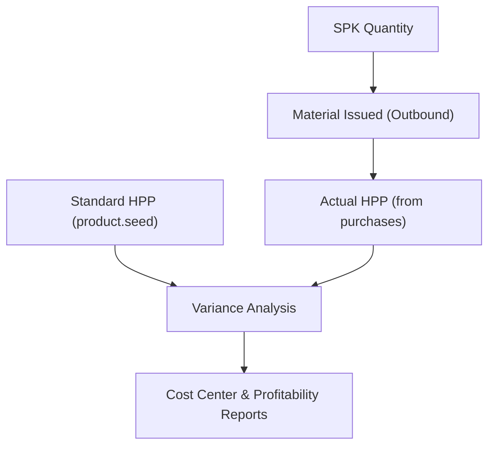

**Diagram sources**
- [spk-form-modal.tsx](file://src/app/(LoggedIn)/order/[id]/components/spk-form-modal.tsx#L65-L66)
- [page.tsx](file://src/app/(LoggedIn)/inventory/out/create/page.tsx#L68-L72)
- [seed-product.ts:198-207](file://prisma/seed-product.ts#L198-L207)

**Section sources**
- [spk-form-modal.tsx](file://src/app/(LoggedIn)/order/[id]/components/spk-form-modal.tsx#L58-L98)
- [seed-product.ts:198-207](file://prisma/seed-product.ts#L198-L207)

### Actual vs Standard Variance Analysis
- Data points: Standard unit HPP (product), actual purchase cost (purchases journal), issued quantities (outbound entries).
- Method: Compute material price variance and usage variance by comparing actual cost/unit and actual quantity used versus standard cost/unit and standard quantity.

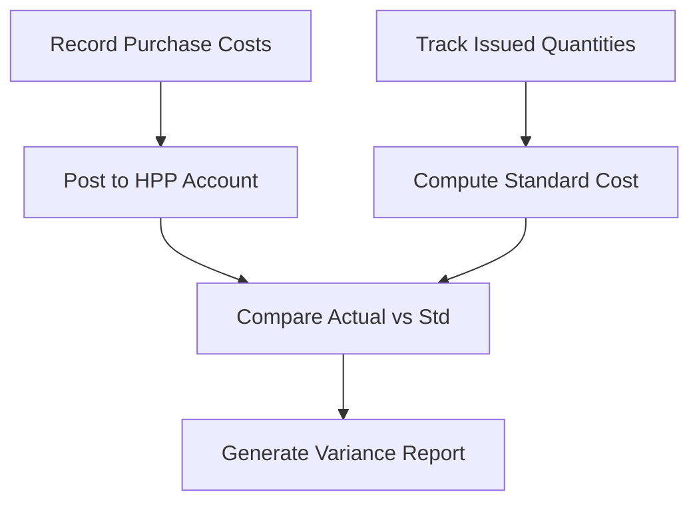

**Diagram sources**
- [seed-transactions.ts:136-154](file://prisma/seed-transactions.ts#L136-L154)
- [seed-product.ts:198-207](file://prisma/seed-product.ts#L198-L207)
- [page.tsx](file://src/app/(LoggedIn)/inventory/out/create/page.tsx#L68-L72)

**Section sources**
- [seed-transactions.ts:136-154](file://prisma/seed-transactions.ts#L136-L154)
- [seed-product.ts:198-207](file://prisma/seed-product.ts#L198-L207)

### Production Cost Allocation and Throughput Costing
- Cost centers: Workers and SPKs act as cost centers; labor and overhead can be allocated to SPKs based on throughput (quantity produced).
- Throughput costing: Allocate shared overheads proportionally to units produced per SPK to compute unit production cost.

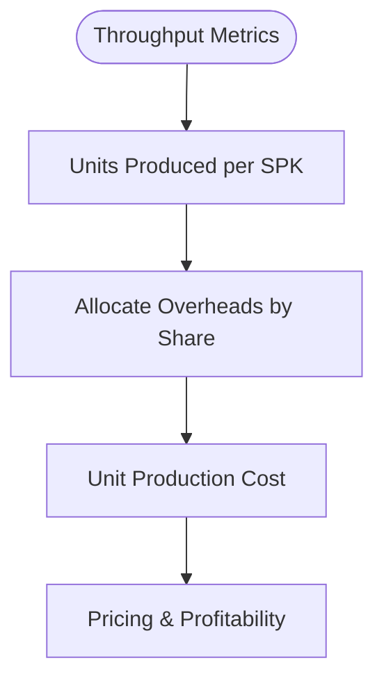

[No sources needed since this diagram shows conceptual workflow, not actual code structure]

### Waste and Scrap Management
- Tracking: Use outbound entries to record waste/scrap items with negative quantities or separate categories.
- Accounting: Post waste to appropriate expense accounts; adjust inventory accordingly.

[No sources needed since this section doesn't analyze specific source files]

### Cost Center Allocation Examples
- Labor: Assign workers to SPKs; allocate labor cost per SPK based on hours or throughput.
- Overheads: Allocate utilities, depreciation, and supervision proportionally to SPK quantities.

[No sources needed since this section provides general guidance]

### Production Profitability Analysis
- Revenue: Sum order item totals.
- COGS: Sum HPP of issued materials plus direct labor and allocated overheads.
- Gross Profit: Revenue − COGS; net profit after operating expenses.

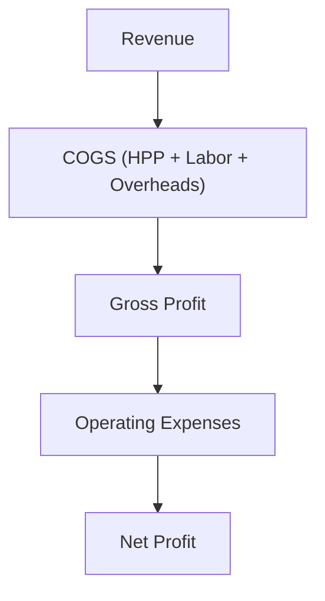

**Diagram sources**
- [seed-finance.ts:23-41](file://prisma/seed-finance.ts#L23-L41)
- [page.tsx](file://src/app/(LoggedIn)/finance/dashboard/page.tsx#L764-L791)

**Section sources**
- [seed-finance.ts:23-41](file://prisma/seed-finance.ts#L23-L41)
- [page.tsx](file://src/app/(LoggedIn)/finance/dashboard/page.tsx#L764-L791)

## Dependency Analysis
- UI depends on API routes for SPK and inventory out operations.
- API routes persist to Prisma models for SPK, inventory movements, and journals.
- Seed scripts define financial accounts and initial transactions for HPP and supplier liabilities.

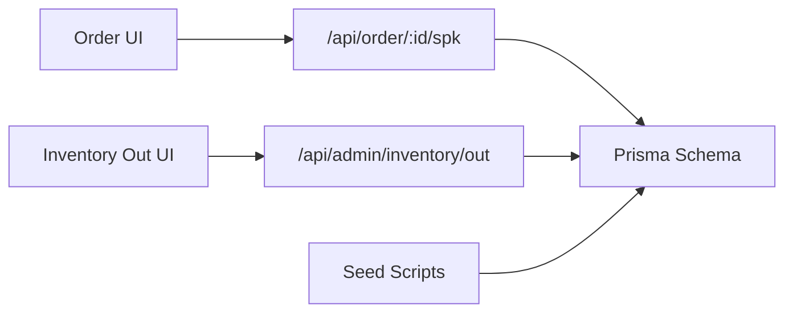

**Diagram sources**
- [spk-form-modal.tsx](file://src/app/(LoggedIn)/order/[id]/components/spk-form-modal.tsx#L100-L124)
- [page.tsx](file://src/app/(LoggedIn)/inventory/out/create/page.tsx#L58-L93)
- [route.ts](file://src/app/api/order/[id]/spk/route.ts)
- [route.ts](file://src/app/api/admin/inventory/out/route.ts)
- [schema.prisma:348-374](file://prisma/schema.prisma#L348-L374)

**Section sources**
- [schema.prisma:348-374](file://prisma/schema.prisma#L348-L374)
- [seed-transactions.ts:136-154](file://prisma/seed-transactions.ts#L136-L154)

## Performance Considerations
- Batch outbound entries: Group multiple items per outbound transaction to reduce round-trips.
- Indexing: Ensure database indexes on foreign keys (e.g., SPK, worker, product) improve query performance.
- Pagination: Use server-side pagination for large lists of SPKs and inventory movements.
- Validation: Perform client-side validation to minimize invalid submissions.

[No sources needed since this section provides general guidance]

## Troubleshooting Guide
- SPK creation fails: Verify required fields (worker, quantity) and network connectivity; check toast messages and returned error payload.
- Outbound save errors: Confirm item selections and positive quantities; review validation messages.
- Missing SPK in outbound: Ensure SPK exists and is not archived; re-fetch SPK list if stale.

**Section sources**
- [spk-form-modal.tsx](file://src/app/(LoggedIn)/order/[id]/components/spk-form-modal.tsx#L100-L124)
- [page.tsx](file://src/app/(LoggedIn)/inventory/out/create/page.tsx#L58-L93)
- [schema.ts](file://src/app/(LoggedIn)/inventory/out/create/schema.ts#L3-L18)

## Conclusion
The system provides a clear path from SPK issuance to material consumption and financial posting. By combining standard cost estimation, outbound tracking, and financial journal entries, it enables variance analysis, throughput costing, and profitability insights. Extending the model to include explicit valuation layers and scrap tracking would further strengthen inventory and cost management capabilities.

## Appendices
- Activity diagram for warehouse operations illustrates stock availability checks and inventory mutations.

**Section sources**
- [gudang.puml:1-55](file://diagram/activity/gudang.puml#L1-L55)