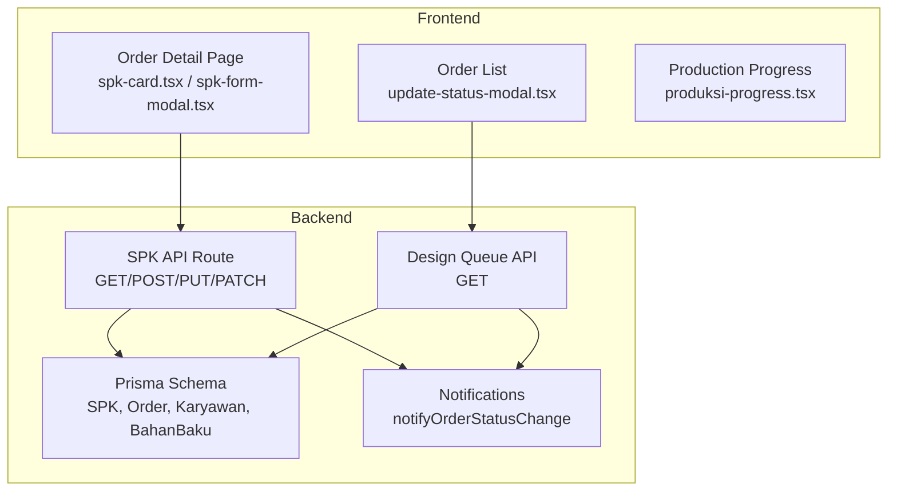
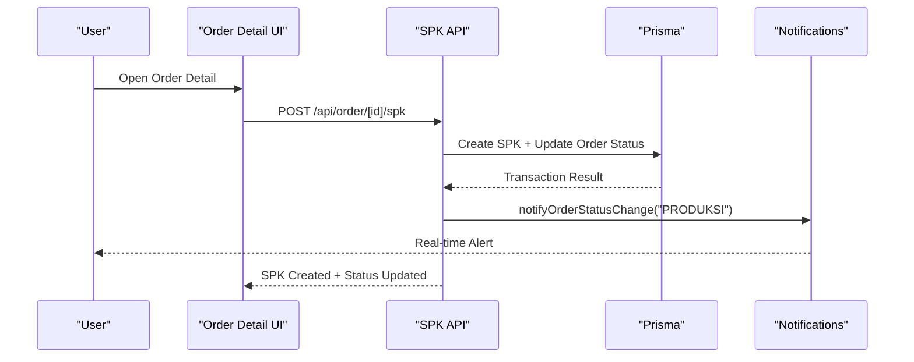
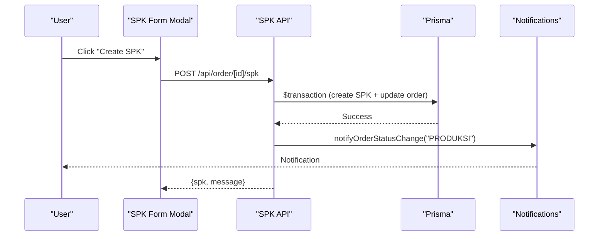
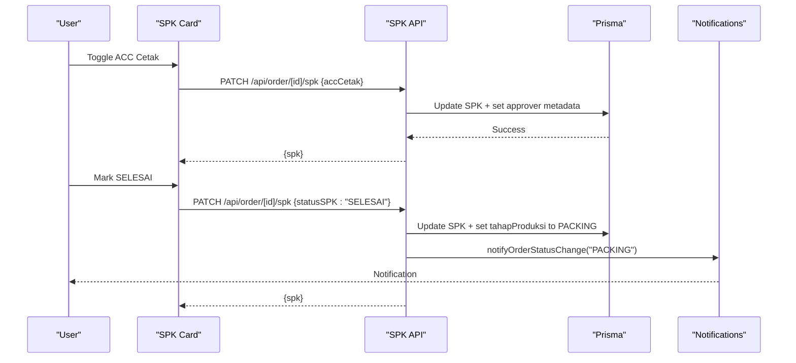
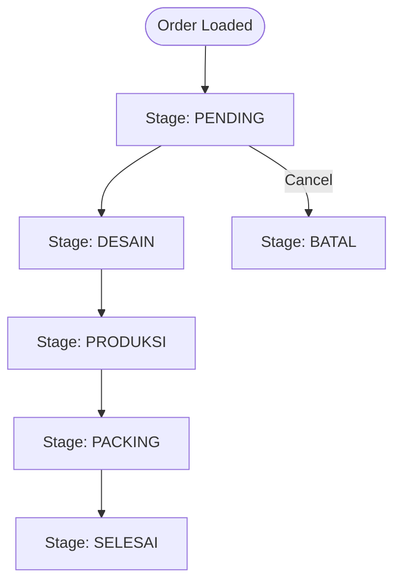
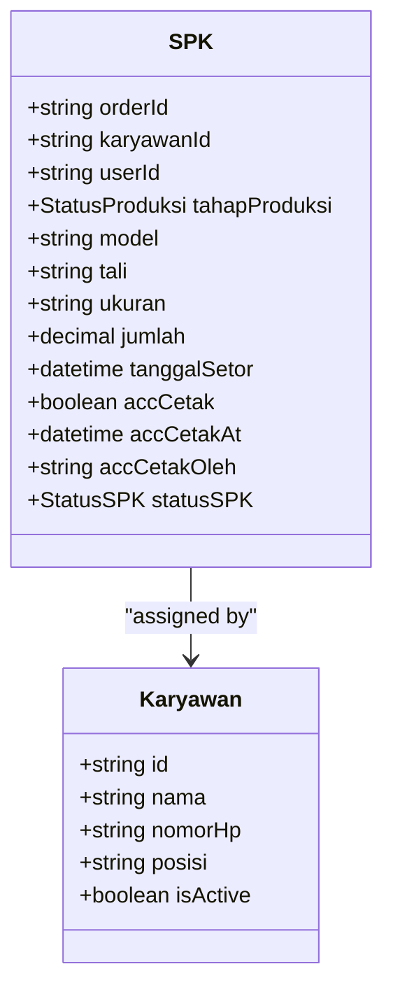
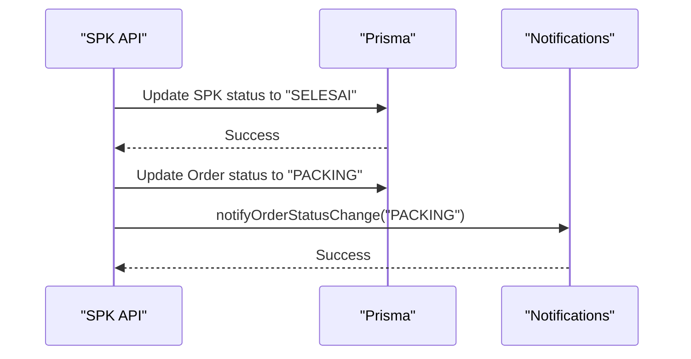
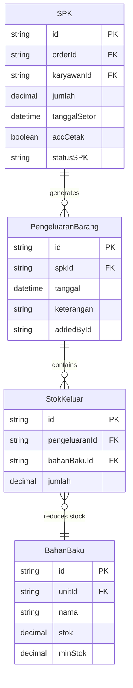
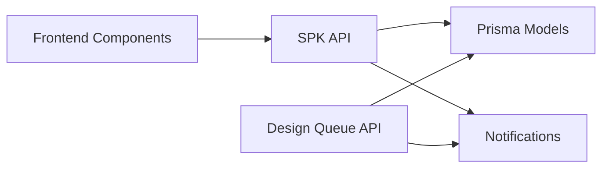

# Production Workflow & SPK Management

<cite>
**Referenced Files in This Document**
- [route.ts](file://src/app/api/order/[id]/spk/route.ts)
- [spk-card.tsx](file://src/app/(LoggedIn)/order/[id]/components/spk-card.tsx)
- [spk-form-modal.tsx](file://src/app/(LoggedIn)/order/[id]/components/spk-form-modal.tsx)
- [produksi-progress.tsx](file://src/app/(LoggedIn)/order/[id]/components/produksi-progress.tsx)
- [update-status-modal.tsx](file://src/app/(LoggedIn)/order/list/components/update-status-modal.tsx)
- [route.ts](file://src/app/api/production/design-queue/route.ts)
- [schema.prisma](file://prisma/schema.prisma)
- [notifications.ts](file://src/lib/notifications.ts)
- [part3-produksi-inventori.plantuml](file://diagram/class/part3-produksi-inventori.plantuml)
- [06-buat-spk-produksi.mmd](file://diagram/sequence/06-buat-spk-produksi.mmd)
- [07-update-status-spk.mmd](file://diagram/sequence/07-update-status-spk.mmd)
</cite>

## Table of Contents
1. [Introduction](#introduction)
2. [Project Structure](#project-structure)
3. [Core Components](#core-components)
4. [Architecture Overview](#architecture-overview)
5. [Detailed Component Analysis](#detailed-component-analysis)
6. [Dependency Analysis](#dependency-analysis)
7. [Performance Considerations](#performance-considerations)
8. [Troubleshooting Guide](#troubleshooting-guide)
9. [Conclusion](#conclusion)

## Introduction
This document explains the production workflow management system with a focus on Surat Perintah Kerja (SPK), work order processing, and employee assignment tracking. It covers SPK creation workflows, production stage management, employee allocation processes, and work order status tracking. It also documents production scheduling mechanisms, capacity planning considerations, quality control checkpoints, and production capacity utilization metrics. Examples include SPK approval workflows, production progress monitoring, and integration with material consumption tracking.

## Project Structure
The SPK and production workflow spans frontend React components, backend Next.js routes, Prisma data models, and notification utilities. The most relevant areas are:
- Order detail page components for SPK viewing/editing and creation
- API routes for SPK CRUD operations and status transitions
- Prisma schema defining SPK, Order, Employee, and Inventory relationships
- Notification system for status updates across roles
- PlantUML and Mermaid diagrams illustrating class relationships and sequences

**Diagram sources**
- [spk-card.tsx](file://src/app/(LoggedIn)/order/[id]/components/spk-card.tsx#L1-347)
- [spk-form-modal.tsx](file://src/app/(LoggedIn)/order/[id]/components/spk-form-modal.tsx#L1-274)
- [update-status-modal.tsx](file://src/app/(LoggedIn)/order/list/components/update-status-modal.tsx#L187-214)
- [produksi-progress.tsx](file://src/app/(LoggedIn)/order/[id]/components/produksi-progress.tsx#L1-46)
- [route.ts:1-273](file://src/app/api/order/[id]/spk/route.ts#L1-273)
- [route.ts:1-152](file://src/app/api/production/design-queue/route.ts#L1-152)
- [schema.prisma:346-393](file://prisma/schema.prisma#L346-393)
- [notifications.ts:100-121](file://src/lib/notifications.ts#L100-121)

**Section sources**
- [spk-card.tsx](file://src/app/(LoggedIn)/order/[id]/components/spk-card.tsx#L1-347)
- [spk-form-modal.tsx](file://src/app/(LoggedIn)/order/[id]/components/spk-form-modal.tsx#L1-274)
- [route.ts:1-273](file://src/app/api/order/[id]/spk/route.ts#L1-273)
- [schema.prisma:346-393](file://prisma/schema.prisma#L346-393)

## Core Components
- SPK API Route: Handles SPK retrieval, creation (with atomic order status update), editing, and toggling approval and completion.
- SPK Card and Form Modal: Frontend UI for viewing/editing SPK details, selecting employees, and managing approvals.
- Production Progress: Visual indicator of production stages aligned with order status.
- Design Queue API: Filters and lists orders awaiting production initiation.
- Prisma Models: Define SPK, Order, Employee (Karyawan), and Inventory movement relationships.
- Notifications: Real-time alerts for order status changes across relevant roles.

Key capabilities:
- SPK creation with automatic order status progression from pending to production
- Employee assignment with validation and optional model/size/tali details
- Approval toggle for printing readiness and completion marking
- Integration with inventory consumption via outgoing material records

**Section sources**
- [route.ts:37-151](file://src/app/api/order/[id]/spk/route.ts#L37-151)
- [spk-card.tsx](file://src/app/(LoggedIn)/order/[id]/components/spk-card.tsx#L68-110)
- [spk-form-modal.tsx](file://src/app/(LoggedIn)/order/[id]/components/spk-form-modal.tsx#L100-124)
- [produksi-progress.tsx](file://src/app/(LoggedIn)/order/[id]/components/produksi-progress.tsx#L14-46)
- [route.ts:17-151](file://src/app/api/production/design-queue/route.ts#L17-151)
- [schema.prisma:346-393](file://prisma/schema.prisma#L346-393)
- [notifications.ts:100-121](file://src/lib/notifications.ts#L100-121)

## Architecture Overview
The system follows a layered architecture:
- Presentation Layer: React components for SPK management and order status updates
- Application Layer: Next.js route handlers implementing SPK workflows
- Domain Layer: Prisma models enforcing business rules and relationships
- Integration Layer: Notification service for cross-role visibility

**Diagram sources**
- [route.ts:59-151](file://src/app/api/order/[id]/spk/route.ts#L59-151)
- [notifications.ts:100-121](file://src/lib/notifications.ts#L100-121)

## Detailed Component Analysis

### SPK Creation Workflow
SPK creation is initiated from the order detail page. The process:
- Validates access and order existence
- Prevents duplicate SPK creation
- Generates a sequential SPK number using app settings
- Creates SPK record and atomically updates order status to production
- Sends real-time notification to relevant roles

**Diagram sources**
- [spk-form-modal.tsx](file://src/app/(LoggedIn)/order/[id]/components/spk-form-modal.tsx#L100-124)
- [route.ts:59-151](file://src/app/api/order/[id]/spk/route.ts#L59-151)
- [notifications.ts:100-121](file://src/lib/notifications.ts#L100-121)

**Section sources**
- [spk-form-modal.tsx](file://src/app/(LoggedIn)/order/[id]/components/spk-form-modal.tsx#L100-124)
- [route.ts:59-151](file://src/app/api/order/[id]/spk/route.ts#L59-151)

### SPK Editing and Approval
SPK editing allows updating employee assignment, model/size/tali details, quantity, due date, and notes. Approval toggling marks printing readiness with metadata capture (approver, timestamp). Completion marking transitions SPK to finished and updates order status to packing.

**Diagram sources**
- [spk-card.tsx](file://src/app/(LoggedIn)/order/[id]/components/spk-card.tsx#L89-110)
- [route.ts:215-272](file://src/app/api/order/[id]/spk/route.ts#L215-272)
- [notifications.ts:100-121](file://src/lib/notifications.ts#L100-121)

**Section sources**
- [spk-card.tsx](file://src/app/(LoggedIn)/order/[id]/components/spk-card.tsx#L89-110)
- [route.ts:215-272](file://src/app/api/order/[id]/spk/route.ts#L215-272)

### Production Stage Management and Progress Monitoring
Production stages are represented as a linear workflow: PENDING → DESAIN → PRODUKSI → PACKING → SELESAI. The progress component visually reflects the current stage and highlights completion steps.

**Diagram sources**
- [produksi-progress.tsx](file://src/app/(LoggedIn)/order/[id]/components/produksi-progress.tsx#L6-12)
- [schema.prisma:526-533](file://prisma/schema.prisma#L526-533)

**Section sources**
- [produksi-progress.tsx](file://src/app/(LoggedIn)/order/[id]/components/produksi-progress.tsx#L14-46)
- [schema.prisma:526-533](file://prisma/schema.prisma#L526-533)

### Employee Assignment Tracking
Employee assignment is managed through:
- Selection of active employees
- Validation of employee existence during SPK creation/editing
- Display of employee position and name on SPK card
- Approval and completion metadata capturing who approved and when

**Diagram sources**
- [schema.prisma:346-374](file://prisma/schema.prisma#L346-374)
- [schema.prisma:332-344](file://prisma/schema.prisma#L332-344)

**Section sources**
- [spk-card.tsx](file://src/app/(LoggedIn)/order/[id]/components/spk-card.tsx#L43-48)
- [route.ts:172-181](file://src/app/api/order/[id]/spk/route.ts#L172-181)

### Work Order Status Tracking
Order status transitions are coordinated with SPK lifecycle:
- Creation: Order moves from PENDING to PRODUKSI
- Completion: SPK marked SELESAI triggers order to PACKING
- Notifications broadcast status changes to relevant roles

**Diagram sources**
- [route.ts:252-262](file://src/app/api/order/[id]/spk/route.ts#L252-262)
- [notifications.ts:100-121](file://src/lib/notifications.ts#L100-121)

**Section sources**
- [route.ts:138-141](file://src/app/api/order/[id]/spk/route.ts#L138-141)
- [route.ts:252-262](file://src/app/api/order/[id]/spk/route.ts#L252-262)

### Material Consumption Integration
Material consumption is integrated via outgoing inventory records linked to SPK. When materials are consumed, an outgoing record is created and associated with the SPK, enabling traceability from work order to material usage.

**Diagram sources**
- [schema.prisma:376-393](file://prisma/schema.prisma#L376-393)
- [schema.prisma:182-254](file://prisma/schema.prisma#L182-254)
- [part3-produksi-inventori.plantuml:90-114](file://diagram/class/part3-produksi-inventori.plantuml#L90-114)

**Section sources**
- [schema.prisma:376-393](file://prisma/schema.prisma#L376-393)
- [schema.prisma:182-254](file://prisma/schema.prisma#L182-254)
- [part3-produksi-inventori.plantuml:90-114](file://diagram/class/part3-produksi-inventori.plantuml#L90-114)

### Production Scheduling and Capacity Planning
- Sequential SPK numbering ensures traceability and avoids conflicts.
- Access control restricts SPK operations to authorized roles.
- Design queue filtering supports capacity planning by workload visibility.
- Low stock notifications support capacity planning by alerting procurement needs.

**Section sources**
- [route.ts:9-15](file://src/app/api/order/[id]/spk/route.ts#L9-15)
- [route.ts:17-151](file://src/app/api/production/design-queue/route.ts#L17-151)
- [notifications.ts:67-98](file://src/lib/notifications.ts#L67-98)

### Quality Control Checkpoints
- ACC Cetak toggle acts as a quality gate before printing/production handover.
- Notes field enables supervisors to communicate QC requirements.
- Approval metadata (approver, timestamp) provides audit trail.

**Section sources**
- [spk-card.tsx](file://src/app/(LoggedIn)/order/[id]/components/spk-card.tsx#L316-340)
- [route.ts:234-245](file://src/app/api/order/[id]/spk/route.ts#L234-245)

### Production Capacity Utilization Metrics
- SPK quantity and due dates inform daily/weekly capacity planning.
- Active employee list and assignment enable workload balancing.
- Outgoing material records enable throughput measurement and material efficiency tracking.

**Section sources**
- [spk-card.tsx](file://src/app/(LoggedIn)/order/[id]/components/spk-card.tsx#L202-214)
- [schema.prisma:376-393](file://prisma/schema.prisma#L376-393)

## Dependency Analysis
The SPK module depends on:
- Prisma models for data integrity and relationships
- Notification utilities for cross-role communication
- Role-based access control for secure operations

**Diagram sources**
- [route.ts:1-273](file://src/app/api/order/[id]/spk/route.ts#L1-273)
- [route.ts:1-152](file://src/app/api/production/design-queue/route.ts#L1-152)
- [schema.prisma:346-393](file://prisma/schema.prisma#L346-393)
- [notifications.ts:100-121](file://src/lib/notifications.ts#L100-121)

**Section sources**
- [route.ts:1-273](file://src/app/api/order/[id]/spk/route.ts#L1-273)
- [route.ts:1-152](file://src/app/api/production/design-queue/route.ts#L1-152)
- [schema.prisma:346-393](file://prisma/schema.prisma#L346-393)
- [notifications.ts:100-121](file://src/lib/notifications.ts#L100-121)

## Performance Considerations
- Use transactions for SPK creation to maintain consistency and avoid partial writes.
- Apply pagination and filters in design queue queries to reduce payload sizes.
- Debounce input fields for quantities and search to minimize unnecessary requests.
- Cache frequently accessed employee lists to improve UI responsiveness.

## Troubleshooting Guide
Common issues and resolutions:
- Unauthorized or Forbidden: Verify user role meets required access level for SPK operations.
- Duplicate SPK: Ensure no existing SPK exists for the order before creation.
- Employee not found: Confirm employee ID validity and active status.
- Network errors: Check frontend toast feedback and retry mechanism.
- Notification failures: Review notification service logs and socket connectivity.

**Section sources**
- [route.ts:9-15](file://src/app/api/order/[id]/spk/route.ts#L9-15)
- [route.ts:78-83](file://src/app/api/order/[id]/spk/route.ts#L78-83)
- [route.ts:100-107](file://src/app/api/order/[id]/spk/route.ts#L100-107)
- [spk-form-modal.tsx](file://src/app/(LoggedIn)/order/[id]/components/spk-form-modal.tsx#L100-124)
- [notifications.ts:31-41](file://src/lib/notifications.ts#L31-41)

## Conclusion
The SPK and production workflow system integrates frontend UI, backend APIs, and Prisma models to manage work orders, employee assignments, and production stages. It supports sequential SPK creation, approval gates, completion marking, and inventory integration. With role-based access control and real-time notifications, it ensures transparency and traceability across production stakeholders.