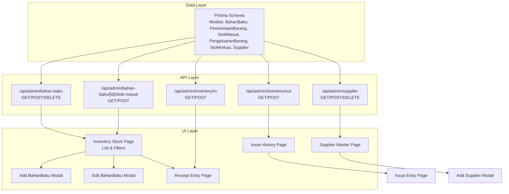
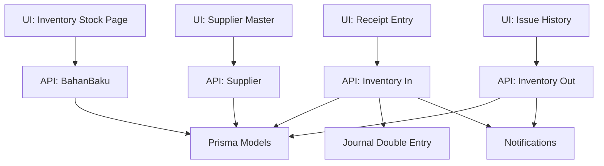
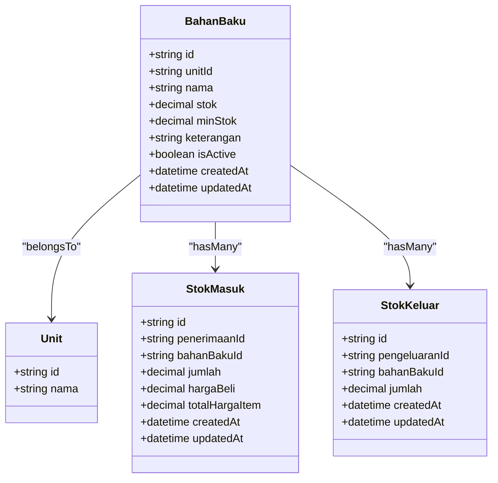
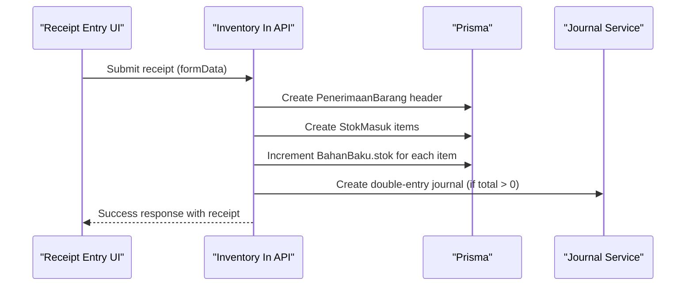
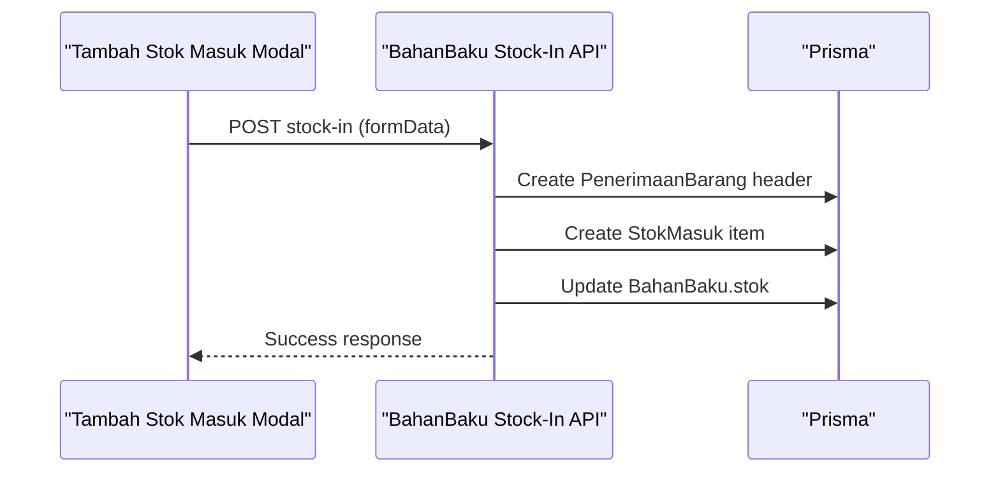
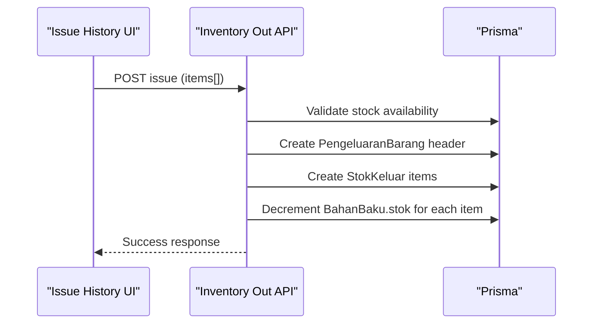
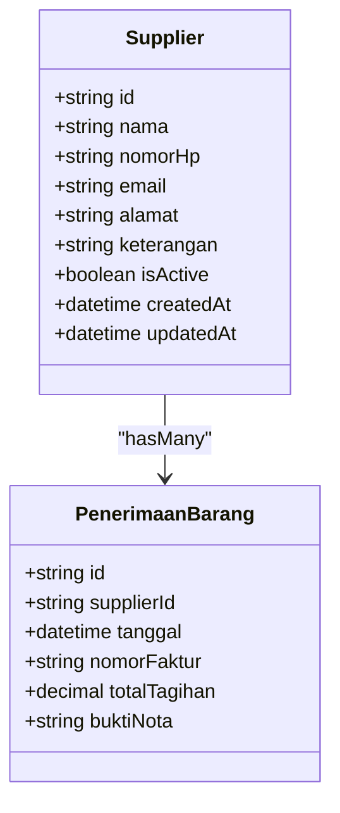
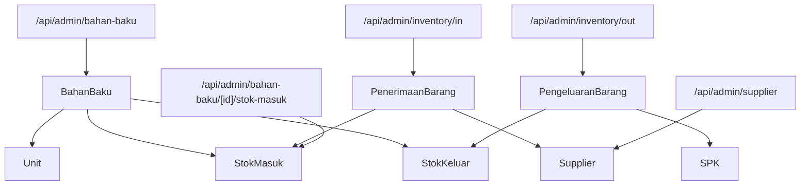

# Raw Materials & Stock Management

<cite>
**Referenced Files in This Document**
- [schema.prisma](file://prisma/schema.prisma)
- [20260419144230_init/migration.sql](file://prisma/migrations/20260419144230_init/migration.sql)
- [bahan-baku/route.ts](file://src/app/api/admin/bahan-baku/route.ts)
- [bahan-baku/[id]/stok-masuk/route.ts](file://src/app/api/admin/bahan-baku/[id]/stok-masuk/route.ts)
- [inventory/in/route.ts](file://src/app/api/admin/inventory/in/route.ts)
- [inventory/out/route.ts](file://src/app/api/admin/inventory/out/route.ts)
- [supplier/route.ts](file://src/app/api/admin/supplier/route.ts)
- [inventory/stock/page.tsx](file://src/app/(LoggedIn)/inventory/stock/page.tsx)
- [inventory/stock/components/columns.tsx](file://src/app/(LoggedIn)/inventory/stock/components/columns.tsx)
- [inventory/stock/components/add-bahan-baku-modal.tsx](file://src/app/(LoggedIn)/inventory/stock/components/add-bahan-baku-modal.tsx)
- [inventory/stock/components/edit-bahan-baku-modal.tsx](file://src/app/(LoggedIn)/inventory/stock/components/edit-bahan-baku-modal.tsx)
- [inventory/stock/components/tambah-stok-masuk-modal.tsx](file://src/app/(LoggedIn)/inventory/stock/components/tambah-stok-masuk-modal.tsx)
- [inventory/in/create/page.tsx](file://src/app/(LoggedIn)/inventory/in/create/page.tsx)
- [inventory/out/page.tsx](file://src/app/(LoggedIn)/inventory/out/page.tsx)
- [master/supplier/page.tsx](file://src/app/(LoggedIn)/master/supplier/page.tsx)
- [master/supplier/components/add-supplier-modal.tsx](file://src/app/(LoggedIn)/master/supplier/components/add-supplier-modal.tsx)
- [master/supplier/components/view-supplier-modal.tsx](file://src/app/(LoggedIn)/master/supplier/components/view-supplier-modal.tsx)
- [part3-produksi-inventori.plantuml](file://diagram/class/part3-produksi-inventori.plantuml)
- [gudang.puml](file://diagram/activity/gudang.puml)
</cite>

## Table of Contents
1. [Introduction](#introduction)
2. [Project Structure](#project-structure)
3. [Core Components](#core-components)
4. [Architecture Overview](#architecture-overview)
5. [Detailed Component Analysis](#detailed-component-analysis)
6. [Dependency Analysis](#dependency-analysis)
7. [Performance Considerations](#performance-considerations)
8. [Troubleshooting Guide](#troubleshooting-guide)
9. [Conclusion](#conclusion)

## Introduction
This document explains the raw materials tracking system with a focus on BahanBaku (raw materials), stock movements (StokMasuk and StokKeluar), supplier management, and inventory valuation. It covers material acquisition workflows, stock entry procedures, material issuance processes, inventory reconciliation methods, minimum stock alerts, supplier invoicing integration, and cost calculation methodologies. Practical examples illustrate material receipt processing, production consumption tracking, and inventory reporting mechanisms.

## Project Structure
The system is organized around:
- Prisma schema defining core entities and relationships
- API routes handling CRUD and business logic for raw materials, receipts, issues, and suppliers
- Frontend pages and modals for managing stock, recording receipts, issuing stock, and maintaining supplier records

**Diagram sources**
- [schema.prisma](file://prisma/schema.prisma)
- [bahan-baku/route.ts](file://src/app/api/admin/bahan-baku/route.ts)
- [bahan-baku/[id]/stok-masuk/route.ts](file://src/app/api/admin/bahan-baku/[id]/stok-masuk/route.ts)
- [inventory/in/route.ts](file://src/app/api/admin/inventory/in/route.ts)
- [inventory/out/route.ts](file://src/app/api/admin/inventory/out/route.ts)
- [supplier/route.ts](file://src/app/api/admin/supplier/route.ts)
- [inventory/stock/page.tsx](file://src/app/(LoggedIn)/inventory/stock/page.tsx)
- [inventory/in/create/page.tsx](file://src/app/(LoggedIn)/inventory/in/create/page.tsx)
- [inventory/out/page.tsx](file://src/app/(LoggedIn)/inventory/out/page.tsx)
- [master/supplier/page.tsx](file://src/app/(LoggedIn)/master/supplier/page.tsx)

**Section sources**
- [schema.prisma](file://prisma/schema.prisma)
- [bahan-baku/route.ts](file://src/app/api/admin/bahan-baku/route.ts)
- [inventory/in/route.ts](file://src/app/api/admin/inventory/in/route.ts)
- [inventory/out/route.ts](file://src/app/api/admin/inventory/out/route.ts)
- [supplier/route.ts](file://src/app/api/admin/supplier/route.ts)
- [inventory/stock/page.tsx](file://src/app/(LoggedIn)/inventory/stock/page.tsx)
- [inventory/in/create/page.tsx](file://src/app/(LoggedIn)/inventory/in/create/page.tsx)
- [inventory/out/page.tsx](file://src/app/(LoggedIn)/inventory/out/page.tsx)
- [master/supplier/page.tsx](file://src/app/(LoggedIn)/master/supplier/page.tsx)

## Core Components
- BahanBaku: Raw material entity with unit association, current stock, minimum stock threshold, and active flag.
- PenerimaanBarang: Receipt header capturing supplier, invoice number, date, attachments, and total amount.
- StokMasuk: Line items representing received quantities, purchase price, and computed item total.
- PengeluaranBarang: Issue header linking to SPK (production work order) when applicable.
- StokKeluar: Line items representing issued quantities against specific BahanBaku.
- Supplier: Vendor record supporting invoicing and supplier management.

Key behaviors:
- Stock updates are atomic via transactions during receipt and issue operations.
- Receipts trigger journal entries for accounting alignment.
- Low stock checks notify administrators and warehouse staff.
- UI supports filtering by status, stock condition, and search terms.

**Section sources**
- [schema.prisma](file://prisma/schema.prisma)
- [20260419144230_init/migration.sql](file://prisma/migrations/20260419144230_init/migration.sql)
- [bahan-baku/route.ts](file://src/app/api/admin/bahan-baku/route.ts)
- [bahan-baku/[id]/stok-masuk/route.ts](file://src/app/api/admin/bahan-baku/[id]/stok-masuk/route.ts)
- [inventory/in/route.ts](file://src/app/api/admin/inventory/in/route.ts)
- [inventory/out/route.ts](file://src/app/api/admin/inventory/out/route.ts)
- [inventory/stock/page.tsx](file://src/app/(LoggedIn)/inventory/stock/page.tsx)

## Architecture Overview
The system follows a layered architecture:
- Data modeling via Prisma with explicit foreign keys and indexes
- API routes encapsulating business logic for receipts, issues, and supplier management
- UI pages and modals orchestrating user interactions and invoking API endpoints
- Notifications and financial integrations triggered after successful operations

**Diagram sources**
- [schema.prisma](file://prisma/schema.prisma)
- [bahan-baku/route.ts](file://src/app/api/admin/bahan-baku/route.ts)
- [inventory/in/route.ts](file://src/app/api/admin/inventory/in/route.ts)
- [inventory/out/route.ts](file://src/app/api/admin/inventory/out/route.ts)
- [supplier/route.ts](file://src/app/api/admin/supplier/route.ts)

**Section sources**
- [schema.prisma](file://prisma/schema.prisma)
- [inventory/in/route.ts](file://src/app/api/admin/inventory/in/route.ts)
- [inventory/out/route.ts](file://src/app/api/admin/inventory/out/route.ts)

## Detailed Component Analysis

### BahanBaku Entity and Stock Management
BahanBaku stores raw material metadata, unit association, current stock, minimum stock threshold, and active status. The system computes stock conditions (normal, low stock, out-of-stock) client-side for display and filtering.

**Diagram sources**
- [schema.prisma](file://prisma/schema.prisma)

**Section sources**
- [schema.prisma](file://prisma/schema.prisma)
- [inventory/stock/page.tsx](file://src/app/(LoggedIn)/inventory/stock/page.tsx)
- [inventory/stock/components/columns.tsx](file://src/app/(LoggedIn)/inventory/stock/components/columns.tsx)
- [inventory/stock/components/add-bahan-baku-modal.tsx](file://src/app/(LoggedIn)/inventory/stock/components/add-bahan-baku-modal.tsx)
- [inventory/stock/components/edit-bahan-baku-modal.tsx](file://src/app/(LoggedIn)/inventory/stock/components/edit-bahan-baku-modal.tsx)

### Material Acquisition Workflow (Receipts)
The receipt workflow captures supplier, invoice details, and multiple receipt items. It validates inputs, uploads supporting documents, updates stock atomically, and posts journal entries for accounting.

**Diagram sources**
- [inventory/in/create/page.tsx](file://src/app/(LoggedIn)/inventory/in/create/page.tsx)
- [inventory/in/route.ts](file://src/app/api/admin/inventory/in/route.ts)
- [schema.prisma](file://prisma/schema.prisma)

**Section sources**
- [inventory/in/create/page.tsx](file://src/app/(LoggedIn)/inventory/in/create/page.tsx)
- [inventory/in/route.ts](file://src/app/api/admin/inventory/in/route.ts)
- [schema.prisma](file://prisma/schema.prisma)

### Stock Entry Procedures (Direct Stock Adjustment)
Users can record stock adjustments for a specific BahanBaku via the stock adjustment modal. The system persists the movement, attaches supplier and invoice info, and updates stock.

**Diagram sources**
- [bahan-baku/[id]/stok-masuk/route.ts](file://src/app/api/admin/bahan-baku/[id]/stok-masuk/route.ts)
- [inventory/stock/components/tambah-stok-masuk-modal.tsx](file://src/app/(LoggedIn)/inventory/stock/components/tambah-stok-masuk-modal.tsx)
- [schema.prisma](file://prisma/schema.prisma)

**Section sources**
- [bahan-baku/[id]/stok-masuk/route.ts](file://src/app/api/admin/bahan-baku/[id]/stok-masuk/route.ts)
- [inventory/stock/components/tambah-stok-masuk-modal.tsx](file://src/app/(LoggedIn)/inventory/stock/components/tambah-stok-masuk-modal.tsx)
- [schema.prisma](file://prisma/schema.prisma)

### Material Issuance Processes (Production Consumption)
Issuing stock decrements BahanBaku stock and records StokKeluar items linked to a production SPK when applicable. The system validates stock availability before committing.

**Diagram sources**
- [inventory/out/page.tsx](file://src/app/(LoggedIn)/inventory/out/page.tsx)
- [inventory/out/route.ts](file://src/app/api/admin/inventory/out/route.ts)
- [schema.prisma](file://prisma/schema.prisma)

**Section sources**
- [inventory/out/page.tsx](file://src/app/(LoggedIn)/inventory/out/page.tsx)
- [inventory/out/route.ts](file://src/app/api/admin/inventory/out/route.ts)
- [schema.prisma](file://prisma/schema.prisma)

### Supplier Management
Supplier records support invoicing and supplier lookup. The system enforces uniqueness on supplier names and allows bulk operations.

**Diagram sources**
- [schema.prisma](file://prisma/schema.prisma)

**Section sources**
- [supplier/route.ts](file://src/app/api/admin/supplier/route.ts)
- [master/supplier/page.tsx](file://src/app/(LoggedIn)/master/supplier/page.tsx)
- [master/supplier/components/add-supplier-modal.tsx](file://src/app/(LoggedIn)/master/supplier/components/add-supplier-modal.tsx)
- [master/supplier/components/view-supplier-modal.tsx](file://src/app/(LoggedIn)/master/supplier/components/view-supplier-modal.tsx)
- [schema.prisma](file://prisma/schema.prisma)

### Inventory Valuation and Cost Calculation
- Receipt valuation: Items store unit cost and computed item total; receipt header aggregates totals.
- Accounting integration: Receipts post double-entry journals (Debit: HPP/Persediaan Bahan Baku, Credit: Hutang Usaha) when amounts exist.
- No centralized average cost or FIFO/LIFO logic is implemented in the schema; valuation relies on recorded unit costs at receipt time.

**Section sources**
- [inventory/in/route.ts](file://src/app/api/admin/inventory/in/route.ts)
- [schema.prisma](file://prisma/schema.prisma)

### Minimum Stock Alerts and Batch Tracking
- Minimum stock alerts: The system checks and notifies roles when stock falls below thresholds after receipt or issue operations.
- Batch tracking: The schema defines separate receipt and issue headers with line items; however, no dedicated batch number or expiry fields are present in the current schema.

**Section sources**
- [inventory/in/route.ts](file://src/app/api/admin/inventory/in/route.ts)
- [inventory/out/route.ts](file://src/app/api/admin/inventory/out/route.ts)
- [schema.prisma](file://prisma/schema.prisma)

### Supplier Invoicing Integration
- Receipts capture supplier, invoice number, date, and optional attachment.
- Financial integration posts journal entries automatically upon successful receipt creation.

**Section sources**
- [inventory/in/route.ts](file://src/app/api/admin/inventory/in/route.ts)
- [schema.prisma](file://prisma/schema.prisma)

### Inventory Reporting Mechanisms
- Receipt and issue listings support filtering by date range, supplier/product, and keywords.
- Stock listing displays current stock, minimum stock thresholds, and status indicators.

**Section sources**
- [inventory/in/route.ts](file://src/app/api/admin/inventory/in/route.ts)
- [inventory/out/route.ts](file://src/app/api/admin/inventory/out/route.ts)
- [inventory/stock/page.tsx](file://src/app/(LoggedIn)/inventory/stock/page.tsx)

## Dependency Analysis
The following diagram maps core dependencies among models and API routes:

**Diagram sources**
- [schema.prisma](file://prisma/schema.prisma)
- [bahan-baku/route.ts](file://src/app/api/admin/bahan-baku/route.ts)
- [bahan-baku/[id]/stok-masuk/route.ts](file://src/app/api/admin/bahan-baku/[id]/stok-masuk/route.ts)
- [inventory/in/route.ts](file://src/app/api/admin/inventory/in/route.ts)
- [inventory/out/route.ts](file://src/app/api/admin/inventory/out/route.ts)
- [supplier/route.ts](file://src/app/api/admin/supplier/route.ts)

**Section sources**
- [schema.prisma](file://prisma/schema.prisma)
- [part3-produksi-inventori.plantuml](file://diagram/class/part3-produksi-inventori.plantuml)

## Performance Considerations
- Indexes on foreign keys and frequently queried fields (e.g., tanggal, supplierId, addedById) improve query performance for receipts and issues.
- Pagination and filtering reduce payload sizes for listing endpoints.
- Transactional writes ensure data consistency for stock updates and journal posting.

[No sources needed since this section provides general guidance]

## Troubleshooting Guide
Common issues and resolutions:
- Unauthorized or forbidden access: Ensure the user has admin or gudang role and is authenticated.
- Validation errors on receipts/issues: Verify required fields (items array, quantities, supplier presence where applicable).
- Insufficient stock on issue: Confirm available stock and adjust quantities accordingly.
- Duplicate supplier or raw material names: Ensure unique names before creation.

**Section sources**
- [bahan-baku/route.ts](file://src/app/api/admin/bahan-baku/route.ts)
- [bahan-baku/[id]/stok-masuk/route.ts](file://src/app/api/admin/bahan-baku/[id]/stok-masuk/route.ts)
- [inventory/in/route.ts](file://src/app/api/admin/inventory/in/route.ts)
- [inventory/out/route.ts](file://src/app/api/admin/inventory/out/route.ts)
- [supplier/route.ts](file://src/app/api/admin/supplier/route.ts)

## Conclusion
The raw materials tracking system integrates receipt and issue workflows with supplier management and financial journaling. It provides robust stock visibility, automated low-stock notifications, and straightforward reporting. While batch tracking and advanced costing methods are not currently implemented, the schema and APIs offer clear extension points for future enhancements.