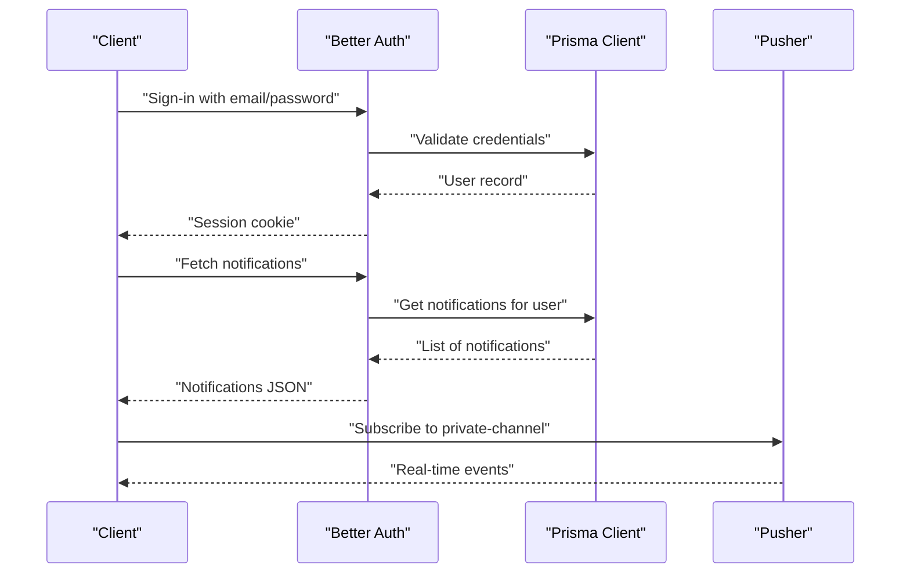
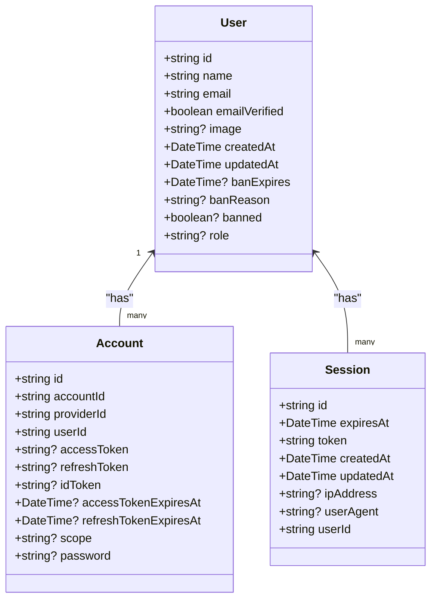
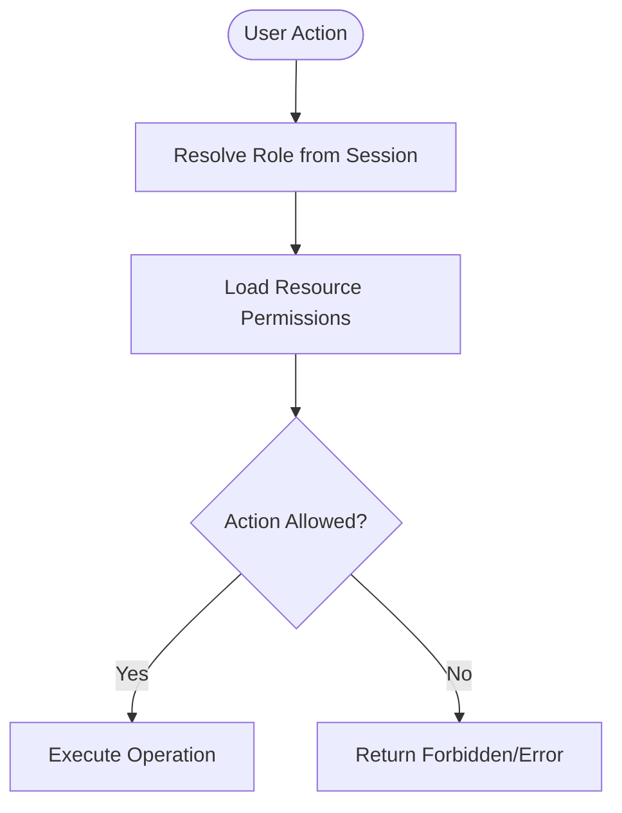
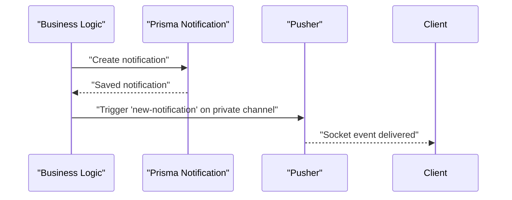
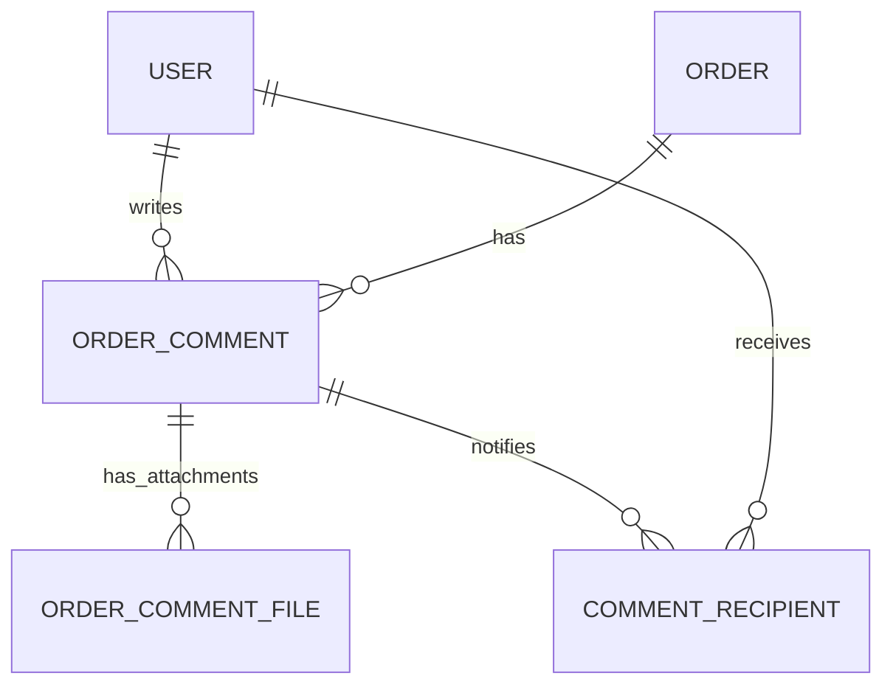
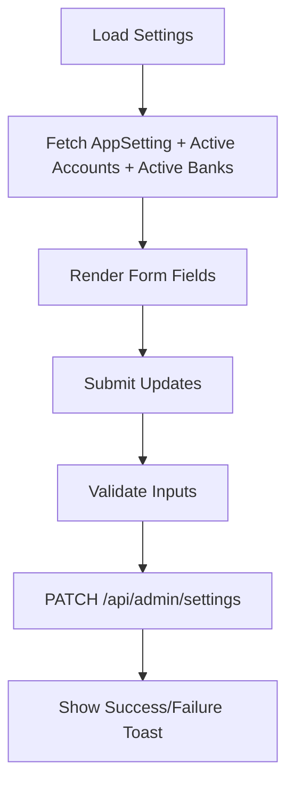
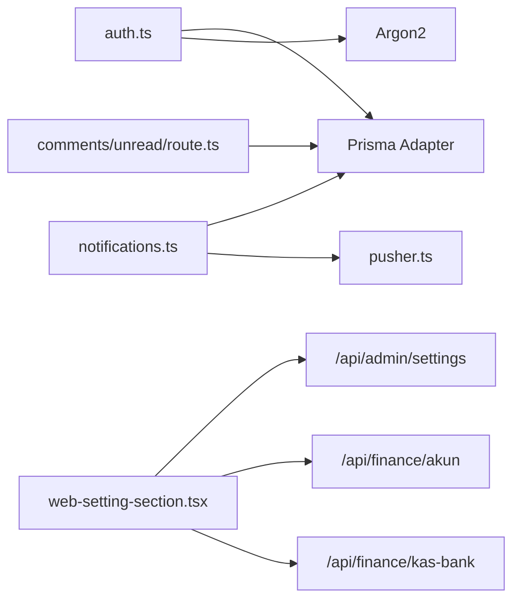

# System & Infrastructure Entities

<cite>
**Referenced Files in This Document**
- [schema.prisma](file://prisma/schema.prisma)
- [auth.ts](file://src/lib/auth.ts)
- [permissions.ts](file://src/lib/permissions.ts)
- [roles.ts](file://src/config/roles.ts)
- [notifications.ts](file://src/lib/notifications.ts)
- [route.ts](file://src/app/api/notifications/route.ts)
- [route.ts](file://src/app/api/comments/unread/route.ts)
- [web-setting-section.tsx](file://src/app/(LoggedIn)/settings/web-setting/web-setting-section.tsx)
- [route.ts](file://src/app/api/check-account/route.ts)
- [pusher.ts](file://src/lib/pusher.ts)
</cite>

## Table of Contents
1. [Introduction](#introduction)
2. [Project Structure](#project-structure)
3. [Core Components](#core-components)
4. [Architecture Overview](#architecture-overview)
5. [Detailed Component Analysis](#detailed-component-analysis)
6. [Dependency Analysis](#dependency-analysis)
7. [Performance Considerations](#performance-considerations)
8. [Troubleshooting Guide](#troubleshooting-guide)
9. [Conclusion](#conclusion)
10. [Appendices](#appendices)

## Introduction
This document explains the system-level entities and infrastructure supporting Authentication, Sessions, Accounts, Notifications, Comments, and Application Settings. It covers session lifecycle, user authentication flows, notification delivery, role-based access control (RBAC), and configuration management. It also includes practical workflows for user management, notification triggers, and system maintenance procedures.

## Project Structure
The system is organized around:
- Prisma schema defining entities and relationships
- Better Auth integration for authentication and RBAC
- API routes for notifications and comments
- Frontend settings panel for application configuration
- Real-time notifications via Pusher

```mermaid
graph TB
subgraph "Auth & Identity"
U["User"]
S["Session"]
A["Account"]
V["Verification"]
end
subgraph "Notifications"
N["Notification"]
NR["CommentRecipient"]
NC["OrderComment"]
NCF["OrderCommentFile"]
end
subgraph "Application Settings"
AS["AppSetting"]
AA["Akun"]
KB["KasBank"]
end
U < --> S
U < --> A
U < --> N
U < --> NC
NC < --> NCF
NC < --> NR
AS --> AA
AS -. "invoiceRekeningIds" .-> KB
```

**Diagram sources**
- [schema.prisma:15-90](file://prisma/schema.prisma#L15-L90)
- [schema.prisma:603-674](file://prisma/schema.prisma#L603-L674)
- [schema.prisma:569-597](file://prisma/schema.prisma#L569-L597)

**Section sources**
- [schema.prisma:15-90](file://prisma/schema.prisma#L15-L90)
- [schema.prisma:603-674](file://prisma/schema.prisma#L603-L674)
- [schema.prisma:569-597](file://prisma/schema.prisma#L569-L597)

## Core Components
- Authentication and Session Management: Better Auth configured with email/password, cookie-based sessions, and admin plugin for RBAC.
- Role-Based Access Control: Centralized roles and resource permissions mapped to actions.
- Notifications: Database-backed notifications with real-time delivery via Pusher.
- Comments: Threaded order comments with recipient tracking and read-state.
- Application Settings: Single-row settings for branding, prefixes, defaults, and financial mappings.

**Section sources**
- [auth.ts:20-92](file://src/lib/auth.ts#L20-L92)
- [permissions.ts:1-67](file://src/lib/permissions.ts#L1-L67)
- [roles.ts:1-18](file://src/config/roles.ts#L1-L18)
- [notifications.ts:1-122](file://src/lib/notifications.ts#L1-L122)
- [schema.prisma:603-674](file://prisma/schema.prisma#L603-L674)
- [schema.prisma:569-597](file://prisma/schema.prisma#L569-L597)

## Architecture Overview
High-level flow for authentication, session handling, and notifications:



**Diagram sources**
- [auth.ts:20-92](file://src/lib/auth.ts#L20-L92)
- [route.ts:14-38](file://src/app/api/notifications/route.ts#L14-L38)
- [pusher.ts:1-11](file://src/lib/pusher.ts#L1-L11)

## Detailed Component Analysis

### Authentication, Session, and Account Entities
- User: identity with optional ban fields, role, and relations to accounts, sessions, notifications, orders, and comments.
- Session: stores session tokens, expiry, IP, agent, and impersonation metadata.
- Account: supports email/password and third-party OAuth identifiers.



**Diagram sources**
- [schema.prisma:15-42](file://prisma/schema.prisma#L15-L42)
- [schema.prisma:44-58](file://prisma/schema.prisma#L44-L58)
- [schema.prisma:60-78](file://prisma/schema.prisma#L60-L78)

**Section sources**
- [schema.prisma:15-42](file://prisma/schema.prisma#L15-L42)
- [schema.prisma:44-58](file://prisma/schema.prisma#L44-L58)
- [schema.prisma:60-78](file://prisma/schema.prisma#L60-L78)

### Role-Based Access Control (RBAC)
- Central roles: admin, kasir, designer, produksi, gudang.
- Resource permissions define allowed actions per role.
- Admin plugin integrates with Better Auth to enforce permissions.



**Diagram sources**
- [permissions.ts:1-67](file://src/lib/permissions.ts#L1-L67)
- [roles.ts:1-18](file://src/config/roles.ts#L1-L18)
- [auth.ts:78-91](file://src/lib/auth.ts#L78-L91)

**Section sources**
- [permissions.ts:1-67](file://src/lib/permissions.ts#L1-L67)
- [roles.ts:1-18](file://src/config/roles.ts#L1-L18)
- [auth.ts:78-91](file://src/lib/auth.ts#L78-L91)

### Notifications System
- Notification entity stores title, message, type, read-state, and link.
- Real-time delivery via Pusher channels per user.
- Helpers for role-based notifications and low-stock alerts.



**Diagram sources**
- [notifications.ts:18-42](file://src/lib/notifications.ts#L18-L42)
- [pusher.ts:1-11](file://src/lib/pusher.ts#L1-L11)

**Section sources**
- [schema.prisma:603-618](file://prisma/schema.prisma#L603-L618)
- [notifications.ts:1-122](file://src/lib/notifications.ts#L1-L122)
- [route.ts:14-38](file://src/app/api/notifications/route.ts#L14-L38)
- [pusher.ts:1-11](file://src/lib/pusher.ts#L1-L11)

### Comments and Recipients
- OrderComment: threaded comments under orders with attachments.
- CommentRecipient: tracks read-state per user for each comment.
- Unread comments endpoint aggregates counts for the current user.



**Diagram sources**
- [schema.prisma:632-674](file://prisma/schema.prisma#L632-L674)

**Section sources**
- [schema.prisma:632-674](file://prisma/schema.prisma#L632-L674)
- [route.ts:6-25](file://src/app/api/comments/unread/route.ts#L6-L25)

### Application Settings
- AppSetting: single-row table for branding, prefixes, defaults, and financial mappings.
- Frontend panel loads accounts and active bank accounts, supports logo upload, and persists selections.



**Diagram sources**
- [web-setting-section.tsx](file://src/app/(LoggedIn)/settings/web-setting/web-setting-section.tsx#L30-L129)
- [schema.prisma:569-597](file://prisma/schema.prisma#L569-L597)

**Section sources**
- [schema.prisma:569-597](file://prisma/schema.prisma#L569-L597)
- [web-setting-section.tsx](file://src/app/(LoggedIn)/settings/web-setting/web-setting-section.tsx#L1-L421)

## Dependency Analysis
- Auth depends on Prisma adapter and Argon2 for hashing.
- Notifications depend on Prisma and Pusher SDK.
- Settings UI depends on API endpoints for settings, chart of accounts, and bank accounts.
- Comments unread endpoint depends on Prisma comment recipient model.



**Diagram sources**
- [auth.ts:1-11](file://src/lib/auth.ts#L1-L11)
- [notifications.ts:1-5](file://src/lib/notifications.ts#L1-L5)
- [pusher.ts:1-11](file://src/lib/pusher.ts#L1-L11)
- [web-setting-section.tsx](file://src/app/(LoggedIn)/settings/web-setting/web-setting-section.tsx#L30-L42)
- [route.ts:6-25](file://src/app/api/comments/unread/route.ts#L6-L25)

**Section sources**
- [auth.ts:1-11](file://src/lib/auth.ts#L1-L11)
- [notifications.ts:1-5](file://src/lib/notifications.ts#L1-L5)
- [pusher.ts:1-11](file://src/lib/pusher.ts#L1-L11)
- [web-setting-section.tsx](file://src/app/(LoggedIn)/settings/web-setting/web-setting-section.tsx#L30-L42)
- [route.ts:6-25](file://src/app/api/comments/unread/route.ts#L6-L25)

## Performance Considerations
- Session expiration: configured to 30 days; ensure clients handle refresh appropriately.
- Notification queries: paginated with a default limit; consider indexing and caching for high-volume users.
- Low-stock notifications: anti-duplication checks reduce redundant alerts.
- Real-time events: ensure Pusher cluster configuration matches environment.

[No sources needed since this section provides general guidance]

## Troubleshooting Guide
- Unauthorized access to protected APIs: verify session retrieval and header forwarding.
- Notification delivery failures: check Pusher credentials and TLS configuration.
- Comments unread count errors: validate Prisma model relations and query filters.
- Account provider check failures: confirm session validity and account lookup conditions.

**Section sources**
- [route.ts:14-38](file://src/app/api/notifications/route.ts#L14-L38)
- [route.ts:6-25](file://src/app/api/comments/unread/route.ts#L6-L25)
- [route.ts:6-40](file://src/app/api/check-account/route.ts#L6-L40)
- [pusher.ts:1-11](file://src/lib/pusher.ts#L1-L11)

## Conclusion
The system integrates Better Auth for secure identity and RBAC, Prisma for robust data modeling, and Pusher for real-time notifications. Application settings are centralized and editable via a dedicated UI. The design supports scalable user management, targeted notifications, and maintainable configuration.

[No sources needed since this section summarizes without analyzing specific files]

## Appendices

### User Management Workflows
- Create user: use admin client to register with validated role.
- Update role: adjust role via admin APIs and propagate RBAC changes.
- Deactivate/ban: leverage user-level flags and session invalidation.

**Section sources**
- [add-user-modal.tsx](file://src/app/(LoggedIn)/master/user/components/add-user-modal.tsx#L46-L78)
- [roles.ts:1-18](file://src/config/roles.ts#L1-L18)
- [auth.ts:78-91](file://src/lib/auth.ts#L78-L91)

### Notification Delivery Mechanisms
- Database persistence: create notification records with type and target.
- Real-time delivery: trigger Pusher events on private channels.
- Bulk role notifications: broadcast to users sharing target roles.

**Section sources**
- [notifications.ts:18-61](file://src/lib/notifications.ts#L18-L61)
- [route.ts:14-38](file://src/app/api/notifications/route.ts#L14-L38)
- [pusher.ts:1-11](file://src/lib/pusher.ts#L1-L11)

### System Maintenance Procedures
- Clean up soft-deleted rows periodically using trash endpoints.
- Rotate secrets and verify Pusher connectivity.
- Audit settings updates and financial mappings.

**Section sources**
- [schema.prisma:26-40](file://prisma/schema.prisma#L26-L40)
- [web-setting-section.tsx](file://src/app/(LoggedIn)/settings/web-setting/web-setting-section.tsx#L72-L129)