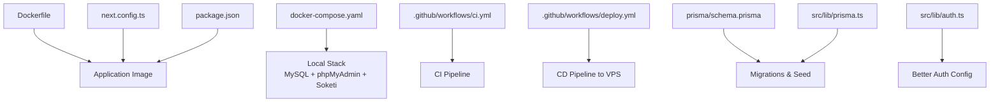
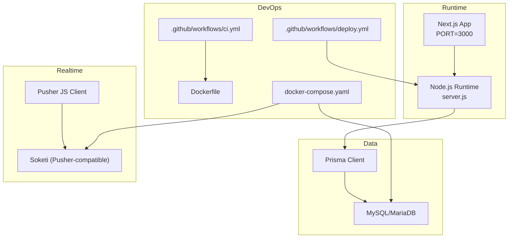
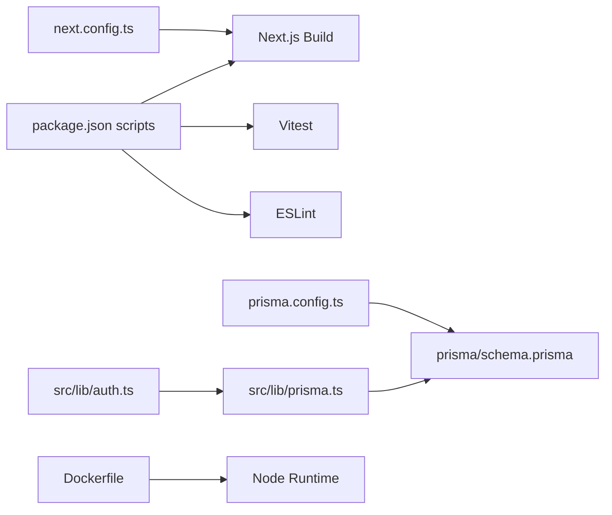

# Deployment & DevOps

<cite>
**Referenced Files in This Document**
- [Dockerfile](file://Dockerfile)
- [docker-compose.yaml](file://docker-compose.yaml)
- [.github/workflows/ci.yml](file://.github/workflows/ci.yml)
- [.github/workflows/deploy.yml](file://.github/workflows/deploy.yml)
- [package.json](file://package.json)
- [next.config.ts](file://next.config.ts)
- [prisma/schema.prisma](file://prisma/schema.prisma)
- [prisma.config.ts](file://prisma.config.ts)
- [src/lib/prisma.ts](file://src/lib/prisma.ts)
- [src/lib/auth.ts](file://src/lib/auth.ts)
</cite>

## Table of Contents
1. [Introduction](#introduction)
2. [Project Structure](#project-structure)
3. [Core Components](#core-components)
4. [Architecture Overview](#architecture-overview)
5. [Detailed Component Analysis](#detailed-component-analysis)
6. [Dependency Analysis](#dependency-analysis)
7. [Performance Considerations](#performance-considerations)
8. [Troubleshooting Guide](#troubleshooting-guide)
9. [Conclusion](#conclusion)
10. [Appendices](#appendices)

## Introduction
This document provides comprehensive deployment and DevOps guidance for the Point of Sale (POS) system. It covers containerization with Docker, local development orchestration via docker-compose, CI/CD pipelines using GitHub Actions, production deployment strategies, environment configuration, database migrations, rollback procedures, monitoring, maintenance, scaling, load balancing, SSL/TLS, security hardening, backup and disaster recovery, and operational best practices.

## Project Structure
The repository includes:
- Application code under src/
- Database schema and migrations under prisma/
- Containerization artifacts: Dockerfile and docker-compose.yaml
- CI/CD workflows under .github/workflows/
- Build and runtime configuration files: next.config.ts, package.json
- Database connectivity and auth configuration under src/lib/

**Diagram sources**
- [Dockerfile:1-64](file://Dockerfile#L1-L64)
- [docker-compose.yaml:1-47](file://docker-compose.yaml#L1-L47)
- [.github/workflows/ci.yml:1-60](file://.github/workflows/ci.yml#L1-L60)
- [.github/workflows/deploy.yml:1-29](file://.github/workflows/deploy.yml#L1-L29)
- [next.config.ts:1-11](file://next.config.ts#L1-L11)
- [package.json:1-95](file://package.json#L1-L95)
- [prisma/schema.prisma:1-675](file://prisma/schema.prisma#L1-L675)
- [src/lib/prisma.ts:1-25](file://src/lib/prisma.ts#L1-L25)
- [src/lib/auth.ts:1-95](file://src/lib/auth.ts#L1-L95)

**Section sources**
- [Dockerfile:1-64](file://Dockerfile#L1-L64)
- [docker-compose.yaml:1-47](file://docker-compose.yaml#L1-L47)
- [.github/workflows/ci.yml:1-60](file://.github/workflows/ci.yml#L1-L60)
- [.github/workflows/deploy.yml:1-29](file://.github/workflows/deploy.yml#L1-L29)
- [next.config.ts:1-11](file://next.config.ts#L1-L11)
- [package.json:1-95](file://package.json#L1-L95)
- [prisma/schema.prisma:1-675](file://prisma/schema.prisma#L1-L675)
- [prisma.config.ts:1-13](file://prisma.config.ts#L1-L13)
- [src/lib/prisma.ts:1-25](file://src/lib/prisma.ts#L1-L25)
- [src/lib/auth.ts:1-95](file://src/lib/auth.ts#L1-L95)

## Core Components
- Containerization: Multi-stage Docker build targeting a standalone Next.js runtime.
- Local Orchestration: docker-compose defines MySQL, phpMyAdmin, and Soketi services.
- CI/CD: GitHub Actions workflows for building, testing, and deploying to a VPS.
- Database: Prisma schema and migrations for MySQL/MariaDB-compatible adapter.
- Runtime: Next.js standalone output configured for minimal footprint.

Key deployment scripts and configuration:
- Build pipeline integrates Prisma generation and migrations prior to Next.js build.
- Standalone output enables fast startup and reduced attack surface.
- Environment variables are consumed via dotenv and process.env.

**Section sources**
- [Dockerfile:1-64](file://Dockerfile#L1-L64)
- [docker-compose.yaml:1-47](file://docker-compose.yaml#L1-L47)
- [package.json:6-13](file://package.json#L6-L13)
- [next.config.ts:3-8](file://next.config.ts#L3-L8)
- [prisma/schema.prisma:1-12](file://prisma/schema.prisma#L1-L12)
- [prisma.config.ts:4-13](file://prisma.config.ts#L4-L13)
- [src/lib/prisma.ts:9-24](file://src/lib/prisma.ts#L9-L24)

## Architecture Overview
The deployment architecture comprises:
- Frontend: Next.js application built with standalone output.
- Backend: Node.js runtime serving static and server-side rendered pages.
- Database: MySQL/MariaDB-backed via Prisma adapter.
- Realtime: Self-hosted Pusher-compatible Soketi for WebSocket events.
- CI/CD: GitHub Actions automating tests and deployments.
- Orchestration: docker-compose for local development and testing.

**Diagram sources**
- [Dockerfile:38-64](file://Dockerfile#L38-L64)
- [docker-compose.yaml:5-44](file://docker-compose.yaml#L5-L44)
- [.github/workflows/ci.yml:10-60](file://.github/workflows/ci.yml#L10-L60)
- [.github/workflows/deploy.yml:8-29](file://.github/workflows/deploy.yml#L8-L29)
- [prisma/schema.prisma:1-12](file://prisma/schema.prisma#L1-L12)
- [src/lib/prisma.ts:9-24](file://src/lib/prisma.ts#L9-L24)
- [src/lib/auth.ts:20-92](file://src/lib/auth.ts#L20-L92)

## Detailed Component Analysis

### Docker Configuration
- Multi-stage build:
  - Base stage uses node:20-alpine.
  - Dependencies stage installs packages based on lockfiles.
  - Builder stage copies node_modules and builds Next.js app.
  - Runner stage prepares a secure, non-root user and exposes port 3000.
- Standalone output:
  - next.config.ts sets output to standalone for minimal runtime.
  - Dockerfile copies .next/standalone and sets CMD to node server.js.
- Telemetry:
  - Optional environment variables to disable telemetry during build/runtime.

Operational implications:
- Smaller, immutable images suitable for container registries and Kubernetes.
- Reduced startup time due to standalone packaging.
- Non-root user improves security posture.

**Section sources**
- [Dockerfile:1-64](file://Dockerfile#L1-L64)
- [next.config.ts:3-8](file://next.config.ts#L3-L8)

### Local Development Orchestration (docker-compose)
Services:
- MySQL 8.0 with persistent volume and exposed port 3307.
- phpMyAdmin connected to the db service.
- Soketi (self-hosted Pusher-compatible) with WebSocket and metrics ports.
Environment variables:
- Uses environment variables for Soketi app credentials and limits.
- Exposes ports for local access and metrics scraping.

Operational implications:
- Reproducible local environment for frontend, backend, database, and realtime.
- phpMyAdmin simplifies schema inspection and data verification.

**Section sources**
- [docker-compose.yaml:1-47](file://docker-compose.yaml#L1-L47)

### CI/CD Pipelines (GitHub Actions)
Workflows:
- ci.yml:
  - Runs on push and pull_request to main.
  - Spins up a MySQL service for testing.
  - Installs dependencies, generates Prisma client, runs lint and tests, and builds the app.
  - Sets environment variables for database URL, auth secret, and Pusher keys.
- deploy.yml:
  - Deploys on push to main.
  - Executes remote SSH commands to pull code, install dependencies, generate Prisma client, apply migrations, build, and restart the app using PM2.

Operational implications:
- Automated quality gates with database-backed tests.
- Single-command deployment to VPS with zero-downtime restarts via PM2.

**Section sources**
- [.github/workflows/ci.yml:1-60](file://.github/workflows/ci.yml#L1-L60)
- [.github/workflows/deploy.yml:1-29](file://.github/workflows/deploy.yml#L1-L29)

### Database Schema and Migration Strategy
Schema:
- Defines models for users, orders, inventory, finance, and notifications.
- Uses enums for statuses, channels, and payment methods.
- Includes soft delete support and indexes for performance.

Migration strategy:
- Prisma migrations stored under prisma/migrations/.
- Migration lock file prevents concurrent writes.
- Prisma config reads DATABASE_URL from environment.
- Application build script runs prisma generate and prisma migrate deploy.

Operational implications:
- Safe, versioned schema evolution.
- Consistent client generation across environments.
- Production-safe migrations via migrate deploy.

**Section sources**
- [prisma/schema.prisma:1-675](file://prisma/schema.prisma#L1-L675)
- [prisma.config.ts:4-13](file://prisma.config.ts#L4-L13)
- [package.json:8](file://package.json#L8)
- [src/lib/prisma.ts:9-24](file://src/lib/prisma.ts#L9-L24)

### Authentication and Authorization
- Better Auth configured with Prisma adapter for MySQL.
- Plugins include admin roles and next cookies.
- Hooks enforce domain validation and avatar assignment.
- Session configuration and password hashing/verification.

Operational implications:
- Centralized auth with role-based access control.
- Secure session management and password policies.

**Section sources**
- [src/lib/auth.ts:20-92](file://src/lib/auth.ts#L20-L92)

### Realtime Messaging (Soketi)
- Soketi self-hosted Pusher-compatible server.
- WebSocket and metrics endpoints exposed.
- Requires app ID, key, and secret from environment variables.

Operational implications:
- Reliable event-driven updates for live dashboards and notifications.
- Metrics endpoint supports observability.

**Section sources**
- [docker-compose.yaml:30-44](file://docker-compose.yaml#L30-L44)

## Dependency Analysis
Build-time and runtime dependencies:
- Node.js 20 runtime with Alpine Linux for small footprint.
- Next.js standalone output reduces external dependencies.
- Prisma client and MariaDB adapter for database access.
- Pusher/Pusher-JS for realtime features.
- Testing and linting via Vitest and ESLint.

**Diagram sources**
- [package.json:6-13](file://package.json#L6-L13)
- [prisma.config.ts:4-13](file://prisma.config.ts#L4-L13)
- [prisma/schema.prisma:1-12](file://prisma/schema.prisma#L1-L12)
- [src/lib/prisma.ts:9-24](file://src/lib/prisma.ts#L9-L24)
- [src/lib/auth.ts:20-92](file://src/lib/auth.ts#L20-L92)
- [next.config.ts:3-8](file://next.config.ts#L3-L8)
- [Dockerfile:38-64](file://Dockerfile#L38-L64)

**Section sources**
- [package.json:14-95](file://package.json#L14-L95)
- [prisma/schema.prisma:1-675](file://prisma/schema.prisma#L1-L675)
- [src/lib/prisma.ts:1-25](file://src/lib/prisma.ts#L1-L25)
- [src/lib/auth.ts:1-95](file://src/lib/auth.ts#L1-L95)
- [next.config.ts:1-11](file://next.config.ts#L1-L11)
- [Dockerfile:1-64](file://Dockerfile#L1-L64)

## Performance Considerations
- Build optimization:
  - Multi-stage Docker build minimizes final image size.
  - Standalone Next.js output reduces cold start overhead.
- Database tuning:
  - Connection limit set in Prisma adapter.
  - Indexes defined on frequently queried fields in schema.
- Realtime:
  - Soketi max connections configurable via environment variable.
- Observability:
  - Metrics endpoint exposed by Soketi for Prometheus-style scraping.

Recommendations:
- Enable connection pooling and monitor slow queries.
- Use CDN for static assets and optimize images.
- Monitor CPU/memory usage of the Next.js process and database.

**Section sources**
- [Dockerfile:38-64](file://Dockerfile#L38-L64)
- [next.config.ts:3-8](file://next.config.ts#L3-L8)
- [src/lib/prisma.ts:17](file://src/lib/prisma.ts#L17)
- [docker-compose.yaml:42](file://docker-compose.yaml#L42)

## Troubleshooting Guide
Common issues and resolutions:
- Database connectivity:
  - Verify DATABASE_URL format and reachability.
  - Confirm Prisma adapter parameters match database configuration.
- Migration failures:
  - Review migration SQL and lock file.
  - Ensure migrate deploy is executed after generate.
- Authentication errors:
  - Check Better Auth secret and URL environment variables.
  - Validate domain restrictions and cookie settings.
- Realtime connectivity:
  - Confirm Soketi app credentials and network accessibility.
  - Check WebSocket and metrics ports exposure.
- CI/CD failures:
  - Inspect MySQL health checks and environment variables.
  - Validate SSH credentials and PM2 installation on target VPS.

**Section sources**
- [src/lib/prisma.ts:9-24](file://src/lib/prisma.ts#L9-L24)
- [prisma/schema.prisma:1-12](file://prisma/schema.prisma#L1-L12)
- [src/lib/auth.ts:20-92](file://src/lib/auth.ts#L20-L92)
- [docker-compose.yaml:30-44](file://docker-compose.yaml#L30-L44)
- [.github/workflows/ci.yml:13-60](file://.github/workflows/ci.yml#L13-L60)
- [.github/workflows/deploy.yml:15-29](file://.github/workflows/deploy.yml#L15-L29)

## Conclusion
The project provides a robust foundation for containerized deployment, automated CI/CD, and production-ready runtime configuration. By leveraging Docker multi-stage builds, Prisma migrations, and GitHub Actions, teams can achieve reliable, repeatable deployments. For production, complement this setup with reverse proxies, SSL termination, secrets management, and monitoring to ensure scalability, security, and operability.

## Appendices

### Production Deployment Commands
- Build and run locally:
  - Build image: [Dockerfile:1-64](file://Dockerfile#L1-L64)
  - Run container: [Dockerfile:57-64](file://Dockerfile#L57-L64)
- Deploy to VPS:
  - Pull, install, generate, migrate, build, restart via PM2: [.github/workflows/deploy.yml:15-29](file://.github/workflows/deploy.yml#L15-L29)

### Environment Variables Reference
- Database:
  - DATABASE_URL: [prisma.config.ts:11-12](file://prisma.config.ts#L11-L12), [src/lib/prisma.ts:9-18](file://src/lib/prisma.ts#L9-L18)
- Authentication:
  - BETTER_AUTH_SECRET, BETTER_AUTH_URL: [.github/workflows/ci.yml:47-54](file://.github/workflows/ci.yml#L47-L54)
- Pusher/Soketi:
  - PUSHER_APP_ID, NEXT_PUBLIC_PUSHER_KEY, PUSHER_SECRET: [docker-compose.yaml:39-43](file://docker-compose.yaml#L39-L43)

### Monitoring Setup
- Soketi metrics endpoint: [docker-compose.yaml:37-43](file://docker-compose.yaml#L37-L43)
- Add Prometheus or Grafana exporters for database and application metrics.

### Maintenance Procedures
- Regular backups of database and application code.
- Review and prune unused Docker images and volumes.
- Rotate secrets and update certificates before expiry.

### Scaling and Load Balancing
- Horizontal scaling: Run multiple instances behind a load balancer.
- Sticky sessions: Configure session affinity if required by Better Auth.
- Stateless design: Ensure no local filesystem dependencies in the runtime.

### SSL Certificate Management
- Use a reverse proxy (e.g., Nginx/Caddy) for TLS termination.
- Automate certificate renewal via ACME clients.

### Security Hardening
- Non-root containers: [Dockerfile:45-47](file://Dockerfile#L45-L47)
- Minimal base image: [Dockerfile:1-1](file://Dockerfile#L1-L1)
- Disable telemetry if desired: [Dockerfile:42-43](file://Dockerfile#L42-L43), [Dockerfile:28-28](file://Dockerfile#L28-L28)
- Secrets management: Store sensitive values in environment variables or secret managers.

### Backup and Disaster Recovery
- Database:
  - Export logical backups regularly.
  - Test restoration procedures periodically.
- Application:
  - Preserve container images and configuration files.
  - Maintain a documented rollback procedure using previous image tags.

### Rollback Procedure
- Stop current service.
- Re-deploy previous container image tag.
- Re-run migrations down to the last known good migration if necessary.
- Restart service and validate.

### Best Practices
- Keep dependencies updated and audit for vulnerabilities.
- Use feature flags and blue/green deployments for safer rollouts.
- Document environment-specific configurations and secrets rotation schedules.