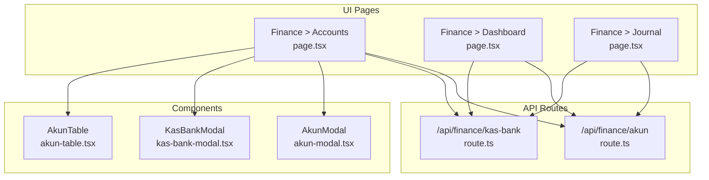
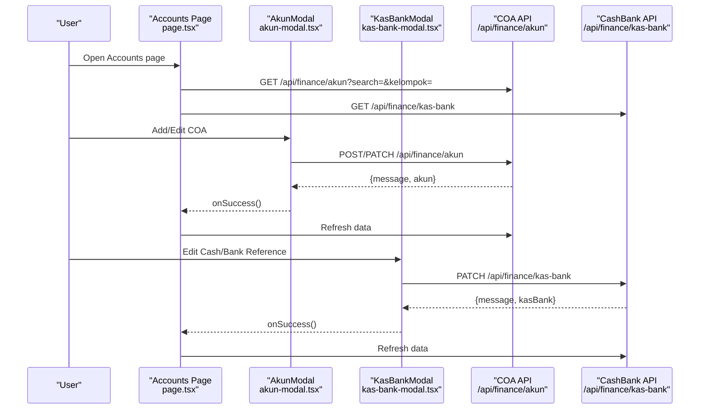
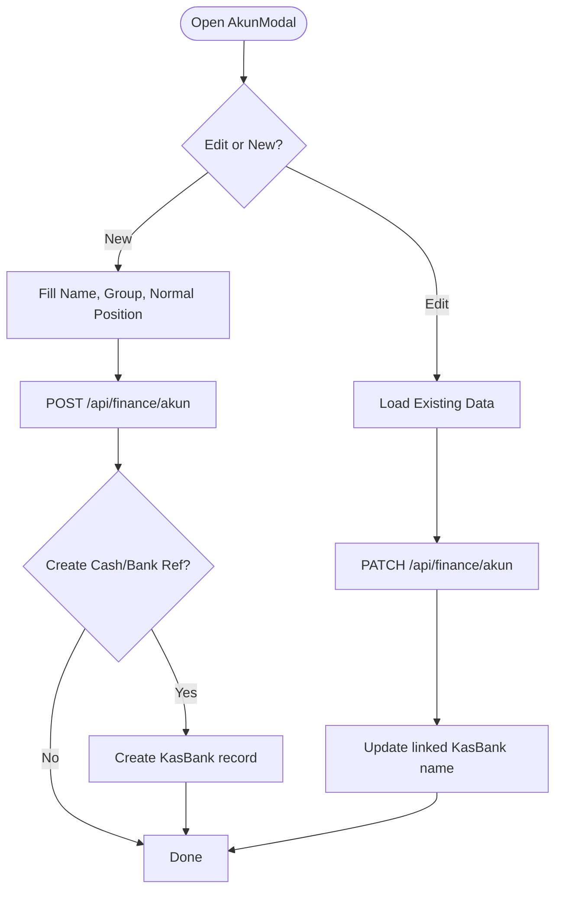
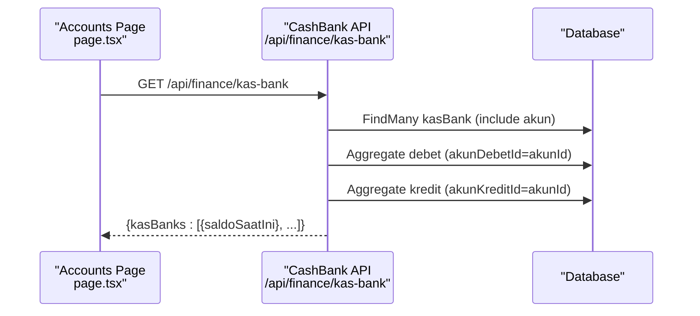
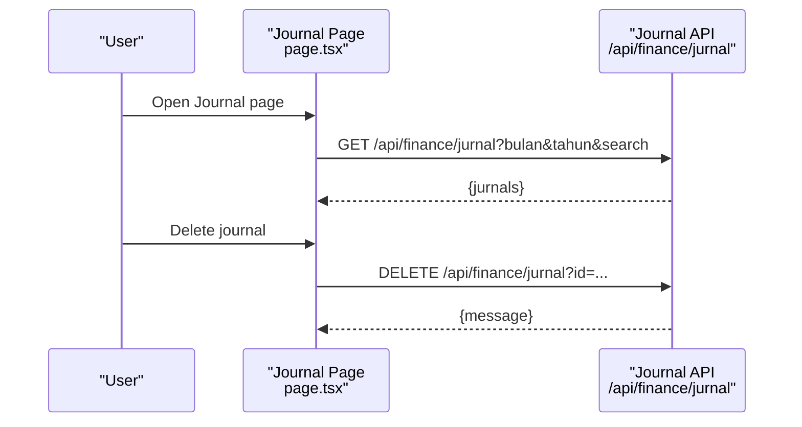
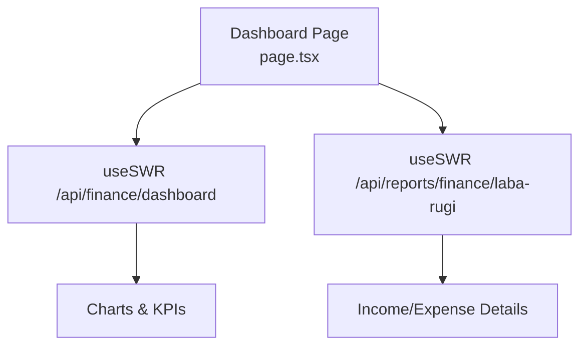
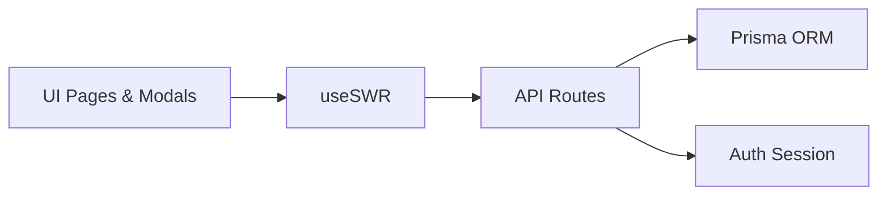

# Cash & Bank Account Management

<cite>
**Referenced Files in This Document**
- [page.tsx](file://src/app/(LoggedIn)/finance/akun/page.tsx)
- [page.tsx](file://src/app/(LoggedIn)/finance/dashboard/page.tsx)
- [page.tsx](file://src/app/(LoggedIn)/finance/jurnal/page.tsx)
- [route.ts](file://src/app/api/finance/akun/route.ts)
- [route.ts](file://src/app/api/finance/kas-bank/route.ts)
- [akun-modal.tsx](file://src/app/(LoggedIn)/finance/akun/components/akun-modal.tsx)
- [kas-bank-modal.tsx](file://src/app/(LoggedIn)/finance/akun/components/kas-bank-modal.tsx)
- [akun-table.tsx](file://src/app/(LoggedIn)/finance/akun/components/akun-table.tsx)
</cite>

## Table of Contents
1. [Introduction](#introduction)
2. [Project Structure](#project-structure)
3. [Core Components](#core-components)
4. [Architecture Overview](#architecture-overview)
5. [Detailed Component Analysis](#detailed-component-analysis)
6. [Dependency Analysis](#dependency-analysis)
7. [Performance Considerations](#performance-considerations)
8. [Troubleshooting Guide](#troubleshooting-guide)
9. [Conclusion](#conclusion)
10. [Appendices](#appendices)

## Introduction
This document explains cash and bank account management within the financial system. It covers account setup (chart of accounts and cash/bank references), account reconciliation via journal entries, cash flow tracking, multi-account support, and operational procedures such as opening balances, activity monitoring, and closures. It also documents security, permissions, audit trails, dashboards, analytics, and reporting capabilities.

## Project Structure
The cash and bank account management feature spans UI pages, modals, tables, and backend API routes:
- Frontend pages:
  - Account management page for chart of accounts and cash/bank listings
  - Finance dashboard for analytics
  - General ledger/journal page for reconciliations
- Backend API routes:
  - Account (chart of accounts) CRUD and queries
  - Cash/bank account CRUD and balance computation
- UI components:
  - Modals for adding/editing accounts and cash/bank references
  - Tables for browsing and filtering

**Diagram sources**
- [page.tsx](file://src/app/(LoggedIn)/finance/akun/page.tsx#L23-L248)
- [page.tsx](file://src/app/(LoggedIn)/finance/dashboard/page.tsx#L215-L916)
- [page.tsx](file://src/app/(LoggedIn)/finance/jurnal/page.tsx#L40-L155)
- [route.ts:27-180](file://src/app/api/finance/akun/route.ts#L27-L180)
- [route.ts:16-112](file://src/app/api/finance/kas-bank/route.ts#L16-L112)
- [akun-modal.tsx](file://src/app/(LoggedIn)/finance/akun/components/akun-modal.tsx#L36-L248)
- [kas-bank-modal.tsx](file://src/app/(LoggedIn)/finance/akun/components/kas-bank-modal.tsx#L28-L176)
- [akun-table.tsx](file://src/app/(LoggedIn)/finance/akun/components/akun-table.tsx#L20-L104)

**Section sources**
- [page.tsx](file://src/app/(LoggedIn)/finance/akun/page.tsx#L23-L248)
- [page.tsx](file://src/app/(LoggedIn)/finance/dashboard/page.tsx#L215-L916)
- [page.tsx](file://src/app/(LoggedIn)/finance/jurnal/page.tsx#L40-L155)
- [route.ts:27-180](file://src/app/api/finance/akun/route.ts#L27-L180)
- [route.ts:16-112](file://src/app/api/finance/kas-bank/route.ts#L16-L112)
- [akun-modal.tsx](file://src/app/(LoggedIn)/finance/akun/components/akun-modal.tsx#L36-L248)
- [kas-bank-modal.tsx](file://src/app/(LoggedIn)/finance/akun/components/kas-bank-modal.tsx#L28-L176)
- [akun-table.tsx](file://src/app/(LoggedIn)/finance/akun/components/akun-table.tsx#L20-L104)

## Core Components
- Chart of Accounts (COA):
  - Defines account codes, groupings, normal positions (debit/credit), and activation status
  - Supports creation with automatic numbering per group and optional linkage to cash/bank references
- Cash and Bank References:
  - Maintains named accounts (e.g., “BCA Utama”), types (cash, bank, ewallet), numbers, and activation status
  - Computes current balances by aggregating debits and credits from general ledger entries
- Journals and Reconciliations:
  - Centralized recording of financial movements
  - Enables deletion of manual entries for corrections
- Dashboards and Analytics:
  - Financial summaries, profit margin targets, income composition, and operational expense breakdown
- Permissions and Security:
  - Role-based access controls for viewing and editing accounts and cash/bank records
  - Audit-friendly operations with explicit CRUD endpoints

**Section sources**
- [route.ts:27-180](file://src/app/api/finance/akun/route.ts#L27-L180)
- [route.ts:16-112](file://src/app/api/finance/kas-bank/route.ts#L16-L112)
- [page.tsx](file://src/app/(LoggedIn)/finance/jurnal/page.tsx#L40-L155)
- [page.tsx](file://src/app/(LoggedIn)/finance/dashboard/page.tsx#L215-L916)

## Architecture Overview
The system integrates frontend pages with backend APIs secured by role checks. The COA and cash/bank references are tightly coupled: updates to COA names propagate to linked cash/bank records. Balances for cash/bank accounts are computed live by summing debits and credits.

**Diagram sources**
- [page.tsx](file://src/app/(LoggedIn)/finance/akun/page.tsx#L36-L51)
- [akun-modal.tsx](file://src/app/(LoggedIn)/finance/akun/components/akun-modal.tsx#L70-L131)
- [kas-bank-modal.tsx](file://src/app/(LoggedIn)/finance/akun/components/kas-bank-modal.tsx#L49-L100)
- [route.ts:63-135](file://src/app/api/finance/akun/route.ts#L63-L135)
- [route.ts:83-111](file://src/app/api/finance/kas-bank/route.ts#L83-L111)

## Detailed Component Analysis

### Chart of Accounts (COA)
- Purpose:
  - Define standardized account codes and classifications
  - Control normal position (debit/credit) for accurate financial statements
- Creation:
  - Automatic numbering per group (e.g., asset group starts with “1-”)
  - Optional creation of a corresponding cash/bank reference during account creation
- Editing:
  - Updates to name propagate to linked cash/bank references
  - Activation/deactivation supported
- UI:
  - Table displays code, name, group, normal position, and status
  - Edit action available to authorized users

**Diagram sources**
- [akun-modal.tsx](file://src/app/(LoggedIn)/finance/akun/components/akun-modal.tsx#L70-L131)
- [route.ts:63-135](file://src/app/api/finance/akun/route.ts#L63-L135)

**Section sources**
- [route.ts:27-180](file://src/app/api/finance/akun/route.ts#L27-L180)
- [akun-modal.tsx](file://src/app/(LoggedIn)/finance/akun/components/akun-modal.tsx#L36-L248)
- [akun-table.tsx](file://src/app/(LoggedIn)/finance/akun/components/akun-table.tsx#L20-L104)

### Cash and Bank Accounts
- Purpose:
  - Track physical cash, bank accounts, and e-wallets used for payments
- Fields:
  - Name, type (cash/bank/ewallet), number (optional), activation status
  - Linked to a COA for accounting entries
- Balance Computation:
  - Current balance equals total debits minus total credits for the associated COA
- Editing:
  - Update name, type, number, and status
  - Deactivation recommended for closed accounts

**Diagram sources**
- [page.tsx](file://src/app/(LoggedIn)/finance/akun/page.tsx#L42-L51)
- [route.ts:30-73](file://src/app/api/finance/kas-bank/route.ts#L30-L73)

**Section sources**
- [route.ts:16-112](file://src/app/api/finance/kas-bank/route.ts#L16-L112)
- [kas-bank-modal.tsx](file://src/app/(LoggedIn)/finance/akun/components/kas-bank-modal.tsx#L28-L176)

### Journals and Reconciliations
- Purpose:
  - Record all financial movements; serves as the source of truth for balances
- Operations:
  - View filtered journals by month/year and search terms
  - Delete manual journal entries for corrections
- Reconciliation:
  - Compare recorded debits and credits against external statements
  - Adjust or correct discrepancies via journal entries

**Diagram sources**
- [page.tsx](file://src/app/(LoggedIn)/finance/jurnal/page.tsx#L54-L90)
- [page.tsx](file://src/app/(LoggedIn)/finance/jurnal/page.tsx#L139-L151)

**Section sources**
- [page.tsx](file://src/app/(LoggedIn)/finance/jurnal/page.tsx#L40-L155)

### Dashboard and Analytics
- Purpose:
  - Provide financial summaries and insights
- Features:
  - KPI cards (total income, expenses, net profit, receivables)
  - Profit margin vs. target
  - Income composition bars
  - Operational expense breakdown by categories
- Data Sources:
  - Dashboard totals and trends
  - Profit & loss detail for income and expense groups

**Diagram sources**
- [page.tsx](file://src/app/(LoggedIn)/finance/dashboard/page.tsx#L248-L255)

**Section sources**
- [page.tsx](file://src/app/(LoggedIn)/finance/dashboard/page.tsx#L215-L916)

### Account Setup Procedures
- Create Chart of Accounts:
  - Use modal to enter name, select group and normal position
  - Optionally auto-create a cash/bank reference
- Create Cash/Bank Reference:
  - Assign name, type, and optional number
  - Link to the newly created COA
- Configure Filters:
  - Search by name/code
  - Filter by group and status (active/inactive)

**Section sources**
- [akun-modal.tsx](file://src/app/(LoggedIn)/finance/akun/components/akun-modal.tsx#L36-L248)
- [kas-bank-modal.tsx](file://src/app/(LoggedIn)/finance/akun/components/kas-bank-modal.tsx#L28-L176)
- [page.tsx](file://src/app/(LoggedIn)/finance/akun/page.tsx#L58-L86)

### Account Opening Balances
- Concept:
  - Opening balances are established through historical journal entries posted to the relevant COA
  - Cash/bank balances reflect cumulative debits minus credits up to the reporting date
- Practical Steps:
  - Post opening entry(s) to the COA and linked cash/bank account
  - Verify balance computation after posting

**Section sources**
- [route.ts:38-71](file://src/app/api/finance/kas-bank/route.ts#L38-L71)

### Account Activity Monitoring
- Tools:
  - Journal page for reviewing entries
  - Dashboard for high-level trends and composition
- Indicators:
  - Receivable levels, profit margin, and expense categories
- Alerts:
  - Profit margin below target triggers a warning card

**Section sources**
- [page.tsx](file://src/app/(LoggedIn)/finance/jurnal/page.tsx#L40-L155)
- [page.tsx](file://src/app/(LoggedIn)/finance/dashboard/page.tsx#L149-L203)

### Account Closure Procedures
- Steps:
  - Ensure zero outstanding balance (no pending transactions)
  - Mark the cash/bank reference as inactive
  - Archive or retain historical journals for audit trail
- Impact:
  - Inactive references remain visible for reporting and auditing

**Section sources**
- [kas-bank-modal.tsx](file://src/app/(LoggedIn)/finance/akun/components/kas-bank-modal.tsx#L149-L155)

### Practical Examples
- Cash Receipts:
  - Record cash inflow by posting to the cash/bank COA (debit) and revenue account (credit)
- Cash Disbursements:
  - Record cash outflow by posting to the expense account (debit) and cash/bank COA (credit)
- Bank Transfers:
  - Record transfer between bank accounts by debiting the receiving bank COA and crediting the sending bank COA
- Account Reconciliations:
  - Compare journal totals with bank statements
  - Adjust discrepancies via correcting journal entries

[No sources needed since this section provides general guidance]

### Account Security and Permissions
- Access Controls:
  - Read access: admin, cashier
  - Write access: admin only for COA; cashier may edit cash/bank references depending on role policy
- Audit Trail:
  - All edits and deletions are logged via API responses and reflected in journal history

**Section sources**
- [route.ts:8-25](file://src/app/api/finance/akun/route.ts#L8-L25)
- [route.ts:6-14](file://src/app/api/finance/kas-bank/route.ts#L6-L14)

### Account Reporting
- Reports Available:
  - Profit & Loss detail (income and expense groups)
  - Dashboard summary with charts and KPIs
- Filtering:
  - Month/year selection on dashboard
  - Search and filters on journals and accounts

**Section sources**
- [page.tsx](file://src/app/(LoggedIn)/finance/dashboard/page.tsx#L248-L255)
- [page.tsx](file://src/app/(LoggedIn)/finance/jurnal/page.tsx#L54-L58)
- [page.tsx](file://src/app/(LoggedIn)/finance/akun/page.tsx#L58-L86)

## Dependency Analysis
- UI depends on SWR for data fetching and modals for mutations
- API routes enforce role-based access and coordinate database transactions
- Cash/bank balances depend on general ledger aggregation

**Diagram sources**
- [page.tsx](file://src/app/(LoggedIn)/finance/akun/page.tsx#L36-L51)
- [page.tsx](file://src/app/(LoggedIn)/finance/jurnal/page.tsx#L54-L57)
- [route.ts:8-25](file://src/app/api/finance/akun/route.ts#L8-L25)
- [route.ts:6-14](file://src/app/api/finance/kas-bank/route.ts#L6-L14)

**Section sources**
- [page.tsx](file://src/app/(LoggedIn)/finance/akun/page.tsx#L23-L248)
- [page.tsx](file://src/app/(LoggedIn)/finance/jurnal/page.tsx#L40-L155)
- [route.ts:27-180](file://src/app/api/finance/akun/route.ts#L27-L180)
- [route.ts:16-112](file://src/app/api/finance/kas-bank/route.ts#L16-L112)

## Performance Considerations
- Use debounced search to reduce API calls
- Paginate or limit journal lists for large datasets
- Precompute aggregates sparingly; compute balances on demand for accuracy
- Cache frequently accessed COA metadata

[No sources needed since this section provides general guidance]

## Troubleshooting Guide
- Unauthorized or Forbidden:
  - Ensure user role meets required access level
- Duplicate Account Code:
  - Choose unique account codes; backend prevents duplicates
- Missing Balances:
  - Confirm journal entries exist for the COA; balances derive from debits and credits
- Deletion Failures:
  - Validate entry ID and permissions; check error messages returned by API

**Section sources**
- [route.ts:97-104](file://src/app/api/finance/akun/route.ts#L97-L104)
- [route.ts:83-111](file://src/app/api/finance/kas-bank/route.ts#L83-L111)
- [page.tsx](file://src/app/(LoggedIn)/finance/jurnal/page.tsx#L65-L90)

## Conclusion
The cash and bank account management system provides a robust foundation for financial operations. It supports structured chart of accounts, flexible cash/bank references, real-time balance computation, centralized journaling for reconciliations, and insightful dashboards. Strong role-based access and audit-friendly operations ensure secure and transparent financial governance.

[No sources needed since this section summarizes without analyzing specific files]

## Appendices
- Account Types:
  - Cash, Bank, E-Wallet
- Currency Handling:
  - Monetary values are formatted and aggregated consistently; currency is implied by local formatting
- Multi-Account Support:
  - Multiple cash/bank references supported; each links to a COA for accurate accounting

[No sources needed since this section provides general guidance]