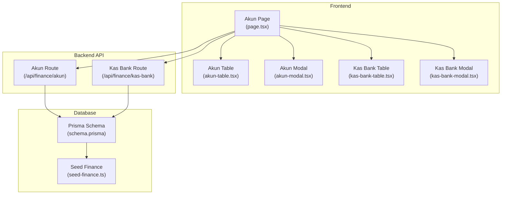
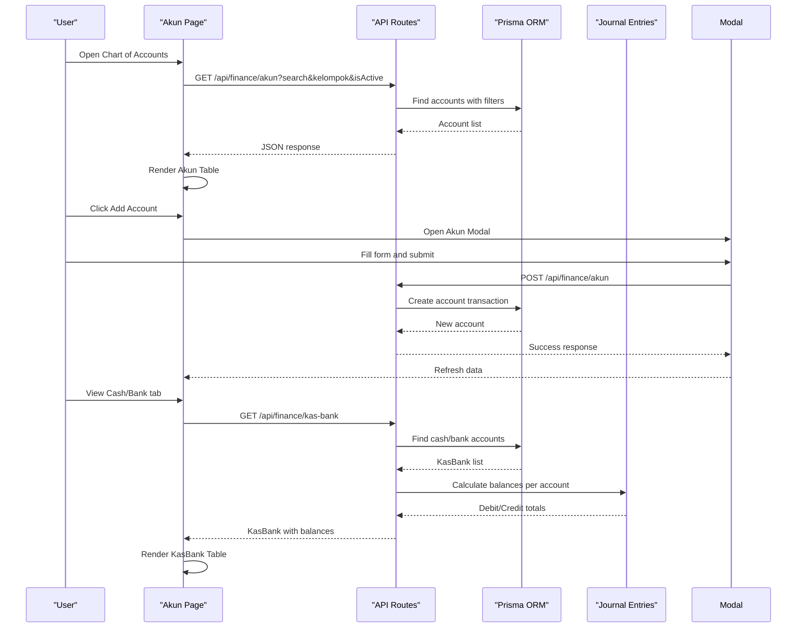
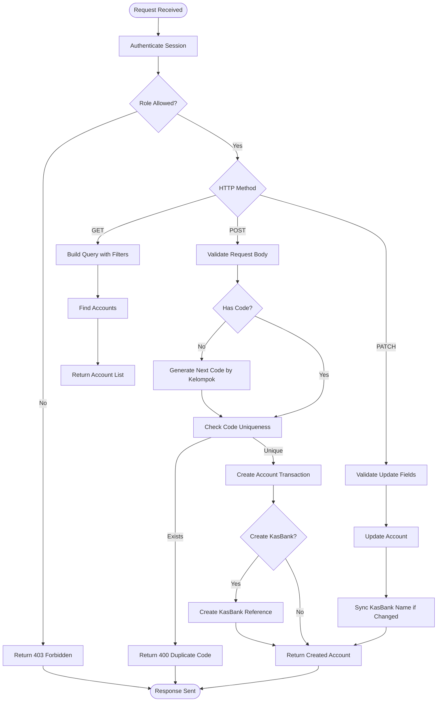
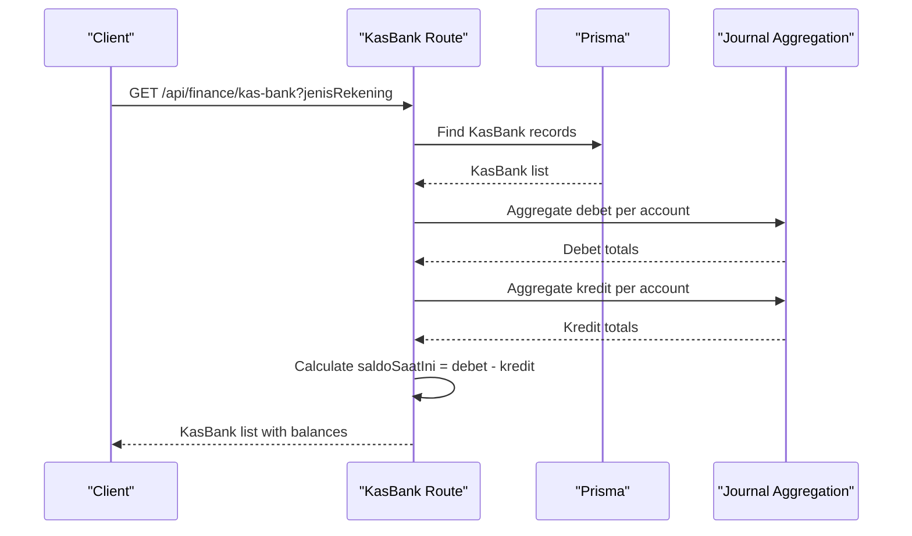
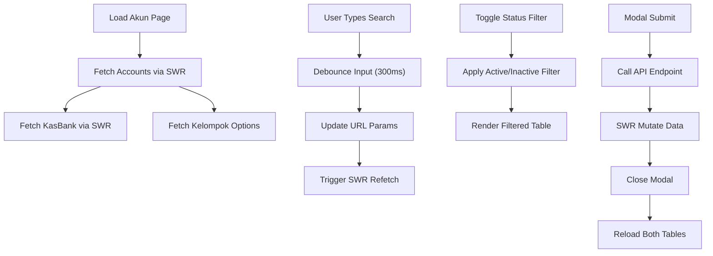
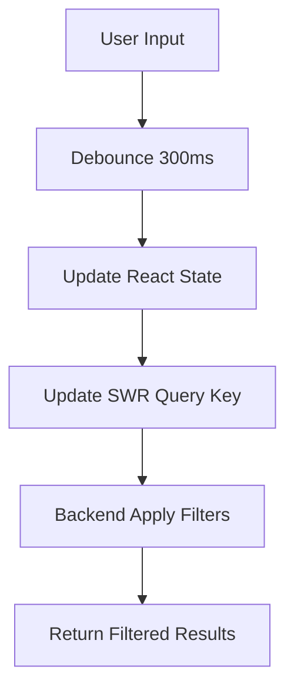
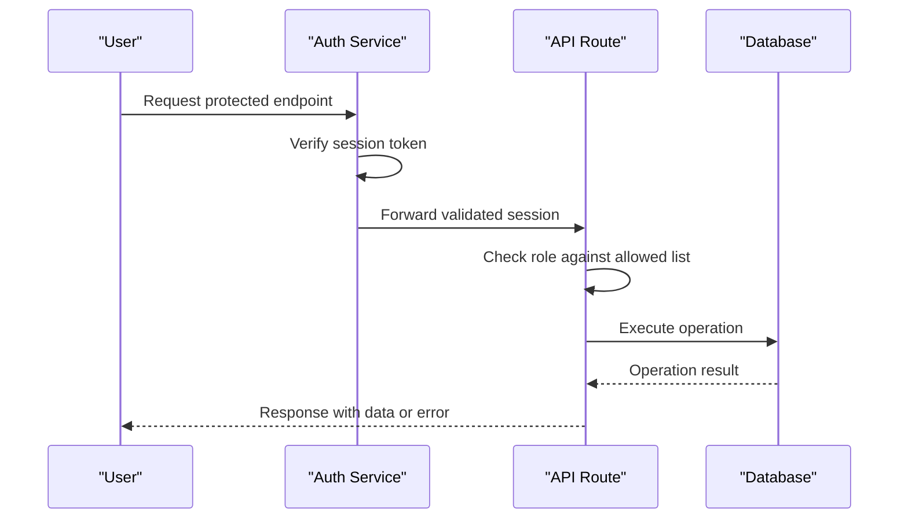

# Chart of Accounts Management

<cite>
**Referenced Files in This Document**
- [route.ts](file://src/app/api/finance/akun/route.ts)
- [page.tsx](file://src/app/(LoggedIn)/finance/akun/page.tsx)
- [layout.tsx](file://src/app/(LoggedIn)/finance/akun/layout.tsx)
- [akun-table.tsx](file://src/app/(LoggedIn)/finance/akun/components/akun-table.tsx)
- [akun-modal.tsx](file://src/app/(LoggedIn)/finance/akun/components/akun-modal.tsx)
- [kas-bank-table.tsx](file://src/app/(LoggedIn)/finance/akun/components/kas-bank-table.tsx)
- [kas-bank-modal.tsx](file://src/app/(LoggedIn)/finance/akun/components/kas-bank-modal.tsx)
- [route.ts](file://src/app/api/finance/kas-bank/route.ts)
- [schema.prisma](file://prisma/schema.prisma)
- [seed-finance.ts](file://prisma/seed-finance.ts)
</cite>

## Table of Contents
1. [Introduction](#introduction)
2. [Project Structure](#project-structure)
3. [Core Components](#core-components)
4. [Architecture Overview](#architecture-overview)
5. [Detailed Component Analysis](#detailed-component-analysis)
6. [Account Classification and Grouping](#account-classification-and-grouping)
7. [Account Creation and Management](#account-creation-and-management)
8. [Dual-Tab Interface](#dual-tab-interface)
9. [Search and Filtering](#search-and-filtering)
10. [Integration with Journal Entries](#integration-with-journal-entries)
11. [Permissions and Security](#permissions-and-security)
12. [Account Numbering Schemes](#account-numbering-schemes)
13. [Practical Setup Examples](#practical-setup-examples)
14. [Audit Trails and Reconciliation](#audit-trails-and-reconciliation)
15. [Performance Considerations](#performance-considerations)
16. [Troubleshooting Guide](#troubleshooting-guide)
17. [Conclusion](#conclusion)

## Introduction
This document provides comprehensive documentation for the Chart of Accounts Management system within the POS (Point of Sale) financial module. It explains the account classification structure, categorization by groups (kelompok), and hierarchical organization. The documentation covers account creation, editing, and deletion processes, including validation rules and constraints. It also details account status management (active/inactive), search and filtering capabilities, and the dual-tab interface for general ledger accounts and cash/bank accounts. Practical examples demonstrate account setup for different business types, numbering schemes, and integration with journal entries. Additionally, it addresses account permissions, audit trails, and reconciliation processes.

## Project Structure
The chart of accounts management is implemented as a dual-tab interface within the finance module. The frontend components manage user interactions, while backend API routes handle data persistence and business logic. The system integrates with Prisma ORM for database operations and supports real-time synchronization via SWR.

**Diagram sources**
- [page.tsx:23-247](file://src/app/(LoggedIn)/finance/akun/page.tsx#L23-L247)
- [akun-table.tsx:20-103](file://src/app/(LoggedIn)/finance/akun/components/akun-table.tsx#L20-L103)
- [akun-modal.tsx:36-246](file://src/app/(LoggedIn)/finance/akun/components/akun-modal.tsx#L36-L246)
- [kas-bank-table.tsx:21-122](file://src/app/(LoggedIn)/finance/akun/components/kas-bank-table.tsx#L21-L122)
- [kas-bank-modal.tsx:28-175](file://src/app/(LoggedIn)/finance/akun/components/kas-bank-modal.tsx#L28-L175)
- [route.ts:27-180](file://src/app/api/finance/akun/route.ts#L27-L180)
- [route.ts:16-112](file://src/app/api/finance/kas-bank/route.ts#L16-L112)
- [schema.prisma](file://prisma/schema.prisma)
- [seed-finance.ts](file://prisma/seed-finance.ts)

**Section sources**
- [page.tsx:23-247](file://src/app/(LoggedIn)/finance/akun/page.tsx#L23-L247)
- [layout.tsx:3-10](file://src/app/(LoggedIn)/finance/akun/layout.tsx#L3-L10)

## Core Components
The system consists of four primary frontend components and two backend API routes:

- **Akun Page**: Orchestrates data fetching, filtering, and modal interactions for both general ledger and cash/bank accounts.
- **Akun Table**: Displays general ledger accounts with classification, normal position, and status indicators.
- **Akun Modal**: Handles account creation and updates with validation and optional cash/bank reference creation.
- **Kas Bank Table**: Shows cash and bank accounts with balances, linked ledger accounts, and status.
- **Kas Bank Modal**: Manages cash/bank account edits including status toggling.
- **Akun Route**: Implements CRUD operations for general ledger accounts with role-based access control.
- **Kas Bank Route**: Manages cash/bank account queries and updates with balance calculations.

**Section sources**
- [page.tsx:23-247](file://src/app/(LoggedIn)/finance/akun/page.tsx#L23-L247)
- [akun-table.tsx:20-103](file://src/app/(LoggedIn)/finance/akun/components/akun-table.tsx#L20-L103)
- [akun-modal.tsx:36-246](file://src/app/(LoggedIn)/finance/akun/components/akun-modal.tsx#L36-L246)
- [kas-bank-table.tsx:21-122](file://src/app/(LoggedIn)/finance/akun/components/kas-bank-table.tsx#L21-L122)
- [kas-bank-modal.tsx:28-175](file://src/app/(LoggedIn)/finance/akun/components/kas-bank-modal.tsx#L28-L175)
- [route.ts:27-180](file://src/app/api/finance/akun/route.ts#L27-L180)
- [route.ts:16-112](file://src/app/api/finance/kas-bank/route.ts#L16-L112)

## Architecture Overview
The architecture follows a client-server pattern with a React-based frontend and Next.js API routes on the backend. Data flows through SWR for client-side caching and real-time updates, while Prisma handles database operations with transactions for consistency.

**Diagram sources**
- [page.tsx:36-51](file://src/app/(LoggedIn)/finance/akun/page.tsx#L36-L51)
- [route.ts:27-60](file://src/app/api/finance/akun/route.ts#L27-L60)
- [route.ts:62-135](file://src/app/api/finance/akun/route.ts#L62-L135)
- [route.ts:16-81](file://src/app/api/finance/kas-bank/route.ts#L16-L81)

## Detailed Component Analysis

### Account Management API
The Akun Route provides comprehensive CRUD functionality with strict validation and role-based access control. It supports automatic account numbering based on kelompok prefixes and maintains referential integrity with cash/bank accounts.

**Diagram sources**
- [route.ts:8-25](file://src/app/api/finance/akun/route.ts#L8-L25)
- [route.ts:27-60](file://src/app/api/finance/akun/route.ts#L27-L60)
- [route.ts:62-135](file://src/app/api/finance/akun/route.ts#L62-L135)
- [route.ts:137-179](file://src/app/api/finance/akun/route.ts#L137-L179)

**Section sources**
- [route.ts:27-180](file://src/app/api/finance/akun/route.ts#L27-L180)

### Cash and Bank Management API
The Kas Bank Route manages cash and bank accounts with integrated balance calculation from journal entries. It supports filtering by account type and includes the associated ledger account information.

**Diagram sources**
- [route.ts:16-81](file://src/app/api/finance/kas-bank/route.ts#L16-L81)

**Section sources**
- [route.ts:16-112](file://src/app/api/finance/kas-bank/route.ts#L16-L112)

### Frontend Data Flow
The Akun Page coordinates data fetching, filtering, and modal interactions. It implements debounced search, status filtering, and real-time updates through SWR mutations.

**Diagram sources**
- [page.tsx:36-51](file://src/app/(LoggedIn)/finance/akun/page.tsx#L36-L51)
- [page.tsx:58-86](file://src/app/(LoggedIn)/finance/akun/page.tsx#L58-L86)

**Section sources**
- [page.tsx:23-247](file://src/app/(LoggedIn)/finance/akun/page.tsx#L23-L247)

## Account Classification and Grouping
The system organizes accounts into five primary kelompok classifications:

| Kelompok | Description | Normal Position |
|----------|-------------|-----------------|
| AKTIVA_LANCAR | Current assets (cash, receivables, inventory) | DEBET |
| KEWAJIBAN | Current liabilities (payables, short-term debt) | KREDIT |
| MODAL | Owner's equity and capital | KREDIT |
| PENDAPATAN | Revenue and income accounts | KREDIT |
| BEBAN_USAHA | Expenses and cost of goods sold | DEBET |

These classifications determine the normal debit/credit position for each account type and influence financial statement presentation.

**Section sources**
- [akun-modal.tsx:28-34](file://src/app/(LoggedIn)/finance/akun/components/akun-modal.tsx#L28-L34)
- [akun-table.tsx:58-69](file://src/app/(LoggedIn)/finance/akun/components/akun-table.tsx#L58-L69)

## Account Creation and Management
The account creation process supports both manual and automatic numbering:

### Automatic Numbering Scheme
The system generates sequential codes based on kelompok prefixes:
- AKTIVA_LANCAR: "1-001", "1-002", "1-003"
- KEWAJIBAN: "2-001", "2-002", "2-003"
- MODAL: "3-001", "3-002", "3-003"
- PENDAPATAN: "4-001", "4-002", "4-003"
- BEBAN_USAHA: "5-001", "5-002", "5-003"

### Validation Rules
- Required fields: namaAkun, kelompok, posisiNormal
- Optional for creation: kodeAkun (auto-generated)
- Unique constraint: kodeAkun must be unique
- Role restriction: only admin can modify accounts
- Transaction safety: account creation wraps cash/bank creation in a single transaction

### Account Editing Features
- Toggle account status (active/inactive)
- Update account name and classification
- Automatic synchronization of cash/bank account names
- Real-time validation and error feedback

**Section sources**
- [route.ts:74-95](file://src/app/api/finance/akun/route.ts#L74-L95)
- [route.ts:97-104](file://src/app/api/finance/akun/route.ts#L97-L104)
- [route.ts:157-172](file://src/app/api/finance/akun/route.ts#L157-L172)
- [akun-modal.tsx:70-131](file://src/app/(LoggedIn)/finance/akun/components/akun-modal.tsx#L70-L131)

## Dual-Tab Interface
The system provides a dual-tab interface for managing both general ledger accounts and cash/bank accounts:

### General Ledger Tab (Buku Besar)
Displays all chart of accounts with:
- Account code and name
- Group classification (kelompok)
- Normal position indicator (DEBET/KREDIT)
- Active/inactive status
- Edit capability for administrators

### Cash/Bank Tab (Daftar Rekening Kas & Bank)
Shows all cash and bank accounts with:
- Account name and type (CASH/BANK/EWALLET)
- Account number (optional)
- Linked ledger account information
- Current balance calculation
- Edit capability for administrators

**Section sources**
- [page.tsx:184-244](file://src/app/(LoggedIn)/finance/akun/page.tsx#L184-L244)
- [akun-table.tsx:30-40](file://src/app/(LoggedIn)/finance/akun/components/akun-table.tsx#L30-L40)
- [kas-bank-table.tsx:35-45](file://src/app/(LoggedIn)/finance/akun/components/kas-bank-table.tsx#L35-L45)

## Search and Filtering
The system provides comprehensive search and filtering capabilities:

### Search Functionality
- Real-time search across account codes and names
- Debounced input (300ms delay) for performance
- Case-insensitive partial matching
- Integrated with both general ledger and cash/bank views

### Advanced Filtering
- Group filtering by kelompok classification
- Status filtering (all, active, inactive)
- Combined filter state management
- Reset functionality to clear all filters

### Filter Implementation

**Diagram sources**
- [page.tsx:26-28](file://src/app/(LoggedIn)/finance/akun/page.tsx#L26-L28)
- [page.tsx:58-86](file://src/app/(LoggedIn)/finance/akun/page.tsx#L58-L86)
- [route.ts:33-49](file://src/app/api/finance/akun/route.ts#L33-L49)

**Section sources**
- [page.tsx:116-151](file://src/app/(LoggedIn)/finance/akun/page.tsx#L116-L151)
- [route.ts:28-60](file://src/app/api/finance/akun/route.ts#L28-L60)

## Integration with Journal Entries
The cash/bank accounts integrate with the journal entry system for real-time balance calculations:

### Balance Calculation Logic
For each cash/bank account, the system calculates:
- Total debet from journal entries (akunDebetId)
- Total kredit from journal entries (akunKreditId)
- Current balance = total debet - total kredit

### Account Linkage
Each cash/bank account references a general ledger account through akunId, ensuring proper financial reporting and audit trails.

**Section sources**
- [route.ts:38-71](file://src/app/api/finance/kas-bank/route.ts#L38-L71)
- [kas-bank-table.tsx:76-90](file://src/app/(LoggedIn)/finance/akun/components/kas-bank-table.tsx#L76-L90)

## Permissions and Security
The system implements role-based access control:

### Access Levels
- **Admin**: Full access to create, edit, and delete accounts
- **Kasir**: Read access to accounts and cash/bank management
- **Other Roles**: No access to chart of accounts management

### Authentication Flow

**Diagram sources**
- [route.ts:8-25](file://src/app/api/finance/akun/route.ts#L8-L25)
- [route.ts:6-14](file://src/app/api/finance/kas-bank/route.ts#L6-L14)

**Section sources**
- [route.ts:12-24](file://src/app/api/finance/akun/route.ts#L12-L24)
- [route.ts:10-25](file://src/app/api/finance/kas-bank/route.ts#L10-L25)

## Account Numbering Schemes
The system supports flexible numbering schemes:

### Standard Sequential Scheme
- Prefix-based grouping: "1-", "2-", "3-", "4-", "5-"
- Three-digit sequential numbering: "001", "002", "003"
- Example: AKTIVA_LANCAR -> "1-001", "1-002", "1-003"

### Manual Override Option
Administrators can manually specify account codes during creation, subject to uniqueness validation.

### Best Practices
- Maintain consistent prefix usage per kelompok
- Reserve gaps for future accounts
- Document numbering conventions for audit purposes

**Section sources**
- [route.ts:74-95](file://src/app/api/finance/akun/route.ts#L74-L95)
- [akun-modal.tsx:154-162](file://src/app/(LoggedIn)/finance/akun/components/akun-modal.tsx#L154-L162)

## Practical Setup Examples

### Retail Business Setup
For a retail business, typical account setup includes:

**Asset Accounts (AKTIVA_LANCAR)**
- 1-001 Kas Tunai
- 1-002 Bank BCA
- 1-003 Piutang Dagang
- 1-004 Persediaan Barang

**Liability Accounts (KEWAJIBAN)**
- 2-001 Hutang Dagang
- 2-002 PPh Pasal 21
- 2-003 PPh Pasal 23

**Equity Accounts (MODAL)**
- 3-001 Modal Pemilik
- 3-002 Laba Ditahan

**Revenue Accounts (PENDAPATAN)**
- 4-001 Penjualan
- 4-002 Pendapatan Layanan

**Expense Accounts (BEBAN_USAHA)**
- 5-001 Harga Pokok Penjualan
- 5-002 Biaya Gaji
- 5-003 Biaya Sewa

### Restaurant Business Setup
For a restaurant, typical account setup includes:

**Asset Accounts**
- 1-001 Kas di Meja
- 1-002 Kas di Kantor
- 1-003 Piutang Karyawan
- 1-004 Persediaan Bahan Makanan

**Revenue Accounts**
- 4-001 Penjualan Makanan
- 4-002 Penjualan Minuman
- 4-003 Layanan Antar

**Expense Accounts**
- 5-001 Harga Pokok Makanan
- 5-002 Biaya Peralatan
- 5-003 Biaya Listrik

## Audit Trails and Reconciliation
The system supports comprehensive audit capabilities:

### Transaction Logging
- All account modifications are captured through Prisma transactions
- Cash/bank account name synchronization triggers audit trails
- Role-based access logging for administrative actions

### Reconciliation Features
- Real-time balance calculation for cash/bank accounts
- Historical journal entry tracking
- Cross-reference between ledger accounts and bank accounts
- Period-end closing procedures support through journal entries

### Compliance Considerations
- Data validation prevents invalid account configurations
- Unique code enforcement ensures data integrity
- Soft delete support for historical record preservation
- Comprehensive search and filtering for audit purposes

**Section sources**
- [route.ts:106-128](file://src/app/api/finance/akun/route.ts#L106-L128)
- [route.ts:163-169](file://src/app/api/finance/akun/route.ts#L163-L169)

## Performance Considerations
The system implements several performance optimizations:

### Client-Side Caching
- SWR for efficient data fetching and caching
- Debounced search input to reduce API calls
- Local state management for immediate UI updates

### Database Optimization
- Indexing on frequently queried fields (kodeAkun, kelompok, isActive)
- Efficient aggregation queries for balance calculations
- Transaction batching for related operations

### Network Efficiency
- Minimal payload sizes with selective field retrieval
- Real-time updates through SWR mutations
- Optimistic UI updates with rollback on errors

## Troubleshooting Guide

### Common Issues and Solutions

**Account Creation Failures**
- Duplicate account code: Ensure unique kodeAkun values
- Missing required fields: Verify namaAkun, kelompok, and posisiNormal
- Role restrictions: Confirm admin privileges for account creation

**Cash/Bank Account Sync Issues**
- Name synchronization: Changes to account names automatically update linked cash/bank names
- Balance calculation errors: Verify journal entries exist for the account
- Account linkage problems: Ensure akunId references valid ledger accounts

**Search and Filter Problems**
- Debounced search delays: Wait for 300ms after typing completion
- Filter reset: Use the reset button to clear all applied filters
- Empty results: Check if accounts exist in the database

**Permission Denied Errors**
- Role verification: Confirm user has admin or kasir role
- Session validation: Ensure proper authentication before accessing endpoints
- API route restrictions: Verify allowed roles for each endpoint

**Section sources**
- [route.ts:97-104](file://src/app/api/finance/akun/route.ts#L97-L104)
- [route.ts:146-148](file://src/app/api/finance/akun/route.ts#L146-L148)
- [route.ts:8-25](file://src/app/api/finance/akun/route.ts#L8-L25)

## Conclusion
The Chart of Accounts Management system provides a robust foundation for financial accounting within the POS platform. Its dual-tab interface, comprehensive validation, and integration with journal entries ensure accurate financial reporting. The role-based security model protects sensitive financial data while enabling efficient administration. The system's flexibility in account classification, numbering schemes, and filtering capabilities makes it suitable for various business types and sizes. With proper implementation of audit trails and reconciliation processes, the system supports compliance requirements and financial transparency.