# Financial Accounting System

<cite>
**Referenced Files in This Document**
- [schema.prisma](file://prisma/schema.prisma)
- [finance.ts](file://src/lib/finance.ts)
- [akun/route.ts](file://src/app/api/finance/akun/route.ts)
- [jurnal/route.ts](file://src/app/api/finance/jurnal/route.ts)
- [kas-bank/route.ts](file://src/app/api/finance/kas-bank/route.ts)
- [dashboard/route.ts](file://src/app/api/finance/dashboard/route.ts)
- [cost/route.ts](file://src/app/api/reports/finance/cost/route.ts)
- [laba-rugi/route.ts](file://src/app/api/reports/finance/laba-rugi/route.ts)
- [neraca/route.ts](file://src/app/api/reports/finance/neraca/route.ts)
</cite>

## Table of Contents
1. [Introduction](#introduction)
2. [Project Structure](#project-structure)
3. [Core Components](#core-components)
4. [Architecture Overview](#architecture-overview)
5. [Detailed Component Analysis](#detailed-component-analysis)
6. [Dependency Analysis](#dependency-analysis)
7. [Performance Considerations](#performance-considerations)
8. [Troubleshooting Guide](#troubleshooting-guide)
9. [Conclusion](#conclusion)
10. [Appendices](#appendices)

## Introduction
This document describes the financial accounting system built into the POS application. It covers chart of accounts management, journal entry processing, financial reporting, and multi-rekening (multiple bank and cash accounts) support. It explains how accounting principles are implemented, how automated journal entries are triggered by business events, how financial statements are generated, and how receivables/payables are tracked. It also documents integration points with order processing, inventory changes, and production costs, along with dashboards, budget tracking, and variance analysis capabilities.

## Project Structure
The financial domain is implemented with:
- Prisma schema defining financial entities (accounts, journals, cash/bank accounts, settings)
- API routes for CRUD and queries on financial data
- Utility library for double-entry journal creation
- Report endpoints for profit & loss, balance sheet, and cost center allocation
- Dashboard endpoint aggregating financial KPIs and trends

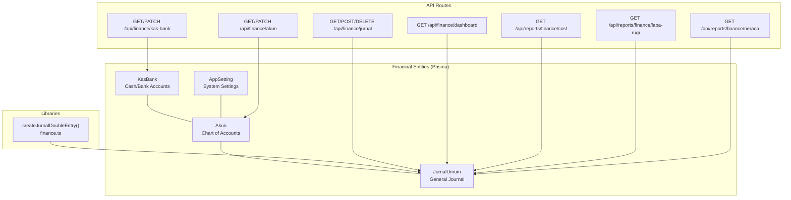

**Diagram sources**
- [schema.prisma](file://prisma/schema.prisma)
- [finance.ts](file://src/lib/finance.ts)
- [akun/route.ts](file://src/app/api/finance/akun/route.ts)
- [jurnal/route.ts](file://src/app/api/finance/jurnal/route.ts)
- [kas-bank/route.ts](file://src/app/api/finance/kas-bank/route.ts)
- [dashboard/route.ts](file://src/app/api/finance/dashboard/route.ts)
- [cost/route.ts](file://src/app/api/reports/finance/cost/route.ts)
- [laba-rugi/route.ts](file://src/app/api/reports/finance/laba-rugi/route.ts)
- [neraca/route.ts](file://src/app/api/reports/finance/neraca/route.ts)

**Section sources**
- [schema.prisma](file://prisma/schema.prisma)
- [finance.ts](file://src/lib/finance.ts)
- [akun/route.ts](file://src/app/api/finance/akun/route.ts)
- [jurnal/route.ts](file://src/app/api/finance/jurnal/route.ts)
- [kas-bank/route.ts](file://src/app/api/finance/kas-bank/route.ts)
- [dashboard/route.ts](file://src/app/api/finance/dashboard/route.ts)
- [cost/route.ts](file://src/app/api/reports/finance/cost/route.ts)
- [laba-rugi/route.ts](file://src/app/api/reports/finance/laba-rugi/route.ts)
- [neraca/route.ts](file://src/app/api/reports/finance/neraca/route.ts)

## Core Components
- Chart of Accounts (Akun): Defines account codes, groupings, and normal positions for balance sheet treatment.
- General Journal (JurnalUmum): Central double-entry posting engine with references, supporting documents, and links to business events.
- Cash/Bank Accounts (KasBank): Multiple rekening mapped to ledger accounts for cash flow tracking.
- System Settings (AppSetting): Stores company info, prefixes, and default revenue account for automatic postings.
- Finance Utilities: Double-entry creation helper for consistent journal entries.

Key responsibilities:
- Account classification and numbering scheme aligned with balance sheet groups
- Automated journal entries from payments and inventory receipts
- Real-time cash account balances derived from journal activity
- Financial statements via aggregated journal data

**Section sources**
- [schema.prisma](file://prisma/schema.prisma)
- [finance.ts](file://src/lib/finance.ts)
- [akun/route.ts](file://src/app/api/finance/akun/route.ts)
- [jurnal/route.ts](file://src/app/api/finance/jurnal/route.ts)
- [kas-bank/route.ts](file://src/app/api/finance/kas-bank/route.ts)
- [dashboard/route.ts](file://src/app/api/finance/dashboard/route.ts)
- [laba-rugi/route.ts](file://src/app/api/reports/finance/laba-rugi/route.ts)
- [neraca/route.ts](file://src/app/api/reports/finance/neraca/route.ts)
- [cost/route.ts](file://src/app/api/reports/finance/cost/route.ts)

## Architecture Overview
The system follows a layered architecture:
- Data Access: Prisma ORM models define entities and relations
- Business Logic: API routes orchestrate operations and enforce authorization
- Reporting: Dedicated endpoints compute aggregates for financial statements
- UI Integration: Front-end pages consume these APIs for charts, tables, and forms

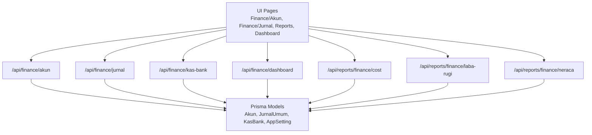

**Diagram sources**
- [schema.prisma](file://prisma/schema.prisma)
- [akun/route.ts](file://src/app/api/finance/akun/route.ts)
- [jurnal/route.ts](file://src/app/api/finance/jurnal/route.ts)
- [kas-bank/route.ts](file://src/app/api/finance/kas-bank/route.ts)
- [dashboard/route.ts](file://src/app/api/finance/dashboard/route.ts)
- [cost/route.ts](file://src/app/api/reports/finance/cost/route.ts)
- [laba-rugi/route.ts](file://src/app/api/reports/finance/laba-rugi/route.ts)
- [neraca/route.ts](file://src/app/api/reports/finance/neraca/route.ts)

## Detailed Component Analysis

### Chart of Accounts Management
- Purpose: Maintain standardized account codes, groupings, and normal positions for balance sheet alignment.
- Features:
  - Auto-numbering by account group prefix
  - Optional automatic creation of a linked cash/bank account
  - Bulk filtering by search, group, and active status
  - Synchronized rekening name updates when account name changes

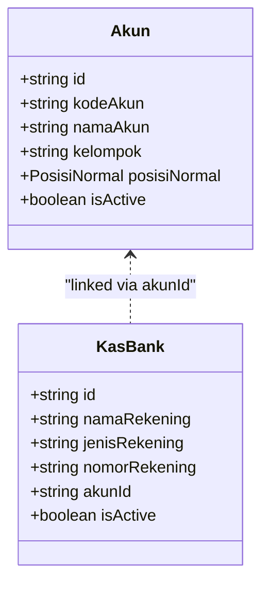

**Diagram sources**
- [schema.prisma](file://prisma/schema.prisma)
- [akun/route.ts](file://src/app/api/finance/akun/route.ts)
- [kas-bank/route.ts](file://src/app/api/finance/kas-bank/route.ts)

**Section sources**
- [schema.prisma](file://prisma/schema.prisma)
- [akun/route.ts](file://src/app/api/finance/akun/route.ts)
- [kas-bank/route.ts](file://src/app/api/finance/kas-bank/route.ts)

### Journal Entry Processing
- Purpose: Centralized double-entry posting for all financial transactions.
- Features:
  - Manual entries with reversal support
  - Soft deletion cascading to related records
  - Filtering by date range, search terms, and account groups
  - Automatic posting references and optional supporting documents

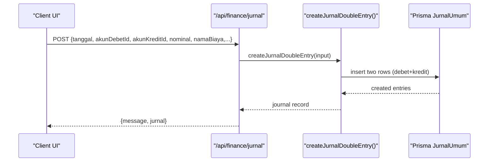

**Diagram sources**
- [jurnal/route.ts](file://src/app/api/finance/jurnal/route.ts)
- [finance.ts](file://src/lib/finance.ts)
- [schema.prisma](file://prisma/schema.prisma)

**Section sources**
- [jurnal/route.ts](file://src/app/api/finance/jurnal/route.ts)
- [finance.ts](file://src/lib/finance.ts)
- [schema.prisma](file://prisma/schema.prisma)

### Multi-Rekening (Cash/Bank Accounts)
- Purpose: Track multiple bank and cash accounts with real-time balances.
- Features:
  - List filtered by account type
  - Compute current balance by summing debet and kredit for each linked ledger account
  - Update account metadata (name, type, number, active flag)

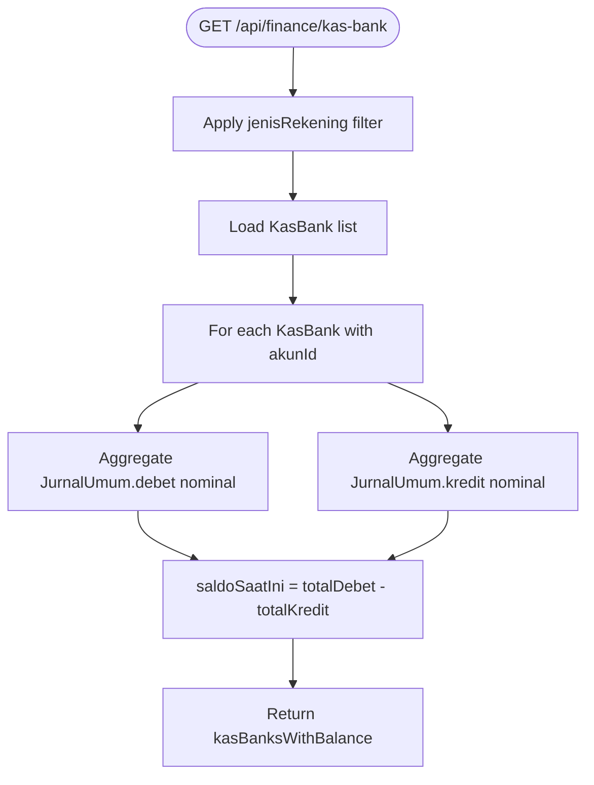

**Diagram sources**
- [kas-bank/route.ts](file://src/app/api/finance/kas-bank/route.ts)
- [schema.prisma](file://prisma/schema.prisma)

**Section sources**
- [kas-bank/route.ts](file://src/app/api/finance/kas-bank/route.ts)
- [schema.prisma](file://prisma/schema.prisma)

### Automated Journal Entries
- Payments: Each payment generates two journal rows (income account vs customer account or cash).
- Inventory Receipts: Purchase receipts generate entries linking to supplier accounts and inventory accounts.
- Production Costs: Cost entries can be posted to expense accounts, later aggregated for cost center reporting.

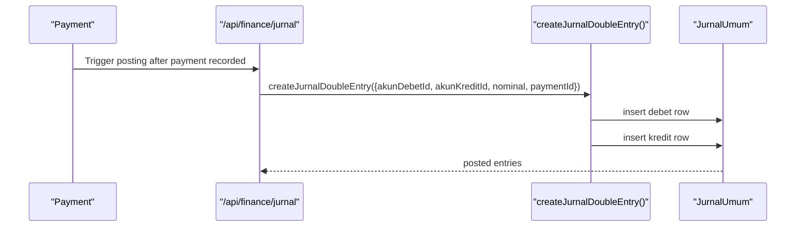

**Diagram sources**
- [jurnal/route.ts](file://src/app/api/finance/jurnal/route.ts)
- [finance.ts](file://src/lib/finance.ts)
- [schema.prisma](file://prisma/schema.prisma)

**Section sources**
- [schema.prisma](file://prisma/schema.prisma)
- [jurnal/route.ts](file://src/app/api/finance/jurnal/route.ts)
- [finance.ts](file://src/lib/finance.ts)

### Financial Statement Generation
- Profit & Loss (Income Statement):
  - Aggregates by account group (Pendapatan increases on credit; Beban increases on debit)
  - Computes totals and margin percentage
- Balance Sheet:
  - Accumulates journals up to a given period
  - Groups by asset/liability/equity and computes totals
  - Validates equality with rounding tolerance

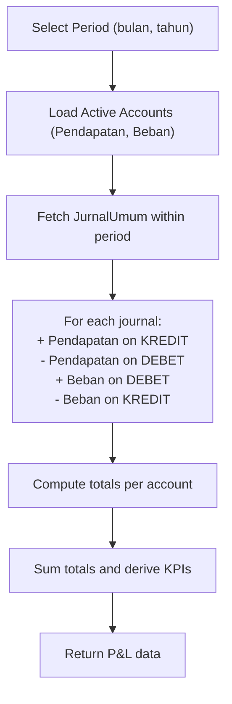

**Diagram sources**
- [laba-rugi/route.ts](file://src/app/api/reports/finance/laba-rugi/route.ts)
- [schema.prisma](file://prisma/schema.prisma)

**Section sources**
- [laba-rugi/route.ts](file://src/app/api/reports/finance/laba-rugi/route.ts)
- [neraca/route.ts](file://src/app/api/reports/finance/neraca/route.ts)
- [schema.prisma](file://prisma/schema.prisma)

### Receivable/Payable Tracking
- Receivables:
  - Orders with unpaid status accumulate outstanding amounts
  - Dashboard computes total receivables by subtracting payments from order totals
- Payables:
  - Inventory receipts link to supplier accounts; future payable tracking can be implemented similarly

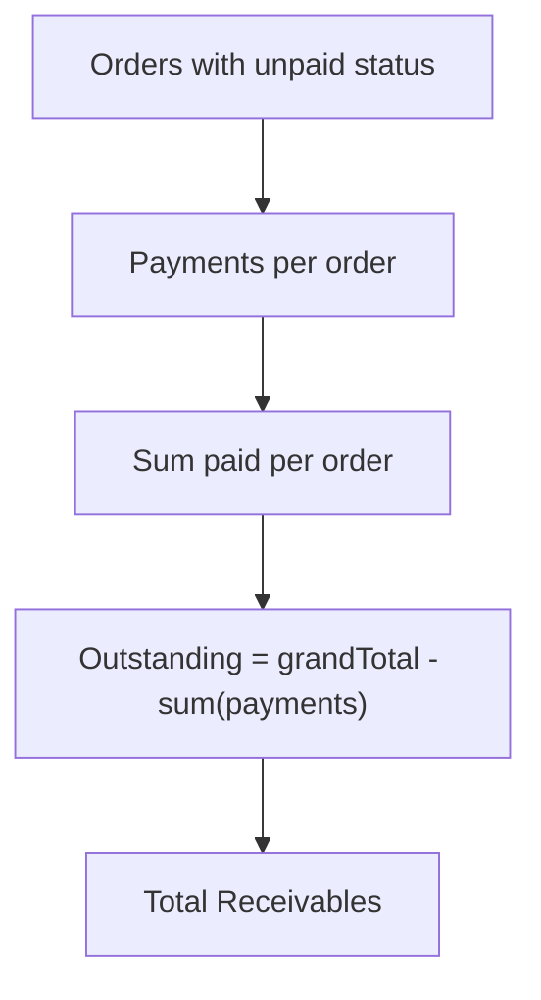

**Diagram sources**
- [dashboard/route.ts](file://src/app/api/finance/dashboard/route.ts)
- [schema.prisma](file://prisma/schema.prisma)

**Section sources**
- [dashboard/route.ts](file://src/app/api/finance/dashboard/route.ts)
- [schema.prisma](file://prisma/schema.prisma)

### Cost Center and Variance Analysis
- Cost Allocation:
  - Monthly cost report groups expenses by expense account
- Variance Analysis:
  - Dashboard compares monthly and yearly aggregates against previous periods
  - Provides trend indicators for revenue, expenses, and net profit

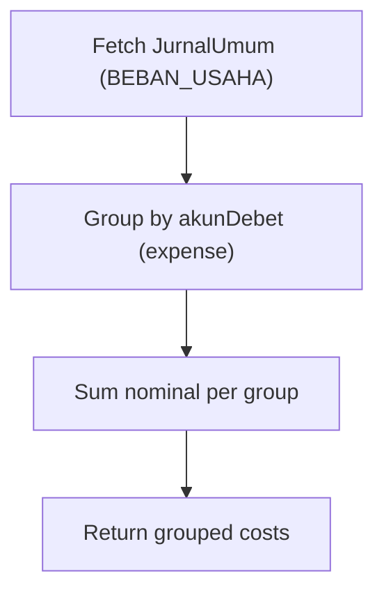

**Diagram sources**
- [cost/route.ts](file://src/app/api/reports/finance/cost/route.ts)
- [schema.prisma](file://prisma/schema.prisma)

**Section sources**
- [cost/route.ts](file://src/app/api/reports/finance/cost/route.ts)
- [dashboard/route.ts](file://src/app/api/finance/dashboard/route.ts)
- [schema.prisma](file://prisma/schema.prisma)

### Tax Reporting Capabilities
- The system supports tax reporting readiness by:
  - Maintaining supporting documents (buktiNota) in journal entries
  - Recording transaction references (ref) for audit trails
  - Grouping transactions by account categories for VAT and expense categorization
- Implementation note: Specific tax calculation logic (e.g., VAT rates) is not present in the current schema and would require extension of journal entries and reporting filters.

**Section sources**
- [jurnal/route.ts](file://src/app/api/finance/jurnal/route.ts)
- [schema.prisma](file://prisma/schema.prisma)

### Integration with Order Processing, Inventory, and Production
- Orders:
  - Payment events trigger automated journal entries to income and receivable accounts
- Inventory:
  - Purchase receipts link to supplier accounts and inventory accounts
- Production:
  - Cost entries can be posted to expense accounts; later aggregated for cost center reporting

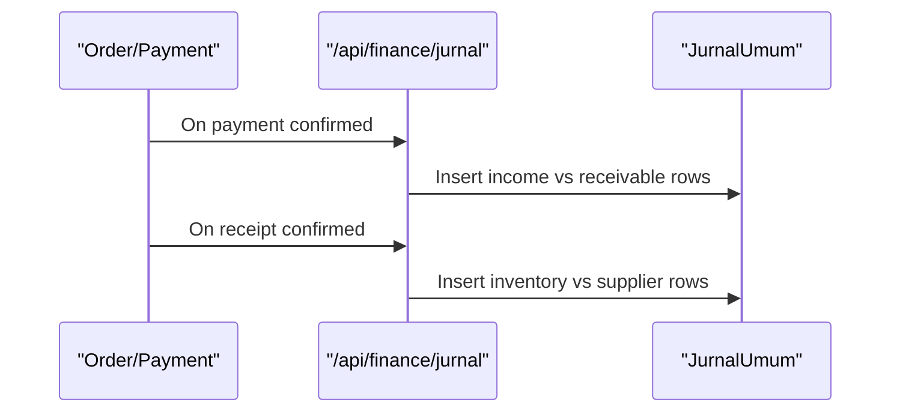

**Diagram sources**
- [jurnal/route.ts](file://src/app/api/finance/jurnal/route.ts)
- [schema.prisma](file://prisma/schema.prisma)

**Section sources**
- [schema.prisma](file://prisma/schema.prisma)
- [jurnal/route.ts](file://src/app/api/finance/jurnal/route.ts)

## Dependency Analysis
- Entities:
  - JurnalUmum depends on Akun for debet and kredit sides
  - KasBank optionally references Akun for balance computation
  - AppSetting references Akun for default revenue account
- API routes depend on Prisma models and the finance utility
- Reports depend on aggregated queries over JurnalUmum and Akun

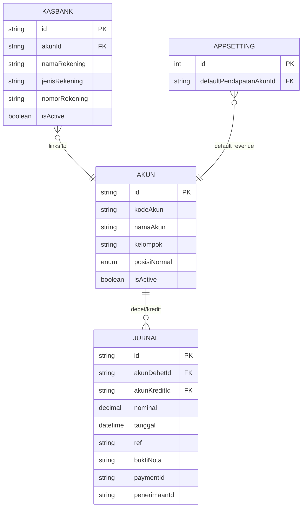

**Diagram sources**
- [schema.prisma](file://prisma/schema.prisma)

**Section sources**
- [schema.prisma](file://prisma/schema.prisma)

## Performance Considerations
- Indexing:
  - JurnalUmum has indexes on date, debet/kredit accounts, and related foreign keys
- Aggregation:
  - Reports use aggregate queries to avoid loading full datasets
- Pagination:
  - Journal listing supports limit parameters
- Concurrency:
  - Batch operations use database transactions to maintain consistency

[No sources needed since this section provides general guidance]

## Troubleshooting Guide
Common issues and resolutions:
- Unauthorized/Forbidden:
  - Ensure user role is admin or kasir for finance endpoints
- Validation errors:
  - Nominal must be positive; debet and kredit must differ; required fields must be present
- Soft deletion:
  - Deleting a journal triggers soft delete and cascades to related records
- Duplicate account code:
  - Creating an account with existing code is rejected

**Section sources**
- [akun/route.ts](file://src/app/api/finance/akun/route.ts)
- [jurnal/route.ts](file://src/app/api/finance/jurnal/route.ts)
- [kas-bank/route.ts](file://src/app/api/finance/kas-bank/route.ts)

## Conclusion
The financial accounting system provides a robust foundation for chart of accounts, double-entry journaling, multi-rekening cash flow tracking, and financial reporting. Automated journal entries integrate with payments and inventory receipts, while dashboard and report endpoints enable operational insights and compliance-ready records. Extending the system to include tax-specific calculations and budget targets would further enhance its capabilities.

## Appendices

### Practical Workflows and Examples
- Chart of Accounts Setup:
  - Create an account under a group; optionally auto-create a linked bank/cash account
- Journal Entry Automation:
  - After recording a payment, the system posts debet and kredit rows to income and receivable accounts
- Financial Reporting:
  - Generate monthly profit & loss and balance sheet by selecting period
- Receivable Tracking:
  - Review outstanding orders and compute total receivables from payments
- Cash Flow Management:
  - Monitor current balances across multiple bank and cash accounts

[No sources needed since this section provides general guidance]